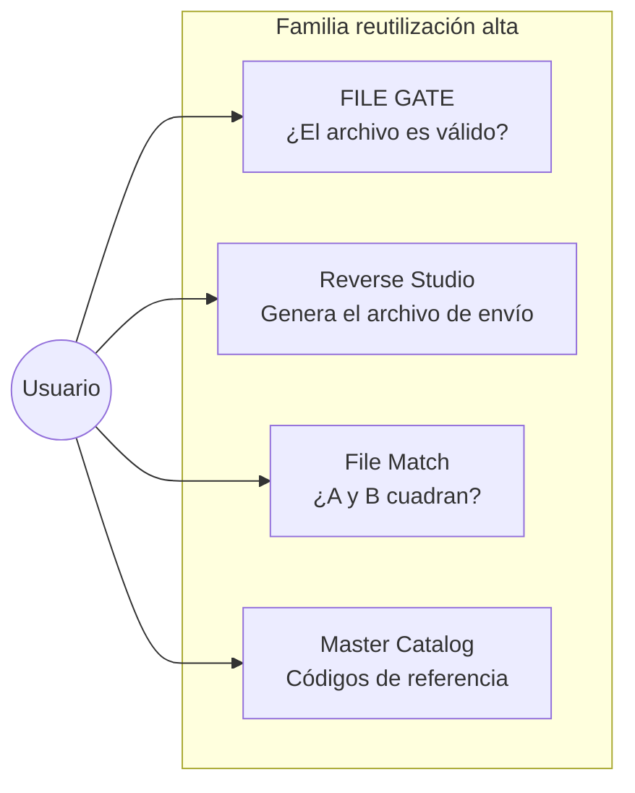
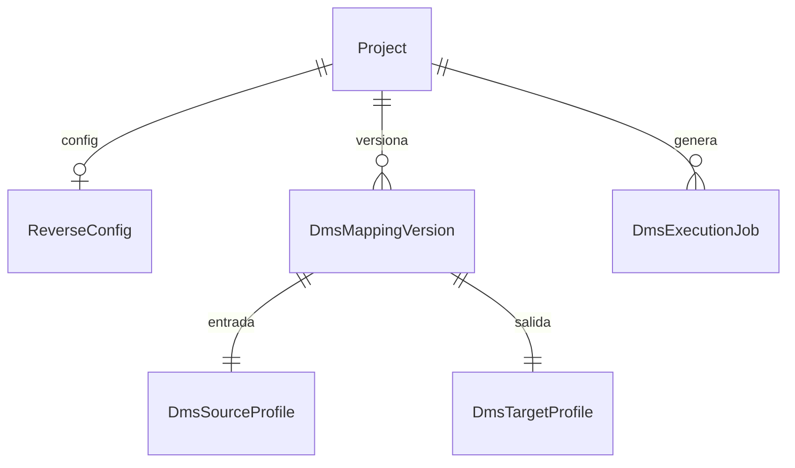
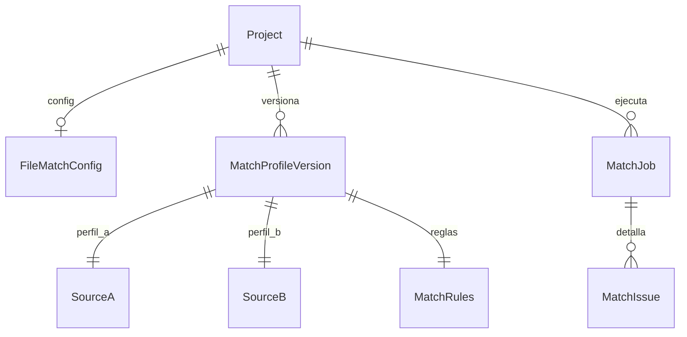
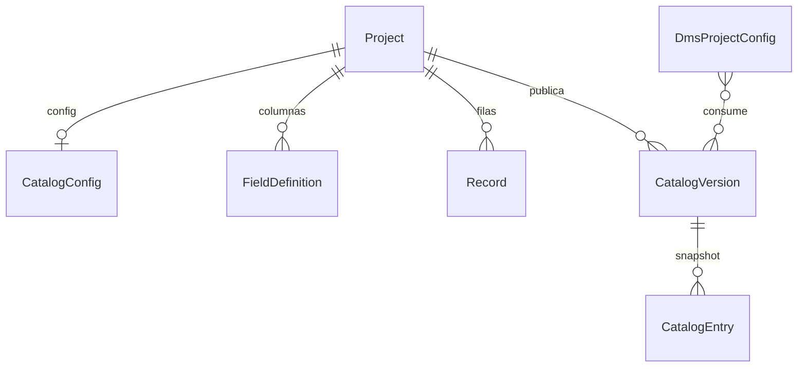
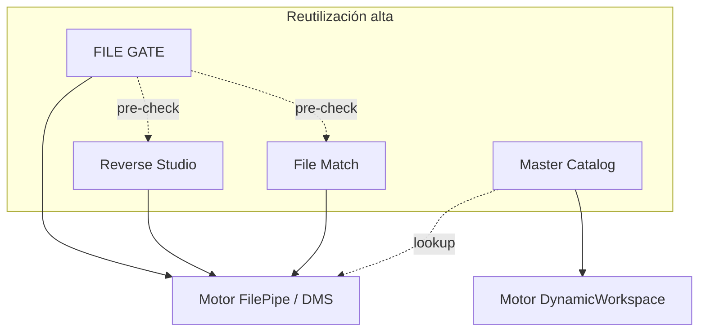

# APP FACTORY §2 — Reutilización alta

> **Nombre mnemotécnico:** `REUSE_HIGH`  
> Alias: *Mismo motor, poca obra nueva*  
> Archivo: [`docs/APP_FACTORY_HIGH_REUSE.md`](APP_FACTORY_HIGH_REUSE.md)  
> Origen: [`APP_FACTORY.md`](APP_FACTORY.md) §2  
> Estilo: hermano de [`FILE_GATE.md`](FILE_GATE.md) / [`DataMappingStudio.md`](DataMappingStudio.md)

---

## 0. Para qué sirve este documento

### Qué es

Este archivo es la **propuesta de producto** de la familia «reutilización alta» de APP_FACTORY. No es código ni un manual de usuario: es el lugar donde se decide **qué apps conviene construir después de FILE GATE**, reaprovechando FilePipe (DMS) y DynamicWorkspace.

### Qué función cumple

| Función | Descripción |
|---------|-------------|
| **Aclarar ideas** | Explicar en lenguaje de negocio qué hace cada aplicativo y qué problema resuelve |
| **Delimitar alcance** | Separar qué entra en el MVP, qué queda fuera y qué no debe confundirse con FilePipe |
| **Priorizar** | Ordenar Reverse Studio → Conciliador → Catálogos tras el validador ya entregado |
| **Preparar implementación** | Dejar módulos, kind, fronteras y próximos pasos listos para un doc hijo + rama Git |

### Alcance de *este* documento (sí / no)

| Sí (este doc) | No (este doc) |
|---------------|---------------|
| Definir 3 propuestas + referenciar FILE GATE | Implementar código Django |
| Describir función, flujo y MVP de cada vertical | Sustituir [`FILE_GATE.md`](FILE_GATE.md) (ese producto ya tiene su doc) |
| Comparar verticales entre sí y con FilePipe | Specs de pantalla paso a paso (eso irá en `definition_app_*` al priorizar) |
| Decidir criterio de “reutilización alta” | Roadmap de §3/§4 de APP_FACTORY (formularios, CRM, etc.) |

### En una frase: qué hace cada app de la familia

| Aplicativo | Función (qué hace) | Resultado que entrega al usuario |
|------------|--------------------|----------------------------------|
| **FILE GATE** | Comprueba si un archivo cumple un contrato | Informe OK / errores (**no** genera archivo de negocio) |
| **Reverse Studio** | Convierte un Excel/CSV “fácil” al formato rígido que exige el banco/ERP | **Archivo de salida** (TXT posicional, JSON, XML…) |
| **File Match** | Cruza dos archivos por una clave y detecta diferencias | **Informe de conciliación** (faltan / sobran / no coinciden) |
| **Master Catalog** | Mantiene tablas de códigos y equivalencias versionadas | **Catálogo publicado** que alimenta reglas DMS / validaciones |



---

## 1. Resumen ejecutivo

### Idea central

Ya existe un **chasis** (compañía, login, roles, billing) y dos **motores**:

1. **FilePipe / DMS** — leer archivos, mapear campos, aplicar reglas, escribir otro formato, informar errores.
2. **DynamicWorkspace** — definir columnas y guardar filas (registros) sin programar.

Las apps de §2 **no inventan un motor nuevo**. Empaquetan esos motores con un propósito de negocio claro y una UI propia (`project_kind`).

```
Chasis (Company · seguridad · billing · roles)
        +
Motor ya existente (DMS  ó  Records/Fields)
        +
Capa delgada de producto (hub · textos · informe · historial)
        =
Aplicativo vendible sin reescribir el ETL
```

### Inventario

| Aplicativo | Nemotécnico | Estado | Dónde está el detalle |
|------------|-------------|--------|------------------------|
| **Validador de archivos** | `FILE_GATE` | **Hecho** (M1–M6) | [`FILE_GATE.md`](FILE_GATE.md) |
| **Reverse Studio** | `REVERSE_STUDIO` | **En definición / implementación** | [`REVERSE_STUDIO.md`](REVERSE_STUDIO.md) · resumen §3 |
| **Conciliador de archivos** | `FILE_MATCH` | **En definición** | [`FILE_MATCH.md`](FILE_MATCH.md) · resumen §4 |
| **Catálogos / maestros** | `MASTER_CATALOG` | Propuesta | §5 de este archivo |

### Por qué existen (problema → solución)

| Aspecto | Descripción |
|---------|-------------|
| **Problema** | Cada necesidad “parecida a transformar archivos” termina en un script o en montar un FilePipe completo aunque el usuario solo quiera validar, emitir o comparar |
| **Solución** | Productos estrechos, con nombre y flujo claros, encima del mismo motor |
| **Beneficio** | Menos tiempo a MVP, mismo login/tenant/deploy, portfolio coherente |
| **Filtro §2** | Si ~70 % o más del trabajo ya está en DMS/workspace → pertenece aquí |

### Qué reutiliza cada uno

| Pieza de plataforma | FILE GATE | Reverse | Match | Catálogo |
|---------------------|-----------|---------|-------|----------|
| Chasis multi-tenant | Sí | Sí | Sí | Sí |
| Parsers / SourceProfile | Sí | Sí | Sí (×2) | No |
| Target + serializar salida | No | Sí | No | No |
| Mapeo + reglas DMS | No* | Sí | No | Consume lookup |
| Records / FieldDefinition | No | No | No | Sí |

\*FILE GATE valida campos del origen; no mapea a un destino de negocio.

---

## 2. Importancia de la familia

1. **Aprovechar lo ya pagado** — el costo fijo del motor DMS/workspace ya está; estas apps son ensamble + UX.
2. **Hablar el idioma del cliente** — “validar el archivo del proveedor”, “generar el TXT del banco”, “cuadrar banco vs ERP”, “mantener el maestro de códigos”.
3. **Orden natural** — primero calidad (GATE), luego emisión (Reverse), luego cruce (Match), luego gobernanza de códigos (Catalog).
4. **Bajo riesgo técnico** — el riesgo es de producto (claridad), no de inventar parsers.
5. **Se refuerzan entre sí** — un catálogo mejora lookups; GATE puede ser pre-check de Reverse/Match.

---

## 3. REVERSE STUDIO — CSV/Excel → posicional / JSON / XML

> **Documento canónico de producto:** [`REVERSE_STUDIO.md`](REVERSE_STUDIO.md)  
> **Nemotécnico:** `REVERSE_STUDIO` · **Kind propuesto:** `reverse`  
> Lo que sigue es el **resumen** dentro de la familia §2; los lineamientos de desarrollo viven en el doc hijo.

### 3.0 Qué es, qué hace y para qué sirve

| Pregunta | Respuesta corta |
|----------|-----------------|
| **¿Qué es?** | Un aplicativo para **generar el archivo que el banco/ERP exige**, partiendo de un Excel o CSV que el negocio sí sabe llenar. |
| **¿Qué hace?** | Lee CSV/Excel → aplica mapeo/reglas → **escribe** TXT posicional, JSON o XML. |
| **¿Qué no hace?** | No es un ETL genérico de cualquier formato a cualquier formato (eso es FilePipe). En el MVP la entrada está acotada a CSV/Excel. |
| **¿Para quién?** | Operaciones / tesorería / RRHH que deben “mandar el archivo en el layout del receptor”. |
| **Función en la plataforma** | Empaqueta el motor DMS completo (origen + destino + mapeo + ejecución) con UX de **emisión**, no de pipeline abierto. |

**Flujo de usuario (función operativa):**

1. Definir qué columnas trae el Excel/CSV.  
2. Definir cómo debe verse el archivo de salida (posiciones, tags, etc.).  
3. Mapear columna → campo de salida.  
4. Subir el Excel del mes y **descargar** el archivo listo para enviar.

### 3.1 Problema

- El ERP o el banco exige TXT posicional / XML rígido.
- El área de negocio solo maneja Excel o CSV.
- Hoy: scripts one-off o un proyecto DMS completo que pocos entienden como “solo exportar al formato del banco”.

### 3.2 Solución

Proyecto con `project_kind` dedicado (propuesta: `reverse`) donde:

1. El **origen** es CSV / Excel / delimitado (perfil Source).
2. El **destino** es posicional / JSON / XML (perfil Target + serializadores existentes).
3. El **mapeo y reglas** son el mismo motor DMS, con UX orientada a “generar archivo de envío”, no a “pipeline ETL genérico”.

```
CSV / Excel (negocio)
        →
Parse + map + rules (motor DMS)
        →
TXT posicional / JSON / XML (contrato del receptor)
```

### 3.3 Alcance (qué entra y qué no)

**Alcance de producto:** solo el camino *entrada fácil → salida rígida*. Si el cliente necesita orígenes XML complejos o varios destinos a la vez, usa FilePipe.

| Incluido en MVP | Fuera de alcance (MVP) |
|-----------------|------------------------|
| Proyecto/kind “Reverse Studio” + hub propio | Scheduling / API pública |
| Entrada: CSV / Excel / delimitado | Inventar parsers nuevos |
| Salida: TXT posicional, JSON, XML (serializers ya existentes) | Conciliar después del envío |
| Mapeo y reglas DMS actuales | UI de reglas distinta a la de FilePipe |
| Dry run, job, **descarga del archivo generado**, historial | Multi-destino en un solo job |

### 3.4 Frontera con FilePipe

| FilePipe (DMS) | Reverse Studio |
|----------------|----------------|
| Origen y destino simétricos / genéricos | Narrativa: **entrada fácil → salida rígida** |
| Hub de definición largo (origen+destino+mapeo+reglas) | Misma potencia; wizard acotado y copy de “emisión” |
| Puede hacer el mismo job técnicamente | Producto empaquetado para un caso de uso |

**Regla:** no duplicar el motor; si un cliente necesita ETL genérico, usa FilePipe. Reverse Studio es el **paquete** “exportar al layout del banco/ERP”.

### 3.5 Módulos sugeridos

| Módulo | Contenido | Reuso |
|--------|-----------|-------|
| 1 · Contrato de entrada | SourceProfile CSV/XLSX | `source_profile` |
| 2 · Contrato de salida | TargetProfile posicional/JSON/XML | `target_profile` |
| 3 · Mapeo y reglas | Field mapping + transform rules | `field_mapping`, `transform_rules` |
| 4 · Generar archivo | Intake + transform execution | `file_intake`, `transform_execution` |
| 5 · Historial / evidencia | Jobs + descarga output | Misma familia que DMS |
| 6 · (Opcional) Pre-check FILE GATE | Exigir gate en verde sobre el CSV de entrada | Bridge ya existente |

### 3.6 Casos de negocio

| # | Caso |
|---|------|
| R1 | Excel de pagos → TXT posicional del banco |
| R2 | CSV RRHH → XML de nómina del proveedor de pagos |
| R3 | Planilla de altas → JSON de API batch del ERP |
| R4 | Plantilla mensual reutilizable: mismo mapeo, nuevo Excel cada mes |

### 3.7 Roles

Misma matriz PA / ED / GE / CO que FilePipe (diseñar vs ejecutar vs consultar).

### 3.8 Modelo conceptual (borrador)



Preferencia: **reutilizar modelos DMS** (`project_kind=reverse` + mismos `Dms*` bajo el proyecto) en lugar de tablas nuevas. La diferenciación es de producto/UX, no de esquema.

### 3.9 Decisiones abiertas

| # | Tema | Recomendación |
|---|------|---------------|
| 1 | ¿Kind `reverse` o modo de DMS? | Kind propio + servicios DMS compartidos |
| 2 | ¿Forzar origen solo CSV/XLSX? | Sí en MVP (claridad de producto) |
| 3 | ¿Compartir versión con un proyecto DMS? | No en MVP; plantillas Fase 2 |
| 4 | Nombre comercial | Reverse Studio / Emisor de layouts |

### 3.10 Criterio APP_FACTORY

| Criterio | ¿Cumple? |
|----------|----------|
| Company + seguridad + billing | Sí |
| `project_kind` | Sí (`reverse`) |
| Usa motor ETL | Sí (completo, con serialización) |
| MVP acotado | Sí |
| Diferenciador vs FilePipe | Sí — empaquetado “entrada fácil → salida legacy” |

### 3.11 Próximos pasos (cuando se priorice)

Seguir [`REVERSE_STUDIO.md`](REVERSE_STUDIO.md) §18. Resumen:

1. Rama `feature/reverse-studio` desde `main`.
2. `definition_app_REVERSE/` + prototipos.
3. App delgada + servicios DMS; módulos en orden 1→6.
4. Merge a `main` con MVP revisado (sin deploy desde la feature).

---

## 4. FILE MATCH — Conciliador de archivos

> **Nemotécnico:** `FILE_MATCH` · **Kind propuesto:** `file_match`  
> **Documento de producto:** [`FILE_MATCH.md`](FILE_MATCH.md) (lineamientos completos; este §4 es el resumen en el paraguas §2).  
> **Rama Git:** `feature/file-match` (no desplegar a producción hasta merge a `main`).

### 4.0 Qué es, qué hace y para qué sirve

| Pregunta | Respuesta corta |
|----------|-----------------|
| **¿Qué es?** | Un aplicativo para **cuadrar dos archivos** (p. ej. banco vs ERP) y saber qué falta, qué sobra o qué no coincide. |
| **¿Qué hace?** | Lee archivo A y archivo B → cruza por clave(s) → compara campos → emite un **informe de diferencias**. |
| **¿Qué no hace?** | No transforma ni “arregla” los archivos. No es contabilidad completa ni matching difuso/IA en el MVP. |
| **¿Para quién?** | Tesorería, operaciones, auditoría, control de intercambios. |
| **Función en la plataforma** | Reutiliza el parseo DMS **dos veces** y añade un comparador delgado; la salida es evidencia, no un tercer archivo de negocio. |

**Flujo de usuario (función operativa):**

1. Definir cómo se lee el archivo A.  
2. Definir cómo se lee el archivo B.  
3. Elegir la clave de cruce (documento, NIT+fecha, etc.) y qué campos comparar (monto, estado…).  
4. Subir A y B → ver resumen y descargar detalle (matched / solo A / solo B / montos distintos).

### 4.1 Problema

- Tesorería: extracto bancario vs libro ERP.
- Operaciones: archivo del proveedor vs archivo interno del día.
- Auditoría: dos exportaciones “deberían ser iguales” y no lo son.
- Hoy: VLOOKUP en Excel, scripts frágiles, sin historial ni roles.

### 4.2 Solución

Proyecto `project_kind` (propuesta: `file_match`) donde el usuario:

1. Define **Origen A** (perfil + captura + campos).
2. Define **Origen B** (otro perfil; puede ser otro tipo de archivo).
3. Declara **clave de cruce** (uno o más campos) y **campos a comparar**.
4. Sube ambos archivos (o uno fijo + uno variable).
5. Obtiene un informe: matched / only_A / only_B / value_mismatch.

```
Archivo A ──parse──┐
                   ├─ match por clave ─→ Informe de conciliación
Archivo B ──parse──┘
```

### 4.3 Alcance (qué entra y qué no)

**Alcance de producto:** comparación **1:1 por clave** entre exactamente **dos** archivos. El valor entregable es el informe; no hay archivo destino “corregido”.

| Incluido en MVP | Fuera de alcance (MVP) |
|-----------------|------------------------|
| Dos perfiles de origen versionados en el mismo proyecto | Generar un tercer archivo “ya conciliado” |
| Clave simple o compuesta | Fuzzy match / IA / probabilidad |
| Comparación exacta (con trim / mayúsculas básicas) | Conciliación contable multi-moneda avanzada |
| Informe JSON/CSV + conteos + historial | Tres o más lados (A/B/C) |

### 4.4 Frontera con otros verticales

| Vertical | Relación |
|----------|----------|
| FILE GATE | Puede validar A y B **antes** de conciliar (opcional) |
| FilePipe | No genera destino; solo diferencias |
| Catálogos | Pueden normalizar códigos antes del match (Fase 2) |

### 4.5 Módulos sugeridos

| Módulo | Contenido |
|--------|-----------|
| 1 · Perfil A | SourceProfile lado A |
| 2 · Perfil B | SourceProfile lado B |
| 3 · Reglas de cruce | Claves, campos comparados, normalización, tolerancia numérica opcional |
| 4 · Ejecutar | Upload A+B (o reutilizar archivos del intake) → job de match |
| 5 · Informe | Conteos + detalle por clave + descarga |
| 6 · Historial | Auditoría de conciliaciones |

### 4.6 Reglas de negocio (borrador)

| ID | Regla |
|----|-------|
| M1 | Solo se ejecuta contra versiones **publicadas** de ambos perfiles. |
| M2 | Una fila de A puede matchear a lo sumo una de B por clave (1:1 en MVP). |
| M3 | Claves duplicadas en un lado → error de integridad o bucket `duplicate_key`. |
| M4 | Campos no seleccionados para comparar se ignoran en el veredicto. |
| M5 | El job es de solo lectura sobre A y B. |

### 4.7 Resultados de job

| Estado / bucket | Significado |
|-----------------|-------------|
| `matched` | Misma clave; valores comparados iguales |
| `value_mismatch` | Misma clave; al menos un campo difiere |
| `only_a` | Clave solo en A |
| `only_b` | Clave solo en B |
| `failed` | No se pudo parsear / claves inválidas / abort |

Veredicto agregado (configurable):

- `passed` si solo hay `matched` (y opcionalmente mismatches bajo umbral).
- `failed` si hay `only_*` o mismatches por encima de umbral.

### 4.8 Casos de negocio

| # | Caso |
|---|------|
| C1 | Extracto banco (CSV) vs movimientos ERP (TXT) |
| C2 | Facturación proveedor vs recepción interna |
| C3 | Dos exportaciones del mismo reporte “antes/después” de un cambio |
| C4 | Nómina enviada vs acuse del banco (por documento + monto) |

### 4.9 Ejemplo

**Clave:** `documento`  
**Comparar:** `monto`

| documento | A.monto | B.monto | Resultado |
|-----------|---------|---------|-----------|
| 1001 | 500 | 500 | matched |
| 1002 | 200 | 250 | value_mismatch |
| 1003 | 100 | — | only_a |
| 1004 | — | 80 | only_b |

### 4.10 Modelo conceptual (borrador)



Implementación preferida: dos `DmsSourceProfile` (o snapshots) + JSON `match_rules` + job propio o especialización de `DmsExecutionJob` sin target.

### 4.11 Decisiones abiertas

| # | Tema | Recomendación |
|---|------|---------------|
| 1 | ¿1:1 estricto o 1:N? | 1:1 en MVP |
| 2 | ¿Tolerancia decimal? | Opcional Fase 2 (`abs(diff) <= epsilon`) |
| 3 | ¿Un archivo “maestro” fijo? | Fase 2 (baseline versionado) |
| 4 | Nombre | File Match / Conciliador |

### 4.12 Criterio APP_FACTORY

| Criterio | ¿Cumple? |
|----------|----------|
| Chasis | Sí |
| `project_kind` | Sí (`file_match`) |
| Motor | Sí (doble parse + comparador nuevo delgado) |
| MVP acotado | Sí |
| Diferenciador | Sí — **dos orígenes, cero destino de negocio** |

### 4.13 Próximos pasos

1. Seguir el plan en [`FILE_MATCH.md`](FILE_MATCH.md) §18 (rama `feature/file-match`).
2. Prototipo de reglas de cruce + informe de diferencias.
3. Spike de rendimiento (archivos medianos en memoria vs sort-merge).
4. `definition_app_FILE_MATCH/` con módulos 1–7 (+ bridge Fase 2).
5. PR a `main` cuando el MVP esté revisado (no desplegar desde la feature).

---

## 5. MASTER CATALOG — Catálogos / maestros gestionados

> **Nemotécnico:** `MASTER_CATALOG` · **Kind propuesto:** `catalog` (o plantilla sobre `workspace`)

### 5.0 Qué es, qué hace y para qué sirve

| Pregunta | Respuesta corta |
|----------|-----------------|
| **¿Qué es?** | Un aplicativo para **mantener tablas de códigos de negocio** (bancos, sucursales, estados, equivalencias) con dueño, historial y versión publicada. |
| **¿Qué hace?** | Define columnas del maestro → carga/edita filas (o importa Excel) → **publica un snapshot** que otras apps consultan. |
| **¿Qué no hace?** | No transforma archivos por sí solo. No reemplaza los catálogos técnicos de plataforma (`SourceFileType`, etc.). |
| **¿Para quién?** | Analistas / operaciones que hoy guardan “el Excel de códigos” y lo pegan en reglas a mano. |
| **Función en la plataforma** | Gobernanza de **datos de referencia** sobre DynamicWorkspace; FilePipe/FILE GATE **consumen** el catálogo vía `lookup` / `replace_map` (y validaciones futuras). |

**Flujo de usuario (función operativa):**

1. Crear el maestro (p. ej. columnas `code`, `label`, `activo`).  
2. Cargar las filas o importar Excel.  
3. Publicar versión vN.  
4. En un proyecto DMS (o GATE), la regla dice: “traduce este código usando catálogo bancos@vN”.

### 5.1 Problema

- Los mapeos de códigos viven en Excel del analista o hardcodeados en reglas.
- Cambiar “código banco 014 → BNC” implica republicar pipelines a ciegas.
- No hay dueño claro, historial ni rol para mantener el maestro.

### 5.2 Solución

Proyecto `project_kind` (propuesta: `catalog` o reutilizar `workspace` con plantilla) que:

1. Define un esquema de maestro (código, etiqueta, atributos, vigencia).
2. Permite CRUD / import Excel de filas (`Record` + `FieldValue`).
3. Expone el maestro como **fuente de lookup** para proyectos DMS (y opcionalmente FILE GATE).
4. Versiona publicaciones del catálogo (snapshot inmutable consumido por reglas).

```
Maestro (Workspace / Records)
        →
Publicar versión de catálogo
        →
Regla DMS replace_map / lookup  (y validadores)
```

### 5.3 Alcance (qué entra y qué no)

**Alcance de producto:** ser la **fuente de verdad de códigos del tenant**. El “trabajo pesado” de transformar archivos sigue en FilePipe; el catálogo solo alimenta traducciones y validaciones.

| Incluido en MVP | Fuera de alcance (MVP) |
|-----------------|------------------------|
| Proyecto/plantilla “Catálogo” sobre esquema dinámico | Motor de reglas ETL nuevo |
| Campos tipo `code`, `label`, opcionales, `active` | Workflow de aprobación multi-nivel |
| Import / export Excel + publicar snapshot | Sync automático desde el ERP |
| Consumo desde reglas DMS `lookup` / `replace_map` | Linaje gráfico completo |
| Auditoría básica de cambios de fila | Catálogos compartidos entre compañías |

### 5.4 Frontera

| Pieza | Relación |
|-------|----------|
| DynamicWorkspace | **Motor principal** (FieldDefinition / Record) |
| DMS `replace_map` / `lookup` | **Consumidor** del snapshot |
| FILE GATE | Fase 2: validar que un campo ∈ catálogo publicado |
| System catalogs (`SourceFileType`, etc.) | Distinto: catálogos de plataforma vs maestros de negocio del tenant |

### 5.5 Módulos sugeridos

| Módulo | Contenido |
|--------|-----------|
| 1 · Definir columnas del maestro | Wizard corto sobre FieldDefinition |
| 2 · Cargar / editar filas | Listado + import Excel |
| 3 · Publicar catálogo | Snapshot versionado (JSON o tabla inmutable) |
| 4 · Vincular a proyectos DMS | Selector de catálogo + campo clave/valor en reglas |
| 5 · Historial de cambios | Quién / cuándo / diff de filas (básico) |

### 5.6 Reglas de negocio (borrador)

| ID | Regla |
|----|-------|
| K1 | Las reglas DMS solo leen versiones **publicadas** del catálogo. |
| K2 | Editar el borrador no cambia jobs ya ejecutados. |
| K3 | `code` único por catálogo (case policy configurable). |
| K4 | Filas inactivas no participan en lookup (pero permanecen auditables). |
| K5 | Un proyecto DMS puede vincular 0..N catálogos. |

### 5.7 Casos de negocio

| # | Caso |
|---|------|
| T1 | Equivalencia código sucursal interno ↔ código banco |
| T2 | Catálogo de estados de pedido usados en validación y en replace |
| T3 | Lista de NITs autorizados (gate + lookup) |
| T4 | Monedas / países ISO mantenidos por operaciones |

### 5.8 Ejemplo de consumo DMS

```json
{
  "rule": "lookup",
  "source_field": "cod_banco_in",
  "catalog": "bancos_ve@v3",
  "key": "code",
  "value": "label",
  "on_miss": "error"
}
```

### 5.9 Modelo conceptual (borrador)



MVP puede serializar el snapshot como JSON en `CatalogVersion.payload` para no complicar el join en el motor de reglas.

### 5.10 Decisiones abiertas

| # | Tema | Recomendación |
|---|------|---------------|
| 1 | ¿Kind nuevo `catalog` o plantilla `workspace`? | Kind `catalog` si la UX/consumo DMS es de primera clase; si no, plantilla workspace |
| 2 | ¿Dónde vive el binding a reglas? | En el proyecto DMS (referencia al catálogo publicado) |
| 3 | ¿Tamaño máximo de maestro? | Límite MVP (p. ej. 50k filas) + aviso |
| 4 | Nombre | Master Catalog / Maestros |

### 5.11 Criterio APP_FACTORY

| Criterio | ¿Cumple? |
|----------|----------|
| Chasis | Sí |
| `project_kind` / extensión | Sí |
| Usa esquema dinámico | Sí |
| MVP acotado | Sí |
| Diferenciador | Sí — **gobernanza de referencia** que alimenta ETL/validación |

### 5.12 Próximos pasos

1. Inventariar reglas DMS actuales (`replace_map`, `lookup`) y contrato de datos.
2. Prototipo: CRUD maestro + “Publicar vN” + selector en una regla demo.
3. `definition_app_MASTER_CATALOG/`.
4. Rama `feature/master-catalog`.

---

## 6. FILE GATE (referencia — ya entregado)

FILE GATE **no se redefine aquí**. Tiene documento y código propios.

| Pregunta | Respuesta |
|----------|-----------|
| **¿Qué es?** | El validador de archivos de la plataforma |
| **¿Qué hace?** | Define un contrato y comprueba si un archivo lo cumple |
| **¿Qué entrega?** | Veredicto + informe/certificado (**sin** archivo de negocio de salida) |
| **Documento** | [`FILE_GATE.md`](FILE_GATE.md) |
| **Código** | `apps/file_gate/` |
| **Rol en §2** | Primer vertical de reutilización alta **ya construido** (M1–M6 + bridge) |

**Lecciones para Reverse / Match / Catalog:** kind propio + servicios compartidos; publicar congela contrato; ayudas y `UI_MESSAGES` desde el inicio; bridge cuando el core ya funciona.

---

## 7. Comparativa de la familia §2

| Dimensión | FILE GATE | Reverse Studio | File Match | Master Catalog |
|-----------|-----------|----------------|------------|----------------|
| Entradas | 1 archivo | 1 archivo | 2 archivos | Filas / Excel |
| Salida de negocio | No | Sí (serializada) | No (solo diff) | No (datos maestros) |
| Motor principal | Parse + validate | Parse + map + serialize | Doble parse + compare | Records + publish |
| Obra nueva estimada | Baja (hecho) | Baja–media (skin + acotar UX) | Media (motor match) | Media (binding a reglas) |
| Dependencia | DMS source | DMS completo | DMS source ×2 | Workspace + DMS lookup |
| Prioridad sugerida post-GATE | — | 1º | 2º | 3º |



---

## 8. Arquitectura técnica compartida

| Capa | Enfoque |
|------|---------|
| Discriminador | `Project.project_kind` ∈ {`file_gate`, `reverse`, `file_match`, `catalog`, …} |
| UI | `templates/<app>/` + prototipos en `prototype/` |
| Servicios | Preferir importar desde `apps.dms.*` / `apps.projects.*`; no copiar parsers |
| Persistencia | Mínimo de modelos nuevos; JSON de reglas/config en config de proyecto |
| Mensajes | Extender [`UI_MESSAGES.md`](definition_app/UI_MESSAGES.md) por vertical |
| Deploy | Mismo Railway; migraciones solo si el vertical lo exige (como bridge FILE GATE) |

Estructura de carpetas propuesta al implementar:

```
docs/
├── APP_FACTORY.md
├── APP_FACTORY_HIGH_REUSE.md   ← este archivo
├── FILE_GATE.md
├── REVERSE_STUDIO.md           ← producto Reverse Studio (lineamientos)
├── FILE_MATCH.md               ← producto Conciliador (lineamientos; rama feature/file-match)
└── MASTER_CATALOG.md           ← opcional: extraer §5

apps/
├── file_gate/                  ← existe
├── reverse_studio/             ← futuro (o skin sobre dms)
├── file_match/                 ← futuro
└── master_catalog/             ← futuro (o plantilla workspace)
```

---

## 9. MVP por vertical (checklist condensado)

### Reverse Studio
- [ ] Kind + hub + copy de emisión
- [ ] Forzar Source CSV/XLSX + Target fixed/json/xml
- [ ] Reusar publish / execute / download output
- [ ] Ayuda + UI_MESSAGES

### File Match
- [ ] Dos perfiles Source + reglas de clave
- [ ] Job A+B + buckets matched / only_* / mismatch
- [ ] Informe CSV/JSON + historial
- [ ] Umbral de fallos configurable

### Master Catalog
- [ ] Esquema code/label (+ attrs)
- [ ] Import Excel + publicar snapshot
- [ ] Consumo desde una regla DMS `lookup`/`replace_map`
- [ ] Auditoría básica de cambios

---

## 10. Riesgos transversales

| # | Riesgo | Mitigación |
|---|--------|------------|
| 1 | Confundir Reverse con FilePipe | Copy, hub y límites de tipo de archivo claros |
| 2 | Match OOM en archivos grandes | Sort-merge / límites MVP documentados |
| 3 | Catálogos desalineados con reglas | Solo snapshots publicados; warning si la regla apunta a draft |
| 4 | Proliferación de kinds sin adopción | Priorizar de a uno; extraer doc hijo al iniciar implementación |
| 5 | Duplicar código de parsers | Regla de oro: servicios en `apps.dms`, apps nuevas delgadas |

---

## 11. Prioridad sugerida (post FILE GATE)

| Orden | Vertical | Por qué |
|-------|----------|---------|
| 1 | **Reverse Studio** | Máximo reuso del motor completo; demanda “Excel → banco” |
| 2 | **File Match** | Valor alto en finanzas; obra nueva acotada (comparador) |
| 3 | **Master Catalog** | Multiplica calidad de DMS/GATE; depende de diseñar bien el binding |

Alineado a [`APP_FACTORY.md`](APP_FACTORY.md) §5 (FILE GATE era #1 y ya está entregado).

---

## 12. Criterio de aceptación (familia §2)

Antes de abrir rama de implementación para cualquiera de estos verticales:

1. ¿Reutiliza Company + seguridad + billing?
2. ¿Kind (o plantilla) claro y no solapa FilePipe sin diferenciador?
3. ¿MVP &lt; 1 fase con formatos y pantallas acotados?
4. ¿Lista de módulos + prototipo antes de modelos?
5. ¿Plan de rama `feature/<slug>` y merge a `main` (Railway)?

---

## 13. Próximos pasos de diseño (documento)

1. Mantener este archivo como **paraguas §2** mientras las ideas estén en propuesta.
2. Al priorizar un vertical: extraer su sección a `docs/<NEMOTECNICO>.md` + `definition_app_<…>/` (como FILE GATE).
3. Actualizar [`APP_FACTORY.md`](APP_FACTORY.md) §8 (estado) y §2 (enlace a este doc).
4. No implementar los tres en paralelo: un vertical a la vez.

---

## 14. Glosario

| Término | Definición |
|---------|------------|
| **Reutilización alta** | Vertical cuyo 70 %+ del esfuerzo es ensamblar motores existentes |
| **Reverse Studio** | Emisión de layouts rígidos desde CSV/Excel |
| **File Match** | Conciliación A vs B por clave |
| **Master Catalog** | Maestro de negocio versionado para lookups |
| **FILE GATE** | Validador sin transformación (referencia entregada) |
| **Skin / hub** | UX y navegación propias sobre los mismos servicios |

---

## 15. Documentos relacionados

| Documento | Relación |
|-----------|----------|
| [`APP_FACTORY.md`](APP_FACTORY.md) | Visión y prioridad; §2 origen de este doc |
| [`FILE_GATE.md`](FILE_GATE.md) | Primer vertical §2 implementado |
| [`REVERSE_STUDIO.md`](REVERSE_STUDIO.md) | Segundo vertical §2 (emisor) |
| [`FILE_MATCH.md`](FILE_MATCH.md) | Tercer vertical §2 (conciliador) |
| [`DataMappingStudio.md`](DataMappingStudio.md) | Motor ETL FilePipe |
| [`DynamicWorkspace.md`](DynamicWorkspace.md) | Motor de esquema / records |
| [`definition_app_DMS/`](definition_app_DMS/) | Specs técnicas a reutilizar |
| [`ESTRUCTURA_PROYECTO.md`](ESTRUCTURA_PROYECTO.md) | Convenciones de carpetas y checklist |

---

*Documento: `docs/APP_FACTORY_HIGH_REUSE.md` — propuesta detallada de los verticales de reutilización alta (APP_FACTORY §2).*
