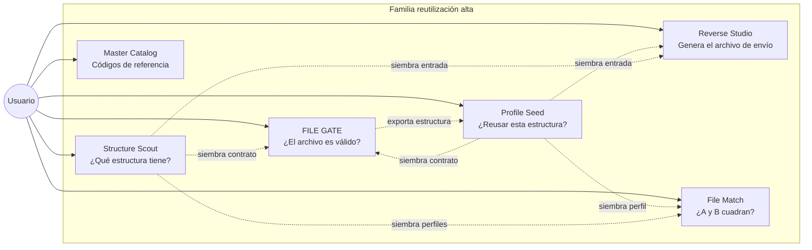
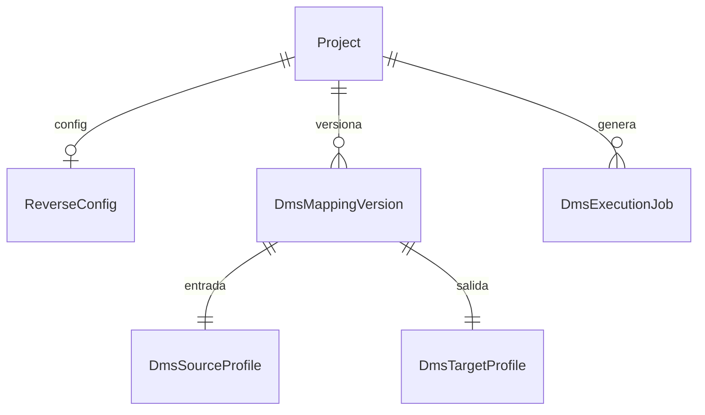
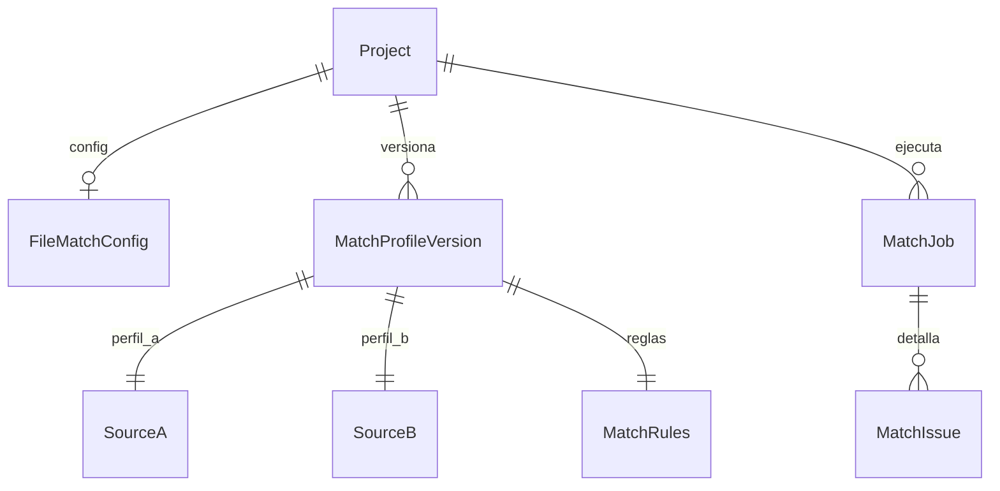
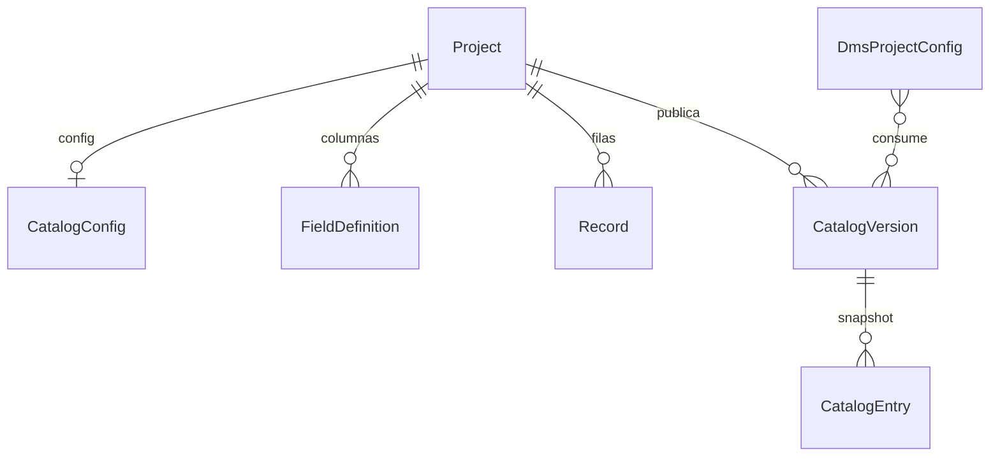
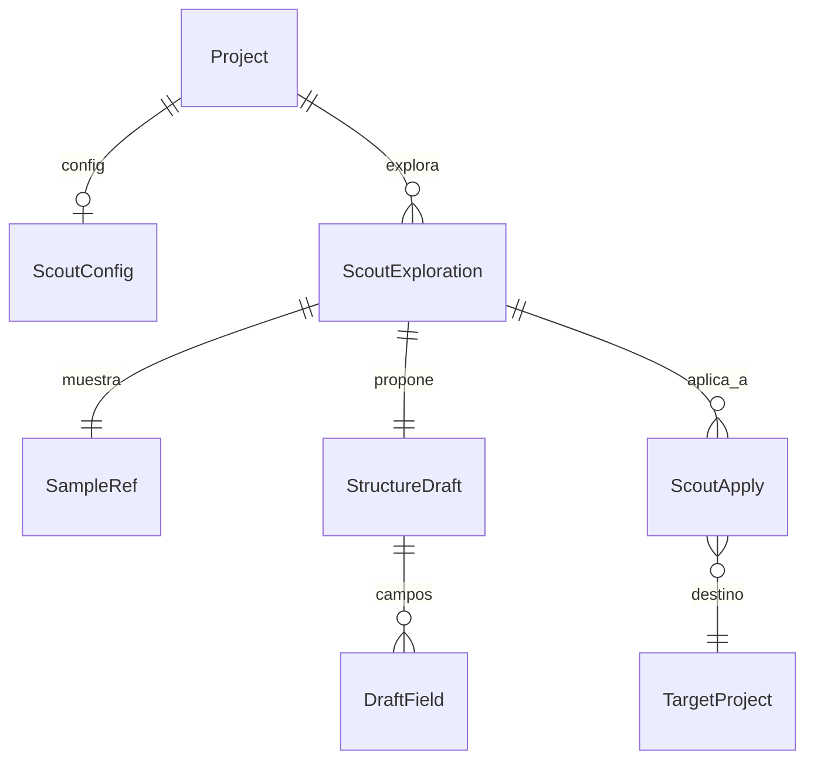
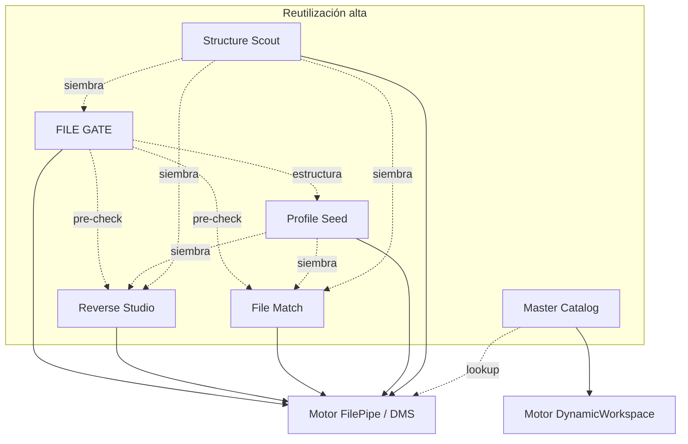

# APP FACTORY §2 — Reutilización alta

> **Nombre mnemotécnico:** `REUSE_HIGH`  
> Alias: *Mismo motor, poca obra nueva*  
> Archivo: [`docs/APP_FACTORY_HIGH_REUSE.md`](APP_FACTORY_HIGH_REUSE.md)  
> Origen: [`APP_FACTORY.md`](APP_FACTORY.md) §2  
> Estilo: hermano de [`FILE_GATE.md`](FILE_GATE.md) / [`DataMappingStudio.md`](DataMappingStudio.md)

---

## 0. Para qué sirve este documento

### Qué es

Este archivo es el **paraguas de producto** de la familia «reutilización alta» de APP_FACTORY. No es código ni un manual de usuario: fija **qué apps de la familia existen**, su estado (hecho / en rama / propuesta) y **cuál conviene construir después**, reaprovechando FilePipe (DMS) y DynamicWorkspace.

### Qué función cumple

| Función | Descripción |
|---------|-------------|
| **Aclarar ideas** | Explicar en lenguaje de negocio qué hace cada aplicativo y qué problema resuelve |
| **Delimitar alcance** | Separar qué entra en el MVP, qué queda fuera y qué no debe confundirse con FilePipe |
| **Priorizar** | Registrar qué verticales §2 ya están hechos y cuál sigue (hoy: **Profile Seed** en `feature/profile-seed`) |
| **Preparar implementación** | Dejar módulos, kind, fronteras y próximos pasos listos para un doc hijo + rama Git |

### Alcance de *este* documento (sí / no)

| Sí (este doc) | No (este doc) |
|---------------|---------------|
| Definir propuestas §2 + referenciar FILE GATE | Implementar código Django |
| Describir función, flujo y MVP de cada vertical | Sustituir [`FILE_GATE.md`](FILE_GATE.md) (ese producto ya tiene su doc) |
| Comparar verticales entre sí y con FilePipe | Specs de pantalla paso a paso (eso irá en `definition_app_*` al priorizar) |
| Decidir criterio de “reutilización alta” | Roadmap de §3/§4 de APP_FACTORY (formularios, CRM, etc.) |

### En una frase: qué hace cada app de la familia

| Aplicativo | Función (qué hace) | Resultado que entrega al usuario |
|------------|--------------------|----------------------------------|
| **FILE GATE** | Comprueba si un archivo cumple un contrato | Informe OK / errores (**no** genera archivo de negocio) |
| **Reverse Studio** | Convierte un Excel/CSV “fácil” al formato rígido que exige el banco/ERP | **Archivo de salida** (TXT posicional, JSON, XML…) |
| **File Match** | Cruza dos archivos por una clave y detecta diferencias | **Informe de conciliación** (faltan / sobran / no coinciden) |
| **Profile Seed** | Copia / siembra una estructura de archivo ya definida entre apps | **Borrador de perfil/contrato** en el proyecto destino |
| **Structure Scout** | Analiza una muestra y propone el patrón / estructura del archivo | **Borrador de esquema** (campos + tipos sugeridos) editable |
| **Master Catalog** | Mantiene tablas de códigos y equivalencias versionadas | **Catálogo publicado** que alimenta reglas DMS / validaciones |



---

## 1. Resumen ejecutivo

### Idea central

Ya existe un **chasis** (compañía, login, roles, billing) y dos **motores**:

1. **FilePipe / DMS** — leer archivos, mapear campos, aplicar reglas, escribir otro formato, informar errores.
2. **DynamicWorkspace** — definir columnas y guardar filas (registros) sin programar.

Las apps de §2 **no inventan un motor nuevo**. Empaquetan esos motores con un propósito de negocio claro y una UI propia (`project_kind`).

```
Chasis (Company · seguridad · billing · roles)
        +
Motor ya existente (DMS  ó  Records/Fields)
        +
Capa delgada de producto (hub · textos · informe · historial)
        =
Aplicativo vendible sin reescribir el ETL
```

### Inventario

| Aplicativo | Nemotécnico | Estado | Dónde está el detalle |
|------------|-------------|--------|------------------------|
| **Validador de archivos** | `FILE_GATE` | **Hecho** (M1–M6 + bridge) · en `main` | [`FILE_GATE.md`](FILE_GATE.md) |
| **Reverse Studio** | `REVERSE_STUDIO` | **Hecho** (M1–M7 + bridge) · en `main` | [`REVERSE_STUDIO.md`](REVERSE_STUDIO.md) · resumen §3 |
| **Conciliador de archivos** | `FILE_MATCH` | **Hecho** (M1–M8 + bridge) · en `main` | [`FILE_MATCH.md`](FILE_MATCH.md) · resumen §4 |
| **Explorador de estructura** | `STRUCTURE_SCOUT` | **Hecho** (M1–M7 + integración) · en `main` | [`STRUCTURE_SCOUT.md`](STRUCTURE_SCOUT.md) · §6 · [`ss_integration.md`](definition_app_STRUCTURE_SCOUT/ss_integration.md) |
| **Sembrador de perfiles** | `PROFILE_SEED` | **MVP P0 en código** · `feature/profile-seed` | [`PROFILE_SEED.md`](PROFILE_SEED.md) · resumen §7 · [`ps_integration.md`](definition_app_PROFILE_SEED/ps_integration.md) |
| **Catálogos / maestros** | `MASTER_CATALOG` | Propuesta | §5 de este archivo |

### Por qué existen (problema → solución)

| Aspecto | Descripción |
|---------|-------------|
| **Problema** | Cada necesidad “parecida a transformar archivos” termina en un script o en montar un FilePipe completo aunque el usuario solo quiera validar, emitir o comparar |
| **Solución** | Productos estrechos, con nombre y flujo claros, encima del mismo motor |
| **Beneficio** | Menos tiempo a MVP, mismo login/tenant/deploy, portfolio coherente |
| **Filtro §2** | Si ~70 % o más del trabajo ya está en DMS/workspace → pertenece aquí |

### Qué reutiliza cada uno

| Pieza de plataforma | FILE GATE | Reverse | Match | Profile Seed | Scout | Catálogo |
|---------------------|-----------|---------|-------|--------------|-------|----------|
| Chasis multi-tenant | Sí | Sí | Sí | Sí | Sí | Sí |
| Parsers / SourceProfile | Sí | Sí | Sí (×2) | **Clona forma** | Sí (inferir → perfil) | No |
| Detección / sample intake | Parcial | Parcial | Parcial | No (origen = definición) | **Núcleo** | No |
| Target + serializar salida | No | Sí | No | No | No | No |
| Mapeo + reglas DMS | No* | Sí | No | No | No | Consume lookup |
| Records / FieldDefinition | No | No | No | No | No | Sí |

\*FILE GATE valida campos del origen; no mapea a un destino de negocio.

---

## 2. Importancia de la familia

1. **Aprovechar lo ya pagado** — el costo fijo del motor DMS/workspace ya está; estas apps son ensamble + UX.
2. **Hablar el idioma del cliente** — “validar el archivo del proveedor”, “generar el TXT del banco”, “cuadrar banco vs ERP”, “descubrir la estructura del archivo”, “mantener el maestro de códigos”.
3. **Orden natural** — calidad (GATE) → emisión (Reverse) → cruce (Match) → **descubrimiento (Scout)** → **siembra de perfiles (Profile Seed)** → gobernanza de códigos (Catalog).  
   *Hechos en código:* GATE, Reverse, Match, Scout (en `main`). *En curso:* Profile Seed (`feature/profile-seed`).
4. **Bajo riesgo técnico** — el riesgo es de producto (claridad), no de inventar parsers (Scout añade heurísticas; Seed clona snapshots).
5. **Se refuerzan entre sí** — Scout/Seed siembran wizards; un catálogo mejora lookups; GATE puede ser pre-check de Reverse/Match.

---

## 3. REVERSE STUDIO — CSV/Excel → posicional / JSON / XML

> **Documento canónico de producto:** [`REVERSE_STUDIO.md`](REVERSE_STUDIO.md)  
> **Nemotécnico:** `REVERSE_STUDIO` · **Kind:** `reverse` (`Project.KIND_REVERSE`)  
> **Estado:** MVP **hecho** (M1–M7 + bridge GATE) · mergeado a `main` · `apps/reverse_studio/`  
> Lo que sigue es el **resumen** dentro de la familia §2; el detalle vive en el doc hijo.

### 3.0 Qué es, qué hace y para qué sirve

| Pregunta | Respuesta corta |
|----------|-----------------|
| **¿Qué es?** | Un aplicativo para **generar el archivo que el banco/ERP exige**, partiendo de un Excel o CSV que el negocio sí sabe llenar. |
| **¿Qué hace?** | Lee CSV/Excel → aplica mapeo/reglas → **escribe** TXT posicional, JSON o XML. |
| **¿Qué no hace?** | No es un ETL genérico de cualquier formato a cualquier formato (eso es FilePipe). En el MVP la entrada está acotada a CSV/Excel. |
| **¿Para quién?** | Operaciones / tesorería / RRHH que deben “mandar el archivo en el layout del receptor”. |
| **Función en la plataforma** | Empaqueta el motor DMS completo (origen + destino + mapeo + ejecución) con UX de **emisión**, no de pipeline abierto. |

**Flujo de usuario (función operativa):**

1. Definir qué columnas trae el Excel/CSV.  
2. Definir cómo debe verse el archivo de salida (posiciones, tags, etc.).  
3. Mapear columna → campo de salida.  
4. Subir el Excel del mes y **descargar** el archivo listo para enviar.

### 3.1 Problema

- El ERP o el banco exige TXT posicional / XML rígido.
- El área de negocio solo maneja Excel o CSV.
- Hoy: scripts one-off o un proyecto DMS completo que pocos entienden como “solo exportar al formato del banco”.

### 3.2 Solución

Proyecto con `project_kind` dedicado (propuesta: `reverse`) donde:

1. El **origen** es CSV / Excel / delimitado (perfil Source).
2. El **destino** es posicional / JSON / XML (perfil Target + serializadores existentes).
3. El **mapeo y reglas** son el mismo motor DMS, con UX orientada a “generar archivo de envío”, no a “pipeline ETL genérico”.

```
CSV / Excel (negocio)
        →
Parse + map + rules (motor DMS)
        →
TXT posicional / JSON / XML (contrato del receptor)
```

### 3.3 Alcance (qué entra y qué no)

**Alcance de producto:** solo el camino *entrada fácil → salida rígida*. Si el cliente necesita orígenes XML complejos o varios destinos a la vez, usa FilePipe.

| Incluido en MVP | Fuera de alcance (MVP) |
|-----------------|------------------------|
| Proyecto/kind “Reverse Studio” + hub propio | Scheduling / API pública |
| Entrada: CSV / Excel / delimitado | Inventar parsers nuevos |
| Salida: TXT posicional, JSON, XML (serializers ya existentes) | Conciliar después del envío |
| Mapeo y reglas DMS actuales | UI de reglas distinta a la de FilePipe |
| Dry run, job, **descarga del archivo generado**, historial | Multi-destino en un solo job |

### 3.4 Frontera con FilePipe

| FilePipe (DMS) | Reverse Studio |
|----------------|----------------|
| Origen y destino simétricos / genéricos | Narrativa: **entrada fácil → salida rígida** |
| Hub de definición largo (origen+destino+mapeo+reglas) | Misma potencia; wizard acotado y copy de “emisión” |
| Puede hacer el mismo job técnicamente | Producto empaquetado para un caso de uso |

**Regla:** no duplicar el motor; si un cliente necesita ETL genérico, usa FilePipe. Reverse Studio es el **paquete** “exportar al layout del banco/ERP”.

### 3.5 Módulos sugeridos

| Módulo | Contenido | Reuso |
|--------|-----------|-------|
| 1 · Contrato de entrada | SourceProfile CSV/XLSX | `source_profile` |
| 2 · Contrato de salida | TargetProfile posicional/JSON/XML | `target_profile` |
| 3 · Mapeo y reglas | Field mapping + transform rules | `field_mapping`, `transform_rules` |
| 4 · Generar archivo | Intake + transform execution | `file_intake`, `transform_execution` |
| 5 · Historial / evidencia | Jobs + descarga output | Misma familia que DMS |
| 6 · (Opcional) Pre-check FILE GATE | Exigir gate en verde sobre el CSV de entrada | Bridge ya existente |

### 3.6 Casos de negocio

| # | Caso |
|---|------|
| R1 | Excel de pagos → TXT posicional del banco |
| R2 | CSV RRHH → XML de nómina del proveedor de pagos |
| R3 | Planilla de altas → JSON de API batch del ERP |
| R4 | Plantilla mensual reutilizable: mismo mapeo, nuevo Excel cada mes |

### 3.7 Roles

Misma matriz PA / ED / GE / CO que FilePipe (diseñar vs ejecutar vs consultar).

### 3.8 Modelo conceptual (borrador)



Preferencia: **reutilizar modelos DMS** (`project_kind=reverse` + mismos `Dms*` bajo el proyecto) en lugar de tablas nuevas. La diferenciación es de producto/UX, no de esquema.

### 3.9 Decisiones abiertas

| # | Tema | Recomendación |
|---|------|---------------|
| 1 | ¿Kind `reverse` o modo de DMS? | Kind propio + servicios DMS compartidos |
| 2 | ¿Forzar origen solo CSV/XLSX? | Sí en MVP (claridad de producto) |
| 3 | ¿Compartir versión con un proyecto DMS? | No en MVP; plantillas Fase 2 |
| 4 | Nombre comercial | Reverse Studio / Emisor de layouts |

### 3.10 Criterio APP_FACTORY

| Criterio | ¿Cumple? |
|----------|----------|
| Company + seguridad + billing | Sí |
| `project_kind` | Sí (`reverse`) |
| Usa motor ETL | Sí (completo, con serialización) |
| MVP acotado | Sí |
| Diferenciador vs FilePipe | Sí — empaquetado “entrada fácil → salida legacy” |

### 3.11 Estado / siguientes pasos

MVP Reverse **cerrado** en `main` (`apps/reverse_studio/`). Ver [`REVERSE_STUDIO.md`](REVERSE_STUDIO.md).

Pendiente de producto (no bloquea el MVP):

1. PR/revisión operativa en producción según política de merge.  
2. Fase 2 del doc hijo (plantillas, scheduling, etc.) cuando se priorice.  
3. Consumir siembras desde Structure Scout / Profile Seed.

---

## 4. FILE MATCH — Conciliador de archivos

> **Nemotécnico:** `FILE_MATCH` · **Kind:** `file_match` (`Project.KIND_FILE_MATCH`)  
> **Documento de producto:** [`FILE_MATCH.md`](FILE_MATCH.md) (lineamientos; este §4 es el resumen §2).  
> **Estado:** MVP **hecho** (M1–M8 + bridge GATE) · mergeado a `main` · `apps/file_match/`

### 4.0 Qué es, qué hace y para qué sirve

| Pregunta | Respuesta corta |
|----------|-----------------|
| **¿Qué es?** | Un aplicativo para **cuadrar dos archivos** (p. ej. banco vs ERP) y saber qué falta, qué sobra o qué no coincide. |
| **¿Qué hace?** | Lee archivo A y archivo B → cruza por clave(s) → compara campos → emite un **informe de diferencias**. |
| **¿Qué no hace?** | No transforma ni “arregla” los archivos. No es contabilidad completa ni matching difuso/IA en el MVP. |
| **¿Para quién?** | Tesorería, operaciones, auditoría, control de intercambios. |
| **Función en la plataforma** | Reutiliza el parseo DMS **dos veces** y añade un comparador delgado; la salida es evidencia, no un tercer archivo de negocio. |

**Flujo de usuario (función operativa):**

1. Definir cómo se lee el archivo A.  
2. Definir cómo se lee el archivo B.  
3. Elegir la clave de cruce (documento, NIT+fecha, etc.) y qué campos comparar (monto, estado…).  
4. Subir A y B → ver resumen y descargar detalle (matched / solo A / solo B / montos distintos).

### 4.1 Problema

- Tesorería: extracto bancario vs libro ERP.
- Operaciones: archivo del proveedor vs archivo interno del día.
- Auditoría: dos exportaciones “deberían ser iguales” y no lo son.
- Hoy: VLOOKUP en Excel, scripts frágiles, sin historial ni roles.

### 4.2 Solución

Proyecto `project_kind` (propuesta: `file_match`) donde el usuario:

1. Define **Origen A** (perfil + captura + campos).
2. Define **Origen B** (otro perfil; puede ser otro tipo de archivo).
3. Declara **clave de cruce** (uno o más campos) y **campos a comparar**.
4. Sube ambos archivos (o uno fijo + uno variable).
5. Obtiene un informe: matched / only_A / only_B / value_mismatch.

```
Archivo A ──parse──┐
                   ├─ match por clave ─→ Informe de conciliación
Archivo B ──parse──┘
```

### 4.3 Alcance (qué entra y qué no)

**Alcance de producto:** comparación **1:1 por clave** entre exactamente **dos** archivos. El valor entregable es el informe; no hay archivo destino “corregido”.

| Incluido en MVP | Fuera de alcance (MVP) |
|-----------------|------------------------|
| Dos perfiles de origen versionados en el mismo proyecto | Generar un tercer archivo “ya conciliado” |
| Clave simple o compuesta | Fuzzy match / IA / probabilidad |
| Comparación exacta (con trim / mayúsculas básicas) | Conciliación contable multi-moneda avanzada |
| Informe JSON/CSV + conteos + historial | Tres o más lados (A/B/C) |

### 4.4 Frontera con otros verticales

| Vertical | Relación |
|----------|----------|
| FILE GATE | Puede validar A y B **antes** de conciliar (opcional) |
| FilePipe | No genera destino; solo diferencias |
| Catálogos | Pueden normalizar códigos antes del match (Fase 2) |

### 4.5 Módulos sugeridos

| Módulo | Contenido |
|--------|-----------|
| 1 · Perfil A | SourceProfile lado A |
| 2 · Perfil B | SourceProfile lado B |
| 3 · Reglas de cruce | Claves, campos comparados, normalización, tolerancia numérica opcional |
| 4 · Ejecutar | Upload A+B (o reutilizar archivos del intake) → job de match |
| 5 · Informe | Conteos + detalle por clave + descarga |
| 6 · Historial | Auditoría de conciliaciones |

### 4.6 Reglas de negocio (borrador)

| ID | Regla |
|----|-------|
| M1 | Solo se ejecuta contra versiones **publicadas** de ambos perfiles. |
| M2 | Una fila de A puede matchear a lo sumo una de B por clave (1:1 en MVP). |
| M3 | Claves duplicadas en un lado → error de integridad o bucket `duplicate_key`. |
| M4 | Campos no seleccionados para comparar se ignoran en el veredicto. |
| M5 | El job es de solo lectura sobre A y B. |

### 4.7 Resultados de job

| Estado / bucket | Significado |
|-----------------|-------------|
| `matched` | Misma clave; valores comparados iguales |
| `value_mismatch` | Misma clave; al menos un campo difiere |
| `only_a` | Clave solo en A |
| `only_b` | Clave solo en B |
| `failed` | No se pudo parsear / claves inválidas / abort |

Veredicto agregado (configurable):

- `passed` si solo hay `matched` (y opcionalmente mismatches bajo umbral).
- `failed` si hay `only_*` o mismatches por encima de umbral.

### 4.8 Casos de negocio

| # | Caso |
|---|------|
| C1 | Extracto banco (CSV) vs movimientos ERP (TXT) |
| C2 | Facturación proveedor vs recepción interna |
| C3 | Dos exportaciones del mismo reporte “antes/después” de un cambio |
| C4 | Nómina enviada vs acuse del banco (por documento + monto) |

### 4.9 Ejemplo

**Clave:** `documento`  
**Comparar:** `monto`

| documento | A.monto | B.monto | Resultado |
|-----------|---------|---------|-----------|
| 1001 | 500 | 500 | matched |
| 1002 | 200 | 250 | value_mismatch |
| 1003 | 100 | — | only_a |
| 1004 | — | 80 | only_b |

### 4.10 Modelo conceptual (borrador)



Implementación preferida: dos `DmsSourceProfile` (o snapshots) + JSON `match_rules` + job propio o especialización de `DmsExecutionJob` sin target.

### 4.11 Decisiones abiertas

| # | Tema | Recomendación |
|---|------|---------------|
| 1 | ¿1:1 estricto o 1:N? | 1:1 en MVP |
| 2 | ¿Tolerancia decimal? | Opcional Fase 2 (`abs(diff) <= epsilon`) |
| 3 | ¿Un archivo “maestro” fijo? | Fase 2 (baseline versionado) |
| 4 | Nombre | File Match / Conciliador |

### 4.12 Criterio APP_FACTORY

| Criterio | ¿Cumple? |
|----------|----------|
| Chasis | Sí |
| `project_kind` | Sí (`file_match`) |
| Motor | Sí (doble parse + comparador nuevo delgado) |
| MVP acotado | Sí |
| Diferenciador | Sí — **dos orígenes, cero destino de negocio** |

### 4.13 Estado / siguientes pasos

MVP Match **cerrado** en `main` (`apps/file_match/`, M1–M8 + bridge). Ver [`FILE_MATCH.md`](FILE_MATCH.md).

Pendiente de producto (Fase 2+):

1. Tolerancia decimal / 1:N / baseline maestro.  
2. Consumir siembras Scout / Profile Seed en perfiles A/B.  
3. Umbral de fallos configurable (si aún no está en el doc hijo).

---

## 5. MASTER CATALOG — Catálogos / maestros gestionados

> **Nemotécnico:** `MASTER_CATALOG` · **Kind propuesto:** `catalog` (o plantilla sobre `workspace`)

### 5.0 Qué es, qué hace y para qué sirve

| Pregunta | Respuesta corta |
|----------|-----------------|
| **¿Qué es?** | Un aplicativo para **mantener tablas de códigos de negocio** (bancos, sucursales, estados, equivalencias) con dueño, historial y versión publicada. |
| **¿Qué hace?** | Define columnas del maestro → carga/edita filas (o importa Excel) → **publica un snapshot** que otras apps consultan. |
| **¿Qué no hace?** | No transforma archivos por sí solo. No reemplaza los catálogos técnicos de plataforma (`SourceFileType`, etc.). |
| **¿Para quién?** | Analistas / operaciones que hoy guardan “el Excel de códigos” y lo pegan en reglas a mano. |
| **Función en la plataforma** | Gobernanza de **datos de referencia** sobre DynamicWorkspace; FilePipe/FILE GATE **consumen** el catálogo vía `lookup` / `replace_map` (y validaciones futuras). |

**Flujo de usuario (función operativa):**

1. Crear el maestro (p. ej. columnas `code`, `label`, `activo`).  
2. Cargar las filas o importar Excel.  
3. Publicar versión vN.  
4. En un proyecto DMS (o GATE), la regla dice: “traduce este código usando catálogo bancos@vN”.

### 5.1 Problema

- Los mapeos de códigos viven en Excel del analista o hardcodeados en reglas.
- Cambiar “código banco 014 → BNC” implica republicar pipelines a ciegas.
- No hay dueño claro, historial ni rol para mantener el maestro.

### 5.2 Solución

Proyecto `project_kind` (propuesta: `catalog` o reutilizar `workspace` con plantilla) que:

1. Define un esquema de maestro (código, etiqueta, atributos, vigencia).
2. Permite CRUD / import Excel de filas (`Record` + `FieldValue`).
3. Expone el maestro como **fuente de lookup** para proyectos DMS (y opcionalmente FILE GATE).
4. Versiona publicaciones del catálogo (snapshot inmutable consumido por reglas).

```
Maestro (Workspace / Records)
        →
Publicar versión de catálogo
        →
Regla DMS replace_map / lookup  (y validadores)
```

### 5.3 Alcance (qué entra y qué no)

**Alcance de producto:** ser la **fuente de verdad de códigos del tenant**. El “trabajo pesado” de transformar archivos sigue en FilePipe; el catálogo solo alimenta traducciones y validaciones.

| Incluido en MVP | Fuera de alcance (MVP) |
|-----------------|------------------------|
| Proyecto/plantilla “Catálogo” sobre esquema dinámico | Motor de reglas ETL nuevo |
| Campos tipo `code`, `label`, opcionales, `active` | Workflow de aprobación multi-nivel |
| Import / export Excel + publicar snapshot | Sync automático desde el ERP |
| Consumo desde reglas DMS `lookup` / `replace_map` | Linaje gráfico completo |
| Auditoría básica de cambios de fila | Catálogos compartidos entre compañías |

### 5.4 Frontera

| Pieza | Relación |
|-------|----------|
| DynamicWorkspace | **Motor principal** (FieldDefinition / Record) |
| DMS `replace_map` / `lookup` | **Consumidor** del snapshot |
| FILE GATE | Fase 2: validar que un campo ∈ catálogo publicado |
| System catalogs (`SourceFileType`, etc.) | Distinto: catálogos de plataforma vs maestros de negocio del tenant |

### 5.5 Módulos sugeridos

| Módulo | Contenido |
|--------|-----------|
| 1 · Definir columnas del maestro | Wizard corto sobre FieldDefinition |
| 2 · Cargar / editar filas | Listado + import Excel |
| 3 · Publicar catálogo | Snapshot versionado (JSON o tabla inmutable) |
| 4 · Vincular a proyectos DMS | Selector de catálogo + campo clave/valor en reglas |
| 5 · Historial de cambios | Quién / cuándo / diff de filas (básico) |

### 5.6 Reglas de negocio (borrador)

| ID | Regla |
|----|-------|
| K1 | Las reglas DMS solo leen versiones **publicadas** del catálogo. |
| K2 | Editar el borrador no cambia jobs ya ejecutados. |
| K3 | `code` único por catálogo (case policy configurable). |
| K4 | Filas inactivas no participan en lookup (pero permanecen auditables). |
| K5 | Un proyecto DMS puede vincular 0..N catálogos. |

### 5.7 Casos de negocio

| # | Caso |
|---|------|
| T1 | Equivalencia código sucursal interno ↔ código banco |
| T2 | Catálogo de estados de pedido usados en validación y en replace |
| T3 | Lista de NITs autorizados (gate + lookup) |
| T4 | Monedas / países ISO mantenidos por operaciones |

### 5.8 Ejemplo de consumo DMS

```json
{
  "rule": "lookup",
  "source_field": "cod_banco_in",
  "catalog": "bancos_ve@v3",
  "key": "code",
  "value": "label",
  "on_miss": "error"
}
```

### 5.9 Modelo conceptual (borrador)



MVP puede serializar el snapshot como JSON en `CatalogVersion.payload` para no complicar el join en el motor de reglas.

### 5.10 Decisiones abiertas

| # | Tema | Recomendación |
|---|------|---------------|
| 1 | ¿Kind nuevo `catalog` o plantilla `workspace`? | Kind `catalog` si la UX/consumo DMS es de primera clase; si no, plantilla workspace |
| 2 | ¿Dónde vive el binding a reglas? | En el proyecto DMS (referencia al catálogo publicado) |
| 3 | ¿Tamaño máximo de maestro? | Límite MVP (p. ej. 50k filas) + aviso |
| 4 | Nombre | Master Catalog / Maestros |

### 5.11 Criterio APP_FACTORY

| Criterio | ¿Cumple? |
|----------|----------|
| Chasis | Sí |
| `project_kind` / extensión | Sí |
| Usa esquema dinámico | Sí |
| MVP acotado | Sí |
| Diferenciador | Sí — **gobernanza de referencia** que alimenta ETL/validación |

### 5.12 Próximos pasos

1. Inventariar reglas DMS actuales (`replace_map`, `lookup`) y contrato de datos.
2. Prototipo: CRUD maestro + “Publicar vN” + selector en una regla demo.
3. `definition_app_MASTER_CATALOG/`.
4. Rama `feature/master-catalog`.

---

## 6. STRUCTURE SCOUT — Explorador de estructura

> **Nemotécnico:** `STRUCTURE_SCOUT` · **Kind:** `structure_scout` (`Project.KIND_STRUCTURE_SCOUT`)  
> Alias: *Explorador de estructura* · *Detector de patrones* · *Schema Scout*  
> **Producto:** [`STRUCTURE_SCOUT.md`](STRUCTURE_SCOUT.md) · specs [`definition_app_STRUCTURE_SCOUT/`](definition_app_STRUCTURE_SCOUT/) · integración [`ss_integration.md`](definition_app_STRUCTURE_SCOUT/ss_integration.md)  
> **Estado:** MVP **en rama** (M1–M7 + integración documentada) · `feature/structure-scout` · `apps/structure_scout/` · **sin deploy** hasta merge a `main`

### 6.0 Qué es, qué hace y para qué sirve

| Pregunta | Respuesta corta |
|----------|-----------------|
| **¿Qué es?** | Un aplicativo que **analiza una muestra de archivo** y propone, de forma asistida, el **patrón / estructura** probable (tipo de archivo, captura, campos y tipos de contenido). |
| **¿Qué hace?** | Sube o pega una muestra → corre heurísticas/detección → presenta un **borrador de esquema** editable (campos sugeridos + confianza) → permite **exportar / aplicar** ese borrador a FILE GATE, Reverse, Match o FilePipe. |
| **¿Qué no hace?** | No valida producción (eso es FILE GATE). No genera archivo de envío (Reverse). No concilia (Match). No sustituye el juicio del diseñador: **propone**, el usuario confirma. |
| **¿Para quién?** | Integradores y analistas que reciben un layout “nuevo” o poco documentado y hoy arman el wizard a mano. |
| **Función en la plataforma** | **Acelerador transversal** de los wizards de origen/contrato: reduce tiempo a primer esquema usable y baja el error de configuración inicial. |

**Flujo de usuario (función operativa):**

1. Subir una muestra (CSV, Excel, delimitado, posicional, JSON/XML según MVP).  
2. Revisar detección: encoding, separador / posiciones, encabezados, filas de captura.  
3. Revisar tabla propuesta: nombre de campo, tipo sugerido, required?, ejemplos, nivel de confianza.  
4. Ajustar / aceptar → guardar borrador o **aplicar** a un proyecto destino (GATE / Reverse / Match / DMS).

```
Muestra de archivo
        →
Detección + inferencia de campos/tipos
        →
Borrador de estructura (editable)
        →
Aplicar a contrato / SourceProfile destino
```

### 6.1 Problema

- El primer paso de FILE GATE, Reverse, Match y FilePipe es **definir campos a mano** aunque el archivo ya traiga el patrón.
- Layouts mal documentados (banco, proveedor, ERP) obligan a prueba y error en el wizard de 6 pasos.
- Scripts ad-hoc de “adivinar columnas” no tienen UI, roles ni historial.
- Sin una propuesta inicial, el costo de adopción de toda la familia §2 sube.

### 6.2 Solución

Proyecto `project_kind` (propuesta: `structure_scout`) donde el usuario:

1. Carga una **muestra** (reuso file intake / sample).
2. Ejecuta un **job de exploración** (heurísticas + parsers existentes + inferencia de tipos).
3. Obtiene un **informe de estructura** + borrador alineado a forma `SourceProfile` / contrato GATE.
4. Confirma campos y tipos; opcionalmente **siembra** un proyecto hermano.

```
SampleFile ──detect──┐
                     ├─ infer fields/types ─→ StructureDraft ─→ Apply to target project
Parsers DMS ─────────┘
```

### 6.3 Alcance (qué entra y qué no)

**Alcance de producto:** descubrir y **proponer** estructura; la verdad la confirma el usuario. El valor entregable es el borrador + la capacidad de sembrarlo en otros verticales.

| Incluido en MVP | Fuera de alcance (MVP) |
|-----------------|------------------------|
| Tipos amigables: CSV, Excel, delimitado (+ posicional básico si hay heurística) | IA generativa / LLM como dependencia obligatoria |
| Encoding, delimiter, header row, captura inicio/fin sugeridos | Corregir o reescribir el archivo de muestra |
| Lista de campos con tipo candidato (`numeric`, `date`, `decimal`, texto, …) | Validación de producción o certificación |
| Score / confianza por campo y por detección global | Fuzzy layout multi-registro anidados profundos |
| Export JSON de borrador + “Aplicar a…” GATE/Reverse (mismo tenant) | Auto-aplicar sin confirmación humana |
| Historial de exploraciones (quién / cuándo / muestra / draft) | Entrenamiento ML propietario (Fase 3) |

### 6.4 Frontera con otros verticales

| Vertical | Relación |
|----------|----------|
| **FILE GATE** | Scout **siembra** el contrato/esquema; GATE **valida** archivos reales |
| **Reverse Studio** | Scout siembra el **contrato de entrada** (planilla); Reverse emite la salida |
| **File Match** | Scout siembra perfil A y/o B |
| **FilePipe** | Scout siembra SourceProfile del origen |
| **Master Catalog** | No se solapa; Catalog es códigos de negocio, Scout es forma del archivo |
| **Detección DMS existente** | Scout **empaqueta y productiza** `detection_service` / sample preview; no inventa otro parser |

### 6.5 Módulos (as-built MVP)

| Módulo | Contenido | Estado |
|--------|-----------|--------|
| 1 · Proyecto / hub | Alta, listado, hub, miembros | **Implementado** |
| 2 · Cargar muestra | Upload + preview (`DmsSampleFile`) | **Implementado** |
| 3 · Detectar patrón | Encoding, tipo, delimitador/captura | **Implementado** |
| 4 · Proponer campos | Tabla editable + confianza + examples | **Implementado** |
| 5 · Guardar borrador | `StructureDraft` versionado + export JSON | **Implementado** |
| 6 · Aplicar a destino | GATE + Reverse (solo borrador vía `save_source`) | **Implementado** |
| 7 · Historial | Timeline drafts + applies (sin `ScoutExploration`) | **Implementado** |
| Transversal | [`ss_integration.md`](definition_app_STRUCTURE_SCOUT/ss_integration.md) | **Documentado** |

Fase 2: Match/FilePipe como destino, CTA embebido en wizards, LLM opcional.

### 6.6 Reglas de negocio (borrador)

| ID | Regla |
|----|-------|
| S1 | Toda propuesta es **borrador** hasta que el usuario confirma campos/tipos. |
| S2 | “Aplicar a destino” crea/actualiza solo **borrador** del perfil destino (no publica solo). |
| S3 | La muestra no se usa como archivo de producción; TTL / retención como samples DMS. |
| S4 | Inferencia de tipo se basa en muestra (N filas); advertir si cobertura es baja. |
| S5 | Aislamiento por `Company` + membresía; sin lectura cruzada de muestras. |
| S6 | No se duplican parsers: detección y parse vía `apps.dms.*`. |
| S7 | Posicional: si la confianza es baja, el UI exige revisión manual de longitudes. |

### 6.7 Resultados de una exploración

| Estado | Significado |
|--------|-------------|
| `draft_ready` | Hay propuesta usable; usuario puede editar/aplicar |
| `needs_review` | Detección parcial (p. ej. delimitador dudoso, tipos mixtos) |
| `failed` | No se pudo leer la muestra / tipo no soportado |
| `applied` | Borrador aplicado a un proyecto destino (referencia guardada) |

### 6.8 Casos de negocio

| # | Caso |
|---|------|
| P1 | Llega un CSV nuevo del proveedor → Scout propone columnas → se siembra FILE GATE |
| P2 | Tesorería trae Excel de pagos → Scout arma entrada Reverse en minutos |
| P3 | Auditoría recibe TXT delimitado desconocido → Scout documenta la estructura probable |
| P4 | Match: explorar extracto banco y libro ERP por separado → sembrar perfiles A/B |
| P5 | Onboarding FilePipe: primer SourceProfile sugerido desde muestra |

### 6.9 Ejemplo (CSV)

**Muestra (3 filas + encabezado):**

```text
documento;nombre;monto;fecha
1001;ANA;500.00;2026-01-15
1002;LUIS;250,50;15/01/2026
```

**Propuesta Scout (simplificada):**

| Campo | Tipo sugerido | Required | Confianza | Notas |
|-------|---------------|----------|-----------|-------|
| documento | numeric | sí | alta | siempre dígitos |
| nombre | alphanumeric_spaces | sí | alta | |
| monto | decimal | sí | media | mezcla `.` y `,` → pedir locale |
| fecha | date | sí | media | formatos mixtos → pedir máscara |

Detección global: `csv` / `;` / UTF-8 / header en fila 1.

### 6.10 Modelo conceptual (borrador)



`StructureDraft` debería alinearse a la forma JSON de `source` / contrato GATE para poder aplicar sin traducción creativa.

### 6.11 Decisiones (congeladas en MVP)

| # | Tema | Decisión |
|---|------|----------|
| 1 | ¿App con kind propio o solo servicio embebido? | **Kind + hub** (`structure_scout`); CTA en wizards = Fase 2 |
| 2 | ¿IA/LLM en MVP? | **No**; heurísticas + detección DMS |
| 3 | ¿Posicional en MVP? | Básico / débil → Fase 2 si hace falta |
| 4 | Nombre UI | **Explorador de estructura** |
| 5 | ¿Aplicar sobrescribe draft destino? | Sí con warning; **nunca** publica |
| 6 | ¿Tabla `ScoutExploration`? | **No** en MVP; auditoría = drafts + applies |

### 6.12 Criterio APP_FACTORY

| Criterio | ¿Cumple? |
|----------|----------|
| Chasis | Sí |
| `project_kind` | Sí (`structure_scout`) |
| Motor | Sí (sample + detection + parsers DMS + inferencia) |
| MVP acotado | Sí (tipos amigables + confirmación humana) |
| Diferenciador | Sí — **propone estructura**; no valida, no emite, no concilia |

### 6.13 Estado / siguientes pasos

> MVP Scout **cerrado** en `main` (`apps/structure_scout/`, M1–M7 + `ss_integration.md`). Ver [`STRUCTURE_SCOUT.md`](STRUCTURE_SCOUT.md).

1. Fase 2: destinos Match/FilePipe, CTA embebido en wizards, posicional robusto.  
2. Coordinar capa “Aplicar a” con Profile Seed (ambos usan `save_source`).  
3. **Vertical en curso:** Profile Seed (`feature/profile-seed`).

---

## 7. PROFILE_SEED — Sembrador de perfiles

> **Nemotécnico:** `PROFILE_SEED` · **Kind:** opcional en MVP (`profile_seed` si hay hub); arranque con **servicios + CTAs**  
> Alias: *Sembrador de perfiles* · *Profile Seed* · *Cross-seed de estructuras*  
> **Documento hijo:** [`PROFILE_SEED.md`](PROFILE_SEED.md) · [`definition_app_PROFILE_SEED/`](definition_app_PROFILE_SEED/) · rama `feature/profile-seed`  
> **Estado:** **lineamientos / partida** (base de producto abierta)

### 7.0 Qué es, qué hace y para qué sirve

| Pregunta | Respuesta corta |
|----------|-----------------|
| **¿Qué es?** | Un aplicativo (o capa de producto) que **reutiliza una estructura de archivo ya definida** en un proyecto y la **siembra** como borrador en otro proyecto de la misma compañía. |
| **¿Qué hace?** | Elige origen (p. ej. esquema FILE GATE publicado) → elige destino (p. ej. Perfil A de FILE MATCH) → clona la forma SourceProfile/contrato → deja borrador editable (sin publicar solo). |
| **¿Qué no hace?** | No valida archivos, no concilia, no emite layouts, no infiere desde muestra (eso es Structure Scout). No fusiona perfiles en un “maestro vivo” compartido. |
| **¿Para quién?** | Integradores y PA/ED que ya armó el wizard de 6 pasos en GATE/Reverse/Match/DMS y no quieren repetirlo en la app hermana. |
| **Función en la plataforma** | **Acelerador de adopción cruzada**: convierte la familia §2 en suite integral (definir una vez → sembrar muchas veces). |

**Flujo de usuario (función operativa):**

1. Desde el destino (Match Perfil A) o desde un hub Seed: **Importar estructura**.  
2. Elegir proyecto origen (mismo tenant) + versión **publicada** + slot (esquema / entrada / perfil A|B / origen DMS).  
3. Revisar diff suave (tipo de archivo, # campos) y confirmar.  
4. Se crea/actualiza el **borrador** del perfil destino; el usuario ajusta y publica en la app destino.

```
Proyecto origen (GATE / Reverse / Match / DMS)
        →
Snapshot de estructura (forma SourceProfile / contrato)
        →
Proyecto destino (borrador)
        →
Usuario confirma · edita · publica en destino
```


### 7.1 Problema

- GATE, Match, Reverse y FilePipe repiten el mismo wizard de **estructura de archivo**.
- Un extracto bancario ya modelado en FILE GATE se redefine a mano como Perfil A en Match.
- El bridge GATE hoy solo hace **pre-check por hash**; explícitamente **no** comparte `SourceProfile` (Fase 2.1 en docs de bridge).
- Sin siembra, la suite se siente fragmentada aunque el motor sea el mismo.

### 7.2 Solución

Producto delgado `PROFILE_SEED` que:

1. Lista candidatos de origen (proyectos de kinds bridgeables con versión publicada).
2. Extrae un **snapshot canónico** de estructura (tipo, captura, fields, content_rules).
3. Mapea al slot destino (GATE esquema, Reverse entrada, Match A/B, DMS origen).
4. Escribe solo en **borrador**; registra auditoría «importado desde X@vN».
5. Valida whitelist / tipos del destino y marca huecos.

**Regla de diseño congelada:** **clonar snapshot**, no vínculo vivo. Cada app sigue siendo dueña de su versión.

### 7.3 Frontera con Structure Scout y el bridge GATE

| | PROFILE_SEED | Structure Scout | Bridge FILE GATE |
|--|--------------|-----------------|------------------|
| Origen | Definición ya publicada | Muestra de archivo | Job de validación |
| Entrega | Borrador de perfil/contrato | Borrador inferido | Bloqueo/listo por hash |
| Obra nueva | Catálogo de slots + clone + UX | Inferencia + confianza | Ya existe |

Scout y Seed se refuerzan: Scout **descubre**; Seed **reutiliza lo ya gobernado**.

### 7.4 Alcance MVP

| Incluido | Excluido |
|----------|----------|
| Import GATE → Match A/B (prioridad) | Vínculo vivo / un solo SourceProfile compartido |
| Import GATE → Reverse entrada | Auto-publicar en destino |
| Import Match A ↔ Match B (mismo o otro proyecto) | Cross-compañía |
| Confirmación + validación de tipo | Sync bidireccional continuo |
| Auditoría del seed | Diff profundo / merge de campos conflictivos |
| Misma compañía + roles PA/ED destino | Override de permisos del origen |

### 7.5 Módulos sugeridos

| # | Módulo | Contenido |
|---|--------|-----------|
| 1 | Hub Seed / “Importar estructura” | Entrada desde apps destino o hub propio |
| 2 | Selector de origen | Kind + proyecto + versión publicada + slot |
| 3 | Preview / diff suave | Tipo, # campos, sample names |
| 4 | Aplicar a destino | Escritura borrador + mensajes UI |
| 5 | Historial de semillas | Quién sembré qué, cuándo, origen→destino |

### 7.6 Criterio §2

| Pregunta | Respuesta |
|----------|-----------|
| ¿~70 %+ reuso? | Sí — lectura de perfiles existentes + `save_source` / persistencia destino |
| Diferenciador | **Cross-app seed** de estructuras; no es Scout ni bridge de jobs |
| Obra nueva | Media-baja (mapeo de slots + UX + auditoría) |

### 7.7 Estado / siguientes pasos

> Base de producto **abierta** en [`PROFILE_SEED.md`](PROFILE_SEED.md) · rama `feature/profile-seed`.

1. Abrir M1 `seed_hub.md` + prototipo CTA en Match Perfil A.  
2. Spike: clone GATE published schema → draft Match lado A (`save_source` / patrón Scout apply).  
3. Módulos 2–4 en orden; luego `ps_integration.md`.  
4. No mezclar con el bridge de pre-check (productos distintos).  
5. PR a `main` cuando el MVP esté revisado (sin deploy desde la feature).

---

## 8. FILE GATE (referencia — ya entregado)

FILE GATE **no se redefine aquí**. Tiene documento y código propios.

| Pregunta | Respuesta |
|----------|-----------|
| **¿Qué es?** | El validador de archivos de la plataforma |
| **¿Qué hace?** | Define un contrato y comprueba si un archivo lo cumple |
| **¿Qué entrega?** | Veredicto + informe/certificado (**sin** archivo de negocio de salida) |
| **Documento** | [`FILE_GATE.md`](FILE_GATE.md) |
| **Código** | `apps/file_gate/` |
| **Rol en §2** | Primer vertical de reutilización alta **ya construido** (M1–M6 + bridge) |

**Lecciones para Seed / Catalog (y Fase 2 Scout):** kind propio + servicios compartidos; publicar congela contrato; ayudas y `UI_MESSAGES` desde el inicio; bridge cuando el core ya funciona; **seed** cuando la estructura ya existe en un hermano; Scout cuando solo hay muestra.

---

## 9. Comparativa de la familia §2

| Dimensión | FILE GATE | Reverse Studio | File Match | Profile Seed | Structure Scout | Master Catalog |
|-----------|-----------|----------------|------------|--------------|-----------------|----------------|
| Entradas | 1 archivo | 1 archivo | 2 archivos | 1 definición publicada | 1 muestra | Filas / Excel |
| Salida de negocio | No | Sí (serializada) | No (solo diff) | No (borrador perfil) | No (borrador esquema) | No (datos maestros) |
| Motor principal | Parse + validate | Parse + map + serialize | Doble parse + compare | Clone snapshot | Detect + infer + draft | Records + publish |
| Obra nueva estimada | Baja (hecho) | Baja–media | Media (match) | Baja–media | Media (inferencia) | Media (binding) |
| Dependencia | DMS source | DMS completo | DMS source ×2 | Perfiles de hermanos | DMS detection | Workspace + lookup |
| Prioridad sugerida post-GATE | — | 1º | 2º | 3º (junto Scout) | 3º (acelerador) | 5º |



---

## 10. Arquitectura técnica compartida

| Capa | Enfoque |
|------|---------|
| Discriminador | `Project.project_kind` ∈ {`file_gate`, `reverse`, `file_match`, `profile_seed`, `structure_scout`, `catalog`, …} |
| UI | `templates/<app>/` + prototipos en `prototype/` |
| Servicios | Preferir importar desde `apps.dms.*` / `apps.projects.*`; no copiar parsers |
| Persistencia | Mínimo de modelos nuevos; JSON de reglas/config / drafts en config de proyecto |
| Mensajes | Extender [`UI_MESSAGES.md`](definition_app/UI_MESSAGES.md) por vertical |
| Deploy | Mismo Railway; migraciones solo si el vertical lo exige (como bridge FILE GATE) |

Estructura de carpetas propuesta al implementar:

```
docs/
├── APP_FACTORY.md
├── APP_FACTORY_HIGH_REUSE.md   ← este archivo
├── FILE_GATE.md
├── REVERSE_STUDIO.md
├── FILE_MATCH.md
├── PROFILE_SEED.md             ← Sembrador (lineamientos · feature/profile-seed)
├── STRUCTURE_SCOUT.md          ← Explorador (hecho en main)
└── MASTER_CATALOG.md           ← opcional: extraer §5

apps/
├── file_gate/                  ← existe (main)
├── reverse_studio/             ← existe (main)
├── file_match/                 ← existe (main)
├── structure_scout/            ← existe (rama feature/structure-scout)
├── profile_seed/               ← futuro (o servicios en cada app + hub delgado)
└── master_catalog/             ← futuro (o plantilla workspace)
```

---

## 11. MVP por vertical (checklist condensado)

### Reverse Studio
- [x] Kind + hub + copy de emisión
- [x] Forzar Source CSV/XLSX + Target fixed/json/xml
- [x] Reusar publish / execute / download output
- [x] Historial + bridge FILE GATE
- [x] Ayuda + UI_MESSAGES

### File Match
- [x] Dos perfiles Source + reglas de clave
- [x] Job A+B + buckets matched / only_* / mismatch
- [x] Informe CSV/JSON + historial
- [x] Bridge FILE GATE
- [x] Miembros / autorizaciones (chasis)
- [ ] Umbral de fallos configurable (Fase 2 si aplica)

### Structure Scout
- [x] Kind + hub + upload de muestra
- [x] Detección (tipo, encoding, delimitador/captura) + tabla campos/tipos
- [x] Borrador versionado + export JSON
- [x] Aplicar a GATE y Reverse (borrador destino)
- [x] Historial unificado (drafts + applies)
- [x] Integración documentada (`ss_integration.md`)
- [ ] Merge a `main` + destinos Match/FilePipe (Fase 2)

### Profile Seed
- [ ] Selector origen (kind + proyecto + versión publicada + slot)
- [ ] Clone snapshot → borrador destino (GATE → Match A priorizado)
- [ ] Preview / validación de tipo + mensajes
- [ ] Historial de semillas + auditoría
- [ ] CTA “Importar estructura” en wizards destino

### Master Catalog
- [ ] Esquema code/label (+ attrs)
- [ ] Import Excel + publicar snapshot
- [ ] Consumo desde una regla DMS `lookup`/`replace_map`
- [ ] Auditoría básica de cambios

---

## 12. Riesgos transversales

| # | Riesgo | Mitigación |
|---|--------|------------|
| 1 | Confundir Reverse con FilePipe | Copy, hub y límites de tipo de archivo claros |
| 2 | Match OOM en archivos grandes | Sort-merge / límites MVP documentados |
| 3 | Catálogos desalineados con reglas | Solo snapshots publicados; warning si la regla apunta a draft |
| 4 | Proliferación de kinds sin adopción | Priorizar de a uno; extraer doc hijo al iniciar implementación |
| 5 | Duplicar código de parsers | Regla de oro: servicios en `apps.dms`, apps nuevas delgadas |
| 6 | Scout “adivina mal” y el usuario confía ciego | Confianza visible + confirmación obligatoria + nunca auto-publicar |
| 7 | Scout percibido como magia IA cara | MVP heurístico sobre detection DMS; LLM solo Fase 2+ opcional |
| 8 | Seed con vínculo vivo rompe destinos | **Solo clone snapshot**; nunca FK compartida de perfil en MVP |
| 9 | Confundir Seed con bridge GATE | Copy: Seed = estructura; Bridge = job passed por hash |

---

## 13. Prioridad sugerida (familia §2)

| Orden | Vertical | Estado | Nota |
|-------|----------|--------|------|
| — | **FILE GATE** | **Hecho** (`main`) | Referencia de la familia |
| — | **Reverse Studio** | **Hecho** (`main`) | Emisión CSV/Excel → layout |
| — | **File Match** | **Hecho** (`main`) | Conciliación A vs B |
| — | **Structure Scout** | **Hecho** (`main`) | Muestra → borrador; Fase 2 destinos Match |
| **1 (en curso)** | **Profile Seed** | **MVP P0 M1–M4** · `feature/profile-seed` | GATE→Match A · historial · [`ps_integration.md`](definition_app_PROFILE_SEED/ps_integration.md) |
| **2** | **Master Catalog** | Propuesta | Lookups / gobernanza de códigos |

Alineado a [`APP_FACTORY.md`](APP_FACTORY.md) §5 / §8.

> Profile Seed y Structure Scout pueden **compartir** capa de “Aplicar a destino” (`save_source`); diferencian el origen (definición vs muestra).

---

## 14. Criterio de aceptación (familia §2)

Antes de abrir rama de implementación para cualquiera de estos verticales:

1. ¿Reutiliza Company + seguridad + billing?
2. ¿Kind (o plantilla) claro y no solapa FilePipe sin diferenciador?
3. ¿MVP &lt; 1 fase con formatos y pantallas acotados?
4. ¿Lista de módulos + prototipo antes de modelos?
5. ¿Plan de rama `feature/<slug>` y merge a `main` (Railway)?

---

## 15. Próximos pasos de diseño (documento)

1. Mantener este archivo como **paraguas §2** (inventario + fronteras + prioridad).  
2. **Profile Seed:** M1–M4 implementados + [`ps_integration.md`](definition_app_PROFILE_SEED/ps_integration.md) documentado — PR a `main` cuando se revise.  
3. Actualizar [`APP_FACTORY.md`](APP_FACTORY.md) §8 al implementar Seed.  
4. Extraer §5 a `MASTER_CATALOG.md` solo al priorizar catálogos.  
5. Scout Fase 2 (Match/FilePipe, CTA embebido) cuando se priorice.

---

## 16. Glosario

| Término | Definición |
|---------|------------|
| **Reutilización alta** | Vertical cuyo 70 %+ del esfuerzo es ensamblar motores existentes |
| **Reverse Studio** | Emisión de layouts rígidos desde CSV/Excel |
| **File Match** | Conciliación A vs B por clave |
| **Profile Seed** | Siembra (clone) de estructura de archivo entre apps hermanas |
| **Structure Scout** | Exploración de muestra → borrador de estructura (campos/tipos) |
| **Master Catalog** | Maestro de negocio versionado para lookups |
| **FILE GATE** | Validador sin transformación (referencia entregada) |
| **StructureDraft** | Propuesta editable de esquema alineada a SourceProfile / contrato |
| **Seed snapshot** | Copia inmutable de forma de perfil en el momento de importar |
| **Skin / hub** | UX y navegación propias sobre los mismos servicios |

---

## 17. Documentos relacionados

| Documento | Relación |
|-----------|----------|
| [`APP_FACTORY.md`](APP_FACTORY.md) | Visión y prioridad; §2 origen de este doc |
| [`FILE_GATE.md`](FILE_GATE.md) | Primer vertical §2 — **hecho** |
| [`REVERSE_STUDIO.md`](REVERSE_STUDIO.md) | Emisor — **hecho** |
| [`FILE_MATCH.md`](FILE_MATCH.md) | Conciliador — **hecho** |
| [`STRUCTURE_SCOUT.md`](STRUCTURE_SCOUT.md) | Explorador — **hecho** |
| [`definition_app_STRUCTURE_SCOUT/`](definition_app_STRUCTURE_SCOUT/) | Specs Scout M1–M7 + integración |
| [`PROFILE_SEED.md`](PROFILE_SEED.md) | Sembrador — **MVP P0 · feature/profile-seed** |
| [`DataMappingStudio.md`](DataMappingStudio.md) | Visión FilePipe / motor ETL |
| [`DynamicWorkspace.md`](DynamicWorkspace.md) | Motor de esquema / records |
| [`definition_app_PROFILE_SEED/`](definition_app_PROFILE_SEED/) | Specs al abrir desarrollo Seed |
| [`definition_app_DMS/`](definition_app_DMS/) | Specs técnicas a reutilizar (detection, intake, source) |
| [`definition_app_DMS/file_intake.md`](definition_app_DMS/file_intake.md) | Samples / detección |
| [`ESTRUCTURA_PROYECTO.md`](ESTRUCTURA_PROYECTO.md) | Convenciones de carpetas y checklist |

---

*Documento: `docs/APP_FACTORY_HIGH_REUSE.md` — paraguas familia reutilización alta (APP_FACTORY §2).*
