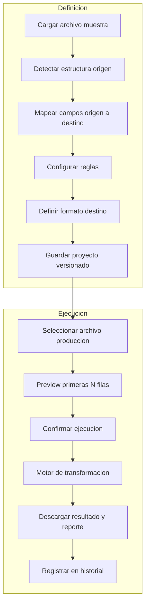
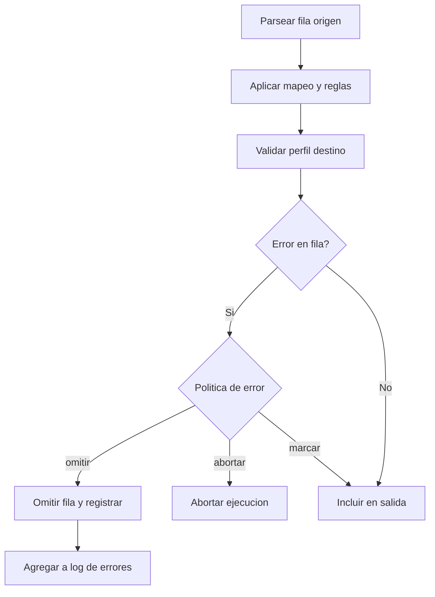
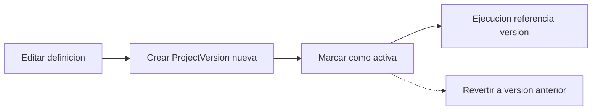
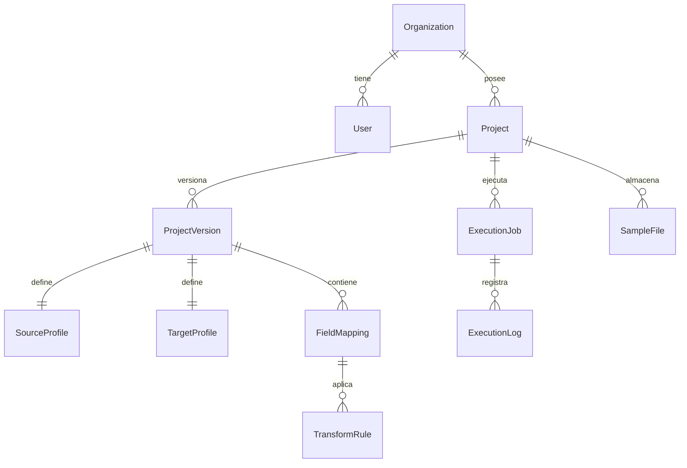

# Data Mapping Studio — Definición de producto

> Documento de definición autónomo. Estado: borrador conceptual.  
> Fuente de ideas: notas iniciales en `Data Mapping Studio.txt`.

---

## 1. Resumen ejecutivo

**Data Mapping Studio** es una plataforma web desarrollada en Python que permite a usuarios de negocio y equipos técnicos **definir, configurar y ejecutar procesos de transformación de archivos** sin escribir código.

La plataforma toma información desde distintos formatos de entrada (TXT, CSV, Excel, JSON, XML, entre otros), interpreta su estructura, mapea campos y genera archivos de salida con la estructura requerida por otro sistema o proceso.

### Propuesta de valor

| Aspecto | Descripción |
|---------|-------------|
| **Problema** | Integraciones basadas en archivos con estructuras distintas, transformaciones manuales y scripts ad-hoc por cada caso |
| **Solución** | Centralizar definiciones de transformación en proyectos reutilizables, con interfaz visual y motor de ejecución |
| **Beneficio** | Menos dependencia del área técnica, menos errores operativos, tiempos de integración más cortos |
| **Audiencia** | Analistas de negocio, operaciones, integradores y desarrolladores que mantienen conversiones recurrentes |

### Posicionamiento

| Alternativa | Limitación | Diferenciador de Data Mapping Studio |
|-------------|------------|--------------------------------------|
| Scripts Python/Perl puntuales | Sin UI, difíciles de mantener, conocimiento tribal | Configuración visual + proyectos versionados |
| Excel / Power Query | Manual, poco auditable en equipo, no escala bien | Definición persistente, historial y ejecución repetible |
| ETL enterprise (Informatica, Talend…) | Costo, complejidad, curva de adopción | Enfoque ligero, orientado a archivos planos y hojas de cálculo |
| iPaaS genéricos | Orientados a APIs, no a TXT posicional legacy | Especialización en formatos legacy y mapeo campo a campo |

---

## 2. Problema que resuelve

Muchas empresas intercambian información entre sistemas mediante archivos planos, hojas de cálculo o reportes exportados. Los problemas recurrentes son:

1. Cada sistema maneja estructuras diferentes (columnas, posiciones, separadores, codificaciones).
2. Los archivos requieren transformaciones manuales antes de cargarse al destino.
3. Existen múltiples scripts desarrollados para casos específicos, sin documentación unificada.
4. Un cambio en la estructura de origen o destino obliga a nuevo desarrollo.
5. Los usuarios de negocio dependen continuamente del área técnica para cada variante.

**Objetivo:** una única plataforma configurable donde cada transformación se guarde como un **proyecto** reutilizable.

### Ejemplo ilustrativo (del borrador original)

**Archivo origen (TXT posicional):**

```
12345JUAN      2500001
12346MARIA     1800002
```

**Definición origen:**

| Campo | Inicio | Longitud |
|-------|--------|----------|
| documento | 1 | 5 |
| nombre | 6 | 10 |
| salario | 16 | 6 |
| estado | 22 | 1 |

**Salida deseada (CSV):**

```csv
documento,nombre,salario
12345,JUAN,250000
12346,MARIA,180000
```

O la misma transformación hacia Excel, JSON u otro formato.

---

## 3. Análisis del borrador actual

### 3.1 Fortalezas

| Elemento | Por qué funciona |
|----------|------------------|
| **7 módulos claros** | Cubren el ciclo completo: definir → mapear → transformar → probar → auditar |
| **Ejemplo TXT posicional** | Caso real y frecuente en integraciones legacy |
| **Proyecto como unidad** | Permite reutilización y gobernanza |
| **Configuración JSON** | Portable, versionable, integrable con API futura |
| **Preview tipo Power Query** | Reduce riesgo antes de ejecución masiva |
| **Mapeo visual (drag & drop)** | Baja barrera para usuarios de negocio |
| **Pipeline del motor** | Leer → parsear → transformar → serializar es el modelo correcto |

### 3.2 Gaps detectados y propuestas

| Gap | Riesgo | Propuesta |
|-----|--------|-----------|
| Formatos de entrada solo esbozados | JSON/XML anidado, múltiples hojas Excel, encoding (UTF-8, Latin-1), BOM | Wizard de origen con detección de encoding (`chardet`), selector de hoja, soporte de rutas JSON/XML |
| Reglas como expresiones Python (`nombre.upper()`) | Seguridad (`eval`), curva de aprendizaje, errores en runtime | Catálogo declarativo de transformaciones + modo avanzado en sandbox aislado |
| Sin validación de esquema destino | Archivos inválidos generados silenciosamente | Perfil destino con tipos, longitudes, campos obligatorios y reporte de rechazos |
| Sin manejo de errores por fila | Un registro malo aborta todo el lote | Política configurable: abortar, omitir fila, registrar en log de errores |
| Sin versionado de proyectos | Cambios rompen ejecuciones en curso | `ProjectVersion` inmutable; cada ejecución referencia una versión |
| Sin entornos (dev/prod) | Pruebas contaminan definiciones productivas | Etiquetas de entorno o copia de proyecto para validación |
| Sin permisos ni multi-tenant | Uso compartido sin control | Roles (diseñador, ejecutor, auditor) y aislamiento por organización |
| Sin API ni scheduling | Solo uso manual en UI | Fase 3: API REST + cola de trabajos + ejecución programada |
| Sin plantillas | Cada usuario empieza desde cero | Biblioteca de plantillas por industria (nómina, clientes, inventario) |
| Sin límites de tamaño | Archivos grandes bloquean el servidor | Preview síncrono; ejecución completa asíncrona con streaming |

---

## 4. Módulos del producto (visión ampliada)

### Módulo 1 — Definición de origen

El usuario carga un **archivo muestra**. La plataforma detecta o permite confirmar:

| Tipo | Detección / configuración |
|------|---------------------------|
| **TXT posicional** | Posición inicio + longitud por campo; opcional trailer/header por línea |
| **TXT delimitado** | Separador (`;`, `\|`, tab), comillas, escape, con/sin encabezado |
| **CSV** | Delimitador, encoding, fila de encabezado |
| **Excel** | Hoja activa o selección; fila de inicio; mapeo por letra de columna o nombre |
| **JSON** | Ruta al array de registros (`$.empleados[]`); campos anidados |
| **XML** | XPath o elemento repetido; namespaces |

**Flujo propuesto:**

1. Subir archivo muestra (máx. N MB para wizard).
2. Auto-detectar tipo y encoding.
3. Mostrar preview de primeras filas parseadas.
4. Usuario ajusta definición y guarda como `SourceProfile`.

### Módulo 2 — Mapeo visual

Pantalla tipo ETL con dos paneles (origen ↔ destino).

**Tipos de relación:**

| Relación | Descripción | Ejemplo |
|----------|-------------|---------|
| 1:1 | Campo origen → campo destino | `documento` → `id_cliente` |
| N:1 | Varios origen → uno destino (concat) | `nombre` + `apellido` → `nombre_completo` |
| 1:N | Un origen → varios destino (split) | `nombre_completo` → `nombre`, `apellido` |
| Constante | Valor fijo en destino | `origen_sistema` = `"SAP"` |
| Calculado | Expresión sobre campos origen | `salario * 1.1` → `salario_ajustado` |

**UX:** drag & drop entre listas de campos + tabla editable para relaciones complejas.

### Módulo 3 — Reglas de transformación

Transformaciones aplicadas **por campo destino** (pipeline ordenado).

**Catálogo declarativo (MVP):**

| Regla | Parámetros | Ejemplo |
|-------|------------|---------|
| `upper` | — | `JUAN` |
| `lower` | — | `juan` |
| `trim` | — | quita espacios |
| `pad_left` | char, length | relleno a izquierda |
| `pad_right` | char, length | relleno a derecha |
| `date_format` | from, to | `DD/MM/YYYY` → `YYYYMMDD` |
| `replace_map` | mapa clave-valor | `M` → `Masculino` |
| `concat` | campos + separador | `nombre` + ` ` + `apellido` |
| `substring` | start, length | extraer porción |
| `default_if_empty` | valor | fallback si vacío |
| `lookup` | tabla externa | código → descripción |

**Modo avanzado (Fase 2):** expresiones en sandbox (sin acceso a filesystem/red), timeout y whitelist de funciones.

**Anti-patrón:** no permitir `eval()` libre de Python en producción.

### Módulo 4 — Definición del destino

Perfil de salida según formato:

| Formato | Configuración |
|---------|---------------|
| TXT posicional | Posición, longitud, padding, alineación por campo |
| TXT/CSV delimitado | Separador, encabezado sí/no, quoting |
| Excel | Nombre hoja, encabezados, tipos de columna |
| JSON | Estructura objeto/array, indentación |
| XML | Elemento raíz, plantilla por registro |

**Validación destino (propuesta):**

- Tipo esperado: string, integer, decimal, date, boolean.
- Longitud máxima (TXT posicional).
- Obligatorio / nullable.
- Patrón regex opcional.

### Módulo 5 — Motor de transformación

Corazón del sistema. Modelo interno tabular: cada fila del origen se convierte en un diccionario normalizado, se transforma y se serializa al destino.

**Pipeline:**

```
Leer archivo
    ↓
Detectar encoding / formato
    ↓
Parsear origen → filas normalizadas
    ↓
Por cada fila:
    aplicar mapeos
    ejecutar pipeline de reglas por campo destino
    validar contra perfil destino
    ↓
Acumular filas válidas / registrar errores
    ↓
Serializar a formato destino
    ↓
Entregar archivo + reporte de ejecución
```

**Modelo conceptual de mapeo (evolución del borrador):**

```python
class FieldMapping:
    source_fields: list[str]      # uno o varios
    target_field: str
    transform_pipeline: list[TransformRule]
    default_value: str | None
    required: bool
```

### Módulo 6 — Pruebas (dry run)

Antes de ejecución masiva:

1. Seleccionar archivo (producción o muestra ampliada).
2. Procesar primeras **N filas** (configurable, default 100).
3. Mostrar preview lado a lado: origen parseado | destino generado.
4. Resaltar filas con error (campo, línea, mensaje).
5. Descargar resultado de prueba y log de errores.

Inspiración: Power Query — validar transformación antes de aplicar al dataset completo.

### Módulo 7 — Historial y auditoría

Cada ejecución registra:

| Campo | Descripción |
|-------|-------------|
| Proyecto | Nombre e ID |
| Versión | `ProjectVersion` usada |
| Archivo origen | Nombre, hash, tamaño |
| Fecha/hora | Inicio y fin |
| Usuario | Quién ejecutó |
| Resultado | éxito, parcial, fallido |
| Métricas | filas leídas, transformadas, rechazadas |
| Errores | Log descargable (CSV/JSON) |
| Archivo salida | Enlace temporal con TTL |

---

## 5. Flujos de proceso

### 5.1 Ciclo de vida del proyecto



### 5.2 Resolución de errores por fila



### 5.3 Versionado de proyecto



---

## 6. Casos de uso

### CU-01 — Nómina TXT posicional a CSV

| | |
|---|---|
| **Actor** | Analista de nómina |
| **Precondición** | Archivo legacy de longitud fija del ERP origen |
| **Flujo** | Crear proyecto → definir campos por posición → mapear a columnas CSV → reglas trim/upper en nombre → preview 100 filas → ejecutar |
| **Resultado** | CSV listo para carga en sistema destino; historial con fecha y usuario |

### CU-02 — Export ERP delimitado a Excel

| | |
|---|---|
| **Actor** | Integrador |
| **Precondición** | Export diario con separador `;` y encabezados en español |
| **Flujo** | Detectar delimitador → renombrar columnas al esquema destino → exportar `.xlsx` con hoja «Empleados» |
| **Resultado** | Excel estandarizado sin edición manual |

### CU-03 — Excel multi-hoja a JSON para API

| | |
|---|---|
| **Actor** | Desarrollador de integraciones |
| **Precondición** | API externa espera array JSON de objetos planos |
| **Flujo** | Seleccionar hoja → mapear columnas → reglas de tipo (fechas ISO, números) → generar JSON |
| **Resultado** | Payload JSON válido para POST a API |

### CU-04 — CSV legacy a TXT posicional mainframe

| | |
|---|---|
| **Actor** | Operador de sistemas legacy |
| **Precondición** | Sistema destino solo acepta ancho fijo |
| **Flujo** | Definir perfil destino con posiciones y longitudes → reglas pad_left en IDs → validar longitud máxima |
| **Resultado** | TXT posicional conforme al layout mainframe |

### CU-05 — Normalización de fechas y códigos de género

| | |
|---|---|
| **Actor** | Usuario de negocio |
| **Precondición** | Origen con fechas `DD/MM/YYYY` y códigos `M`/`F` |
| **Flujo** | Regla `date_format` → `replace_map` en género → preview con diff |
| **Resultado** | Datos normalizados sin intervención manual |

### CU-06 — Reutilización mensual de proyecto

| | |
|---|---|
| **Actor** | Analista operativo |
| **Precondición** | Proyecto «Nómina SAP» ya definido y validado |
| **Flujo** | Cada mes: subir nuevo archivo → dry run → ejecutar → descargar |
| **Resultado** | Misma transformación aplicada sin reconfigurar |

### CU-07 — Prueba previa detectando filas inválidas

| | |
|---|---|
| **Actor** | Cualquier ejecutor |
| **Precondición** | Archivo con registros corruptos o campos vacíos obligatorios |
| **Flujo** | Preview 100 filas → revisar panel de errores → ajustar reglas o política «omitir» → re-probar |
| **Resultado** | Ejecución productiva sin sorpresas |

### CU-08 — Auditoría de ejecuciones fallidas

| | |
|---|---|
| **Actor** | Supervisor / auditor |
| **Precondición** | Historial con ejecuciones del mes |
| **Flujo** | Filtrar por resultado «fallido» o «parcial» → descargar log → identificar patrón de error |
| **Resultado** | Trazabilidad completa para cumplimiento y mejora continua |

---

## 7. Modelo conceptual de datos

Sin acoplar a un framework concreto. Entidades principales:



| Entidad | Descripción |
|---------|-------------|
| `Organization` | Tenant / empresa (multi-tenant futuro) |
| `User` | Diseñador, ejecutor o auditor |
| `Project` | Contenedor lógico (nombre, descripción, estado) |
| `ProjectVersion` | Snapshot inmutable de la definición |
| `SourceProfile` | Tipo y parámetros del origen |
| `TargetProfile` | Tipo, layout y validaciones del destino |
| `FieldMapping` | Relación origen → destino + pipeline |
| `TransformRule` | Regla tipada del catálogo |
| `SampleFile` | Archivo de ejemplo para el wizard |
| `ExecutionJob` | Una corrida del motor |
| `ExecutionLog` | Errores y métricas por job |

### Esquema JSON de configuración (v1 propuesto)

```json
{
  "schema_version": "1.0",
  "project": {
    "name": "Nomina SAP",
    "description": "TXT posicional nómina → CSV carga RRHH"
  },
  "source": {
    "type": "txt_fixed",
    "encoding": "latin-1",
    "line_ending": "lf",
    "fields": [
      {"name": "documento", "start": 1, "length": 5},
      {"name": "nombre", "start": 6, "length": 10},
      {"name": "salario", "start": 16, "length": 6},
      {"name": "estado", "start": 22, "length": 1}
    ]
  },
  "target": {
    "type": "csv",
    "delimiter": ",",
    "include_header": true,
    "encoding": "utf-8",
    "fields": [
      {"name": "documento", "type": "string", "required": true},
      {"name": "nombre", "type": "string", "max_length": 50},
      {"name": "salario", "type": "integer", "required": true}
    ]
  },
  "mappings": [
    {
      "source_fields": ["documento"],
      "target_field": "documento",
      "transforms": []
    },
    {
      "source_fields": ["nombre"],
      "target_field": "nombre",
      "transforms": [
        {"op": "trim"},
        {"op": "upper"}
      ]
    },
    {
      "source_fields": ["salario"],
      "target_field": "salario",
      "transforms": [
        {"op": "trim"}
      ]
    }
  ],
  "error_policy": "skip_row"
}
```

---

## 8. Arquitectura técnica sugerida

### 8.1 Stack

| Capa | Tecnología candidata |
|------|---------------------|
| Backend | Python 3.11+ |
| Web framework | Django (UI + admin) o FastAPI (API-first) + frontend SPA |
| Tabular | pandas o polars (evaluar polars por rendimiento en archivos grandes) |
| Excel | openpyxl |
| XML | lxml |
| Encoding | chardet |
| Cola async | Celery + Redis o RQ (archivos grandes) |
| Almacenamiento | PostgreSQL (metadatos) + object storage o filesystem con TTL (archivos) |

### 8.2 Estructura de código propuesta

```
datamappingstudio/
├── parsers/           # txt_fixed, txt_delimited, csv, xlsx, json, xml
├── engine/            # pipeline, row_processor, error_collector
├── serializers/       # writers por formato destino
├── rules/             # catálogo de transformaciones
├── models/            # entidades de dominio
├── api/               # REST (fase 3)
└── web/               # vistas y templates
```

### 8.3 Modos de ejecución

| Modo | Cuándo | Comportamiento |
|------|--------|----------------|
| **Preview** | Wizard y dry run | Síncrono, máx. N filas, respuesta inmediata |
| **Batch** | Archivo completo | Asíncrono, job en cola, notificación al terminar |
| **Streaming** | Archivos muy grandes (Fase 2+) | Lectura por chunks, sin cargar todo en memoria |

---

## 9. Roles y permisos (propuesta)

| Rol | Permisos |
|-----|----------|
| **Diseñador** | Crear/editar proyectos, definir mapeos y reglas |
| **Ejecutor** | Ejecutar proyectos existentes, dry run, descargar resultados |
| **Auditor** | Solo lectura de historial y logs |
| **Admin** | Gestión de usuarios, organización, límites |

---

## 10. MVP y roadmap

### Fase MVP

| Incluido | Excluido (post-MVP) |
|----------|---------------------|
| TXT posicional | JSON/XML anidado |
| CSV/TXT delimitado | API REST |
| Excel lectura/escritura | Scheduling |
| Mapeo visual básico | Multi-tenant |
| Catálogo reglas básicas (upper, trim, date_format, replace_map, concat) | Sandbox Python |
| Preview 100 filas | Pipelines encadenados |
| Salida CSV y Excel | Marketplace de plantillas |
| Historial simple | |

### Fase 2

- JSON y XML como origen/destino.
- Validación completa de esquema destino.
- Versionado explícito de proyectos.
- Ejecución batch asíncrona.
- Reglas lookup con tablas de referencia.
- Políticas de error configurables.

### Fase 3

- API REST para ejecución y consulta.
- Scheduling (cron) de transformaciones recurrentes.
- Multi-tenant y roles avanzados.
- Biblioteca de plantillas por industria.
- Webhooks al completar job.

---

## 11. Riesgos y decisiones abiertas

| Tema | Opciones | Recomendación inicial |
|------|----------|----------------------|
| Motor de reglas | DSL propio / expresiones limitadas / Python sandbox | Catálogo declarativo en MVP; sandbox en Fase 2 |
| Librería tabular | pandas vs polars | polars si archivos >100MB son frecuentes |
| Un proyecto = ? | Un par origen-destino vs pipeline multi-etapa | Un par origen-destino en MVP; encadenar en Fase 3 |
| Límite de archivo | Tamaño máximo por plan | 50 MB preview, 500 MB batch (ajustable) |
| Almacenamiento de salida | Persistente vs TTL | TTL 7 días por defecto; opción persistente en planes superiores |
| Integración futura | Plataformas de gestión de datos hermanas | Mantener JSON exportable y API desacoplada del motor |

---

## 12. Métricas de éxito (propuesta)

| Métrica | Objetivo MVP |
|---------|--------------|
| Tiempo para definir primera transformación | < 30 minutos sin ayuda técnica |
| Tasa de éxito en dry run | > 95% en proyectos validados |
| Reutilización | > 3 ejecuciones por proyecto activo |
| Reducción de scripts ad-hoc | Cuantificar scripts reemplazados por trimestre |

---

## 13. Próximos pasos sugeridos

1. **Validar formatos MVP** con 2–3 casos reales internos (TXT posicional, CSV, Excel).
2. **Congelar esquema JSON v1** y escribir tests del motor con fixtures de archivos.
3. **Prototipar UI de mapeo** (HTML estático) antes de implementar backend.
4. **Definir catálogo mínimo de reglas** y documentar cada una con ejemplos.
5. **Decidir framework web** (Django monolito vs API + frontend) según equipo y plazo.
6. **PoC del parser TXT posicional** como primer entregable técnico desacoplado de la UI.

---

## 14. Glosario

| Término | Definición |
|---------|------------|
| **Proyecto** | Definición reutilizable de una transformación origen → destino |
| **Perfil origen** | Descripción de cómo interpretar el archivo de entrada |
| **Perfil destino** | Descripción de cómo generar el archivo de salida |
| **Mapeo** | Relación entre campos origen y destino |
| **Pipeline de reglas** | Secuencia ordenada de transformaciones sobre un campo |
| **Dry run** | Ejecución de prueba sobre un subconjunto de filas |
| **Job** | Una ejecución concreta del motor sobre un archivo |

---

*Última actualización: definición inicial a partir de notas conceptuales. Documento independiente; integración con otros sistemas pendiente de decisión explícita.*
