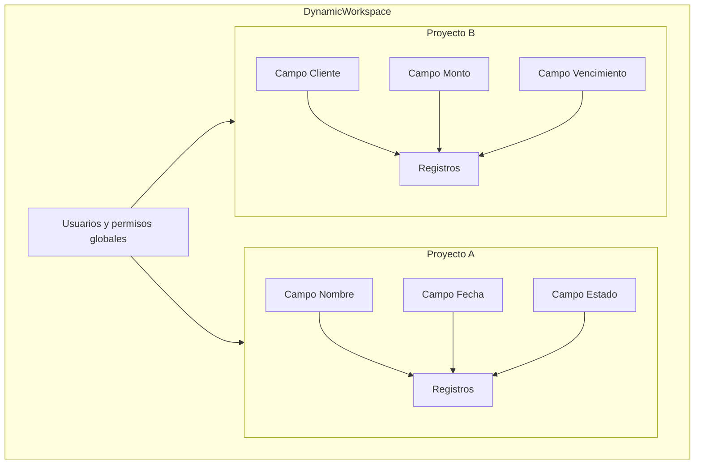
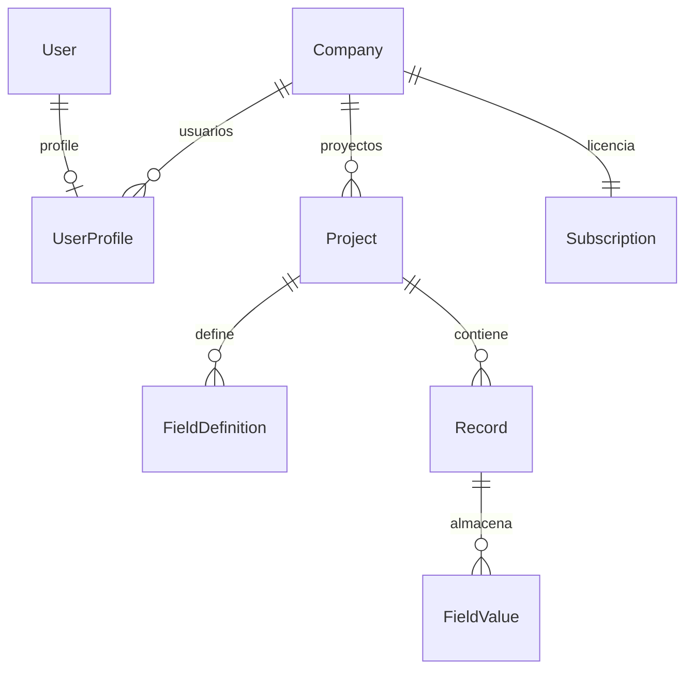
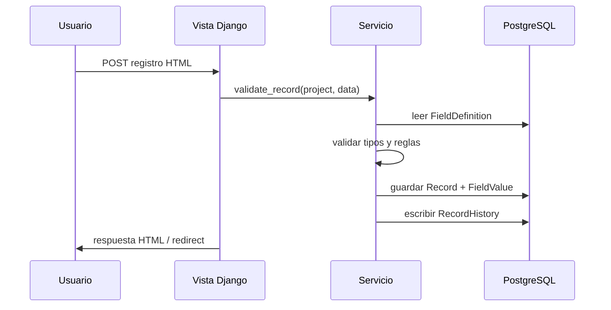

# DynamicWorkspace — Propuesta de producto y arquitectura

> Fuente de verdad para alinear producto, diseño técnico y fases de implementación (`docs/definition_app/`).

---

## 1. Resumen ejecutivo

**DynamicWorkspace** es una plataforma web multiusuario que sustituye hojas de cálculo  dispersas por **proyectos configurables**: cada proyecto actúa como una tabla con campos definidos dinámicamente (texto, números, fechas, listas, etc.), usuarios autorizados por rol y registros con auditoría completa.

**Propuesta de valor:**

> Una plataforma configurable para reemplazar hojas de cálculo operativas dispersas, permitiendo crear aplicaciones de gestión personalizadas sin desarrollo, con control de usuarios, auditoría y estructuras de datos dinámicas.

| Aspecto | Decisión |
|---------|----------|
| **Producto** | DynamicWorkspace |
| **Stack** | Python, Django, HTML, JavaScript, CSS (sin Django Forms) |
| **Email** | Resend |
| **Deploy** | Railway + PostgreSQL |
| **Usuarios objetivo** | Equipos operativos que hoy usan Excel para controles y gestiones ligeras |

### Documentación relacionada

| Documento | Contenido |
|-----------|-----------|
| [`docs/definition_app/`](definition_app/README.md) | Definición, reglas y diseño por app Django |
| [`docs/definition_app_DMS/`](definition_app_DMS/README.md) | **Data Mapping Studio** — ETL acoplado a la plataforma ([integración](definition_app_DMS/dms_integration.md); origen MVP: [source_definition.md](definition_app_DMS/source_definition.md)) |
| [`docs/ESTRUCTURA_PROYECTO.md`](ESTRUCTURA_PROYECTO.md) | Árbol de carpetas y checklist para nuevos proyectos |
| [`docs/definition_app/UI_MESSAGES.md`](definition_app/UI_MESSAGES.md) | Catálogo de mensajes UI, `error_code`, reglas vista/servicio |
| [`docs/definition_app/DynamicWorkspace_Model.md`](definition_app/DynamicWorkspace_Model.md) | Modelos de datos, relaciones e integridad |
| [`docs/security/SEGURIDAD_Y_ACCESOS.md`](security/SEGURIDAD_Y_ACCESOS.md) | Flujos de login, correo, 2FA |
| [`docs/security/GUIA_IMPLEMENTACION_SEGURIDAD.md`](security/GUIA_IMPLEMENTACION_SEGURIDAD.md) | Implementación técnica de seguridad |
| [`docs/definition_app/public.md`](definition_app/public.md) | Sitio público y guía `/ayuda/` |
| [`docs/definition_app/help.md`](definition_app/help.md) | Guía de flujos UF `/app/ayuda/` |

---

## 2. Problema que resuelve

Los equipos crean archivos Excel para:

- Controles de actividades
- Gestiones operativas con poca extensión de datos
- Seguimiento ad hoc sin sistema formal

**Limitaciones actuales de Excel:**

- Sin control centralizado de acceso por rol
- Sin auditoría fiable de quién cambió qué
- Estructuras duplicadas y dispersas
- Dificultad para filtrar, buscar y escalar
- Versiones locales sin fuente única de verdad

**Objetivo:** un sistema donde cada equipo defina su propia “hoja” sin tocar código, con permisos, historial y búsqueda.

---

## 3. Concepto central



Cada **proyecto** = una tabla configurable independiente:

1. El administrador define campos (tipo, longitud, validaciones, obligatoriedad).
2. Se asignan usuarios con roles.
3. Los usuarios crean, consultan, editan y filtran **registros** según esa estructura.
4. Dos proyectos pueden tener estructuras completamente distintas sin cambiar el código.

---

## 4. Alcance funcional

### 4.1 Gestión de proyectos

| Función | Descripción |
|---------|-------------|
| Crear proyecto | Nombre, descripción, icono/color opcional |
| Configurar campos | Definición dinámica del esquema |
| Asignar usuarios | Invitar o autorizar por email |
| Archivar proyecto | Ocultar sin borrar datos |
| Plantilla de proyecto | Duplicar estructura de campos (mejora propuesta) |

### 4.2 Gestión de registros

| Función | Descripción |
|---------|-------------|
| CRUD | Crear, leer, actualizar, eliminar (soft delete recomendado) |
| Listado paginado | Tabla tipo Excel con columnas del proyecto |
| Filtros | Por campo, operadores según tipo |
| Búsqueda | Texto libre en campos de texto |
| Ordenamiento | Por cualquier columna visible |
| Exportar Excel | Simetría con importación (mejora propuesta) |

### 4.3 Importación desde Excel

Flujo crítico para adopción:

```
Excel existente → Análisis de columnas → Creación automática de campos → Carga de registros
```

- Detección de tipos (texto, número, fecha)
- Mapeo manual de columnas si hace falta
- Vista previa antes de confirmar
- Reporte de filas con error

### 4.4 Auditoría e historial

| Dato | Nivel |
|------|-------|
| Quién creó el registro | Registro |
| Quién modificó | Registro + por campo |
| Fecha creación / modificación | Registro |
| Valor anterior | Historial de cambios por campo |

Pregunta que el sistema debe responder: *¿Quién cambió este valor y cuándo?*

---

## 5. Tipos de campo — implementación por fases

### Fase MVP (imprescindible)

| Tipo | Validaciones |
|------|--------------|
| Texto corto | Longitud máxima |
| Texto largo | Longitud máxima |
| Número entero | Rango min/max |
| Decimal | Rango, decimales |
| Fecha | Formato, rango |
| Fecha y hora | Formato, rango |
| Sí/No | Booleano |
| Lista desplegable | Opciones definidas en el campo |

### Fase 2

| Tipo | Notas |
|------|-------|
| Selección múltiple | Array de opciones |
| Correo electrónico | Formato + unicidad opcional |
| Teléfono | Máscara / formato |
| URL | Validación de formato |
| Estado | Lista con colores (workflow ligero) |

### Fase 3

| Tipo | Notas |
|------|-------|
| Archivo adjunto | Almacenamiento en Railway/S3 |
| Imagen | Preview en listado |
| Usuario responsable | FK a usuario del proyecto |
| Etiquetas | Tags libres o predefinidos |
| Campo calculado | Fórmulas simples entre campos numéricos/fechas |

---

## 6. Seguridad y accesos (resumen)

La seguridad se documenta en **`docs/security/`**. Aquí solo el resumen; el detalle de flujos, modelos e implementación está en los documentos enlazados.

### Tipos de usuario global

| Código | Rol | Alcance principal |
|--------|-----|-------------------|
| `UA` | User Admin | Configuración del sistema |
| `US` | User System | Crear usuarios UF, gestionar usuarios de proyecto, auditoría |
| `UF` | User Final | Crear proyectos; autorizar usuarios al proyecto |

### Roles por proyecto

| Rol | Permisos principales |
|-----|----------------------|
| `PA` — Admin de proyecto | Diseñar estructura, gestionar miembros, auditoría |
| `ED` — Editor | Crear y modificar registros |
| `CO` — Consulta | Solo lectura |
| `GE` — Generar | Exportar a otros formatos |

**Reglas clave:**

- **Compañía** es el tenant principal; todo usuario y proyecto pertenece a una compañía.
- Sin registro público: **UA/US** crean cuentas (con compañía asignada).
- Login con contraseña + **2FA (TOTP)** + verificación por correo en primer acceso.
- US/UF requieren **suscripción vigente** de la compañía para acceder a `/app/`.
- Sin membresía al proyecto → sin acceso a datos del proyecto.

**Documentación completa:**

- Compañía: [`definition_app/company.md`](definition_app/company.md)
- Billing: [`definition_app/billing.md`](definition_app/billing.md)
- Flujos: [`security/SEGURIDAD_Y_ACCESOS.md`](security/SEGURIDAD_Y_ACCESOS.md)
- Implementación: [`security/GUIA_IMPLEMENTACION_SEGURIDAD.md`](security/GUIA_IMPLEMENTACION_SEGURIDAD.md)
- Modelos usuario: [`definition_app/accounts.md`](definition_app/accounts.md) · [`definition_app/DynamicWorkspace_Model.md`](definition_app/DynamicWorkspace_Model.md#userprofile)
- Aprovisionamiento masivo UF (pendiente Fase 1+): [`definition_app/accounts_provisioning.md`](definition_app/accounts_provisioning.md)
- Permisos por proyecto: [`definition_app/projects.md`](definition_app/projects.md) · [`definition_app/DynamicWorkspace_Model.md`](definition_app/DynamicWorkspace_Model.md#projectmembership)

---

## 7. Arquitectura de datos — evaluación y recomendación

### Opciones analizadas

| Opción | Ventajas | Desventajas |
|--------|----------|-------------|
| **EAV puro** | Máxima flexibilidad; consultas por tipo | Consultas complejas; muchas filas por registro |
| **JSON por registro** | Simple de implementar; esquema flexible | Filtrado/indexado más costoso sin PostgreSQL JSONB |
| **Columnas dinámicas reales** | Consultas SQL rápidas | Requiere migrar DDL al cambiar campos; no recomendado |
| **Híbrido (recomendado)** | Metadatos relacionales + valores flexibles | Algo más de diseño inicial |

### Recomendación: modelo híbrido

Detalle de entidades y campos en [`definition_app/DynamicWorkspace_Model.md`](definition_app/DynamicWorkspace_Model.md).



Diagrama completo en [`definition_app/DynamicWorkspace_Model.md`](definition_app/DynamicWorkspace_Model.md).

**Por qué híbrido:**

1. **`FieldDefinition`** en tablas relacionales → UI, validación y permisos estables.
2. **`FieldValue`** con columnas tipadas (`value_text`, `value_number`, etc.) → filtros eficientes en PostgreSQL.
3. **`value_json`** como respaldo para tipos compuestos (selección múltiple, etiquetas).
4. Evita alterar el esquema SQL cada vez que un usuario añade un campo.

**Base de datos en producción:** PostgreSQL en Railway (no SQLite). SQLite solo para desarrollo local.

**Mejora propuesta:** versionar el esquema de campos (`FieldDefinition.version`). Si se cambia el tipo de un campo, los registros antiguos conservan historial y se valida la migración de datos.

---

## 8. Arquitectura de aplicación (Django)

Detalle por app en [`definition_app/`](definition_app/README.md).

```
apps/
├── core/              # Utilidades, permisos, correo
├── company/           # Company (tenant principal)
├── billing/           # Plan, Subscription, Payment
├── accounts/          # Usuarios, UserProfile + company
├── security/          # Login, correo, 2FA
├── dashboard/         # Home y bienvenida
├── public/            # Sitio público (inicio, servicios, contacto, guía)
├── help/              # Guía de flujos UF (/app/ayuda/)
├── projects/          # Proyecto por compañía, membresías
├── fields/            # FieldDefinition, validadores
├── records/           # Record, FieldValue, CRUD
├── audit/             # RecordHistory, eventos
├── imports/           # Importación Excel
└── dms/               # Data Mapping Studio — ver definition_app_DMS/
```

**Modelo tenant:** `Company` → usuarios (`UserProfile`) → proyectos → registros **o** mapeos DMS (`project_kind`). Ver [`definition_app/DynamicWorkspace_Model.md`](definition_app/DynamicWorkspace_Model.md).

### Convenciones técnicas (ya definidas)

- Formularios en **HTML plano**; procesamiento en vistas con validación manual.
- **Sin Django Forms** (`forms.py`, `ModelForm`).
- JavaScript en `static/js/` para filtros, tablas dinámicas y UX tipo hoja de cálculo.
- Resend para invitaciones y notificaciones.
- WhiteNoise + Gunicorn en Railway (`gthread`, `CONN_MAX_AGE=600`).
- Producción: `DJANGO_SETTINGS_MODULE=dynamicworkspace.production` — detalle en [`README.md`](../README.md) § Deploy Railway.

### Flujo de una petición



---

## 9. Interfaz de usuario (visión)

| Pantalla | Descripción |
|----------|-------------|
| Dashboard | Proyectos del usuario, accesos recientes |
| Diseñador de campos | Drag-and-drop o lista ordenable de campos |
| Vista de registros | Tabla editable tipo Excel, filtros en cabecera |
| Detalle de registro | Formulario HTML + panel de historial |
| Gestión de usuarios | Tabla de miembros y roles del proyecto |
| Importar | Wizard: subir Excel → mapear → confirmar |

**Mejora propuesta:** vista de “tarjetas” opcional además de tabla, para proyectos con pocos campos.

---

## 10. Requisitos no funcionales

| Requisito | Objetivo |
|-----------|----------|
| Seguridad | Ver [`security/`](security/) — CSRF, sesión, 2FA, permisos por proyecto |
| Rendimiento | Paginación; índices en `project_id`, `field_id`, columnas tipadas |
| Escalabilidad | Límites configurables: campos por proyecto, registros por proyecto |
| Disponibilidad | Railway con health check |
| Backup | Backups automáticos de PostgreSQL en Railway |
| Accesibilidad | Formularios HTML semánticos, contraste, teclado |

---

## 11. Mejoras propuestas sobre el contexto original

| # | Mejora | Justificación |
|---|--------|---------------|
| 1 | **PostgreSQL + modelo híbrido** en lugar de solo EAV o solo JSON | Balance entre flexibilidad y rendimiento de filtros |
| 2 | **Soft delete** en registros | Recuperación ante borrados accidentales |
| 3 | **Exportar a Excel** | Paridad con importación; facilita transición |
| 4 | **Plantillas de proyecto** | Reutilizar estructuras comunes sin redefinir campos |
| 5 | **Versionado de esquema** | Cambios de campo sin romper datos históricos |
| 6 | **Invitaciones por email** (Resend) | Onboarding de usuarios al proyecto |
| 7 | **Límites por plan** | Evitar proyectos con miles de campos que degraden UX |
| 8 | **Campos calculados en Fase 3** | Reducir fórmulas manuales que hoy viven en Excel |
| 9 | **API REST opcional (Fase 3)** | Integraciones futuras sin reescribir el núcleo |
| 10 | **Búsqueda guardada** | Filtros frecuentes (“Estado=Pendiente”) como vistas |

---

## 12. Roadmap sugerido

### Fase 0 — Fundación (actual)

- [x] Proyecto Django inicializado
- [x] Estructura de carpetas y reglas Cursor
- [ ] Autenticación, compañía, billing y CRUD usuarios (ver [`definition_app/company.md`](definition_app/company.md), [`definition_app/billing.md`](definition_app/billing.md), [`definition_app/accounts.md`](definition_app/accounts.md))
- [ ] Modelo `Project`, `FieldDefinition`, `Record`, `FieldValue`

> **Pendiente Fase 1+ (no bloquea Fase 0):** aprovisionamiento masivo UF — [`definition_app/accounts_provisioning.md`](definition_app/accounts_provisioning.md)

### Fase 1 — MVP

- CRUD de proyectos y campos (tipos básicos)
- CRUD de registros con tabla HTML + JS
- Roles por proyecto: PA, ED, CO, GE (ver [`definition_app/projects.md`](definition_app/projects.md))
- Auditoría básica (creado por, modificado por, fechas)
- Deploy en Railway + PostgreSQL

### Fase 2 — Adopción

- Importación desde Excel
- Exportación a Excel
- Filtros y búsqueda avanzada
- Historial de cambios por campo
- Invitaciones por email (Resend)

### Fase 3 — Madurez

- Tipos de campo avanzados (archivos, imágenes, calculados)
- Plantillas de proyecto
- Permisos por campo
- API REST
- Notificaciones y workflows de estado

---

## 13. Riesgos y mitigaciones

| Riesgo | Mitigación |
|--------|------------|
| Cambiar tipo de campo rompe datos | Versionado de esquema + reglas de migración |
| Filtros lentos con muchos registros | Índices, paginación, columnas tipadas en `FieldValue` |
| Expectativa “igual que Excel” | UX de tabla editable + import/export desde el MVP |
| Complejidad del diseñador de campos | Empezar con lista ordenable; drag-and-drop en Fase 2 |
| Sin Django Forms → más código manual | Capa de servicios `validators/` reutilizable por tipo |

---

## 14. Métricas de éxito

| Métrica | Meta inicial |
|---------|--------------|
| Tiempo de crear un proyecto con 5 campos | < 5 minutos |
| Importar Excel de 100 filas | < 2 minutos |
| Usuarios activos por proyecto | ≥ 2 en pilotos |
| Adopción | ≥ 1 proyecto por equipo piloto en 30 días |

---

## 15. Próximos pasos inmediatos

1. Validar esta propuesta (alcance MVP vs Fase 2).
2. Crear app `projects` con modelos base.
3. Implementar seguridad según [`security/GUIA_IMPLEMENTACION_SEGURIDAD.md`](security/GUIA_IMPLEMENTACION_SEGURIDAD.md)
4. Pantalla diseñador de campos + vista tabla de registros.
5. Migrar de SQLite local a PostgreSQL en Railway.

---

*Documento: `docs/DynamicWorkspace.md` — DynamicWorkspace*
