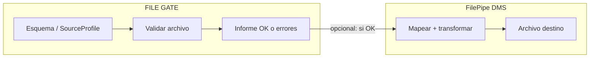
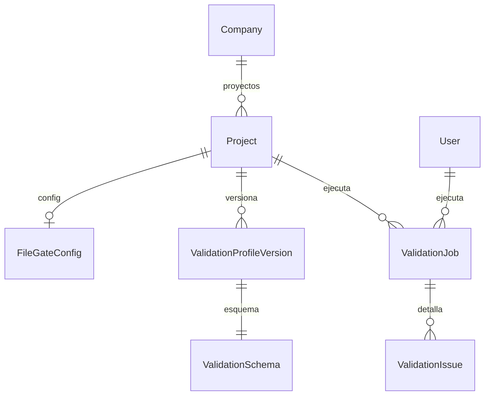

# FILE GATE — Validador de archivos

> **Nombre mnemotécnico:** `FILE_GATE`  
> Alias: *Validador de archivos*  
> Archivo: [`docs/FILE_GATE.md`](FILE_GATE.md)  
> Estado: **definición de producto + Módulo 1 implementado** — priorizado en [`APP_FACTORY.md`](APP_FACTORY.md) §5.  
> Estilo de documento: hermano de [`DynamicWorkspace.md`](DynamicWorkspace.md) y [`DataMappingStudio.md`](DataMappingStudio.md).

### Rama de desarrollo y despliegues

| Ítem | Valor |
|------|--------|
| **Rama Git** | `feature/file-gate` |
| **Base** | `main` (punto estable en producción / Railway) |
| **Alcance de la rama** | Análisis, diseño, prototipos, código de la app FILE GATE y docs asociados |
| **Base de datos** | Por ahora **sin cambios de BD** en esta etapa; cuando haya migraciones, irán solo en esta rama y se documentarán antes del merge |
| **Despliegues a Railway** | **No desplegar** desde `feature/file-gate` hasta merge a `main` (salvo entorno staging explícito). Producción sigue anclada a `main`. |
| **Merge a `main`** | Cuando el vertical tenga MVP revisado; PR desde `feature/file-gate` → `main` |
| **Respaldo recomendado** | Tag/rama `pre-file-gate` en `main` + backup BD antes del primer merge que toque datos |

> Varios commits y desarrollos vivirán en `feature/file-gate`. Quien despliegue debe usar **`main`**, no esta rama de feature.

---

## 1. Resumen ejecutivo

**FILE GATE** es un aplicativo de la plataforma DynamicWorkspace que permite a equipos operativos y de integración **definir un esquema de archivo válido y comprobar si un archivo real lo cumple**, sin transformar ni generar salida de negocio.

Flujo esencial:

```
Definir esquema (perfil de validación)
        →
Subir archivo
        →
Parsear + validar fila a fila
        →
Informe: OK / parcial / rechazado + detalle de errores
```

### Propuesta de valor

| Aspecto | Descripción |
|---------|-------------|
| **Problema** | Archivos corruptos, incompletos o fuera de layout llegan tarde al proceso (carga ERP, intercambio bancario, nómina). Corregir después cuesta más. |
| **Solución** | Un **proyecto de validación** reutilizable: esquema versionado + ejecución + reporte auditable |
| **Beneficio** | Detección temprana, menos scripts ad-hoc, evidencia para proveedores/terceros |
| **Audiencia** | Operaciones, control de calidad de datos, integradores, supervisores de intercambio |

### Posicionamiento

| Alternativa | Limitación | Diferenciador FILE GATE |
|-------------|------------|-------------------------|
| Abrir en Excel y “mirar” | No escala, no audita, no valida layout posicional | Validación repetible y reportable |
| Script Python puntual | Conocimiento tribal, sin UI ni historial | Proyecto con roles, versiones e informe |
| FilePipe / DMS completo | Transforma y genera destino (más pasos) | Solo **validar**; sin mapeo ni serialización destino |
| ETL enterprise | Costo y complejidad | Ligero, orientado a archivos planos y hojas |

### Relación con la plataforma

| Pieza | Relación |
|-------|----------|
| Chasis (`Company`, seguridad, billing, roles) | Reutilizado al 100 % |
| DMS — `SourceProfile`, parsers, `ExecutionErrorCode`, intake | **Núcleo técnico** a reutilizar |
| DMS — Target / Field mapping / Transform pipeline de salida | **Fuera de alcance** del MVP (no genera archivo destino de negocio) |
| DynamicWorkspace — Records/EAV | Opcional Fase 2+ (guardar hallazgos como registros) |

---

## 2. Importancia

1. **Primera línea de calidad** antes de cualquier transformación o carga.
2. **Alto reuso / bajo esfuerzo:** APP_FACTORY lo priorizó #1 porque casi todo el motor de parseo y reporte ya existe en FilePipe.
3. **Demanda transversal:** bancos, gobierno, nómina, proveedores, EDI ligero.
4. **Complementa DMS:** un archivo que no pasa FILE GATE no debería entrar a un job de transformación productiva.
5. **Producto vendible solo:** muchos clientes necesitan “certificar el archivo” sin ETL.

---

## 3. Problema que resuelve

Escenarios típicos:

- El proveedor envía un TXT posicional con longitudes incorrectas o encoding Latin-1 vs UTF-8.
- Un CSV mensual llega sin columnas obligatorias o con fechas en formato distinto.
- Un Excel tiene la hoja equivocada o filas de encabezado desplazadas.
- Operaciones descubre el error **después** de intentar cargar al ERP.

**Objetivo:** una definición persistente (“este es el contrato del archivo”) y una ejecución que diga **sí / no / parcial**, con evidencia descargable.

---

## 4. Alcance

### 4.1 Incluido (MVP)

| Incluido | Descripción |
|----------|-------------|
| Perfil de validación | Basado en definición de origen (tipo, encoding, captura, campos, reglas de contenido) |
| Versionado | Publicar versión inmutable; ejecuciones referencian versión publicada |
| Upload de archivo | Misma familia que file intake (límites, extensión, sanitización) |
| Validación síncrona | Preview / lote acotado en MVP (p. ej. ≤ 50 MB o N filas configurables) |
| Informe | Resumen + errores por fila/campo + descarga JSON/CSV |
| Historial | Quién validó, cuándo, archivo, resultado, métricas |
| Roles | Diseñar esquema / ejecutar validación / solo ver historial (mapa a PA/ED/GE/CO) |

### 4.2 Excluido (MVP)

| Excluido | Motivo / fase |
|----------|----------------|
| Generar archivo destino transformado | Es FilePipe/DMS |
| Mapeo origen → destino | DMS |
| Scheduling / API pública | Fase 3 |
| Conciliación entre dos archivos | Otro vertical (Conciliador) |
| Corrección automática del archivo | Fase 2+ (sugerencias; no reescritura completa) |
| JSON/XML anidado complejo | Alinear a lo ya soportado en DMS; anidado profundo Fase 2 |

### 4.3 Frontera con FilePipe (DMS)



**Regla de producto:** FILE GATE **no escribe** un archivo de salida de negocio. Puede opcionalmente exportar un **archivo de errores** (CSV/JSON de rechazos) — eso es informe, no transformación.

---

## 5. Aplicaciones (casos de negocio)

| # | Aplicación | Ejemplo |
|---|------------|---------|
| A1 | Intercambio bancario / pagos | Validar layout de archivo de abonos antes de enviar al banco |
| A2 | Nómina / RRHH | Comprobar TXT posicional del ERP antes de carga a sistema de pago |
| A3 | Proveedores / EDI ligero | Gate de recepción: el proveedor sube y ve el informe de conformidad |
| A4 | Gobierno / reportes regulatorios | Certificar que el CSV cumple columnas y tipos exigidos |
| A5 | Pre-check de FilePipe | Antes del job DMS, exigir validación FILE GATE en verde |
| A6 | QA de exportaciones | El área de sistemas exporta; operaciones valida contra el contrato |
| A7 | Onboarding de layouts | Documentar el contrato del archivo y usarlo como prueba de aceptación |

---

## 6. Módulos del producto

### Módulo 1 — Definición del esquema (contrato)

> **Detalle:** [`definition_app_FILE_GATE/schema_definition.md`](definition_app_FILE_GATE/schema_definition.md)  
> **Prototipos:** [`prototype/file_gate/`](../prototype/file_gate/)  
> **Estado:** **implementado** (`apps/file_gate`, URLs `/app/file-gate/...`).

Reutiliza en lo posible el asistente de **definición de origen** (pasos tipo SourceProfile) — **no** destino (`target_definition`):

| Paso | Contenido |
|------|-----------|
| 1 | Tipo de archivo (`SourceFileType`) + encoding / line ending |
| 2–3 | Captura inicio / fin |
| 4 | Campos (posicional, delimitado, xlsx, …) + tipos / required / pattern |
| 5 | Reglas de contenido (excluded_chars, forbidden_patterns, …) |
| 6 | Contrato de informe (qué reportar, umbrales de alerta) |

**Diferencia de UX vs DMS:** el copy y el hub hablan de **“contrato de validación”**, no de “origen para transformar”.

### Módulo 2 — Políticas de validación

> **Detalle:** [`definition_app_FILE_GATE/gate_policy.md`](definition_app_FILE_GATE/gate_policy.md)  
> **Prototipos:** `prototype/file_gate/policy_*.html`  
> **Estado:** **implementado** (`apps/file_gate/policy`, URLs `/app/file-gate/.../politicas/...`).

| Política | Descripción | MVP |
|----------|-------------|-----|
| `abort_on_first_fatal` | Detener al primer error fatal de parseo | Sí |
| `collect_all` | Recorrer todo el archivo (o tope N) y acumular errores | Sí (default) |
| `max_errors` | Cortar recolección al llegar a N errores | Sí |
| `reject_threshold` | Marcar job `failed` si rechazos > N o > X % | Sí (Módulo 2 es la fuente canónica; Paso 6 del esquema solo lo referencia) |
| `warn_only` | Contar advertencias sin fallar el job | Fase 2 |

Severidades:

| Severidad | Ejemplos |
|-----------|----------|
| **Error** | Campo obligatorio vacío, tipo inválido, longitud posicional excedida, patrón fallido |
| **Advertencia** | Encoding detectado ≠ declarado, fila corta vs `capture_end`, columnas extra ignoradas |
| **Info** | Filas omitidas por captura, detección automática aplicada |

### Módulo 3 — Ejecución de validación (File Gate Run)

> **Detalle:** [`definition_app_FILE_GATE/validation_run.md`](definition_app_FILE_GATE/validation_run.md)  
> **Estado:** **implementado** (`apps/file_gate/run/`). Reutiliza `DmsExecutionJob`, parsers y validadores DMS (sin migración).  
> **Prototipos:** `prototype/file_gate/run_*.html`

```
Upload archivo
    ↓
Resolver ValidationProfile versión publicada
    ↓
Parsear (parsers DMS)
    ↓
Validar campos + reglas de contenido
    ↓
Aplicar políticas
    ↓
Persistir ValidationJob + métricas + log de errores
    ↓
Entregar informe descargable
```

Resultados de job:

| Estado | Significado |
|--------|-------------|
| `passed` | 0 errores (advertencias permitidas según política) |
| `passed_with_warnings` | 0 errores, hay advertencias |
| `failed` | Hay errores o se superó umbral / abort |
| `partial` | Tope de filas o `max_errors` alcanzado antes de EOF (informar claramente) |

### Módulo 4 — Informe y evidencia

> **Detalle:** [`definition_app_FILE_GATE/validation_report.md`](definition_app_FILE_GATE/validation_report.md)  
> **Estado:** **implementado** (`apps/file_gate/report/`). Evidencia, ofuscación, certificado y TTL sobre jobs M3 (sin migración).  
> **Prototipos:** `prototype/file_gate/report_*.html`

| Entrega | Contenido |
|---------|-----------|
| Resumen | Filas leídas, válidas, rechazadas, % rechazo, duración |
| Detalle | Línea, campo, código (`ExecutionErrorCode`), mensaje localizado, valor ofuscable |
| Descarga | JSON + CSV de errores (MVP); HTML opcional Fase 2 |
| Certificado ligero | Hash del archivo + versión del perfil + resultado + usuario + timestamp |

### Módulo 5 — Historial y auditoría

> **Detalle:** [`definition_app_FILE_GATE/validation_history.md`](definition_app_FILE_GATE/validation_history.md)  
> **Estado:** **implementado** (`apps/file_gate/history/`). Listado filtrable, contadores, badges TTL y paginación sobre jobs M3/M4 (sin migración).  
> **Prototipos:** `prototype/file_gate/history_*.html`

Cada corrida registra: proyecto, versión del perfil, nombre/hash/tamaño del archivo, usuario, fechas, estado, métricas, enlaces de informe (TTL alineado a file intake / transform execution).

### Módulo 6 — Integración con FilePipe (Fase 2)

> **Detalle:** [`definition_app_FILE_GATE/dms_bridge.md`](definition_app_FILE_GATE/dms_bridge.md)  
> **Estado:** **implementado** (`apps/file_gate/bridge/` + `DmsProjectConfig.file_gate_*`). Pre-check por hash en Ejecutar DMS.  
> **Prototipos:** `prototype/file_gate/bridge_*.html`

- Opción en proyecto DMS: “exigir FILE GATE passed antes de ejecutar”.
- Matching por `content_hash`; contratos independientes (vínculo de proyectos, no de `SourceProfile`).
- Pantallas: config DMS, Ejecutar bloqueado / listo, hub bridge en FILE GATE.

---

## 7. Reglas y funcionalidades

### 7.1 Reglas de negocio

| ID | Regla |
|----|-------|
| R1 | Solo se valida contra versión **publicada** del perfil (igual espíritu que DMS). |
| R2 | El diseñador edita en **borrador**; publicar congela el contrato. |
| R3 | Ejecutar requiere permiso de ejecución (`GE` o `PA`/`ED` según matriz). |
| R4 | Un job no modifica el perfil ni el archivo de entrada (solo lee). |
| R5 | Códigos de error estables vía catálogo `ExecutionErrorCode` (reuso DMS). |
| R6 | Path traversal y nombres inseguros se rechazan en upload (file intake). |
| R7 | Límites de tamaño por contexto (muestra / validación completa) configurables. |
| R8 | Aislamiento por `Company` + membresía de proyecto; sin lectura cruzada. |

### 7.2 Funcionalidades MVP (checklist)

- [ ] Crear proyecto `project_kind` dedicado (propuesta: `file_gate` o `validate`)
- [ ] Hub: esquema, validar, historial
- [ ] Wizard / editor de perfil (reuso fuerte de source_profile)
- [ ] Publicar versión
- [ ] Upload + ejecutar validación
- [ ] Pantalla resultado + descarga informe
- [ ] Listado historial filtrable por estado
- [x] Mensajes UI según `UI_MESSAGES.md`

### 7.3 Funcionalidades Fase 2

- [ ] Umbrales y políticas avanzadas (`warn_only`, muestreo estratificado)
- [ ] Sugerencias de corrección (no auto-fix del archivo completo)
- [x] Gate obligatorio previo a job DMS
- [ ] Comparar dos versiones de perfil (diff de contrato)
- [ ] Plantillas de contrato por industria

### 7.4 Funcionalidades Fase 3

- [ ] API: `POST /validate` + webhook al terminar
- [ ] Scheduling de validación sobre bandeja/carpeta
- [ ] Multi-archivo (lote) con informe consolidado
- [ ] Sello / certificado firmado para terceros

---

## 8. Ejemplos

### EJ-01 — TXT posicional de nómina

**Contrato:** `documento` (1–5, numeric), `nombre` (6–15, alpha), `salario` (16–21, numeric), `estado` (22, enum 0/1).

**Archivo malo:** salario con letra en posición 18.

**Resultado:** `failed` · error `CONTENT_TYPE_MISMATCH` en línea 42 · campo `salario`.

### EJ-02 — CSV de proveedores

**Contrato:** columnas `nit`, `razon_social`, `monto` (required); delimitador `;`; encabezado fila 1.

**Archivo malo:** falta columna `monto`.

**Resultado:** `failed` en fase de esquema (antes o al parsear header) · mensaje claro de columnas faltantes.

### EJ-03 — Encoding incorrecto

**Contrato:** `latin-1`. Archivo es UTF-8 con tildes.

**Resultado:** advertencia de encoding / caracteres inválidos según reglas · puede ser `passed_with_warnings` o `failed` si hay `excluded_chars`.

### EJ-04 — Reutilización mensual

Mismo perfil publicado v3. Cada mes: upload → validar → descargar informe. Sin redefinir campos.

### EJ-05 — Pre-check antes de FilePipe

Operaciones corre FILE GATE; solo si `passed` ejecutan el proyecto DMS “Nómina SAP → CSV RRHH”.

---

## 9. Casos de uso formales

### FG-01 — Diseñar contrato

| | |
|---|---|
| **Actor** | Diseñador (`PA`/`ED`) |
| **Flujo** | Crear proyecto FILE GATE → definir tipo/campos/reglas → publicar v1 |
| **Resultado** | Versión publicada lista para ejecutar |

### FG-02 — Validar archivo de producción

| | |
|---|---|
| **Actor** | Ejecutor (`GE`) |
| **Flujo** | Tab Validar → browse → ejecutar → ver resumen |
| **Resultado** | Job en historial + descarga de errores si aplica |

### FG-03 — Rechazo con evidencia para proveedor

| | |
|---|---|
| **Actor** | Supervisor |
| **Flujo** | Filtrar jobs `failed` → descargar CSV de errores → enviar al proveedor |
| **Resultado** | Evidencia objetiva (línea/campo/código) |

### FG-04 — Umbral de calidad

| | |
|---|---|
| **Actor** | Diseñador |
| **Flujo** | `reject_alert_threshold` = 1 % · archivo con 3 % rechazos |
| **Resultado** | Job `failed` aunque el parseo haya terminado |

---

## 10. Modelo conceptual



| Entidad | Descripción | Reuso probable |
|---------|-------------|----------------|
| `Project` | Contenedor; `project_kind = file_gate` (nombre exacto a fijar) | `apps.projects` |
| `FileGateConfig` | Visibilidad, versión activa, políticas default | Análogo a `DmsProjectConfig` |
| `ValidationProfileVersion` | Snapshot `draft` / `published` / `archived` | Análogo a `DmsMappingVersion` (simplificado: sin target/mappings) |
| `ValidationSchema` | JSON equivalente a SourceProfile (+ políticas gate) | `DmsSourceProfile` o copia tipada |
| `ValidationJob` | Una corrida de validación | Familiar a `DmsExecutionJob` sin output de negocio |
| `ValidationIssue` | Error/advertencia por fila (o JSON embebido en job) | Informe DMS |

> Decisión de implementación abierta: **(A)** app `apps.file_gate` nueva vs **(B)** modo “validate-only” dentro de `apps.dms`. Preferencia de producto: kind propio + máximo reuso de servicios DMS (parsers, intake, catálogo de errores).

---

## 11. Esquema de configuración (borrador JSON)

```json
{
  "schema_version": "1.0",
  "kind": "file_gate",
  "project": {
    "name": "Gate nómina SAP",
    "description": "Contrato TXT posicional nómina mensual"
  },
  "schema": {
    "type": "txt_fixed",
    "encoding": "latin-1",
    "line_ending": "lf",
    "capture_start": { "mode": "line_number", "line": 1 },
    "capture_end": { "mode": "eof" },
    "fields": [
      { "name": "documento", "start": 1, "length": 5, "content_type": "numeric", "required": true },
      { "name": "nombre", "start": 6, "length": 10, "content_type": "alpha", "required": true },
      { "name": "salario", "start": 16, "length": 6, "content_type": "numeric", "required": true }
    ],
    "content_rules": {
      "excluded_chars": ["\\x00"],
      "forbidden_patterns": []
    }
  },
  "gate_policy": {
    "on_error": "collect_all",
    "max_errors": 500,
    "reject_threshold_percent": 1.0,
    "fail_on_warnings": false
  },
  "report": {
    "include_summary": true,
    "include_row_errors": true,
    "formats": ["json", "csv"]
  }
}
```

---

## 12. Roles y permisos

Mapa a roles existentes de proyecto:

| Acción FILE GATE | PA | ED | GE | CO |
|------------------|----|----|----|-----|
| Ver proyecto / historial | Sí | Sí | Sí | Sí |
| Editar esquema / publicar | Sí | Sí | No | No |
| Ejecutar validación / descargar informe | Sí | Sí | Sí | No* |
| Gestionar miembros | Sí | No | No | No |

\*CO puede ver metadatos del historial; descarga de informe con datos de filas: solo `view`+política o denegar en MVP (decidir en implementación).

---

## 13. Arquitectura técnica sugerida

| Capa | Enfoque |
|------|---------|
| UI | HTML/JS en `templates/` + prototipo en `prototype/file_gate/` |
| Servicios | Reusar `source_parser_service`, detección intake, `execution_error_catalog_service`, storage tenant |
| Persistencia | Modelos nuevos mínimos o especialización de job DMS sin target |
| Mensajes | Extender `UI_MESSAGES.md` con sección FILE GATE |
| Deploy | Mismo Railway / settings production |

```
apps/
└── file_gate/          # propuesta
    ├── models.py       # config, version, job (o delgado)
    ├── services/       # validate_execution_service
    ├── views.py
    └── urls.py
```

Parsers y catálogos siguen en `apps.dms` (no duplicar).

---

## 14. MVP y roadmap

### Fase MVP

| Incluido | Excluido |
|----------|----------|
| Kind + hub + perfil (reuso source) | Target / mapping |
| Publicar versión | API |
| Validar archivo + informe JSON/CSV | Scheduling |
| Historial básico | Conciliación 2 archivos |
| TXT fijo, delimitado/CSV, XLSX (según parsers DMS ya hechos) | JSON/XML avanzado |

### Fase 2

Gate previo a DMS, políticas avanzadas, plantillas, diff de versiones.

### Fase 3

API, webhooks, lotes, certificado firmado, bandeja vigilada.

---

## 15. Riesgos y decisiones abiertas

| # | Tema | Opciones | Recomendación inicial |
|---|------|----------|------------------------|
| 1 | ¿App nueva vs modo DMS? | `file_gate` / flag en dms | **Kind + app delgada**; servicios DMS compartidos |
| 2 | ¿Un solo SourceProfile compartido con DMS? | Copiar / vincular / independiente | Independiente en MVP; vínculo Fase 2 |
| 3 | ¿CO descarga informes con PII? | Sí / no / ofuscar | No en MVP; o ofuscar valores |
| 4 | Nombre de kind | `file_gate` / `validate` / `gate` | `file_gate` (nemotécnico alineado al doc) |
| 5 | ¿Validar sin “campos” solo estructura de archivo? | Sí (solo tipo/encoding) | Permitir perfil mínimo Fase 2 |

---

## 16. Métricas de éxito

| Métrica | Meta inicial |
|---------|--------------|
| Tiempo a primer contrato publicado | < 20 minutos |
| Reutilización | ≥ 3 validaciones / perfil / mes en pilotos |
| Detección útil | ≥ 1 rechazo real evitado por piloto en 30 días |
| Solapamiento con DMS | &lt; 30 % código nuevo vs reuso de parsers/informe |

---

## 17. Criterio APP_FACTORY (check)

| Criterio | ¿Cumple? |
|----------|----------|
| Reusa Company + seguridad + billing | Sí |
| Se modela como `project_kind` | Sí (`file_gate`) |
| Usa motor ETL (parse/validación) | Sí (sin serializar destino) |
| MVP acotado en una fase | Sí |
| No duplica FilePipe sin diferenciador | Sí — diferenciador: **solo validar + certificar** |

---

## 18. Próximos pasos de diseño

> Trabajo en rama **`feature/file-gate`**. Sin despliegue a Railway desde esta rama hasta merge a `main` (salvo staging). Sin migraciones de BD en esta etapa inicial.

1. ~~Congelar estructura definition_app + Módulo 1~~ → [`definition_app_FILE_GATE/`](definition_app_FILE_GATE/)
2. ~~Prototipos hub + pasos 1–6~~ → `prototype/file_gate/`
3. ~~**Desarrolla el módulo** (Módulo 1)~~ → `apps/file_gate/`, sidebar FILE GATE
4. ~~Diseñar / prototipar Módulo 2 (políticas)~~ → [`definition_app_FILE_GATE/gate_policy.md`](definition_app_FILE_GATE/gate_policy.md)
5. ~~**Desarrolla el módulo** (Módulo 2)~~ → `apps/file_gate/policy/`
6. ~~Diseñar / prototipar Módulo 3 (ejecución)~~ → [`definition_app_FILE_GATE/validation_run.md`](definition_app_FILE_GATE/validation_run.md) + `prototype/file_gate/run_*.html`
7. ~~**Desarrolla el módulo** (Módulo 3)~~ → `apps/file_gate/run/`
8. ~~Diseñar / prototipar Módulo 4 (informe)~~ → [`definition_app_FILE_GATE/validation_report.md`](definition_app_FILE_GATE/validation_report.md) + `prototype/file_gate/report_*.html`
9. ~~**Desarrolla el módulo** (Módulo 4)~~ → `apps/file_gate/report/`
10. ~~Diseñar / prototipar Módulo 5 (historial)~~ → [`definition_app_FILE_GATE/validation_history.md`](definition_app_FILE_GATE/validation_history.md) + `prototype/file_gate/history_*.html`
11. ~~**Desarrolla el módulo** (Módulo 5)~~ → `apps/file_gate/history/`
12. ~~Diseñar / prototipar Módulo 6 (bridge FilePipe)~~ → [`definition_app_FILE_GATE/dms_bridge.md`](definition_app_FILE_GATE/dms_bridge.md) + `prototype/file_gate/bridge_*.html`
13. ~~**Desarrolla el módulo** (Módulo 6)~~ → `apps/file_gate/bridge/` + migración `0014` en `DmsProjectConfig`
14. ~~Extender `UI_MESSAGES.md` § FILE GATE~~ → §3.9
15. Merge a `main` solo con MVP revisado (sin desplegar desde `feature/file-gate`).

---

## 19. Glosario

| Término | Definición |
|---------|------------|
| **FILE GATE** | Nombre del producto / vertical validador |
| **Contrato / esquema** | Definición de cómo debe ser el archivo válido |
| **Validation job** | Una ejecución de validación sobre un archivo |
| **Passed / Failed** | Resultado agregado del gate |
| **Informe** | Evidencia de conformidad o rechazo |
| **Gate** | Punto de control antes de un proceso aguas abajo (p. ej. DMS) |

---

## 20. Documentos relacionados

| Documento | Relación |
|-----------|----------|
| [`APP_FACTORY.md`](APP_FACTORY.md) | Prioridad #1 · origen de la iniciativa |
| [`DynamicWorkspace.md`](DynamicWorkspace.md) | Chasis multi-tenant |
| [`DataMappingStudio.md`](DataMappingStudio.md) | Visión ETL; FILE GATE es el “solo validar” |
| [`definition_app_DMS/source_definition.md`](definition_app_DMS/source_definition.md) | Base del esquema |
| [`definition_app_DMS/file_intake.md`](definition_app_DMS/file_intake.md) | Upload |
| [`definition_app_DMS/transform_execution.md`](definition_app_DMS/transform_execution.md) | Parseo, informe, historial (reuso) |
| [`definition_app_DMS/system_catalogs.md`](definition_app_DMS/system_catalogs.md) | `ExecutionErrorCode`, tipos de archivo |
| [`definition_app/UI_MESSAGES.md`](definition_app/UI_MESSAGES.md) | Mensajes UI |

---

*Documento: `docs/FILE_GATE.md` — base de análisis, diseño, esquema y alcance para el desarrollo del Validador de archivos.*
