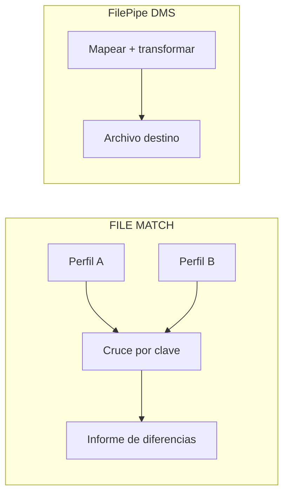
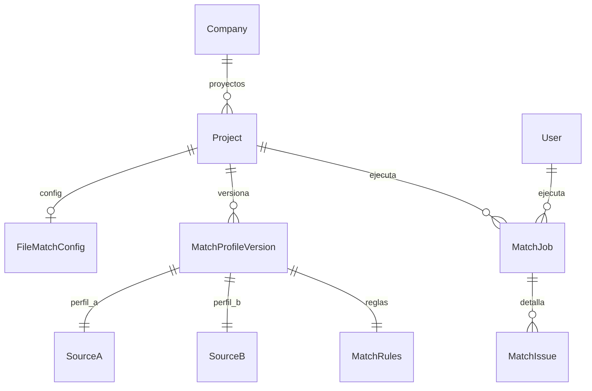

# FILE MATCH — Conciliador de archivos

> **Nombre mnemotécnico:** `FILE_MATCH`  
> Alias: *Conciliador de archivos* · *File Match* · *A vs B por clave*  
> Archivo: [`docs/FILE_MATCH.md`](FILE_MATCH.md)  
> Estado: **definición de producto / lineamientos** — base de desarrollo.  
> Origen: [`APP_FACTORY.md`](APP_FACTORY.md) §2 · [`APP_FACTORY_HIGH_REUSE.md`](APP_FACTORY_HIGH_REUSE.md) §4.  
> Estilo: hermano de [`FILE_GATE.md`](FILE_GATE.md), [`REVERSE_STUDIO.md`](REVERSE_STUDIO.md) y [`DataMappingStudio.md`](DataMappingStudio.md).

### Rama de desarrollo y despliegues

| Ítem | Valor |
|------|--------|
| **Rama Git** | `feature/file-match` |
| **Base** | `main` (producción / Railway) |
| **Alcance de la rama** | Análisis, diseño, prototipos, código de FILE MATCH y docs asociados |
| **Base de datos** | Preferir **reutilizar** parsers / intake / jobs DMS (doble `SourceProfile`). Modelos nuevos solo para reglas de cruce / config si hace falta; documentarlos antes del merge |
| **Despliegues a Railway** | **No desplegar** desde `feature/file-match` hasta merge a `main` (salvo staging). |
| **Merge a `main`** | Cuando el MVP esté revisado; PR `feature/file-match` → `main` |
| **Respaldo recomendado** | Tag/rama `pre-file-match` en `main` + backup BD si hay migración |

> Quien despliegue producción debe usar **`main`**, no la rama de feature.

---

## 0. Para qué sirve este documento

| Pregunta | Respuesta |
|----------|-----------|
| **¿Qué es?** | La **base de producto** de FILE MATCH: lineamientos para diseñar e implementar el conciliador |
| **¿Qué no es?** | Spec detallada por pantalla (eso irá en `definition_app_FILE_MATCH/` al abrir cada módulo) ni código |
| **Función** | Congelar qué hace el producto, alcance MVP, frontera con FilePipe/GATE/Reverse, módulos, roles y próximos pasos |

---

## 1. Resumen ejecutivo

**FILE MATCH** es un aplicativo de DynamicWorkspace que permite a equipos de tesorería, operaciones y auditoría **cuadrar dos archivos** (por ejemplo extracto bancario vs libro ERP) y saber **qué falta, qué sobra o qué no coincide**, sin transformar ni “arreglar” los archivos.

No es un ETL ni un validador de un solo archivo: es el **paquete “A vs B por clave → informe de diferencias”** montado sobre el motor de parseo FilePipe (DMS), usado **dos veces**.

Flujo esencial:

```
Definir perfil A (cómo se lee el archivo A)
        →
Definir perfil B (cómo se lee el archivo B)
        →
Declarar clave(s) de cruce + campos a comparar
        →
Publicar versión
        →
Subir A y B → conciliar → informe (matched / only_A / only_B / mismatch)
```

### Qué es / qué hace / qué no hace

| Pregunta | Respuesta corta |
|----------|-----------------|
| **¿Qué es?** | Conciliador de archivos: cruza dos orígenes por clave y reporta diferencias |
| **¿Qué hace?** | Parsea A y B → match 1:1 por clave → compara campos → **emite informe** |
| **¿Qué no hace?** | No genera un tercer archivo “ya conciliado”. No es contabilidad completa. No hace fuzzy match / IA en el MVP. No valida “solo gate” (eso es FILE GATE). No emite layout de banco (eso es Reverse Studio) |
| **¿Para quién?** | Tesorería, operaciones, auditoría, control de intercambios |
| **Resultado** | Informe de conciliación descargable + historial de jobs |

### Propuesta de valor

| Aspecto | Descripción |
|---------|-------------|
| **Problema** | Cuadrar banco vs ERP (u orígenes similares) se hace con VLOOKUP, scripts frágiles o “a ojo”, sin roles ni historial |
| **Solución** | Proyecto reutilizable: dos perfiles de origen + reglas de cruce versionadas + job A+B + evidencia |
| **Beneficio** | Menos Excel manual, diferencias trazables, mismo contrato de cruce cada ciclo |
| **Audiencia** | Tesorería, operaciones, auditoría, supervisores de intercambio |

### Posicionamiento

| Alternativa | Limitación | Diferenciador FILE MATCH |
|-------------|------------|--------------------------|
| VLOOKUP / Power Query | Manual, frágil, poco auditable en equipo | Proyecto con versión, roles e informe |
| Script Python puntual | Tribal, sin UI ni historial | Conciliación repetible y reportable |
| FilePipe / DMS completo | Genera destino; no está pensado como “solo diferencias” | **Dos orígenes, cero destino de negocio** |
| FILE GATE | Valida un archivo contra un contrato | Complemento: validar A y B → luego conciliar |
| Reverse Studio | Emite un layout desde una planilla | Complemento opcional aguas arriba/abajo del ciclo |
| Herramientas de reconciliación enterprise | Costo y complejidad | Ligero, sobre parsers ya existentes |

### Relación con la plataforma

| Pieza | Relación |
|-------|----------|
| Chasis (`Company`, seguridad, billing, roles) | Reutilizado al 100 % |
| DMS — SourceProfile, parsers, intake | **Núcleo** ×2 (lado A y lado B) |
| DMS — Target / Field mapping / serialize salida de negocio | **Fuera de alcance** del MVP |
| DMS — ExecutionJob / errores / storage | Base para jobs e informe (especializar o job propio) |
| FILE GATE | Opcional: pre-check de A y/o B antes de conciliar (Fase 2) |
| Reverse Studio | No se solapa; flujos de negocio distintos (emitir vs cuadrar) |
| DynamicWorkspace — Records | Fuera del MVP (hallazgos como registros: Fase 2+) |
| Master Catalog | Normalizar códigos antes del match (Fase 2) |

---

## 2. Importancia

1. **Tercer vertical de reutilización alta** tras FILE GATE y Reverse Studio ([`APP_FACTORY_HIGH_REUSE.md`](APP_FACTORY_HIGH_REUSE.md) §11).
2. **Doble reuso de parseo** + obra nueva acotada (comparador / sort-merge).
3. **Demanda clara en finanzas:** “¿el banco y el ERP cuadran?”.
4. **Complementa GATE y Reverse:** calidad de cada lado → cruce → evidencia.
5. **Producto vendible solo** para equipos que no necesitan ETL ni emisión de layout.

---

## 3. Problema que resuelve

Escenarios típicos:

- Tesorería: extracto bancario vs movimientos del libro ERP.
- Operaciones: archivo del proveedor vs archivo interno del día.
- Auditoría: dos exportaciones “deberían ser iguales” y no lo son.
- Nómina: archivo enviado vs acuse del banco (documento + monto).
- Hoy: VLOOKUP en Excel, scripts frágiles, sin historial ni roles.

**Objetivo:** una definición persistente (“así se cruzan A y B”) y una ejecución que diga **matched / only_A / only_B / value_mismatch**, con evidencia descargable.

---

## 4. Alcance

### 4.1 Incluido (MVP)

| Incluido | Descripción |
|----------|-------------|
| `project_kind = file_match` | Proyecto dedicado Conciliador |
| Hub propio | Copy de “conciliación / cruce A vs B”, no de ETL ni emisión |
| Perfil A + perfil B | Dos SourceProfile (pueden ser tipos distintos) |
| Reglas de cruce | Clave simple o compuesta + campos a comparar |
| Normalización básica | Trim / mayúsculas en clave y campos (MVP) |
| Versionado | Borrador / publicar; jobs solo contra versión publicada |
| Upload A + B | Intake (límites, extensión, sanitización) |
| Job de match | 1:1 por clave; buckets + conteos |
| Informe | Resumen + detalle por clave + descarga JSON/CSV |
| Historial | Quién concilió, cuándo, archivos, versión, estado |
| Roles | Diseñar / publicar / ejecutar / consultar (PA/ED/GE/CO) |

### 4.2 Excluido (MVP)

| Excluido | Motivo / fase |
|----------|----------------|
| Generar un tercer archivo “ya conciliado” | Es FilePipe u otro vertical |
| Fuzzy match / IA / probabilidad | Fase 3 |
| 1:N o N:M | MVP es **1:1**; 1:N Fase 2 |
| Tres o más lados (A/B/C) | Fase 3 |
| Tolerancia decimal avanzada / multi-moneda | Fase 2 (`epsilon`) |
| Archivo “maestro” fijo versionado | Fase 2 (baseline) |
| Contabilidad completa / asientos | Fuera de producto |
| Scheduling / API / webhooks | Fase 3 |
| Corrección automática de archivos | Fuera de alcance |

### 4.3 Frontera con FilePipe (DMS)



| FilePipe | FILE MATCH |
|----------|------------|
| Origen → destino de negocio | **Dos orígenes**, cero destino de negocio |
| Escribe un archivo transformado | Escribe **informe** (evidencia) |
| Mapeo campo a campo | Clave de cruce + comparación |

**Regla de producto:** FILE MATCH **no escribe** un archivo de salida de negocio “corregido”. El entregable es el informe de conciliación.

### 4.4 Frontera con FILE GATE y Reverse Studio

| Vertical | Relación |
|----------|----------|
| **FILE GATE** | ¿El archivo cumple el contrato? → puede validar A y B **antes** de conciliar (opcional) |
| **Reverse Studio** | ¿Puedo **generar** el archivo de envío? → no concilia; flujos distintos |
| **FilePipe** | ETL genérico; Match es el paquete “solo diferencias” |

Flujo opcional recomendado (Fase 2): validar A y B en FILE GATE → si ambos `passed`, ejecutar FILE MATCH.

---

## 5. Aplicaciones (casos de negocio)

| # | Aplicación | Ejemplo |
|---|------------|---------|
| C1 | Tesorería | Extracto banco (CSV) vs movimientos ERP (TXT) |
| C2 | Proveedores | Facturación del proveedor vs recepción interna |
| C3 | Auditoría / cambio | Dos exportaciones del mismo reporte “antes/después” |
| C4 | Nómina | Archivo enviado vs acuse del banco (documento + monto) |
| C5 | Pre-check + cruce | FILE GATE sobre A y B → Match |
| C6 | Control diario | Archivo del día vs archivo de control interno |

---

## 6. Módulos del producto

> Ritual (igual que FILE GATE / Reverse): doc en `definition_app_FILE_MATCH/` → prototipo → «Desarrolla el módulo».  
> No implementar un módulo hasta cerrar su especificación.

### Módulo 1 — Perfil A (origen A)

> **Spec:** `definition_app_FILE_MATCH/profile_a.md` · Estado: **pendiente**

- SourceProfile lado A (tipo, encoding, captura, campos, reglas de contenido).
- Copy UX: “archivo A / lado A / extracto / origen de referencia”, no “origen para transformar”.
- Reuso: asistente source_definition DMS / patrón FILE GATE esquema.

### Módulo 2 — Perfil B (origen B)

> **Spec:** `definition_app_FILE_MATCH/profile_b.md` · Estado: **pendiente**

- SourceProfile lado B (puede diferir en tipo de archivo respecto a A).
- Copy UX: “archivo B / lado B / contraparte”.
- Misma base técnica que Módulo 1.

### Módulo 3 — Reglas de cruce

> **Spec:** `definition_app_FILE_MATCH/match_rules.md` · Estado: **pendiente**

- Clave simple o compuesta (campos de A ↔ campos de B).
- Campos a comparar (monto, estado, fecha…).
- Normalización MVP: trim, case-fold en clave/campos seleccionados.
- Tolerancia numérica: **no** en MVP (Fase 2).
- Completitud: al menos una clave usable y ≥ 0 campos a comparar (comparar solo presencia = only_A/only_B).

### Módulo 4 — Publicar definición

> **Spec:** `definition_app_FILE_MATCH/publish.md` · Estado: **pendiente**

- Publicar congela perfil A + perfil B + reglas de cruce.
- Jobs solo contra versión publicada (espíritu DMS / GATE / Reverse).
- Nuevo borrador editable tras publicar.

### Módulo 5 — Ejecutar conciliación (Match Run)

> **Spec:** `definition_app_FILE_MATCH/match_run.md` · Estado: **pendiente**

```
Upload archivo A + archivo B
    ↓
Resolver versión publicada (perfiles + reglas)
    ↓
Parse A → Parse B
    ↓
Match 1:1 por clave → clasificar buckets
    ↓
Persistir job + métricas + detalle
    ↓
Entregar informe descargable
```

Buckets / estados de detalle:

| Bucket | Significado |
|--------|-------------|
| `matched` | Misma clave; valores comparados iguales |
| `value_mismatch` | Misma clave; al menos un campo difiere |
| `only_a` | Clave solo en A |
| `only_b` | Clave solo en B |
| `duplicate_key` | Clave repetida en un lado (integridad) |

Veredicto agregado del job (configurable en políticas o reglas):

| Estado | Significado |
|--------|-------------|
| `passed` | Solo `matched` (o mismatches bajo umbral, si se define) |
| `failed` | Hay `only_*` / mismatches / duplicados por encima de umbral, o fatal de parseo |
| `partial` | Tope de filas / errores antes de completar ambos lados |

### Módulo 6 — Informe y evidencia

> **Spec:** `definition_app_FILE_MATCH/match_report.md` · Estado: **pendiente**

| Entrega | Contenido |
|---------|-----------|
| Resumen | Filas A/B, matched, only_A, only_B, mismatches, % cuadre, duración |
| Detalle | Por clave: valores A/B de campos comparados, bucket, mensajes |
| Descarga | JSON + CSV de diferencias (MVP) |
| Evidencia | Hash de A y B + versión de definición + usuario + timestamp |

### Módulo 7 — Historial y auditoría

> **Spec:** `definition_app_FILE_MATCH/history.md` · Estado: **pendiente**

- Listado filtrable: fecha, usuario, nombres/hash A/B, versión, estado, TTL.
- Detalle de job + descarga de informe vigente.
- CO: metadatos sí; detalle con datos de negocio: denegar u ofuscar en MVP.

### Módulo 8 — Integración FILE GATE (Fase 2)

> **Spec:** `definition_app_FILE_MATCH/gate_bridge.md` · Estado: **pendiente (Fase 2)**

- Opción: exigir FILE GATE `passed` sobre A y/o B (mismo `content_hash`) antes de conciliar.
- Reuso del patrón bridge FilePipe / Reverse.

---

## 7. Reglas y funcionalidades

### 7.1 Reglas de negocio

| ID | Regla |
|----|-------|
| M1 | Solo se ejecuta contra versiones **publicadas** de ambos perfiles + reglas. |
| M2 | Una fila de A matchea a lo sumo una de B por clave (**1:1** en MVP). |
| M3 | Claves duplicadas en un lado → bucket `duplicate_key` o abort según política. |
| M4 | Campos no seleccionados para comparar se ignoran en el veredicto de mismatch. |
| M5 | El job es de **solo lectura** sobre A y B; no altera la definición. |
| M6 | Ejecutar requiere permiso de ejecución (`GE` o `PA`/`ED` según matriz). |
| M7 | Upload seguro: límites, extensión, sanitización (file intake). |
| M8 | Aislamiento por `Company` + membresía; sin lectura cruzada. |
| M9 | No se duplican parsers: siempre servicios `apps.dms.*` (doble invocación). |
| M10 | Límites de tamaño / filas documentados (evitar OOM; sort-merge si hace falta). |

### 7.2 Funcionalidades MVP (checklist)

- [ ] `project_kind = file_match` + crear proyecto + hub
- [ ] Sidebar / navegación Conciliador (FILE MATCH)
- [ ] Editor perfil A (reuso source)
- [ ] Editor perfil B (reuso source)
- [ ] Reglas de cruce (clave + campos a comparar + normalización básica)
- [ ] Publicar versión
- [ ] Upload A+B + ejecutar + informe
- [ ] Historial básico filtrable
- [ ] Mensajes UI (`UI_MESSAGES` § FILE MATCH)
- [ ] Ayudas de hub y pasos clave

### 7.3 Funcionalidades Fase 2

- [ ] Pre-check FILE GATE en A y/o B
- [ ] Tolerancia numérica (`abs(diff) <= epsilon`)
- [ ] Baseline / archivo maestro fijo versionado
- [ ] 1:N controlado (con bucket explícito)
- [ ] Consumo de Master Catalog para normalizar códigos
- [ ] Umbrales de veredicto (`max_mismatch_pct`, etc.)

### 7.4 Funcionalidades Fase 3

- [ ] API `POST /match` + webhook
- [ ] Scheduling / bandeja vigilada
- [ ] Tres lados (A/B/C)
- [ ] Fuzzy / scoring (fuera del núcleo “exacto”)
- [ ] Certificado de conciliación (hashes + versión + veredicto)

---

## 8. Ejemplos

### EJ-01 — Banco vs ERP (clave documento, comparar monto)

**Clave:** `documento`  
**Comparar:** `monto`

| documento | A.monto | B.monto | Resultado |
|-----------|---------|---------|-----------|
| 1001 | 500 | 500 | `matched` |
| 1002 | 200 | 250 | `value_mismatch` |
| 1003 | 100 | — | `only_a` |
| 1004 | — | 80 | `only_b` |

### EJ-02 — Clave compuesta

**Clave:** `nit` + `fecha`  
**Comparar:** `valor`  
Útil cuando el mismo NIT aparece varios días.

### EJ-03 — Solo presencia

Sin campos a comparar: el informe solo clasifica `matched` / `only_a` / `only_b` (existencia de la clave).

### EJ-04 — Duplicados en un lado

Dos filas en A con el mismo `documento`.  
**Resultado:** `duplicate_key` (o job `failed` según política); no se inventa un match arbitrario.

### EJ-05 — Con FILE GATE (Fase 2)

Validar A y B en gate → solo si ambos `passed` habilitar “Conciliar” en FILE MATCH.

---

## 9. Casos de uso formales

### FM-01 — Diseñar conciliación

| | |
|---|---|
| **Actor** | Diseñador (`PA`/`ED`) |
| **Flujo** | Crear proyecto Match → perfil A → perfil B → reglas → publicar v1 |
| **Resultado** | Versión publicada lista para ejecutar |

### FM-02 — Conciliar el ciclo

| | |
|---|---|
| **Actor** | Ejecutor (`GE`) |
| **Flujo** | Ejecutar → subir A y B → ver resumen → descargar diferencias |
| **Resultado** | Job en historial + informe |

### FM-03 — Investigar mismatches

| | |
|---|---|
| **Actor** | Supervisor / auditoría |
| **Flujo** | Abrir job → filtrar `value_mismatch` / `only_*` → exportar CSV |
| **Resultado** | Evidencia para devolver a negocio o al proveedor |

### FM-04 — Cambio de layout de un lado

| | |
|---|---|
| **Actor** | Diseñador |
| **Flujo** | Ajustar perfil A o B / reglas en borrador → publicar v2 |
| **Resultado** | Conciliaciones nuevas usan v2; históricas conservan v1 |

---

## 10. Modelo conceptual



| Entidad | Descripción | Reuso |
|---------|-------------|-------|
| `Project` | `project_kind = file_match` | `apps.projects` |
| `FileMatchConfig` | Versión activa, flags (exigir GATE), umbrales | Nuevo mínimo o análogo a `DmsProjectConfig` |
| `MatchProfileVersion` | Snapshot draft/published (A + B + rules) | Nuevo o especialización de versión DMS |
| Source A / B | Contratos de lectura | `DmsSourceProfile` (×2) |
| `MatchRules` | JSON: claves, compare_fields, normalización | JSON en versión |
| `MatchJob` | Una conciliación A+B | Job propio o `DmsExecutionJob` sin target |
| `MatchIssue` | Detalle por clave / bucket | Filas de informe / storage |

### Decisión de implementación (congelada para lineamientos)

| Opción | Descripción | Recomendación |
|--------|-------------|---------------|
| **A** | App `apps/file_match/` delgada + parsers DMS ×2 + comparador propio | **Preferida** (como FILE GATE / Reverse) |
| **B** | Solo skin/flag dentro de `apps/dms` | Peor diferenciación de producto |
| **C** | Reimplementar parsers | **Evitar** |

**Preferencia:** kind `file_match` + app delgada; **cero duplicación** de parsers; comparador nuevo y delgado.

---

## 11. Esquema de configuración (borrador JSON)

```json
{
  "schema_version": "1.0",
  "kind": "file_match",
  "project": {
    "name": "Banco vs ERP — pagos diarios",
    "description": "Extracto CSV vs movimientos TXT del libro"
  },
  "side_a": {
    "label": "Extracto banco",
    "file_type_code": "csv",
    "encoding": "utf-8",
    "fields": [
      { "name": "documento", "required": true },
      { "name": "monto", "content_type": "decimal", "required": true }
    ]
  },
  "side_b": {
    "label": "Libro ERP",
    "file_type_code": "txt_delimited",
    "encoding": "latin-1",
    "fields": [
      { "name": "documento", "required": true },
      { "name": "monto", "content_type": "decimal", "required": true }
    ]
  },
  "match_rules": {
    "cardinality": "1:1",
    "key": [
      { "a": "documento", "b": "documento" }
    ],
    "compare": [
      { "a": "monto", "b": "monto" }
    ],
    "normalize": {
      "trim": true,
      "case_fold_keys": true
    },
    "on_duplicate_key": "bucket",
    "verdict": {
      "fail_on_only_a": true,
      "fail_on_only_b": true,
      "fail_on_mismatch": true
    }
  },
  "gate_policy": {
    "require_file_gate_a": false,
    "require_file_gate_b": false,
    "file_gate_project_a_id": null,
    "file_gate_project_b_id": null
  }
}
```

> Forma exacta se alineará a persistencia real en `definition_app_FILE_MATCH/`; este JSON es lineamiento de producto.

---

## 12. Roles y permisos

| Acción FILE MATCH | PA | ED | GE | CO |
|-------------------|----|----|----|-----|
| Ver proyecto / historial | Sí | Sí | Sí | Sí |
| Editar perfiles A/B / reglas / publicar | Sí | Sí | No | No |
| Ejecutar conciliación / descargar informe | Sí | Sí | Sí | No* |
| Gestionar miembros | Sí | No | No | No |

\*CO: metadatos del historial sí; descarga de informe con datos de filas: **denegar** en MVP (u ofuscar si se decide en `definition_app`).

---

## 13. Arquitectura técnica sugerida

| Capa | Enfoque |
|------|---------|
| UI | `templates/file_match/` + prototipos `prototype/file_match/` |
| App | `apps/file_match/` (views/urls/services delgados) |
| Servicios | Importar parsers / intake / catálogos desde `apps.dms`; **comparador** en `apps/file_match/services/` |
| Persistencia | Dos `DmsSourceProfile` (o snapshots) + JSON `match_rules` + job/informe |
| Mensajes | Extender [`UI_MESSAGES.md`](definition_app/UI_MESSAGES.md) |
| Deploy | Mismo Railway; migrar solo si hay campos/modelos nuevos |

```
apps/
└── file_match/                 # propuesta
    ├── apps.py
    ├── urls.py
    ├── views.py                # hubs y orquestación UX
    └── services/
        ├── match_compare_service.py   # cruce 1:1 / buckets
        └── ...                        # wrappers / políticas de producto
```

Parsers permanecen en `apps.dms` (**no copiar**).

### Rendimiento (MVP)

| Tema | Lineamiento |
|------|-------------|
| Archivos pequeños/medianos | Hash-map en memoria por clave (documentar límite de filas) |
| Archivos grandes | Spike sort-merge / spill a disco antes de subir límites |
| Riesgo | OOM → mitigar con límites + mensaje claro (ver riesgos §15) |

---

## 14. MVP y roadmap

### Fase MVP

| Incluido | Excluido |
|----------|----------|
| Kind + hub + perfiles A/B | Fuzzy / IA |
| Clave 1:1 + compare exacto | 1:N, multi-lado |
| Publicar + ejecutar + informe | API / scheduling |
| Historial + ayudas + UI_MESSAGES | Bridge FILE GATE obligatorio |
| Normalización trim/case | Tolerancia decimal / baseline fijo |

### Fase 2

Pre-check FILE GATE, epsilon numérico, baseline, 1:N controlado, Master Catalog, umbrales de veredicto.

### Fase 3

API, webhooks, tres lados, fuzzy, certificado de conciliación.

---

## 15. Riesgos y decisiones abiertas

| # | Tema | Opciones | Recomendación inicial |
|---|------|----------|------------------------|
| 1 | App nueva vs modo DMS | `file_match` / flag dms | **Kind + app delgada** |
| 2 | Nombre de kind | `file_match` / `match` / `reconcile` | `file_match` |
| 3 | Nombre de producto UI | File Match / Conciliador | **Conciliador** en UI; nemotécnico `FILE_MATCH` |
| 4 | Cardinalidad | 1:1 / 1:N | **1:1** en MVP |
| 5 | Tolerancia decimal | No / epsilon | **No** en MVP; Fase 2 |
| 6 | Archivo maestro fijo | No / sí | Fase 2 |
| 7 | CO descarga informe | No / ofuscar / sí | **No** en MVP |
| 8 | Job model | Nuevo / `DmsExecutionJob` | Preferir especialización o job propio sin target |
| 9 | Rendimiento | In-memory / sort-merge | In-memory + límites; spike sort-merge |

---

## 16. Métricas de éxito

| Métrica | Meta inicial |
|---------|--------------|
| Tiempo a primera conciliación publicada | &lt; 30 minutos |
| Reutilización | ≥ 3 conciliaciones / definición / mes en piloto |
| Reducción de Excel/VLOOKUP | ≥ 1 proceso manual/script reemplazado en 30 días |
| Código nuevo vs reuso DMS | Comparador + UI &lt; ~40 % del esfuerzo (parsers reusados) |

---

## 17. Criterio APP_FACTORY (check)

| Criterio | ¿Cumple? |
|----------|----------|
| Reusa Company + seguridad + billing | Sí |
| Se modela como `project_kind` | Sí (`file_match`) |
| Usa motor existente | Sí (doble parse DMS + comparador delgado) |
| MVP acotado en una fase | Sí |
| No duplica FilePipe sin diferenciador | Sí — diferenciador: **dos orígenes, cero destino de negocio** |

---

## 18. Próximos pasos de diseño / desarrollo

> Trabajo previsto en rama **`feature/file-match`**. Sin deploy a Railway desde esa rama hasta merge a `main`.

1. Congelar kind (`file_match`) y copy de producto (hub, sidebar: “Conciliador”).
2. Crear `docs/definition_app_FILE_MATCH/README.md` + checklist de módulos.
3. Prototipos `prototype/file_match/` (hub + perfiles + reglas + informe).
4. Spike técnico: doble parse + comparador 1:1 + límites de filas / sort-merge.
5. **Módulo 1** — perfil A (spec → prototipo → «Desarrolla el módulo»).
6. Módulos 2–7 en orden; Módulo 8 (bridge GATE) en Fase 2.
7. Extender `UI_MESSAGES.md`.
8. PR a `main` con MVP revisado.

**Regla de avance (igual FILE GATE / Reverse):** no pasar al siguiente módulo sin cerrar el actual (spec + prototipo + implementación acordada).

---

## 19. Glosario

| Término | Definición |
|---------|------------|
| **FILE MATCH / Conciliador** | Producto que cruza dos archivos por clave y reporta diferencias |
| **Lado A / Lado B** | Los dos orígenes de la conciliación |
| **Clave de cruce** | Campo(s) que identifican la misma entidad en A y en B |
| **Bucket** | Clasificación de una clave: matched, only_a, only_b, value_mismatch, duplicate_key |
| **Reglas de cruce** | Definición de claves, campos a comparar y normalización |
| **Definición publicada** | Snapshot inmutable A + B + reglas |
| **Match Run** | Job que produce el informe de conciliación |
| **Informe de diferencias** | Entregable (no es archivo de negocio transformado) |

---

## 20. Documentos relacionados

| Documento | Relación |
|-----------|----------|
| [`APP_FACTORY.md`](APP_FACTORY.md) | Prioridad y criterio de verticales |
| [`APP_FACTORY_HIGH_REUSE.md`](APP_FACTORY_HIGH_REUSE.md) | Familia §2; FILE MATCH es §4 |
| [`FILE_GATE.md`](FILE_GATE.md) | Validador; pre-check opcional Fase 2 |
| [`REVERSE_STUDIO.md`](REVERSE_STUDIO.md) | Emisor; frontera de producto |
| [`DataMappingStudio.md`](DataMappingStudio.md) | Visión FilePipe / motor ETL |
| [`DynamicWorkspace.md`](DynamicWorkspace.md) | Chasis multi-tenant |
| [`definition_app_DMS/source_definition.md`](definition_app_DMS/source_definition.md) | Base perfiles A/B |
| [`definition_app_DMS/file_intake.md`](definition_app_DMS/file_intake.md) | Upload |
| [`definition_app_FILE_GATE/`](definition_app_FILE_GATE/) | Patrón de módulos / informe / historial / bridge |
| [`definition_app/UI_MESSAGES.md`](definition_app/UI_MESSAGES.md) | Mensajes UI |

---

*Documento: `docs/FILE_MATCH.md` — lineamientos y base de desarrollo del Conciliador de archivos (FILE MATCH).*
