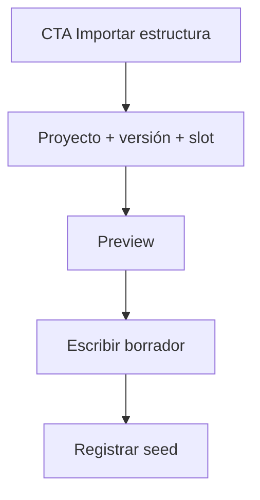

# PROFILE_SEED — Sembrador de perfiles

> **Nombre mnemotécnico:** `PROFILE_SEED`  
> Alias: *Sembrador de perfiles* · *Profile Seed* · *Cross-seed de estructuras*  
> Archivo: [`docs/PROFILE_SEED.md`](PROFILE_SEED.md)  
> Estado: **propuesta / partida de desarrollo** — aún sin código.  
> Origen: [`APP_FACTORY.md`](APP_FACTORY.md) §2 · [`APP_FACTORY_HIGH_REUSE.md`](APP_FACTORY_HIGH_REUSE.md) §7.  
> Specs al abrir: [`definition_app_PROFILE_SEED/`](definition_app_PROFILE_SEED/).  
> Estilo: hermano de [`FILE_GATE.md`](FILE_GATE.md), [`FILE_MATCH.md`](FILE_MATCH.md), [`REVERSE_STUDIO.md`](REVERSE_STUDIO.md).

### Rama de desarrollo (cuando se priorice)

| Ítem | Valor |
|------|--------|
| **Rama Git sugerida** | `feature/profile-seed` |
| **Base** | `main` (o tras merge de Match) |
| **Alcance** | Docs, prototipos, servicios de clone/seed, CTAs en apps destino |
| **Despliegues Railway** | **No** desde la feature hasta merge a `main` |

---

## 0. Para qué sirve este documento

| Pregunta | Respuesta |
|----------|-----------|
| **¿Qué es?** | La **base de producto** de PROFILE_SEED: lineamientos para diseñar e implementar la siembra de estructuras entre apps |
| **¿Qué no es?** | Spec de pantalla (irá en `definition_app_PROFILE_SEED/`) ni código |
| **Función** | Congelar propósito, fronteras (Scout / bridge), MVP, módulos y próximos pasos de arranque |

---

## 1. Resumen ejecutivo

**PROFILE_SEED** permite **reutilizar una estructura de archivo ya definida** (contrato GATE, entrada Reverse, perfil Match A/B, origen FilePipe) y **sembrarla como borrador** en otro proyecto de la misma compañía — sin volver a pasar el wizard de 6 pasos.

No infiere desde una muestra (eso es Structure Scout). No valida jobs por hash (eso es el bridge FILE GATE). Solo **clona la forma** del perfil/contrato.

```
Origen publicado (GATE / Reverse / Match / DMS)
        →
Snapshot canónico de estructura
        →
Destino borrador (slot A/B / esquema / entrada)
        →
Usuario confirma · ajusta · publica en la app destino
```

### Qué es / qué hace / qué no hace

| Pregunta | Respuesta corta |
|----------|-----------------|
| **¿Qué es?** | Sembrador de perfiles: import/export de estructuras entre verticales §2 |
| **¿Qué hace?** | Selecciona origen publicado → clona SourceProfile/contrato → escribe borrador destino |
| **¿Qué no hace?** | No valida, no concilia, no emite layouts, no “adivina” desde muestra, no mantiene un perfil vivo compartido |
| **¿Para quién?** | PA/ED e integradores que ya modelaron un layout en una app y lo necesitan en otra |
| **Resultado** | Borrador de perfil/contrato en el destino + auditoría del seed |

### Propuesta de valor

| Aspecto | Descripción |
|---------|-------------|
| **Problema** | Misma estructura de extracto/nómina se redefine a mano en GATE, luego en Match, luego en Reverse |
| **Solución** | Importar desde proyecto hermano (misma compañía, versión publicada) |
| **Beneficio** | Suite integral, menos repetición, time-to-value entre verticales |
| **Audiencia** | Operaciones, tesorería, integradores multi-app |

---

## 2. Fronteras

| Vertical | Relación con PROFILE_SEED |
|----------|---------------------------|
| **FILE GATE** | Origen típico (esquema publicado) o destino (sembrar contrato) |
| **FILE MATCH** | Destino prioritario (Perfil A y/o B); origen posible |
| **Reverse Studio** | Destino: contrato de entrada; origen: entrada publicada |
| **FilePipe** | Origen/destino: SourceProfile del origen |
| **Structure Scout** | Complemento: Scout = desde **muestra**; Seed = desde **definición** |
| **Bridge GATE** | Distinto: bridge = pre-check por **hash** de archivo; Seed = copia de **estructura** |

**Decisión congelada:** solo **clone de snapshot**. Nunca un único `SourceProfile` compartido por FK en el MVP (evita cascading breaks).

---

## 3. Alcance MVP

| Incluido | Excluido |
|----------|----------|
| GATE publicado → Match Perfil A (P0) | Vínculo vivo / sync continuo |
| GATE → Match Perfil B | Auto-publicar en destino |
| GATE → Reverse entrada | Cross-compañía |
| Match A ↔ otro Match / mismo proyecto B | Merge inteligente de campos conflictivos |
| Preview tipo + # campos + confirmación | Diff campo a campo avanzado |
| Auditoría seed (quién, origen, destino, versión) | API pública (Fase 2) |
| Roles: PA/ED destino | Override de permisos del origen |

---

## 4. Flujo de usuario

### 4.1 Desde el destino (recomendado UX)

1. Match → Perfil A → **Importar estructura**.  
2. Filtrar: kind FILE GATE · proyectos de la compañía.  
3. Elegir versión publicada.  
4. Preview → Confirmar.  
5. Borrador A rellenado; usuario completa/ajustes → sigue el ciclo Match.

### 4.2 Desde hub Seed (opcional)

Proyecto `profile_seed` o hub transversal: origen → destino → aplicar (útil para operadores de plataforma).



---

## 5. Modelo mental de datos

### Snapshot canónico (forma)

Alinear a `source` / contrato GATE / `DmsSourceProfile`:

| Bloque | Contenido típico |
|--------|------------------|
| `file_type_code` | csv, xlsx, delimited, fixed, json, xml… |
| `capture_start` / `capture_end` | Filas / anclas |
| `fields[]` | name, type, required, posición/columna… |
| `content_rules` | Reglas de contenido del perfil |
| `config` | Metadatos de captura (delimitador, encoding…) |

No incluir: políticas GATE, reglas de cruce Match, target Reverse, jobs.

### Persistencia Seed (propuesta)

| Opción | Uso |
|--------|-----|
| **A — App delgada** `apps.profile_seed` | Hub + historial + servicios clone; CTAs en apps destino |
| **B — Solo servicios** en `apps.dms` / shared | `profile_seed_service` llamado desde Match/GATE/Reverse sin kind propio |

**MVP recomendado:** B (servicios + CTAs) → A si el historial/hub lo exige.

Registro de auditoría (mínimo):

```json
{
  "seeded_at": "…",
  "seeded_by": "user_id",
  "source_kind": "file_gate",
  "source_project_slug": "gate-extractos",
  "source_version": 3,
  "source_slot": "schema",
  "target_kind": "file_match",
  "target_project_slug": "conciliacion-banco",
  "target_slot": "profile_a",
  "mode": "clone_snapshot"
}
```

---

## 6. Módulos de definición (orden)

| Orden | Doc futuro | Contenido |
|-------|------------|-----------|
| 0 | [`definition_app_PROFILE_SEED/README.md`](definition_app_PROFILE_SEED/README.md) | Ritual + índice |
| 1 | `seed_hub.md` | Hub / CTA / permisos |
| 2 | `source_picker.md` | Selector origen + slots |
| 3 | `apply_draft.md` | Preview, validación, escritura borrador |
| 4 | `seed_history.md` | Auditoría de semillas |
| — | `ps_integration.md` | Kind opcional, URLs, reuso DMS |

Ritual: igual que Match — **doc → prototipo → «Desarrolla el módulo»**.

---

## 7. Roles

| Acción | PA | ED | GE | CO |
|--------|----|----|----|-----|
| Ver candidatos de origen (misma compañía) | Sí* | Sí* | No | No |
| Aplicar seed a borrador destino | Sí | Sí | No | No |
| Ver historial de semillas del proyecto | Sí | Sí | Sí | Sí |

\*También requiere poder **ver** el proyecto origen según membresía/visibilidad.

---

## 8. Mensajes UI (borrador)

| Situación | Texto |
|-----------|-------|
| Éxito | Estructura importada desde {slug} v{n}. Revise el borrador antes de publicar. |
| Sin origen | No hay proyectos publicables de ese tipo en su compañía. |
| Tipo incompatible | El tipo {src} no está permitido en el destino. Ajuste el perfil o elija otro origen. |
| Sin permiso | No tiene permiso para importar estructuras en este proyecto. |

Ampliar [`definition_app/UI_MESSAGES.md`](definition_app/UI_MESSAGES.md) al implementar.

---

## 9. Criterios de “partida lista”

- [x] Nemotécnico y alias definidos (`PROFILE_SEED`)
- [x] Frontera Scout / bridge / Match documentada
- [x] Decisión clone-not-live
- [x] MVP y módulos sugeridos
- [x] Entrada en [`APP_FACTORY_HIGH_REUSE.md`](APP_FACTORY_HIGH_REUSE.md) §7
- [x] Carpeta `definition_app_PROFILE_SEED/` con README
- [ ] Prototipos HTML del flujo Importar
- [ ] Spike técnico GATE → Match A
- [ ] Usuario: priorizar rama `feature/profile-seed`

---

## 10. Próximos pasos al iniciar desarrollo

1. Revisar este doc + §7 del paraguas HIGH_REUSE.  
2. Abrir `seed_hub.md` + prototipo CTA en Match Perfil A.  
3. Spike: leer `DmsSourceProfile` de GATE published → escribir draft Match lado A.  
4. Rama `feature/profile-seed` cuando haya OK de producto.  
5. No acoplar al bridge de pre-check.

---

## 11. Documentos relacionados

| Documento | Relación |
|-----------|----------|
| [`APP_FACTORY_HIGH_REUSE.md`](APP_FACTORY_HIGH_REUSE.md) §7 | Propuesta en la familia |
| [`definition_app_PROFILE_SEED/`](definition_app_PROFILE_SEED/) | Specs por módulo |
| [`FILE_MATCH.md`](FILE_MATCH.md) · [`profile_a.md`](definition_app_FILE_MATCH/profile_a.md) | Destino prioritario |
| [`FILE_GATE.md`](FILE_GATE.md) · schema | Origen prioritario |
| [`definition_app_FILE_GATE/dms_bridge.md`](definition_app_FILE_GATE/dms_bridge.md) | Bridge ≠ Seed (D2: no sync perfiles en bridge MVP) |
| [`APP_FACTORY_HIGH_REUSE.md`](APP_FACTORY_HIGH_REUSE.md) §6 | Structure Scout (complemento) |

---

*Documento: `docs/PROFILE_SEED.md` — partida de desarrollo del Sembrador de perfiles (PROFILE_SEED).*
