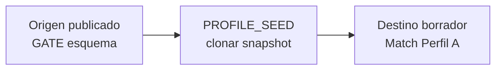
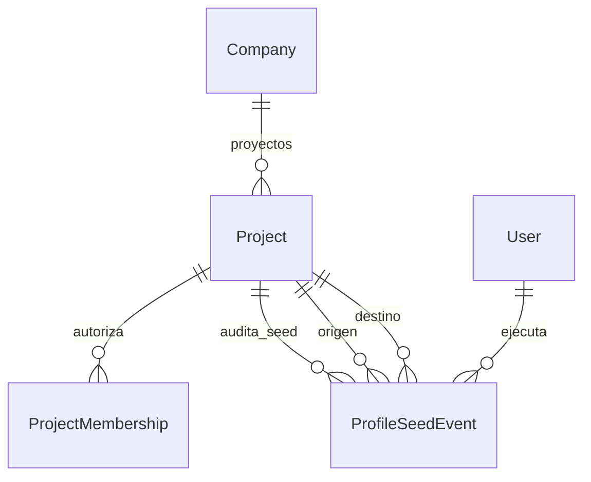

# PROFILE_SEED — Sembrador de perfiles

> **Nombre mnemotécnico:** `PROFILE_SEED`  
> Alias: *Sembrador de perfiles* · *Profile Seed* · *Cross-seed de estructuras*  
> Archivo: [`docs/PROFILE_SEED.md`](PROFILE_SEED.md)  
> Estado: **en desarrollo** (rama `feature/profile-seed`) — M1–M4 + `ps_integration` listos; P0 GATE→Match A.  
> Origen: [`APP_FACTORY.md`](APP_FACTORY.md) §2 · [`APP_FACTORY_HIGH_REUSE.md`](APP_FACTORY_HIGH_REUSE.md) §7.  
> Specs al abrir: [`definition_app_PROFILE_SEED/`](definition_app_PROFILE_SEED/).  
> Estilo: hermano de [`FILE_GATE.md`](FILE_GATE.md), [`REVERSE_STUDIO.md`](REVERSE_STUDIO.md), [`FILE_MATCH.md`](FILE_MATCH.md) y [`STRUCTURE_SCOUT.md`](STRUCTURE_SCOUT.md).

### Rama de desarrollo y despliegues

| Ítem | Valor |
|------|--------|
| **Rama Git** | `feature/profile-seed` |
| **Base** | `main` (producción / Railway; incluye Scout M1–M7) |
| **Alcance de la rama** | Análisis, diseño, prototipos, servicios de clone/seed, CTAs en apps destino y docs asociados |
| **Base de datos** | Preferir **reutilizar** `DmsSourceProfile` / contrato GATE / persistencia destino (`save_source`). Modelo nuevo mínimo: auditoría `ProfileSeed` (o equivalente). Documentar migraciones antes del merge |
| **Despliegues a Railway** | **No desplegar** desde `feature/profile-seed` hasta merge a `main` (salvo staging). |
| **Merge a `main`** | Cuando el MVP esté revisado; PR `feature/profile-seed` → `main` |
| **Respaldo recomendado** | Tag/rama `pre-profile-seed` en `main` + backup BD si hay migración |

> Quien despliegue producción debe usar **`main`**, no la rama de feature.

---

## 0. Para qué sirve este documento

| Pregunta | Respuesta |
|----------|-----------|
| **¿Qué es?** | La **base de producto** de PROFILE_SEED: lineamientos para diseñar e implementar la siembra de estructuras entre apps |
| **¿Qué no es?** | Spec detallada por pantalla (eso irá en `definition_app_PROFILE_SEED/` al abrir cada módulo) ni código |
| **Función** | Congelar propósito, fronteras (Scout / bridge / Match), MVP, módulos, roles y próximos pasos de arranque |

---

## 1. Resumen ejecutivo

**PROFILE_SEED** es un aplicativo (o capa de producto) de DynamicWorkspace que permite a integradores y PA/ED **reutilizar una estructura de archivo ya definida** (contrato GATE, entrada Reverse, perfil Match A/B, origen FilePipe) y **sembrarla como borrador** en otro proyecto de la misma compañía — sin volver a pasar el wizard de 6 pasos.

No infiere desde una muestra (eso es STRUCTURE SCOUT). No valida jobs por hash (eso es el bridge FILE GATE). No emite layouts ni concilia. Solo **clona la forma** del perfil/contrato.

Flujo esencial:

```
Origen publicado (GATE / Reverse / Match / DMS)
        →
Snapshot canónico de estructura
        →
Destino borrador (slot A/B / esquema / entrada)
        →
Usuario confirma · ajusta · publica en la app destino
```

### Qué es / qué hace / qué no hace

| Pregunta | Respuesta corta |
|----------|-----------------|
| **¿Qué es?** | Sembrador de perfiles: import/export de estructuras entre verticales §2 |
| **¿Qué hace?** | Selecciona origen publicado → clona SourceProfile/contrato → escribe borrador destino |
| **¿Qué no hace?** | No valida, no concilia, no emite, no “adivina” desde muestra, no mantiene un perfil vivo compartido, no auto-publica |
| **¿Para quién?** | PA/ED e integradores que ya modelaron un layout en una app y lo necesitan en otra |
| **Resultado** | Borrador de perfil/contrato en el destino + auditoría del seed |

### Propuesta de valor

| Aspecto | Descripción |
|---------|-------------|
| **Problema** | La misma estructura (extracto, nómina, layout banco) se redefine a mano en GATE, luego en Match, luego en Reverse |
| **Solución** | Importar desde proyecto hermano (misma compañía, versión **publicada**) |
| **Beneficio** | Suite integral, menos repetición, time-to-value entre verticales |
| **Audiencia** | Operaciones, tesorería, integradores multi-app |

### Posicionamiento

| Alternativa | Limitación | Diferenciador PROFILE_SEED |
|-------------|------------|----------------------------|
| Volver a armar el wizard | Lento, error-prone | Clone de lo ya gobernado |
| STRUCTURE SCOUT | Parte de **muestra**; no de definición publicada | Seed exige definición **ya publicada** |
| Bridge FILE GATE | Pre-check por **hash** de job; no copia perfil | Seed = **estructura**, no veredicto de archivo |
| Copiar/pegar JSON a mano | Sin roles ni auditoría | Flujo con permisos + historial |
| Perfil compartido por FK | Cascading breaks entre apps | **Solo clone snapshot** (decisión congelada) |

### Relación con la plataforma

| Pieza | Relación |
|-------|----------|
| Chasis (`Company`, seguridad, billing, roles) | Reutilizado al 100 % |
| Chasis — `Project` + `ProjectMembership` | Origen y destino filtrados por compañía + acceso |
| DMS — `DmsSourceProfile` / versión publicada | **Origen** del snapshot |
| DMS — `source_persistence_service.save_source` | **Escritura** del borrador destino (mismo patrón que Scout apply) |
| FILE GATE | Origen P0 (esquema publicado) o destino (sembrar contrato) |
| FILE MATCH | Destino P0 (Perfil A); también B / origen |
| Reverse Studio | Destino: contrato de **entrada**; origen: entrada publicada |
| FilePipe | Origen/destino: SourceProfile del origen (Fase 2+ si no entra MVP) |
| STRUCTURE SCOUT | Complemento: Scout = muestra → draft; Seed = definición → draft |
| Bridge GATE | Distinto producto; no mezclar en el mismo flujo UX |

---

## 2. Importancia

1. **Cierra el círculo** de la familia §2: GATE/Reverse/Match ya hechos; Scout descubre; **Seed reutiliza**.
2. **ROI inmediato** tras Match/GATE: elimina re-wizard entre hermanos.
3. **Bajo riesgo técnico:** lectura de perfiles existentes + `save_source` (obra nueva = slots + UX + auditoría).
4. **Complementa Scout:** si hay definición publicada → Seed; si solo hay archivo → Scout.
5. **Producto “glue”:** hace sentir la suite como un sistema, no apps aisladas.

---

## 3. Problema que resuelve

Escenarios típicos:

- Extracto bancario ya modelado en FILE GATE debe ser Perfil A en Match.
- Contrato GATE publicado debe sembrar la **entrada** de Reverse.
- Match A de un proyecto debe copiarse a Match B (mismo u otro proyecto).
- FilePipe origen ya publicado debe sembrar GATE o Match (Fase 2).
- Onboarding multi-app: definir una vez → sembrar muchas veces.

**Objetivo:** un seed auditable (“importado desde X@vN”) y un borrador que el diseñador confirma antes de publicar en el destino.

---

## 4. Alcance

### 4.1 Incluido (MVP)

| Incluido | Nota |
|----------|------|
| GATE publicado → Match Perfil A | **P0** |
| GATE → Match Perfil B | P1 |
| GATE → Reverse entrada | P2 |
| Match A ↔ Match B / otro Match | P3 — **parcial:** A→B mismo proyecto en hub Perfil B |
| Preview: tipo de archivo, # campos, nombres muestra | Diff suave |
| Confirmación + warning overwrite si destino ya tiene campos | Como Scout apply |
| Solo **borrador** destino (`save_source`) | Nunca auto-publicar |
| Auditoría seed (quién, origen, destino, versión, slot) | Modelo mínimo |
| Misma compañía + roles PA/ED en destino | Ver matriz §12 |
| CTA “Importar estructura” en hubs destino | UX recomendada |

### 4.2 Excluido (MVP)

| Excluido | Motivo / fase |
|----------|---------------|
| Vínculo vivo / un solo `SourceProfile` compartido por FK | Cascading breaks; decisión congelada |
| Auto-publicar en destino | El destino es dueño de su publish |
| Cross-compañía | Regla de tenant |
| Sync bidireccional continuo | Fase 2+ |
| Diff campo a campo / merge inteligente de conflictos | Fase 2 |
| API pública / webhooks | Fase 2+ |
| Sembrar target Reverse / reglas Match / políticas GATE | Solo **forma source/contrato de entrada** |
| Inferencia desde muestra | Es STRUCTURE SCOUT |

### 4.3 Fronteras (tabla)

| Vertical | Relación |
|----------|----------|
| **FILE GATE** | Origen típico (esquema publicado) o destino (sembrar contrato) |
| **FILE MATCH** | Destino prioritario (Perfil A/B); origen posible |
| **Reverse Studio** | Destino: contrato de entrada; origen: entrada publicada |
| **FilePipe** | Origen/destino SourceProfile (prioridad baja en MVP) |
| **STRUCTURE SCOUT** | Complemento (muestra vs definición) |
| **Bridge GATE** | Distinto (hash de job vs clone de estructura) |



---

## 5. Aplicaciones (casos de negocio)

| # | Aplicación | Ejemplo |
|---|------------|---------|
| S1 | Conciliación | GATE extractos → Match Perfil A |
| S2 | Conciliación dual | GATE libro → Match Perfil B |
| S3 | Emisión | GATE / Match → Reverse entrada (planilla) |
| S4 | Reuso Match | Match proyecto 1 Perfil A → proyecto 2 Perfil A |
| S5 | Suite onboarding | Un layout gobernado siembra GATE + Match + Reverse |

---

## 6. Módulos del producto

> Ritual (igual que FILE GATE / Reverse / Match / Scout): doc en `definition_app_PROFILE_SEED/` → prototipo → «Desarrolla el módulo».  
> No implementar un módulo hasta cerrar su especificación.

### Módulo 1 — Hub / CTA Importar estructura

> **Spec:** [`definition_app_PROFILE_SEED/seed_hub.md`](definition_app_PROFILE_SEED/seed_hub.md) · Estado: **implementado**  
> **Código:** `apps/profile_seed/` · CTA en hub Match A · shell `…/perfil-a/importar/`  
> **Prototipos:** `prototype/profile_seed/` (`hub_cta_match_a.html`, `seed_entry.html`, `hub_help.html`)

- Entrada desde apps destino (Match Perfil A prioritario) y/o hub Seed delgado.
- Copy UX: “Importar estructura” — no “sincronizar”, “vincular” ni “bridge”.
- Permisos PA/ED destino; listar solo orígenes visibles de la compañía (M2).

### Módulo 2 — Selector de origen

> **Spec:** [`definition_app_PROFILE_SEED/source_picker.md`](definition_app_PROFILE_SEED/source_picker.md) · Estado: **implementado**  
> **Código:** `list_eligible_sources` · `…/perfil-a/importar/origen/` · templates `source_picker*`  
> **Prototipos:** `prototype/profile_seed/` (`source_picker.html`, `source_picker_empty.html`, `source_picker_help.html`)

- Filtros: kind (`file_gate`, `file_match`, `reverse`, …) + proyecto + versión **publicada** + slot.
- Slots origen: GATE `schema`, Reverse `input`, Match `profile_a` / `profile_b`, DMS `source`.
- Excluir proyectos sin versión publicada / sin membresía o visibilidad.
- MVP UI P0: solo FILE GATE → hand-off a M3 (Continuar deshabilitado hasta M3).

### Módulo 3 — Preview y aplicar borrador

> **Spec:** [`definition_app_PROFILE_SEED/apply_draft.md`](definition_app_PROFILE_SEED/apply_draft.md) · Estado: **implementado**  
> **Código:** `apply_seed_service` · `ProfileSeedEvent` · `…/importar/confirmar/`  
> **Prototipos:** `prototype/profile_seed/` (`apply_confirm.html`, `_overwrite`, `_type_error`, `_help`)

- Preview: `file_type_code`, encoding/delim, N campos, nombres muestra.
- Validar whitelist del destino (tipo incompatible → error de catálogo).
- Warning si destino ya tiene campos (overwrite de borrador).
- Escritura vía `save_source` (o adaptador del slot Match B); **nunca** publica.
- Reuso del patrón Scout apply (2 pasos meta→fields cuando aplique).
- Auditoría: crea `ProfileSeedEvent` (listado UI en M4).

### Módulo 4 — Historial de semillas

> **Spec:** [`definition_app_PROFILE_SEED/seed_history.md`](definition_app_PROFILE_SEED/seed_history.md) · Estado: **implementado**  
> **Código:** `seed_history_service` · `…/importar/historial/` · templates `history_*`  
> **Prototipos:** `prototype/profile_seed/` (`history_hub.html`, `history_empty.html`, `history_detail.html`, `history_detail_failed.html`, `history_help.html`)

- Listado: fecha, usuario, origen (kind/slug/vN/slot), destino (slot), status.
- Detalle + enlace al destino / origen si sigue existiendo.
- CO: metadatos sí; sin datos sensibles de campos si se decide restringir.

### Transversal — Integración

> **Spec:** [`definition_app_PROFILE_SEED/ps_integration.md`](definition_app_PROFILE_SEED/ps_integration.md) · Estado: **documentado**

- Kind opcional vs solo servicios + CTAs; URLs; roles; frontera Scout/bridge; mensajes UI.
- As-built M1–M4: sin kind propio; host Match Perfil A; `ProfileSeedEvent`.

---

## 7. Reglas y funcionalidades

### 7.1 Reglas de negocio

| ID | Regla |
|----|-------|
| PS1 | Solo **clone de snapshot**. Nunca FK compartida de perfil vivo en MVP. |
| PS2 | “Aplicar seed” escribe solo **borrador** del destino; nunca auto-publica. |
| PS3 | Origen debe tener versión / definición **publicada** (no borrador origen). |
| PS4 | Misma `Company`; sin cross-compañía. |
| PS5 | Aplicar requiere rol PA/ED en el **destino** (y visibilidad del origen). |
| PS6 | No mezclar UX con bridge GATE (hash) ni con Scout (muestra). |
| PS7 | No clonar políticas GATE, reglas Match ni target Reverse — solo forma source/entrada. |
| PS8 | Overwrite de borrador destino: aviso explícito; confirmar. |
| PS9 | Auditoría obligatoria de cada seed exitoso (y fallido si aporta diagnóstico). |
| PS10 | No desplegar a Railway desde `feature/profile-seed` hasta merge a `main`. |

### 7.2 Funcionalidades MVP (checklist)

- [x] CTA “Importar estructura” en Match Perfil A (P0)
- [x] Selector origen GATE publicado (+ preview en M3)
- [x] Escritura borrador Match A vía persistencia destino
- [ ] GATE → Match B y/o Reverse entrada (al menos un segundo camino)
- [x] Warning overwrite + mensajes UI catálogo
- [x] Historial / auditoría de semillas
- [x] Matriz roles PA/ED/GE/CO
- [x] Docs `definition_app_PROFILE_SEED/` + prototipos
- [x] `ps_integration.md` (kind/URLs)

### 7.3 Fase 2

- [ ] Diff campo a campo / merge asistido
- [ ] FilePipe origen/destino
- [ ] Hub propio con kind `profile_seed` (si el MVP delgado no basta)
- [ ] API / webhook de seed
- [ ] CTA embebido también en GATE / Reverse / DMS de forma uniforme

---

## 8. Ejemplos

### EJ-01 — GATE → Match Perfil A (P0)

**Origen:** proyecto FILE GATE `gate-extractos`, versión publicada v3, slot esquema.  
**Destino:** FILE MATCH `conciliacion-banco`, Perfil A vacío.

1. En Match → Perfil A → **Importar estructura**.  
2. Elegir kind FILE GATE → `gate-extractos` → v3.  
3. Preview: csv · `;` · 8 campos.  
4. Confirmar → borrador A sembrado.  
5. Usuario ajusta claves de Match y publica definición Match.

### EJ-02 — Tipo incompatible

Origen GATE `json` plano; destino Match Perfil A solo admite CSV/Excel en ese proyecto.  
→ Error: “El tipo json no está permitido en el destino…” · no escribe.

### EJ-03 — Overwrite

Destino Match A ya tiene 5 campos.  
→ Warning: se sobrescribirá el borrador A (no la versión publicada Match). Confirmar → clone.

---

## 9. Modelo de datos (propuesta)



| Entidad | Descripción | Reuso |
|---------|-------------|-------|
| `Project` (origen/destino) | Kinds GATE / Match / Reverse / DMS | `apps.projects` |
| Versión publicada origen | `DmsMappingVersion` / contrato publicado | `apps.dms` |
| Snapshot | Forma `source` / SourceProfile (JSON) | Lectura; no FK viva |
| Persistencia destino | `save_source` / slot Match B | DMS / Match |
| `ProfileSeedEvent` | Auditoría (mínimo) | **Nuevo** |

### Snapshot canónico (forma)

| Bloque | Contenido típico |
|--------|------------------|
| `file_type_code` | csv, xlsx, delimited, fixed, json, xml… |
| `capture` / header / delimiter / encoding | Metadatos de lectura |
| `fields[]` | name, content_type, required, posición/columna… |
| `content_rules` (si aplica al source) | Reglas de contenido del perfil |

**No incluir en el clone:** políticas GATE, reglas de cruce Match, target Reverse, jobs.

### Decisión de implementación (congelar en specs)

| Opción | Descripción | Recomendación MVP |
|--------|-------------|-------------------|
| **A** | App `apps/profile_seed/` + kind `profile_seed` + hub | Si se quiere producto/hub visible solo |
| **B** | Servicios compartidos + CTAs en apps destino | **Preferida al inicio** (valor en Match A sin kind) |
| **C** | Solo scripts/admin | Evitar |

**Preferencia de arranque:** **B** (servicios + CTA), con historial consultable desde el destino; escalar a **A** si el hub transversal lo exige. Reusar `save_source` / patrón Scout apply.

Auditoría mínima (ejemplo):

```json
{
  "seeded_at": "…",
  "seeded_by": "user_id",
  "source_kind": "file_gate",
  "source_project_slug": "gate-extractos",
  "source_version": 3,
  "source_slot": "schema",
  "target_kind": "file_match",
  "target_project_slug": "conciliacion-banco",
  "target_slot": "profile_a",
  "status": "ok",
  "mode": "clone_snapshot"
}
```

---

## 10. Decisiones de producto

| # | Tema | Decisión |
|---|------|----------|
| 1 | ¿Kind propio o solo CTAs? | **MVP: servicios + CTAs** (B); kind/hub opcional Fase 2 o si el historial global lo pide |
| 2 | ¿Clone vs vínculo vivo? | **Solo clone snapshot** |
| 3 | ¿Auto-publicar? | **No** |
| 4 | ¿Tenant? | Misma compañía |
| 5 | Nombre UI | **Importar estructura** / Sembrador de perfiles |
| 6 | Prioridad de caminos | GATE→Match A (P0) → B → Reverse entrada |
| 7 | Relación con Scout apply | Misma familia de escritura (`save_source`); origen distinto |

---

## 11. Roles (matriz MVP)

| Acción | PA | ED | GE | CO |
|--------|----|----|----|-----|
| Ver CTA / abrir import en destino | Sí | Sí | — | — |
| Listar orígenes visibles (misma compañía) | Sí* | Sí* | — | — |
| Aplicar seed a borrador destino | Sí | Sí | — | — |
| Ver historial de semillas del proyecto | Sí | Sí | Sí | Sí |
| Publicar destino tras seed | Según app destino | Según app destino | — | — |

\*También requiere poder **ver** el proyecto origen (membresía o visibilidad compañía).

> **UI miembros:** reutiliza el chasis de cada app destino; Seed no inventa roles nuevos.

---

## 12. Criterio APP_FACTORY

| Criterio | ¿Cumple? |
|----------|----------|
| Company + seguridad + billing | Sí |
| `project_kind` | Opcional en MVP (CTAs); sí si se elige hub `profile_seed` |
| Usa motor existente | Sí (perfiles publicados + `save_source`) |
| MVP acotado | Sí (P0 GATE→Match A primero) |
| Diferenciador vs FilePipe / Scout / Bridge | Sí — **cross-app clone** de estructura publicada |

---

## 13. Mensajes UI (borrador de catálogo)

| Situación | Tag | Texto |
|-----------|-----|-------|
| Éxito | `success` | Estructura importada desde {slug} v{n}. Revise el borrador antes de publicar. |
| Sin origen | `error` / empty | No hay proyectos publicables de ese tipo en su compañía. |
| Tipo incompatible | `error` | El tipo {src} no está permitido en el destino. Ajuste el perfil o elija otro origen. |
| Sin permiso | `error` | No tiene permiso para importar estructuras en este proyecto. |
| Sin acceso origen | `error` | No puede usar este origen. Verifique compañía y visibilidad. |
| Fallo escritura | `error` + log | No se pudo sembrar el borrador. Si persiste, contacte al administrador. |
| Overwrite | `warning` UI | El destino ya tiene campos; se sobrescribirá el borrador (no la versión publicada). |

Ampliar [`definition_app/UI_MESSAGES.md`](definition_app/UI_MESSAGES.md) § PROFILE_SEED al implementar.

---

## 14. MVP y roadmap

### Fase MVP

1. Congelar este documento + rama `feature/profile-seed`.  
2. Abrir `seed_hub.md` + prototipo CTA Match Perfil A.  
3. Spike técnico: GATE published schema → draft Match lado A.  
4. Módulos 2–3 (picker + apply).  
5. Historial (M4) + mensajes UI.  
6. Segundo camino (Match B o Reverse entrada).  
7. `ps_integration.md` · PR a `main`.

### Fase 2

- Diff/merge, FilePipe, hub/kind propio, API.

### Criterios de aceptación de partida

- [x] Nemotécnico y alias (`PROFILE_SEED`)
- [x] Frontera Scout / bridge / Match / Reverse
- [x] Decisión clone-not-live + no auto-publish
- [x] MVP P0–P3 y módulos 1–4
- [x] Matriz roles
- [x] Entrada en [`APP_FACTORY_HIGH_REUSE.md`](APP_FACTORY_HIGH_REUSE.md) §7
- [x] Carpeta [`definition_app_PROFILE_SEED/`](definition_app_PROFILE_SEED/)
- [x] Prototipos HTML del flujo Importar (M1 shell + CTA)  
- [x] M1 implementado (CTA + shell + `user_can_import` + `UI_MESSAGES` §3.13)  
- [x] M2 `source_picker.md` implementado (lista GATE publicados + wiring M1)  
- [x] M3 `apply_draft.md` implementado (`save_source` + `ProfileSeedEvent` + wiring M2)  
- [x] M4 `seed_history.md` implementado (listado / detalle + enlace hub A)  
- [x] `ps_integration.md` documentado  
- [ ] PR a `main`

---

## 15. Próximos pasos de diseño / desarrollo

> Trabajo en rama **`feature/profile-seed`**. Sin deploy a Railway desde esa rama hasta merge a `main`.

1. Revisar este doc + §7 del paraguas HIGH_REUSE. → **Hecho**  
2. M1–M4 implementados + `ps_integration.md` documentado. → **Hecho**  
3. PR a `main` con MVP P0 (GATE→Match A).  
4. Extensiones P1–P3 (Match B, Reverse, Match↔Match).  
5. **No** acoplar al bridge de pre-check.  
6. Kind/hub propio solo si el historial global lo exige (Fase 2).

**Regla de avance (igual FILE GATE / Scout):** no pasar al siguiente módulo sin cerrar el actual (spec + prototipo + implementación acordada).

---

## 16. Glosario

| Término | Definición |
|---------|------------|
| **PROFILE_SEED / Sembrador** | Producto que clona estructura publicada entre apps hermanas |
| **Snapshot** | Copia inmutable de la forma de perfil en el momento del import |
| **Slot** | Lugar lógico (schema GATE, input Reverse, profile_a/b Match, source DMS) |
| **Importar estructura** | Copy UX del seed (no “sync” ni “bridge”) |
| **Clone-not-live** | Sin FK compartida; cada app dueña de su versión |
| **STRUCTURE SCOUT** | Complemento: estructura desde **muestra** |
| **Bridge GATE** | Pre-check de job por **hash**; no copia perfiles |

---

## 17. Documentos relacionados

| Documento | Relación |
|-----------|----------|
| [`APP_FACTORY.md`](APP_FACTORY.md) | Visión / prioridad §5–§8 |
| [`APP_FACTORY_HIGH_REUSE.md`](APP_FACTORY_HIGH_REUSE.md) §7 | Resumen en la familia |
| [`definition_app_PROFILE_SEED/`](definition_app_PROFILE_SEED/) | Specs por módulo |
| [`FILE_GATE.md`](FILE_GATE.md) | Origen P0 |
| [`FILE_MATCH.md`](FILE_MATCH.md) · Perfil A | Destino P0 |
| [`REVERSE_STUDIO.md`](REVERSE_STUDIO.md) | Destino entrada |
| [`STRUCTURE_SCOUT.md`](STRUCTURE_SCOUT.md) | Complemento (muestra) |
| [`definition_app_FILE_GATE/dms_bridge.md`](definition_app_FILE_GATE/dms_bridge.md) | Bridge ≠ Seed |
| [`definition_app_STRUCTURE_SCOUT/apply_target.md`](definition_app_STRUCTURE_SCOUT/apply_target.md) | Patrón apply / `save_source` |
| [`definition_app/UI_MESSAGES.md`](definition_app/UI_MESSAGES.md) | Catálogo de mensajes |

---

*Documento: `docs/PROFILE_SEED.md` — base de producto del Sembrador de perfiles (PROFILE_SEED).*
