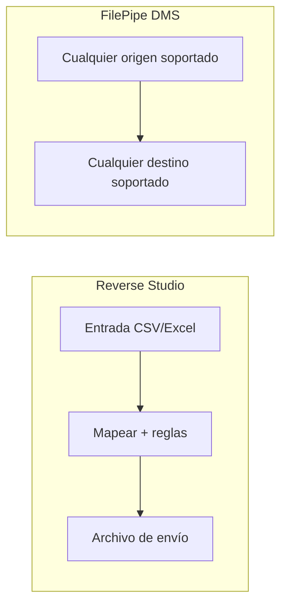
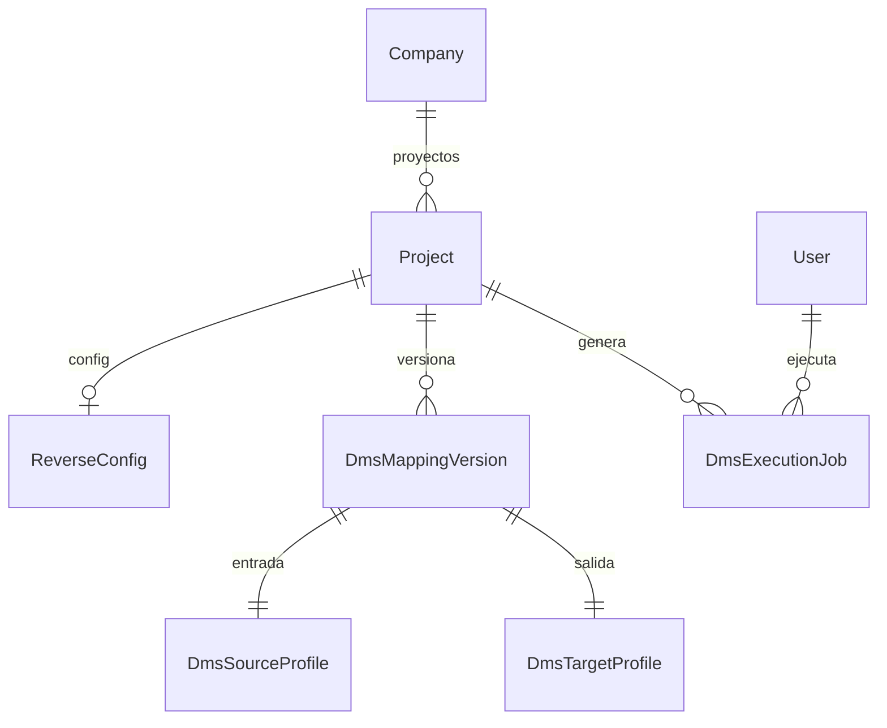

# REVERSE STUDIO — Emisor de layouts

> **Nombre mnemotécnico:** `REVERSE_STUDIO`  
> Alias: *Emisor de layouts* · *CSV/Excel → posicional / JSON / XML*  
> Archivo: [`docs/REVERSE_STUDIO.md`](REVERSE_STUDIO.md)  
> Estado: **definición de producto / lineamientos** — base de desarrollo.  
> Origen: [`APP_FACTORY.md`](APP_FACTORY.md) §2 · [`APP_FACTORY_HIGH_REUSE.md`](APP_FACTORY_HIGH_REUSE.md) §3.  
> Estilo: hermano de [`FILE_GATE.md`](FILE_GATE.md) y [`DataMappingStudio.md`](DataMappingStudio.md).

### Rama de desarrollo y despliegues

| Ítem | Valor |
|------|--------|
| **Rama Git** | `feature/reverse-studio` |
| **Base** | `main` (producción / Railway) |
| **Alcance de la rama** | Análisis, diseño, prototipos, código de Reverse Studio y docs asociados |
| **Base de datos** | Preferir **reutilizar modelos DMS** (`DmsSourceProfile`, `DmsTargetProfile`, `DmsMappingVersion`, `DmsExecutionJob`). Migraciones nuevas solo si el kind/config lo exigen; documentarlas antes del merge |
| **Despliegues a Railway** | **No desplegar** desde `feature/reverse-studio` hasta merge a `main` (salvo staging). |
| **Merge a `main`** | Cuando el MVP esté revisado; PR `feature/reverse-studio` → `main` |
| **Respaldo recomendado** | Tag/rama `pre-reverse-studio` en `main` + backup BD si hay migración |

> Quien despliegue producción debe usar **`main`**, no la rama de feature.

---

## 0. Para qué sirve este documento

| Pregunta | Respuesta |
|----------|-----------|
| **¿Qué es?** | La **base de producto** de Reverse Studio: lineamientos para diseñar e implementar la app |
| **¿Qué no es?** | Spec detallada por pantalla (eso irá en `definition_app_REVERSE/` al abrir cada módulo) ni código |
| **Función** | Congelar qué hace el producto, alcance MVP, frontera con FilePipe, módulos, roles y próximos pasos |

---

## 1. Resumen ejecutivo

**Reverse Studio** es un aplicativo de DynamicWorkspace que permite a equipos de negocio y operaciones **generar el archivo en el formato rígido que exige el banco, el ERP o el proveedor**, partiendo de un Excel o CSV que sí saben llenar.

No es un ETL genérico: es el **paquete “entrada fácil → salida legacy”** montado sobre el motor FilePipe (DMS).

Flujo esencial:

```
Definir entrada (CSV / Excel)
        →
Definir salida (TXT posicional / JSON / XML)
        →
Mapear + reglas
        →
Publicar versión
        →
Subir planilla → generar → descargar archivo de envío
```

### Qué es / qué hace / qué no hace

| Pregunta | Respuesta corta |
|----------|-----------------|
| **¿Qué es?** | Emisor de layouts: convierte planillas amigables al contrato del receptor |
| **¿Qué hace?** | Parsea CSV/Excel → mapea → aplica reglas → **escribe** el archivo destino |
| **¿Qué no hace?** | No valida “solo gate” (eso es FILE GATE). No concilia dos archivos. No es FilePipe abierto a cualquier origen→destino en el MVP |
| **¿Para quién?** | Tesorería, RRHH, operaciones, integradores que deben enviar archivos en layout fijo |
| **Resultado** | Archivo de salida descargable + historial de generaciones |

### Propuesta de valor

| Aspecto | Descripción |
|---------|-------------|
| **Problema** | El receptor exige TXT/XML/JSON rígido; el negocio solo maneja Excel/CSV; hoy hay scripts o un DMS completo mal explicado |
| **Solución** | Proyecto reutilizable: contrato de entrada + contrato de salida + mapeo versionado + generación auditable |
| **Beneficio** | Menos scripts, misma planilla cada mes, evidencia de qué se generó y con qué versión |
| **Audiencia** | Operaciones, tesorería, nómina, integradores, supervisores de intercambio |

### Posicionamiento

| Alternativa | Limitación | Diferenciador Reverse Studio |
|-------------|------------|------------------------------|
| Script Python / VBA | Tribal, sin roles ni historial | Proyecto con versión, roles e informe |
| FilePipe / DMS completo | Demasiado genérico para “solo emitir al banco” | UX y alcance acotados a **emisión** |
| Llenar el TXT a mano | Error humano, no escala | Generación repetible desde Excel |
| FILE GATE | Solo valida; no genera salida | Complemento: validar entrada → luego emitir |
| ETL enterprise | Costo y complejidad | Ligero, sobre motor ya existente |

### Relación con la plataforma

| Pieza | Relación |
|-------|----------|
| Chasis (`Company`, seguridad, billing, roles) | Reutilizado al 100 % |
| DMS — SourceProfile, parsers, intake | **Entrada** (CSV/Excel/delimitado) |
| DMS — TargetProfile, serializers | **Salida** (posicional / JSON / XML) |
| DMS — Field mapping + transform rules | **Núcleo** del mapeo |
| DMS — Transform execution + jobs | **Generación** y descarga |
| FILE GATE | Opcional: pre-check del Excel/CSV antes de generar (Fase 2) |
| DynamicWorkspace — Records | Fuera del MVP (salvo catálogos vía lookup Fase 2+) |

---

## 2. Importancia

1. **Siguiente vertical de reutilización alta** tras FILE GATE ([`APP_FACTORY_HIGH_REUSE.md`](APP_FACTORY_HIGH_REUSE.md) §11).
2. **Máximo reuso del motor completo** (parse + map + serialize), no solo validación.
3. **Demanda clara:** “tengo el Excel, necesito el archivo del banco”.
4. **Complementa FILE GATE y FilePipe:** calidad de entrada → emisión empaquetada → ETL genérico cuando haga falta.
5. **Producto vendible solo** para equipos que no quieren aprender el hub completo de FilePipe.

---

## 3. Problema que resuelve

Escenarios típicos:

- Tesorería arma un Excel de pagos; el banco solo acepta TXT posicional.
- RRHH exporta CSV; el proveedor de nómina exige XML con layout fijo.
- Sistemas pide JSON batch; el área usuaria solo entrega planillas.
- Cada mes se reescribe un script frágil o se edita el TXT a mano.

**Objetivo:** una definición persistente (“así se convierte la planilla en el archivo de envío”) y una ejecución que **genere el archivo**, con historial y versión publicada.

---

## 4. Alcance

### 4.1 Incluido (MVP)

| Incluido | Descripción |
|----------|-------------|
| `project_kind = reverse` | Proyecto dedicado Reverse Studio |
| Hub propio | Copy de “emisión / layout de envío”, no de ETL genérico |
| Contrato de entrada | SourceProfile limitado a CSV / Excel / delimitado |
| Contrato de salida | TargetProfile: TXT posicional, JSON, XML (lo ya soportado en DMS) |
| Mapeo + reglas | Reuso de field mapping y transform rules existentes |
| Versionado | Borrador / publicar; generación solo contra versión publicada |
| Upload + generar | Intake + transform execution; dry run + job completo |
| Descarga | Archivo de salida de negocio + errores/informe de job |
| Historial | Quién generó, cuándo, archivo entrada, versión, estado |
| Roles | Diseñar / publicar / ejecutar / consultar (PA/ED/GE/CO) |

### 4.2 Excluido (MVP)

| Excluido | Motivo / fase |
|----------|----------------|
| Orígenes distintos de CSV/Excel/delimitado | Claridad de producto; FilePipe para el resto |
| Multi-destino en un solo job | Fase 2 |
| Scheduling / API / webhooks | Fase 3 (compartido plataforma) |
| Conciliación post-envío | Vertical File Match |
| Solo validar sin generar | FILE GATE |
| UI de reglas distinta a FilePipe | Reusar la existente; skin mínima |
| Compartir versión con un proyecto DMS | Independiente en MVP; plantillas Fase 2 |
| Parsers/serializers nuevos | Solo lo ya implementado en DMS |

### 4.3 Frontera con FilePipe (DMS)



| FilePipe | Reverse Studio |
|----------|----------------|
| ETL genérico origen↔destino | Camino fijo: **fácil → rígido** |
| Hub de definición amplio | Wizard/hub con narrativa de emisión |
| Mismo motor técnico | Misma potencia acotada por producto |

**Regla de producto:** si el cliente necesita orígenes/destinos fuera del MVP o pipelines complejos, usa **FilePipe**. Reverse Studio no duplica el motor; lo **empaqueta**.

### 4.4 Frontera con FILE GATE

| FILE GATE | Reverse Studio |
|-----------|----------------|
| ¿El archivo cumple el contrato? | ¿Puedo **generar** el archivo de envío? |
| No escribe salida de negocio | Sí escribe el layout destino |
| Informe OK/errores | Archivo generado + log de job |

Flujo opcional recomendado (Fase 2): validar el Excel/CSV en FILE GATE → si `passed`, generar en Reverse Studio.

---

## 5. Aplicaciones (casos de negocio)

| # | Aplicación | Ejemplo |
|---|------------|---------|
| A1 | Pagos / banco | Excel de abonos → TXT posicional del banco |
| A2 | Nómina | CSV RRHH → XML del proveedor de pagos |
| A3 | Altas ERP | Planilla de altas → JSON batch |
| A4 | Emisión mensual | Misma definición publicada; nuevo Excel cada ciclo |
| A5 | Onboarding de layout | Documentar el contrato de salida y usarlo como aceptación |
| A6 | Pre-check + emisión | FILE GATE sobre la planilla → Reverse genera el envío |

---

## 6. Módulos del producto

> Ritual (igual que FILE GATE): doc en `definition_app_REVERSE/` → prototipo → «Desarrolla el módulo».  
> No implementar un módulo hasta cerrar su especificación.

### Módulo 1 — Contrato de entrada (planilla)

> **Spec:** [`definition_app_REVERSE/input_definition.md`](definition_app_REVERSE/input_definition.md) · Estado: **implementado** (`apps/reverse_studio` · entrada)

- Tipo de archivo: CSV / Excel / delimitado (whitelist MVP).
- Encoding, captura, campos, reglas de contenido (reuso source_profile).
- Copy UX: “cómo viene la planilla de negocio”, no “origen para transformar”.

### Módulo 2 — Contrato de salida (layout de envío)

> **Spec:** [`definition_app_REVERSE/output_definition.md`](definition_app_REVERSE/output_definition.md) · Estado: **implementado**

- Target: TXT posicional, JSON, XML (whitelist MVP).
- Serialización, padding, encoding de salida (reuso target_profile).
- Copy UX: “cómo debe salir el archivo que recibe el banco/ERP”.
- Código: `apps/reverse_studio/output/` · URLs `.../salida/`.
### Módulo 3 — Mapeo y reglas

> **Spec:** [`definition_app_REVERSE/mapping_rules.md`](definition_app_REVERSE/mapping_rules.md) · Estado: **implementado**

- Field mapping entrada → layout de envío (reuso DMS).
- Transform rules (`trim`, `replace_map`, etc.) bajo `/mapeo/reglas/`.
- Completitud: campos required del layout cubiertos o `generated` / `constant`.
- Código: `apps/reverse_studio/mapping/` · URLs `.../mapeo/`.

### Módulo 4 — Publicar definición

> **Spec:** [`definition_app_REVERSE/publish.md`](definition_app_REVERSE/publish.md) · Estado: **implementado**

- Borrador editable; publicar congela entrada + salida + mapeo (+ reglas).
- Generaciones solo contra versión publicada (mismo espíritu que DMS/FILE GATE).
- Código: `apps/reverse_studio/publish/` · URLs `.../publicar/`.

### Módulo 5 — Generar archivo (Reverse Run)

> **Spec:** [`definition_app_REVERSE/generate_run.md`](definition_app_REVERSE/generate_run.md) · Estado: **implementado**

```
Upload planilla
    ↓
Resolver versión publicada
    ↓
Parse entrada → map → rules → serialize salida
    ↓
Persistir job + métricas + errores
    ↓
Descargar archivo generado (+ informe de errores si aplica)
```

Estados de job (alineados a ejecución DMS):

| Estado | Significado |
|--------|-------------|
| `completed` | Archivo generado; errores de fila según política del proyecto |
| `partial` | Corte por límites / max errors |
| `failed` | Fatal de parseo/configuración o umbral de rechazo |
| `preview` / dry run | Sin persistir salida definitiva (si se expone en UI) |

- Reuso: `file_intake` (producción) + `transform_execution`.
- Demo: `prototype/reverse_studio/run/hub.html`.

### Módulo 6 — Historial y evidencia

> **Spec:** [`definition_app_REVERSE/history.md`](definition_app_REVERSE/history.md) · Estado: **implementado**

- Listado filtrable: fecha, usuario, planilla, hash, versión, estado, TTL.
- Detalle de job + descarga de salida / informe / errores (TTL 7 días; CO solo metadatos).
- Reuso: `DmsExecutionJob` + patrón filtros FILE GATE; descargas vía M5.
- Demo: `prototype/reverse_studio/history/hub.html`.

### Módulo 7 — Integración FILE GATE (Fase 2)

> **Spec:** [`definition_app_REVERSE/gate_bridge.md`](definition_app_REVERSE/gate_bridge.md) · Estado: **implementado**

- Opción: exigir corrida FILE GATE `passed` / `passed_with_warnings` sobre el mismo `content_hash` antes de generar.
- Reuso: `DmsProjectConfig.file_gate_*` + `precheck_job` (ampliar kind a `KIND_REVERSE`).
- UI: settings Reverse + banner bloqueado/listo en Generar; vínculo visible en hub FILE GATE.
- Demo: `prototype/reverse_studio/bridge/hub.html`.

---

## 7. Reglas y funcionalidades

### 7.1 Reglas de negocio

| ID | Regla |
|----|-------|
| RS1 | Solo se genera contra versión **publicada** de la definición. |
| RS2 | El diseñador edita en **borrador**; publicar congela entrada + salida + mapeo. |
| RS3 | Ejecutar requiere permiso de ejecución (`GE` o `PA`/`ED` según matriz). |
| RS4 | Un job **lee** la planilla y **escribe** el archivo de salida; no altera la definición. |
| RS5 | En MVP, tipos de entrada fuera de CSV/Excel/delimitado se rechazan en UI y validación. |
| RS6 | Códigos de error estables vía catálogo DMS (`ExecutionErrorCode`). |
| RS7 | Upload seguro: límites, extensión, sanitización (file intake). |
| RS8 | Aislamiento por `Company` + membresía; sin lectura cruzada. |
| RS9 | No se duplican parsers/serializers: siempre servicios `apps.dms.*`. |

### 7.2 Funcionalidades MVP (checklist)

- [ ] `project_kind = reverse` + crear proyecto + hub
- [ ] Sidebar / navegación Reverse Studio
- [ ] Editor contrato de entrada (reuso source, whitelist tipos)
- [ ] Editor contrato de salida (reuso target)
- [ ] Mapeo + reglas (reuso DMS)
- [ ] Publicar versión
- [ ] Upload + dry run + generar + descargar salida
- [ ] Historial básico filtrable
- [ ] Mensajes UI (`UI_MESSAGES` § Reverse Studio)
- [ ] Ayudas de hub y pasos clave

### 7.3 Funcionalidades Fase 2

- [ ] Pre-check FILE GATE obligatorio / opcional
- [ ] Plantillas de layout por industria / banco
- [ ] Diff entre versiones de definición
- [ ] Multi-destino (generar 2 layouts desde la misma planilla)
- [ ] Consumo de Master Catalog en lookups

### 7.4 Funcionalidades Fase 3

- [ ] API `POST /generate` + webhook
- [ ] Scheduling / bandeja vigilada
- [ ] Lotes multi-archivo con informe consolidado
- [ ] Certificado de generación (hash entrada + hash salida + versión)

---

## 8. Ejemplos

### EJ-01 — Excel de pagos → TXT banco

**Entrada:** columnas `documento`, `nombre`, `monto`.  
**Salida:** posicional `documento(1-10)`, `nombre(11-40)`, `monto(41-52)`.  
**Resultado:** job `completed` + TXT descargable.

### EJ-02 — CSV nómina → XML proveedor

**Entrada:** CSV `;` con encabezado.  
**Salida:** XML con elementos por fila.  
**Resultado:** archivo XML + log si alguna fila falla validación de tipo.

### EJ-03 — Reutilización mensual

Definición publicada v2. Cada mes: subir nuevo Excel → generar → mismo layout. Sin redefinir mapeo.

### EJ-04 — Planilla inválida

Excel sin columna `monto` requerida.  
**Resultado:** `failed` o errores de fila según política; no se entrega salida “a medias” si la política lo prohíbe.

### EJ-05 — Con FILE GATE (Fase 2)

Validar planilla en gate del contrato de entrada → solo si `passed` habilitar “Generar” en Reverse.

---

## 9. Casos de uso formales

### RS-01 — Diseñar emisión

| | |
|---|---|
| **Actor** | Diseñador (`PA`/`ED`) |
| **Flujo** | Crear proyecto Reverse → entrada → salida → mapeo → publicar v1 |
| **Resultado** | Versión publicada lista para generar |

### RS-02 — Generar archivo del ciclo

| | |
|---|---|
| **Actor** | Ejecutor (`GE`) |
| **Flujo** | Generar → subir planilla → ejecutar → descargar salida |
| **Resultado** | Job en historial + archivo de envío |

### RS-03 — Rechazo con evidencia

| | |
|---|---|
| **Actor** | Supervisor |
| **Flujo** | Job `failed` / parcial → descargar log de errores → devolver a negocio |
| **Resultado** | Evidencia línea/campo/código |

### RS-04 — Cambio de layout del banco

| | |
|---|---|
| **Actor** | Diseñador |
| **Flujo** | Ajustar target/mapeo en borrador → publicar v3 |
| **Resultado** | Generaciones nuevas usan v3; históricas conservan v2 |

---

## 10. Modelo conceptual



| Entidad | Descripción | Reuso |
|---------|-------------|-------|
| `Project` | `project_kind = reverse` | `apps.projects` |
| `ReverseConfig` | Visibilidad, versión activa, flags (p. ej. exigir FILE GATE) | Análogo a `DmsProjectConfig` / o el mismo con kind |
| `DmsMappingVersion` | Snapshot draft/published | DMS |
| `DmsSourceProfile` | Contrato de entrada | DMS |
| `DmsTargetProfile` | Contrato de salida | DMS |
| Mappings / rules | En versión | DMS |
| `DmsExecutionJob` | Una generación | DMS (con output de negocio) |

### Decisión de implementación (congelada para lineamientos)

| Opción | Descripción | Recomendación |
|--------|-------------|---------------|
| **A** | App `apps/reverse_studio/` delgada + servicios DMS | **Preferida** (como FILE GATE) |
| **B** | Solo skin/flag dentro de `apps/dms` | Posible spike; peor diferenciación de producto |
| **C** | Modelos nuevos paralelos a DMS | Evitar en MVP |

**Preferencia:** kind `reverse` + app delgada; **cero duplicación** de parsers/serializers.

---

## 11. Esquema de configuración (borrador JSON)

```json
{
  "schema_version": "1.0",
  "kind": "reverse",
  "project": {
    "name": "Emisión pagos Banco X",
    "description": "Excel tesorería → TXT posicional banco"
  },
  "input": {
    "file_type_code": "xlsx",
    "encoding": "utf-8",
    "fields": [
      { "name": "documento", "column": "A", "content_type": "numeric", "required": true },
      { "name": "nombre", "column": "B", "content_type": "alphanumeric_spaces", "required": true },
      { "name": "monto", "column": "C", "content_type": "decimal", "required": true }
    ]
  },
  "output": {
    "file_type_code": "txt_fixed",
    "encoding": "latin-1",
    "fields": [
      { "name": "documento", "start": 1, "length": 10, "pad": "0", "align": "right" },
      { "name": "nombre", "start": 11, "length": 30, "pad": " ", "align": "left" },
      { "name": "monto", "start": 41, "length": 12, "pad": "0", "align": "right" }
    ]
  },
  "mappings": [
    { "source": "documento", "target": "documento" },
    { "source": "nombre", "target": "nombre", "rules": ["trim"] },
    { "source": "monto", "target": "monto" }
  ],
  "gate_policy": {
    "require_file_gate": false,
    "file_gate_project_id": null
  }
}
```

> Forma exacta alineada a snapshots DMS en implementación; este JSON es lineamiento de producto.

---

## 12. Roles y permisos

| Acción Reverse Studio | PA | ED | GE | CO |
|-----------------------|----|----|----|-----|
| Ver proyecto / historial | Sí | Sí | Sí | Sí |
| Editar entrada/salida/mapeo / publicar | Sí | Sí | No | No |
| Generar / descargar archivo de salida | Sí | Sí | Sí | No* |
| Gestionar miembros | Sí | No | No | No |

\*CO: metadatos del historial sí; descarga de archivos con datos de negocio: denegar u ofuscar en MVP (decidir en `definition_app`).

> **UI miembros:** implementada en `apps/reverse_studio/projects/` → `/app/reverse-studio/proyectos/<slug>/miembros/` (reuso `project_service`, mismo patrón FilePipe/Worksheets).

---

## 13. Arquitectura técnica sugerida

| Capa | Enfoque |
|------|---------|
| UI | `templates/reverse_studio/` + prototipos `prototype/reverse_studio/` |
| App | `apps/reverse_studio/` (views/urls/services delgados) |
| Servicios | Importar `source_*`, `target_*`, `field_mapping`, `transform_*`, `file_intake`, `transform_execution` desde `apps.dms` |
| Persistencia | Preferir modelos DMS existentes + `project_kind`; config mínima propia si hace falta |
| Mensajes | Extender [`UI_MESSAGES.md`](definition_app/UI_MESSAGES.md) |
| Deploy | Mismo Railway; migrar solo si hay campos nuevos |

```
apps/
└── reverse_studio/          # propuesta
    ├── apps.py
    ├── urls.py
    ├── views.py             # hubs y orquestación UX
    └── services/            # wrappers / políticas de producto
```

Parsers, targets y motor de job permanecen en `apps.dms` (**no copiar**).

---

## 14. MVP y roadmap

### Fase MVP

| Incluido | Excluido |
|----------|----------|
| Kind + hub + entrada CSV/XLSX/delimitado | Otros orígenes |
| Salida fixed/json/xml ya soportados | Multi-destino |
| Mapeo + reglas + publicar | API / scheduling |
| Generar + descargar + historial | Bridge FILE GATE obligatorio |
| Ayudas + UI_MESSAGES | Plantillas industria |

### Fase 2

Pre-check FILE GATE, plantillas, diff de versiones, multi-destino, Master Catalog.

### Fase 3

API, webhooks, lotes, bandeja, certificado de generación.

---

## 15. Riesgos y decisiones abiertas

| # | Tema | Opciones | Recomendación inicial |
|---|------|----------|------------------------|
| 1 | App nueva vs modo DMS | `reverse_studio` / flag dms | **Kind + app delgada**; servicios DMS |
| 2 | Nombre de kind | `reverse` / `emit` / `layout` | `reverse` (alineado al nemotécnico) |
| 3 | ¿Reutilizar `DmsProjectConfig`? | Sí / config propia | Reusar si no ensucia FilePipe; si no, `ReverseConfig` mínimo |
| 4 | Whitelist entrada estricta | Sí / no | **Sí** en MVP |
| 5 | CO descarga salida | No / ofuscar / sí | **No** en MVP |
| 6 | Solapamiento percepción con FilePipe | Copy + límites de tipo | Hub y textos de “emisión” desde día 1 |

---

## 16. Métricas de éxito

| Métrica | Meta inicial |
|---------|--------------|
| Tiempo a primera emisión publicada | &lt; 30 minutos |
| Reutilización | ≥ 3 generaciones / definición / mes en piloto |
| Reducción de scripts | ≥ 1 proceso manual/script reemplazado en 30 días |
| Código nuevo vs reuso DMS | &lt; 35 % (piel + orquestación) |

---

## 17. Criterio APP_FACTORY (check)

| Criterio | ¿Cumple? |
|----------|----------|
| Reusa Company + seguridad + billing | Sí |
| Se modela como `project_kind` | Sí (`reverse`) |
| Usa motor ETL | Sí (parse + map + serialize) |
| MVP acotado en una fase | Sí |
| No duplica FilePipe sin diferenciador | Sí — diferenciador: **entrada fácil → salida rígida** |

---

## 18. Próximos pasos de diseño / desarrollo

> Trabajo en rama **`feature/reverse-studio`**. Sin deploy a Railway desde esa rama hasta merge a `main`.

1. Congelar kind (`reverse`) y copy de producto (hub, sidebar).
2. Crear `docs/definition_app_REVERSE/README.md` + checklist de módulos.  
   → **Hecho (esqueleto):** `docs/definition_app_REVERSE/`, `prototype/reverse_studio/`, `templates/reverse_studio/`.
3. Prototipos `prototype/reverse_studio/` (hub + flujo entrada → salida → mapeo → generar).
4. Spike técnico: proyecto `reverse` que reutiliza servicios DMS sin copiar motor.
5. **Módulo 1** — contrato de entrada → **implementado**.
6. **Módulo 2** — contrato de salida → **implementado**.
7. **Módulo 3** — mapeo y reglas → **implementado**.
8. **Módulo 4** — publicar → **implementado**.
9. **Módulo 5** — generar + descarga → **implementado**.
10. **Módulo 6** — historial → **implementado**.
11. Extender `UI_MESSAGES.md` (M1–M2 en §3.10).
12. **Módulo 7** — bridge FILE GATE → **implementado**.
13. PR a `main` con MVP revisado.

**Regla de avance (igual FILE GATE):** no pasar al siguiente módulo sin cerrar el actual (spec + prototipo + implementación acordada).

---

## 19. Glosario

| Término | Definición |
|---------|------------|
| **Reverse Studio** | Producto emisor de layouts desde planillas amigables |
| **Contrato de entrada** | Cómo se lee el CSV/Excel de negocio |
| **Contrato de salida / layout** | Cómo debe quedar el archivo del receptor |
| **Definición publicada** | Snapshot inmutable entrada+salida+mapeo |
| **Generación / Reverse Run** | Job que produce el archivo de envío |
| **Emisión** | Acto de generar y entregar el archivo al proceso aguas abajo |
| **FilePipe** | ETL genérico; Reverse es el paquete acotado encima del mismo motor |

---

## 20. Documentos relacionados

| Documento | Relación |
|-----------|----------|
| [`APP_FACTORY.md`](APP_FACTORY.md) | Prioridad y criterio de verticales |
| [`APP_FACTORY_HIGH_REUSE.md`](APP_FACTORY_HIGH_REUSE.md) | Familia §2; Reverse es §3 |
| [`FILE_GATE.md`](FILE_GATE.md) | Validador; pre-check opcional Fase 2 |
| [`DataMappingStudio.md`](DataMappingStudio.md) | Visión FilePipe / motor ETL |
| [`DynamicWorkspace.md`](DynamicWorkspace.md) | Chasis multi-tenant |
| [`definition_app_DMS/source_definition.md`](definition_app_DMS/source_definition.md) | Base contrato de entrada |
| [`definition_app_DMS/target_definition.md`](definition_app_DMS/target_definition.md) | Base contrato de salida |
| [`definition_app_DMS/field_mapping.md`](definition_app_DMS/field_mapping.md) | Mapeo |
| [`definition_app_DMS/transform_rules.md`](definition_app_DMS/transform_rules.md) | Reglas |
| [`definition_app_DMS/transform_execution.md`](definition_app_DMS/transform_execution.md) | Ejecución / jobs |
| [`definition_app_DMS/file_intake.md`](definition_app_DMS/file_intake.md) | Upload |
| [`definition_app/UI_MESSAGES.md`](definition_app/UI_MESSAGES.md) | Mensajes UI |

---

*Documento: `docs/REVERSE_STUDIO.md` — lineamientos y base de desarrollo del Emisor de layouts (Reverse Studio).*
