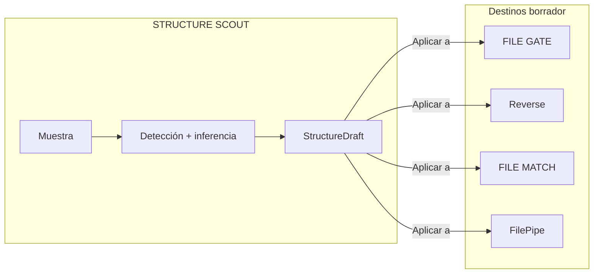
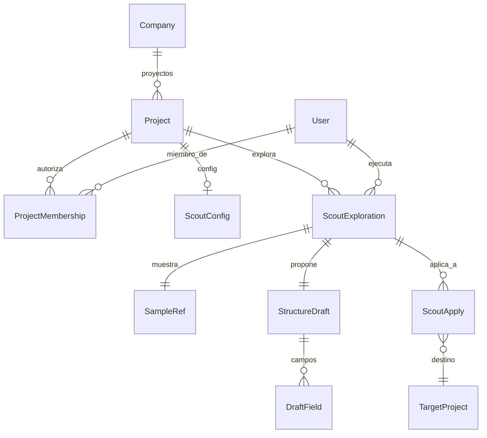

# STRUCTURE SCOUT — Explorador de estructura

> **Nombre mnemotécnico:** `STRUCTURE_SCOUT`  
> Alias: *Explorador de estructura* · *Schema Scout* · *Detector de patrones*  
> Archivo: [`docs/STRUCTURE_SCOUT.md`](STRUCTURE_SCOUT.md)  
> Estado: **MVP implementado en rama** (`feature/structure-scout`, M1–M7 + integración) — pendiente merge a `main`.  
> Origen: [`APP_FACTORY.md`](APP_FACTORY.md) §2 · [`APP_FACTORY_HIGH_REUSE.md`](APP_FACTORY_HIGH_REUSE.md) §6.  
> Specs al abrir: [`definition_app_STRUCTURE_SCOUT/`](definition_app_STRUCTURE_SCOUT/).  
> Estilo: hermano de [`FILE_GATE.md`](FILE_GATE.md), [`REVERSE_STUDIO.md`](REVERSE_STUDIO.md), [`FILE_MATCH.md`](FILE_MATCH.md) y [`PROFILE_SEED.md`](PROFILE_SEED.md).

### Rama de desarrollo y despliegues

| Ítem | Valor |
|------|--------|
| **Rama Git** | `feature/structure-scout` |
| **Base** | `main` (producción / Railway) |
| **Alcance de la rama** | Análisis, diseño, prototipos, código de STRUCTURE SCOUT y docs asociados |
| **Base de datos** | Preferir **reutilizar** sample intake / `detection_service` / parsers DMS. Modelos nuevos solo para exploración / `StructureDraft` / apply; documentarlos antes del merge |
| **Despliegues a Railway** | **No desplegar** desde `feature/structure-scout` hasta merge a `main` (salvo staging). |
| **Merge a `main`** | Cuando el MVP esté revisado; PR `feature/structure-scout` → `main` |
| **Respaldo recomendado** | Tag/rama `pre-structure-scout` en `main` + backup BD si hay migración |

> Quien despliegue producción debe usar **`main`**, no la rama de feature.

---

## 0. Para qué sirve este documento

| Pregunta | Respuesta |
|----------|-----------|
| **¿Qué es?** | La **base de producto** de STRUCTURE SCOUT: lineamientos para diseñar e implementar el explorador |
| **¿Qué no es?** | Spec detallada por pantalla (eso irá en `definition_app_STRUCTURE_SCOUT/` al abrir cada módulo) ni código |
| **Función** | Congelar qué hace el producto, alcance MVP, frontera con Seed/GATE/Match/Reverse, módulos, roles y próximos pasos |

---

## 1. Resumen ejecutivo

**STRUCTURE SCOUT** es un aplicativo de DynamicWorkspace que permite a integradores y analistas **analizar una muestra de archivo** y obtener un **borrador de estructura** (tipo, captura, campos y tipos sugeridos) editable, para luego **aplicarlo** a FILE GATE, Reverse Studio, FILE MATCH o FilePipe — sin armar el wizard de origen desde cero.

No valida producción, no emite layouts y no concilia. **Propone**; el usuario confirma. Tampoco clona una definición ya publicada (eso es PROFILE_SEED).

Flujo esencial:

```
Subir muestra de archivo
        →
Detectar patrón (encoding, tipo, delimitador / captura)
        →
Inferir campos y tipos (con confianza)
        →
Revisar / editar borrador de estructura
        →
Guardar · o aplicar a proyecto destino (borrador)
```

### Qué es / qué hace / qué no hace

| Pregunta | Respuesta corta |
|----------|-----------------|
| **¿Qué es?** | Explorador de estructura: muestra → borrador de esquema asistido |
| **¿Qué hace?** | Detecta patrón + infiere campos/tipos → presenta draft editable → siembra destinos |
| **¿Qué no hace?** | No valida (GATE). No emite (Reverse). No concilia (Match). No clona definición publicada (Seed). No aplica sin confirmación humana |
| **¿Para quién?** | Integradores y analistas con layouts nuevos o poco documentados |
| **Resultado** | `StructureDraft` + historial de exploraciones / aplicaciones |

### Propuesta de valor

| Aspecto | Descripción |
|---------|-------------|
| **Problema** | El primer paso de GATE / Reverse / Match / FilePipe es definir campos a mano aunque la muestra ya traiga el patrón |
| **Solución** | Proyecto reutilizable: muestra + job de exploración + borrador alineado a forma SourceProfile / contrato |
| **Beneficio** | Menos prueba y error en el wizard; time-to-first-schema más corto; menos error de configuración inicial |
| **Audiencia** | Operaciones, integradores, analistas de intercambio, diseñadores de contrato |

### Posicionamiento

| Alternativa | Limitación | Diferenciador STRUCTURE SCOUT |
|-------------|------------|-------------------------------|
| Wizard manual 6 pasos | Lento si el archivo es desconocido | Propuesta inicial asistida |
| Script “adivinar columnas” | Sin UI, roles ni historial | Proyecto con exploración auditable |
| PROFILE_SEED | Requiere definición **ya publicada** | Scout parte de **muestra cruda** |
| FILE GATE | Valida contra contrato; no lo inventa | Scout **propone** el contrato |
| Excel + “mirar” | No escala, no audita | Detección repetible + draft exportable |
| IA/LLM genérica | Costo, no determinista, fuera de MVP | Heurísticas + detección DMS (LLM Fase 2+) |

### Relación con la plataforma

| Pieza | Relación |
|-------|----------|
| Chasis (`Company`, seguridad, billing, roles) | Reutilizado al 100 % |
| Chasis — `Project` + `ProjectMembership` | Alta de proyecto Scout + miembros/autorizaciones |
| DMS — sample intake / preview | **Núcleo** de carga de muestra |
| DMS — `detection_service` / parsers | **Núcleo** de detección e inferencia (no duplicar) |
| DMS — SourceProfile / contrato GATE | **Forma canónica** del draft a aplicar |
| FILE GATE / Reverse / Match / FilePipe | **Destinos** de “Aplicar a…” (borrador) |
| PROFILE_SEED | Complemento: Seed = desde definición; Scout = desde muestra |
| DynamicWorkspace — Records | Fuera del MVP |

---

## 2. Importancia

1. **Acelerador transversal** de la familia §2 ([`APP_FACTORY_HIGH_REUSE.md`](APP_FACTORY_HIGH_REUSE.md) §6 / §13).
2. **Baja el costo de adopción** de GATE, Reverse, Match y FilePipe cuando no hay layout documentado.
3. **Productiza** detección/sample ya existente en DMS (empaquetado con UI, roles e historial).
4. **Complementa PROFILE_SEED:** si hay definición publicada → Seed; si solo hay archivo → Scout.
5. **Producto vendible solo** como “ayúdame a entender este archivo” antes de validar o transformar.

---

## 3. Problema que resuelve

Escenarios típicos:

- Llega un CSV nuevo del proveedor sin diccionario de datos.
- Tesorería trae un Excel de pagos y hay que armar la entrada de Reverse.
- Auditoría recibe un TXT delimitado desconocido y necesita documentar la estructura probable.
- Match: hay que sembrar perfiles A/B desde extracto y libro sin wizard vacío.
- Onboarding FilePipe: primer SourceProfile sugerido desde muestra.

**Objetivo:** una exploración persistente (“así se veía la muestra”) y un borrador que el diseñador confirma antes de usarlo en otro vertical.

---

## 4. Alcance

### 4.1 Incluido (MVP)

| Incluido | Descripción |
|----------|-------------|
| `project_kind = structure_scout` | Proyecto dedicado Explorador |
| Hub propio | Copy de “exploración / borrador de estructura”, no de validación ni ETL |
| Cargar muestra | Upload + límites + preview crudo (reuso intake) |
| Detectar patrón | Encoding, tipo, delimitador / header / captura inicio-fin sugeridos |
| Proponer campos y tipos | Tabla editable + confianza + ejemplos de valor |
| Guardar borrador | Snapshot `StructureDraft` versionable / reutilizable |
| Aplicar a destino | Wizard: GATE / Reverse / Match / DMS → escribe **borrador** del perfil destino |
| Historial | Quién exploró, cuándo, muestra, estado, aplicaciones |
| Roles + miembros | PA/ED/GE/CO; PA gestiona membresía (reuso `ProjectMembership`) |

**Tipos de archivo MVP (amigables):** CSV, Excel, delimitado. Posicional básico solo si la heurística DMS lo permite con confianza usable; si no, Fase 2.

### 4.2 Excluido (MVP)

| Excluido | Motivo / fase |
|----------|----------------|
| Validación / certificación de producción | Es FILE GATE |
| Generar archivo destino | Es Reverse / FilePipe |
| Conciliación A vs B | Es FILE MATCH |
| Clone desde definición publicada | Es PROFILE_SEED |
| Auto-aplicar sin confirmación humana | Regla de producto |
| IA / LLM como dependencia obligatoria | Fase 2+ opcional |
| Corregir o reescribir el archivo de muestra | Fuera de alcance |
| Fuzzy layout multi-registro / anidados profundos | Fase 2+ |
| Entrenamiento ML propietario | Fase 3 |
| Scheduling / API pública | Fase 3 |

### 4.3 Frontera con otros verticales



| Vertical | Relación |
|----------|----------|
| **FILE GATE** | Scout **siembra** el contrato; GATE **valida** archivos reales |
| **Reverse Studio** | Scout siembra el **contrato de entrada**; Reverse emite la salida |
| **FILE MATCH** | Scout siembra perfil A y/o B |
| **FilePipe** | Scout siembra SourceProfile del origen |
| **PROFILE_SEED** | Seed = definición publicada → draft; Scout = muestra → draft |
| **Master Catalog** | No se solapa (códigos de negocio vs forma del archivo) |
| **Detección DMS** | Scout **empaqueta** `detection_service` / sample; no inventa otro parser |

**Regla de producto:** STRUCTURE SCOUT **no publica** el destino. “Aplicar a…” crea/actualiza solo **borrador**; el diseñador publica en la app destino.

### 4.4 Frontera Scout vs Seed vs Bridge

| | STRUCTURE SCOUT | PROFILE_SEED | Bridge FILE GATE |
|--|-----------------|--------------|------------------|
| **Entrada** | Muestra de archivo | Definición **publicada** | Hash de archivo ya validado |
| **Salida** | Borrador de estructura | Borrador clonado | Pre-check OK/fail |
| **Juicio** | Inferencia + confirmación | Copia + confirmación | Cumple contrato o no |

---

## 5. Aplicaciones (casos de negocio)

| # | Aplicación | Ejemplo |
|---|------------|---------|
| P1 | Onboarding proveedor | CSV nuevo → Scout → sembrar FILE GATE |
| P2 | Emisión bancaria | Excel de pagos → Scout → entrada Reverse |
| P3 | Documentar layout | TXT desconocido → informe de estructura probable |
| P4 | Conciliación | Explorar extracto y libro → sembrar Match A/B |
| P5 | FilePipe | Primer SourceProfile sugerido desde muestra |
| P6 | Re-exploración | Misma familia de archivo con layout cambiado → nuevo draft |

---

## 6. Módulos del producto

> Ritual (igual que FILE GATE / Reverse / Match): doc en `definition_app_STRUCTURE_SCOUT/` → prototipo → «Desarrolla el módulo».  
> No implementar un módulo hasta cerrar su especificación.

### Módulo 1 — Proyecto / hub Scout

> **Spec:** [`definition_app_STRUCTURE_SCOUT/project_lifecycle.md`](definition_app_STRUCTURE_SCOUT/project_lifecycle.md) · Estado: **implementado**  
> **Demo:** [`prototype/structure_scout/index.html`](../prototype/structure_scout/index.html)  
> **App:** `apps/structure_scout/projects/` · `/app/structure-scout/proyectos/`

- Alta de proyecto `structure_scout`, listado, hub, miembros.
- Copy UX: “exploración / muestra / borrador de estructura”.
- CTA principal: Nueva exploración (M2 pendiente).

### Módulo 2 — Cargar muestra

> **Spec:** [`definition_app_STRUCTURE_SCOUT/sample_upload.md`](definition_app_STRUCTURE_SCOUT/sample_upload.md) · Estado: **implementado**  
> **Demo:** [`prototype/structure_scout/sample/hub.html`](../prototype/structure_scout/sample/hub.html)  
> **App:** `apps/structure_scout/sample/` · `/app/structure-scout/proyectos/<slug>/muestra/`

- Upload seguro (límites, extensión, sanitización) — reuso file intake.
- Preview crudo (primeras N filas / bytes).
- TTL / retención alineada a samples DMS (la muestra no es archivo de producción).

### Módulo 3 — Detectar patrón

> **Spec:** [`definition_app_STRUCTURE_SCOUT/detect_pattern.md`](definition_app_STRUCTURE_SCOUT/detect_pattern.md) · Estado: **implementado**  
> **Demo:** [`prototype/structure_scout/detect/hub.html`](../prototype/structure_scout/detect/hub.html)  
> **App:** `apps/structure_scout/detect/` · `/app/structure-scout/proyectos/<slug>/detectar/`

- Encoding, tipo de archivo, delimitador / hoja, header row, captura inicio/fin sugeridos.
- Reuso `detection_service` / parsers DMS.
- Estado global: confianza alta / `needs_review` / `failed`.
- Persistencia: `ScoutDetectionState` (OneToOne al proyecto).

### Módulo 4 — Proponer campos y tipos

> **Spec:** [`definition_app_STRUCTURE_SCOUT/propose_fields.md`](definition_app_STRUCTURE_SCOUT/propose_fields.md) · Estado: **implementado**  
> **Demo:** [`prototype/structure_scout/fields/hub.html`](../prototype/structure_scout/fields/hub.html)  
> **App:** `apps/structure_scout/fields/` · `/app/structure-scout/proyectos/<slug>/campos/`

- Tabla editable: nombre, `content_type` (catálogo DMS/GATE), required?, ejemplos, confianza.
- Inferencia heurística desde muestra + patrón M3 (sin LLM).
- Persistencia: `ScoutFieldsState` (M5 versionará `StructureDraft`).
- Advertir cobertura baja (pocas filas de muestra) o tipos mixtos.

### Módulo 5 — Guardar borrador

> **Spec:** [`definition_app_STRUCTURE_SCOUT/save_draft.md`](definition_app_STRUCTURE_SCOUT/save_draft.md) · Estado: **implementado**  
> **Demo:** [`prototype/structure_scout/draft/hub.html`](../prototype/structure_scout/draft/hub.html)  
> **App:** `apps/structure_scout/draft/` · `/app/structure-scout/proyectos/<slug>/borrador/`

- Persistir `StructureDraft` (snapshot alineado a forma `source` / contrato GATE).
- Versionado ligero del draft (cada guardado = versión nueva; no pisa en silencio).
- Export JSON del borrador (MVP; CO sin examples).

### Módulo 6 — Aplicar a destino

> **Spec:** [`definition_app_STRUCTURE_SCOUT/apply_target.md`](definition_app_STRUCTURE_SCOUT/apply_target.md) · Estado: **implementado**  
> **Demo:** [`prototype/structure_scout/apply/hub.html`](../prototype/structure_scout/apply/hub.html)  
> **App:** `apps/structure_scout/apply/` · `/app/structure-scout/proyectos/<slug>/aplicar/`

- Elegir proyecto destino (misma compañía): GATE (P0) / Reverse (P1).
- Preview resumen / warning si el destino ya tiene borrador (overwrite).
- Escribe solo **borrador** vía `save_source`; nunca auto-publica.
- Auditoría `ScoutApply`.

### Módulo 7 — Historial

> **Spec:** [`definition_app_STRUCTURE_SCOUT/history.md`](definition_app_STRUCTURE_SCOUT/history.md) · Estado: **implementado**  
> **Código:** `apps/structure_scout/history/` · **Prototipos:** `prototype/structure_scout/history/`

- Timeline unificado: `StructureDraft` + `ScoutApply` (sin `ScoutExploration`).
- Filtro MVP por tipo; detalle draft / apply + deep-link destino.
- Roles: PA/ED/GE/CO ven listado; CO sin examples en detalle draft.

### Transversal — Integración

> **Spec:** [`definition_app_STRUCTURE_SCOUT/ss_integration.md`](definition_app_STRUCTURE_SCOUT/ss_integration.md) · Estado: **documentado** (M1–M7)

- Kind `structure_scout`, URLs `/app/structure-scout/`, roles PA/ED/GE/CO.
- Reuso DMS (sample, detection, parsers, `save_source`); frontera Seed / Bridge.
- Mensajes UI §3.12; sin `ScoutExploration` en MVP.

---

## 7. Reglas y funcionalidades

### 7.1 Reglas de negocio

| ID | Regla |
|----|-------|
| S1 | Toda propuesta es **borrador** hasta que el usuario confirma campos/tipos. |
| S2 | “Aplicar a destino” crea/actualiza solo **borrador** del perfil destino (no publica solo). |
| S3 | La muestra no es archivo de producción; TTL / retención como samples DMS. |
| S4 | Inferencia de tipo se basa en muestra (N filas); advertir si cobertura es baja. |
| S5 | Aislamiento por `Company` + membresía; sin lectura cruzada de muestras. |
| S6 | No se duplican parsers: detección y parse vía `apps.dms.*`. |
| S7 | Posicional: si la confianza es baja, el UI exige revisión manual de longitudes. |
| S8 | Ejecutar exploración / aplicar requiere rol adecuado (matriz §12). |
| S9 | Upload seguro: límites, extensión, sanitización (file intake). |
| S10 | Cross-compañía: **no** en MVP. |

### 7.2 Funcionalidades MVP (checklist)

- [x] `project_kind = structure_scout` + crear proyecto + hub
- [x] Miembros / autorizaciones (PA/ED/GE/CO)
- [x] Sidebar / navegación Explorador
- [x] Upload muestra + preview
- [x] Detectar patrón (CSV / Excel / delimitado)
- [x] Tabla campos/tipos editable + confianza
- [x] Guardar `StructureDraft` + export JSON
- [x] Aplicar a FILE GATE (P0) y al menos un segundo destino (Reverse o Match A)
- [x] Historial de exploraciones (timeline drafts + applies)
- [x] Mensajes UI (`UI_MESSAGES` § STRUCTURE SCOUT) — proyectos + muestra + detectar + campos + borrador + aplicar + historial
- [x] Ayudas de hub y pasos clave (ciclo completo hasta historial)

### 7.3 Funcionalidades Fase 2

- [ ] Posicional con heurística robusta (o explícitamente fuera si sigue débil)
- [x] **Longitudes/posiciones estimadas editables en Scout (M4→M5→M6)** — spec: [`definition_app_STRUCTURE_SCOUT/propose_field_lengths.md`](definition_app_STRUCTURE_SCOUT/propose_field_lengths.md) (rama `feature/scout-mejoras-campos`)
- [ ] JSON/XML plano (alineado a parsers DMS)
- [ ] LLM opcional para nombrar campos / sugerir máscaras (no obligatorio)
- [ ] Diff campo a campo avanzado al aplicar sobre draft existente
- [ ] CTA “Explorar muestra” embebido en wizards GATE / Match / Reverse
- [ ] Aplicar a Match B + FilePipe origen

### 7.4 Funcionalidades Fase 3

- [ ] API `POST /scout` + webhook
- [ ] ML / entrenamiento propietario
- [ ] Multi-registro / layouts anidados profundos
- [ ] Scheduling de re-exploración sobre bandeja vigilada

---

## 8. Ejemplos

### EJ-01 — CSV con encabezado (delimitador `;`)

**Muestra:**

```text
documento;nombre;monto;fecha
1001;ANA;500.00;2026-01-15
1002;LUIS;250,50;15/01/2026
```

**Detección global:** `csv` / `;` / UTF-8 / header fila 1.

| Campo | Tipo sugerido | Required | Confianza | Notas |
|-------|---------------|----------|-----------|-------|
| documento | numeric | sí | alta | siempre dígitos |
| nombre | alphanumeric_spaces | sí | alta | |
| monto | decimal | sí | media | mezcla `.` y `,` → pedir locale |
| fecha | date | sí | media | formatos mixtos → pedir máscara |

### EJ-02 — Excel de pagos → entrada Reverse

Usuario sube planilla → Scout propone columnas → aplica a proyecto Reverse (contrato de entrada en borrador) → diseñador ajusta mapeo y publica en Reverse.

### EJ-03 — Cobertura baja

Muestra con 2 filas de datos → estado `needs_review`; UI advierte que los tipos pueden ser inestables.

### EJ-04 — Tipo no soportado

Archivo binario / encoding ilegible → estado `failed`; no se inventa un draft vacío.

---

## 9. Casos de uso formales

### SS-01 — Explorar muestra nueva

| | |
|---|---|
| **Actor** | Diseñador (`PA`/`ED`) |
| **Flujo** | Crear/abrir proyecto Scout → subir muestra → detectar → revisar campos → guardar draft |
| **Resultado** | `StructureDraft` en estado `draft_ready` o `needs_review` |

### SS-02 — Sembrar FILE GATE

| | |
|---|---|
| **Actor** | Diseñador |
| **Flujo** | Draft listo → Aplicar a → elegir proyecto GATE → confirmar → abrir borrador en GATE |
| **Resultado** | Contrato GATE en borrador; publicación queda en GATE |

### SS-03 — Re-explorar tras cambio de layout

| | |
|---|---|
| **Actor** | Diseñador |
| **Flujo** | Nueva exploración con muestra actualizada → comparar / guardar nuevo draft |
| **Resultado** | Historial conserva exploración anterior; draft nuevo disponible |

### SS-04 — Solo documentar (sin aplicar)

| | |
|---|---|
| **Actor** | Analista / auditoría (`GE` o `CO` según matriz) |
| **Flujo** | Explorar → exportar JSON / ver informe de estructura |
| **Resultado** | Evidencia de estructura probable sin tocar otros proyectos |

### SS-05 — Autorizar miembros

| | |
|---|---|
| **Actor** | Admin de proyecto (`PA`) |
| **Flujo** | Hub → Miembros → asignar/cambiar rol o revocar |
| **Resultado** | Solo usuarios autorizados de la compañía exploran/aplican según matriz |

---

## 10. Modelo conceptual



| Entidad | Descripción | Reuso |
|---------|-------------|-------|
| `Project` | `project_kind = structure_scout` | `apps.projects` |
| `ProjectMembership` | Autorización PA/ED/GE/CO | `apps.projects` |
| `ScoutConfig` | Flags, límites de muestra, destinos permitidos | Nuevo mínimo o JSON en proyecto |
| `ScoutExploration` | Una corrida de detección + inferencia | Job propio o análogo a ejecución DMS |
| `SampleRef` | Referencia a muestra (storage + hash + TTL) | Sample / intake DMS |
| `StructureDraft` | Snapshot campos/tipos + detección global | JSON alineado a forma `source` / GATE |
| `DraftField` | Campo propuesto (nombre, tipo, required, confianza, ejemplos) | Parte del JSON draft |
| `ScoutApply` | Auditoría de aplicación a destino | Nuevo mínimo |

### Resultados de una exploración

| Estado | Significado |
|--------|-------------|
| `draft_ready` | Propuesta usable; usuario puede editar/aplicar |
| `needs_review` | Detección parcial (delimitador dudoso, tipos mixtos, cobertura baja) |
| `failed` | No se pudo leer la muestra / tipo no soportado |
| `applied` | Al menos una aplicación a destino registrada (referencia) |

### Decisión de implementación (congelada para lineamientos)

| Opción | Descripción | Recomendación |
|--------|-------------|---------------|
| **A** | App `apps/structure_scout/` delgada + detection/parsers DMS + draft/apply propios | **Preferida** (como GATE / Match / Reverse) |
| **B** | Solo servicio embebido en wizards (sin kind) | Posible Fase 2 como CTA; MVP prioriza **kind + hub** vendible |
| **C** | Reimplementar parsers / detección | **Evitar** |

**Preferencia:** kind `structure_scout` + app delgada; **cero duplicación** de parsers; capa “Aplicar a” compartible con PROFILE_SEED.

### Decisiones de producto (borrador → congelar en specs)

| # | Tema | Recomendación |
|---|------|---------------|
| 1 | ¿Kind propio o solo embebido? | **Kind + hub** en MVP; API interna / CTA en wizards Fase 2 |
| 2 | ¿IA/LLM en MVP? | **No** obligatorio; heurísticas + detección DMS |
| 3 | ¿Posicional en MVP? | Básico si heurística usable; si no, Fase 2 |
| 4 | Nombre UI | **Explorador de estructura** (`STRUCTURE_SCOUT`) |
| 5 | ¿Aplicar sobrescribe draft destino? | Merge asistido + diff; nunca publicar automático |
| 6 | ¿Tenant? | Misma compañía |

---

## 11. Esquema de configuración (borrador JSON)

```json
{
  "schema_version": "1.0",
  "kind": "structure_scout",
  "detection": {
    "file_type": "csv",
    "encoding": "utf-8",
    "delimiter": ";",
    "header_row": 1,
    "capture_start": null,
    "capture_end": null,
    "confidence": "high"
  },
  "draft": {
    "fields": [
      {
        "name": "documento",
        "type": "numeric",
        "required": true,
        "confidence": "high",
        "examples": ["1001", "1002"]
      },
      {
        "name": "monto",
        "type": "decimal",
        "required": true,
        "confidence": "medium",
        "notes": "mixed_decimal_separators",
        "examples": ["500.00", "250,50"]
      }
    ]
  },
  "apply": {
    "allowed_targets": ["file_gate", "reverse_studio", "file_match", "filepipe"],
    "auto_publish": false
  }
}
```

> El JSON final debe mapearse 1:1 (o con adaptador delgado) a la forma de `DmsSourceProfile` / contrato GATE para evitar “traducción creativa”.

---

## 12. Roles (matriz MVP)

| Acción | PA | ED | GE | CO |
|--------|----|----|----|----|
| Crear / configurar proyecto Scout | ✓ | ✓ | — | — |
| Gestionar miembros | ✓ | — | — | — |
| Subir muestra / ejecutar exploración | ✓ | ✓ | ✓ | — |
| Editar draft / confirmar tipos | ✓ | ✓ | — | — |
| Aplicar a destino | ✓ | ✓ | — | — |
| Ver historial / export JSON (metadatos) | ✓ | ✓ | ✓ | ✓ |
| Ver preview con datos de muestra | ✓ | ✓ | ✓ | — (denegar datos de negocio en MVP) |

---

## 13. Criterio APP_FACTORY

| Criterio | ¿Cumple? |
|----------|----------|
| Chasis | Sí |
| `project_kind` | Sí (`structure_scout`) |
| Motor | Sí (sample + detection + parsers DMS + inferencia) |
| MVP acotado | Sí (tipos amigables + confirmación humana) |
| Diferenciador | Sí — **propone estructura**; no valida, no emite, no concilia, no clona definición |

---

## 14. Próximos pasos (arranque)

| # | Paso | Estado |
|---|------|--------|
| 1 | Rama `feature/structure-scout` | **Hecho** |
| 2 | Este documento `STRUCTURE_SCOUT.md` | **Hecho** |
| 3 | Stub `definition_app_STRUCTURE_SCOUT/README.md` | **Hecho** |
| 4 | M1 lifecycle (alta / listado / hub / miembros) | **Hecho** |
| 5 | Inventariar `detection_service` / sample preview DMS y brechas | **Hecho** (reuso en M2) |
| 6 | Abrir M2 `sample_upload.md` + prototipo | **Hecho** |
| 6b | Implementar M2 muestra | **Hecho** |
| 6c | M3 detectar patrón (spec → implementado) | **Hecho** |
| 6d | Abrir M4 `propose_fields.md` + prototipos | **Hecho** |
| 6e | Implementar M4 campos | **Hecho** |
| 6f | Abrir M5 `save_draft.md` + prototipos | **Hecho** |
| 6g | Implementar M5 borrador | **Hecho** |
| 6h | Abrir M6 `apply_target.md` + prototipos | **Hecho** |
| 6i | Implementar M6 aplicar | **Hecho** (GATE + Reverse) |
| 6j | Abrir M7 `history.md` + prototipos | **Hecho** |
| 6k | Implementar M7 historial | **Hecho** |
| 6l | Documentar `ss_integration.md` | **Hecho** |
| 7 | Spike: muestra CSV → draft JSON alineado a SourceProfile | **Hecho** (payload dual en M5) |
| 8 | Spike “Aplicar a” FILE GATE (mismo tenant, solo borrador) | **Hecho** |
| 9 | Mensajes UI en `UI_MESSAGES.md` § STRUCTURE SCOUT | **Hecho** (§3.12 M1–M7) |

---

## 15. Docs relacionados

| Doc | Rol |
|-----|-----|
| [`APP_FACTORY_HIGH_REUSE.md`](APP_FACTORY_HIGH_REUSE.md) §6 | Resumen en la familia |
| [`APP_FACTORY.md`](APP_FACTORY.md) | Inventario y prioridad |
| [`PROFILE_SEED.md`](PROFILE_SEED.md) | Complemento (desde definición) |
| [`FILE_GATE.md`](FILE_GATE.md) | Destino P0 de apply |
| [`FILE_MATCH.md`](FILE_MATCH.md) / [`REVERSE_STUDIO.md`](REVERSE_STUDIO.md) | Destinos adicionales |
| [`definition_app_STRUCTURE_SCOUT/`](definition_app_STRUCTURE_SCOUT/) | Specs por módulo + [`ss_integration.md`](definition_app_STRUCTURE_SCOUT/ss_integration.md) |
| [`definition_app/UI_MESSAGES.md`](definition_app/UI_MESSAGES.md) | Catálogo §3.12 STRUCTURE SCOUT |
