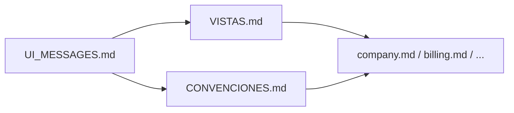
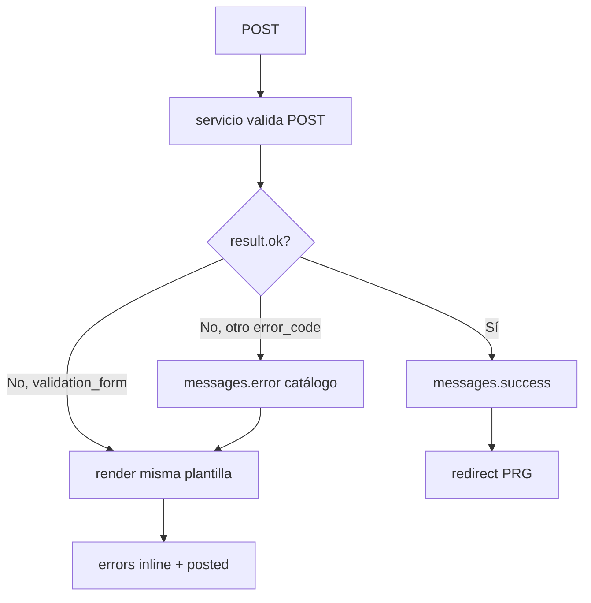

# DynamicWorkspace — Catálogo de mensajes de operación (UI)

Textos y reglas de feedback al usuario tras operaciones CRUD, búsqueda, permisos y licencia.

> **Regla obligatoria:** al implementar vistas (`views.py`), servicios (`services/`) y plantillas (`templates/`), seguir este documento junto con [`VISTAS.md`](VISTAS.md) y [`CONVENCIONES.md`](CONVENCIONES.md). No improvisar textos ni canales (modal vs inline). El código (`OperationResult`, mapas de `error_code`) se implementará al iniciar desarrollo; **las reglas ya aplican desde ahora**.

**Complementa:** [`VISTAS.md`](VISTAS.md) §8, §10.7, §11 · [`CONVENCIONES.md`](CONVENCIONES.md) §2, §5 · `templates/app_base.html` + `static/js/dw-modals.js`

**Reglas Cursor:** [`.cursor/rules/ui-messages.mdc`](../../.cursor/rules/ui-messages.mdc) · [`.cursor/rules/django-conventions.mdc`](../../.cursor/rules/django-conventions.mdc)

**Origen de referencia:** patrón adaptado del catálogo de mensajes del proyecto hermano CODAS (absorbido en este documento).

**Estado:** reglas y catálogo **aprobados** (documentación). Código en `apps.core` / apps de dominio — **pendiente hasta inicio de desarrollo**.

---

## 0. Mapa de documentos



| Al crear… | Consultar |
|-----------|-----------|
| Vista POST/GET | `UI_MESSAGES.md` §5, §8 · `VISTAS.md` §8, §11 |
| Servicio de persistencia | `UI_MESSAGES.md` §2, §9 · `CONVENCIONES.md` §2 |
| Template formulario | `UI_MESSAGES.md` §1, §3 · `errors` + `posted` en contexto |
| Template listado / delete | `dwConfirmWarning` §3.3 · `data-dw-delete` |
| Mensaje específico de app | `UI_MESSAGES.md` §3.5+ y doc de la app |
| DMS SourceProfile / TargetProfile / FieldMapping / TransformRules | `UI_MESSAGES.md` §3.8 · [`source_definition.md`](../definition_app_DMS/source_definition.md) · [`target_definition.md`](../definition_app_DMS/target_definition.md) · [`field_mapping.md`](../definition_app_DMS/field_mapping.md) · [`transform_rules.md`](../definition_app_DMS/transform_rules.md) |

---

## 1. Principios

| Principio | Descripción |
|-----------|-------------|
| **Mensaje ≠ detalle técnico** | El usuario ve lenguaje de negocio. SQL, nombres de tablas, `str(exception)` y trazas van solo a **logs** (`logger.exception`). |
| **Un canal de modal** | `django.contrib.messages` → modal `#dw-msg-modal` en `app_base.html` (`error`, `success`, `warning`, `info`). Cola en `dw-modals.js`. |
| **Errores por campo** | Validación en crear/editar: mensajes bajo el input (`errors` en contexto). **No** usar modal como sustituto del detalle por campo. |
| **Modal genérico + campo** | Tras fallo de validación se puede añadir **un** `messages.error` genérico *además* de los errores inline (opcional, ver §3.1). |
| **POST fallido sin redirect** | Si falla validación o persistencia: **re-render** de la misma pantalla con `posted` + `errors`; no redirigir al listado. |
| **POST exitoso (PRG)** | `messages.success` + **redirect** al detalle o listado acordado por la app. |
| **Servicios primero** | La vista delega persistencia al `services/` de la app; el servicio devuelve resultado tipado (futuro `OperationResult`). |
| **Sin `confirm()` nativo** | Acciones destructivas: `dwConfirmWarning()` antes del POST. |
| **Tenant y rol** | Mensajes de permiso y licencia alineados con UA / US / UF y `profile.company`. |

### Diferencia respecto a CODAS

DynamicWorkspace **no usa Django Forms** en Fase 0 (validación manual en servicio + dict `errors`). El flujo equivalente a `form.is_valid()` es `result.ok` / `result.errors` del servicio.

---

## 2. Códigos internos (`error_code`)

Identificadores estables para mapeo en código Python. **No** se muestran al usuario.

| `error_code` | Uso |
|--------------|-----|
| `success` | Operación completada. |
| `validation_form` | Datos POST inválidos (dict `errors` por campo). |
| `validation_model` | `ValidationError` en modelo / `full_clean()`. |
| `duplicate` | Unicidad violada (`name_short`, email, etc.). |
| `not_found` | Registro inexistente o fuera de tenant. |
| `multiple_found` | `MultipleObjectsReturned`. |
| `protected_delete` | `ProtectedError` (FK `PROTECT`). |
| `data_error` | `DataError` (tipo/longitud incompatible). |
| `db_connection` | `OperationalError`. |
| `db_internal` | `ProgrammingError`, `DatabaseError` genérico. |
| `empty_search` | Listado/búsqueda sin filas (informativo). |
| `unauthorized` | Sin permiso (rol o decorador). |
| `session_expired` | Sesión caducada, CSRF inválido o token de seguridad ausente (recarga/AJAX). |
| `subscription_invalid` | Licencia vencida, firma inválida o estado no activo. |
| `business_blocked` | Regla de negocio (compañía inactiva, plan referenciado, etc.). |
| `unexpected` | Excepción no clasificada. |

---

## 3. Catálogo de mensajes al usuario

### 3.1 Crear y actualizar (guardar)

| `error_code` / situación | Tag `messages` | Texto al usuario |
|------------------------|----------------|------------------|
| Guardado correcto (genérico) | `success` | El registro se guardó correctamente. |
| Formulario / POST inválido | `error` | Revise los datos marcados; no se pudo guardar. |
| Validación de modelo | `error` | Los datos no son válidos. Revise los campos indicados. |
| Registro duplicado | `error` | Ya existe un registro con ese identificador. |
| Dato incompatible | `error` | Algún valor no es válido. Revise longitudes y formatos. |
| Error de conexión | `error` | No se pudo completar la operación. Intente más tarde. |
| Error interno al guardar | `error` | Ocurrió un error al guardar. Si persiste, contacte al administrador. |

### 3.2 Lectura y búsqueda

| `error_code` / situación | Tag `messages` | Texto al usuario |
|------------------------|----------------|------------------|
| Registro no encontrado | `error` | No se encontró el registro solicitado. |
| Fuera de tenant (otra compañía) | `error` | No tiene acceso a este recurso. |
| Búsqueda sin resultados (listado vacío tras filtro) | `info` | No hay registros que coincidan con la búsqueda. |
| Varios registros inesperados | `error` | Hay datos inconsistentes para esta consulta. Contacte al administrador. |

> **Nota:** `Http404` en detalle directo puede mostrar página 404 sin modal; en listados con redirect usar `messages.error`.

### 3.3 Eliminar

| `error_code` / situación | Tag `messages` | Texto al usuario |
|------------------------|----------------|------------------|
| Eliminado correcto (genérico) | `success` | El registro se eliminó correctamente. |
| No se puede eliminar (relacionados / PROTECT) | `error` | No se puede eliminar: existen datos asociados que deben resolverse antes. |
| Registro ya eliminado / no existe | `error` | El registro ya no existe o fue eliminado. |

**Confirmación previa (modal `dwConfirmWarning`, no es `messages`):**

| Acción | Texto sugerido |
|--------|----------------|
| Eliminar compañía | ¿Eliminar la compañía «{name_short}»? Esta acción no se puede deshacer. |
| Eliminar plan | ¿Eliminar el plan «{code}»? Las suscripciones activas bloquean el borrado. |
| Eliminar suscripción | ¿Revocar la licencia de «{company}»? Los usuarios perderán acceso a la aplicación. |

### 3.4 Permisos, seguridad y licencia

| `error_code` / situación | Tag `messages` | Texto al usuario |
|------------------------|----------------|------------------|
| Sin permiso (rol) | `error` | No tiene permiso para realizar esta operación. |
| Solo UA (mantenimiento global) | `warning` | Esta función está reservada al administrador de plataforma. |
| Perfil sin compañía | `error` | Su perfil no tiene compañía asignada. |
| Sesión expirada / CSRF inválido (`session_expired`) | `error` | Su sesión ha expirado. Cierre la sesión e inicie sesión de nuevo para continuar. |
| Suscripción vencida | `error` | La licencia de su compañía ha vencido. Contacte a soporte o facturación. |
| Suscripción pendiente de pago | `warning` | La licencia está pendiente de pago. Algunas funciones pueden estar limitadas. |
| Firma de integridad inválida | `error` | La licencia no superó la verificación de integridad. Contacte al administrador. |
| Seguridad incompleta (2FA) | `info` | Complete la configuración de seguridad para continuar. |

> **AJAX / `fetch`:** el texto de `session_expired` se muestra con `dwShowMessage('error', …)` (modal `#dw-msg-modal`). No usar `alert()` ni solo un status inline para este fallo.

### 3.5 Mensajes específicos — `apps.company`

| Situación | Tag | Texto al usuario |
|-----------|-----|------------------|
| Compañía creada | `success` | Compañía creada correctamente. |
| Compañía actualizada | `success` | Compañía actualizada correctamente. |
| Compañía eliminada | `success` | Compañía eliminada correctamente. |
| `name_short` duplicado | (inline `errors.name_short`) | Ya existe una compañía con este código. |
| Eliminar con usuarios/proyectos/suscripción | `error` | No se puede eliminar la compañía: existen usuarios, proyectos o una suscripción activa. |

### 3.6 Mensajes específicos — `apps.billing`

| Situación | Tag | Texto al usuario |
|-----------|-----|------------------|
| Plan creado / actualizado / eliminado | `success` | Plan {acción} correctamente. |
| Suscripción creada / actualizada | `success` | Suscripción registrada correctamente. |
| Pago registrado | `success` | Pago registrado correctamente. |
| Plan con suscripciones (PROTECT) | `error` | No se puede eliminar el plan: tiene suscripciones asociadas. |
| Compañía ya con suscripción (OneToOne) | `error` | Esta compañía ya tiene una suscripción asignada. |
| Pago con suscripción no válida | `error` | Solo se registran pagos en suscripciones activas o pendientes. |
| Más de 3 contactos | (inline) | Máximo 3 contactos de soporte por suscripción. |

### 3.7 Mensajes específicos — `apps.accounts`

Usar §3.4 para permisos y licencia.

| Situación | Tag | Texto al usuario |
|-----------|-----|------------------|
| Usuario US creado (UA) | `success` | Usuario administrador de compañía creado correctamente. |
| Usuario UF creado (US) | `success` | Usuario final creado correctamente. |
| Usuario actualizado | `success` | Usuario actualizado correctamente. |
| Usuario eliminado | `success` | Usuario eliminado correctamente. |
| UA intenta crear UF/UA | `error` | Solo puede crear usuarios tipo US. |
| US intenta crear US/UA | `error` | Solo puede crear usuarios tipo UF en su compañía. |
| UF accede al módulo | `error` | No tiene permiso para realizar esta operación. |
| Email / username duplicado | (inline `errors.email` / `errors.username`) | Ya existe un usuario con este correo o nombre de usuario. |
| Usuario fuera de alcance | `error` | No tiene acceso a este recurso. |

**Aprovisionamiento masivo (pendiente Fase 1+):** ver [`accounts_provisioning.md`](accounts_provisioning.md) — ampliar §3.7 con mensajes por fila/job al implementar.

### 3.8 Mensajes específicos — `apps.dms` (SourceProfile / TargetProfile / FieldMapping / TransformRules / FileIntake)

Fuente funcional: [`../definition_app_DMS/source_definition.md`](../definition_app_DMS/source_definition.md), [`../definition_app_DMS/target_definition.md`](../definition_app_DMS/target_definition.md), [`../definition_app_DMS/field_mapping.md`](../definition_app_DMS/field_mapping.md), [`../definition_app_DMS/transform_rules.md`](../definition_app_DMS/transform_rules.md), [`../definition_app_DMS/file_intake.md`](../definition_app_DMS/file_intake.md).

| Situación | Tag | Texto al usuario |
|-----------|-----|------------------|
| Perfil origen guardado | `success` | Perfil de origen guardado correctamente. |
| Perfil destino guardado | `success` | Perfil de destino guardado correctamente. |
| Campos destino importados desde origen | `success` | Se importaron {n} campos desde el origen. Puede editarlos o eliminarlos antes de continuar. |
| Importar campos sin origen definido | `error` | Defina primero los campos en el perfil de origen. |
| Importar campos sin tipo destino | `error` | Seleccione el tipo de archivo destino (paso 1) antes de importar campos. |
| Mapeo de campos guardado | `success` | Mapeo de campos guardado correctamente. |
| Reglas de transformación guardadas | `success` | Reglas de transformación guardadas correctamente. |
| Validación bloqueante origen | `error` | Revise los datos del perfil de origen. |
| Validación bloqueante destino | `error` | Revise los datos del perfil de destino. |
| Validación bloqueante mapeo | `error` | Revise los datos del mapeo de campos. |
| Validación bloqueante reglas | `error` | Revise los datos de las reglas de transformación. |
| `date`/`datetime` sin formato (origen o destino) | `warning` | Campo «{name}»: se recomienda indicar date_format / datetime_format. |
| Informe sin summary ni row_errors (origen) | `warning` | Con informe habilitado, se recomienda incluir resumen o detalle por fila. |
| Captura fin &lt; inicio (origen) | `error` | La línea de fin debe ser posterior a la de inicio. |
| Destino obligatorio sin mapeo | `warning` / `error` (strict) | Campo destino obligatorio «{name}» sin mapeo ni default_value. |
| Destino / origen sin usar | `warning` | Campo destino/origen «{name}» aún sin mapeo / no se usa. |
| Publicar sin destino completo | `error` | Complete y corrija el perfil de destino antes de publicar. |
| Publicar sin mapeo completo | `error` | Complete y corrija el mapeo de campos antes de publicar. |
| Publicación OK | `success` | Versión v{N} publicada correctamente. Nuevo borrador v{N+1} listo para edición. |
| Sin permiso de edición | `error` | No tiene permiso para editar la definición de origen/destino / el mapeo de campos / las reglas de transformación. |
| Archivo muestra subido | `success` | Archivo muestra subido correctamente. |
| Archivo producción subido | `success` | Archivo de producción subido correctamente. |
| Archivo muestra eliminado | `success` | Archivo muestra eliminado correctamente. |
| Tipo de archivo no permitido | `error` | Tipo de archivo no permitido para este proyecto. |
| Archivo supera límite | `error` | El archivo supera el límite de {size}. |
| Archivo vacío | `error` | El archivo está vacío. |
| Sin versión publicada (ejecución) | `error` | Publique una versión antes de ejecutar. |
| Sin permiso upload muestra / producción | `error` | No tiene permiso para subir archivos muestra / de producción. |
| Preview dry run OK | `success` | Preview generado correctamente. |
| Transformación finalizada | `success` | Transformación finalizada: {n} filas OK… |
| Sin permiso ejecutar | `error` | No tiene permiso para ejecutar transformaciones de este proyecto. |
| Sin archivo de entrada en job | `error` | El job no tiene archivo de entrada subido. |
| Job ya ejecutado | `error` | Este job ya fue ejecutado o está en ejecución. |
| Archivo >50 MB sync | `error` | Archivos mayores a 50 MB requieren ejecución asíncrona (Fase 2). |
| Enlace descarga inválido/expirado | `error` | Enlace de descarga inválido o expirado. / Archivo expirado. |
| Sesión / CSRF en wizard AJAX | `error` | Ver §3.4 `session_expired`. |

> **Advertencias:** no bloquean guardar (modo no strict); en publicar (`strict`) los obligatorios sin mapeo sí bloquean. Se muestran con `dwShowMessage('warning', …)` o `messages.warning` tras PRG.

---

## 4. Qué no mostrar al usuario

- Sentencias SQL, nombres de constraints, tablas o columnas.
- `IntegrityError`, `ProgrammingError` u otras excepciones literales.
- Pilas de excepción Python.
- Valores de `LICENSE_SECRET_KEY`, tokens, HMAC completos.
- Contenido sensible de `DEBUG=True` en producción.

---

## 5. Flujo vista ↔ servicio



### Ejemplo (vista)

```python
result = company_service.create_from_post(request.user, request.POST)
if not result.ok:
    if result.error_code == "validation_form":
        return render(request, "company/company_create.html", {
            "errors": result.errors,
            "posted": request.POST,
        })
    messages.error(request, result.user_message)  # texto del catálogo §3
    return render(request, "company/company_create.html", {
        "posted": request.POST,
    })
messages.success(request, "Compañía creada correctamente.")
return redirect("company:detail", pk=result.company.pk)
```

---

## 6. Implementación técnica

| Componente | Ubicación |
|------------|-----------|
| Modal mensajes | `templates/app_base.html` → `#dw-msg-modal` |
| Cola + variantes | `static/js/dw-modals.js` → `dwShowMessage`, lectura `#dw-flash-messages` |
| Confirmación | `dwConfirmWarning(mensaje, onConfirm, { title, okLabel })` |
| Estilos modal | `static/css/app.css` → `.dw-modal-header--*` |
| Resultado servicio (futuro) | `apps/core/services/operation_result.py` |

### Mapeo tag → modal (`dw-modals.js`)

| Tag Django | Título modal | Estilo |
|------------|--------------|--------|
| `error` | Error | Rojo |
| `success` | Operación exitosa | Verde |
| `warning` | Advertencia | Ámbar |
| `info` | Información | Accent / info |
| (otro) | Mensaje | Neutro |

### Feedback desde JavaScript (AJAX)

| Situación | Canal | Cómo |
|-----------|-------|------|
| Error operativo (guardado, publicar, sesión, permiso) | Modal | `dwShowMessage('error'\|'warning'\|'info'\|'success', textoCatálogo)` |
| Validación por campo en formularios del wizard | Inline | Bajo el input / lista de errores del paso; no sustituir con modal |
| Éxito tras navegación PRG | Modal | `messages.*` → `#dw-flash-messages` → cola al cargar |

Textos literales: solo catálogo §3 (p. ej. `session_expired` en §3.4).

---

## 7. Evolución

| Fase | Alcance | Estado |
|------|---------|--------|
| **Documentación** (actual) | Reglas, catálogo, modales en `app_base.html`, reglas Cursor | **Hecho** |
| **Desarrollo — core** | `OperationResult` + mapa `error_code` → texto en `apps/core/services/` | Pendiente |
| **Desarrollo — piloto** | `apps.company` create / update / delete con contrato de servicio | Pendiente |
| **Desarrollo — rollout** | `apps.billing`, `apps.accounts`, resto de apps CRUD | Pendiente |

> Hasta que exista `OperationResult` en código, los servicios deben **documentar** en su firma el retorno esperado (`ok`, `error_code`, `user_message`, `errors`) y las vistas deben cumplir el flujo §5.

---

## 9. Reglas para servicios (`apps/<app>/services/`)

Obligatorias al implementar persistencia o validación de POST:

| Regla | Detalle |
|-------|---------|
| **Retorno estructurado** | Devolver objeto/dict con al menos `ok: bool`. Incluir `error_code`, `user_message`, `errors` según §2. |
| **Textos del catálogo** | `user_message` debe ser un texto de §3 (genérico o de la app). No `str(exception)`. |
| **`errors` por campo** | Si `error_code == validation_form`, dict `campo → [mensajes]` para el template. |
| **Clasificar excepciones** | `IntegrityError` → `duplicate`; `ProtectedError` → `protected_delete`; etc. (§2). |
| **Logging técnico** | `logger.exception(...)` en `unexpected`, `db_*`; el usuario solo ve §3.1 genérico. |
| **Sin mensajes en modelo** | Los modelos validan; el servicio traduce a `error_code` + texto UI. |
| **Tenant** | Errores de acceso cruzado → `not_found` o `unauthorized` según §3.2 / §3.4 (no revelar existencia ajena). |

### Contrato documentado (implementar en `apps.core` al iniciar desarrollo)

```python
# Referencia — no implementado aún
@dataclass
class OperationResult:
    ok: bool
    error_code: str | None = None      # §2
    user_message: str = ""             # §3 — texto literal al usuario
    errors: dict[str, list[str]] | None = None  # validation_form
    # payload opcional: company, plan, subscription, etc.
```

---

## 8. Checklist por vista

- [ ] ¿Éxito usa `messages.success` + redirect (PRG)?
- [ ] ¿Validación usa `errors` inline sin depender solo del modal?
- [ ] ¿Errores de servicio usan texto del catálogo §3, no `str(e)`?
- [ ] ¿Excepciones técnicas van a `logger.exception`?
- [ ] ¿Eliminar usa `dwConfirmWarning` con texto de §3.3?
- [ ] ¿Permisos y licencia usan mensajes de §3.4?
- [ ] ¿Mensajes específicos de la app documentados en §3.5+?

### Checklist por servicio

- [ ] ¿Retorna `ok` + `error_code` acorde a §2?
- [ ] ¿`user_message` copiado del catálogo §3 (no texto libre ad hoc)?
- [ ] ¿`validation_form` incluye `errors` por campo?
- [ ] ¿Excepciones DB/business mapeadas y logueadas?

## Documentos relacionados

- [`VISTAS.md`](VISTAS.md)
- [`CONVENCIONES.md`](CONVENCIONES.md)
- [`PROTOTIPOS.md`](PROTOTIPOS.md)
- [`company.md`](company.md)
- [`billing.md`](billing.md)
- [`accounts.md`](accounts.md)
- [`core.md`](core.md)
- [`../definition_app_DMS/source_definition.md`](../definition_app_DMS/source_definition.md) — SourceProfile / FilePipe origen (§3.8)
- [`../definition_app_DMS/target_definition.md`](../definition_app_DMS/target_definition.md) — TargetProfile / FilePipe destino (§3.8)
- [`../definition_app_DMS/field_mapping.md`](../definition_app_DMS/field_mapping.md) — FieldMapping / mapeo origen→destino (§3.8)
- [`../definition_app_DMS/transform_rules.md`](../definition_app_DMS/transform_rules.md) — TransformRules / pipeline post-mapeo (§3.8)
- [`../definition_app_DMS/README.md`](../definition_app_DMS/README.md) — índice DMS
- [`.cursor/rules/ui-messages.mdc`](../../.cursor/rules/ui-messages.mdc)
