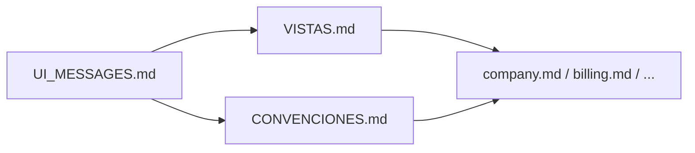
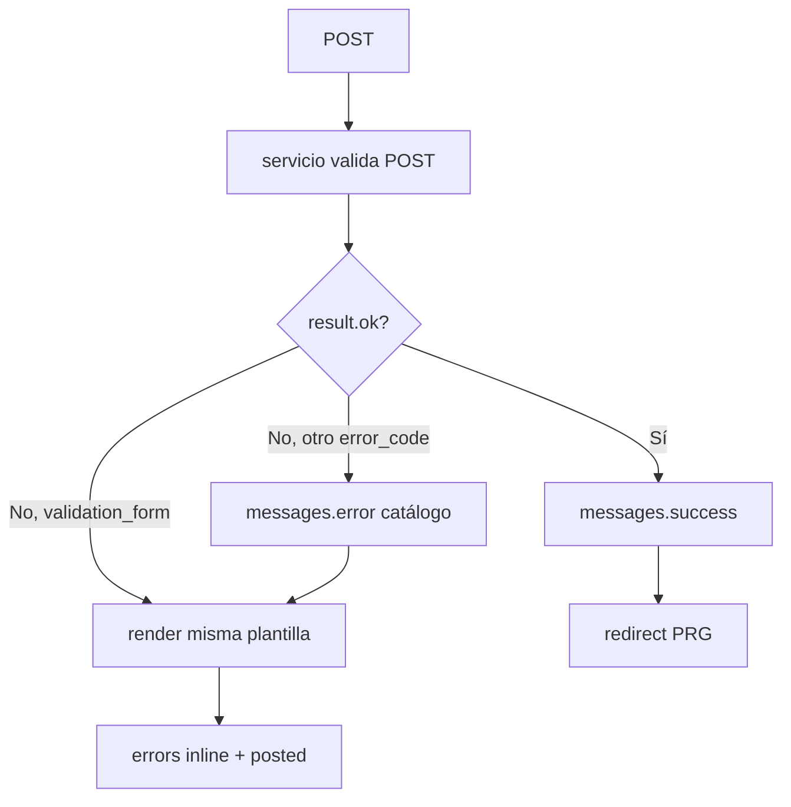

# DynamicWorkspace — Catálogo de mensajes de operación (UI)

Textos y reglas de feedback al usuario tras operaciones CRUD, búsqueda, permisos y licencia.

> **Regla obligatoria:** al implementar vistas (`views.py`), servicios (`services/`) y plantillas (`templates/`), seguir este documento junto con [`VISTAS.md`](VISTAS.md) y [`CONVENCIONES.md`](CONVENCIONES.md). No improvisar textos ni canales (modal vs inline). El código (`OperationResult`, mapas de `error_code`) se implementará al iniciar desarrollo; **las reglas ya aplican desde ahora**.

**Complementa:** [`VISTAS.md`](VISTAS.md) §8, §10.7, §11 · [`CONVENCIONES.md`](CONVENCIONES.md) §2, §5 · `templates/app_base.html` + `static/js/dw-modals.js`

**Reglas Cursor:** [`.cursor/rules/ui-messages.mdc`](../../.cursor/rules/ui-messages.mdc) · [`.cursor/rules/django-conventions.mdc`](../../.cursor/rules/django-conventions.mdc)

**Origen de referencia:** patrón adaptado del catálogo de mensajes del proyecto hermano CODAS (absorbido en este documento).

**Estado:** reglas y catálogo **aprobados** (documentación). Código en `apps.core` / apps de dominio — **pendiente hasta inicio de desarrollo**.

---

## 0. Mapa de documentos


```mermaid
flowchart LR
  UI[UI_MESSAGES.md]
  V[VISTAS.md]
  C[CONVENCIONES.md]
  APP[company.md / billing.md / ...]
  UI --> V
  UI --> C
  V --> APP
  C --> APP
```

| Al crear… | Consultar |
|-----------|-----------|
| Vista POST/GET | `UI_MESSAGES.md` §5, §8 · `VISTAS.md` §8, §11 |
| Servicio de persistencia | `UI_MESSAGES.md` §2, §9 · `CONVENCIONES.md` §2 |
| Template formulario | `UI_MESSAGES.md` §1, §3 · `errors` + `posted` en contexto |
| Template listado / delete | `dwConfirmWarning` §3.3 · `data-dw-delete` |
| Mensaje específico de app | `UI_MESSAGES.md` §3.5+ y doc de la app |
| DMS SourceProfile / TargetProfile / FieldMapping / TransformRules | `UI_MESSAGES.md` §3.8 · [`source_definition.md`](../definition_app_DMS/source_definition.md) · [`target_definition.md`](../definition_app_DMS/target_definition.md) · [`field_mapping.md`](../definition_app_DMS/field_mapping.md) · [`transform_rules.md`](../definition_app_DMS/transform_rules.md) |
| FILE GATE (contrato, políticas, validar, informe, historial, bridge) | `UI_MESSAGES.md` §3.9 · [`../FILE_GATE.md`](../FILE_GATE.md) · [`../definition_app_FILE_GATE/`](../definition_app_FILE_GATE/) |
| FILE MATCH (perfil A, …) | `UI_MESSAGES.md` §3.11 · [`../FILE_MATCH.md`](../FILE_MATCH.md) · [`../definition_app_FILE_MATCH/`](../definition_app_FILE_MATCH/) |
| STRUCTURE SCOUT (ciclo proyecto, …) | `UI_MESSAGES.md` §3.12 · [`../STRUCTURE_SCOUT.md`](../STRUCTURE_SCOUT.md) · [`../definition_app_STRUCTURE_SCOUT/`](../definition_app_STRUCTURE_SCOUT/) |
| PROFILE_SEED (Importar estructura, …) | `UI_MESSAGES.md` §3.13 · [`../PROFILE_SEED.md`](../PROFILE_SEED.md) · [`../definition_app_PROFILE_SEED/`](../definition_app_PROFILE_SEED/) |

---

## 1. Principios

| Principio | Descripción |
|-----------|-------------|
| **Mensaje ≠ detalle técnico** | El usuario ve lenguaje de negocio. SQL, nombres de tablas, `str(exception)` y trazas van solo a **logs** (`logger.exception`). |
| **Un canal de modal** | `django.contrib.messages` → modal `#dw-msg-modal` en `app_base.html` (`error`, `success`, `warning`, `info`). Cola en `dw-modals.js`. |
| **Errores por campo** | Validación en crear/editar: mensajes bajo el input (`errors` en contexto). **No** usar modal como sustituto del detalle por campo. |
| **Modal genérico + campo** | Tras fallo de validación se puede añadir **un** `messages.error` genérico *además* de los errores inline (opcional, ver §3.1). |
| **POST fallido sin redirect** | Si falla validación o persistencia: **re-render** de la misma pantalla con `posted` + `errors`; no redirigir al listado. |
| **POST exitoso (PRG)** | `messages.success` + **redirect** al detalle o listado acordado por la app. |
| **Servicios primero** | La vista delega persistencia al `services/` de la app; el servicio devuelve resultado tipado (futuro `OperationResult`). |
| **Sin `confirm()` nativo** | Acciones destructivas: `dwConfirmWarning()` antes del POST. |
| **Tenant y rol** | Mensajes de permiso y licencia alineados con UA / US / UF y `profile.company`. |

### Diferencia respecto a CODAS

DynamicWorkspace **no usa Django Forms** en Fase 0 (validación manual en servicio + dict `errors`). El flujo equivalente a `form.is_valid()` es `result.ok` / `result.errors` del servicio.

---

## 2. Códigos internos (`error_code`)

Identificadores estables para mapeo en código Python. **No** se muestran al usuario.

| `error_code` | Uso |
|--------------|-----|
| `success` | Operación completada. |
| `validation_form` | Datos POST inválidos (dict `errors` por campo). |
| `validation_model` | `ValidationError` en modelo / `full_clean()`. |
| `duplicate` | Unicidad violada (`name_short`, email, etc.). |
| `not_found` | Registro inexistente o fuera de tenant. |
| `multiple_found` | `MultipleObjectsReturned`. |
| `protected_delete` | `ProtectedError` (FK `PROTECT`). |
| `data_error` | `DataError` (tipo/longitud incompatible). |
| `db_connection` | `OperationalError`. |
| `db_internal` | `ProgrammingError`, `DatabaseError` genérico. |
| `empty_search` | Listado/búsqueda sin filas (informativo). |
| `unauthorized` | Sin permiso (rol o decorador). |
| `session_expired` | Sesión caducada, CSRF inválido o token de seguridad ausente (recarga/AJAX). |
| `subscription_invalid` | Licencia vencida, firma inválida o estado no activo. |
| `business_blocked` | Regla de negocio (compañía inactiva, plan referenciado, etc.). |
| `unexpected` | Excepción no clasificada. |

---

## 3. Catálogo de mensajes al usuario

### 3.1 Crear y actualizar (guardar)

| `error_code` / situación | Tag `messages` | Texto al usuario |
|------------------------|----------------|------------------|
| Guardado correcto (genérico) | `success` | El registro se guardó correctamente. |
| Formulario / POST inválido | `error` | Revise los datos marcados; no se pudo guardar. |
| Validación de modelo | `error` | Los datos no son válidos. Revise los campos indicados. |
| Registro duplicado | `error` | Ya existe un registro con ese identificador. |
| Dato incompatible | `error` | Algún valor no es válido. Revise longitudes y formatos. |
| Error de conexión | `error` | No se pudo completar la operación. Intente más tarde. |
| Error interno al guardar | `error` | Ocurrió un error al guardar. Si persiste, contacte al administrador. |

### 3.2 Lectura y búsqueda

| `error_code` / situación | Tag `messages` | Texto al usuario |
|------------------------|----------------|------------------|
| Registro no encontrado | `error` | No se encontró el registro solicitado. |
| Fuera de tenant (otra compañía) | `error` | No tiene acceso a este recurso. |
| Búsqueda sin resultados (listado vacío tras filtro) | `info` | No hay registros que coincidan con la búsqueda. |
| Varios registros inesperados | `error` | Hay datos inconsistentes para esta consulta. Contacte al administrador. |

> **Nota:** `Http404` en detalle directo puede mostrar página 404 sin modal; en listados con redirect usar `messages.error`.

### 3.3 Eliminar

| `error_code` / situación | Tag `messages` | Texto al usuario |
|------------------------|----------------|------------------|
| Eliminado correcto (genérico) | `success` | El registro se eliminó correctamente. |
| No se puede eliminar (relacionados / PROTECT) | `error` | No se puede eliminar: existen datos asociados que deben resolverse antes. |
| Registro ya eliminado / no existe | `error` | El registro ya no existe o fue eliminado. |

**Confirmación previa (modal `dwConfirmWarning`, no es `messages`):**

| Acción | Texto sugerido |
|--------|----------------|
| Eliminar compañía | ¿Eliminar la compañía «{name_short}»? Esta acción no se puede deshacer. |
| Eliminar plan | ¿Eliminar el plan «{code}»? Las suscripciones activas bloquean el borrado. |
| Eliminar suscripción | ¿Revocar la licencia de «{company}»? Los usuarios perderán acceso a la aplicación. |

### 3.4 Permisos, seguridad y licencia

| `error_code` / situación | Tag `messages` | Texto al usuario |
|------------------------|----------------|------------------|
| Sin permiso (rol) | `error` | No tiene permiso para realizar esta operación. |
| Solo UA (mantenimiento global) | `warning` | Esta función está reservada al administrador de plataforma. |
| Perfil sin compañía | `error` | Su perfil no tiene compañía asignada. |
| Sesión expirada / CSRF inválido (`session_expired`) | `error` | Su sesión ha expirado. Cierre la sesión e inicie sesión de nuevo para continuar. |
| Suscripción vencida | `error` | La licencia de su compañía ha vencido. Contacte a soporte o facturación. |
| Suscripción pendiente de pago | `warning` | La licencia está pendiente de pago. Algunas funciones pueden estar limitadas. |
| Firma de integridad inválida | `error` | La licencia no superó la verificación de integridad. Contacte al administrador. |
| Seguridad incompleta (2FA) | `info` | Complete la configuración de seguridad para continuar. |

> **AJAX / `fetch`:** el texto de `session_expired` se muestra con `dwShowMessage('error', …)` (modal `#dw-msg-modal`). No usar `alert()` ni solo un status inline para este fallo.

### 3.5 Mensajes específicos — `apps.company`

| Situación | Tag | Texto al usuario |
|-----------|-----|------------------|
| Compañía creada | `success` | Compañía creada correctamente. |
| Compañía actualizada | `success` | Compañía actualizada correctamente. |
| Compañía eliminada | `success` | Compañía eliminada correctamente. |
| `name_short` duplicado | (inline `errors.name_short`) | Ya existe una compañía con este código. |
| Eliminar con usuarios/proyectos/suscripción | `error` | No se puede eliminar la compañía: existen usuarios, proyectos o una suscripción activa. |

### 3.6 Mensajes específicos — `apps.billing`

| Situación | Tag | Texto al usuario |
|-----------|-----|------------------|
| Plan creado / actualizado / eliminado | `success` | Plan {acción} correctamente. |
| Suscripción creada / actualizada | `success` | Suscripción registrada correctamente. |
| Pago registrado | `success` | Pago registrado correctamente. |
| Plan con suscripciones (PROTECT) | `error` | No se puede eliminar el plan: tiene suscripciones asociadas. |
| Compañía ya con suscripción (OneToOne) | `error` | Esta compañía ya tiene una suscripción asignada. |
| Pago con suscripción no válida | `error` | Solo se registran pagos en suscripciones activas o pendientes. |
| Más de 3 contactos | (inline) | Máximo 3 contactos de soporte por suscripción. |

### 3.7 Mensajes específicos — `apps.accounts`

Usar §3.4 para permisos y licencia.

| Situación | Tag | Texto al usuario |
|-----------|-----|------------------|
| Usuario US creado (UA) | `success` | Usuario administrador de compañía creado correctamente. |
| Usuario UF creado (US) | `success` | Usuario final creado correctamente. |
| Usuario actualizado | `success` | Usuario actualizado correctamente. |
| Usuario eliminado | `success` | Usuario eliminado correctamente. |
| UA intenta crear UF/UA | `error` | Solo puede crear usuarios tipo US. |
| US intenta crear US/UA | `error` | Solo puede crear usuarios tipo UF en su compañía. |
| UF accede al módulo | `error` | No tiene permiso para realizar esta operación. |
| Email / username duplicado | (inline `errors.email` / `errors.username`) | Ya existe un usuario con este correo o nombre de usuario. |
| Usuario fuera de alcance | `error` | No tiene acceso a este recurso. |

**Aprovisionamiento masivo (pendiente Fase 1+):** ver [`accounts_provisioning.md`](accounts_provisioning.md) — ampliar §3.7 con mensajes por fila/job al implementar.

### 3.8 Mensajes específicos — `apps.dms` (SourceProfile / TargetProfile / FieldMapping / TransformRules / FileIntake)

Fuente funcional: [`../definition_app_DMS/source_definition.md`](../definition_app_DMS/source_definition.md), [`../definition_app_DMS/target_definition.md`](../definition_app_DMS/target_definition.md), [`../definition_app_DMS/field_mapping.md`](../definition_app_DMS/field_mapping.md), [`../definition_app_DMS/transform_rules.md`](../definition_app_DMS/transform_rules.md), [`../definition_app_DMS/file_intake.md`](../definition_app_DMS/file_intake.md).

| Situación | Tag | Texto al usuario |
|-----------|-----|------------------|
| Perfil origen guardado | `success` | Perfil de origen guardado correctamente. |
| Perfil destino guardado | `success` | Perfil de destino guardado correctamente. |
| Campos destino importados desde origen | `success` | Se importaron {n} campos desde el origen. Puede editarlos o eliminarlos antes de continuar. |
| Importar campos sin origen definido | `error` | Defina primero los campos en el perfil de origen. |
| Importar campos sin tipo destino | `error` | Seleccione el tipo de archivo destino (paso 1) antes de importar campos. |
| Mapeo de campos guardado | `success` | Mapeo de campos guardado correctamente. |
| Reglas de transformación guardadas | `success` | Reglas de transformación guardadas correctamente. |
| Validación bloqueante origen | `error` | Revise los datos del perfil de origen. |
| Validación bloqueante destino | `error` | Revise los datos del perfil de destino. |
| Validación bloqueante mapeo | `error` | Revise los datos del mapeo de campos. |
| Validación bloqueante reglas | `error` | Revise los datos de las reglas de transformación. |
| `date`/`datetime` sin formato (origen o destino) | `warning` | Campo «{name}»: se recomienda indicar date_format / datetime_format. |
| Informe sin summary ni row_errors (origen) | `warning` | Con informe habilitado, se recomienda incluir resumen o detalle por fila. |
| Captura fin &lt; inicio (origen) | `error` | La línea de fin debe ser posterior a la de inicio. |
| Destino obligatorio sin mapeo | `warning` / `error` (strict) | Campo destino obligatorio «{name}» sin mapeo ni default_value. |
| Destino / origen sin usar | `warning` | Campo destino/origen «{name}» aún sin mapeo / no se usa. |
| Publicar sin destino completo | `error` | Complete y corrija el perfil de destino antes de publicar. |
| Publicar sin mapeo completo | `error` | Complete y corrija el mapeo de campos antes de publicar. |
| Publicación OK | `success` | Versión v{N} publicada correctamente. Nuevo borrador v{N+1} listo para edición. |
| Sin permiso de edición | `error` | No tiene permiso para editar la definición de origen/destino / el mapeo de campos / las reglas de transformación. |
| Archivo muestra subido | `success` | Archivo muestra subido correctamente. |
| Archivo producción subido | `success` | Archivo de producción subido correctamente. |
| Archivo muestra eliminado | `success` | Archivo muestra eliminado correctamente. |
| Tipo de archivo no permitido | `error` | Tipo de archivo no permitido para este proyecto. |
| Archivo supera límite | `error` | El archivo supera el límite de {size}. |
| Archivo vacío | `error` | El archivo está vacío. |
| Sin versión publicada (ejecución) | `error` | Publique una versión antes de ejecutar. |
| Sin permiso upload muestra / producción | `error` | No tiene permiso para subir archivos muestra / de producción. |
| Preview dry run OK | `success` | Preview generado correctamente. |
| Transformación finalizada | `success` | Transformación finalizada: {n} filas OK… |
| Sin permiso ejecutar | `error` | No tiene permiso para ejecutar transformaciones de este proyecto. |
| Sin archivo de entrada en job | `error` | El job no tiene archivo de entrada subido. |
| Job ya ejecutado | `error` | Este job ya fue ejecutado o está en ejecución. |
| Archivo >50 MB sync | `error` | Archivos mayores a 50 MB requieren ejecución asíncrona (Fase 2). |
| Enlace descarga inválido/expirado | `error` | Enlace de descarga inválido o expirado. / Archivo expirado. |
| Sesión / CSRF en wizard AJAX | `error` | Ver §3.4 `session_expired`. |

> **Advertencias:** no bloquean guardar (modo no strict); en publicar (`strict`) los obligatorios sin mapeo sí bloquean. Se muestran con `dwShowMessage('warning', …)` o `messages.warning` tras PRG.

### 3.9 Mensajes específicos — `apps.file_gate` (FILE GATE)

Fuente funcional: [`../FILE_GATE.md`](../FILE_GATE.md) · [`../definition_app_FILE_GATE/`](../definition_app_FILE_GATE/) (módulos 1–6).  
Código: `apps/file_gate/` · pre-check DMS en `apps/file_gate/bridge/` + `DmsProjectConfig.file_gate_*`.

Códigos adicionales usados en FILE GATE (además de §2):

| `error_code` | Uso |
|--------------|-----|
| `forbidden` | Sin permiso / kind incorrecto (equivalente práctico a `unauthorized`). |
| `gone` | Evidencia o archivo de descarga fuera de TTL / ya no en storage (HTTP 410). |
| `config_invalid` / `gate_not_published` / `no_hash` / `no_matching_job` / `status_not_accepted` / `stale` | Pre-check bridge (HTTP 409 en Ejecutar DMS). |

#### Acceso y proyectos

| Situación | Tag / canal | Texto al usuario |
|-----------|-------------|------------------|
| Sin acceso al proyecto FILE GATE | `error` | No tiene acceso a este proyecto FILE GATE. |
| Solo UF crea proyectos | `error` | Solo usuarios UF pueden crear proyectos FILE GATE. |
| Validación create | `error` + inline | Revise los datos marcados; no se pudo guardar. |
| Slug duplicado | `error` | Ya existe un proyecto con este slug en su compañía. |
| Proyecto creado | `success` | Proyecto FILE GATE creado correctamente. |
| Kind incorrecto (servicio) | `error` | Este proyecto no es de tipo FILE GATE. |

#### Módulo 1 — Contrato / esquema

| Situación | Tag / canal | Texto al usuario |
|-----------|-------------|------------------|
| Contrato guardado (borrador) | `success` | Contrato de validación guardado correctamente. |
| Validación bloqueante al guardar | `error` + inline | Revise los datos del contrato de validación. |
| Sin permiso editar contrato | `error` | No tiene permiso para editar el contrato de este proyecto. |
| JSON de contrato inválido (POST) | `error` | JSON de contrato inválido. |
| Tipo sin editor de campos (paso 4) | `warning` | El tipo de archivo seleccionado aún no tiene editor de campos. Elija txt_fixed, csv, txt_delimited, xlsx, json o xml en el paso 1. |
| Sin permiso publicar | `error` | No tiene permiso para publicar el contrato de este proyecto. |
| Sin borrador | `error` | No hay borrador disponible para publicar. |
| Borrador sin perfil | `error` | El borrador no tiene contrato de validación. |
| Publicar con esquema inválido | `error` + inline | Complete y corrija el contrato antes de publicar. |
| Publicar con política inválida | `error` + inline | Complete y corrija la política de validación antes de publicar. |
| Informe deshabilitado al publicar | `warning` | El informe del gate está deshabilitado; se recomienda dejarlo activo. |
| Publicación OK | `success` | Contrato v{N} publicado correctamente. Nuevo borrador v{N+1} listo para edición. |
| Error al publicar | `error` | Ocurrió un error al publicar. Si persiste, contacte al administrador. |

> Guardar el contrato reutiliza `source_persistence_service.save_source`; el texto anterior aplica cuando `project_kind = file_gate`. En proyectos DMS sigue §3.8 («Perfil de origen…»).

#### Módulo 2 — Políticas

| Situación | Tag / canal | Texto al usuario |
|-----------|-------------|------------------|
| Política guardada | `success` | Política de validación guardada correctamente. |
| Sin permiso editar políticas | `error` | No tiene permiso para editar las políticas de este proyecto. |
| Validación bloqueante | `error` + inline | Revise los datos de la política; no se pudo guardar. |
| JSON de política inválido | `error` | JSON de política inválido. |
| Inline (ejemplos) | — | En el MVP solo se admite la estrategia Recolectar incidencias (collect_all). / El aborto ante error fatal debe permanecer activo. / Indique un máximo de errores entre {min} y {max}. / Seleccione umbral por cantidad o por porcentaje. / El umbral por cantidad debe ser un entero entre 0 y {max}. / El umbral porcentual debe estar entre 0 y 100. |
| Warning umbral 100% | `warning` | Con 100% solo un error fatal o un corte haría fallar el gate. |
| Warning max_errors bajo | `warning` | Un tope muy bajo aumenta la probabilidad de resultado partial. |

#### Módulo 3 — Validar (run)

| Situación | Tag / canal | Texto al usuario |
|-----------|-------------|------------------|
| Sin contrato publicado | `error` | Publique el contrato antes de validar. |
| Sin permiso ejecutar | `error` | No tiene permiso para validar archivos en este proyecto. |
| Sin archivo | `error` + inline | Seleccione un archivo para validar. |
| Extensión no permitida | `error` + inline | La extensión del archivo no coincide con el contrato publicado. |
| Archivo vacío | `error` + inline | El archivo está vacío. |
| Archivo supera límite | `error` + inline | El archivo supera el límite de {size}. |
| Error al guardar upload | `error` | Ocurrió un error al guardar. Si persiste, contacte al administrador. |
| Error técnico del motor | `error` | Ocurrió un error al validar. Si persiste, contacte al administrador. |
| Validación finalizada | `success` | Validación finalizada: {estado} ({rechazadas} de {leídas} filas rechazadas). |
| Job no encontrado | `error` | No se encontró la validación solicitada. |

Estados de `{estado}`: Aprobado · Aprobado con advertencias · Rechazado · Parcial · Error técnico.

#### Módulo 4 — Informe / evidencia / certificado

| Situación | Tag / canal | Texto al usuario |
|-----------|-------------|------------------|
| Sin permiso ver evidencia | `error` | No tiene permiso para ver la evidencia. |
| Sin permiso ver certificado | `error` | No tiene permiso para ver el certificado. |
| Job no final | `warning` | La validación aún no finalizó. |
| Sin permiso descargar | JSON 403 | No tiene permiso para descargar la evidencia de este job. |
| TTL vencido | JSON 410 (`gone`) | La evidencia expiró (TTL de 7 días). Los metadatos del job siguen disponibles. |
| Informe deshabilitado en contrato | JSON 400 | El contrato deshabilitó el informe descargable. |
| Formato no habilitado | JSON 400 | El formato JSON/CSV no está habilitado en el contrato. |
| Sin detalle por fila | JSON 400 | El contrato no incluye detalle de incidencias por fila. |
| Archivo no encontrado | JSON 404 | Archivo de evidencia no encontrado. |
| Archivo ya no en storage | JSON 410 | El archivo de evidencia ya no está disponible. |

#### Módulo 5 — Historial

| Situación | Tag / canal | Texto al usuario |
|-----------|-------------|------------------|
| Sin permiso ver historial | `error` | No tiene permiso para ver el historial de este proyecto. |
| Versión no numérica (filtro) | inline | La versión debe ser un número. |
| Rango de fechas invertido | inline | «Hasta» no puede ser anterior a «Desde». |
| Fecha inválida | inline | Fecha inválida (formato AAAA-MM-DD). |

> Vacío / sin resultados de filtro: copy en plantilla (no `messages`); no son errores.

#### Módulo 6 — Bridge FilePipe

| Situación | Tag / canal | Texto al usuario |
|-----------|-------------|------------------|
| Sin permiso ver bridge (FG) | `error` | No tiene permiso para ver la integración FilePipe. |
| Sin permiso configurar (DMS) | `error` | No tiene permiso para configurar la integración FILE GATE. |
| Solo aplica a DMS | `error` | La integración solo aplica a proyectos FilePipe (DMS). |
| Validación config | `error` + inline | Revise los campos de la integración FILE GATE. |
| Inline proyecto / frescura | — | Elija un proyecto FILE GATE. / Proyecto FILE GATE inválido o de otra compañía. / La frescura debe ser un número ≥ 1. / Política de aceptación inválida. |
| Integración guardada (ON) | `success` | Integración FILE GATE guardada. |
| Integración desactivada (OFF) | `success` | Integración FILE GATE desactivada. FilePipe ejecutará sin pre-check. |
| Aviso tipos distintos (B9) | hint UI | El tipo de archivo del contrato FILE GATE ({gate}) no coincide con el origen DMS ({dms}). |
| Pre-check `config_invalid` | JSON 409 | La integración FILE GATE está mal configurada. Revise el proyecto vinculado. |
| Pre-check `gate_not_published` | JSON 409 | El proyecto FILE GATE no tiene un contrato publicado. Publique el esquema antes de transformar. |
| Pre-check `no_hash` | JSON 409 | El archivo de entrada no tiene hash. Vuelva a subirlo antes de transformar. |
| Pre-check `no_matching_job` | JSON 409 | Valide este archivo en FILE GATE antes de transformar. No hay una corrida aceptada con el mismo contenido. |
| Pre-check `status_not_accepted` | JSON 409 | La última validación FILE GATE de este archivo no está aceptada. Corrija el archivo o revise la evidencia antes de transformar. |
| Pre-check `stale` | JSON 409 | La validación FILE GATE de este archivo expiró por frescura. Vuelva a validarlo en FILE GATE. |

> El pre-check **no** usa bypass (D6). En hub Ejecutar DMS el botón puede ir deshabilitado; el mismo texto aplica si se fuerza el POST.

### 3.10 Mensajes específicos — `apps.reverse_studio` (Reverse Studio)

Fuente funcional: [`../REVERSE_STUDIO.md`](../REVERSE_STUDIO.md) · [`../definition_app_REVERSE/input_definition.md`](../definition_app_REVERSE/input_definition.md) · [`../definition_app_REVERSE/output_definition.md`](../definition_app_REVERSE/output_definition.md) · [`../definition_app_REVERSE/mapping_rules.md`](../definition_app_REVERSE/mapping_rules.md) · [`../definition_app_REVERSE/publish.md`](../definition_app_REVERSE/publish.md) · [`../definition_app_REVERSE/generate_run.md`](../definition_app_REVERSE/generate_run.md) · [`../definition_app_REVERSE/history.md`](../definition_app_REVERSE/history.md) · [`../definition_app_REVERSE/gate_bridge.md`](../definition_app_REVERSE/gate_bridge.md).  
Código: `apps/reverse_studio/` · kind `Project.KIND_REVERSE = "reverse"`.

#### Acceso y proyectos

| Situación | Tag / canal | Texto al usuario |
|-----------|-------------|------------------|
| Sin acceso al proyecto | `error` | No tiene acceso a este proyecto Reverse Studio. |
| Solo UF crea proyectos | `error` | Solo usuarios UF pueden crear proyectos Reverse Studio. |
| Validación create | `error` + inline | Revise los datos marcados; no se pudo guardar. |
| Proyecto creado | `success` | Proyecto Reverse Studio creado correctamente. |
| Solo PA gestiona miembros | `error` | Solo el administrador del proyecto (PA) puede gestionar miembros. |

#### Miembros del proyecto

| Situación | Tag / canal | Texto al usuario |
|-----------|-------------|------------------|
| Invitar / rol / revocar / reactivar | `success` / `error` | Textos del servicio compartido `project_service` (misma compañía, al menos un PA, propietario protegido). |

> La UI de miembros reutiliza `invite_member` / `update_member_role` / `set_member_active` de `apps.projects`. Matriz de roles Reverse: [`../REVERSE_STUDIO.md`](../REVERSE_STUDIO.md) §12.

#### Módulo 1 — Contrato de entrada

| Situación | Tag / canal | Texto al usuario |
|-----------|-------------|------------------|
| Entrada guardada (borrador) | `success` | Contrato de entrada guardado correctamente. |
| Validación bloqueante al guardar | `error` + inline | Revise los datos del contrato de entrada. |
| Sin permiso editar | `error` | No tiene permiso para editar el contrato de este proyecto. |
| JSON inválido (POST) | `error` | JSON de contrato de entrada inválido. |
| Tipo fuera de whitelist (IN3) | `error` + inline | El tipo de planilla no está permitido en Reverse Studio. Use CSV, Excel o TXT delimitado. |
| Tipo sin editor de campos | `warning` | Elija un tipo de planilla permitido (CSV, Excel o TXT delimitado) en el paso 1. |

> Guardar reutiliza `source_persistence_service.save_source`; el texto anterior aplica cuando `project_kind = reverse`. No hay publicar solo-entrada (publicar definición = Módulo 4).

#### Módulo 2 — Contrato de salida

| Situación | Tag / canal | Texto al usuario |
|-----------|-------------|------------------|
| Salida guardada (borrador) | `success` | Contrato de salida guardado correctamente. |
| Validación bloqueante al guardar | `error` + inline | Revise los datos del contrato de salida. |
| Sin permiso editar | `error` | No tiene permiso para editar el contrato de este proyecto. |
| JSON inválido (POST) | `error` | JSON de contrato de salida inválido. |
| Tipo fuera de whitelist (OUT3) | `error` + inline | El tipo de layout no está permitido en Reverse Studio. Use TXT posicional, JSON o XML. |
| Encoding / line ending auto (OUT11) | `error` + inline | La codificación o el final de línea no pueden ser automáticos en el layout de envío. Elija un valor explícito. |
| Tipo sin editor de campos | `warning` | Elija un tipo de layout permitido (TXT posicional, JSON o XML) en el paso 1. |
| Cargar campos desde entrada (OK) | JSON / toast | Campos cargados desde la entrada. |
| Cargar campos desde entrada (error) | JSON | No se pudieron cargar los campos. / mensaje del servicio con «origen»→«entrada». |

> Guardar reutiliza `target_persistence_service.save_target`; el texto anterior aplica cuando `project_kind = reverse`. No hay publicar solo-salida (publicar definición = Módulo 4).

#### Módulo 3 — Mapeo y reglas

| Situación | Tag / canal | Texto al usuario |
|-----------|-------------|------------------|
| Mapeo guardado (borrador) | `success` | Mapeo guardado correctamente. |
| Validación bloqueante mapeo | `error` + inline | Revise los datos del mapeo. |
| Sin permiso editar mapeo | `error` | No tiene permiso para editar el mapeo de este proyecto. |
| JSON mapeo inválido | `error` | JSON de mapeo inválido. |
| Faltan entrada/salida | `warning` | Complete primero el contrato de entrada y el de salida antes de mapear campos. |
| Reglas guardadas | `success` | Reglas guardadas correctamente. |
| Sin permiso editar reglas | `error` | No tiene permiso para editar las reglas de este proyecto. |
| JSON reglas inválido | `error` | JSON de reglas inválido. |
| Sin mapeos para reglas | `warning` | Defina al menos un enlace de mapeo antes de configurar reglas de transformación. |
| Preview fila entrada inválida | `error` | JSON de fila de entrada inválido. |

> Guardar reutiliza `field_mapping_persistence_service` + `transform_rules_persistence_service`. CTA post-mapeo = publicar (M4), no generar.

#### Módulo 4 — Publicar definición

| Situación | Tag / canal | Texto al usuario |
|-----------|-------------|------------------|
| Definición publicada | `success` | Definición v{N} publicada correctamente. Nuevo borrador v{N+1} listo para edición. |
| Sin permiso | `error` | No tiene permiso para publicar la definición de este proyecto. |
| Checklist incompleto / validación | `error` + inline | Complete el contrato de entrada/salida… / Revise el mapeo… / Corrija las reglas… |
| Whitelist entrada/salida | `error` | Mensajes IN3 / OUT3 / OUT11 al publicar. |
| Error inesperado | `error` | Ocurrió un error al publicar. Si persiste, contacte al administrador. |

> Motor: `publish_service.publish_definition` → `version_publish_service.publish_draft_version` + preflight Reverse.

#### Módulo 5 — Generar archivo de envío

| Situación | Tag / canal | Texto al usuario |
|-----------|-------------|------------------|
| Planilla subida | `success` / JSON | Planilla subida correctamente. |
| Vista previa OK | `success` / JSON | Preview generado correctamente. |
| Archivo generado | `success` / JSON | Archivo de envío generado: {n} filas OK… |
| Sin versión publicada | vacío UX | Publique una definición (bloqueo hub + CTA). |
| Sin permiso generar | `error` / JSON | No tiene permiso para generar archivos de envío en este proyecto. |
| Sin planilla en job | `error` / JSON | El job no tiene una planilla subida. |
| Job ya ejecutado | `error` / JSON | Esta generación ya se ejecutó o está en curso. |
| Enlace descarga inválido | `error` / JSON | Enlace de descarga inválido o expirado. |
| Archivo expirado | `error` / JSON | Archivo expirado. |
| Extensión / tamaño | `error` / JSON | Mensajes de file intake DMS (tipo no permitido, tamaño…). |
| Error inesperado generate | `error` / JSON | Ocurrió un error al generar el archivo. Si persiste, contacte al administrador. |
| Sin acceso a recientes | `error` | No tiene acceso al historial de este proyecto. |

> Motor: `file_intake_persistence_service.upload_production` + `execution_service` (dry_run / run_full) vía `apps/reverse_studio/run/`. Descarga solo PA/ED/GE (GEN2). Sin bridge FILE GATE (M7).

#### Módulo 6 — Historial de generaciones

| Situación | Tag / canal | Texto al usuario |
|-----------|-------------|------------------|
| Sin permiso historial | `error` | No tiene permiso para ver el historial de este proyecto. |
| Vacío sin jobs | UX | Sin generaciones registradas + CTA Generar. |
| Filtro sin matches | UX | Sin resultados + limpiar filtros. |
| Fechas invertidas | inline | «Hasta» no puede ser anterior a «Desde». |
| Versión no numérica | inline | La versión debe ser un número. |
| Fecha inválida | inline | Fecha inválida (formato AAAA-MM-DD). |
| Archivo expirado (detalle) | hint | Archivo expirado… regenere desde Generar. |
| Enlace descarga inválido | `error` / JSON | Enlace de descarga inválido o expirado. (M5) |
| Archivo expirado (HTTP) | `error` / JSON | Archivo expirado. (M5) |

> Motor: `apps/reverse_studio/history/` sobre `DmsExecutionJob`. Descargas reutilizan rutas M5. CO solo metadatos (HIS5).

#### Módulo 7 — Integración FILE GATE

| Situación | Tag / canal | Texto al usuario |
|-----------|-------------|------------------|
| Integración guardada (ON) | `success` | Integración FILE GATE guardada. |
| Integración desactivada | `success` | Integración FILE GATE desactivada. Generar funcionará sin pre-check. |
| Sin permiso configurar | `error` | No tiene permiso para configurar la integración FILE GATE. |
| Validación form bridge | `error` + inline | Revise los campos de la integración FILE GATE. |
| Gate no publicado | `error` / JSON 409 | El proyecto FILE GATE no tiene un contrato publicado. Publique el esquema antes de generar. |
| Planilla sin hash | `error` / JSON 409 | La planilla no tiene hash. Vuelva a subirla antes de generar. |
| Sin corrida matching | `error` / JSON 409 | Valide esta planilla en FILE GATE antes de generar… |
| Estado no aceptado | `error` / JSON 409 | La última validación FILE GATE de esta planilla no está aceptada… |
| Frescura vencida | `error` / JSON 409 | La validación FILE GATE de esta planilla expiró por frescura… |
| Config inválida | `error` / JSON 409 | La integración FILE GATE está mal configurada. Revise el proyecto vinculado. |

> Motor: `dms_bridge_service` (kind DMS + Reverse) vía `apps/reverse_studio/bridge/`. Pre-check enganchado en `run_full_job` (M5).

### 3.11 Mensajes específicos — `apps.file_match` (FILE MATCH)

Mensajes de usuario para el Conciliador. Alineados a [`../FILE_MATCH.md`](../FILE_MATCH.md) y [`../definition_app_FILE_MATCH/`](../definition_app_FILE_MATCH/).

#### Proyectos / miembros

| Situación | Tag / canal | Texto al usuario |
|-----------|-------------|------------------|
| Sin acceso al proyecto | `error` | No tiene acceso a este proyecto FILE MATCH. |
| Solo UF crea proyectos | `error` | Solo usuarios UF pueden crear proyectos FILE MATCH. |
| Proyecto creado | `success` | Proyecto FILE MATCH creado correctamente. |
| Solo PA gestiona miembros | `error` | Solo el administrador del proyecto (PA) puede gestionar miembros. |

> La UI de miembros reutiliza `invite_member` / `update_member_role` / `set_member_active` de `apps.projects`.

#### Módulo 1 — Perfil A

| Situación | Tag / canal | Texto al usuario |
|-----------|-------------|------------------|
| Perfil A guardado (borrador) | `success` | Perfil A guardado correctamente. |
| Sin permiso editar | `error` | No tiene permiso para editar el contrato de este proyecto. |
| Validación formulario | `error` + inline | Revise los datos del perfil A. |
| JSON inválido | `error` / JSON | JSON de perfil A inválido. |
| Tipo fuera de whitelist (A3) | `error` + inline | El tipo de archivo no está permitido en FILE MATCH (perfil A). Use CSV, Excel, TXT delimitado, TXT posicional, JSON o XML. |
| Tipo no editable en paso 4 | `warning` | Elija un tipo de archivo permitido (CSV, Excel, TXT delimitado, TXT posicional, JSON o XML) en el paso 1. |

> Guardar el perfil A reutiliza `source_persistence_service.save_source` cuando `project_kind = file_match`. Slot actual: `DmsSourceProfile` de la versión con `config.match_side = "A"`. No hay publish solo-A (Módulo 4).

#### Módulo 2 — Perfil B

| Situación | Tag / canal | Texto al usuario |
|-----------|-------------|------------------|
| Perfil B guardado (borrador) | `success` | Perfil B guardado correctamente. |
| Sin permiso editar | `error` | No tiene permiso para editar el contrato de este proyecto. |
| Validación formulario | `error` + inline | Revise los datos del perfil B. |
| JSON inválido | `error` / JSON | JSON de perfil B inválido. |
| Tipo fuera de whitelist (B3) | `error` + inline | El tipo de archivo no está permitido en FILE MATCH (perfil B). Use CSV, Excel, TXT delimitado, TXT posicional, JSON o XML. |
| Tipo no editable en paso 4 | `warning` | Elija un tipo de archivo permitido (CSV, Excel, TXT delimitado, TXT posicional, JSON o XML) en el paso 1. |
| Kind incorrecto | `error` | Este proyecto no es de tipo FILE MATCH. |
| A incompleto (aviso hub) | hint UI | Recomendado: complete el perfil A antes de definir el B. |
| Copiar A→B OK | `success` | Estructura del Perfil A copiada al borrador del Perfil B. Revise B y configure las reglas de cruce cuando corresponda. |
| Copiar A→B OK + reglas | `success` | Estructura del Perfil A copiada al borrador B y se propusieron pares 1:1 en Reglas (borrador). Revise clave y campos a comparar. |
| Copiar A→B falló | `error` | No se pudo copiar la estructura desde el Perfil A. Si persiste, contacte al administrador. |
| Copiar A incompleto | `error` | El Perfil A no tiene tipo de archivo y campos suficientes para copiar. Complete el Perfil A e intente de nuevo. |
| Copiar sin permiso | `error` | No tiene permiso para editar el perfil B de este proyecto. |
| Overwrite B (aviso UI) | warning panel | El borrador del Perfil B ya tiene M campos; se sobrescribirán con N del Perfil A. |

> Slot B: modelo `FileMatchSourceB` (`version.match_source_b`) con `config.match_side = "B"`. Persistencia: `profile_b_persistence_service.save_source_b`. Copiar desde A: `copy_from_a_service` (`…/perfil-b/copiar-desde-a/`). No hay publish solo-B (Módulo 4).

#### Módulo 3 — Reglas de cruce

| Situación | Tag / canal | Texto al usuario |
|-----------|-------------|------------------|
| Reglas guardadas | `success` | Reglas de cruce guardadas correctamente. |
| Sin permiso editar | `error` | No tiene permiso para editar el contrato de este proyecto. |
| Validación formulario | `error` + inline | Revise los datos de las reglas de cruce. |
| JSON inválido | `error` / JSON | JSON de reglas de cruce inválido. |
| Sin clave (strict) | `error` + inline | Defina al menos un par de clave A↔B. |
| Par incompleto | `error` + inline | El par de clave/compare #N debe tener campo A y campo B. |
| Campo inexistente | `error`/`warning` + inline | El campo A/B «…» no existe en el perfil A/B. |
| Kind incorrecto | `error` | Este proyecto no es de tipo FILE MATCH. |
| Proponer 1:1 OK | `success` | Se propusieron pares 1:1 por nombre (primer campo como clave). Revise y ajuste. |
| Proponer 1:1 sin homónimos | `error` | No hay campos con el mismo nombre en A y B para proponer pares 1:1. |
| Proponer 1:1 con clave ya definida | `error` | Ya hay clave definida. Borre o edite los pares existentes antes de proponer 1:1. |

> Persistencia: `FileMatchRules` (`version.match_rules`) vía `match_rules_persistence_service.save_rules`. No hay publish solo-reglas (Módulo 4).

#### Módulo 4 — Publicar definición

| Situación | Tag / canal | Texto al usuario |
|-----------|-------------|------------------|
| Publicada OK | `success` / JSON | Definición v{n} publicada correctamente. Nuevo borrador v{m} listo para edición. |
| Checklist incompleto | UX / CTA off | Complete Perfil A, Perfil B y Reglas antes de publicar. |
| Validación A/B/reglas | `error` / JSON | Complete y corrija el perfil A/B / las reglas de cruce antes de publicar. |
| Sin permiso | `error` / JSON | No tiene permiso para publicar la definición de este proyecto. |
| Sin borrador | `error` / JSON | No hay borrador disponible para publicar. |
| Kind incorrecto | `error` | Este proyecto no es de tipo FILE MATCH. |
| Sin acceso | `error` | No tiene acceso a este proyecto FILE MATCH. |
| Inesperado | `error` / JSON | Ocurrió un error al publicar. Si persiste, contacte al administrador. |

> Motor: `publish_service.publish_match_definition` — congela `DmsSourceProfile` (A) + `FileMatchSourceB` + `FileMatchRules`, apunta `current_version` y clona a nuevo borrador. No usa `publish_draft_version` (FilePipe).

#### Módulo 5 — Ejecutar conciliación

| Situación | Tag / canal | Texto al usuario |
|-----------|-------------|------------------|
| Job OK | `success` | Conciliación completada: {veredicto}. |
| Sin versión publicada | `error` / UX | Publique una definición antes de conciliar. |
| Falta archivo A/B | `error` + inline | Seleccione el archivo A / el archivo B. |
| Extensión inválida | `error` + inline | La extensión del archivo A/B no coincide con el perfil publicado. |
| Archivo vacío / tamaño | `error` + inline | El archivo está vacío / supera el límite. |
| Sin permiso ejecutar | `error` | No tiene permiso para ejecutar conciliaciones en este proyecto. |
| Sin permiso descarga | `error` | No tiene permiso para descargar el informe de este proyecto. |
| Parse fatal | `error` | No se pudo leer el archivo A/B. Revise el perfil publicado. |
| Job no encontrado | `error` | No se encontró la conciliación solicitada. |
| Descarga ausente | `error` | El archivo de descarga no está disponible. |
| Kind incorrecto | `error` | Este proyecto no es de tipo FILE MATCH. |
| Inesperado | `error` | Ocurrió un error al conciliar. Si persiste, contacte al administrador. |
| Rechazos de lectura (parcial) | hint / veredicto partial | Hubo N rechazo(s) al leer A/B; el cruce usó solo filas válidas. |

> Motor: `match_run_service.match_and_run` + `match_engine.run_match`. Persistencia: `FileMatchJob`. Parsers DMS ×2. Descargas: JSON informe, CSV diferencias, **CSV/JSON issues de lectura** (`parse_issues.*`). En parse fatal o rechazos parciales se redirige al resultado del job con tabla lado/línea/campo/valor.

#### Módulo 6 — Informe y evidencia

| Situación | Tag / canal | Texto al usuario |
|-----------|-------------|------------------|
| Evidencia expirada | `error` / warning UX | La evidencia de descarga expiró. Los metadatos del job siguen disponibles. |
| Sin permiso evidencia | `error` | No tiene permiso para ver la evidencia. |
| Sin permiso certificado | `error` | No tiene permiso para ver el certificado. |
| Sin permiso descarga | `error` | No tiene permiso para descargar el informe de este proyecto. |
| Job no finalizado | `warning` | La conciliación aún no finalizó. |
| Job no encontrado | `error` | No se encontró la conciliación solicitada. |
| Descarga ausente | `error` | El archivo de descarga no está disponible. |

> Motor: `match_report_service` — evidencia filtrable, ofuscación, certificado ligero, TTL 7 días. Reusa `FileMatchJob` + archivos M5.

#### Módulo 7 — Historial y auditoría

| Situación | Tag / canal | Texto al usuario |
|-----------|-------------|------------------|
| Sin permiso | `error` | No tiene permiso para ver el historial de este proyecto. |
| Fechas invertidas | inline (`date_to`) | «Hasta» no puede ser anterior a «Desde». |
| Versión inválida | inline (`version`) | La versión debe ser un número. |
| Sin conciliaciones | UX vacío | Sin conciliaciones registradas + CTA Ejecutar. |
| Filtro sin resultados | UX | Sin resultados para estos filtros + limpiar filtros. |
| Sin acceso al proyecto | `error` | No tiene acceso a este proyecto FILE MATCH. |
| Corrida eliminada | `success` | Corrida eliminada del historial. |
| Corridas propias eliminadas | `success` | Se eliminaron {n} corridas propias del historial. |
| Sin corridas propias | `error` | No tiene corridas propias para eliminar en este proyecto. |
| Corrida no encontrada | `error` | No se encontró la corrida en este proyecto. |
| No es el ejecutor | `error` | Solo puede eliminar corridas que usted ejecutó. |
| Error al eliminar | `error` | No se pudo eliminar la corrida. Si el problema continúa, contacte al administrador. |

> Motor: `match_history_service` — filtros, paginación 25, badges TTL vía `match_report_service`. Reusa `FileMatchJob` (sin migración). Enlaces a resultado (M5), informe y certificado (M6). Borrado permanente solo de jobs con `executed_by` = usuario actual (fila o «Eliminar mis corridas»).

#### Módulo 8 — Bridge FILE GATE

| Situación | Tag / canal | Texto al usuario |
|-----------|-------------|------------------|
| Sin permiso configurar | `error` | No tiene permiso para configurar la integración FILE GATE. |
| Enabled sin GATE | inline (`file_gate_project_id`) | Elija un proyecto FILE GATE. |
| Enabled sin lados | inline (`file_gate_require_sides`) | Marque al menos «Exigir en A» o «Exigir en B». |
| Guardado OK | `success` | Integración FILE GATE guardada. |
| Desactivado | `success` | Integración FILE GATE desactivada. Conciliar funcionará sin pre-check. |
| Bloqueo sin job (lado) | `error` | Valide el archivo A/B en FILE GATE antes de conciliar. … |
| Estado no aceptado | `error` | La última validación FILE GATE del archivo A/B no está aceptada. … |
| Frescura vencida | `error` | La validación FILE GATE del archivo A/B expiró por frescura. … |
| Gate no publicado | `error` | El proyecto FILE GATE no tiene un contrato publicado. Publique el esquema antes de conciliar. |
| Config inválida | `error` | La integración FILE GATE está mal configurada. Revise el proyecto vinculado. |

> Motor: `match_bridge_service` + `dms_bridge_service.precheck_match_sides`. Config: `DmsProjectConfig.file_gate_*` + `file_gate_require_a` / `_b`. Sello en `FileMatchJob.metrics["file_gate_check"]`.

### 3.12 Mensajes específicos — `apps.structure_scout` (STRUCTURE SCOUT)

Mensajes de usuario para el Explorador de estructura. Alineados a [`../STRUCTURE_SCOUT.md`](../STRUCTURE_SCOUT.md) y [`../definition_app_STRUCTURE_SCOUT/`](../definition_app_STRUCTURE_SCOUT/).

#### Proyectos / miembros (Módulo 1 — lifecycle)

| Situación | Tag / canal | Texto al usuario |
|-----------|-------------|------------------|
| Sin acceso al proyecto | `error` | No tiene acceso a este proyecto Explorador. |
| Solo UF crea proyectos | `error` | Solo usuarios UF pueden crear proyectos del Explorador de estructura. |
| Proyecto creado | `success` | Proyecto Explorador de estructura creado correctamente. |
| Solo PA gestiona miembros | `error` | Solo el administrador del proyecto (PA) puede gestionar miembros. |

> La UI de miembros reutiliza `invite_member` / `update_member_role` / `set_member_active` de `apps.projects`. Visibilidad vía `DmsProjectConfig`.

#### Módulo 2 — Cargar muestra

| Situación | Tag / canal | Texto al usuario |
|-----------|-------------|------------------|
| Muestra subida | `success` / JSON | Muestra subida correctamente. |
| Muestra eliminada | `success` / JSON | Muestra eliminada. |
| Sin permiso subir | `error` / JSON 403 | No tiene permiso para subir muestras en este proyecto. |
| Sin permiso eliminar | `error` / JSON 403 | No tiene permiso para eliminar muestras en este proyecto. |
| Sin permiso preview (CO) | `error` / JSON 403 | No tiene permiso para ver el preview de la muestra. |
| Tipo no permitido | `error` + inline / JSON | Tipo de archivo no permitido. Use CSV, Excel o TXT. |
| Archivo vacío | `error` + inline / JSON | El archivo está vacío. |
| Tamaño &gt; 10 MB | `error` + inline / JSON | El archivo supera el límite de 10 MB para muestras. |
| Muestra no encontrada | `error` / JSON 404 | Archivo muestra no encontrado. |
| Error inesperado | `error` + log | Ocurrió un error al subir la muestra. Si persiste, contacte al administrador. |

> Motor: `sample_upload_service` + `storage_service` / `detection_service` DMS. Persistencia: `DmsSampleFile` (`version=None`). JS: reuso `file_intake.js`.

#### Módulo 3 — Detectar patrón

| Situación | Tag / canal | Texto al usuario |
|-----------|-------------|------------------|
| Sin muestra | `error` / empty UI | Suba una muestra antes de detectar el patrón. |
| Confirmación OK (`draft_ready`) | `success` | Patrón detectado y confirmado. |
| Confirmación OK (`needs_review`) | `warning` | Patrón guardado con revisión pendiente. Revise antes de aplicar a un destino. |
| Re-detectar OK | `success` | Sugerencias actualizadas desde la muestra. |
| Tipo vacío | `error` + inline | Seleccione un tipo de archivo. |
| Delimitado sin delimitador | `error` + inline | Indique el delimitador o cambie el tipo. |
| Header row &lt; 1 | `error` + inline | La fila de encabezado debe ser ≥ 1. |
| Fallo lectura | `error` + log | No se pudo analizar la muestra. Vuelva a subir el archivo. |
| Sin permiso editar | `error` | No tiene permiso para editar el patrón de detección. |
| Sin permiso confirmar | `error` | No tiene permiso para confirmar el patrón de detección. |
| Validación formulario | `error` + inline | Revise los datos del patrón de detección. |
| Sin acceso | `error` | No tiene acceso a este proyecto Explorador. |

> Motor: `detect_pattern_service` + `detection_service` DMS. Persistencia: `ScoutDetectionState`. Roles: PA/ED editan; PA/ED/GE confirman. CO sin preview de filas.

#### Módulo 4 — Campos y tipos

| Situación | Tag / canal | Texto al usuario |
|-----------|-------------|------------------|
| Sin detección | `error` / empty UI | Confirme el patrón de detección antes de proponer campos. |
| Sin muestra | `error` / empty UI | Suba una muestra antes de proponer campos. |
| Confirmación OK (`draft_ready`) | `success` | Campos propuestos y confirmados. |
| Confirmación OK (`needs_review`) | `warning` | Campos guardados con revisión pendiente. Revise tipos antes de guardar el borrador. |
| Re-inferir OK | `success` | Campos vueltos a inferir desde la muestra. |
| Lista vacía | `error` + inline | Agregue al menos un campo. |
| Nombre vacío | `error` + inline | Indique el nombre del campo. |
| Nombre duplicado | `error` + inline | El nombre del campo debe ser único. |
| Tipo inválido | `error` + inline | Seleccione un tipo de contenido válido. |
| Bounds faltantes (`txt_fixed`) | `error` + inline | Indique inicio/fin o longitud de cada campo posicional. |
| Fin &lt; inicio | `error` + inline | El fin debe ser ≥ al inicio. |
| Longitud &lt; 1 | `error` + inline | La longitud debe ser ≥ 1. |
| Solape de rangos | `error` + inline | Hay campos posicionales que se solapan; ajuste inicio/fin. |
| Fallo inferencia | `error` + log | No se pudieron inferir campos desde la muestra. Revise el patrón o la muestra. |
| Sin permiso editar | `error` | No tiene permiso para editar los campos propuestos. |
| Sin permiso confirmar | `error` | No tiene permiso para confirmar los campos. |
| Validación formulario | `error` + inline | Revise los datos de los campos propuestos. |
| Sin acceso | `error` | No tiene acceso a este proyecto Explorador. |

> Motor: `propose_fields_service` (+ bounds Fase 2 `txt_fixed`) + catálogo `FieldContentType` + patrones `source_field_validation_service`. Persistencia: `ScoutFieldsState`. Roles: PA/ED editan; PA/ED/GE confirman. CO sin ejemplos.

#### Módulo 5 — Borrador de estructura

| Situación | Tag / canal | Texto al usuario |
|-----------|-------------|------------------|
| Sin campos confirmados | `error` / empty UI | Confirme los campos propuestos antes de guardar el borrador. |
| Snapshot inconsistente | `error` | No se pudo armar el snapshot. Revise detección y campos. |
| Guardado OK | `success` | Borrador de estructura guardado (versión N). |
| Sin permiso guardar | `error` | No tiene permiso para guardar el borrador de estructura. |
| Sin draft al exportar | `error` | No hay borrador para exportar. Guarde una versión primero. |
| Sin permiso exportar | `error` | No tiene permiso para exportar el borrador. |
| Sin acceso | `error` | No tiene acceso a este proyecto Explorador. |

> Motor: `save_draft_service`. Persistencia: `StructureDraft` (versionado, `is_current`). Payload dual producto + `source`. Roles: PA/ED guardan; GE/CO exportan (CO sin examples).

#### Módulo 6 — Aplicar a destino

| Situación | Tag / canal | Texto al usuario |
|-----------|-------------|------------------|
| Sin draft | `error` / empty UI | Guarde un borrador de estructura antes de aplicar a un destino. |
| Destino no seleccionado | `error` | Seleccione un proyecto destino. |
| Destino no elegible | `error` | No puede aplicar a este destino. Verifique compañía y rol (PA/ED). |
| Apply OK | `success` | Borrador sembrado en el destino. Abra el proyecto para revisar y publicar allí. |
| Apply fail | `error` + log | No se pudo aplicar el borrador al destino. Si persiste, contacte al administrador. |
| Sin permiso aplicar | `error` | No tiene permiso para aplicar el borrador a un destino. |
| Sin acceso | `error` | No tiene acceso a este proyecto Explorador. |

> Motor: `apply_target_service` → `source_persistence_service.save_source` (2 pasos: meta + fields). Auditoría: `ScoutApply`. Destinos MVP: GATE + Reverse. Nunca publica.

#### Módulo 7 — Historial

| Situación | Tag / canal | Texto al usuario |
|-----------|-------------|------------------|
| Sin acceso | `error` | No tiene acceso a este proyecto Explorador. |
| Draft no encontrado | `error` | Versión de borrador no encontrada. |
| Apply no encontrado | `error` | Registro de aplicación no encontrado. |
| Sin permiso exportar | `error` | No tiene permiso para exportar el borrador. |
| Sin eventos | empty UI | Guarde un borrador o aplique a un destino para ver el historial. |

> Motor: `history_service` (solo lectura). Fuentes: `StructureDraft` + `ScoutApply`. Timeline filtrable por tipo. Export por versión: `history_draft_export` → `export_draft_json`.

### 3.13 Mensajes específicos — `apps.profile_seed` (PROFILE_SEED)

Mensajes de usuario para el Sembrador de perfiles. Alineados a [`../PROFILE_SEED.md`](../PROFILE_SEED.md) y [`../definition_app_PROFILE_SEED/`](../definition_app_PROFILE_SEED/).

#### Acceso / Módulo 1 — Hub Importar estructura

| Situación | Tag / canal | Texto al usuario |
|-----------|-------------|------------------|
| Sin acceso al proyecto Match | `error` | No tiene acceso a este proyecto FILE MATCH. |
| Sin permiso importar (no PA/ED, archivado, kind incorrecto) | `error` | No tiene permiso para importar estructuras en este proyecto. |

> Motor M1: `profile_seed_service.user_can_import` / `get_profile_a_seed_context`. URLs host: `file_match:profile_a_seed_hub` / `profile_a_seed_hub_help`. CTA solo si `can_seed_import`.

#### Módulo 2 — Selector de origen

| Situación | Tag / canal | Texto al usuario |
|-----------|-------------|------------------|
| Sin orígenes elegibles | empty UI | No hay orígenes publicados visibles. Publique un esquema en FILE GATE o pida acceso a un proyecto GATE. |
| Origen no elegible / no encontrado | `error` | El origen seleccionado no está disponible o no tiene versión publicada. |
| Kind no soportado | `warning` / empty | Este tipo de origen aún no está disponible para importar. |

> Motor M2: `list_eligible_sources` / `get_source_picker_context`. Lectura: `get_published_version` + `profile_to_dict` (metadata). Visibilidad GATE: `visible_projects_qs`. URLs: `profile_a_seed_picker` / `profile_a_seed_picker_help`.

#### Módulo 3 — Preview y aplicar borrador

| Situación | Tag / canal | Texto al usuario |
|-----------|-------------|------------------|
| Tipo no permitido (whitelist Perfil A) | `error` / warning UI | El tipo de archivo no está permitido en FILE MATCH (perfil A). Use CSV, Excel, TXT delimitado, TXT posicional, JSON o XML. |
| Overwrite (aviso) | warning UI | El borrador del Perfil A ya tiene M campos; se sobrescribirán con N del origen. No se publica la definición Match. |
| Apply OK | `success` | Estructura importada al borrador del Perfil A. Revise y publique la definición Match cuando corresponda. |
| Apply fail | `error` + log | No se pudo importar la estructura. Si persiste, contacte al administrador. |
| Sin origen seleccionado | `error` | Seleccione un origen publicado antes de confirmar. |

> Motor M3: `apply_seed_service.get_apply_preview` / `apply_seed_to_profile_a` → `save_source` (2 pasos) + `ProfileSeedEvent`. Strip `gate_policy`. URLs: `profile_a_seed_apply` / `profile_a_seed_apply_help`.

#### Módulo 4 — Historial de importaciones

| Situación | Tag / canal | Texto al usuario |
|-----------|-------------|------------------|
| Sin eventos | empty UI | Aún no hay importaciones de estructura en este proyecto. |
| Evento no encontrado | `error` | Registro de importación no encontrado. |
| Origen ya no disponible | hint UI | El proyecto origen ya no está disponible; se muestra el slug guardado. |

> Motor M4: `seed_history_service` (solo lectura). URLs: `profile_a_seed_history` / `_detail` / `_help`. Enlace en hub Perfil A.

---

## 4. Qué no mostrar al usuario

- Sentencias SQL, nombres de constraints, tablas o columnas.
- `IntegrityError`, `ProgrammingError` u otras excepciones literales.
- Pilas de excepción Python.
- Valores de `LICENSE_SECRET_KEY`, tokens, HMAC completos.
- Contenido sensible de `DEBUG=True` en producción.

---

## 5. Flujo vista ↔ servicio


```mermaid
flowchart TD
  A[POST] --> B[servicio valida POST]
  B --> C{result.ok?}
  C -->|No, validation_form| D[render misma plantilla]
  D --> E[errors inline + posted]
  C -->|No, otro error_code| F[messages.error catálogo]
  F --> D
  C -->|Sí| G[messages.success]
  G --> H[redirect PRG]
```

### Ejemplo (vista)

```python
result = company_service.create_from_post(request.user, request.POST)
if not result.ok:
    if result.error_code == "validation_form":
        return render(request, "company/company_create.html", {
            "errors": result.errors,
            "posted": request.POST,
        })
    messages.error(request, result.user_message)  # texto del catálogo §3
    return render(request, "company/company_create.html", {
        "posted": request.POST,
    })
messages.success(request, "Compañía creada correctamente.")
return redirect("company:detail", pk=result.company.pk)
```

---

## 6. Implementación técnica

| Componente | Ubicación |
|------------|-----------|
| Modal mensajes | `templates/app_base.html` → `#dw-msg-modal` |
| Cola + variantes | `static/js/dw-modals.js` → `dwShowMessage`, lectura `#dw-flash-messages` |
| Confirmación | `dwConfirmWarning(mensaje, onConfirm, { title, okLabel })` |
| Estilos modal | `static/css/app.css` → `.dw-modal-header--*` |
| Resultado servicio (futuro) | `apps/core/services/operation_result.py` |

### Mapeo tag → modal (`dw-modals.js`)

| Tag Django | Título modal | Estilo |
|------------|--------------|--------|
| `error` | Error | Rojo |
| `success` | Operación exitosa | Verde |
| `warning` | Advertencia | Ámbar |
| `info` | Información | Accent / info |
| (otro) | Mensaje | Neutro |

### Feedback desde JavaScript (AJAX)

| Situación | Canal | Cómo |
|-----------|-------|------|
| Error operativo (guardado, publicar, sesión, permiso) | Modal | `dwShowMessage('error'\|'warning'\|'info'\|'success', textoCatálogo)` |
| Validación por campo en formularios del wizard | Inline | Bajo el input / lista de errores del paso; no sustituir con modal |
| Éxito tras navegación PRG | Modal | `messages.*` → `#dw-flash-messages` → cola al cargar |

Textos literales: solo catálogo §3 (p. ej. `session_expired` en §3.4; FILE GATE en §3.9).

---

## 7. Evolución

| Fase | Alcance | Estado |
|------|---------|--------|
| **Documentación** (actual) | Reglas, catálogo, modales en `app_base.html`, reglas Cursor | **Hecho** |
| **Desarrollo — core** | `OperationResult` + mapa `error_code` → texto en `apps/core/services/` | Pendiente |
| **Desarrollo — piloto** | `apps.company` create / update / delete con contrato de servicio | Pendiente |
| **Desarrollo — rollout** | `apps.billing`, `apps.accounts`, resto de apps CRUD | Pendiente |

> Hasta que exista `OperationResult` en código, los servicios deben **documentar** en su firma el retorno esperado (`ok`, `error_code`, `user_message`, `errors`) y las vistas deben cumplir el flujo §5.

---

## 9. Reglas para servicios (`apps/<app>/services/`)

Obligatorias al implementar persistencia o validación de POST:

| Regla | Detalle |
|-------|---------|
| **Retorno estructurado** | Devolver objeto/dict con al menos `ok: bool`. Incluir `error_code`, `user_message`, `errors` según §2. |
| **Textos del catálogo** | `user_message` debe ser un texto de §3 (genérico o de la app). No `str(exception)`. |
| **`errors` por campo** | Si `error_code == validation_form`, dict `campo → [mensajes]` para el template. |
| **Clasificar excepciones** | `IntegrityError` → `duplicate`; `ProtectedError` → `protected_delete`; etc. (§2). |
| **Logging técnico** | `logger.exception(...)` en `unexpected`, `db_*`; el usuario solo ve §3.1 genérico. |
| **Sin mensajes en modelo** | Los modelos validan; el servicio traduce a `error_code` + texto UI. |
| **Tenant** | Errores de acceso cruzado → `not_found` o `unauthorized` según §3.2 / §3.4 (no revelar existencia ajena). |

### Contrato documentado (implementar en `apps.core` al iniciar desarrollo)

```python
# Referencia — no implementado aún
@dataclass
class OperationResult:
    ok: bool
    error_code: str | None = None      # §2
    user_message: str = ""             # §3 — texto literal al usuario
    errors: dict[str, list[str]] | None = None  # validation_form
    # payload opcional: company, plan, subscription, etc.
```

---

## 8. Checklist por vista

- [ ] ¿Éxito usa `messages.success` + redirect (PRG)?
- [ ] ¿Validación usa `errors` inline sin depender solo del modal?
- [ ] ¿Errores de servicio usan texto del catálogo §3, no `str(e)`?
- [ ] ¿Excepciones técnicas van a `logger.exception`?
- [ ] ¿Eliminar usa `dwConfirmWarning` con texto de §3.3?
- [ ] ¿Permisos y licencia usan mensajes de §3.4?
- [ ] ¿Mensajes específicos de la app documentados en §3.5+ (FILE GATE → §3.9)?

### Checklist por servicio

- [ ] ¿Retorna `ok` + `error_code` acorde a §2?
- [ ] ¿`user_message` copiado del catálogo §3 (no texto libre ad hoc)?
- [ ] ¿`validation_form` incluye `errors` por campo?
- [ ] ¿Excepciones DB/business mapeadas y logueadas?

## Documentos relacionados

- [`VISTAS.md`](VISTAS.md)
- [`CONVENCIONES.md`](CONVENCIONES.md)
- [`PROTOTIPOS.md`](PROTOTIPOS.md)
- [`company.md`](company.md)
- [`billing.md`](billing.md)
- [`accounts.md`](accounts.md)
- [`core.md`](core.md)
- [`../definition_app_DMS/source_definition.md`](../definition_app_DMS/source_definition.md) — SourceProfile / FilePipe origen (§3.8)
- [`../definition_app_DMS/target_definition.md`](../definition_app_DMS/target_definition.md) — TargetProfile / FilePipe destino (§3.8)
- [`../definition_app_DMS/field_mapping.md`](../definition_app_DMS/field_mapping.md) — FieldMapping / mapeo origen→destino (§3.8)
- [`../definition_app_DMS/transform_rules.md`](../definition_app_DMS/transform_rules.md) — TransformRules / pipeline post-mapeo (§3.8)
- [`../definition_app_DMS/README.md`](../definition_app_DMS/README.md) — índice DMS
- [`../FILE_GATE.md`](../FILE_GATE.md) — producto FILE GATE (§3.9)
- [`../definition_app_FILE_GATE/README.md`](../definition_app_FILE_GATE/README.md) — definición módulos 1–6 (§3.9)
- [`.cursor/rules/ui-messages.mdc`](../../.cursor/rules/ui-messages.mdc)
