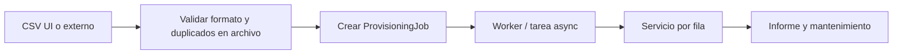

# apps.accounts — Aprovisionamiento masivo de usuarios UF

Carga masiva de usuarios **UF** por **US** (misma compañía), vía archivo CSV o integración externa. Complementa el CRUD manual definido en [`accounts.md`](accounts.md).

**Estado:** **Pendiente** — no bloquea Fase 0 (CRUD manual, security, company, billing).  
**Fase prevista:** **1+** (tras CRUD `accounts` y wizard de seguridad estables).

---

## Propósito

Permitir que un **User System** registre muchos **User Final** de su compañía sin alta uno a uno, manteniendo:

- Aislamiento por tenant (`profile.company`).
- Mismas reglas de tipo (`UF` fijado por el sistema).
- Onboarding de seguridad **diferido** (el usuario completa correo + TOTP al ingresar).
- Trazabilidad por archivo y por fila (mantenimiento / auditoría).

**No** sustituye a `apps.imports` (Excel → campos/registros de **proyecto**). Ver [`imports.md`](imports.md).

---

## Alcance v1

| Incluye | No incluye (v1) |
|---------|------------------|
| Alta masiva **UF** por **US** | Batch **US** por UA (plantilla distinta; pendiente decisión) |
| Baja masiva (`deactivate`) UF de la compañía | Actualización masiva de email/nombre |
| Subida CSV desde UI | Carpeta vigilada / SFTP (Fase 2 integración) |
| Job asíncrono + informe por fila | Envío masivo de correos en el job |
| Contraseña temporal generada por el sistema | Contraseña en el archivo CSV |

---

## Actores y permisos

| Actor | Operación | Alcance |
|-------|-----------|---------|
| **US** | `create` / `deactivate` UF | Solo `request.user.profile.company` |
| **UA** | — | Sin acceso a este flujo en v1 |
| **UF** | — | Sin acceso |
| **Sistema** (futuro) | Lectura carpeta/API | Cuenta de servicio + auditoría |

`user_type` y `company` **no** vienen en el CSV del US; el servicio los impone (`UF` + compañía del US).

---

## Onboarding y acceso

El job **solo persiste datos básicos** (username, email, nombre, apellido, contraseña temporal). **No** dispara correo ni TOTP.

```
Job crea User + UserProfile
  → user_type=UF, company=fija
  → email_confirmed=False, tfa_verified=False, primer_acceso_completado=False
  → contraseña temporal (fórmula § Contraseña temporal)
  → SIN envío Resend en el job

Usuario ingresa después
  → wizard existente (credenciales → correo → TOTP → bienvenida)
  → al completar ciclo: cambio de contraseña obligatorio
  → can_access_app solo con is_security_complete
  → sin proyectos hasta entonces
```

Alineado con [`../security/SEGURIDAD_Y_ACCESOS.md`](../security/SEGURIDAD_Y_ACCESOS.md) y `UserProfile.is_security_complete`.

---

## Contraseña temporal

Generada por el **servicio** al procesar cada fila de alta. **Nunca** en el CSV ni en carpetas compartidas sin cifrar.

### Fórmula v1

```
{first_name}{primera_letra_apellido}{ultima_letra_apellido}{YYYYMMDD}
```

Ejemplo: `Juan` + `Pérez`, alta el 2026-07-04 → `JuanPz20260704`

### Reglas de implementación

| Caso | Regla propuesta |
|------|-----------------|
| Espacios en nombres | `strip()` antes de componer |
| Apellido vacío o una letra | Rechazar fila (`validation_form`) o fallback documentado al implementar |
| Tildes / ñ | Usar caracteres Unicode tal cual en la contraseña |
| Tras ciclo de seguridad | Forzar cambio de contraseña; no conservar temporal |

---

## Formato CSV v1

UTF-8, separador coma, primera fila = cabecera obligatoria. Versión por **nombre de plantilla** y validador (no metadata obligatoria dentro del archivo).

### Plantillas

| Archivo plantilla | Operación |
|-------------------|-----------|
| `DW_UF_CREATE_v1.csv` | Alta UF |
| `DW_UF_DEACTIVATE_v1.csv` | Baja / inactivación UF |

### CREATE — columnas

```csv
username,email,first_name,last_name
juan.perez,juan.perez@acme.demo,Juan,Pérez
laura.gomez,laura.gomez@acme.demo,Laura,Gómez
```

| Columna | Obligatorio | Validación |
|---------|-------------|------------|
| `username` | Sí | Único en sistema y en archivo |
| `email` | Sí | Formato válido; único en sistema y en archivo |
| `first_name` | Sí | Requerido para contraseña temporal |
| `last_name` | Sí | Requerido para contraseña temporal |

**Prohibido en CSV:** `password`, `user_type`, `company`, `is_active`.

### DEACTIVATE — columnas

```csv
identifier_type,identifier_value,reason
username,juan.perez,Baja según nómina jul-2026
email,laura.gomez@acme.demo,
```

| Columna | Obligatorio | Valores |
|---------|-------------|---------|
| `identifier_type` | Sí | `username` \| `email` |
| `identifier_value` | Sí | UF existente en la misma compañía |
| `reason` | No | Texto libre (auditoría) |

---

## Validaciones

### Pre-scan del archivo (antes de procesar filas)

- Cabecera coincide con plantilla v1.
- **Emails duplicados en el archivo** → marcar filas afectadas (recomendado: desde la 2.ª aparición).
- **Usernames duplicados en el archivo** — igual.

### Por fila (informe parcial; el lote continúa)

| Situación | `error_code` | Notas |
|-----------|--------------|-------|
| Campo obligatorio vacío / email inválido | `validation_form` | |
| Email o username ya en BD | `duplicate` | |
| Email/username duplicado en archivo | `duplicate` | Tras pre-scan |
| Alta OK | `success` | |
| Baja: usuario no existe o no es UF de la compañía | `not_found` | |
| Baja: UF con proyectos/membresías activas | `business_blocked` | **Política pendiente:** ¿solo `is_active=False`? |
| Baja OK | `success` | `User.is_active=False`, `profile.status=I` |

Mensajes UI: ampliar [`UI_MESSAGES.md`](UI_MESSAGES.md) §3.7 al implementar.

---

## Arquitectura prevista

Un **motor de aprovisionamiento**, dos **entradas** (UI primero; carpeta/API después).



### Modelos previstos (al implementar)

Documentar en [`DynamicWorkspace_Model.md`](DynamicWorkspace_Model.md) cuando existan en código.

| Modelo | Descripción |
|--------|-------------|
| `ProvisioningJob` | Cabecera: company, operation, source, file, contadores, status |
| `ProvisioningJobRow` | Detalle: row_number, datos leídos, status, error_code, user_id |

### Servicios (`apps/accounts/services/`)

| Función | Rol |
|---------|-----|
| `create_job_from_upload(actor, file, operation)` | US sube CSV |
| `validate_csv_v1(content, operation)` | Formato + pre-scan |
| `process_job(job_id)` | Worker |
| `provision_row_create(actor, row)` | UF + contraseña temporal |
| `provision_row_deactivate(actor, row)` | Inactivación |
| `list_jobs(company)` | Mantenimiento US |

### URLs previstas

| URL | Acceso | Descripción |
|-----|--------|-------------|
| `/app/admin/usuarios/importar/` | US | Subir CSV + elegir operación |
| `/app/admin/usuarios/importar/plantilla/<op>/` | US | Descarga plantilla v1 |
| `/app/admin/usuarios/importar/jobs/` | US | Listado jobs (mantenimiento) |
| `/app/admin/usuarios/importar/jobs/<id>/` | US | Detalle filas + descarga errores |

---

## Pantalla de mantenimiento

Listado DataTables de jobs de la compañía:

- Fecha, archivo, operación, estado, totales (éxito / error / omitidos).
- Detalle: tabla por fila con `error_code` y mensaje.
- Export CSV de errores: `row_number`, `username`, `email`, `error_code`, `user_message`.

---

## Integración externa (Fase 2+)

| Mecanismo | Notas |
|-----------|-------|
| Carpeta vigilada | Mismo validador → mismo `ProvisioningJob`; en Railway preferir volume/API |
| API REST | `POST` autenticado, idempotencia por `file_hash` |
| SFTP por compañía | ERP legacy |

Sin contraseñas en archivos en carpeta compartida. Compañía por subcarpeta o credencial de sistema.

---

## Pendientes de decisión (antes de código)

| # | Tema | Estado |
|---|------|--------|
| 1 | UA batch US (`DW_US_CREATE_v1`) | Pendiente |
| 2 | Límite de filas por job | En revisión |
| 3 | Rate limit Resend | N/A en job (sin correo al crear); revisar en login |
| 4 | Deactivate con proyectos activos: bloqueo vs `is_active` solo | Pendiente |
| 5 | Duplicados en archivo: ¿todas las filas repetidas o solo 2.ª+? | Recomendado: 2.ª en adelante |
| 6 | Apellido vacío / una letra en contraseña temporal | Rechazar fila en v1 |

---

## Fases de implementación

| Fase | Entregable |
|------|------------|
| **0** | CRUD manual UF/US (actual) — **no depende de este doc** |
| **1** | CSV create + deactivate UI, job, mantenimiento, plantillas v1 |
| **2** | API o ingesta por carpeta/SFTP |
| **3** | Batch US por UA (si se aprueba), sync HR |

---

## Dependencias

- [`accounts.md`](accounts.md) — CRUD, `management_scope`, matriz UA/US/UF
- [`security.md`](security.md) / [`../security/SEGURIDAD_Y_ACCESOS.md`](../security/SEGURIDAD_Y_ACCESOS.md) — wizard post-alta
- [`UI_MESSAGES.md`](UI_MESSAGES.md) — `error_code` y textos
- [`company.md`](company.md) — tenant
- [`projects.md`](projects.md) — política de baja con membresías activas
- [`imports.md`](imports.md) — importación de **registros** (dominio distinto)

## Documentos relacionados

- [`accounts.md`](accounts.md) — app principal y lista de tareas
- [`DynamicWorkspace_Model.md`](DynamicWorkspace_Model.md) — modelos User / UserProfile
- [`VISTAS.md`](VISTAS.md) — vistas delgadas, jobs async

---

*Definición pendiente — `docs/definition_app/accounts_provisioning.md`*
