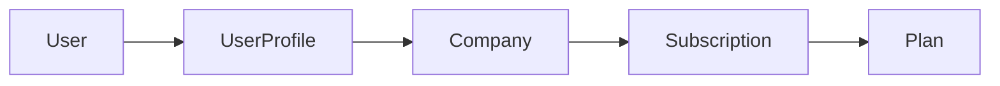

# apps.billing

Planes, suscripciones, contactos y pagos por compañía.

---

## Propósito

Gestionar la **licencia** de cada compañía: vigencia, estado, integridad y historial de cobros. El acceso a `/app/` requiere suscripción válida (salvo UA de plataforma).

---

## Responsabilidades

| Sí | No |
|----|-----|
| Catálogo `Plan` | Datos de compañía (→ `apps.company`) |
| `Subscription` OneToOne por compañía | Usuarios (→ `apps.accounts`) |
| `SubscriptionContact`, `Payment` | Proyectos y registros |
| Validación de licencia (`evaluate_subscription_access`) | Pasarela de pago integrada (Fase 2+) |

---

## Modelos

Detalle completo en [`DynamicWorkspace_Model.md`](DynamicWorkspace_Model.md#plan).

| Modelo | Descripción |
|--------|-------------|
| `Plan` | Catálogo de planes contratables |
| `Subscription` | Licencia de la compañía (OneToOne) |
| `SubscriptionContact` | Contactos de soporte (máx. 3) |
| `Payment` | Auditoría de cobros |

---

## Integración con Company y UserProfile

- **Núcleo:** `Subscription` → **exactamente una** suscripción por compañía (`OneToOneField` → `Company`).
- **Desde código:** `company.subscription` devuelve la `Subscription` o lanza `DoesNotExist`.
- **Flujo de licencia (usuario autenticado):**

```
request.user → user.profile → profile.company → company.subscription
→ evaluate_subscription_access(subscription)
```



---

## Estados de suscripción

| `status` | Descripción |
|----------|-------------|
| `active` | Vigente |
| `expired` | Vencida |
| `canceled` | Cancelada |
| `pending` | Pendiente de pago |

En cada `save()`, si `end_date` < hoy y estado era `active` → pasa a `expired`.

---

## Seguridad de integridad

- Campo `integrity_signature`: HMAC-SHA256 sobre fechas ISO; se recalcula en `save()`.
- Variable de entorno: `LICENSE_SECRET_KEY` (obligatoria en producción).
- No usar `QuerySet.update()` en fechas sin recalcular firma.

---

## API útil (servicios)

| Método | Descripción |
|--------|-------------|
| `generate_signature()` | Genera HMAC |
| `is_signature_valid()` | Verifica firma |
| `validate_license()` | Dict: `signature_valid`, `is_expired`, `status`, `contacts` |
| `evaluate_subscription_access()` | Prioridad: firma → vencimiento → estado activo |

---

## Reglas de negocio

1. Una compañía → una suscripción.
2. `Plan` no se elimina si está referenciado (`PROTECT`).
3. Máximo **3** `SubscriptionContact` por suscripción.
4. `Payment` solo si suscripción en `active` o `pending`.
5. **UA** exento de validación de suscripción (soporte plataforma).
6. **US** y **UF** requieren suscripción vigente para acceder a `/app/`.

---

## URLs previstas

| URL | Acceso | Descripción |
|-----|--------|-------------|
| `/app/admin/billing/planes/` | UA | Catálogo de planes |
| `/app/admin/billing/suscripciones/` | UA | Gestión suscripciones |
| `/app/admin/billing/suscripciones/<company_id>/` | UA | Detalle por compañía |
| `/app/admin/billing/pagos/` | UA | Auditoría de cobros |

---

## Prototipos HTML

Carpeta: `prototype/billing/` · Design system: **workbench ledger** (extiende `company.css`).

| Prototipo | URL prevista | Descripción |
|-----------|--------------|-------------|
| `plan_list.html` | `/app/admin/billing/planes/` | Listado catálogo (DataTables) |
| `plan_create.html` | `/app/admin/billing/planes/nuevo/` | Alta de plan |
| `plan_detail.html` | `/app/admin/billing/planes/<id>/` | Detalle y suscripciones asociadas |
| `plan_update.html` | `/app/admin/billing/planes/<id>/editar/` | Edición de plan |
| `plan_confirm_delete.html` | `/app/admin/billing/planes/<id>/eliminar/` | Confirmación (PROTECT si referenciado) |
| `subscription_list.html` | `/app/admin/billing/suscripciones/` | Listado licencias (DataTables) |
| `subscription_create.html` | `/app/admin/billing/suscripciones/nueva/` | Alta OneToOne por compañía |
| `subscription_detail.html` | `/app/admin/billing/suscripciones/<company_id>/` | Detalle, contactos y pagos |
| `subscription_update.html` | `/app/admin/billing/suscripciones/<company_id>/editar/` | Edición vigencia, estado, contactos |
| `subscription_confirm_delete.html` | `/app/admin/billing/suscripciones/<company_id>/eliminar/` | Confirmación |
| `payment_list.html` | `/app/admin/billing/pagos/` | Auditoría (solo lectura; sin delete) |
| `payment_create.html` | `/app/admin/billing/pagos/nuevo/` | Registrar cobro manual/externo |
| `payment_detail.html` | `/app/admin/billing/pagos/<id>/` | Detalle inmutable |

**Assets:** `billing.css`, `datatables-plan.js`, `datatables-subscription.js`, `datatables-payment.js` (reutiliza `../company/datatables-lang-es.js`).

---

## Mensajes UI (implementación)

Textos obligatorios al desarrollar CRUD: [`UI_MESSAGES.md`](UI_MESSAGES.md) §3.6.

| Operación | Regla |
|-----------|--------|
| Plan / suscripción / pago OK | `messages.success` con texto §3.6 |
| Plan con suscripciones | `error` — PROTECT |
| Compañía ya con suscripción | `error` — OneToOne |
| Pago en suscripción inválida | `error` — solo `active` / `pending` |
| Contactos > 3 | inline en `errors` |
| Eliminar suscripción | `dwConfirmWarning` §3.3 |

---

## Dependencias

- `apps.company` — `Company`
- `apps.core` — configuración `LICENSE_SECRET_KEY`

## Fase

**Fase 0** — fundación (modelos y validación básica).

## Documentos relacionados

- [`DynamicWorkspace_Model.md`](DynamicWorkspace_Model.md)
- [`company.md`](company.md)
- [`accounts.md`](accounts.md)
- [`UI_MESSAGES.md`](UI_MESSAGES.md) — §3.6 mensajes billing
