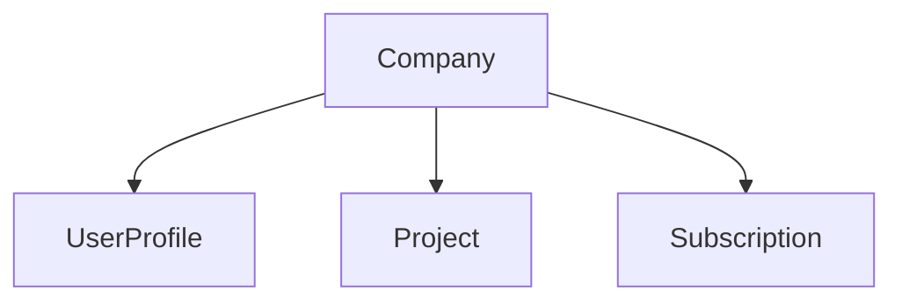

# [apps.company](http://apps.company)

Gestión de compañías (tenant principal del sistema).

---

## Propósito

`Company` es el **modelo raíz de negocio**: agrupa usuarios, proyectos y suscripción. Todo usuario y todo proyecto pertenece a una compañía.

---

## Responsabilidades


| Sí                               | No                                      |
| -------------------------------- | --------------------------------------- |
| CRUD de `Company` (UA)           | Usuarios y perfiles (→ `apps.accounts`) |
| Datos básicos de la organización | Suscripción y pagos (→ `apps.billing`)  |
| Auditoría de alta/modificación   | Proyectos (→ `apps.projects`)           |
| Validación antes de borrado      | Login / 2FA (→ `apps.security`)         |


---


## Modelos

Detalle completo en `[DynamicWorkspace_Model.md](DynamicWorkspace_Model.md#company)`.

### Company


| Campo                       | Tipo                 | Descripción                    |
| --------------------------- | -------------------- | ------------------------------ |
| `id`                        | UUID                 | PK                             |
| `name_short`                | CharField(15)        | Código o sigla única           |
| `name_long`                 | CharField(150)       | Razón social o nombre completo |
| `tax_id`                    | CharField(50), null  | Identificación tributaria      |
| `address`                   | CharField(255), null | Dirección                      |
| `phone`                     | CharField(50), null  | Teléfono                       |
| `email`                     | EmailField, null     | Correo de contacto             |
| `logo`                      | ImageField, null     | Logo (`company_logos/`)        |
| `is_active`                 | BooleanField         | Compañía activa                |
| `created_at` / `updated_at` | DateTimeField        | Auditoría                      |
| `created_by` / `updated_by` | FK User, null        | Auditoría                      |


---


## Relaciones principales




| Relación inversa | Modelo         | Descripción              |
| ---------------- | -------------- | ------------------------ |
| `user_profiles`  | `UserProfile`  | Usuarios de la compañía  |
| `projects`       | `Project`      | Proyectos de la compañía |
| `subscription`   | `Subscription` | Licencia (OneToOne)      |


---


## Reglas de negocio

1. **Todo usuario** creado debe tener `UserProfile.company` asignado (obligatorio).
2. **Todo proyecto** pertenece a una compañía (`Project.company`).
3. Un usuario solo ve proyectos de **su compañía** (salvo UA con acceso global de soporte).
4. No eliminar compañía con usuarios, proyectos o suscripción activa (`PROTECT` / validación en servicio).
5. `name_short` único en todo el sistema.
6. Solo **UA** crea y administra compañías; **US** opera dentro de la compañía asignada, **UF** opera dentro de la compañía asignada.

---


## URLs previstas


| URL                           | Vista            | Acceso |
| ----------------------------- | ---------------- | ------ |
| `/app/admin/compañias/`       | Listado          | UA     |
| `/app/admin/compañias/nueva/` | Crear            | UA     |
| `/app/admin/compañias/<id>/`  | Detalle / editar | UA     |

**Template de referencia:** `templates/company/company_list.html` (extiende `app_base.html`).

---

## Mensajes UI (implementación)

Al desarrollar vistas y servicios de esta app, usar textos de [`UI_MESSAGES.md`](UI_MESSAGES.md) §3.5:

| Operación | `messages` / canal |
|-----------|-------------------|
| Crear / actualizar / eliminar OK | `success` — textos §3.5 |
| `name_short` duplicado | inline `errors.name_short` |
| Borrado bloqueado | `error` — usuarios, proyectos o suscripción activa |
| Confirmar eliminar | `dwConfirmWarning` — §3.3 |

---


## Flujo de acceso (patrón tenant)

```
request.user → user.profile → profile.company → company.subscription
```

Ver `[billing.md](billing.md)` para validación de licencia.

---


## Dependencias

- `apps.core` — decoradores, utilidades
- `apps.billing` — suscripción por compañía


## Fase

**Fase 0** — fundación (junto con accounts y billing).

## Documentos relacionados

- `[DynamicWorkspace_Model.md](DynamicWorkspace_Model.md)`
- `[accounts.md](accounts.md)`
- `[billing.md](billing.md)`
- `[UI_MESSAGES.md](UI_MESSAGES.md)` — §3.5
- `[projects.md](projects.md)`

