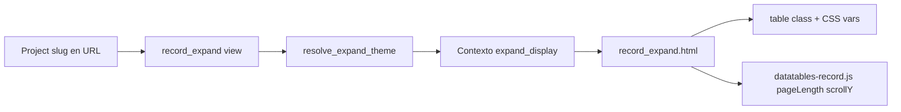

# Registros — Diseño DataTables tipo hoja de cálculo

Guía de referencia para el diseño de la tabla expandida de registros con [DataTables](https://datatables.net/manual/).  
Estado: **diseño aprobado para documentación** — modelo y características dinámicas definidos; implementación según este documento.

Documentos relacionados: [`records.md`](records.md), [`VISTAS.md` §10.6](VISTAS.md#106-tablas-html--datatables), [`fields.md`](fields.md), [`DynamicWorkspace_Model.md`](DynamicWorkspace_Model.md).

---

## Alcance y aislamiento por proyecto

### Pantalla afectada

**Única plantilla:** `templates/records/record_expand.html`  
(`/app/proyectos/<slug>/registros/expandir/`)

No aplica a `record_list.html`, al resto del sistema ni a estilos globales (`app.css`).

### Principio multi-proyecto

Cada `Project` puede tener **su propia configuración de diseño** (10, 20 o más proyectos en la misma compañía). Los cambios en un proyecto **no alteran** a los demás ni al shell global de DynamicWorkspace.

```
Compañía ACME
├── Proyecto "inventarios"     → PA define: cabecera roja, filas gris claro, etc.
├── Proyecto "reglas-sonarq"   → PA define: cabecera gris, cuadrícula Excel, etc.
├── Proyecto "auditoría-2026"  → PA define su propia combinación
└── …
         │
         ▼
  record_expand.html  (lee tema del proyecto activo en la URL)
```

La vista resuelve el tema con `project` del slug en la URL y renderiza clases CSS + variables en el HTML de ese request.

## Propósito

Definir qué capacidades de DataTables (core, estilos y extensiones) conviene usar para que el listado de registros se sienta **amigable y cercano a una hoja de cálculo** (Excel / Google Sheets), aunque el modelo de datos (`Record`, `FieldValue`, `FieldDefinition`) no cambie.

Referencias oficiales:

- [Manual](https://datatables.net/manual/)
- [Styling — clases por defecto](https://datatables.net/manual/styling/classes)
- [Options](https://datatables.net/manual/options)
- [Search](https://datatables.net/manual/search)
- [Índice de extensiones](https://datatables.net/extensions/index)

---

## Estado actual en DynamicWorkspace

Implementación vigente: `templates/records/record_list.html`, `record_expand.html`, `static/js/datatables-record.js`, `static/css/records.css`.

| Ya implementado | Aún no explotado |
|-----------------|------------------|
| DataTables 2 + `layout` (`pageLength`, búsqueda global) | Clases nativas `cell-border`, `stripe`, `compact`, `hover` |
| Filtro custom por campo `select` (`DataTable.ext.search`) | Alineación por tipo de columna (`dt-body-right` para números) |
| Vista `record_expand` (pantalla completa) | Cabecera fija al hacer scroll |
| CSS propio en `app.css` + `records.css` | Cuadrícula tipo Excel (bordes en las 4 caras de cada celda) |
| Columnas dinámicas según `FieldDefinition` | Controles por columna en el header |

La tabla usa `class="dw-datatable"` pero **no** las clases oficiales de DataTables pensadas para aspecto de hoja de cálculo.

---

## Capa 1 — Mejoras inmediatas (sin extensiones, sin backend)

Fuente: [Default styling options](https://datatables.net/manual/styling/classes)

### Clases en el `<table>` (combinables)

| Clase | Efecto tipo Excel | Recomendación para registros |
|-------|-------------------|------------------------------|
| `cell-border` | Borde en los 4 lados de cada celda → cuadrícula | **Clave** para sensación de grilla |
| `compact` | Menos padding, más densidad de filas | Muy útil en inventarios largos |
| `stripe` | Filas alternas (gris/blanco) | Sustituye o refuerza zebra manual |
| `hover` | Resalta la fila bajo el cursor | Familiar para usuarios de Excel |
| `nowrap` | Una línea por celda (sin wrap) | Bueno para códigos y números |
| `order-column` | Resalta la columna ordenada | Orienta al usuario al ordenar |
| `display` | Atajo: `stripe` + `hover` + `row-border` + `order-column` | Buen punto de partida; **no** incluye `cell-border` |

`cell-border` y `row-border` son **mutuamente excluyentes**. Para aspecto Excel conviene **`cell-border`**.

**Propuesta de clase para `#record-table`:**

```html
<table
  id="record-table"
  class="dw-datatable cell-border compact stripe hover order-column nowrap"
>
```

### Alineación por tipo de columna

Fuente: [Cell classes](https://datatables.net/manual/styling/classes) + `columnDefs.className`

| Tipo de campo (`FieldDefinition`) | Clase sugerida |
|-----------------------------------|----------------|
| `integer`, `decimal` | `dt-body-right` + fuente mono |
| `date`, `datetime` | `dt-body-center` |
| `boolean` | `dt-body-center` |
| `text_short`, `text_long` | izquierda (default) |

Generable desde el servidor en `<th>` o vía `columnDefs` en JS según `data-field-type`.

### CSS propio (complemento)

Cabecera con color de “fila de títulos” Excel — wrapper sugerido: `.dw-sheet` en `panel--table`:

```css
/* records.css — concepto */
.dw-sheet table.dataTable thead th {
  background: #e8eef4;
  color: #1a1d21;
  font-weight: 600;
  font-size: 12px;
  border-color: #c5cdd8;
  position: sticky;
  top: 0;
  z-index: 2;
}

.dw-sheet table.dataTable tbody td {
  border-color: #d4d9e0;
  font-size: 13px;
}

.dw-sheet table.dataTable.stripe tbody tr:nth-child(even) td {
  background: #f7f9fb;
}

.dw-sheet table.dataTable tbody tr:hover td {
  background: #e3f2fd;
}
```

El stylesheet oficial de DataTables también admite **variables CSS** para tintar sin romper el tema DW ([manual styling](https://datatables.net/manual/styling)).

### Opciones core útiles

Fuente: [Options](https://datatables.net/manual/options)

| Opción | Uso en registros |
|--------|------------------|
| `scrollY` + `scrollCollapse` | Área de datos con altura fija (ventana tipo Excel) |
| `scrollX` | Muchas columnas dinámicas sin romper el layout |
| `pageLength: 25/50/100` | Menos paginación, más “hoja continua” |
| `layout` ampliado | Barra superior: búsqueda + longitud + botones |
| `stateSave: true` | Recuerda orden, página y búsqueda por usuario |
| `ordering.multi` | Orden por varias columnas (Shift+clic) |
| `search.fixed()` (DT 2) | Reemplazar filtro categoría legacy (`DataTable.ext.search`) |

Fuente búsqueda moderna: [Search — fixed search](https://datatables.net/manual/search)

```javascript
// Ejemplo: filtro por categoría (DT 2)
table.search.fixed('categoria', valorSeleccionado);
table.draw();
```

---

## Capa 2 — Extensiones con alto valor “hoja de cálculo”

Fuente: [Extensions index](https://datatables.net/extensions/index)

### Prioridad alta (UX spreadsheet)

| Extensión | Qué aporta | Encaje con `records` |
|-----------|------------|----------------------|
| [FixedHeader](https://datatables.net/extensions/fixedheader) | Cabecera (y opcional pie) fijos al scroll | Esencial en `record_expand` y tablas altas |
| [FixedColumns](https://datatables.net/extensions/fixedcolumns) | Congela columnas izquierdas con `scrollX` | Primera columna (código/ID) siempre visible |
| [KeyTable](https://datatables.net/extensions/keytable) | Navegación con teclado (↑↓←→, Tab) | Sensación Excel sin editar aún |
| [Select](https://datatables.net/extensions/select) | Selección de filas/celdas (clic, Ctrl, Shift) | Base para acciones masivas y futura edición |
| [ColumnControl](https://datatables.net/extensions/columncontrol) | Filtros y orden en el **header de cada columna** | Muy cercano a autofiltro de Excel |
| [Buttons](https://datatables.net/extensions/buttons) | Export copy/Excel/CSV, imprimir, visibilidad columnas | Exportación Fase 2 en [`records.md`](records.md) |

### Prioridad media (productividad)

| Extensión | Qué aporta |
|-----------|------------|
| [SearchPanes](https://datatables.net/extensions/searchpanes) | Paneles laterales por valor (ej. categoría) |
| [SearchBuilder](https://datatables.net/extensions/searchbuilder) | Filtros compuestos AND/OR |
| [ColReorder](https://datatables.net/extensions/colreorder) | Reordenar columnas arrastrando headers |
| [Scroller](https://datatables.net/extensions/scroller) | Scroll virtual para miles de filas (con server-side) |
| [StateRestore](https://datatables.net/extensions/staterestore) | Guardar varias “vistas” de la tabla |

### Prioridad futura (edición inline)

| Extensión | Qué aporta | Nota |
|-----------|------------|------|
| [AutoFill](https://datatables.net/extensions/autofill) | Arrastrar para rellenar celdas | Típico de Excel |
| [Editor](https://datatables.net/extensions/editor) | Edición inline / multi-fila | Licencia comercial; hoy se usa formulario Django |
| KeyTable + Editor | Spreadsheet editable real | Roadmap ambicioso |

---

## Capa 3 — Propuesta visual “DW Sheet”

### Modo listado (`record_list`)

```
┌─────────────────────────────────────────────────────────┐
│ Stats + acciones (+ Nuevo, Expandir)                    │
├─────────────────────────────────────────────────────────┤
│ [Mostrar 25▾]  [Buscar global…]     [Exportar▾] [Cols▾] │
├─────────────────────────────────────────────────────────┤
│ Código ▾│ Descripción ▾│ Cantidad ▾│ … │ Actualizado   │  ← header coloreado
├────┬────────────┬──────────┬─────┬──────────┬──────────┤
│ A1 │ Tornillo…  │    1 200 │ Rep │     0,45 │ 05/07/26 │  ← cell-border + stripe
├────┼────────────┼──────────┼─────┼──────────┼──────────┤
│ A2 │ Rodamiento │       48 │ Rep │    12,80 │ 05/07/26 │
└────┴────────────┴──────────┴─────┴──────────┴──────────┘
│ Mostrando 1-25 de 412                    ◀ 1 2 3 … ▶    │
└─────────────────────────────────────────────────────────┘
```

### Modo expandido (`record_expand`)

- `FixedHeader` + `scrollY: calc(100vh - 120px)` (o similar)
- Sin sidebar (ya implementado)
- Toolbar mínima: volver + título + búsqueda
- Opcional: `SearchPanes` colapsable a la izquierda

---

## Diseño según esquema dinámico (`FieldDefinition`)

El diseño puede reaccionar al tipo de campo sin cambiar el modelo:

| `field_type` | Tratamiento visual |
|--------------|-------------------|
| `text_short` | Mono, `nowrap`, candidata a columna fija |
| `text_long` | Ancho mayor, tooltip al hover, sin `nowrap` |
| `integer` / `decimal` | `dt-body-right`, separador de miles, decimales según `options` |
| `date` | Formato `dd/mm/yyyy`, centrado |
| `boolean` | Icono ✓/✗ o badge Sí/No centrado |
| `select` | SearchPane o filtro fijo en header |
| Columna Acciones | Fondo distinto o sin cuadrícula (zona UI, no dato) |

La columna **Actualizado** puede ser la ordenación por defecto (`order-column`).

---

## Roadmap sugerido

### Fase A — Solo CSS + clases (rápido, sin licencias)

1. Añadir `cell-border compact stripe hover order-column nowrap` a `#record-table`
2. Wrapper `.dw-sheet` en `panel--table` con CSS de cabecera coloreada
3. `columnDefs` con alineación según `field_type` (`data-*` en `<th>`)
4. Migrar filtro categoría a `table.search.fixed('categoria', value)` (DT 2)
5. Subir `pageLength` por defecto a 25 en registros

**Archivos afectados:** `templates/records/record_list.html`, `record_expand.html`, `static/css/records.css`, `static/js/datatables-record.js`.

### Fase B — Extensiones MIT / uso abierto habitual

1. **FixedHeader** en listado y expand
2. **FixedColumns** (1 columna) + **scrollX** si hay muchos campos
3. **Select** (selección de fila) + estilo de celda activa
4. **KeyTable** (solo navegación; sin editar)

### Fase C — Escala y exportación

1. **Scroller** o **serverSide** para proyectos con muchos registros
2. **Buttons** (copy, excel, csv)
3. **SearchPanes** por campos `select` del esquema
4. **ColumnControl** para autofiltros por columna

### Fase D — Spreadsheet editable (producto)

1. **Editor** o edición celda vía API propia + `record_service`
2. **AutoFill**, validación con `apps/fields/services/validators.py`
3. **StateRestore** para vistas guardadas por usuario

---

## Licencias

- **Core DataTables** y muchas extensiones (Buttons básico, FixedHeader, KeyTable, Select…): uso abierto habitual.
- **Editor**, **SearchBuilder**, **SearchPanes** (completo) y funciones avanzadas: revisar [descargas / licencia](https://datatables.net/download/) antes de comprometer el diseño.

Para MVP “aspecto Excel” **no hace falta Editor**: basta CSS + clases + FixedHeader + alineación por tipo.

---

## Resumen ejecutivo

Lo que más acerca el listado a una hoja de cálculo **sin tocar el modelo**:

1. **`cell-border` + `compact` + `stripe` + `hover`** — cuadrícula y filas alternas
2. **Cabecera con color propio** (`.dw-sheet thead`) — “fila 1 de Excel”
3. **Alineación por tipo de campo** — números a la derecha, fechas centradas
4. **`FixedHeader` + `scrollY`** — especialmente en `record_expand`
5. **`FixedColumns`** en columna código con muchas columnas dinámicas
6. **`ColumnControl` o `SearchPanes`** — filtros en cabecera en lugar de controles sueltos
7. **`KeyTable` + `Select`** — teclado y selección de filas como Excel

---

## Características dinámicas por proyecto (record_expand)

Solo los ítems de esta tabla se **guardan por proyecto** y **cambian el diseño** en `record_expand.html`.

### Colores (variables CSS en wrapper `.dw-sheet`)

| Campo modelo | Variable CSS | Efecto en HTML |
|--------------|--------------|----------------|
| `header_bg` | `--dw-sheet-header-bg` | Fondo de `<thead>` |
| `header_color` | `--dw-sheet-header-color` | Texto de cabecera |
| `header_border` | `--dw-sheet-header-border` | Bordes de celdas de cabecera |
| `cell_border` | `--dw-sheet-cell-border` | Bordes del cuerpo (cuadrícula) |
| `stripe_bg` | `--dw-sheet-stripe-bg` | Fondo filas alternas (`stripe`) |
| `hover_bg` | `--dw-sheet-hover-bg` | Fondo fila al pasar el mouse (`hover`) |

Valores: color hexadecimal `#RRGGBB`. El PA los define **explícitamente** por proyecto.  
Si el proyecto aún no tiene configuración guardada, el sistema aplica un **fallback técnico** (valores por defecto en el servicio), no una “plantilla” elegible por el usuario.

### Clases DataTables (atributo `class` del `<table>`)

| Campo modelo | Clase DataTables | Efecto visual |
|--------------|------------------|---------------|
| `grid_cell_border` | `cell-border` | Cuadrícula Excel (borde en 4 lados) |
| `layout_compact` | `compact` | Menos padding, más densidad |
| `row_stripe` | `stripe` | Filas alternas |
| `row_hover` | `hover` | Resalte de fila bajo cursor |
| `column_order_highlight` | `order-column` | Columna ordenada resaltada |
| `cell_nowrap` | `nowrap` | Sin salto de línea en celdas |

Siempre se incluye la clase base `dw-datatable`.  
`cell-border` y `row-border` son mutuamente excluyentes; para Excel usar solo `cell-border`.

### Comportamiento DataTables (atributos `data-*` / init JS)

| Campo modelo | Opción DT | Efecto |
|--------------|-----------|--------|
| `page_length` | `pageLength` | Filas por página (10–100) |
| — (fijo expand) | `scrollY` | Altura de ventana en modo expandido (no por proyecto en Fase 1) |

### Principio: sin plantillas predefinidas

**No hay presets** (`excel_gray`, `inventory_red`, etc.). Cada proyecto guarda **sus propios valores** en `ProjectRecordsExpandTheme`. El PA configura colores y opciones directamente (formulario o admin).

Los ejemplos de negocio se expresan como **combinaciones de campos**, no como plantillas del sistema:

**Reglas SonarQ** (`reglas-sonarq`) — ejemplo de valores que el PA guardaría:

| Campo | Valor ejemplo |
|-------|---------------|
| `header_bg` | `#e8eef4` |
| `header_color` | `#1a1d21` |
| `stripe_bg` | `#f7f9fb` |
| `grid_cell_border` | `True` |
| `row_stripe` | `True` |

**Inventarios** — ejemplo de valores que el PA guardaría:

| Campo | Valor ejemplo |
|-------|---------------|
| `header_bg` | `#c62828` |
| `header_color` | `#ffffff` |
| `stripe_bg` | `#f5f5f5` |
| `grid_cell_border` | `True` |
| `row_stripe` | `True` |

---

## Qué NO es configuración de diseño por proyecto

Estos aspectos dependen del **esquema** (`FieldDefinition`) o de la lógica de listado, no del tema visual:

| Aspecto | Origen | Pantalla |
|---------|--------|----------|
| Columnas visibles | Campos activos del proyecto | `record_expand` |
| Alineación (`dt-body-right`, etc.) | `field_type` | `<th>` / `<td>` |
| Formato número/fecha | `field_type` + `options` | Celdas |
| Filtro por campo `select` | Si existe en esquema | Toolbar |
| Datos de filas | `Record` / `FieldValue` | `<tbody>` |
| Extensiones DT (KeyTable, Buttons…) | Roadmap global | Futuro |

---

## Modelo Django

**App:** `apps.projects`  
**Relación:** `1:1` con `Project` — cada proyecto tiene cero o un registro de tema. Si no existe, el servicio aplica **defaults técnicos** hasta que el PA configure.

### `ProjectRecordsExpandTheme`

| Campo | Tipo Django | Null | Default | Descripción |
|-------|-------------|------|---------|-------------|
| `id` | `UUIDField` | No | `uuid4` | PK |
| `project` | `OneToOneField` → `Project` | No | — | `on_delete=CASCADE`, `related_name="expand_theme"` |
| `header_bg` | `CharField(7)` | No | `#e8eef4` | Fondo cabecera |
| `header_color` | `CharField(7)` | No | `#1a1d21` | Texto cabecera |
| `header_border` | `CharField(7)` | No | `#c5cdd8` | Borde cabecera |
| `cell_border` | `CharField(7)` | No | `#d4d9e0` | Borde celdas cuerpo |
| `stripe_bg` | `CharField(7)` | No | `#f7f9fb` | Filas alternas |
| `hover_bg` | `CharField(7)` | No | `#e8eef4` | Hover fila |
| `grid_cell_border` | `BooleanField` | No | `True` | Clase `cell-border` |
| `layout_compact` | `BooleanField` | No | `True` | Clase `compact` |
| `row_stripe` | `BooleanField` | No | `True` | Clase `stripe` |
| `row_hover` | `BooleanField` | No | `True` | Clase `hover` |
| `column_order_highlight` | `BooleanField` | No | `True` | Clase `order-column` |
| `cell_nowrap` | `BooleanField` | No | `True` | Clase `nowrap` |
| `page_length` | `PositiveSmallIntegerField` | No | `25` | 10–100 |
| `created_at` | `DateTimeField` | No | `auto_now_add` | — |
| `updated_at` | `DateTimeField` | No | `auto_now` | — |

**Tabla:** `projects_recordsexpandtheme`

> Los `default` de la tabla son solo para migración / proyecto nuevo sin configuración previa. En producción el PA **define y guarda** los valores de su proyecto; no selecciona plantillas.

### Meta (Django)

```python
class Meta:
    verbose_name = "Tema tabla expandida de registros"
    verbose_name_plural = "Temas tabla expandida de registros"
    constraints = [
        models.CheckConstraint(
            condition=models.Q(page_length__gte=10) & models.Q(page_length__lte=100),
            name="projects_expandtheme_page_length_range",
        ),
    ]
```

### Definición de referencia

```python
class ProjectRecordsExpandTheme(models.Model):
    id = models.UUIDField(primary_key=True, default=uuid.uuid4, editable=False)
    project = models.OneToOneField(
        "projects.Project",
        on_delete=models.CASCADE,
        related_name="expand_theme",
    )

    header_bg = models.CharField(max_length=7, default="#e8eef4")
    header_color = models.CharField(max_length=7, default="#1a1d21")
    header_border = models.CharField(max_length=7, default="#c5cdd8")
    cell_border = models.CharField(max_length=7, default="#d4d9e0")
    stripe_bg = models.CharField(max_length=7, default="#f7f9fb")
    hover_bg = models.CharField(max_length=7, default="#e8eef4")

    grid_cell_border = models.BooleanField(default=True)
    layout_compact = models.BooleanField(default=True)
    row_stripe = models.BooleanField(default=True)
    row_hover = models.BooleanField(default=True)
    column_order_highlight = models.BooleanField(default=True)
    cell_nowrap = models.BooleanField(default=True)

    page_length = models.PositiveSmallIntegerField(default=25)

    created_at = models.DateTimeField(auto_now_add=True)
    updated_at = models.DateTimeField(auto_now=True)
```

### Resolución del tema (servicio)

El servicio `resolve_expand_theme(project)`:

1. Carga `ProjectRecordsExpandTheme` del proyecto.
2. Si no existe fila, devuelve los **defaults técnicos** del modelo (misma forma, sin lógica de plantillas).
3. Construye contexto para el template:
   - `table_class_string` — clases del `<table>` según booleanos
   - `css_vars` — colores para variables CSS
   - `page_length` — entero para `data-page-length`

### Flujo hasta `record_expand.html`



Fragmento conceptual del template:

```html
<div class="dw-sheet record-expand-sheet" style="
  --dw-sheet-header-bg: {{ expand_display.header_bg }};
  --dw-sheet-stripe-bg: {{ expand_display.stripe_bg }};
  …
">
  <table id="record-table"
    class="{{ expand_display.table_class_string }}"
    data-page-length="{{ expand_display.page_length }}">
```

### Permisos

| Acción | Rol |
|--------|-----|
| Ver tabla con tema del proyecto | PA, ED, CO, GE (`view`) |
| Crear/editar tema | PA (`user_can_manage_members`) |

Pantalla de configuración prevista: `/app/proyectos/<slug>/registros/expandir/apariencia/` (solo PA).

### Prototipos HTML

| Archivo | Descripción |
|---------|-------------|
| `prototype/records/record_expand_display.html` | Formulario PA — tema Inventario 2026 (cabecera roja) |
| `prototype/records/record_expand_display_sonarq.html` | Mismo formulario — tema Reglas SonarQ (gris cuadrícula) |
| `prototype/records/record-expand-display.js` | Sincroniza colores, checkboxes y vista previa |
| `prototype/records/record_expand.html` | Vista expandida con variables CSS y enlace «Apariencia» |

Sin campo `preset`: el formulario expone directamente los 6 colores, 6 booleanos y `page_length` del modelo `ProjectRecordsExpandTheme`.

### Alternativa descartada: JSONField con `preset`

No se usarán plantillas predefinidas en JSON ni en modelo relacional. Cada proyecto persiste **solo** los campos de la tabla anterior.

---

## Historial

| Fecha | Notas |
|-------|-------|
| 2026-07-06 | Documento inicial — análisis manual DataTables |
| 2026-07-06 | Catálogo de características dinámicas y modelo `ProjectRecordsExpandTheme` |
| 2026-07-06 | Sin presets: el PA define colores y opciones explícitamente por proyecto |
| 2026-07-06 | Prototipos HTML de mantenimiento en `prototype/records/record_expand_display*.html` |
| 2026-07-06 | Implementación: modelo `ProjectRecordsExpandTheme`, servicio `expand_display.py`, templates y migración desde JSONField |
