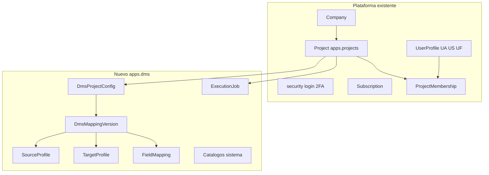

# Integración con DynamicWorkspace

Alineación de **Data Mapping Studio (DMS)** con la plataforma existente: compañías, usuarios, seguridad, proyectos y convenciones Django ya implementadas.

> Estado: borrador en revisión · **SourceProfile MVP en código** ([`source_definition.md`](source_definition.md)).  
> Fuente de verdad plataforma: [`../DynamicWorkspace.md`](../DynamicWorkspace.md), [`../definition_app/DynamicWorkspace_Model.md`](../definition_app/DynamicWorkspace_Model.md).

---

## Principio

DMS **no duplica** tenant, autenticación ni el contenedor de proyecto. Extiende el esquema funcional con una app Django nueva (`apps.dms`) y reutiliza modelos de `apps.projects`, `apps.company`, `apps.accounts` y `apps.security`.



---

## Jerarquía tenant (igual que DynamicWorkspace)

```
Company
 ├── UserProfile (user_type: UA | US | UF)
 ├── Subscription
 └── Project
      ├── [workspace] FieldDefinition → Record → FieldValue
      └── [dms] DmsProjectConfig → DmsMappingVersion → ExecutionJob
```

**Reglas heredadas:**

1. Todo usuario opera dentro de `user.profile.company` (salvo UA soporte).
2. Todo proyecto pertenece a una `Company` (`Project.company`).
3. Acceso a `/app/` requiere seguridad completa + suscripción vigente (US/UF) — ver [`../security/SEGURIDAD_Y_ACCESOS.md`](../security/SEGURIDAD_Y_ACCESOS.md).
4. Sin `ProjectMembership` activa → sin acceso al proyecto DMS.

---

## Tipos de usuario global (`UserProfile.user_type`)

| Tipo | Rol en DMS |
|------|------------|
| **UA** | Administra catálogos de sistema (`system_catalogs.md`); soporte cross-compañía |
| **US** | Gestiona usuarios UF; puede ver proyectos DMS de su compañía según membresía |
| **UF** | Crea proyectos DMS; define mapeos; ejecuta si su rol de proyecto lo permite |

DMS **no introduce** tipos de usuario nuevos. Los permisos granulares de mapeo/ejecución viven en el **rol de proyecto** (`ProjectMembership.role`).

---

## Proyecto: reutilizar `apps.projects.Project`

El documento `project_lifecycle.md` usa nombres conceptuales; en implementación se mapean al modelo existente más una extensión DMS.

### Equivalencia de campos

| Concepto DMS (`project_lifecycle.md`) | Modelo DynamicWorkspace | Notas |
|---------------------------------------|-------------------------|-------|
| `name_short` | `Project.slug` | Único por **compañía** `(company, slug)` — ya definido |
| `name` | `Project.name` | CharField 200 |
| `description` | `Project.description` | TextField |
| `created_by` | `Project.owner` | FK `auth.User` |
| Organización | `Project.company` | FK obligatoria — tenant |
| `is_active` / archivado | `Project.is_archived` | `True` = archivado |
| `visibility` | `DmsProjectConfig.visibility` | **Campo nuevo** — ver abajo |
| Versión publicada activa | `DmsProjectConfig.current_version` | FK → `DmsMappingVersion` |

### Discriminador de tipo de proyecto

| Campo | Ubicación | Valores | Descripción |
|-------|-----------|---------|-------------|
| `project_kind` | `Project` (nuevo) o `DmsProjectConfig` | `workspace` \| `dms` | `workspace` = tabla Excel actual; `dms` = mapping ETL |

**MVP recomendado:** campo `project_kind` en `Project` (default `workspace`). Proyectos DMS no usan `FieldDefinition` / `Record`.

### Extensión `DmsProjectConfig`

OneToOne con `Project` cuando `project_kind = dms`.

| Campo | Tipo | Descripción |
|-------|------|-------------|
| `id` | UUID | PK |
| `project` | OneToOne → Project | `related_name="dms_config"` |
| `visibility` | CharField | `company` \| `members_only` |
| `current_version` | FK → DmsMappingVersion, null | Versión publicada activa |
| `created_at` / `updated_at` | datetime | — |

**Visibilidad ajustada al tenant:**

| Valor DMS original | Valor integrado | Comportamiento |
|--------------------|-----------------|----------------|
| `public` | `company` | Todos los usuarios **de la misma compañía** con suscripción vigente pueden **ver** el proyecto en listado DMS |
| `private` | `members_only` | Solo `ProjectMembership` activa |

> No hay proyectos DMS visibles entre compañías distintas.

---

## Membresía y permisos: reutilizar `ProjectMembership`

### Equivalencia roles DMS → DynamicWorkspace

| Rol DMS (conceptual) | `ProjectMembership.role` | Uso en DMS |
|----------------------|--------------------------|------------|
| `project_admin` | `PA` | Todo: definición, miembros, ejecutar, publicar |
| `editor` | `ED` | Editar origen, destino, mapeo, reglas; publicar versión |
| `viewer` | `CO` | Solo lectura de definiciones e historial |
| `executor` | `GE` | Ver + **ejecutar** transformación y descargar (rol «Generar») |

Al crear proyecto DMS, el `owner` recibe `ProjectMembership` con rol **`PA`** (regla ya existente en [`projects.md`](../definition_app/projects.md)).

### Paquetes de permisos DMS (4.4)

En MVP se implementan como **selector de rol** `PA` / `ED` / `CO` / `GE` en la pantalla de miembros — misma UI que `project_members.html`. Los paquetes granulares (`update_view`, `permission_package` JSON) quedan como **Fase 2** si se requiere más detalle que los cuatro roles.

### Matriz acción DMS → rol de proyecto

| Acción DMS | PA | ED | CO | GE |
|------------|----|----|----|-----|
| Ver proyecto / historial | Sí | Sí | Sí | Sí |
| Editar origen, destino, mapeo | Sí | Sí | No | No |
| Publicar versión | Sí | Sí | No | No |
| Ejecutar / descargar | Sí | Sí | No | Sí |
| Gestionar miembros | Sí | No | No | No |
| Archivar proyecto | Sí | No | No | No |

Decoradores: reutilizar `apps.core` (`@project_permission`, etc.) extendiendo matriz para rutas `/app/dms/`.

---

## Modelos nuevos (`apps.dms`)

No reemplazan modelos de workspace. Nombres alineados a docs DMS con prefijo donde hay ambigüedad.

| Modelo doc DMS | Modelo Django | App | Relación |
|----------------|---------------|-----|----------|
| `Project` (contenedor) | `Project` | `apps.projects` | Existente + `project_kind` |
| — | `DmsProjectConfig` | `apps.dms` | 1:1 `Project` |
| `ProjectVersion` | `DmsMappingVersion` | `apps.dms` | N:1 `Project` |
| `SourceProfile` | `DmsSourceProfile` | `apps.dms` | 1:1 `DmsMappingVersion` |
| `TargetProfile` | `DmsTargetProfile` | `apps.dms` | 1:1 `DmsMappingVersion` |
| `FieldMapping` | `DmsFieldMappingSet` | `apps.dms` | 1:1 `DmsMappingVersion` (JSON `mappings`) |
| `ExecutionJob` | `DmsExecutionJob` | `apps.dms` | N:1 `Project` |
| `SampleFile` | `DmsSampleFile` | `apps.dms` | N:1 `Project` |
| Catálogos § `system_catalogs.md` | `DmsSourceFileType`, etc. | `apps.dms` | Globales plataforma |

JSON de configuración puede persistirse en campos JSON del perfil/versión según [`source_definition.md`](source_definition.md) y [`target_definition.md`](target_definition.md).

---

## Catálogos de sistema

| Aspecto | Decisión |
|---------|----------|
| **Alcance** | Globales a la plataforma (no por compañía) |
| **Quién administra** | **UA** (User Admin) — equivalente a «System admin» en docs DMS |
| **Mantenimiento** | List + CRUD bajo `/admin/` o módulo UA; mismas convenciones que `Plan` en `apps.billing` |
| **Consumo** | Dropdowns en asistentes DMS de cualquier compañía |

Ver detalle en [`system_catalogs.md`](system_catalogs.md).

---

## Seguridad y sesión

| Capa | Integración |
|------|-------------|
| Login | `apps.security` — sin cambios |
| 2FA / correo | `UserProfile` flags existentes |
| CSRF / sesión | Convenciones [`VISTAS.md`](../definition_app/VISTAS.md) |
| Formularios | HTML plano — sin Django Forms |
| Mensajes UI | [`UI_MESSAGES.md`](../definition_app/UI_MESSAGES.md) — `error_code` en servicios DMS |
| Aislamiento datos | Querysets filtrados por `profile.company` + membresía |

---

## URLs y navegación

| Módulo workspace | Módulo DMS (propuesto) |
|------------------|----------------------|
| `/app/proyectos/` | `/app/dms/proyectos/` |
| `/app/proyectos/nuevo/` | `/app/dms/proyectos/nuevo/` |
| `/app/proyectos/<slug>/` | `/app/dms/proyectos/<slug>/` (hub mapping) |
| `/app/proyectos/<slug>/miembros/` | `/app/dms/proyectos/<slug>/miembros/` |

**Sidebar UF:** entrada **Data Mapping Studio** o submenú bajo Proyectos según diseño UX. Prototipos en `prototype/dms/` migran a `templates/dms/`.

Prefijos de template/vista: `dms_` — ver [`VISTAS.md`](../definition_app/VISTAS.md).

---

## Almacenamiento de archivos

Rutas bajo tenant compañía (extiende `file_intake.md` y `transform_execution.md`):

```
{MEDIA_ROOT}/dms/
  {company_id}/
    projects/{project_id}/
      samples/{sample_id}/original/
      jobs/{job_id}/
        input/
        output/
        reports/
```

Config: `DMS_STORAGE_ROOT` relativo a `MEDIA_ROOT`. TTL y descarga sin cambios conceptuales.

---

## Lo que no aplica a proyectos DMS

| Módulo workspace | En proyecto `project_kind=dms` |
|------------------|-------------------------------|
| `apps.fields` / `FieldDefinition` | No — campos en `DmsSourceProfile` / `DmsTargetProfile` |
| `apps.records` / `Record` | No — filas vienen de archivos, no CRUD manual |
| `apps.audit` / `RecordHistory` | No — historial de jobs en `DmsExecutionJob` |
| `apps.imports` | Paralelo conceptual — DMS tiene `file_intake` propio |

Un mismo usuario puede tener proyectos **workspace** y **dms** en la misma compañía.

---

## Convenciones técnicas heredadas

| Tema | Referencia |
|------|------------|
| Stack | Python, Django, PostgreSQL, HTML/JS/CSS |
| PKs UUID | `DynamicWorkspace_Model.md` |
| Servicios | Lógica en `apps/dms/services/` — validación manual |
| DataTables listados | [`VISTAS.md` §10.6–10.8](../definition_app/VISTAS.md) |
| Prototipos | `prototype/dms/` → `templates/dms/` tras OK |

---

## Fase de implementación sugerida

| Paso | Acción | Estado |
|------|--------|--------|
| 1 | App `apps.dms`; `Project.project_kind`; modelo `DmsProjectConfig` | Hecho (parcial) |
| 2 | Catálogos MVP + migraciones semilla | Hecho (parcial) |
| 3 | CRUD / listados proyecto DMS reutilizando permisos `projects` | Parcial (hub FilePipe) |
| 4 | `DmsMappingVersion` + perfil origen / destino / mapeo | Origen + destino + field mapping MVP |
| 5 | `file_intake` + `transform_execution` | MVP hecho |
| 6 | Templates desde prototipos | Origen: `templates/dms/source_profile/` |

Depende de Fase 1 workspace (`Project`, `ProjectMembership`) ya operativos.

---

## Documentos relacionados

| Documento | Contenido |
|-----------|-----------|
| [`source_definition.md`](source_definition.md) | SourceProfile — asistente origen (**MVP**) |
| [`project_lifecycle.md`](project_lifecycle.md) | Ciclo DMS — ver § Integración al inicio |
| [`system_catalogs.md`](system_catalogs.md) | Catálogos — administración UA |
| [`../definition_app/DynamicWorkspace_Model.md`](../definition_app/DynamicWorkspace_Model.md) | Modelos plataforma + índice DMS |
| [`../definition_app/UI_MESSAGES.md`](../definition_app/UI_MESSAGES.md) | Mensajes UI (§3.8) |
| [`../definition_app/projects.md`](../definition_app/projects.md) | Proyecto y membresías base |
| [`../DynamicWorkspace.md`](../DynamicWorkspace.md) | Visión producto |
