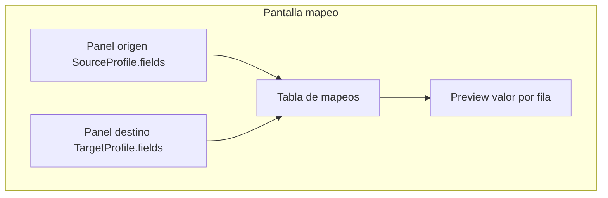

# Field mapping

Proceso y especificación del **Módulo 2** de Data Mapping Studio: enlazar campos origen con campos destino y definir cómo se obtiene el valor de cada columna de salida.

> Estado: **MVP + Fase 2 implementados** (kinds `direct`/`constant`/`concat`/`generated`/`split`/`expression`, preview por fila, drag & drop, catálogo `ValueGeneratorType`).  
> Plataforma: [`dms_integration.md`](dms_integration.md).

---

## Propósito

Permitir que el usuario **relacione** cada campo destino con su fuente de valor: un campo origen, varios campos, un valor fijo, una expresión o un valor **generado** en tiempo de ejecución (secuencia, único, patrón alfanumérico).

El resultado es un conjunto de `FieldMapping` persistidos en la versión del proyecto. El motor los aplica fila a fila después del parseo origen y antes de la serialización destino.

---

## Posición en el pipeline


| Etapa | Documento |
|-------|-----------|
| Campos origen | `source_definition.md` |
| **Enlace y fuente de valor** | **Este documento** |
| Reglas sobre el valor (upper, trim, date_format…) | [`transform_rules.md`](transform_rules.md) |
| Esquema físico destino | `target_definition.md` |

---

## Alcance

| Incluido | Excluido |
|----------|----------|
| Tipos de enlace origen ↔ destino | Definición de campos origen o destino |
| Constantes, concat, split, calculados | Catálogo completo de reglas de transformación |
| Generadores: secuencia, único, patrón | Ejecución del job ni dry run |
| UI de mapeo visual | Historial |

---

## Interfaz de mapeo

Pantalla tipo ETL con dos paneles y tabla de relaciones.



| Elemento | Comportamiento |
|----------|----------------|
| Panel izquierdo | Lista campos origen (`name`, `label`, `content_type`) |
| Panel derecho | Lista campos destino (`name`, `label`, `data_type`) |
| Drag & drop | Arrastrar origen → destino crea mapeo `direct` |
| Tabla editable | Tipo de fuente, parámetros, reglas; relaciones N:1 o sin origen |
| Indicadores | Destino sin mapeo (opcional/obligatorio), origen sin usar |
| Preview | Primera fila muestra valor resultante tras mapeo + reglas |

**Orden sugerido del asistente del proyecto:** origen → destino → **mapeo** → prueba.

---

## Tipos de enlace (`mapping_kind`)

Cada registro `FieldMapping` tiene un `target_field` (obligatorio) y un `mapping_kind` que define de dónde sale el valor.

| Kind | Origen | Descripción | Ejemplo |
|------|--------|-------------|---------|
| `direct` | 1 campo origen | Copia 1:1 | `documento` → `documento` |
| `concat` | N campos + literales | Une varios valores | `"FAC-"` + `documento` → `factura` |
| `split` | 1 campo origen | Divide en varios destinos | `nombre_completo` → `nombre`, `apellido` |
| `constant` | Ninguno | Valor fijo en todas las filas | `origen_sistema` = `"SAP"` |
| `expression` | Campos origen | Cálculo declarativo | `salario * 1.1` → `salario_ajustado` |
| `generated` | Ninguno (motor) | Valor construido por fila/job | Secuencia `A1`, `A2`… |

---

## Detalle por tipo

### `direct` — 1:1

```json
{
  "target_field": "documento",
  "mapping_kind": "direct",
  "source_fields": ["documento"],
  "transform_pipeline": [{"op": "trim"}]
}
```

### `concat` — N:1 (prefijo, sufijo, varios campos)

Partes ordenadas: literales y campos origen.

```json
{
  "target_field": "factura",
  "mapping_kind": "concat",
  "parts": [
    {"type": "literal", "value": "FAC-"},
    {"type": "field", "name": "documento"},
    {"type": "literal", "value": "-2025"}
  ],
  "transform_pipeline": []
}
```

Resultado ejemplo: `FAC-12345-2025`.

### `split` — 1:N

Un mapeo por cada destino; referencia al mismo origen con reglas de corte.

```json
{
  "target_field": "nombre",
  "mapping_kind": "split",
  "source_fields": ["nombre_completo"],
  "split": {"part": "first_word"}
}
```

| Parte | Descripción |
|-------|-------------|
| `first_word` | Primera palabra |
| `rest` | Resto del texto |
| `delimiter` | Separar por carácter; params `delimiter`, `index` (default 0) |
| `substring` | `start` + `length` sobre el valor origen |
| `regex` | `pattern` + `group` (default 0); sin match → vacío |

### `constant` — Valor fijo

```json
{
  "target_field": "origen_sistema",
  "mapping_kind": "constant",
  "value": "SAP",
  "source_fields": []
}
```

### `expression` — Calculado

Expresión limitada (AST) sobre campos origen; **sin** `eval()` libre. Operadores: `add`, `subtract`, `multiply`, `divide`, `concat`, `coalesce`. Operandos: `{"field": "…"}` o `{"literal": …}`; anidación máx. profundidad 5. `divide` por cero → error de fila.

```json
{
  "target_field": "salario_ajustado",
  "mapping_kind": "expression",
  "expression": {
    "op": "multiply",
    "left": {"field": "salario"},
    "right": {"literal": 1.1}
  }
}
```

### `generated` — Valor construido en ejecución

Campo destino **sin campo origen**. El motor genera el valor según `generator`.

```json
{
  "target_field": "linea",
  "mapping_kind": "generated",
  "generator": {
    "type": "sequence_alphanumeric",
    "prefix": "A",
    "start": 1,
    "step": 1
  }
}
```

Salida por fila: `A1`, `A2`, `A3`…

---

## Generadores (`generator.type`)

Catálogo administrable `ValueGeneratorType` (`system_catalogs.md`). Semilla = tipos abajo; el motor resuelve por `code` / `resolver_key`.

| Tipo | Código | Descripción | Ejemplo salida |
|------|--------|-------------|----------------|
| Secuencia numérica | `sequence_numeric` | Entero incremental por fila | `1`, `2`, `3` |
| Secuencia con padding | `sequence_padded` | Numérico con ceros a la izquierda | `00001`, `00002` |
| Secuencia alfanumérica | `sequence_alphanumeric` | Prefijo + número | `A1`, `A2`, `A3` |
| Plantilla con secuencia | `sequence_template` | Patrón con marcador | `FAC-{seq:5}` → `FAC-00001` |
| UUID por fila | `unique_uuid` | UUID v4 único por registro | `a1b2c3d4-…` |
| Correlativo por job | `unique_job_counter` | Contador único global del job | `1001`, `1002` |
| Fecha/hora ejecución | `job_timestamp` | Mismo valor en todas las filas | ISO `%Y-%m-%dT%H:%M:%S` (ej. `2025-07-12T09:14:30`) |
| Fila número | `row_number` | Índice de fila procesada (1-based) | `1`, `2`, `3` |

### Parámetros comunes del generador

| Parámetro | Tipos | Descripción |
|-----------|-------|-------------|
| `start` | secuencias | Valor inicial (default `1`) |
| `step` | secuencias | Incremento (default `1`) |
| `prefix` | alfanumérico, plantilla | Texto antes del número |
| `suffix` | alfanumérico | Texto después del número |
| `pad_length` | padded, template | Longitud con relleno |
| `pad_char` | padded, template | Carácter de relleno (default `0`) |
| `reset_per_job` | secuencias | Reiniciar en cada ejecución (default `true`) |
| `scope` | correlativo | `row` \| `job` \| `project` |

### Ejemplos

**Factura con prefijo y secuencia:**

```json
{
  "target_field": "factura",
  "mapping_kind": "generated",
  "generator": {
    "type": "sequence_template",
    "template": "FAC-{seq:5}",
    "start": 1,
    "reset_per_job": true
  }
}
```

**Línea alfanumérica A1, A2, A3:**

```json
{
  "generator": {
    "type": "sequence_alphanumeric",
    "prefix": "A",
    "start": 1,
    "step": 1
  }
}
```

**Identificador único por fila:**

```json
{
  "target_field": "id_unico",
  "mapping_kind": "generated",
  "generator": {"type": "unique_uuid"}
}
```

---

## Reglas de transformación (`transform_pipeline`)

Después de resolver el valor (mapeo o generador), se aplica un **pipeline ordenado** por campo destino. Catálogo, UI y frontera con serialización destino: [`transform_rules.md`](transform_rules.md).

| Regla | Uso típico |
|-------|------------|
| `trim` | Quitar espacios |
| `upper` / `lower` | Normalizar texto |
| `date_format` | Cambiar formato fecha |
| `replace_map` | Códigos → descripciones |
| `pad_left` / `pad_right` | Relleno antes de escribir |
| `default_if_empty` | Fallback si valor vacío |

```json
"transform_pipeline": [
  {"op": "trim"},
  {"op": "upper"}
]
```

**Orden:** mapeo/generador → `transform_pipeline` → validación `TargetProfile` → serialización.

---

## Modelo conceptual: `FieldMapping`

| Campo | Tipo | Descripción |
|-------|------|-------------|
| `id` | UUID | PK |
| `project_version_id` | FK | Versión del proyecto |
| `target_field` | string | `name` de campo en `TargetProfile` |
| `mapping_kind` | enum | Ver tabla tipos |
| `source_fields` | array | Campos origen involucrados (vacío si constant/generated) |
| `parts` | array | Solo `concat`: literales y campos |
| `value` | string | Solo `constant` |
| `expression` | JSON | Solo `expression` |
| `generator` | JSON | Solo `generated` |
| `split` | JSON | Solo `split` |
| `transform_pipeline` | array | Reglas post-valor |
| `sort_order` | integer | Orden de evaluación si hay dependencias |
| `is_active` | boolean | — |

**Restricciones:**

- Un solo mapeo activo por `target_field` (salvo `split`, donde varios destinos comparten origen).
- `target_field` debe existir en `TargetProfile.fields`.
- `source_fields` deben existir en `SourceProfile.fields` cuando aplica.
- `generated` y `constant` no requieren origen.

---

## Fragmento JSON del proyecto (`mappings`)

```json
{
  "mappings": [
    {
      "target_field": "documento",
      "mapping_kind": "direct",
      "source_fields": ["documento"],
      "transform_pipeline": [{"op": "trim"}]
    },
    {
      "target_field": "nombre",
      "mapping_kind": "direct",
      "source_fields": ["nombre"],
      "transform_pipeline": [{"op": "trim"}, {"op": "upper"}]
    },
    {
      "target_field": "factura",
      "mapping_kind": "generated",
      "generator": {
        "type": "sequence_template",
        "template": "FAC-{seq:5}",
        "start": 1
      },
      "transform_pipeline": []
    },
    {
      "target_field": "linea",
      "mapping_kind": "generated",
      "generator": {
        "type": "sequence_alphanumeric",
        "prefix": "A",
        "start": 1
      }
    },
    {
      "target_field": "origen_sistema",
      "mapping_kind": "constant",
      "value": "SAP",
      "source_fields": []
    },
    {
      "target_field": "id_registro",
      "mapping_kind": "generated",
      "generator": {"type": "unique_uuid"}
    }
  ]
}
```

---

## Validaciones al guardar

| Regla | Comportamiento |
|-------|----------------|
| Todo `target_field` obligatorio tiene mapeo o `default_value` en destino | Error o advertencia |
| `source_fields` inexistentes | Error |
| `target_field` no definido en destino | Error |
| `concat` sin `parts` | Error |
| `constant` sin `value` | Error |
| `generated` sin `generator.type` | Error |
| Campo origen usado y destino no mapeado | Solo advertencia |
| `split` sin regla de parte | Error |

---

## Casos de uso

### FM-01 — Mapeo directo nómina TXT → CSV

| | |
|---|---|
| **Flujo** | Arrastrar `documento`, `nombre`, `salario` origen → mismos destinos |
| **Resultado** | Tres mapeos `direct` |

### FM-02 — Factura con prefijo fijo + documento origen

| | |
|---|---|
| **Flujo** | `concat`: literal `FAC-` + campo `documento` → destino `factura` |
| **Resultado** | `FAC-12345` por fila |

### FM-03 — Secuencia alfanumérica A1, A2, A3

| | |
|---|---|
| **Flujo** | Destino `linea` con `generated` / `sequence_alphanumeric`, prefix `A` |
| **Resultado** | Una línea numerada sin columna origen |

### FM-04 — Campo sistema constante

| | |
|---|---|
| **Flujo** | `constant` → `origen_sistema` = `SAP` en todas las filas |
| **Resultado** | Columna fija en salida |

### FM-05 — ID único por registro

| | |
|---|---|
| **Flujo** | `generated` / `unique_uuid` → `id_registro` |
| **Resultado** | UUID distinto por fila para trazabilidad |

### FM-06 — Plantilla FAC-00001 incremental

| | |
|---|---|
| **Flujo** | `sequence_template` `FAC-{seq:5}` → campo `factura` |
| **Resultado** | Correlativo con prefijo y padding, reinicia por job |

---

## Consideraciones

| Tema | Decisión |
|------|----------|
| ¿Dónde se define el campo destino? | `target_definition.md` — aquí solo se enlaza |
| Prefijo/sufijo + origen | `concat` o `transform` posterior; no requiere campo origen extra |
| Secuencias vs únicos | Secuencias predecibles; UUID/correlativo para unicidad global |
| Reinicio de secuencia | `reset_per_job` + `scope` (`row`/`job`/`project`) en motor |
| Reglas de transformación | Documento [`transform_rules.md`](transform_rules.md) |
| Catálogo generadores | `ValueGeneratorType` en `system_catalogs.md` (semilla + CRUD) |

---

## Implementación en código

| Pieza | Ubicación | Estado |
|-------|-----------|--------|
| Modelo `DmsFieldMappingSet` | `apps/dms/field_mapping/models.py` | Hecho |
| Persistencia / validación | `field_mapping_persistence_service.py` | Hecho (`split`/`expression`) |
| Contexto UI | `field_mapping_service.py` | Hecho |
| Preview | `field_mapping_preview_service.py` + `POST …/mapeo/preview/` | Hecho |
| Motor fila | `row_mapping_service.py` | Hecho (incluye split/expression) |
| Editor + hub + DnD + preview | `templates/dms/field_mapping/`, `field_mapping-*.js` | Hecho |
| URLs | `/app/filepipe/proyectos/<slug>/mapeo/` | Hecho |
| Catálogo `ValueGeneratorType` | `models.py` + `catalog_registry` + seed | Hecho |
| Publicar (valida + clona mapeos) | `version_publish_service.py` | Hecho |

## Checklist

- [x] `transform_rules.md` — catálogo y contrato de `transform_pipeline`
- [x] UI: auto-sugerencia de mapeo por nombre igual (`documento` ↔ `documento`)
- [x] UI dedicada Fase B «Reglas» (ver `transform_rules.md`)
- [x] `split` (incl. `regex`)
- [x] `expression` — operadores `add`/`subtract`/`multiply`/`divide`/`concat`/`coalesce` (UI + motor anidación hasta 5)
- [x] Catálogo `ValueGeneratorType` en `system_catalogs.md`
- [x] Preview valor por fila en el editor
- [x] Drag & drop origen → destino
- [x] Generadores: honrar `reset_per_job` / `scope` en el motor
- [x] UI generador: `step`, `suffix`, `pad_char`, `scope`, `reset_per_job`
- [x] `sequence_template`: `{seq:N}` dinámico
- [x] UI `expression` anidada

---

## Fase

| Alcance | Fase | Estado |
|---------|------|--------|
| `direct`, `constant`, `concat`, `generated` (secuencias + uuid) | MVP | Hecho |
| `transform_pipeline` básico (trim, upper, date_format) | MVP | Hecho |
| Auto-sugerencia por nombre | MVP | Hecho |
| Preview por fila + drag & drop | Fase 2 | Hecho |
| `split`, `expression` (motor + UI básica) | Fase 2 | Hecho |
| Catálogo generadores administrable | Fase 2 | Hecho |
| Params generador avanzados (`step`/`suffix`/`scope`/`{seq:N}`) | Fase 2 | Hecho |
| Expression anidada en UI | Fase 2 | Hecho |

---

## Documentos relacionados (DMS)

| Documento | Contenido |
|---------|-----------|
| `source_definition.md` | Campos origen |
| `target_definition.md` | Campos destino |
| `project_lifecycle.md` | Proyecto, permisos y ciclo |
| `field_mapping.md` | Este documento |
| `transform_rules.md` | Catálogo y UI de `transform_pipeline` |
| `system_catalogs.md` | Tipos de archivo; `ValueGeneratorType` |
