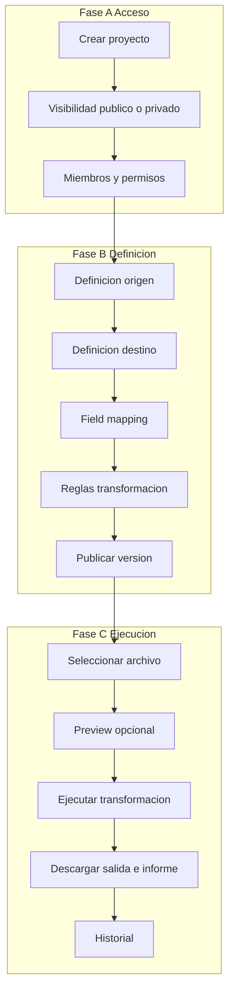
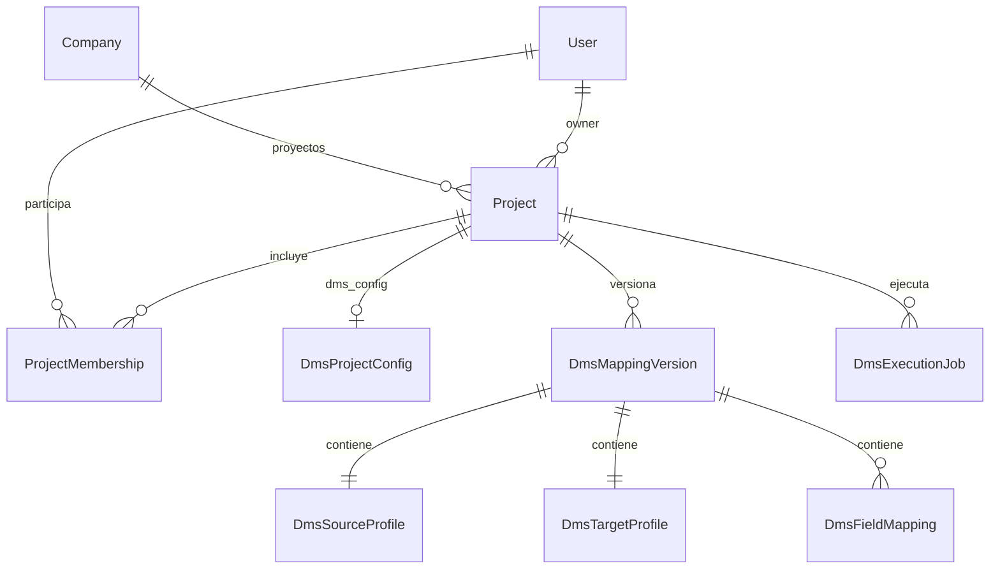
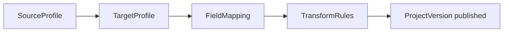

# Project lifecycle

Ciclo de vida del **proyecto** en Data Mapping Studio: creación, visibilidad, miembros, permisos y orden del flujo de definición y ejecución.

> Estado: borrador en revisión.  
> Origen: análisis en `Ideas.txt`.  
> Contenedor de: `SourceProfile`, `TargetProfile`, `FieldMapping` y ejecuciones.  
> **Plataforma:** reutiliza [`Project` y `ProjectMembership`](../definition_app/DynamicWorkspace_Model.md#project) — ver [`dms_integration.md`](dms_integration.md).

---

## Integración con DynamicWorkspace

| Concepto este documento | Implementación |
|-------------------------|----------------|
| Proyecto contenedor | `apps.projects.Project` con `project_kind = dms` |
| `name_short` | `Project.slug` (único por compañía) |
| `name`, `description` | `Project.name`, `Project.description` |
| `created_by` | `Project.owner` |
| Organización / tenant | `Project.company` → `Company` |
| Archivado | `Project.is_archived` |
| `visibility` | `DmsProjectConfig.visibility` (`company` \| `members_only`) |
| `project_admin` | `ProjectMembership.role = PA` |
| `editor` / `viewer` / `executor` | `ED` / `CO` / `GE` |
| Miembros | `ProjectMembership` — misma compañía que el proyecto |
| Listado visible | Usuarios de la **compañía** + membresía (no cross-tenant) |

Detalle completo: [`dms_integration.md`](dms_integration.md).

---

## Propósito

Un **proyecto** es la unidad de trabajo que agrupa:

- La definición de archivo **origen**
- La definición de archivo **destino**
- El **mapeo** de campos y reglas
- Las **ejecuciones** de transformación y su historial

Además define **quién puede ver, editar o ejecutar** esa configuración.

---

## Ciclo completo



| Fase | Pasos | Documento |
|------|-------|-----------|
| **A — Acceso** | Crear proyecto, visibilidad, miembros | Este documento |
| **B — Definición** | Origen → destino → mapeo → reglas → publicar | `source_definition.md`, `target_definition.md`, `field_mapping.md`, `transform_rules.md` |
| **C — Ejecución** | Archivo, preview, job, descarga, historial | `transform_execution.md` (**MVP**) |

---

## Fase A — Crear proyecto

### Paso A1 — Datos básicos

El usuario crea un proyecto con:

| Atributo | Tipo | Obligatorio | Descripción |
|----------|------|-------------|-------------|
| `name_short` | slug | Sí | Nombre corto / código. Único por **compañía** → `Project.slug` |
| `name` | string | Sí | Nombre visible en listados |
| `description` | text | No | Propósito del proyecto |
| `visibility` | enum | Sí | `public` \| `private` |
| `created_by` | FK usuario | Sí | Usuario creador (automático) |

**Regla:** el usuario que crea el proyecto recibe automáticamente rol **`project_admin`** (administrador del proyecto).

```json
{
  "name_short": "nomina-sap",
  "name": "Nómina SAP → CSV RRHH",
  "description": "Transformación mensual de TXT posicional a CSV",
  "visibility": "private"
}
```

### Paso A2 — Visibilidad

| Valor | Comportamiento |
|-------|----------------|
| **`public`** | Todos los usuarios **de la misma compañía** autenticados pueden ver el proyecto (`DmsProjectConfig.visibility = company`) |
| **`private`** | Solo usuarios con `ProjectMembership` activa (`members_only`) |

> El creador siempre es administrador, independientemente de la visibilidad.

### Paso A3 — Miembros y permisos (proyectos privados)

Si `visibility = private`, el administrador agrega usuarios y asigna permisos.

Si `visibility = public`, la membresía explícita es opcional para elevar permisos (ej. dar `execute` o `update` a usuarios concretos por encima del default público).

---

## Modelo de permisos

### Principio

Separar dos conceptos:

| Concepto | Qué controla |
|----------|----------------|
| **Permisos del proyecto** | Ver, editar definiciones, ejecutar, administrar miembros |
| **Definiciones técnicas** | Origen, destino, mapeo (requieren permiso `update` / `create`) |

### Permisos atómicos

| Código | Descripción | Referencia Ideas.txt |
|--------|-------------|----------------------|
| `view` | Ver proyecto, definiciones e historial | 4.3 Views |
| `create` | Crear borrador / nueva versión de definición | 4.3 Create |
| `update` | Editar origen, destino, mapeo, reglas | 4.3 Update |
| `delete` | Archivar proyecto o eliminar versión borrador | 4.3 Delete |
| `execute` | Ejecutar transformación sobre archivo | 4.5 |
| `manage_members` | Agregar/quitar usuarios y cambiar sus permisos | 4.1 |
| `grant_admin` | Otorgar permisos de administrador a otros | 4.1 |

### Roles predefinidos (atajos)

| Rol | Permisos incluidos |
|-----|-------------------|
| `project_admin` | Todos (`view`, `create`, `update`, `delete`, `execute`, `manage_members`, `grant_admin`) |
| `editor` | `view`, `create`, `update` |
| `executor` | `view`, `execute` |
| `viewer` | `view` |

### Paquetes de permisos (4.4)

Combinaciones frecuentes asignables al agregar un usuario:

| Paquete | Permisos |
|---------|----------|
| `view_only` | view |
| `update_view` | view + update |
| `update_view_create` | view + update + create |
| `full_crud` | view + create + update + delete |
| `executor` | view + execute |
| `admin` | todos |

En la UI: selector de **paquete** o modo **avanzado** (checkboxes por permiso).

### Matriz acción → permiso requerido

| Acción | Permiso |
|--------|---------|
| Listar / abrir proyecto | `view` (o público + autenticado) |
| Editar definición origen | `update` |
| Editar definición destino | `update` |
| Editar mapeo | `update` |
| Publicar versión | `create` o `update` |
| Ejecutar transformación | `execute` |
| Ver historial de ejecuciones | `view` |
| Agregar usuario al proyecto | `manage_members` |
| Delegar admin | `grant_admin` |
| Archivar proyecto | `delete` o `project_admin` |

---

## Modelo conceptual



> Nombres Django en `apps.dms` con prefijo `Dms*`; ver [`dms_integration.md`](dms_integration.md).

### `Project` (+ `DmsProjectConfig`)

| Campo | Tipo | Descripción |
|-------|------|-------------|
| `id` | UUID | PK — `apps.projects.Project` |
| `company_id` | FK | Compañía tenant |
| `slug` | slug | Código corto único por compañía (antes `name_short`) |
| `name` | string | Nombre visible |
| `description` | text | — |
| `owner_id` | FK | Creador (`created_by`) |
| `project_kind` | enum | `workspace` \| `dms` |
| `is_archived` | boolean | Proyecto archivado |
| `visibility` | enum | En `DmsProjectConfig`: `company` \| `members_only` |
| `current_version_id` | FK | En `DmsProjectConfig` → `DmsMappingVersion` publicada |
| `created_at` / `updated_at` | datetime | — |

### `ProjectMembership`

| Campo | Tipo | Descripción |
|-------|------|-------------|
| `id` | UUID | PK — `apps.projects.ProjectMembership` |
| `project_id` | FK | — |
| `user_id` | FK | Misma compañía que el proyecto |
| `role` | enum | `PA` \| `ED` \| `CO` \| `GE` (mapeo roles DMS — ver integración) |
| `invited_by_id` | FK | Quién otorgó el acceso |
| `is_active` | boolean | — |
| `created_at` | datetime | — |

**Regla al crear proyecto DMS:** `owner` recibe `ProjectMembership` con `role = PA` (igual que workspace).

### `DmsMappingVersion` (antes `ProjectVersion`)

Snapshot inmutable de la definición lista para ejecutar.

| Campo | Tipo | Descripción |
|-------|------|-------------|
| `id` | UUID | PK |
| `project_id` | FK | — |
| `version_number` | integer | 1, 2, 3… |
| `status` | enum | `draft` \| `published` \| `archived` |
| `source_profile` | JSON / FK | Definición origen |
| `target_profile` | JSON / FK | Definición destino |
| `mappings` | JSON | Field mappings |
| `published_at` | datetime | — |
| `published_by_id` | FK | — |

Cada `DmsExecutionJob` referencia una `DmsMappingVersion` publicada.

---

## Qué proyectos ve cada usuario (punto 5)

```sql
-- Lógica conceptual (misma compañía que user.profile.company)
SELECT p.* FROM projects_project p
JOIN company_company c ON p.company_id = c.id
WHERE p.project_kind = 'dms'
  AND p.is_archived = false
  AND p.company_id = :user_company_id
  AND (
    EXISTS (
      SELECT 1 FROM dms_dmsprojectconfig cfg
      WHERE cfg.project_id = p.id AND cfg.visibility = 'company'
    )
    OR EXISTS (
      SELECT 1 FROM projects_projectmembership m
      WHERE m.project_id = p.id AND m.user_id = :current_user AND m.is_active = true
    )
  )
ORDER BY p.updated_at DESC
```

| Situación | ¿Aparece en listado? |
|-----------|----------------------|
| Proyecto visible en compañía (`company`) | Sí (usuarios UF/US de la misma compañía) |
| Proyecto solo miembros (`members_only`) + membresía | Sí |
| Proyecto solo miembros sin membresía | No |
| Otra compañía | No |
| Proyecto archivado | No |

---

## Fase B — Definición técnica (punto 6)

Orden recomendado dentro del proyecto:

| Orden | Módulo | Documento | Permiso mínimo |
|-------|--------|-----------|----------------|
| 1 | Definición origen | `source_definition.md` | `update` |
| 2 | Definición destino | `target_definition.md` | `update` |
| 3 | Mapeo de campos | `field_mapping.md` | `update` |
| 4 | Reglas de transformación | `transform_rules.md` | `update` |
| 5 | Publicar versión | Este documento § Publicación | `create` o `update` |



**Borrador vs publicado:**

- Edición diaria en **borrador** (`ProjectVersion.status = draft`).
- **Publicar** congela la definición; las ejecuciones usan solo versiones `published`.
- Cambios posteriores crean nuevo borrador o nueva versión sin romper jobs en curso.

---

## Fase C — Ejecución (punto 6)

Resumen; detalle en [`transform_execution.md`](transform_execution.md). Carga del archivo: [`file_intake.md`](file_intake.md).

| Paso | Acción | Permiso |
|------|--------|---------|
| C1 | Seleccionar archivo de entrada | `execute` |
| C2 | Preview / dry run (opcional) | `execute` |
| C3 | Ejecutar transformación | `execute` |
| C4 | Descargar archivo destino + informe | `execute` |
| C5 | Consultar historial | `view` |

---

## Flujo UI propuesto

### Listado de proyectos

- Tarjetas o tabla: `name_short`, `name`, visibilidad, última ejecución, rol del usuario.
- Botón **Nuevo proyecto** (usuarios autenticados).

### Detalle de proyecto (tabs)

| Tab | Contenido | Permiso |
|-----|-----------|---------|
| Resumen | Descripción, versión activa, últimas ejecuciones | view |
| Origen | Asistente source definition | update |
| Destino | Asistente target definition | update |
| Mapeo | Pantalla field mapping | update |
| Reglas | Transform rules | update |
| Miembros | Listado + CRUD membresías | manage_members |
| Historial | Execution jobs | view |
| Ejecutar | Upload + run | execute |

---

## Validaciones

| Regla | Comportamiento |
|-------|----------------|
| `name_short` único por organización | Error al crear |
| Creador sin `project_admin` | Imposible — siempre se asigna al crear |
| Último admin no puede quitarse admin sin transferir | Error |
| Ejecutar sin versión `published` | Error o advertencia fuerte |
| `execute` sin `view` | No permitido — `execute` implica `view` |
| Usuario sin permiso en tab | Tab oculto o solo lectura |

---

## Casos de uso

### PL-01 — Proyecto privado de nómina

| | |
|---|---|
| **Actor** | Integrador |
| **Flujo** | Crea proyecto privado → se auto-asigna admin → agrega analista con `update_view` → agrega operador con `executor` |
| **Resultado** | Analista define; operador solo ejecuta |

### PL-02 — Proyecto público de plantilla

| | |
|---|---|
| **Actor** | Admin plataforma |
| **Flujo** | Crea proyecto `visibility: public` → publica versión → todos ven definición |
| **Resultado** | Reutilización como referencia (permiso ejecutar según política pública) |

### PL-03 — Delegar administración

| | |
|---|---|
| **Actor** | Admin del proyecto |
| **Flujo** | Agrega colega con paquete `admin` (`grant_admin` + `manage_members`) |
| **Resultado** | Dos administradores; creador puede revocar |

### PL-04 — Ciclo completo primera vez

| | |
|---|---|
| **Flujo** | Crear → origen → destino → mapeo → publicar v1 → ejecutar archivo → descargar CSV |
| **Resultado** | Job en historial referenciando `ProjectVersion` 1 |

---

## Decisiones abiertas (revisar)

| # | Tema | Opciones |
|---|------|----------|
| 1 | Proyecto **público en compañía**: permiso default | Solo `CO` (lectura) vs `CO`+`GE` — ver integración |
| 2 | `slug` único | Por compañía (definido en `DynamicWorkspace_Model`) |
| 3 | ¿Ejecutar borrador sin publicar? | No (recomendado) vs sí con advertencia |
| 4 | Paquetes de permisos | `PermissionPackage` en catálogos → `maps_to_role` PA/ED/CO/GE; permisos JSON documentales |
| 5 | Multi-tenant | **`Company`** ya implementado — sin `Organization` adicional |

---

## Fase de implementación

| Alcance | Fase |
|---------|------|
| Project + Membership + roles básicos + privado/público | MVP |
| ProjectVersion + publicar antes de ejecutar | MVP |
| Paquetes de permisos granulares (4.4) | MVP |
| `transform_execution.md` | MVP |
| Organización multi-tenant | Fase 2 |

---

## Prototipo HTML

Vista previa del flujo en `prototype/dms/` (estilos base desde `prototype/projects/`):

| Archivo | Pantalla |
|---------|----------|
| `dms_project_list.html` | Listado de proyectos (públicos + membresía) |
| `dms_project_create.html` | Alta — Fase A pasos 1–2 (nombre, visibilidad) |
| `dms_project_hub.html` | Hub del proyecto — stepper 3 fases + tabs (resumen, origen, destino, mapeo, reglas, historial, ejecutar) |
| `dms_project_members.html` | Miembros y paquetes de permisos — Fase A paso 3 |

**Recorrido sugerido:** listado → crear → hub → miembros → tabs del ciclo.

---

## Documentos relacionados (DMS)

| Documento | Relación |
|-----------|----------|
| `dms_integration.md` | Alineación con plataforma DynamicWorkspace |
| `project_lifecycle.md` | Este documento — ciclo y acceso |
| `source_definition.md` | Fase B — origen (**MVP implementado**) |
| `target_definition.md` | Fase B — destino (**MVP implementado**) |
| `field_mapping.md` | Fase B — mapeo (**MVP implementado**) |
| `transform_rules.md` | Fase B — reglas (**MVP implementado**) |
| `transform_execution.md` | Fase C — ejecución, descarga, historial (**MVP implementado**) |
| [`../definition_app/UI_MESSAGES.md`](../definition_app/UI_MESSAGES.md) | Mensajes UI (SourceProfile §3.8) |
| `file_intake.md` | Browse, upload, archivo muestra y producción (**MVP implementado**) |
| `system_catalogs.md` | Catálogos transversales |
