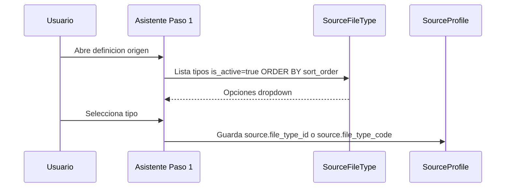
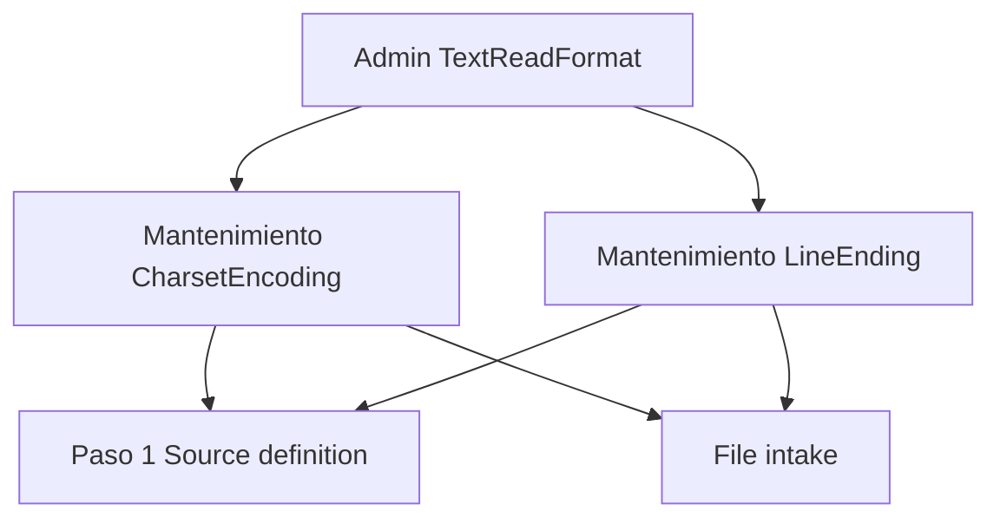

# System catalogs

Catálogos transversales de **tablas de sistema** (datos de referencia) que alimentan múltiples módulos de Data Mapping Studio. No deben codificarse fijos en la aplicación: se mantienen mediante pantallas de administración y se consultan en tiempo de ejecución.

> Estado: borrador en desarrollo.  
> Rol: procesos integradores que forman parte del desarrollo global de DMS.  
> **Plataforma:** catálogos **globales** (toda la plataforma); administración por usuario **UA** (User Admin). Ver [`dms_integration.md`](dms_integration.md).

---

## Propósito

Centralizar la definición de valores que el sistema necesita en distintos flujos (asistentes, parsers, validaciones) sin desplegar código nuevo por cada variante.

| Principio | Descripción |
|-----------|-------------|
| **Configurable** | Alta, edición y baja vía pantallas de mantenimiento, no solo migraciones |
| **Referenciado por código** | Los módulos usan `code` estable; la etiqueta y metadatos viven en BD |
| **Versionable** | Cambios auditables; registros inactivos no se ofrecen en selectores |
| **Integrable** | Cada catálogo documenta qué módulos lo consumen |

---

## Patrón común

Cada catálogo del sistema sigue la misma estructura documental y técnica:


| Elemento | Descripción |
|----------|-------------|
| **Entidad** | Modelo Django (o equivalente) con campos estándar |
| **Mantenimiento** | Pantalla con **listado** de todos los registros de la tabla + operaciones **CRUD** (crear, consultar, actualizar, eliminar/desactivar) |
| **Consumidores** | Módulos que leen el catálogo (dropdowns, validaciones, parsers) |
| **Datos semilla** | Registros iniciales vía migración o comando; luego administrables |

Cada mantenimiento incluye como mínimo:

| Vista | Función |
|-------|---------|
| **List** | Tabla con todos los registros activos (y opcionalmente inactivos), búsqueda y filtros |
| **Create** | Formulario de alta |
| **Read** | Consulta de detalle (puede ser el mismo formulario en solo lectura) |
| **Update** | Formulario de edición |
| **Delete** | Eliminación lógica (`is_active = false`) o física según reglas del catálogo |

### Campos estándar sugeridos (todos los catálogos)

| Campo | Tipo | Descripción |
|-------|------|-------------|
| `id` | UUID | PK |
| `code` | slug único | Identificador estable para código (`txt_fixed`, `csv`) |
| `name` | string | Nombre visible en UI |
| `description` | text | Ayuda contextual |
| `sort_order` | integer | Orden en listas desplegables |
| `is_active` | boolean | Si false, no aparece en selectores nuevos |
| `metadata` | JSON | Parámetros extra según catálogo |
| `created_at` / `updated_at` | datetime | Auditoría |

---

## Índice de catálogos

| Catálogo | Código entidad | Mantenimiento | Consumidores | Fase |
|----------|----------------|---------------|--------------|------|
| Tipos de archivo de lectura | `SourceFileType` | List + CRUD | Source definition (Paso 1), File intake, parsers | MVP |
| Tipos de archivo de salida | `TargetFileType` | List + CRUD | Target definition (Paso 1), serializers | MVP |
| Parámetros texto (encoding / line ending) | `TextReadFormat` | List + CRUD (2 tablas) | Source + Target (Paso 2), File intake | MVP |
| Tipos de contenido de campo origen | `FieldContentType` | List + CRUD | Source definition (Paso 4) | MVP |
| Tipos de dato de campo destino | `TargetFieldDataType` | List + CRUD | Target definition (Paso 4) | MVP |
| Modos inicio/fin de captura | `CaptureBoundaryMode` | List + CRUD | Source definition (Pasos 2–3) | MVP |
| Códigos de error en informes | `ExecutionErrorCode` | List + CRUD | Transform execution, informes job | MVP |
| Variables patrón nombre salida | `FilenamePatternVariable` | List + CRUD (semilla fija) | Target definition, transform execution | MVP |
| Tipos de generador de valor | `ValueGeneratorType` | List + CRUD | Field mapping (`generated`) | MVP |
| Paquetes de permisos de proyecto | `PermissionPackage` | List + CRUD | Project lifecycle (miembros) | MVP |
| Operaciones de transformación | `TransformOperation` | List + CRUD | Transform rules, field mapping | MVP |
| Plantillas de pipeline | `TransformPipelineTemplate` | List + CRUD | Transform rules — aplicar plantilla | MVP |

---

## Catálogo 1 — Tipos de archivo de lectura (`SourceFileType`)

### Por qué existe

El **Paso 1 — Tipo de archivo a recibir** (`source_definition.md`) requiere mostrar al usuario los formatos que el sistema puede leer. Esos tipos **no deben estar hardcodeados** en el asistente ni en los parsers: deben cargarse desde este catálogo.

### Responsabilidades

| Sí | No |
|----|-----|
| Definir qué formatos están habilitados para lectura | Definir estructura de un proyecto concreto (→ `SourceProfile`) |
| Asociar extensión, parser y fase MVP | Parsear archivos |
| Activar / desactivar tipos sin redeploy | Tipos de archivo de **salida** (→ `TargetFileType`) |

### Modelo `SourceFileType`

| Campo | Tipo | Obligatorio | Descripción |
|-------|------|-------------|-------------|
| `code` | slug | Sí | Único. Ej: `txt_fixed`, `csv`, `xlsx` |
| `name` | string | Sí | Etiqueta UI. Ej: «TXT posicional» |
| `description` | text | No | Texto de ayuda en el Paso 1 |
| `extensions` | JSON array | Sí | Extensiones aceptadas. Ej: `[".txt"]`, `[".csv"]` |
| `parser_key` | string | Sí | Clave del parser en código. Ej: `parsers.txt_fixed` |
| `phase` | enum | Sí | `mvp`, `phase_2`, `phase_3` — visibilidad o badge en UI |
| `config_schema` | JSON | No | Esquema de parámetros extra que pide el asistente (delimiter, sheet…) |
| `sort_order` | integer | Sí | Orden en el selector del Paso 1 |
| `is_active` | boolean | Sí | Solo activos en dropdown |

### Mantenimiento — tipos de archivo

Pantalla de administración para usuarios con tipo **`UA`** (`UserProfile.user_type`) — User Admin de DynamicWorkspace. Equivalente al rol «System admin» de los docs DMS. **List:** muestra todos los registros de `SourceFileType`. **CRUD:** crear, consultar, editar y desactivar registros.

| Vista | Ruta sugerida | Descripción |
|-------|---------------|-------------|
| Listado | `/admin/catalogs/source-file-types/` | Tabla con búsqueda y filtros |
| Crear | `…/nuevo/` | Formulario alta |
| Editar | `…/<id>/editar/` | Formulario edición |
| Desactivar | acción en listado | `is_active = false` (no eliminar si hay perfiles que lo usan) |

**Columnas del listado (DataTables / grid):**

| Columna | Campo | Notas |
|---------|-------|-------|
| Código | `code` | Enlace a edición |
| Nombre | `name` | — |
| Extensiones | `extensions` | Texto concatenado |
| Parser | `parser_key` | Solo lectura recomendada tras crear |
| Fase | `phase` | Badge MVP / Fase 2 |
| Orden | `sort_order` | — |
| Activo | `is_active` | Sí/No |
| Acciones | — | Editar · Desactivar |

**Formulario crear / editar:**

| Campo | Widget | Validación |
|-------|--------|------------|
| Código | texto | Único, slug, no editable tras crear (recomendado) |
| Nombre | texto | Obligatorio |
| Descripción | textarea | Opcional |
| Extensiones | lista editable | Al menos una; formato `.ext` |
| Parser key | select o texto | Debe existir implementación registrada |
| Fase | select | `mvp` \| `phase_2` \| `phase_3` |
| Orden | número | ≥ 0 |
| Activo | checkbox | Default true |
| Config schema | JSON editor | Opcional; avanzado |

**Reglas de negocio:**

- No desactivar un tipo si existen `SourceProfile` activos que lo referencian (o advertir y permitir solo para nuevos proyectos).
- No eliminar físicamente; solo `is_active = false`.
- El `code` no cambia tras publicación para no romper JSON guardados.

### Datos semilla sugeridos (MVP)

| code | name | extensions | parser_key | phase |
|------|------|------------|------------|-------|
| `txt_fixed` | TXT posicional | `[".txt"]` | `txt_fixed` | mvp |
| `txt_delimited` | TXT delimitado | `[".txt"]` | `txt_delimited` | mvp |
| `csv` | CSV | `[".csv"]` | `csv` | mvp |
| `xlsx` | Excel | `[".xlsx", ".xls"]` | `xlsx` | mvp |
| `json` | JSON | `[".json"]` | `json` | mvp |
| `xml` | XML | `[".xml"]` | `xml` | mvp |

### Integración con Source definition (Paso 1)



En `SourceProfile`, referenciar el catálogo:

```json
{
  "source": {
    "file_type_code": "txt_fixed",
    "encoding_code": "latin-1",
    "line_ending_code": "auto",
    "capture_start": { "mode": "line_number", "line": 1 }
  }
}
```

O por FK: `file_type_id` → `SourceFileType.id` (preferible en BD; en JSON exportado incluir `code`).

### Integración con otros módulos

| Módulo | Uso |
|--------|-----|
| **Source definition** | Dropdown Paso 1; carga `config_schema` para pasos siguientes |
| **File intake** | Valida extensión del upload contra `extensions` del tipo |
| **Motor / parsers** | Resuelve `parser_key` → clase parser |
| **Target definition** | Catálogo `TargetFileType` para escritura (Catálogo 3) |

---

## Catálogo 2 — Parámetros de lectura de texto (`TextReadFormat`)

Agrupa el mantenimiento de **codificación de caracteres** (`CharsetEncoding`) y **finales de línea** (`LineEnding`). Aplica a **lectura** (Paso 1 origen) y **escritura** (Paso 2 destino). Mismo catálogo, distinto contexto de UI.

Una sola sección de administración — **Text read format** — con dos mantenimientos independientes (pestañas o submenú): uno por tabla `CharsetEncoding` y otro por `LineEnding`.



### Rutas de administración

| Tabla | Ruta sugerida |
|-------|---------------|
| Codificaciones | `/admin/catalogs/text-read-format/encodings/` |
| Finales de línea | `/admin/catalogs/text-read-format/line-endings/` |

---

### 2a — Codificación de caracteres (`CharsetEncoding`)

Define los valores de **encoding** disponibles en el Paso 1, incluida la opción de **detección automática** sugerida por File intake.

#### Modelo `CharsetEncoding`

| Campo | Tipo | Obligatorio | Descripción |
|-------|------|-------------|-------------|
| `code` | slug | Sí | Único. Ej: `utf-8`, `latin-1`, `auto` |
| `name` | string | Sí | Etiqueta UI. Ej: «UTF-8», «Detección automática» |
| `description` | text | No | Ayuda en el asistente |
| `charset_value` | string | Condicional | Nombre codec Python (`utf-8`, `iso-8859-1`). Vacío si `is_auto_detect` |
| `is_auto_detect` | boolean | Sí | Si true: File intake sugiere codec; usuario confirma en Paso 1 |
| `sort_order` | integer | Sí | Orden en dropdown |
| `is_active` | boolean | Sí | Solo activos en selectores |

> Solo **un** registro debe tener `is_auto_detect: true` (validación al guardar).

#### Mantenimiento — codificaciones

**List:** registros de `CharsetEncoding`. **CRUD:** alta, consulta, edición y desactivación.

**Columnas del listado:**

| Columna | Campo |
|---------|-------|
| Código | `code` |
| Nombre | `name` |
| Valor codec | `charset_value` |
| Auto-detect | `is_auto_detect` |
| Orden | `sort_order` |
| Activo | `is_active` |
| Acciones | Editar · Desactivar |

**Formulario:**

| Campo | Notas |
|-------|-------|
| Código | Slug único; no editable tras crear (recomendado) |
| Nombre | Obligatorio |
| Descripción | Opcional |
| Valor codec | Obligatorio salvo si auto-detect |
| Detección automática | Checkbox; deshabilita valor codec |
| Orden / Activo | Estándar |

El administrador puede **agregar encodings** que necesite (`windows-1252`, `cp850`, etc.) sin cambiar código.

#### Datos semilla

| code | name | charset_value | is_auto_detect |
|------|------|---------------|----------------|
| `auto` | Detección automática | — | true |
| `utf-8` | UTF-8 | `utf-8` | false |
| `latin-1` | Latin-1 (ISO-8859-1) | `latin-1` | false |
| `windows-1252` | Windows-1252 | `cp1252` | false |

---

### 2b — Finales de línea (`LineEnding`)

Define cómo se interpreta el **salto de línea** al leer archivos de texto.

#### Modelo `LineEnding`

| Campo | Tipo | Obligatorio | Descripción |
|-------|------|-------------|-------------|
| `code` | slug | Sí | Único. Ej: `lf`, `crlf`, `auto`, `custom` |
| `name` | string | Sí | Etiqueta UI |
| `description` | text | No | Ayuda contextual |
| `sequence` | string | Condicional | Secuencia real: `\n`, `\r\n`, `\r`. Vacío si `is_auto_detect` |
| `is_auto_detect` | boolean | Sí | El sistema infiere el final de línea |
| `allows_custom_value` | boolean | Sí | Si true: en Paso 1 el usuario puede escribir secuencia o condición propia |
| `sort_order` | integer | Sí | Orden en dropdown |
| `is_active` | boolean | Sí | Solo activos en selectores |

> Solo **un** registro con `is_auto_detect: true`. Varios pueden tener `allows_custom_value: true` (ej. entrada genérica «Personalizado»).

#### Mantenimiento — finales de línea

**List:** registros de `LineEnding`. **CRUD:** alta, consulta, edición y desactivación.

**Columnas del listado:**

| Columna | Campo |
|---------|-------|
| Código | `code` |
| Nombre | `name` |
| Secuencia | `sequence` |
| Auto-detect | `is_auto_detect` |
| Permite custom | `allows_custom_value` |
| Orden | `sort_order` |
| Activo | `is_active` |
| Acciones | Editar · Desactivar |

**Formulario:**

| Campo | Notas |
|-------|-------|
| Código / Nombre | Estándar |
| Secuencia | Texto escapado (`\n`, `\r\n`) o hex si aplica |
| Detección automática | Checkbox |
| Permite valor personalizado | Si activo, en Paso 1 aparece campo libre `line_ending_custom` |
| Orden / Activo | Estándar |

El administrador puede crear entradas con secuencias no estándar (ej. solo `\r` legacy Mac) o una fila **«Personalizado»** (`allows_custom_value: true`) para que cada proyecto defina su propia secuencia o condición.

#### Datos semilla

| code | name | sequence | is_auto_detect | allows_custom_value |
|------|------|----------|----------------|---------------------|
| `auto` | Detección automática | — | true | false |
| `lf` | LF (Unix) | `\n` | false | false |
| `crlf` | CRLF (Windows) | `\r\n` | false | false |
| `custom` | Personalizado | — | false | true |

---

### Integración con Source definition (Paso 1)

En el asistente, los dropdowns cargan catálogos activos. Valores guardados en `SourceProfile`:

```json
{
  "source": {
    "file_type_code": "txt_fixed",
    "encoding_code": "latin-1",
    "encoding_custom": null,
    "line_ending_code": "crlf",
    "line_ending_custom": null
  }
}
```

**Cuando el usuario elige detección automática:**

```json
{
  "encoding_code": "auto",
  "encoding_custom": null
}
```

File intake ejecuta `chardet`, sugiere codec (ej. `latin-1`) y el usuario confirma o cambia antes de guardar.

**Cuando elige line ending personalizado:**

```json
{
  "line_ending_code": "custom",
  "line_ending_custom": "\\r\\n\\x00"
}
```

| Campo en perfil | Origen |
|-----------------|--------|
| `encoding_code` | `CharsetEncoding.code` |
| `encoding_custom` | Texto libre si el registro lo permite (extensión futura) |
| `line_ending_code` | `LineEnding.code` |
| `line_ending_custom` | Obligatorio si `LineEnding.allows_custom_value` |

### Integración con File intake

| Catálogo | Comportamiento |
|----------|----------------|
| `CharsetEncoding` + `is_auto_detect` | Sugiere codec al subir muestra |
| `LineEnding` + `is_auto_detect` | Analiza muestra y propone `lf` / `crlf` |
| Valores custom | Se aplican tal cual en el parser |

---

## Catálogo 3 — Tipos de archivo de salida (`TargetFileType`)

### Por qué existe

El **Paso 1 — Tipo de archivo de salida** (`target_definition.md`) requiere los formatos que el sistema puede **escribir**. Espejo de `SourceFileType`, orientado a serialización.

### Responsabilidades

| Sí | No |
|----|-----|
| Definir formatos habilitados para escritura | Definir `TargetProfile` de un proyecto |
| Asociar extensión, serializer y fase | Parsear archivos de entrada |
| Activar / desactivar sin redeploy | Tipos de **lectura** (→ `SourceFileType`) |

### Modelo `TargetFileType`

| Campo | Tipo | Obligatorio | Descripción |
|-------|------|-------------|-------------|
| `code` | slug | Sí | Único. Ej: `txt_fixed`, `csv`, `xlsx` |
| `name` | string | Sí | Etiqueta UI. Ej: «CSV» |
| `description` | text | No | Ayuda en Paso 1 destino |
| `extensions` | JSON array | Sí | Extensiones de salida. Ej: `[".csv"]` |
| `serializer_key` | string | Sí | Clave del serializer en código. Ej: `serializers.csv` |
| `phase` | enum | Sí | `mvp`, `phase_2`, `phase_3` |
| `config_schema` | JSON | No | Parámetros del asistente (delimiter, sheet, root_type…) |
| `sort_order` | integer | Sí | Orden en selector |
| `is_active` | boolean | Sí | Solo activos en dropdown |

### Mantenimiento

| Vista | Ruta sugerida |
|-------|---------------|
| Listado | `/admin/catalogs/target-file-types/` |
| Crear | `…/nuevo/` |
| Editar | `…/<id>/editar/` |
| Desactivar | acción en listado |

**Columnas del listado:** Código · Nombre · Extensiones · Serializer · Fase · Orden · Activo · Acciones.

**Reglas de negocio:** igual que `SourceFileType` — no desactivar si hay `TargetProfile` activos; no eliminar físicamente; `code` inmutable tras crear.

### Datos semilla (MVP)

| code | name | extensions | serializer_key | phase |
|------|------|------------|----------------|-------|
| `txt_fixed` | TXT posicional | `[".txt"]` | `txt_fixed` | mvp |
| `txt_delimited` | TXT delimitado | `[".txt"]` | `txt_delimited` | mvp |
| `csv` | CSV | `[".csv"]` | `csv` | mvp |
| `xlsx` | Excel | `[".xlsx"]` | `xlsx` | mvp |
| `json` | JSON | `[".json"]` | `json` | mvp |
| `xml` | XML | `[".xml"]` | `xml` | mvp |

### Integración con Target definition (Paso 1)

```json
{
  "target": {
    "file_type_code": "csv",
    "encoding_code": "utf-8",
    "line_ending_code": "crlf"
  }
}
```

El motor resuelve `serializer_key` → clase serializer al ejecutar el job.

---

## Catálogo 4 — Tipos de contenido de campo origen (`FieldContentType`)

### Por qué existe

En **Source definition — Paso 4**, cada campo origen declara un `content_type` que define cómo **validar** el valor leído. No debe estar hardcodeado: el administrador puede activar tipos y ajustar reglas por defecto.

> Distinto de `TargetFieldDataType` (Catálogo 6): aquí se valida **entrada**; allí se define **serialización de salida**.

### Modelo `FieldContentType`

| Campo | Tipo | Obligatorio | Descripción |
|-------|------|-------------|-------------|
| `code` | slug | Sí | Único. Ej: `numeric`, `alpha`, `date` |
| `name` | string | Sí | Etiqueta UI |
| `description` | text | No | Ayuda en Paso 4 |
| `default_pattern` | string | No | Regex por defecto si el campo no define `pattern` propio |
| `requires_date_format` | boolean | Sí | Si true: el campo debe indicar `date_format` |
| `allows_custom_pattern` | boolean | Sí | Si true: el usuario puede sobrescribir con `pattern` en el campo |
| `phase` | enum | Sí | `mvp` \| `phase_2` |
| `sort_order` | integer | Sí | Orden en dropdown |
| `is_active` | boolean | Sí | Solo activos en selectores |

### Mantenimiento

| Vista | Ruta sugerida |
|-------|---------------|
| Listado | `/admin/catalogs/field-content-types/` |
| CRUD | `…/nuevo/`, `…/<id>/editar/` |

**Columnas del listado:** Código · Nombre · Patrón default · Req. date format · Fase · Orden · Activo · Acciones.

### Datos semilla (MVP)

| code | name | default_pattern | requires_date_format |
|------|------|-----------------|----------------------|
| `alphanumeric` | Alfanumérico | `^[A-Za-z0-9]+$` | false |
| `alpha` | Solo letras | `^[A-Za-z]+$` | false |
| `numeric` | Solo números | `^[0-9]+$` | false |
| `decimal` | Decimal | `^[0-9]+(\.[0-9]+)?$` | false |
| `alphanumeric_spaces` | Alfanumérico con espacios | `^[A-Za-z0-9 ]+$` | false |
| `date` | Fecha | — | true |
| `datetime` | Fecha y hora | — | true |
| `free_text` | Texto libre | — | false |
| `custom` | Patrón propio | — | false |

Para `custom`, `allows_custom_pattern: true` y el usuario define `pattern` en el campo.

### Integración con Source definition (Paso 4)

```json
{
  "name": "documento",
  "content_type": "numeric",
  "required": true
}
```

En ejecución, violaciones generan `CONTENT_TYPE_MISMATCH` en el informe.

---

## Catálogo 5 — Modos de inicio/fin de captura (`CaptureBoundaryMode`)

### Por qué existe

**Source definition — Pasos 2 y 3** definen `capture_start.mode` y `capture_end.mode`. Un catálogo unificado evita hardcodear modos y permite activar por fase (`mvp` vs `phase_2`).

### Modelo `CaptureBoundaryMode`

| Campo | Tipo | Obligatorio | Descripción |
|-------|------|-------------|-------------|
| `code` | slug | Sí | Único. Ej: `line_number`, `eof`, `percent` |
| `name` | string | Sí | Etiqueta UI |
| `description` | text | No | Ayuda contextual |
| `applies_to` | enum | Sí | `start` \| `end` \| `both` — en qué paso aparece |
| `param_schema` | JSON | No | Parámetros que exige el modo. Ej: `{"line": "integer"}` |
| `phase` | enum | Sí | `mvp` \| `phase_2` |
| `sort_order` | integer | Sí | Orden en dropdown del paso correspondiente |
| `is_active` | boolean | Sí | Solo activos en selectores |

### Mantenimiento

| Vista | Ruta sugerida |
|-------|---------------|
| Listado | `/admin/catalogs/capture-boundary-modes/` |
| CRUD | `…/nuevo/`, `…/<id>/editar/` |

**Filtros del listado:** `applies_to` (inicio / fin / ambos) · Fase · Activo.

### Datos semilla

**Inicio (`applies_to: start` o `both`):**

| code | name | applies_to | param_schema | phase |
|------|------|------------|--------------|-------|
| `first` | Primera línea | start | — | mvp |
| `line_number` | Línea específica | both | `{"line": "integer"}` | mvp |
| `after_header_block` | Tras N líneas iniciales | start | `{"skip_lines": "integer"}` | mvp |
| `after_pattern` | Tras patrón regex | start | `{"pattern": "string"}` | mvp |
| `after_blank_run` | Tras líneas en blanco | start | `{"blank_count": "integer"}` | mvp |
| `marker_start` | Marcador de inicio | start | `{"marker": "string"}` | mvp |

**Fin (`applies_to: end` o `both`):**

| code | name | applies_to | param_schema | phase |
|------|------|------------|--------------|-------|
| `eof` | Final del archivo | end | — | mvp |
| `percent` | Porcentaje del archivo | end | `{"value": "number"}` | mvp |
| `max_rows` | Máximo de filas | end | `{"max_rows": "integer"}` | mvp |
| `before_pattern` | Antes de patrón | end | `{"pattern": "string"}` | mvp |
| `marker_end` | Marcador de fin | end | `{"marker": "string"}` | mvp |
| `blank_run` | Líneas en blanco consecutivas | end | `{"blank_count": "integer"}` | mvp |
| `line_or_eof` | Línea N o EOF | end | `{"line": "integer"}` | mvp |

### Integración con Source definition (Pasos 2–3)

```json
"capture_start": {"mode": "line_number", "line": 10},
"capture_end": {"mode": "percent", "value": 80}
```

El asistente filtra modos por `applies_to` y `phase`; valida que `capture_end` sea posterior a `capture_start` cuando ambos modos exponen línea comparable (ver [`source_definition.md`](source_definition.md) § Validaciones — implementado en `source_persistence_service.validate_source_dict`).

---

## Catálogo 6 — Tipos de dato de campo destino (`TargetFieldDataType`)

### Por qué existe

**Target definition — Paso 4** define `data_type` por campo destino: cómo **serializar** el valor tras mapeo y transformación. Complementa `FieldContentType` (validación de entrada).

### Modelo `TargetFieldDataType`

| Campo | Tipo | Obligatorio | Descripción |
|-------|------|-------------|-------------|
| `code` | slug | Sí | Único. Ej: `string`, `integer`, `date` |
| `name` | string | Sí | Etiqueta UI |
| `description` | text | No | Ayuda en Paso 4 destino |
| `default_date_format` | string | No | Formato sugerido si `requires_format` |
| `requires_format` | boolean | Sí | Si true: campo debe tener `date_format` / `datetime_format` |
| `excel_type` | string | No | Valor Excel por defecto: `general`, `text`, `number`, `date` |
| `suggested_content_types` | JSON array | No | Códigos `FieldContentType` compatibles (sugerencia al mapear) |
| `phase` | enum | Sí | `mvp` \| `phase_2` |
| `sort_order` | integer | Sí | Orden en dropdown |
| `is_active` | boolean | Sí | Solo activos en selectores |

### Mantenimiento

| Vista | Ruta sugerida |
|-------|---------------|
| Listado | `/admin/catalogs/target-field-data-types/` |
| CRUD | `…/nuevo/`, `…/<id>/editar/` |

### Datos semilla (MVP)

| code | name | requires_format | excel_type | suggested_content_types |
|------|------|-----------------|------------|-------------------------|
| `string` | Texto | false | `text` | `["alphanumeric","alpha","free_text","alphanumeric_spaces"]` |
| `integer` | Entero | false | `number` | `["numeric"]` |
| `decimal` | Decimal | false | `number` | `["decimal","numeric"]` |
| `date` | Fecha | true | `date` | `["date"]` |
| `datetime` | Fecha y hora | true | `date` | `["datetime","date"]` |
| `boolean` | Sí/No | false | `general` | `[]` |

### Integración con Target definition (Paso 4)

```json
{
  "name": "salario",
  "data_type": "integer",
  "required": true,
  "order": 3
}
```

Errores en ejecución: códigos de `ExecutionErrorCode` (Catálogo 7).

---

## Datos transaccionales y configuración (no son catálogos)

`transform_execution.md` y `file_intake.md` persisten **datos de negocio por operación**, no tablas de referencia administrables con el patrón List + CRUD de este documento:

| Entidad / parámetro | Tipo | Notas |
|---------------------|------|-------|
| `ExecutionJob` | Transaccional | Una fila por ejecución; historial |
| `SampleFile` | Transaccional | Archivo muestra del wizard |
| `job_type`, `status` del job | Enum en código | `preview`/`full`; `completed`/`partial`/`failed`… |
| TTL descarga (7 días) | Config plataforma | `DMS_DOWNLOAD_TTL_DAYS` — no dropdown |
| `preview_row_limit` (100) | Config plataforma | Default dry run |
| Rutas `jobs/{id}/input|output/` | Convención storage | No elegibles por usuario |

Los catálogos de ejecución cubren **códigos de error** y **tokens de nombre de archivo**; el resto del flujo consume catálogos ya definidos (`TargetFileType` para `{ext}`, parsers vía `SourceFileType`).

---

## Catálogo 7 — Códigos de error en informes (`ExecutionErrorCode`)

### Por qué existe

Los informes de job (`transform_execution.md`) y los rechazos por fila referencian códigos estables (`CONTENT_TYPE_MISMATCH`, `TARGET_TYPE_MISMATCH`, …) definidos hoy en `source_definition.md` y `target_definition.md`. Centralizarlos permite **etiquetas en español**, ayuda contextual y mensajes coherentes en UI e informes JSON/CSV sin redeploy.

### Modelo `ExecutionErrorCode`

| Campo | Tipo | Obligatorio | Descripción |
|-------|------|-------------|-------------|
| `code` | slug | Sí | Único. Ej: `CONTENT_TYPE_MISMATCH` |
| `name` | string | Sí | Etiqueta corta UI |
| `description` | text | No | Mensaje de ayuda para el usuario |
| `phase` | enum | Sí | `parse` \| `map` \| `transform` \| `write` \| `job` — etapa del pipeline |
| `severity` | enum | Sí | `error` \| `warning` |
| `sort_order` | integer | Sí | Orden en filtros del historial |
| `is_active` | boolean | Sí | Códigos obsoletos se desactivan, no se borran |

### Mantenimiento

| Vista | Ruta sugerida |
|-------|---------------|
| Listado | `/admin/catalogs/execution-error-codes/` |
| CRUD | `…/nuevo/`, `…/<id>/editar/` |

**Reglas:** el `code` no cambia tras crear (referenciado en logs). Nuevos códigos requieren implementación en motor; el catálogo documenta y traduce.

### Datos semilla (MVP)

**Origen / parseo (`phase: parse`):**

| code | name | severity |
|------|------|----------|
| `CONTENT_TYPE_MISMATCH` | Tipo de contenido inválido | error |
| `REQUIRED_FIELD_EMPTY` | Campo obligatorio vacío | error |
| `PATTERN_MISMATCH` | No cumple patrón | error |
| `FORBIDDEN_CHAR` | Carácter prohibido | error |
| `FORBIDDEN_PATTERN` | Patrón prohibido | error |
| `LINE_LENGTH_MISMATCH` | Línea más corta que lo definido | error |
| `DELIMITER_MISMATCH` | Columnas inconsistentes | error |
| `CAPTURE_OUT_OF_RANGE` | Línea fuera de rango captura | warning |

**Escritura destino (`phase: write`):**

| code | name | severity |
|------|------|----------|
| `TARGET_REQUIRED_EMPTY` | Campo destino obligatorio vacío | error |
| `TARGET_TYPE_MISMATCH` | Tipo destino incompatible | error |
| `TARGET_LENGTH_EXCEEDED` | Supera longitud máxima | error |
| `TARGET_RECORD_LENGTH_OVERFLOW` | Línea excede longitud registro | error |
| `TARGET_PATTERN_MISMATCH` | No cumple patrón destino | error |
| `TARGET_SERIALIZATION_ERROR` | Error al formatear valor | error |

**Job (`phase: job`):**

| code | name | severity |
|------|------|----------|
| `JOB_ABORTED` | Ejecución abortada por política | error |
| `JOB_STORAGE_ERROR` | Error de almacenamiento | error |
| `JOB_INVALID_OUTPUT_PATTERN` | Patrón de nombre salida inválido | error |

### Integración con Transform execution

```json
"row_errors": [
  {
    "line": 42,
    "field": "salario",
    "code": "CONTENT_TYPE_MISMATCH",
    "message": "Valor no cumple el tipo de contenido esperado (campo «salario», tipo «numeric»).",
    "value": "ABC"
  }
]
```

El campo `message` se resuelve en tiempo de informe desde `ExecutionErrorCode.description` (plantilla con placeholders) o, si está vacío, desde el mensaje del motor / `name`. Implementación: `execution_error_catalog_service.resolve_message` + `build_report_data`.

Placeholders soportados: `{field}`, `{value}`, `{line}`, `{content_type}`, `{pattern}`, `{char}`, `{actual}`, `{expected}`, `{expected_line}`, `{actual_lines}`, `{detail}`.

---

## Catálogo 8 — Variables de patrón de nombre de salida (`FilenamePatternVariable`)

### Por qué existe

`TargetProfile.layout.output_filename_pattern` (`target_definition.md`) usa tokens como `{project}` y `{date:%Y%m%d}`. El catálogo documenta los **tokens soportados** para el asistente de destino (picker de variables) y para validar patrones al ejecutar (`transform_execution.md`).

> Los tokens nuevos requieren lógica en el resolvedor de nombres; el mantenimiento permite editar etiquetas y ayuda, no inventar tokens sin implementación.

### Modelo `FilenamePatternVariable`

| Campo | Tipo | Obligatorio | Descripción |
|-------|------|-------------|-------------|
| `code` | slug | Sí | Token sin llaves. Ej: `project`, `date` |
| `name` | string | Sí | Etiqueta UI |
| `description` | text | No | Ayuda en asistente destino |
| `syntax` | string | Sí | Forma en patrón. Ej: `{project}`, `{date:%Y%m%d}` |
| `supports_format` | boolean | Sí | Si acepta formato strftime (`{date:%Y%m%d}`) |
| `example_value` | string | No | Ejemplo para preview |
| `resolver_key` | string | Sí | Clave en código. Ej: `project.name_short` |
| `sort_order` | integer | Sí | Orden en picker |
| `is_active` | boolean | Sí | — |

### Mantenimiento

| Vista | Ruta sugerida |
|-------|---------------|
| Listado | `/admin/catalogs/filename-pattern-variables/` |
| CRUD | Edición de etiquetas; alta solo si existe `resolver_key` en código |

### Datos semilla (MVP)

| code | syntax | example_value | resolver_key |
|------|--------|---------------|--------------|
| `project` | `{project}` | `nomina-sap` | `project.name_short` |
| `project_name` | `{project_name}` | `Nomina_SAP` | `project.name_sanitized` |
| `date` | `{date}` | `20250712` | `job.finished_at.date` |
| `date_formatted` | `{date:%Y%m%d}` | `20250712` | `job.finished_at.strftime` |
| `datetime` | `{datetime}` | `20250712T091430` | `job.finished_at.iso` |
| `job_id` | `{job_id}` | `a1b2c3d4` | `job.id_short` |
| `version` | `{version}` | `2` | `project_version.number` |
| `ext` | `{ext}` | `.csv` | `target_file_type.extension` |

La extensión `{ext}` se resuelve desde `TargetFileType.extensions[0]` del perfil destino.

### Integración

Al guardar `output_filename_pattern`, el validador comprueba que cada `{…}` coincida con un `FilenamePatternVariable` activo. Al ejecutar el job, el motor resuelve el patrón → `ExecutionJob.output_filename`.

---

## Catálogo — Tipos de generador de valor (`ValueGeneratorType`)

### Por qué existe

Los tipos de `mapping_kind: generated` (`sequence_numeric`, `unique_uuid`, …) se administran en BD para habilitar/deshabilitar y documentar sin redeploy. El motor de ejecución sigue resolviendo por `code` / `resolver_key`.

### Campos

| Campo | Tipo | Notas |
|-------|------|--------|
| `code` | slug | Único; coincide con `generator.type` |
| `name` | string | Etiqueta UI |
| `resolver_key` | string | Clave del motor (igual al code en semilla) |
| `param_schema` | JSON | Opcional |
| `phase` | enum | `mvp` / `phase_2` |
| `sort_order` / `is_active` | — | Estándar catálogo |

### Semilla

Los 8 tipos documentados en [`field_mapping.md`](field_mapping.md) §Generadores.

---

## Catálogo — Paquetes de permisos (`PermissionPackage`)

### Por qué existe

Al invitar miembros, la UI ofrece **paquetes** administrables. Cada paquete se traduce a un rol de `ProjectMembership` (`PA` / `ED` / `CO` / `GE`) vía `maps_to_role`. Los checks de autorización en servicios siguen usando el rol corto.

### Campos

| Campo | Tipo | Notas |
|-------|------|--------|
| `code` | slug | Ej. `admin`, `editor`, `view_only` |
| `name` | string | Etiqueta UI |
| `maps_to_role` | `PA`\|`ED`\|`CO`\|`GE` | Rol persistido en membership |
| `permissions` | JSON lista | Documentación / futuro granular |
| `sort_order` / `is_active` | — | Estándar |

### Semilla

`admin`→PA, `editor`→ED, `viewer`→CO, `executor`→GE, más alias documentados (`view_only`, `update_view`, `update_view_create`, `full_crud`).

---

## Catálogo — Operaciones de transformación (`TransformOperation`)

### Por qué existe

Las ops de `transform_pipeline` (`trim`, `date_format`, `replace_map`, …) se administran en BD. Activar/desactivar define qué aparece en el editor de reglas y qué acepta la validación al guardar. El motor implementa el set documentado en [`transform_rules.md`](transform_rules.md).

### Campos

| Campo | Tipo | Notas |
|-------|------|--------|
| `code` | slug | Igual a `op` del pipeline |
| `resolver_key` | string | Clave del motor (semilla = code) |
| `param_schema` | JSON | Lista de nombres de parámetros o schema |
| `phase` | `mvp` / `phase_2` | Informativo |
| `is_active` | bool | Habilita en UI y validación |

### Semilla

7 ops MVP + 9 ops Fase 2 (todas activas) según `transform_rules.md`.

---

## Catálogo — Plantillas de pipeline (`TransformPipelineTemplate`)

### Por qué existe

Permite reutilizar pipelines frecuentes (`trim+upper`, fecha ISO, etc.) desde el editor de reglas sin rearmar pasos a mano.

### Campos

| Campo | Tipo | Notas |
|-------|------|--------|
| `code` / `name` / `description` | — | Estándar catálogo |
| `pipeline` | JSON array | Misma forma que `transform_pipeline` |
| `sort_order` / `is_active` | — | Estándar |

### Semilla

`normalize_text`, `date_iso`, `blank_to_na`, `pad_left_5`.

---

## Catálogos futuros (sin detalle aún)

No hay catálogos pendientes de schema en este documento. Mejora futura: aplicar `PermissionPackage.permissions` en runtime (hoy manda `maps_to_role`).

---

## Fase

| Alcance | Fase |
|---------|------|
| `SourceFileType` + mantenimiento + semilla | MVP |
| `TargetFileType` + mantenimiento + semilla | MVP |
| `TextReadFormat` + mantenimiento + semilla | MVP |
| `FieldContentType` + semilla MVP | MVP |
| `TargetFieldDataType` + semilla MVP | MVP |
| `CaptureBoundaryMode` — modos captura (línea, marcador, patrón, blancos, …) | MVP |
| `ExecutionErrorCode` + semilla + localización de mensajes en informe | MVP |
| `FilenamePatternVariable` + semilla | MVP |
| `ValueGeneratorType` + semilla + CRUD | MVP |
| `PermissionPackage` + semilla + CRUD | MVP |
| `TransformOperation` + semilla + CRUD + motor | MVP |
| `TransformPipelineTemplate` + semilla + aplicar en editor | MVP |

---

## Documentos relacionados (DMS)

| Documento | Relación |
|-----------|----------|
| [`source_definition.md`](source_definition.md) | Pasos 1–4: `SourceFileType`, `TextReadFormat`, `CaptureBoundaryMode`, `FieldContentType` — **MVP en código** |
| [`target_definition.md`](target_definition.md) | Pasos 1–4: `TargetFileType`, `TextReadFormat`, `TargetFieldDataType` |
| [`field_mapping.md`](field_mapping.md) | Mapeos; `ValueGeneratorType` |
| [`transform_rules.md`](transform_rules.md) | Pipelines; `TransformOperation` |
| [`project_lifecycle.md`](project_lifecycle.md) | Permisos; `PermissionPackage` → roles |
| [`dms_integration.md`](dms_integration.md) | Catálogos globales; admin UA |
| [`transform_execution.md`](transform_execution.md) | `ExecutionErrorCode`, `FilenamePatternVariable`, `TargetFileType` (`{ext}`) |
| [`../definition_app/UI_MESSAGES.md`](../definition_app/UI_MESSAGES.md) | Mensajes de operación en UI |
