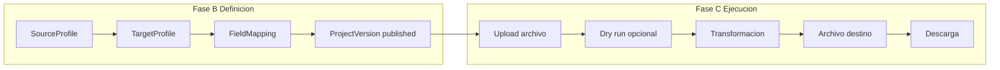
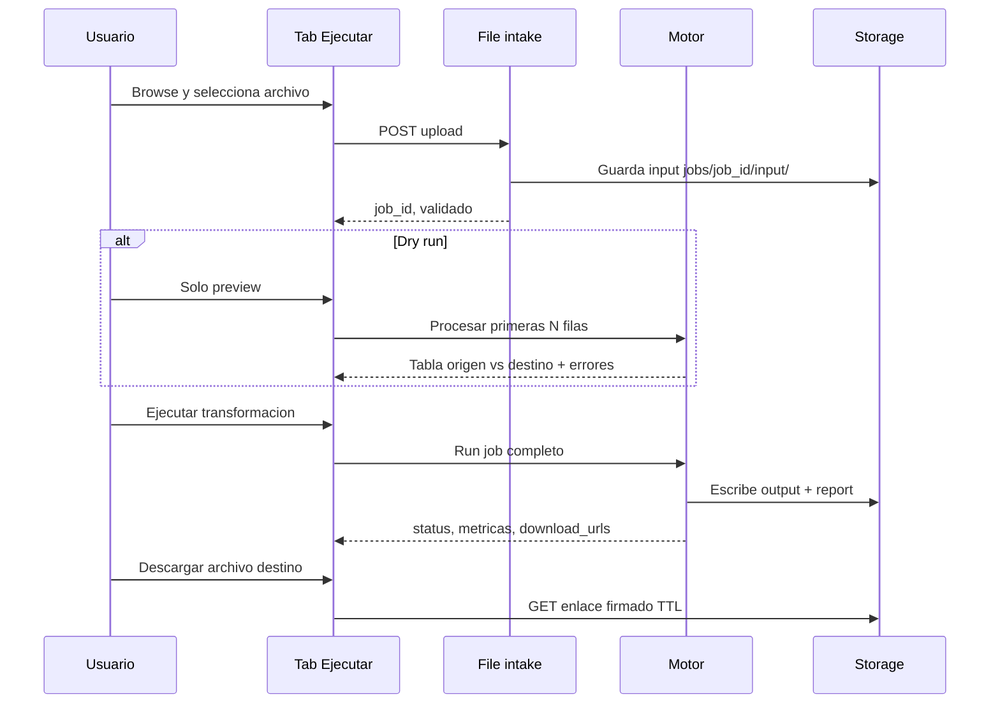

# Transform execution

Proceso y especificación del **módulo de ejecución** (Fase C) en Data Mapping Studio: dry run, transformación completa, generación del archivo destino, informe y descarga.

> Estado: **MVP implementado** (dry run, job síncrono, parsers texto/Excel/JSON/XML, informe localizado, descarga firmada TTL 7 días, historial).  
> Prerrequisitos: `DmsMappingVersion` publicada con perfiles y mapeos. Proyecto `apps.projects.Project` con `project_kind=dms`.  
> Carga del archivo de entrada: [`file_intake.md`](file_intake.md). Integración: [`dms_integration.md`](dms_integration.md).  
> Mensajes UI: [`../definition_app/UI_MESSAGES.md`](../definition_app/UI_MESSAGES.md) §3.8.  
> Códigos de informe: [`system_catalogs.md`](system_catalogs.md) §7 (`ExecutionErrorCode`).
---

## Propósito

Ejecutar el pipeline de transformación sobre un **archivo de producción** subido por el usuario, producir el **archivo destino** según `TargetProfile` y entregar al usuario un **enlace de descarga** — sin que el usuario elija carpeta de salida en el servidor.

El nombre del archivo destino se resuelve desde `TargetProfile.layout.output_filename_pattern` definido en la fase de configuración (`target_definition.md`).

---

## Posición en el ciclo



| Paso lifecycle | Acción | Este documento |
|----------------|--------|----------------|
| C1 | Seleccionar archivo | § Upload — `file_intake.md` |
| C2 | Preview / dry run | § Dry run |
| C3 | Ejecutar transformación | § Ejecución completa |
| C4 | Descargar salida + informe | § Descarga |
| C5 | Historial | § Historial |

---

## Alcance

| Incluido | Excluido |
|----------|----------|
| Flujo tab **Ejecutar** e historial | Definición origen / destino / mapeo |
| Dry run (primeras N filas) | Upload y browse (`file_intake.md`) |
| Job síncrono MVP / asíncrono Fase 2 | Scheduling recurrente (Fase 3) |
| Nombre y ruta **interna** del archivo destino | API REST pública (Fase 3) |
| Enlace de descarga con TTL | El usuario elige carpeta local al guardar en su PC |

---

## Interfaz — tab Ejecutar

| Bloque | Contenido |
|--------|-----------|
| **Versión** | Solo `DmsMappingVersion` con `status = published` |
| **Archivo de entrada** | Botón browse + zona upload — ver `file_intake.md` |
| **Opciones** | Checkbox «Preview primeras 100 filas» (dry run antes de job completo) |
| **Acciones** | `Solo preview` · `Ejecutar transformación` |
| **Resultado** | Tras completar: enlaces **Descargar archivo destino** · **Descargar informe** · resumen filas OK/rechazadas |

**Permiso requerido:** rol de proyecto con derecho a ejecutar — `PA`, `ED` o `GE` (ver [`dms_integration.md`](dms_integration.md)).

**Regla:** sin versión publicada → botones deshabilitados + mensaje «Publica una versión antes de ejecutar».

---

## Flujo de ejecución



---

## Dry run (preview)

| Parámetro | Default | Descripción |
|-----------|---------|-------------|
| `preview_row_limit` | 100 | Filas máximas a procesar |
| `include_errors` | true | Resaltar filas con error |
| `side_by_side` | true | Columnas origen parseado \| destino generado |

No genera archivo destino persistente en storage (opcional: archivo temporal descartable). No incrementa contador de ejecución en historial (o se registra como `job_type: preview` sin output).

---

## Ejecución completa

### Pipeline (por fila)

```
Leer input (SourceProfile + parser)
  → Mapeo (FieldMapping)
  → Reglas (transform_pipeline)
  → Validar destino (TargetProfile.write_validation)
  → Acumular fila para serializer
Escribir archivo destino (TargetProfile + serializer)
Generar informe (SourceProfile.processing_report + métricas job)
```

### Modos de ejecución

| Modo | Cuándo | Comportamiento |
|------|--------|----------------|
| **Síncrono** | Archivo ≤ 50 MB, MVP | UI espera; muestra progreso |
| **Asíncrono** | Archivo > 50 MB, Fase 2 | Cola Celery/RQ; notificación o polling en UI |

---

## Archivo destino — nombre y ubicación

### Lo que define el usuario (en Fase B)

En **Target definition — Paso 3**, el diseñador configura el patrón de nombre:

```json
"layout": {
  "output_filename_pattern": "nomina_{date:%Y%m%d}.csv"
}
```

### Variables del patrón

| Variable | Resuelve a | Ejemplo |
|----------|------------|---------|
| `{project}` | `Project.name_short` | `nomina-sap` |
| `{project_name}` | `Project.name` (sanitizado) | `Nomina_SAP_CSV_RRHH` |
| `{date}` | Fecha ejecución `YYYYMMDD` | `20250712` |
| `{date:%Y%m%d}` | Formato strftime | `20250712` |
| `{datetime}` | Fecha-hora ejecución ISO compacto | `20250712T091430` |
| `{job_id}` | Primeros 8 chars del UUID del job | `a1b2c3d4` |
| `{version}` | `ProjectVersion.version_number` | `2` |
| `{ext}` | Extensión del `TargetFileType` | `.csv` |

**Ejemplo resuelto:** `nomina-sap_20250712_v2.csv`

Si el patrón no incluye extensión, el sistema añade la del `TargetFileType` activo. Tokens válidos: catálogo **`FilenamePatternVariable`** (`system_catalogs.md` Catálogo 8).

### Lo que NO elige el usuario

| Tema | Decisión |
|------|----------|
| Carpeta en servidor | Fija por convención interna |
| Ruta expuesta en API | Solo `download_url` firmada; no path absoluto |
| Carpeta local al descargar | La elige el usuario en el diálogo **Guardar como** del navegador |

### Ubicación interna en servidor

```
{MEDIA_ROOT}/dms/
  {company_id}/
    projects/{project_id}/
      jobs/{job_id}/
        input/{stored_input_filename}
        output/{resolved_output_filename}
        reports/
          report.json
          report.csv
          errors.csv
```

| Archivo | Nombre | Origen del nombre |
|---------|--------|-------------------|
| Input | `{uuid}_{basename_sanitizado}` | Upload — `file_intake.md` |
| **Output** | `{resolved_output_filename}` | `output_filename_pattern` + variables |
| Informe JSON | `report.json` | Fijo |
| Informe errores | `errors.csv` | Fijo |

---

## Descarga

| Recurso | Método MVP | TTL enlace |
|---------|------------|------------|
| Archivo destino | GET enlace firmado (token en query o path) | **7 días** |
| Informe JSON | Idem | 7 días |
| Informe CSV errores | Idem | 7 días |

Tras expirar TTL: el registro permanece en **Historial** con metadatos; el binario ya no está disponible (mensaje «Archivo expirado»).

**Headers sugeridos al descargar:**

```
Content-Disposition: attachment; filename="nomina-sap_20250712_v2.csv"
Content-Type: text/csv; charset=utf-8
```

El `filename` del header coincide con `resolved_output_filename` para que el browse local del usuario sugiera el nombre correcto.

---

## Modelo conceptual: `DmsExecutionJob`

| Campo | Tipo | Descripción |
|-------|------|-------------|
| `id` | UUID | PK |
| `project_id` | FK | — |
| `project_version_id` | FK | `DmsMappingVersion` publicada usada |
| `job_type` | enum | `preview` \| `full` |
| `status` | enum | `uploaded` \| `queued` \| `running` \| `completed` \| `partial` \| `failed` \| `cancelled` |
| `input_original_filename` | string | Nombre del usuario |
| `input_stored_path` | string | Ruta relativa input |
| `input_size_bytes` | integer | — |
| `input_content_hash` | string | SHA-256 |
| `output_filename` | string | Nombre resuelto (solo `full` completado) |
| `output_stored_path` | string | Ruta relativa output |
| `output_size_bytes` | integer | — |
| `report_path` | string | Ruta `report.json` |
| `rows_read` | integer | Métricas |
| `rows_ok` | integer | — |
| `rows_rejected` | integer | — |
| `started_at` / `finished_at` | datetime | — |
| `executed_by_id` | FK | Usuario |
| `error_message` | text | Si `failed` |

### Estados

| status | Significado |
|--------|-------------|
| `completed` | Todas las filas OK |
| `partial` | Job terminó; hubo filas rechazadas |
| `failed` | Abort por política o error fatal |
| `running` | En proceso |

---

## Informe de ejecución

Combina contrato de `SourceProfile.processing_report` con métricas del job.

```json
{
  "job_id": "a1b2c3d4-e5f6-…",
  "project_version": 2,
  "status": "partial",
  "input": {
    "original_filename": "nomina_julio.txt",
    "size_bytes": 2457600
  },
  "output": {
    "filename": "nomina-sap_20250712_v2.csv",
    "download_url": "/api/dms/jobs/a1b2…/download/output/?token=…",
    "expires_at": "2025-07-19T09:14:30Z"
  },
  "summary": {
    "rows_read": 1240,
    "rows_ok": 1235,
    "rows_rejected": 5,
    "reject_rate_percent": 0.4
  },
  "row_errors": [
    {
      "line": 42,
      "field": "salario",
      "code": "CONTENT_TYPE_MISMATCH",
      "message": "Valor no cumple el tipo de contenido esperado (campo «salario», tipo «numeric»).",
      "value": "ABC"
    }
  ],
  "messages": [
    {
      "level": "warning",
      "code": "CAPTURE_OUT_OF_RANGE",
      "text": "El archivo tiene 3 línea(s); la captura pedía hasta 100. Se procesó hasta el final disponible."
    }
  ]
}
```

Los códigos `code` referencian **`ExecutionErrorCode`** (Catálogo 7); `message` / `text` se resuelven en tiempo de informe (y dry-run) desde `description` (plantilla) o `name` vía `execution_error_catalog_service` — también en `errors.csv`.

---

## Tab Historial

Listado de `DmsExecutionJob` con `job_type = full` (excluir previews o mostrarlos filtrados).

| Columna | Campo |
|---------|-------|
| Fecha | `finished_at` |
| Usuario | `executed_by` |
| Versión | `project_version.version_number` |
| Archivo entrada | `input_original_filename` |
| Archivo salida | `output_filename` |
| Filas OK | `rows_ok` |
| Estado | `status` |
| Acciones | Descargar salida · Descargar informe (si TTL vigente) |

Permiso: `view` para listar; `execute` para nuevas ejecuciones.

---

## Validaciones

| Regla | Comportamiento |
|-------|----------------|
| Sin versión `published` | No ejecutar |
| Input no subido | No ejecutar |
| `execute` sin membresía | 403 |
| Output pattern inválido | Error al iniciar job; log admin |
| Disco lleno / storage error | `failed` + mensaje |
| Job concurrente mismo proyecto | MVP: permitir; Fase 2: opción cola por proyecto |

---

## Casos de uso

### TE-01 — Ejecución mensual nómina

| | |
|---|---|
| **Actor** | Operador |
| **Flujo** | Ejecutar → browse `nomina_julio.txt` → ejecutar → descargar `nomina-sap_20250712_v2.csv` |
| **Resultado** | Job en historial; CSV en carpeta local del usuario |

### TE-02 — Dry run antes de producción

| | |
|---|---|
| **Flujo** | Subir archivo → Solo preview → revisar 5 errores → Ejecutar transformación |
| **Resultado** | Confianza antes del job completo |

### TE-03 — Descarga tras 7 días

| | |
|---|---|
| **Flujo** | Usuario abre historial job antiguo |
| **Resultado** | Metadatos visibles; enlace descarga «Archivo expirado»; puede re-ejecutar con mismo archivo si input aún existe |

### TE-04 — Ejecución parcial

| | |
|---|---|
| **Flujo** | 15 filas rechazadas por `CONTENT_TYPE_MISMATCH` |
| **Resultado** | `status: partial`; output con filas OK; `errors.csv` descargable |

---

## Consideraciones

| Tema | Decisión |
|------|----------|
| ¿Usuario elige carpeta destino en servidor? | **No** — solo descarga |
| ¿Nombre destino? | `output_filename_pattern` en `TargetProfile` |
| ¿Re-ejecutar mismo input? | Sí si input no expiró; nuevo job, nuevo output |
| Preview en definición vs ejecución | Definición: `SampleFile`; ejecución: `ExecutionJob` |
| Informe origen vs job | Origen define *qué* incluir; ejecución genera el archivo |

---

## Implementación en código (MVP)

| Pieza | Ubicación | Estado |
|-------|-----------|--------|
| Parser origen | `source_parser_service.py` | MVP (`txt_fixed`, `csv`, `txt_delimited`, `xlsx`, `json`, `xml`) |
| Captura / bounds | `capture_boundary_service.py` | MVP (patrón, blancos, B+E) |
| Mensajes informe | `execution_error_catalog_service.py` | MVP (localiza desde `ExecutionErrorCode`) |
| Informe JSON/CSV/HTML | `execution_report_service.py` | MVP |
| Mapeo + generadores + pipeline | `row_mapping_service.py` | MVP |
| Serializer destino | `target_serializer_service.py` | MVP (texto + JSON/XML/XLSX) |
| Orquestación job | `execution_service.py` | MVP |
| Descarga firmada | `download_token_service.py` | MVP |
| UI Ejecutar / Historial | `/proyectos/<slug>/ejecutar/` | MVP |

## Pendiente de definir

- [x] Upload + dry run + job síncrono + descarga TTL
- [x] Historial con descargas
- [x] Parser XLSX / JSON / XML
- [x] Localización mensajes informe (`ExecutionErrorCode`)
- [ ] Notificación por email al completar job asíncrono
- [ ] Re-ejecutar desde historial sin re-subir
- [ ] Job asíncrono archivos >50 MB (Fase 2)
- [ ] Webhooks (Fase 3)
- [ ] Cuota de almacenamiento por organización

---

## Fase

| Alcance | Fase | Código |
|---------|------|--------|
| Upload + dry run + job síncrono + descarga TTL | MVP | Hecho |
| Historial con descargas | MVP | Hecho |
| Parsers texto / Excel / JSON / XML + informe localizado | MVP | Hecho |
| Job asíncrono archivos grandes | Fase 2 | Pendiente |
| API REST ejecución | Fase 3 | Pendiente |

---

## Documentos relacionados (DMS)

| Documento | Relación |
|-----------|----------|
| `file_intake.md` | Browse, upload, validación input |
| `project_lifecycle.md` | Fase C, permisos, tab Ejecutar |
| `target_definition.md` | `output_filename_pattern`, serialización |
| `source_definition.md` | `processing_report`, parsers |
| `field_mapping.md` | Pipeline de mapeo |
| `transform_rules.md` | Catálogo y runtime de `transform_pipeline` (**definición lista**) |
| `dms_integration.md` | Modelos, roles, storage |
| `system_catalogs.md` | `ExecutionErrorCode`, `FilenamePatternVariable`, `TargetFileType` |
