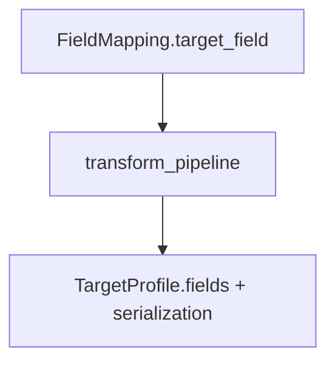
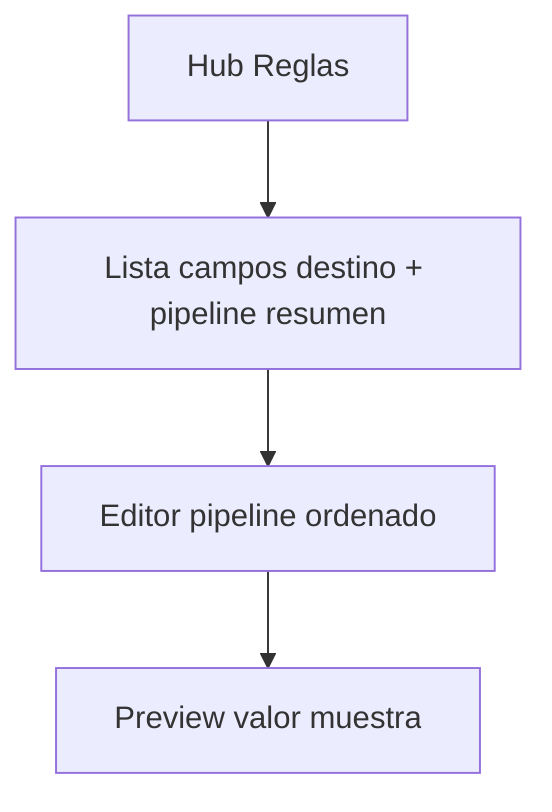

# Transform rules

Proceso y especificación del **Módulo 3** de Data Mapping Studio: catálogo y aplicación de **reglas de transformación** sobre el valor ya resuelto de cada campo destino, antes de validar y serializar la salida.

> Estado: **MVP + ops avanzadas + plantillas + preview muestra implementados** (hub + editor, `TransformOperation`, `TransformPipelineTemplate`, preview literal/muestra).  
> Persistencia: `FieldMapping.transform_pipeline` (sin modelo Django aparte).  
> Plataforma: [`dms_integration.md`](dms_integration.md).  
> Mensajes UI: [`../definition_app/UI_MESSAGES.md`](../definition_app/UI_MESSAGES.md) §3.8.

---

## Propósito

Permitir que el usuario declare, por campo destino, una **cadena ordenada de operaciones** (`transform_pipeline`) que normaliza o transforma el valor después del mapeo (o del generador) y **antes** de la validación/escritura del destino.

Sin este módulo el mapeo solo copia/concatena/genera; aquí se cubre trim, mayúsculas, formatos de fecha, relleno semántico, mapa de códigos, etc.

Ejemplo de ciclo de datos: origen 3 campos → destino 7 campos (mapeo) → varios destinos con `upper` / `date_format` / `default_if_empty` (este documento).

---

## Posición en el pipeline


| Etapa | Documento | Responsabilidad |
|-------|-----------|-----------------|
| Valor bruto destino | [`field_mapping.md`](field_mapping.md) | `direct`, `constant`, `concat`, `generated`, … |
| **Transformar valor** | **Este documento** | Pipeline por campo |
| Formato físico al escribir | [`target_definition.md`](target_definition.md) Paso 5 | Padding posicional, truncate de layout, boolean 1/0 |
| Validar y rechazar filas | `target_definition.md` Paso 6 | `required`, tipo, longitud |
| Ejecutar | [`transform_execution.md`](transform_execution.md) | Motor aplica todo en job |

**Orden por campo destino (fila a fila):**

1. Resolver valor (`mapping_kind` + generador).
2. Aplicar `transform_pipeline` en orden (este módulo).
3. Aplicar políticas de escritura / `serialization` del `TargetProfile`.
4. Validar y escribir.

---

## Relación con otros módulos



| Módulo | Rol respecto a reglas |
|--------|------------------------|
| **Field mapping** | Dueño del registro: cada mapeo lleva su `transform_pipeline` |
| **Transform rules** | Catálogo de `op`, parámetros, UI de edición, validación del pipeline |
| **Target definition** | No define `upper`/`replace_map`; sí padding **de layout** y formato de escritura |
| **System catalogs** | Catálogo administrable `TransformOperation` (ops MVP + avanzadas) |

### Frontera transform vs serialización destino

| Necesidad | Dónde |
|-----------|--------|
| Quitar espacios / mayúsculas / mapa de códigos | **Transform rules** |
| Convertir `"01/02/2025"` → `"2025-02-01"` (lógica de valor) | **Transform rules** (`date_format`) |
| Rellenar con ceros a 8 posiciones porque el TXT posicional lo exige | Preferir **Target** `serialization.pad_left` |
| Representar boolean como `1`/`0` al escribir | **Target** `boolean_format` |
| Valor vacío → literal de negocio antes de validar `required` | **Transform** `default_if_empty` (o `default_value` en destino) |

Si ambas capas definen pad/date: el motor aplica primero transform y luego serialización destino. En MVP se recomienda **no duplicar**: pad de ancho fijo en destino; pad “de negocio” en transform solo si debe persistir como valor lógico.

---

## Alcance

| Incluido | Excluido |
|----------|----------|
| Catálogo de operaciones `op` + parámetros | Definir campos origen/destino |
| Pipeline ordenado por `target_field` | `mapping_kind` / generadores |
| Validación de pipeline al guardar / publicar | Motor de serialización del archivo |
| Preview de valor (literal o 1ª fila muestra) | Historial de ejecuciones |
| UI Fase B «Reglas» (hub + editor) + plantillas | Expresiones de mapeo (→ `expression` en `field_mapping.md`) |

---

## Persistencia (MVP)

No hay entidad Django separada en MVP. Las reglas viven en el JSON del mapeo:

```json
{
  "target_field": "nombre",
  "mapping_kind": "direct",
  "source_fields": ["nombre"],
  "transform_pipeline": [
    {"op": "trim"},
    {"op": "upper"}
  ]
}
```

| Artefacto código | Rol |
|------------------|-----|
| `DmsFieldMappingSet.mappings[]` | Contiene `transform_pipeline` por destino |
| `apps.dms.transform_rules` | UI, validación, catálogo y motor |
| `TransformOperation` | Catálogo administrable de `op` |
| Editor mapeo (parcial) | Checkboxes básicos de reglas |

**Opcional futuro:** `DmsTransformRuleSet` 1:1 versión con pipelines indexados por `target_field`, si se quiere editar reglas sin tocar el resto del mapeo. Hoy CRUD de reglas = misma persistencia que `field_mapping`.

---

## Interfaz (Fase B — paso Reglas)

Orden del lifecycle: origen → destino → mapeo → **reglas** → publicar.



| Elemento | Comportamiento |
|----------|----------------|
| Prerrequisito | Debe existir al menos un mapeo activo (o destino con `default_value`) |
| Lista | Una fila por `target_field` mapeado: ops en chips (`trim → upper`) |
| Editor | Añadir / quitar / reordenar pasos; parámetros por `op` |
| Indicadores | Pipeline vacío (ok), op desconocida (error), `date_format` sin `format` (error) |
| Preview | Valor literal o «Usar 1ª fila muestra» (post-mapeo sin pipeline guardado + pipeline del editor) |
| Plantillas | Selector de `TransformPipelineTemplate` → aplica pipeline al campo activo |
| Guardar | Actualiza `mappings[].transform_pipeline` vía persistencia de mapeo |

**URL sugerida:** `/app/filepipe/proyectos/<slug>/reglas/`  
(`dms:transform_rules_hub`, `…_editor`, `…_save` reutilizando o envolviendo `field_mapping_save`).

El editor de mapeo puede seguir mostrando un **resumen** de reglas y atajos MVP; la pantalla Reglas es la vista canónica para pipelines largos y reordenación.

---

## Catálogo de operaciones (`op`)

Cada paso: objeto JSON `{ "op": "<code>", …params }`.  
El motor aplica de izquierda a derecha; el resultado de un paso es entrada del siguiente. Valores `null` / `""` se tratan como vacío salvo que la op defina otra semántica.

### MVP (código + UI Reglas)

| `op` | Parámetros | Efecto | Ejemplo |
|------|------------|--------|---------|
| `trim` | — | Quita espacios extremos | `"  a  "` → `"a"` |
| `upper` | — | Mayúsculas Unicode | `"México"` → `"MÉXICO"` |
| `lower` | — | Minúsculas | `"ABC"` → `"abc"` |
| `date_format` | `format` (requerido), opcional `input_formats`[] | Parsea fecha y formatea salida | → `"2025-02-01"` |
| `pad_left` | `char`, `length` | Rellena izquierda hasta `length` | `"12"` + 0×5 → `"00012"` |
| `pad_right` | `char`, `length` | Rellena derecha | `"AB"` + espacio×4 → `"AB  "` |
| `default_if_empty` | `value` | Si vacío, usa `value` | `""` → `"N/A"` |

**Notas MVP:**

- `date_format.format` usa convención **strftime** Python (`%Y-%m-%d`, `%d/%m/%Y`). Si el valor ya es fecha ISO válida, se reformatea; si no parsea → política de error del job (ver ejecución).
- `pad_*` no trunca si el valor ya supera `length` (la truncación de layout es del destino).
- Ops fuera del set MVP en el JSON → error de validación al guardar/publicar.

### Ops avanzadas (en catálogo `TransformOperation`)

| `op` | Parámetros | Efecto |
|------|------------|--------|
| `replace_map` | `map` objeto `{from: to}` | Sustitución exacta de códigos |
| `replace` | `find`, `replace`, opcional `regex` bool | Reemplazo de texto |
| `substring` | `start`, `length` | Recorte |
| `ltrim` / `rtrim` | — | Trim unilateral |
| `regex_extract` | `pattern`, `group` | Extraer grupo |
| `coalesce` | `fields`[] o literales | Primer no vacío (avanzado; solapa con mapeo) |
| `number_format` | `decimal_places`, `thousands_sep`, `decimal_sep` | Formato numérico de valor |
| `boolean_map` | `true_values`[], `false_values`[], `output_true`, `output_false` | Normalizar booleanos |

Catálogo administrable `TransformOperation` en [`system_catalogs.md`](system_catalogs.md): **implementado** (semilla + CRUD; `is_active` controla UI/validación/motor).

---

## Contrato JSON del pipeline

```json
"transform_pipeline": [
  {"op": "trim"},
  {"op": "date_format", "format": "%Y-%m-%d", "input_formats": ["%d/%m/%Y", "%Y-%m-%d"]},
  {"op": "default_if_empty", "value": "1900-01-01"}
]
```

| Campo del paso | Tipo | Obligatorio | Descripción |
|----------------|------|-------------|-------------|
| `op` | string | Sí | Código del catálogo |
| resto | según `op` | Condicional | Ver tablas |

**Vacío permitido:** `"transform_pipeline": []` — el valor del mapeo pasa tal cual a validación destino.

---

## Validación

| Regla | Severidad |
|-------|-----------|
| `op` vacío o no en catálogo (fase activa) | Error |
| `date_format` sin `format` | Error |
| `pad_left` / `pad_right` sin `length` > 0 | Error |
| `pad_*` sin `char` (o `char` de más de 1 carácter) | Error |
| `default_if_empty` sin `value` (puede ser `""`) | Advertencia |
| `replace_map` sin `map` | Error |
| Pipeline con más de N pasos (sugerido N=20) | Advertencia |
| Campo destino obligatorio: tras pipeline sigue vacío y sin `default_value` destino | Error en publicar (strict) — misma regla de mapeo |

Al **publicar** versión: validar todos los pipelines de mapeos activos con las reglas anteriores (strict).

---

## Aplicación en ejecución (contrato)

Documento de runtime: [`transform_execution.md`](transform_execution.md). Resumen:

| Situación | Comportamiento sugerido MVP |
|-----------|----------------------------|
| Op desconocida en versión publicada | No debería ocurrir (bloqueo en publish); si ocurre → abort job |
| `date_format` no parseable | Política job: `reject_row` por defecto (alineado a destino) |
| Overflow tras pad (longitud > destino) | Lo resuelve serialización/validación destino, no el transform |

---

## Modelo conceptual (sin tabla propia MVP)

| Concepto | Persistencia |
|----------|--------------|
| Paso de regla | Elemento de `transform_pipeline` |
| Pipeline | Array ordenado en `FieldMapping` (`mappings[]`) |
| Catálogo `op` | `TransformOperation` en BD (`is_active`) |

---

## Casos de uso

### TR-01 — Normalizar nombre

| | |
|---|---|
| **Flujo** | `direct` nombre → `trim` + `upper` |
| **Resultado** | `"  juan perez "` → `"JUAN PEREZ"` |

### TR-02 — Fecha origen distinta a salida

| | |
|---|---|
| **Flujo** | Campo fecha mapeado + `date_format` `%Y-%m-%d` con `input_formats` `%d/%m/%Y` |
| **Resultado** | `"15/03/2025"` → `"2025-03-15"` |

### TR-03 — Código fijo si vacío

| | |
|---|---|
| **Flujo** | `direct` estado + `default_if_empty` `"NE"` |
| **Resultado** | vacío → `"NE"`; con valor → sin cambio |

### TR-04 — ID alfanumérico generado + pad

| | |
|---|---|
| **Flujo** | `generated` secuencia numérica + `pad_left` `0` length 5 |
| **Resultado** | `7` → `"00007"` (valor lógico; el ancho fijo del TXT puede seguir en destino) |

### TR-05 — Pipeline vacío

| | |
|---|---|
| **Flujo** | Mapeo `constant` / `generated` sin reglas |
| **Resultado** | Válido; valor sin transformar |

---

## Consideraciones

| Tema | Decisión |
|------|----------|
| ¿Dónde se editan en MVP hoy? | Atajos en editor de mapeo; pantalla Reglas es el paso lifecycle canónico |
| ¿Duplicar pad en transform y destino? | Evitar; pad de layout en Target |
| ¿Reglas globales a todos los campos? | Plantillas reutilizables (`TransformPipelineTemplate`); se aplican por `target_field` |
| ¿Orden entre campos? | Pipeline es por campo; orden entre campos = `sort_order` del mapeo |
| Mensajes UI | `UI_MESSAGES.md` §3.8 |

---

## Implementación en código

| Pieza | Ubicación | Estado |
|-------|-----------|--------|
| Catálogo ops (BD + fallback) | `transform_catalog_service.py`, modelo `TransformOperation` | Hecho |
| Plantillas pipeline | modelo `TransformPipelineTemplate` + UI aplicar | Hecho |
| Motor `apply_pipeline` | `pipeline_engine_service.py` | Hecho (MVP + avanzadas) |
| Persistencia / validación | `transform_rules_persistence_service.py` | Hecho |
| Preview literal + muestra | `preview_value` / `preview_with_sample_row` | Hecho |
| Hub + editor | `templates/dms/transform_rules/`, `transform_rules-*.js` | Hecho |
| URLs | `/app/filepipe/proyectos/<slug>/reglas/` | Hecho |
| Validación en publish | vía `validate_mappings_dict` → pipelines | Hecho |
| Lifecycle hub | paso Reglas activo | Hecho |

## Pendiente

- [x] UI `/reglas/` (hub + editor + reordenar)
- [x] Motor de aplicación (+ preview)
- [x] Preview con fila de muestra (`file_intake` sample)
- [x] Catálogo MVP completo en UI Reglas (`pad_*`, `default_if_empty`)
- [x] Catálogo `TransformOperation` (admin + motor ops avanzadas)
- [x] Plantillas de pipeline reutilizables

---

## Fase

| Alcance | Fase | Estado |
|---------|------|--------|
| Catálogo ops MVP + contrato JSON | MVP | Hecho |
| Persistencia en `transform_pipeline` del mapeo | MVP | Hecho |
| Hub + editor + preview | MVP | Hecho |
| Motor `apply_pipeline` (preview / ejecución) | MVP | Hecho |
| Ops avanzadas + catálogo admin | MVP | Hecho |
| Preview con fila muestra | MVP | Hecho |
| Plantillas de pipeline reutilizables | MVP | Hecho |

---

## Documentos relacionados (DMS)

| Documento | Contenido |
|-----------|-----------|
| [`field_mapping.md`](field_mapping.md) | Dueño de `transform_pipeline` en cada mapeo |
| [`target_definition.md`](target_definition.md) | Serialización y validación escritura |
| [`project_lifecycle.md`](project_lifecycle.md) | Fase B paso Reglas |
| [`transform_execution.md`](transform_execution.md) | Runtime del pipeline |
| [`system_catalogs.md`](system_catalogs.md) | `TransformOperation` |
| [`source_definition.md`](source_definition.md) | Tipos/contenido origen (no reglas post-mapeo) |
