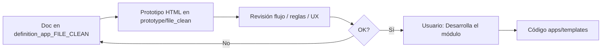

# definition_app_FILE_CLEAN — Definición FILE CLEAN

Carpeta de documentación de análisis y definición para **FILE CLEAN** (Limpieza y normalización de archivos), vertical de la oleada FILE_OPS.

> **Producto:** [`../FILE_CLEAN.md`](../FILE_CLEAN.md)  
> **Familia:** [`../APP_FACTORY_FILE_OPS.md`](../APP_FACTORY_FILE_OPS.md) §2  
> **Rama Git sugerida:** `feature/file-clean` (no desplegar a producción hasta merge a `main`)  
> **Chasis:** `Company`, `UserProfile`, `Project`, `ProjectMembership`, seguridad y billing  
> **Reuso técnico DMS:** parsers, intake, motor de reglas — [`../definition_app_DMS/`](../definition_app_DMS/)  
> **API:** diseño **API-ready**; implementación de [`../PLATFORM_API.md`](../PLATFORM_API.md) **después** de cerrar las apps FILE_OPS

---

## Método de trabajo (por módulo)

Igual que FILE GATE / Match / Reverse / Scout: **definir → prototipar → revisar → implementar solo con OK explícito**.



| Paso | Dónde | Quién |
|------|-------|--------|
| 1. Diseño, alcance, reglas, validaciones | `docs/definition_app_FILE_CLEAN/<modulo>.md` | Agente + revisión |
| 2. HTML demo | `prototype/file_clean/` | Agente |
| 3. Revisión de flujo | Chat / demo | Usuario |
| 4. Implementación Django | `apps/file_clean/`, `templates/file_clean/` | **Solo si el usuario dice «Desarrolla el módulo»** |

---

## Documentos (por módulo)

| Archivo | Módulo | Contenido | Estado |
|---------|--------|-----------|--------|
| [`../FILE_CLEAN.md`](../FILE_CLEAN.md) | Producto | Visión, alcance, reglas FC*, API-ready | **Lineamientos** |
| [`project_lifecycle.md`](project_lifecycle.md) | **1** | Alta, listado, hub, miembros | **Implementado** · prototipo listo |
| [`clean_profile.md`](clean_profile.md) | **2** | Perfil de lectura (source-like) | **Implementado** · prototipo listo |
| [`clean_rules.md`](clean_rules.md) | **3** | Catálogo y orden de reglas | **Implementado** · prototipo listo |
| [`clean_publish.md`](clean_publish.md) | **4** | Publicar versión | **Implementado** · prototipo listo |
| [`clean_run.md`](clean_run.md) | **5** | Upload, preview, job, artifacts | **Implementado** · prototipo listo |
| [`clean_history.md`](clean_history.md) | **6** | Historial de jobs | **Implementado** · prototipo listo |
| [`fc_integration.md`](fc_integration.md) | Transversal | Kind, URLs, roles, reuso DMS, PLATFORM_API | **Borrador** |

---

## Prototipos

| Carpeta | Contenido |
|---------|-----------|
| [`../../prototype/file_clean/`](../../prototype/file_clean/) | HTML estáticos por pantalla (revisión de flujo / UX) |

Abrir: [`prototype/file_clean/index.html`](../../prototype/file_clean/index.html)

| Prototipo | Módulo | Destino futuro (tras OK + «Desarrolla el módulo») |
|-----------|--------|-----------------------------------------------------|
| `projects_list.html` | 1 | `templates/file_clean/projects/list.html` |
| `projects_create.html` | 1 | `templates/file_clean/projects/create.html` |
| `projects_hub.html` | 1 | `templates/file_clean/projects/hub.html` |
| `projects_members.html` | 1 | `templates/file_clean/projects/members.html` |
| `profile_hub.html` | 2 | `templates/file_clean/profile/hub.html` |
| `rules_hub.html` | 3 | `templates/file_clean/rules/hub.html` |
| `publish_hub.html` | 4 | `templates/file_clean/publish/hub.html` |
| `run_hub.html` / `run_result.html` | 5 | `templates/file_clean/run/…` |
| `history_hub.html` / `history_detail.html` | 6 | `templates/file_clean/history/…` |

---

## Carpetas de trabajo (objetivo)

| Rol | Ruta |
|-----|------|
| Specs | `docs/definition_app_FILE_CLEAN/` |
| Prototipos | `prototype/file_clean/` |
| Templates Django | `templates/file_clean/<modulo>/` |
| App Django | `apps/file_clean/` |
| CSS / JS | `static/css/file_clean_*.css`, `static/js/file_clean-*.js` |

```
docs/
├── FILE_CLEAN.md
└── definition_app_FILE_CLEAN/
    ├── README.md
    ├── project_lifecycle.md
    ├── clean_profile.md
    ├── clean_rules.md
    ├── clean_publish.md
    ├── clean_run.md
    ├── clean_history.md
    └── fc_integration.md
```

---

## Prioridad de implementación

| Orden | Módulo | Nota |
|-------|--------|------|
| 1 | M1 Proyecto | Kind + hub |
| 2 | M2 Perfil | Reuso máximo source DMS |
| 3 | M3 Reglas | Motor compartido; UI Clean |
| 4 | M4 Publicar | Congelar perfil+reglas |
| 5 | M5 Run | Job + artifacts (API-ready) |
| 6 | M6 Historial | Paridad Gate/Pipe |

---

## Convención

- Copy: **limpieza / normalización**, no “transformación ETL” ni “validación”.  
- Formularios HTML plano; servicios con `ok` / `error_code` / `user_message` ([`UI_MESSAGES.md`](../definition_app/UI_MESSAGES.md)).  
- Toda ejecución productiva = versión publicada.  
- El runner de job no debe acoplarse solo a vistas HTML (futuro PLATFORM_API).

---

## Documentos relacionados

| Documento | Relación |
|-----------|----------|
| [`../FILE_CLEAN.md`](../FILE_CLEAN.md) | Producto |
| [`../APP_FACTORY_FILE_OPS.md`](../APP_FACTORY_FILE_OPS.md) | Paraguas ops |
| [`../PLATFORM_API.md`](../PLATFORM_API.md) | API post-FILE_OPS |
| [`../FILE_GATE.md`](../FILE_GATE.md) | Downstream típico |
| [`../definition_app_DMS/`](../definition_app_DMS/) | Parsers / reglas |
