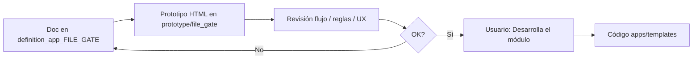

# definition_app_FILE_GATE — Definición FILE GATE

Carpeta de documentación de análisis y definición para **FILE GATE** (Validador de archivos), vertical de DynamicWorkspace.

> **Producto:** [`../FILE_GATE.md`](../FILE_GATE.md)  
> **Rama Git:** `feature/file-gate` (no desplegar a producción hasta merge a `main`)  
> **Chasis:** reutiliza `Company`, `UserProfile`, `Project`, `ProjectMembership`, seguridad y billing.  
> **Reuso técnico DMS:** parsers, catálogos, intake, `ExecutionErrorCode` — ver [`../definition_app_DMS/`](../definition_app_DMS/).

---

## Método de trabajo (por módulo)

Igual que en DMS: **definir → prototipar → revisar → implementar solo con OK explícito**.

| Paso | Dónde | Quién |
|------|-------|--------|
| 1. Diseño, alcance, reglas, validaciones | `docs/definition_app_FILE_GATE/<modulo>.md` | Agente + revisión |
| 2. HTML demo | `prototype/file_gate/` | Agente |
| 3. Revisión de flujo | Chat / demo en navegador | Usuario |
| 4. Implementación Django | `apps/file_gate/`, `templates/file_gate/` | **Solo si el usuario dice «Desarrolla el módulo»** (Módulo 1: hecho) |

---

## Documentos

| Archivo | Módulo | Contenido | Estado |
|---------|--------|-----------|--------|
| [`../FILE_GATE.md`](../FILE_GATE.md) | Producto | Visión, alcance, módulos 1–6 | Definición |
| [`schema_definition.md`](schema_definition.md) | **1** | Contrato / esquema (asistente 6 pasos) | **Implementado** |
| [`gate_policy.md`](gate_policy.md) | **2** | Recolección, corte y umbral de decisión | **Implementado** |
| [`validation_run.md`](validation_run.md) | **3** | Ejecución de validación (upload + job) | **Implementado** (`apps/file_gate/run`) |
| [`validation_report.md`](validation_report.md) | **4** | Informe y evidencia | **Implementado** (`apps/file_gate/report`) |
| [`validation_history.md`](validation_history.md) | **5** | Historial y auditoría | **Implementado** (`apps/file_gate/history`) |
| [`dms_bridge.md`](dms_bridge.md) | **6** | Pre-check FilePipe / vínculo DMS | **Implementado** (`apps/file_gate/bridge`) |
| `fg_integration.md` | Transversal | Kind, URLs, roles, reuso DMS | Pendiente |
| `project_lifecycle.md` | Transversal | Crear proyecto, hub, publicar | Pendiente |

---

## Prototipos

| Carpeta | Contenido |
|---------|-----------|
| [`../../prototype/file_gate/`](../../prototype/file_gate/) | HTML estáticos por pantalla del módulo |

Convención de nombres (espejo DMS):

| Prototipo | Destino futuro (tras OK) |
|-----------|--------------------------|
| `prototype/file_gate/schema_hub.html` | `templates/file_gate/schema/hub.html` |
| `prototype/file_gate/schema_step1_*.html` | `templates/file_gate/schema/step1_*.html` |
| `prototype/file_gate/policy_hub.html` | `templates/file_gate/policy/hub.html` |
| `prototype/file_gate/policy_step*.html` | `templates/file_gate/policy/step*.html` |
| `prototype/file_gate/run_hub.html` | `templates/file_gate/run/hub.html` |
| `prototype/file_gate/run_upload.html` | `templates/file_gate/run/upload.html` |
| `prototype/file_gate/run_result*.html` | `templates/file_gate/run/result*.html` |
| `prototype/file_gate/report_detail.html` | `templates/file_gate/report/detail.html` |
| `prototype/file_gate/report_certificate*.html` | `templates/file_gate/report/certificate*.html` |
| `prototype/file_gate/history_hub.html` | `templates/file_gate/history/hub.html` |
| `prototype/file_gate/bridge_hub.html` | `templates/file_gate/bridge/hub.html` (propuesto) |
| `prototype/file_gate/bridge_dms_settings.html` | Ajustes DMS / `templates/dms/...` (propuesto) |

---

## Convención

- Un documento por módulo (`<tema>.md`).
- Copy de producto: **contrato de validación**, no “origen para transformar”.
- Esquema JSON alineado a `SourceProfile` ([`source_definition.md`](../definition_app_DMS/source_definition.md)); **no** usa `target_definition`.
- Implementación propuesta: app delgada `apps.file_gate` + servicios DMS compartidos.
- Mensajes UI: [`../definition_app/UI_MESSAGES.md`](../definition_app/UI_MESSAGES.md) §3.9.

---

## Índice y estado

| Documento | Estado |
|-----------|--------|
| Producto FILE GATE | [`../FILE_GATE.md`](../FILE_GATE.md) |
| **Módulo 1 — Esquema / contrato** | [`schema_definition.md`](schema_definition.md) — **implementado** (`apps/file_gate`) |
| **Módulo 2 — Políticas** | [`gate_policy.md`](gate_policy.md) — **implementado** (`apps/file_gate/policy`) |
| **Módulo 3 — Ejecución** | [`validation_run.md`](validation_run.md) — **implementado** (`apps/file_gate/run`) |
| **Módulo 4 — Informe** | [`validation_report.md`](validation_report.md) — **implementado** (`apps/file_gate/report`) |
| **Módulo 5 — Historial** | [`validation_history.md`](validation_history.md) — **implementado** (`apps/file_gate/history`) |
| **Módulo 6 — Bridge FilePipe** | [`dms_bridge.md`](dms_bridge.md) — **implementado** (`apps/file_gate/bridge`) |
| Prototipos | `prototype/file_gate/` |
| Navegación UF | Sidebar: FILE GATE → Validador + Ayuda |
