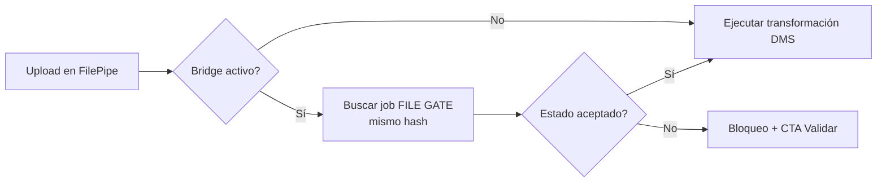

# DMS bridge — FILE GATE Módulo 6 (Fase 2)

Proceso y especificación del **Módulo 6** de FILE GATE: **integración con FilePipe (DMS)** para exigir un gate en verde antes de transformar, y vincular un proyecto FILE GATE con un proyecto DMS de la misma compañía.

> Estado: **implementado** (`apps/file_gate/bridge/` + campos en `DmsProjectConfig`). Documento + prototipos + código Django.  
> Producto: [`../FILE_GATE.md`](../FILE_GATE.md) § Módulo 6 · caso A5 · EJ-05.  
> Rama: `feature/file-gate`.  
> Depende de: M1–M5 implementados (contrato, política, run, informe, historial).  
> FilePipe: [`../definition_app_DMS/transform_execution.md`](../definition_app_DMS/transform_execution.md).  
> Prototipos: [`../../prototype/file_gate/`](../../prototype/file_gate/) (`bridge_*.html`).

---

## Propósito

Permitir que un proyecto **FilePipe / DMS** exija, antes de ejecutar la transformación:

1. que exista un proyecto **FILE GATE** vinculado (misma compañía);
2. que el archivo de entrada tenga una corrida de gate **aceptada** (mismo `content_hash`);
3. que el operador vea con claridad si está **bloqueado** o **listo**, con enlace a validar / evidencia / certificado.

FILE GATE sigue **sin generar destino de negocio**. El bridge solo actúa como **pre-check**: si el gate no está en verde, FilePipe no arranca.



---

## Alcance

| Incluido (Fase 2 MVP del bridge) | Excluido |
|----------------------------------|----------|
| Vincular proyecto DMS ↔ proyecto FILE GATE (1:1) | Compartir / fusionar `SourceProfile` (Fase 2.1) |
| Flag «exigir FILE GATE passed» en proyecto DMS | Bypass permanente sin auditoría |
| Matching por `input_content_hash` | Matching solo por nombre de archivo |
| Política de aceptación: `passed` / `passed_with_warnings` | Aceptar `partial` / `failed` |
| Ventana de frescura del job (p. ej. 7 días) | Re-validar automáticamente al subir a DMS |
| Pantalla bloqueada / lista en Ejecutar DMS | API / webhook de gate (Fase 3) |
| Hub de enlace desde FILE GATE (estado del vínculo) | Historial cross-producto unificado |
| Aviso si tipo de archivo del contrato ≠ origen DMS | Diff / sync automático de esquemas |
| Sello del `gate_job_id` en el job DMS al pasar | Obligar a todos los proyectos DMS de la compañía |

---

## Relación con otros módulos

| Módulo | Qué aporta al bridge |
|--------|----------------------|
| **1 Esquema** | Contrato publicado; tipo de archivo para aviso de desalineación |
| **2 Políticas** | Umbral que define `passed` / `passed_with_warnings` |
| **3 Run** | Job + `input_content_hash` + `gate_result` |
| **4 Informe** | Evidencia / certificado enlazados desde el bloqueo |
| **5 Historial** | Fuente de “último passed” por hash |
| **6 Bridge (este)** | Vínculo + pre-check en Ejecutar FilePipe |

---

## Prerrequisitos

| Condición | Si no se cumple |
|-----------|-----------------|
| Proyecto DMS y proyecto FILE GATE en la **misma compañía** | No se puede vincular |
| Usuario con membresía en ambos (o PA/ED del DMS) | Forbidden / no listar candidatos |
| Contrato FILE GATE **publicado** | Bridge configurable pero pre-check falla con mensaje claro |
| Al menos una corrida final con hash del archivo | Bloqueo: «Valide primero en FILE GATE» |
| Intake DMS calcula hash (ya existe) | Matching imposible → bloquear si bridge activo |

---

## Decisiones de diseño (congeladas para el MVP del bridge)

| # | Tema | Decisión |
|---|------|----------|
| D1 | ¿Dónde vive la config? | En el **proyecto DMS** (quien ejecuta). FILE GATE solo muestra el vínculo. |
| D2 | ¿Perfiles compartidos? | **No** en este MVP. Contratos independientes; el vínculo es de **proyectos**, no de `SourceProfile`. |
| D3 | ¿Cómo se empareja el archivo? | Por **`content_hash` (SHA-256)** del input DMS vs job FILE GATE. |
| D4 | ¿Qué estados abren el paso? | Configurable: solo `passed`, o `passed` + `passed_with_warnings`. Nunca `failed` / `partial` / `error`. |
| D5 | ¿Frescura? | Job gate con `finished_at` dentro de N días (default **7**, alineado al TTL de evidencia). |
| D6 | ¿Override? | **No** en MVP. Si el bridge está activo, nadie salta el gate (ni PA). Override auditado = Fase 2.1. |
| D7 | ¿Migración? | **Sí, esperada** (a diferencia de M3–M5). Extender `DmsProjectConfig` o modelo fino `FileGateBridge`. |
| D8 | Cardinalidad | Un DMS → **un** FILE GATE. Un FILE GATE puede ser referenciado por varios DMS. |

---

## Modelo de configuración (propuesta)

Persistido en el lado DMS (nombres orientativos):

| Campo | Tipo | Descripción |
|-------|------|-------------|
| `file_gate_enabled` | bool | Activa el pre-check |
| `file_gate_project_id` | FK → `Project` (`kind=file_gate`) | Proyecto gate vinculado |
| `file_gate_accept` | enum | `passed` \| `passed_with_warnings` |
| `file_gate_max_age_days` | int | Frescura (default 7; 0 = solo misma sesión / sin límite documentado → preferir ≥1) |
| `file_gate_linked_at` | datetime | Auditoría |
| `file_gate_linked_by` | FK user | Quién vinculó |

Al pasar el pre-check, el job DMS guarda referencia (p. ej. en JSON de sugerencias / campo dedicado):

```json
{
  "file_gate_check": {
    "gate_project_slug": "gate-nomina-sap",
    "gate_job_id": "a1b2c3d4-...",
    "gate_status": "passed",
    "content_hash": "sha256:…",
    "checked_at": "2026-07-25T22:40:01Z"
  }
}
```

---

## Flujo de usuario

### Configurar (PA/ED en FilePipe)

1. Proyecto DMS → **Integración FILE GATE** (ajustes / hub Ejecutar).
2. Activar «Exigir validación FILE GATE antes de transformar».
3. Elegir proyecto FILE GATE de la misma compañía.
4. Elegir aceptación (`passed` o `passed` + advertencias) y frescura.
5. Guardar. El hub FILE GATE muestra el vínculo entrante.

### Ejecutar con bridge (GE en FilePipe)

1. Subir archivo en **Ejecutar** DMS (intake calcula hash).
2. Sistema busca job FILE GATE final del proyecto vinculado con el mismo hash y dentro de la ventana.
3. **Listo** → se muestra certificado resumido + CTA «Ejecutar transformación».
4. **Bloqueado** → mensaje + enlaces: Validar en FILE GATE · Ver historial · (si hay job failed) Ver evidencia.

### Desde FILE GATE

1. Hub proyecto → **Bridge FilePipe**.
2. Ver DMS vinculados, estado del vínculo y CTA «Abrir en FilePipe».
3. No se configura el flag aquí (vive en DMS); solo visibilidad y deep-links.

---

## Pantallas de prototipo

| Pantalla | Archivo | Propósito |
|----------|---------|-----------|
| Hub bridge (FILE GATE) | `bridge_hub.html` | Vínculos entrantes + estado |
| Configurar en DMS | `bridge_dms_settings.html` | Flag, proyecto, política |
| Ejecutar bloqueado | `bridge_blocked.html` | Pre-check fallido + CTAs |
| Ejecutar listo | `bridge_ready.html` | Gate OK + sello + ejecutar |
| Sin vínculo / vacío | `bridge_empty.html` | Aún no hay DMS vinculados |

Recursos: `bridge_definition.css`, `bridge-wizard.js` (toggle flag + paneles demo).

URLs implementadas:

```
# Lado FILE GATE
/app/file-gate/proyectos/<slug>/bridge/          → file_gate:bridge_hub
/app/file-gate/proyectos/<slug>/bridge/ayuda/    → file_gate:bridge_hub_help

# Lado FilePipe (DMS)
/app/dms/proyectos/<slug>/integracion/file-gate/       → dms:file_gate_bridge_settings
/app/dms/proyectos/<slug>/integracion/file-gate/ayuda/ → dms:file_gate_bridge_settings_help
# Pre-check enganchado en transform_execution.run_full_job
```

---

## Roles y permisos

| Acción | PA | ED | GE | CO |
|--------|----|----|----|-----|
| Ver hub bridge en FILE GATE | Sí | Sí | Sí | Sí (solo lectura) |
| Configurar bridge en DMS | Sí | Sí | No | No |
| Ejecutar DMS con bridge activo | Sí* | Sí* | Sí* | No |
| Saltar / desactivar en caliente el check | No (MVP) | No | No | No |

\* Solo si el pre-check pasa. Configurar ≠ bypassear.

---

## Reglas de negocio (módulo 6)

| ID | Regla |
|----|-------|
| B1 | Solo se vinculan proyectos de la **misma compañía** (R8). |
| B2 | El pre-check **no recalcula** el gate; reutiliza el job FILE GATE persistido (espíritu H2). |
| B3 | Matching obligatorio por **hash**; nombre de archivo es informativo, no criterio. |
| B4 | Si `file_gate_enabled` y no hay job aceptable → **no** se crea / no avanza el job de transformación. |
| B5 | `partial`, `failed` y `error` **nunca** abren el paso, aunque la política sea laxa. |
| B6 | Si el proyecto FILE GATE pierde la versión publicada → el check falla con mensaje «contrato no publicado». |
| B7 | Si se desvincula o se apaga el flag → FilePipe vuelve al comportamiento actual (sin gate). |
| B8 | El sello `file_gate_check` en el job DMS es de **auditoría**; no sustituye el informe FILE GATE. |
| B9 | Aviso (no bloqueo duro) si `file_type_code` del contrato gate ≠ origen DMS publicado. |
| B10 | FILE GATE no escribe destino; el bridge no implica transformación ni copia de perfil. |

---

## Validaciones UI / servidor

| Momento | Condición | Severidad |
|---------|-----------|-----------|
| Guardar config DMS | Proyecto gate inexistente / otra compañía / no `file_gate` | Error inline |
| Guardar config DMS | Flag ON sin proyecto seleccionado | Error inline |
| Guardar config DMS | `max_age_days` &lt; 1 o no numérico | Error inline |
| Ejecutar DMS | Bridge ON + sin hash del input | Bloqueo |
| Ejecutar DMS | Bridge ON + sin job matching | Bloqueo + CTA Validar |
| Ejecutar DMS | Job matching con estado no aceptado | Bloqueo + enlace evidencia |
| Ejecutar DMS | Job matching fuera de frescura | Bloqueo + «vuelva a validar» |
| Abrir bridge FG | Sin acceso al proyecto | Forbidden / redirect |

---

## Algoritmo del pre-check (servidor)

```
entrada: dms_project, input_content_hash, now
cfg = dms_project.dms_config.file_gate_*

si not cfg.file_gate_enabled:
    return allow

gate_project = cfg.file_gate_project
si gate_project is None o kind != file_gate o company distinta:
    return block("config_invalid")

si no hay versión publicada en gate_project:
    return block("gate_not_published")

candidates = jobs de gate_project
    con content_hash == input_content_hash
    finalizados (is_job_final)
    finished_at >= now - max_age_days
    orden -finished_at

si vacío:
    return block("no_matching_job")

job = candidates[0]
status = gate_result.status

si cfg.accept == "passed" y status != "passed":
    return block("status_not_accepted", job)
si cfg.accept == "passed_with_warnings" y status not in (passed, passed_with_warnings):
    return block("status_not_accepted", job)

return allow(job)
```

---

## Casos de uso

### FG-B01 — Activar bridge

| | |
|---|---|
| Actor | PA en proyecto DMS «nomina-sap-csv» |
| Flujo | Integración FILE GATE → ON → elegir `gate-nomina-sap` → aceptar `passed_with_warnings` → 7 días → Guardar |
| Resultado | Pre-check activo; hub FILE GATE muestra el vínculo |

### FG-B02 — Ejecutar bloqueado (sin validar)

| | |
|---|---|
| Actor | GE |
| Flujo | Sube `nomina_marzo.txt` a DMS sin haber pasado por FILE GATE |
| Resultado | Pantalla bloqueada; CTA «Validar en FILE GATE» |

### FG-B03 — Ejecutar tras gate failed

| | |
|---|---|
| Flujo | Mismo hash con último job `failed` |
| Resultado | Bloqueo; enlace a evidencia M4 |

### FG-B04 — Ejecutar listo

| | |
|---|---|
| Flujo | Mismo hash con job `passed` reciente |
| Resultado | Banner listo + resumen certificado; puede transformar; job DMS guarda `gate_job_id` |

### FG-B05 — Frescura vencida

| | |
|---|---|
| Flujo | Job `passed` con antigüedad &gt; `max_age_days` |
| Resultado | Bloqueo; pedir re-validación aunque el hash coincida |

### FG-B06 — Desactivar bridge

| | |
|---|---|
| Actor | PA |
| Flujo | Flag OFF → Guardar |
| Resultado | Ejecutar DMS sin pre-check; vínculo puede permanecer inactivo |

---

## Persistencia / impacto técnico

| Pieza | Uso |
|-------|-----|
| `DmsProjectConfig` (+ migración) o `FileGateBridge` | Flag, FK, política, frescura |
| `DmsExecutionJob` (FILE GATE) | Fuente del veredicto + hash |
| `DmsExecutionJob` (DMS) | Destino del sello `file_gate_check` |
| Intake DMS | Ya calcula `input_content_hash` |
| `validation_report_service.is_job_final` / labels | Reuso para no divergir estados |

**Nota:** a diferencia de M3–M5, este módulo **sí prevé migración**. No se implementa hasta *«Desarrolla el módulo»*.

---

## JSON de referencia — resultado del pre-check

```json
{
  "ok": true,
  "gate_project_slug": "gate-nomina-sap",
  "gate_job_id": "a1b2c3d4-…",
  "gate_status": "passed",
  "gate_status_label": "Aprobado",
  "content_hash": "a1b2…f9",
  "finished_at": "2026-07-25T22:40:01Z",
  "published_version": 2,
  "links": {
    "result": "/app/file-gate/.../validar/jobs/<id>/",
    "report": "/app/file-gate/.../validar/jobs/<id>/informe/",
    "certificate": "/app/file-gate/.../validar/jobs/<id>/certificado/"
  }
}
```

Bloqueo:

```json
{
  "ok": false,
  "error_code": "no_matching_job",
  "user_message": "Valide este archivo en FILE GATE antes de transformar. No hay una corrida aceptada con el mismo contenido.",
  "links": {
    "validate": "/app/file-gate/proyectos/gate-nomina-sap/validar/subir/",
    "history": "/app/file-gate/proyectos/gate-nomina-sap/historial/"
  }
}
```

---

## Checklist antes de desarrollar

- [x] Propósito, alcance y frontera con FilePipe definidos.
- [x] Decisiones D1–D8 (hash, aceptación, frescura, sin override, migración).
- [x] Reglas B1–B10 y validaciones UI/servidor.
- [x] Pantallas de prototipo y URLs propuestas.
- [x] Revisión de copy, flujos FG-B01–B06 y UX por el usuario.
- [x] Usuario indica: **«Desarrolla el módulo»**.

---

## Implementación

| Pieza | Archivo |
|-------|---------|
| Migración | `apps/dms/migrations/0014_dmsprojectconfig_file_gate_bridge.py` |
| Modelo | `DmsProjectConfig` (+ `file_gate_*`) |
| Servicio | `apps/file_gate/bridge/services/dms_bridge_service.py` |
| Hub FG | `apps/file_gate/bridge/views.py` + `templates/file_gate/bridge/` |
| Ajustes DMS | `apps/file_gate/bridge/dms_views.py` + `templates/dms/file_gate_bridge/` |
| Pre-check | `execution_service.run_full_job` + columna FILE GATE en hub Ejecutar |
| Estilos | `static/css/file_gate_bridge.css` |

Notas:

- Matching por `input_content_hash`; frescura con `Coalesce(finished_at, created_at)`.
- Sello `file_gate_check` en `input_suggestions` del job DMS al completar (B8).
- Respuesta JSON 409 en Ejecutar con `links` a Validar / Historial / Evidencia.
- Sin override (D6). Flag OFF conserva el FK (B7).

---

## Documentos relacionados

| Documento | Relación |
|-----------|----------|
| [`../FILE_GATE.md`](../FILE_GATE.md) | Producto § Módulo 6, A5, EJ-05 |
| [`validation_run.md`](validation_run.md) | Jobs + hash |
| [`validation_report.md`](validation_report.md) | Evidencia / certificado |
| [`validation_history.md`](validation_history.md) | Fuente de corridas |
| [`../definition_app_DMS/transform_execution.md`](../definition_app_DMS/transform_execution.md) | Punto de enganche del pre-check |
| [`../definition_app_DMS/file_intake.md`](../definition_app_DMS/file_intake.md) | Hash del input |
| [`../definition_app/UI_MESSAGES.md`](../definition_app/UI_MESSAGES.md) §3.9 | Mensajes UI |

---

*Módulo 6 — DMS bridge / FilePipe. Implementado en `apps/file_gate/bridge/` + `DmsProjectConfig`.*
