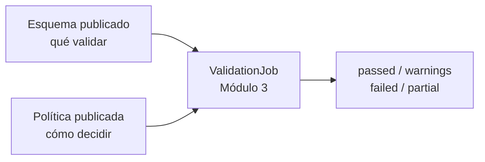
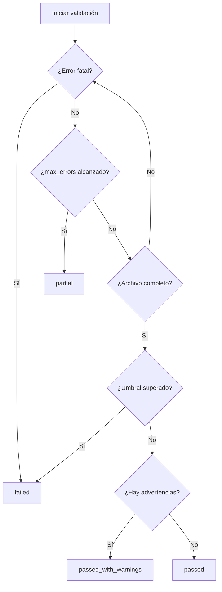
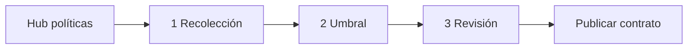

# Gate policy — FILE GATE Módulo 2

Proceso y especificación del **Módulo 2** de FILE GATE: definir cómo se recorren los archivos, cuándo se detiene la recolección de incidencias y qué condiciones determinan el resultado del gate.

> Estado: **implementado** (Módulo 2 — políticas de validación).  
> Producto: [`../FILE_GATE.md`](../FILE_GATE.md) § Módulo 2.  
> Rama: `feature/file-gate`.  
> Código: `apps/file_gate/policy/` · templates `templates/file_gate/policy/` · URLs `/app/file-gate/proyectos/<slug>/politicas/...`.  
> Persistencia: `DmsSourceProfile.config["gate_policy"]` (sin migración).  
> Depende de: [`schema_definition.md`](schema_definition.md) (Módulo 1).  
> Prototipos: [`../../prototype/file_gate/`](../../prototype/file_gate/).

---

## Propósito

Permitir que el diseñador configure, sin programar, la **política de decisión** aplicada a cada validación:

1. cómo recolectar incidencias;
2. cuándo detener el análisis;
3. cuándo un conjunto de filas rechazadas hace fallar el archivo;
4. qué resultado debe comunicar una ejecución incompleta.

La política no define campos ni parsea archivos. El esquema del Módulo 1 responde **qué validar**; este módulo responde **cómo recorrer y decidir**.



---

## Alcance

| Incluido | Excluido |
|----------|----------|
| Estrategia `collect_all` | Subir o almacenar archivos |
| Aborto ante error fatal de parseo | Parsear y validar filas |
| Tope `max_errors` | Persistir `ValidationJob` |
| Umbral por cantidad o porcentaje | Generar informe descargable |
| Vista previa de decisión | Historial de ejecuciones |
| Borrador y publicación con el contrato | `warn_only` / `fail_on_warnings` (Fase 2) |

---

## Decisión de persistencia y versionado

La política es parte del **snapshot publicado**. Una ejecución debe conservar el mismo esquema y la misma política para ser reproducible.

| Tema | Decisión MVP |
|------|--------------|
| Ubicación conceptual | `ValidationProfileVersion.gate_policy` |
| Implementación propuesta sin migración | `DmsSourceProfile.config["gate_policy"]` |
| Edición | Solo en la versión `draft` |
| Publicación | Se congela junto con `DmsSourceProfile` |
| Ejecución | Usa exclusivamente la política de la versión `published` |
| Política ausente (datos anteriores) | Aplicar defaults seguros y registrarlos en el snapshot del job |

No guardar la política únicamente en `FileGateConfig`: esa configuración mutable impediría reproducir una validación histórica.

### Compatibilidad con el Módulo 1 existente

El editor reutilizado de SourceProfile puede contener `processing_report.reject_alert_threshold`. Al desarrollar este módulo:

1. si no existe `gate_policy.reject_threshold`, importar ese valor una sola vez;
2. guardar desde entonces el umbral únicamente en `gate_policy`;
3. dejar el Paso 6 del esquema como configuración del **contenido/formato del informe** y enlace/resumen de la política;
4. no mantener dos valores editables que puedan divergir.

---

## Políticas MVP

| Clave | Tipo | Default | Descripción |
|-------|------|---------|-------------|
| `on_error` | enum | `collect_all` | Estrategia de recolección |
| `abort_on_first_fatal` | boolean | `true` | Detiene ante un error que impide continuar el parseo |
| `max_errors` | integer | `500` | Máximo de incidencias con severidad `error` conservadas |
| `reject_threshold_mode` | enum | `percent` | Unidad del umbral: `count` o `percent` |
| `reject_threshold_value` | decimal | `1.0` | Valor máximo permitido antes de fallar |

### Estrategia `collect_all`

- Recorre el archivo mientras el parser pueda continuar.
- Acumula incidencias hasta `max_errors`.
- No significa recolección ilimitada.
- Al alcanzar el tope, la ejecución termina como `partial` y debe indicar que el archivo no fue recorrido por completo.

### `abort_on_first_fatal`

Un error **fatal** es un fallo estructural que impide determinar de forma confiable la siguiente fila o registro, por ejemplo:

- archivo ilegible o encoding no decodificable;
- estructura JSON/XML inválida sin recuperación;
- hoja XLSX inexistente;
- delimitador/configuración que hace imposible separar registros;
- corrupción del contenedor.

En MVP se mantiene siempre activado. La UI lo muestra para explicar el comportamiento, pero no permite desactivarlo.

### `max_errors`

- Cuenta incidencias con severidad `error`; advertencias e información no consumen el tope.
- Rango MVP: **1–10 000**.
- El motor puede aplicar un límite operativo menor si el contexto de compañía lo exige; deberá informarlo antes de ejecutar.
- Al alcanzar el límite no se infiere que el resto del archivo sea válido.

### `reject_threshold`

Determina el estado final cuando el archivo pudo evaluarse:

| Modo | Fórmula | Ejemplo |
|------|---------|---------|
| `count` | falla si `rows_rejected > value` | valor 10; 11 rechazadas → `failed` |
| `percent` | falla si `(rows_rejected / rows_evaluated) × 100 > value` | valor 1%; 15/1000 → `failed` |

`rows_evaluated = rows_valid + rows_rejected`. No incluye encabezados, comentarios ni filas omitidas por las reglas de captura.

**Semántica del límite:** el valor es el máximo permitido. Se falla al **superarlo**, no al igualarlo. Con valor `0`, cualquier fila rechazada hace fallar.

---

## Severidades

| Severidad | Efecto MVP | Ejemplos |
|-----------|------------|----------|
| `fatal` | Detiene y produce `failed` | archivo corrupto, estructura irrecuperable |
| `error` | Rechaza la fila y participa en umbral / `max_errors` | requerido vacío, tipo o patrón inválido |
| `warning` | Se registra; no rechaza ni falla por sí sola | encoding detectado distinto, columna extra ignorada |
| `info` | Solo evidencia operativa | filas omitidas, detección automática aplicada |

Una fila con varias incidencias `error` cuenta **una vez** en `rows_rejected`, aunque todas las incidencias se registran hasta el límite.

---

## Orden de decisión



Prioridad de resultado: `failed` por fatal > `partial` por corte > `failed` por umbral > `passed_with_warnings` > `passed`.

El estado `partial` no equivale a éxito ni debe habilitar integraciones que exijan un gate verde.

---

## Proceso de configuración

El diseñador recorre tres pasos. Cada paso guarda en borrador.

| Paso | Pantalla | Contenido |
|------|----------|-----------|
| 1 | Estrategia de recorrido | `collect_all`, fatal y `max_errors` |
| 2 | Umbral de rechazo | modo `count` / `percent`, valor y simulador |
| 3 | Revisión | resumen, defaults, casos de decisión y volver a publicar contrato |



La publicación se realiza desde el contrato/versionado del proyecto. No existe una “política publicada” independiente.

---

## Reglas de negocio

| ID | Regla |
|----|-------|
| P1 | Solo `PA` y `ED` editan políticas; solo ellos pueden publicar el contrato. |
| P2 | Toda ejecución usa esquema y política de la misma versión publicada. |
| P3 | Un error fatal siempre produce `failed`, sin importar el umbral. |
| P4 | `collect_all` está limitado por `max_errors` y límites operativos. |
| P5 | Alcanzar `max_errors` antes de EOF produce `partial`, no `passed`. |
| P6 | Advertencias e información no consumen `max_errors`. |
| P7 | Una fila rechazada cuenta una vez para el umbral. |
| P8 | En modo porcentaje, el denominador solo incluye filas evaluadas. |
| P9 | Umbral se supera con `>`; igualdad todavía cumple. |
| P10 | Valor `0` significa tolerancia cero. |
| P11 | Cambiar política crea cambios en borrador; no altera ejecuciones históricas. |
| P12 | Política faltante aplica defaults seguros y genera evidencia explícita. |
| P13 | `warn_only` y `fail_on_warnings` no se exponen en MVP. |
| P14 | CO puede visualizar la política publicada, pero no editarla. |

---

## Validaciones al guardar y publicar

| Campo / condición | Regla | Severidad |
|-------------------|-------|-----------|
| `on_error` | Debe ser `collect_all` en MVP | Error |
| `abort_on_first_fatal` | Debe ser `true` | Error |
| `max_errors` | Entero entre 1 y 10 000 | Error |
| `reject_threshold_mode` | `count` o `percent` | Error |
| umbral `count` | Entero entre 0 y 10 000 000 | Error |
| umbral `percent` | Decimal entre 0 y 100, hasta 4 decimales | Error |
| porcentaje 100 | Válido, pero advertir que solo un fatal/corte haría fallar | Advertencia |
| `max_errors` bajo (1–4) | Válido; advertir alta probabilidad de `partial` | Advertencia |
| política ausente al publicar | Materializar defaults antes de publicar | Acción servidor |

La validación debe ocurrir tanto en UI como en servicio; el servidor es la autoridad.

---

## JSON de referencia

```json
{
  "gate_policy": {
    "policy_version": "1.0",
    "on_error": "collect_all",
    "abort_on_first_fatal": true,
    "max_errors": 500,
    "reject_threshold": {
      "mode": "percent",
      "value": 1.0
    }
  }
}
```

El resultado de ejecución debe registrar una copia de esta política:

```json
{
  "policy_snapshot": {
    "profile_version": 2,
    "on_error": "collect_all",
    "max_errors": 500,
    "reject_threshold": {"mode": "percent", "value": 1.0}
  }
}
```

---

## Pantallas de prototipo

| Pantalla | Archivo | Propósito |
|----------|---------|-----------|
| Hub políticas | `policy_hub.html` | Estado, resumen y acceso a edición |
| Paso 1 | `policy_step1_collection.html` | Estrategia, fatal y `max_errors` |
| Paso 2 | `policy_step2_threshold.html` | Umbral y simulador de resultado |
| Paso 3 | `policy_step3_review.html` | Revisión antes de publicar |

Recursos: `policy_definition.css` y `policy-wizard.js`.

---

## Casos de uso

### FG-P01 — Recolectar incidencias hasta el tope

| | |
|---|---|
| Política | `collect_all`, `max_errors = 500` |
| Archivo | 20 000 filas; error número 500 en la fila 8 400 |
| Resultado | `partial`; se informa corte por límite y que no llegó a EOF |

### FG-P02 — Tolerancia porcentual

| | |
|---|---|
| Política | umbral `1%` |
| Archivo | 1 000 evaluadas; 10 rechazadas |
| Resultado | `passed` (igual al máximo permitido) |

### FG-P03 — Umbral superado

| | |
|---|---|
| Política | umbral `1%` |
| Archivo | 1 000 evaluadas; 11 rechazadas |
| Resultado | `failed` |

### FG-P04 — Fatal antes del umbral

| | |
|---|---|
| Política | tolerancia 100%; `abort_on_first_fatal = true` |
| Archivo | XLSX corrupto |
| Resultado | `failed`; el umbral no se evalúa |

### FG-P05 — Solo advertencias

| | |
|---|---|
| Archivo | 0 rechazadas; 4 advertencias |
| Resultado | `passed_with_warnings` |

---

## Checklist de cierre del módulo

- [x] Alcance MVP y defaults definidos.
- [x] Semántica exacta de umbral (`>`, denominador y tolerancia cero).
- [x] Relación entre fatal, `max_errors`, `partial` y umbral.
- [x] JSON de política y estrategia de versionado.
- [x] Prototipos hub + pasos 1–3.
- [x] Usuario: **«Desarrolla el módulo»**
- [x] App `apps/file_gate/policy` (hub + pasos + guardar)
- [x] Publicación conjunta con contrato (`schema_publish_service`)
- [x] Hub proyecto enlaza políticas; paso 6 del esquema referencia el umbral

---

## Implementación (referencia)

| Pieza | Ubicación |
|-------|-----------|
| Servicios | `apps/file_gate/policy/services/gate_policy_service.py` |
| Vistas / URLs | `apps/file_gate/policy/views.py` · `.../politicas/` |
| Templates | `templates/file_gate/policy/` |
| CSS / JS | `static/css/file_gate_policy.css` · `static/js/file_gate-policy-*.js` |
| Persistencia | `config.gate_policy` en `DmsSourceProfile` |
| Publish | Materializa defaults + valida al publicar contrato |

---

## Documentos relacionados

| Documento | Relación |
|-----------|----------|
| [`schema_definition.md`](schema_definition.md) | Esquema y versión publicada |
| [`../FILE_GATE.md`](../FILE_GATE.md) | Producto y módulos |
| [`../definition_app_DMS/source_definition.md`](../definition_app_DMS/source_definition.md) | Perfil de origen reutilizado |
| [`../definition_app_DMS/transform_execution.md`](../definition_app_DMS/transform_execution.md) | Ejecución DMS de referencia |
| [`../definition_app/UI_MESSAGES.md`](../definition_app/UI_MESSAGES.md) §3.9 | Catálogo de mensajes UI |

---

*Módulo 2 — Gate policy. Implementado en `apps/file_gate/policy` (rama `feature/file-gate`).*
