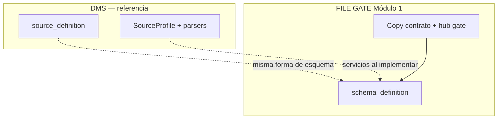
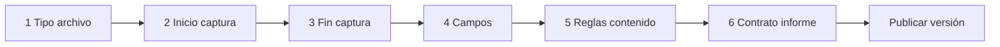
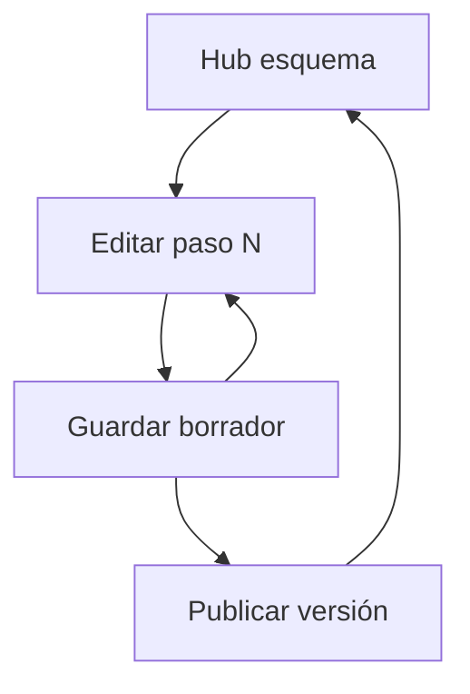

# Schema definition — FILE GATE Módulo 1

Proceso y especificación del **Módulo 1** de FILE GATE: definir el **contrato de validación** de un archivo (esquema) y persistirlo como perfil reutilizable.

> Estado: **implementado** (Módulo 1 — contrato / esquema).  
> Producto: [`../FILE_GATE.md`](../FILE_GATE.md).  
> Rama: `feature/file-gate`.  
> Código: `apps/file_gate/` · templates `templates/file_gate/` · URLs `/app/file-gate/...`.  
> Base técnica reutilizada: [`../definition_app_DMS/source_definition.md`](../definition_app_DMS/source_definition.md) (`DmsSourceProfile`, catálogos, `save_source`, validaciones).  
> **No incluye** destino ni mapeo: fuera de alcance. Publicación FILE GATE es **solo esquema** (`schema_publish_service`).  
> Prototipos de referencia: [`../../prototype/file_gate/`](../../prototype/file_gate/).

---

## Propósito

Permitir que el diseñador configure **paso a paso** qué debe cumplir un archivo para considerarse válido, sin programar y **sin generar un archivo de salida de negocio**.

El resultado es un **contrato / esquema de validación** versionable. El motor de FILE GATE (Módulo 3) lo aplica al subir un archivo real y produce un informe (Módulo 4).

Sin un esquema publicado, no hay ejecución de gate.

---

## Relación con DMS Source definition

| Tema | Decisión |
|------|----------|
| Pasos del asistente | **Mismos 6 pasos** conceptuales que origen DMS |
| Catálogos | Reusar `SourceFileType`, `CharsetEncoding`, `LineEnding`, `CaptureBoundaryMode`, `FieldContentType` |
| Forma del JSON de esquema | Alineada a `source` de `SourceProfile` (+ bloque `gate` / informe propios del contrato) |
| UX / copy | “Contrato de validación”, hub FILE GATE, no hub FilePipe |
| Persistencia | `Project.KIND_FILE_GATE` + `DmsProjectConfig` / `DmsMappingVersion` / `DmsSourceProfile` (mismas tablas; kind aislado de DMS) |
| Código reutilizado | Catálogos, normalización, `save_source`, JS/CSS de SourceProfile; publish propio sin target/mapping |

---

## Alcance de este documento

| Incluido | Excluido (otro módulo / app) |
|----------|------------------------------|
| Tipo de archivo, encoding, line ending | Subir archivo a validar (Módulo 3 + intake) |
| Captura inicio / fin | Políticas `collect_all` / `max_errors` (Módulo 2 — se **referencian** en paso 6) |
| Campos y validaciones por campo | Ejecución del gate / job |
| Reglas globales de contenido | Informe de una corrida concreta |
| Contrato de qué debe contener el informe | Política de decisión (`gate_policy`, Módulo 2) |
| Borrador vs publicar versión del esquema | Target, mapping, transform de salida |
| Hub del esquema + lista de pasos | Integración obligatoria con DMS (Fase 2) |

---

## Responsabilidades

| Sí | No |
|----|-----|
| Asistente 6 pasos del **contrato** | Validar archivos de producción |
| Definir campos y tipos esperados | Generar CSV/Excel de negocio |
| Configurar contrato de informe | Umbrales de decisión (Módulo 2) |
| Persistir borrador y publicar versión | Conciliar dos archivos |

---

## Proceso (asistente paso a paso)

El usuario recorre **6 pasos** en orden. Cada paso persiste borrador; puede volver atrás.

| Paso | Título UX FILE GATE | Equivalente DMS | Contenido |
|------|---------------------|-----------------|-----------|
| 1 | Tipo de archivo del contrato | Paso 1 origen | `SourceFileType` + encoding + line ending |
| 2 | Inicio de captura | Paso 2 | `capture_start` |
| 3 | Fin de captura | Paso 3 | `capture_end` |
| 4 | Campos del contrato | Paso 4 | fields por tipo (fijo / delimitado / xlsx / …) |
| 5 | Reglas de contenido | Paso 5 | `content_rules` |
| 6 | Contrato de informe | Paso 6 | `processing_report`; muestra enlace/resumen del umbral configurado en Módulo 2 |

Detalle de modos, parámetros JSON y semántica de captura: **delegar a** [`source_definition.md`](../definition_app_DMS/source_definition.md) §§ Pasos 1–6 (no duplicar aquí salvo diferencias).

### Diferencias de producto vs DMS en cada paso

| Paso | Diferencia FILE GATE |
|------|----------------------|
| Todos | Eyebrow / títulos: “contrato”, “validación”, no “origen para transformar” |
| 4 | Énfasis en `required`, `pattern`, `content_type` como **criterios de rechazo** |
| 6 | Define contenido/formato del informe. El umbral que alimenta `failed` pertenece a [`gate_policy.md`](gate_policy.md) |
| Post-6 | CTA principal: **Publicar contrato** → habilita “Validar archivo” (aún no ejecuta) |

---

## Flujo de usuario (módulo 1)

1. Abrir proyecto FILE GATE → tab / sección **Esquema**.
2. Ver progreso 0–6 y versión (borrador / publicada).
3. Entrar a un paso → ajustar → guardar borrador.
4. Cuando el contrato esté completo → **Publicar**.
5. Tras publicar: mensaje de éxito; el hub indica que el contrato está listo para validar archivos (Módulo 3).

---

## Reglas de negocio (módulo 1)

| ID | Regla |
|----|-------|
| S1 | Solo `PA` / `ED` editan y publican el esquema. |
| S2 | La edición diaria ocurre en **borrador**. |
| S3 | **Publicar** congela el snapshot; las validaciones usan solo versión `published`. |
| S4 | Publicar exige esquema válido en modo `strict` (mismas reglas base que origen DMS). |
| S5 | Tras publicar se crea nuevo borrador editable (mismo patrón que DMS). |
| S6 | No se puede “validar archivo” sin versión publicada (bloqueo UX + servidor al desarrollar Módulo 3). |
| S7 | Cambiar `file_type_code` con campos ya definidos: advertencia fuerte; confirmar o limpiar campos (igual espíritu DMS). |
| S8 | Tenant: solo miembros del proyecto / visibilidad de compañía según lifecycle FILE GATE. |

---

## Validaciones al guardar / publicar

Reusar la matriz de [`source_definition.md`](../definition_app_DMS/source_definition.md) § Validaciones al guardar, más:

| Regla extra FILE GATE | Severidad |
|-----------------------|-----------|
| Al publicar: al menos un campo | Error |
| Al publicar: `report_enabled` recomendado true | Advertencia si false |
| Contrato sin tipo de archivo | Error |

Canal UI: alineado a [`UI_MESSAGES.md`](../definition_app/UI_MESSAGES.md) §3.9.

---

## Modelo conceptual (módulo 1)

| Concepto | Descripción | Reuso |
|----------|-------------|-------|
| `ValidationSchema` / perfil | JSON de contrato (forma `source` + meta gate) | Alineado a `DmsSourceProfile` |
| `ValidationProfileVersion` | `draft` \| `published` \| `archived` | Análogo a `DmsMappingVersion` (sin target/mappings) |
| Publicar | Congela schema + apunta `current_version` en config FILE GATE | Igual patrón DMS |

Fragmento JSON de referencia: ver [`FILE_GATE.md`](../FILE_GATE.md) §11 y el fragmento `source` en `source_definition.md`.

---

## Pantallas (prototipo)

| Pantalla | Archivo prototipo | Estado |
|----------|-------------------|--------|
| Hub esquema | `schema_hub.html` | Demo |
| Paso 1 | `schema_step1_file_type.html` | Demo |
| Paso 2 | `schema_step2_capture_start.html` | Demo |
| Paso 3 | `schema_step3_capture_end.html` | Demo |
| Paso 4 posicional | `schema_step4_fields.html` | Demo |
| Paso 4 delimitado | `schema_step4_fields_delimited.html` | Demo |
| Paso 5 | `schema_step5_content_rules.html` | Demo |
| Paso 6 | `schema_step6_report.html` | Demo |

CSS: `schema_definition.css` · JS captura: `schema-wizard.js`.

---

## Checklist de cierre del módulo

- [x] Doc `schema_definition.md` (base)
- [x] Flujos hub + pasos 1–6 en prototipo
- [x] Usuario: **«Desarrolla el módulo»**
- [x] App `apps/file_gate` (projects + schema)
- [x] Sidebar UF: FILE GATE → Validador + Ayuda (placeholder)
- [x] Listado / crear / hub proyecto + hub esquema + pasos 1–6 + guardar + publicar esquema
- [x] Copy fino / ayuda detallada (hub + pasos 1–6; copy FILE GATE sin jerga de origen/mapeo)
- [x] Mensajes UI § FILE GATE en `UI_MESSAGES.md` (§3.9)

---

## Implementación (referencia)

| Pieza | Ubicación |
|-------|-----------|
| App | `apps/file_gate/` |
| Proyectos | `apps/file_gate/projects/` · `templates/file_gate/projects/` |
| Esquema | `apps/file_gate/schema/` · `templates/file_gate/schema/` |
| Kind | `Project.KIND_FILE_GATE = "file_gate"` (sin migración nueva) |
| URLs | `/app/file-gate/proyectos/`, `/app/file-gate/proyectos/<slug>/esquema/...`, `/app/file-gate/ayuda/` |
| Publish | `schema_publish_service.publish_draft_schema` (strict source only) |

---

## Casos de uso (módulo 1)

### FG-S01 — Crear contrato TXT posicional

| | |
|---|---|
| **Actor** | Diseñador |
| **Flujo** | Hub → Paso 1 `txt_fixed` + latin-1 → capturas → campos documento/nombre/salario → reglas → informe → publicar v1 |
| **Resultado** | Versión publicada; hub muestra “listo para validar” |

### FG-S02 — Cambiar tipo de archivo a mitad de diseño

| | |
|---|---|
| **Flujo** | Había campos CSV; cambia a `txt_fixed` |
| **Resultado** | Advertencia; campos se invalidan o se piden redefinir |

### FG-S03 — Intentar publicar incompleto

| | |
|---|---|
| **Flujo** | Solo paso 1 hecho → Publicar |
| **Resultado** | Error: faltan campos / pasos obligatorios |

---

## Documentos relacionados

| Documento | Relación |
|-----------|----------|
| [`../FILE_GATE.md`](../FILE_GATE.md) | Visión producto |
| [`README.md`](README.md) | Índice definition_app_FILE_GATE |
| [`../definition_app_DMS/source_definition.md`](../definition_app_DMS/source_definition.md) | Especificación detallada de pasos/JSON |
| [`../definition_app_DMS/system_catalogs.md`](../definition_app_DMS/system_catalogs.md) | Catálogos |
| [`../APP_FACTORY.md`](../APP_FACTORY.md) | Prioridad vertical |

---

*Módulo 1 — Schema definition. Implementado en `apps/file_gate` (rama `feature/file-gate`).*
