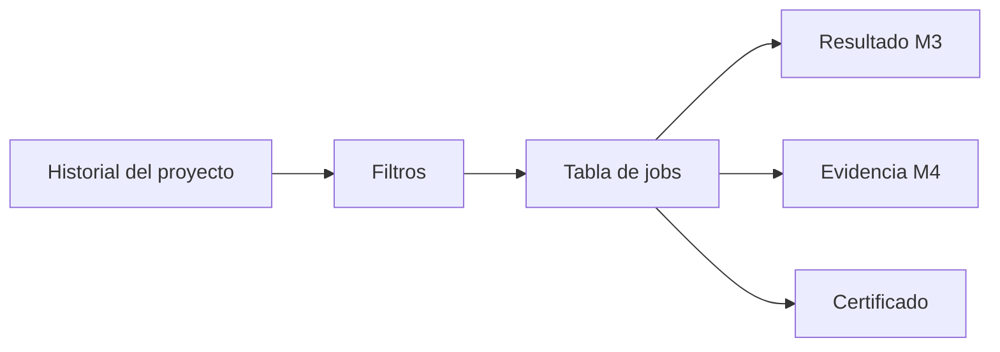

# Validation history — FILE GATE Módulo 5

Proceso y especificación del **Módulo 5** de FILE GATE: **listar, filtrar y auditar** las corridas de validación de un proyecto, con acceso a resultado, evidencia y certificado.

> Estado: **implementado** (`apps/file_gate/history/`). Documento + prototipos + código Django.  
> Producto: [`../FILE_GATE.md`](../FILE_GATE.md) § Módulo 5.  
> Rama: `feature/file-gate`.  
> Depende de: [`validation_run.md`](validation_run.md) (M3 — jobs) + [`validation_report.md`](validation_report.md) (M4 — evidencia / TTL).  
> Prototipos: [`../../prototype/file_gate/`](../../prototype/file_gate/).

---

## Propósito

Permitir que un usuario autorizado **consulte el historial de validaciones** del proyecto:

1. ver corridas recientes y antiguas (metadatos siempre);
2. **filtrar** por estado, fecha, usuario, nombre de archivo, versión del contrato;
3. abrir **resultado** (M3), **evidencia** (M4) o **certificado**;
4. reconocer jobs con **descargas expiradas** (TTL) sin perder la auditoría.

El Módulo 3 ya muestra un preview de “últimas ejecuciones” en el hub de validar. El Módulo 5 es el **listado completo y filtrable** + capa de auditoría.



---

## Alcance

| Incluido | Excluido |
|----------|----------|
| Listado paginado de jobs del proyecto | Ejecutar / re-subir (M3) |
| Filtros: estado, rango de fechas, usuario, archivo, versión | Editar contrato o política |
| Columnas de auditoría (quién, cuándo, hash, métricas) | Diff entre jobs / versiones |
| Badge TTL vigente / expirado | Borrado físico de jobs (Fase 2) |
| Enlaces a resultado, informe, certificado | Export masivo CSV de historial (Fase 2) |
| Vacío / sin resultados de filtro | Historial cross-proyecto / compañía |
| Aislamiento por proyecto + compañía | API de auditoría (Fase 3) |
| CO ve metadatos; sin detalle de filas | Re-ejecutar sin re-subir (Fase 2, como DMS) |

---

## Relación con otros módulos

| Módulo | Qué aporta al historial |
|--------|-------------------------|
| **3 Run** | Crea el job; preview corto en hub Validar |
| **4 Informe** | Destino “Ver evidencia”; regla TTL |
| **5 Historial (este)** | Listado filtrable + auditoría |
| **6 Bridge** | Podrá exigir “último passed” (Fase 2) |

---

## Prerrequisitos

| Condición | Si no se cumple |
|-----------|-----------------|
| Proyecto `file_gate` visible para el usuario | Acceso denegado |
| Membresía o visibilidad compañía (CO) | Forbidden |
| Jobs existen | Estado vacío con CTA a Validar |

---

## Flujo de usuario

1. Proyecto → **Historial** (sidebar / hub).
2. Ver tabla ordenada por fecha (más reciente primero).
3. Aplicar filtros (estado, fechas, usuario, archivo, versión).
4. Abrir Resultado / Evidencia / Certificado según permiso y TTL.
5. Si TTL vencido → badge «Expirado»; metadatos siguen; descargas M4 bloqueadas.

---

## Datos mostrados por fila (auditoría)

Cada corrida registra y el historial muestra:

| Campo | Origen |
|-------|--------|
| Job id | UUID (truncado en lista; completo en detalle) |
| Archivo | `input_original_filename` |
| Tamaño | `input_size_bytes` |
| Hash | `input_content_hash` (truncado en lista) |
| Versión del contrato | `gate_result.published_version_number` / `version` |
| Estado del gate | `passed` / `passed_with_warnings` / `failed` / `partial` / `error` |
| Métricas | leídas, rechazadas, % rechazo |
| Usuario | `executed_by` |
| Inicio / fin | `started_at`, `finished_at` |
| TTL | vigente / expirado (7 días desde `finished_at`) |
| Acciones | Resultado · Evidencia · Certificado |

Orden por defecto: `-finished_at`, `-created_at`.

---

## Filtros (MVP)

| Filtro | Tipo | Notas |
|--------|------|-------|
| `status` | select multi o single | Estados de gate (no solo status DMS) |
| `date_from` / `date_to` | date | Sobre `finished_at` (o `created_at` si falta) |
| `executed_by` | select / texto | Usuarios que ejecutaron en el proyecto |
| `filename` | texto contains | Case-insensitive |
| `version` | número | Versión publicada usada en el job |
| `ttl` | select | `all` / `active` / `expired` |

Sin filtros → últimas N corridas (p. ej. 50; paginación 25/página).

Query string propuesta (GET, sin Django Forms):

```
?status=failed&date_from=2026-07-01&date_to=2026-07-25&filename=nomina&version=2&ttl=active
```

---

## Roles y permisos

| Acción | PA | ED | GE | CO |
|--------|----|----|----|-----|
| Ver historial (metadatos) | Sí | Sí | Sí | Sí |
| Filtrar / paginar | Sí | Sí | Sí | Sí |
| Abrir resultado / evidencia | Según M3/M4 | Según M3/M4 | Según M3/M4 | Resumen/certificado; sin issues |
| Descargar JSON/CSV desde fila | Según M4 | Según M4 | Según M4 | No |
| Eliminar job del historial | Fase 2 (PA) | No | No | No |

---

## Persistencia / reuso técnico

Preferencia: **sin migración nueva**.

| Pieza | Uso |
|-------|-----|
| `DmsExecutionJob` | Fuente de verdad de corridas FILE GATE |
| `input_suggestions["gate_result"]` | Estado gate, métricas, versión |
| `validation_report_service` | TTL, badges, permisos de enlace |
| Listado | Query filtrada por `project` + exclusión `uploaded` |

Criterio de inclusión MVP: jobs con `gate_result` o status final (`completed` / `failed` / `partial`); excluir `uploaded` / `running` / `queued` sin resultado.

---

## Reglas de negocio (módulo 5)

| ID | Regla |
|----|-------|
| H1 | Solo jobs del proyecto actual; sin lectura cruzada entre proyectos/compañías (R8). |
| H2 | El historial **no recalcula** veredictos; muestra lo persistido en el job. |
| H3 | Metadatos permanecen tras TTL; solo fallan descargas de storage (I9 de M4). |
| H4 | Badge «Expirado» cuando `now > finished_at + 7d`. |
| H5 | CO ve listado y puede abrir certificado / resumen; no detalle de filas ni CSV/JSON. |
| H6 | Filtros son aditivos (AND); vacío de resultados ≠ error. |
| H7 | Orden estable: más reciente primero. |
| H8 | No se muestran jobs de otros `project_kind` aunque compartan tablas DMS. |
| H9 | Enlace a evidencia/resultado solo si el job está finalizado. |
| H10 | Contadores del hub (total / failed / passed / expired) reflejan el universo filtrable, no solo la página. |

---

## Validaciones UI / servidor

| Momento | Condición | Severidad |
|---------|-----------|-----------|
| Abrir historial | Sin acceso al proyecto | Forbidden / redirect |
| Filtro fechas | `date_from` > `date_to` | Error inline |
| Filtro versión | No numérico | Error inline |
| Abrir job | Job de otro proyecto | 404 |
| Abrir evidencia | Job no final | Advertencia + volver |
| Acción descargar | CO / TTL | Ocultar o 403/410 (M4) |

---

## Pantallas de prototipo

| Pantalla | Archivo | Propósito |
|----------|---------|-----------|
| Historial | `history_hub.html` | Lista + filtros + badges TTL |
| Vacío | `history_empty.html` | Sin corridas / CTA Validar |
| Sin resultados de filtro | (estado en hub) | Mensaje + limpiar filtros |

Recursos: `history_definition.css`, `history-wizard.js` (filtros demo client-side).

URLs implementadas:

```
/app/file-gate/proyectos/<slug>/historial/          → file_gate:history_hub
/app/file-gate/proyectos/<slug>/historial/ayuda/    → file_gate:history_hub_help
```

---

## JSON de referencia — fila de historial

```json
{
  "job_id": "a1b2c3d4-...",
  "filename": "nomina_marzo.txt",
  "size_bytes": 184320,
  "content_hash": "a1b2…f9",
  "published_version": 2,
  "gate_status": "failed",
  "metrics": {
    "rows_read": 1000,
    "rows_rejected": 15,
    "reject_rate_percent": 1.5
  },
  "executed_by": "ge.usuario@acme.com",
  "finished_at": "2026-07-25T22:40:01Z",
  "ttl_expired": false,
  "links": {
    "result": ".../validar/jobs/<id>/",
    "report": ".../validar/jobs/<id>/informe/",
    "certificate": ".../validar/jobs/<id>/certificado/"
  }
}
```

---

## Casos de uso

### FG-H01 — Listar historial

| | |
|---|---|
| Actor | GE |
| Flujo | Hub proyecto → Historial |
| Resultado | Tabla con corridas recientes + enlaces |

### FG-H02 — Filtrar por failed

| | |
|---|---|
| Flujo | Filtro status=failed |
| Resultado | Solo jobs rechazados |

### FG-H03 — Job expirado

| | |
|---|---|
| Flujo | Job > 7 días |
| Resultado | Badge Expirado; certificado y metadatos OK; descargas M4 no |

### FG-H04 — CO consulta

| | |
|---|---|
| Actor | CO |
| Flujo | Abrir historial → certificado |
| Resultado | Ve metadatos; no issues ni CSV |

### FG-H05 — Sin corridas

| | |
|---|---|
| Flujo | Proyecto nuevo |
| Resultado | Empty state + CTA «Validar archivo» |

---

## Checklist antes de desarrollar

- [x] Campos de auditoría y filtros definidos.
- [x] Relación TTL / M4 y roles CO.
- [x] URLs y pantallas de prototipo.
- [x] Reuso `DmsExecutionJob` sin migración.
- [x] Revisión de copy, H1–H10 y UX por el usuario.
- [x] Usuario indica: **«Desarrolla el módulo»**.

---

## Implementación

| Pieza | Archivo |
|-------|---------|
| Servicio | `apps/file_gate/history/services/validation_history_service.py` |
| Vistas | `apps/file_gate/history/views.py` (`hub`, `hub_help`) |
| URLs | `apps/file_gate/history/urls.py`, montadas en `apps/file_gate/urls.py` |
| Plantillas | `templates/file_gate/history/hub.html`, `hub_help.html` |
| Estilos | `static/css/file_gate_history.css` |
| Entradas | Hub del proyecto (paso 5), hub Validar («Ver historial completo»), informe M4 |

Notas de implementación:

- **Sin migración**: solo lectura de `DmsExecutionJob`; el veredicto sale de `input_suggestions["gate_result"]` (H2).
- Los filtros de **archivo, usuario y fechas** se resuelven en base de datos (`Coalesce(finished_at, created_at)`); los de **estado, versión y TTL** en Python, porque viven en el JSON del job o son calculados.
- Se leen como máximo `MAX_SCAN = 500` corridas recientes por consulta; si se alcanza el tope la pantalla sugiere acotar el rango de fechas.
- Paginación propia de 25 filas por página con enlaces que conservan los filtros; los contadores del resumen cubren todo el conjunto filtrado (H10).
- Los errores de filtro (versión no numérica, rango de fechas invertido) se muestran **inline** junto al campo y la tabla sigue renderizando; no se usa `messages` ni Django Forms.
- Roles y TTL se delegan en `validation_report_service` (`resolve_role`, `is_download_expired`, `ttl_remaining_label`, `is_job_final`), de modo que M4 y M5 nunca discrepan.
- Se listan solo corridas finalizadas: se excluyen `uploaded` / `queued` / `running` y se confirma con `is_job_final` (H9).

---

## Documentos relacionados

| Documento | Relación |
|-----------|----------|
| [`validation_run.md`](validation_run.md) | Creación de jobs |
| [`validation_report.md`](validation_report.md) | Evidencia y TTL |
| [`../FILE_GATE.md`](../FILE_GATE.md) | Producto |
| [`../definition_app_DMS/transform_execution.md`](../definition_app_DMS/transform_execution.md) | Historial / TTL DMS |
| [`../definition_app/UI_MESSAGES.md`](../definition_app/UI_MESSAGES.md) §3.9 | Mensajes UI |

---

*Módulo 5 — Validation history. Implementado en `apps/file_gate/history/`.*
