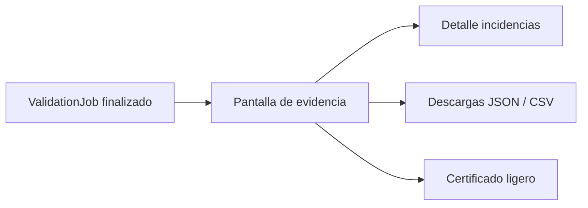

# Validation report — FILE GATE Módulo 4

Proceso y especificación del **Módulo 4** de FILE GATE: entregar **evidencia** de una corrida ya ejecutada (resumen, detalle de incidencias, descargas y certificado ligero).

> Estado: **implementado** (`apps/file_gate/report/`). Reutiliza jobs M3 + storage; sin migración nueva.  
> Producto: [`../FILE_GATE.md`](../FILE_GATE.md) § Módulo 4.  
> Rama: `feature/file-gate`.  
> Depende de: [`validation_run.md`](validation_run.md) (M3 — job + archivos base).  
> Contrato de qué reportar: [`schema_definition.md`](schema_definition.md) paso 6 (`processing_report`).  
> Historial / listado filtrable: [`validation_history.md`](validation_history.md) (Módulo 5 — en diseño).  
> Prototipos: [`../../prototype/file_gate/`](../../prototype/file_gate/).

---

## Propósito

Permitir que un usuario autorizado **consulte y descargue la evidencia** de un `ValidationJob` ya finalizado:

1. **Resumen** (métricas, decisión del gate, snapshots);
2. **Detalle de incidencias** (línea, campo, código, mensaje localizado, valor ofuscable);
3. **Descargas** JSON + CSV (MVP); HTML opcional Fase 2;
4. **Certificado ligero** (hash + versión + resultado + usuario + timestamp) para auditoría / handoff.

El Módulo 3 ya muestra un resultado inmediato y genera archivos base (`gate_report.json`, `gate_issues.csv`). El Módulo 4 **profundiza** la UX de evidencia, ofuscación, permisos de descarga y el certificado.



---

## Alcance

| Incluido | Excluido |
|----------|----------|
| Vista de evidencia por job | Ejecutar / re-ejecutar (M3) |
| Resumen + decisión + snapshots | Editar contrato o política |
| Tabla de incidencias (paginada / tope) | Historial filtrable completo (M5) |
| Ofuscación de valores sensibles en UI/CSV | Certificado HTML avanzado / firma crypto (Fase 2) |
| Descarga JSON + CSV | Regenerar informe tras TTL (solo aviso) |
| Certificado ligero imprimible / descargable | Diff de versiones de contrato |
| Respeto a `processing_report` del contrato | API / webhook de informe (Fase 3) |
| TTL de descarga alineado a DMS (7 días) | Re-subir archivo de entrada |

---

## Relación con otros módulos

| Módulo | Qué aporta al informe |
|--------|----------------------|
| **1 Esquema** | `processing_report` (qué incluir / formatos); campos del contrato |
| **2 Políticas** | Snapshot de umbral / corte en el informe |
| **3 Run** | Job, métricas, issues, archivos base en storage |
| **4 Informe (este)** | UX evidencia, ofuscación, certificado, permisos de descarga |
| **5 Historial** | Entrada al informe desde listado filtrable |

---

## Prerrequisitos

| Condición | Si no se cumple |
|-----------|-----------------|
| Job existe y pertenece al proyecto / compañía | 404 / acceso denegado |
| Job en estado final (`passed` / `passed_with_warnings` / `failed` / `partial` / `error`) | Mensaje: “La validación aún no finalizó” |
| Rol con permiso de ver evidencia (ver § Roles) | Forbidden |
| Archivos de informe aún en storage (TTL) | UX “evidencia expirada” (metadatos sí; descargas no) |

---

## Flujo de usuario

1. Desde resultado M3 o historial M5 → **Ver evidencia / informe**.
2. Ver resumen (veredicto, métricas, decisión, snapshots).
3. Explorar incidencias (filtro por severidad; valor ofuscado por defecto).
4. Descargar JSON y/o CSV.
5. Abrir / imprimir / descargar **certificado ligero**.
6. Si TTL venció → ver aviso; metadatos del job siguen visibles.

---

## Entregables del informe

### 1. Resumen

| Campo | Origen |
|-------|--------|
| Estado del gate | `gate_result.status` |
| Motivo de decisión | `decision.reason` + mensaje |
| Filas leídas / válidas / rechazadas / % | `metrics` |
| Conteos error / warning / info | `metrics` |
| Duración | `metrics.duration_ms` |
| Archivo | nombre, tamaño, `content_hash` |
| Versión publicada | `published_version_number` |
| Política / esquema snapshot | `policy_snapshot`, `schema_snapshot` |
| Ejecutor / timestamps | `executed_by`, `started_at`, `finished_at` |

### 2. Detalle de incidencias

| Campo | Notas |
|-------|-------|
| `line` | Número de línea / registro |
| `field` | Nombre de campo (vacío si es regla de línea) |
| `severity` | `error` / `warning` / `info` |
| `code` | `ExecutionErrorCode` |
| `message` | Localizado vía catálogo DMS |
| `value` | Valor ofuscable (ver § Ofuscación) |

Tope de filas en UI: alineado a política `max_errors` / preview M3 (p. ej. 200). CSV puede contener el conjunto almacenado completo del job.

### 3. Descargas (MVP)

| Artefacto | Contenido |
|-----------|-----------|
| `gate_report.json` | Payload completo (resumen + decision + snapshots + issues) |
| `gate_issues.csv` | Columnas: line, field, severity, code, message, value |

HTML de informe: **Fase 2** (opcional).

Respetar `processing_report` del contrato publicado:

| Flag | Efecto |
|------|--------|
| `report_enabled: false` | Aviso en UI; aún se generan metadatos mínimos del job |
| `include_summary` | Incluir bloque resumen en JSON |
| `include_row_errors` | Incluir issues en JSON/CSV |
| `formats` | Qué botones de descarga mostrar (`json`, `csv`) |

### 4. Certificado ligero

Documento corto (pantalla + descarga texto/JSON) con:

| Campo | Descripción |
|-------|-------------|
| Producto | FILE GATE |
| Proyecto | slug + nombre |
| Job id | UUID |
| Archivo | nombre + tamaño |
| `content_hash` | SHA-256 del input |
| Versión del contrato | número publicado |
| Resultado | estado del gate + reason |
| Métricas clave | leídas / rechazadas / % |
| Usuario | quien ejecutó |
| Timestamps | inicio / fin (ISO) |
| Compañía | nombre (no datos cruzados) |

**No** es firma criptográfica ni sello notarial. Es evidencia operativa reproducible con el hash + snapshots del job.

Fase 2: certificado HTML imprimible con branding / QR opcional.

---

## Ofuscación de valores

| ID | Regla |
|----|-------|
| O1 | Por defecto, la UI muestra valores ofuscados (p. ej. `12***` / `••••`). |
| O2 | PA / ED pueden revelar valores en pantalla (toggle explícito). |
| O3 | GE ve ofuscado en MVP; revelar completo = denegar o solo PA/ED (decidir: **MVP = solo PA/ED revelan**). |
| O4 | CO no descarga CSV/JSON con valores de fila; solo metadatos (alineado a V3 de M3). |
| O5 | CSV/JSON descargados por PA/ED/GE: valores **completos** en MVP (el receptor ya tiene permiso de ejecutar). Alternativa Fase 2: parámetro `?mask=1`. |
| O6 | Campos marcados sensibles en el contrato (Fase 2) forzar ofuscación siempre. |

Algoritmo MVP simple: si `len(value) ≤ 2` → `**`; si no, primeros 2 caracteres + `***`.

---

## Roles y permisos (informe)

| Acción | PA | ED | GE | CO |
|--------|----|----|----|-----|
| Ver resumen / certificado (metadatos) | Sí | Sí | Sí | Sí |
| Ver tabla de incidencias (valores ofuscados) | Sí | Sí | Sí | No* |
| Revelar valores en UI | Sí | Sí | No | No |
| Descargar JSON / CSV | Sí | Sí | Sí | No |
| Imprimir / descargar certificado | Sí | Sí | Sí | Sí |

\*CO: en MVP no ve detalle de filas; solo estado, métricas agregadas y certificado sin valores de celda.

---

## TTL y retención

Alineado a file intake / transform execution DMS:

| Tema | MVP |
|------|-----|
| TTL descargas / archivos de informe | **7 días** desde `finished_at` |
| Tras TTL | Metadatos del job visibles; botones de descarga deshabilitados + mensaje |
| Archivo de entrada | Misma retención; no re-servir tras TTL |
| Regeneración | No en MVP |

---

## Persistencia / reuso técnico

Preferencia: **sin migración nueva**.

| Pieza | Uso |
|-------|-----|
| `DmsExecutionJob` | Job + `input_suggestions["gate_result"]` |
| Storage reports | `gate_report.json`, `gate_issues.csv` (ya generados en M3) |
| `execution_error_catalog_service` | Mensajes localizados |
| `processing_report` del snapshot | Qué mostrar / descargar |
| Download | Sesión autenticada + membresía (MVP); tokens firmados opcionales (como DMS) |

El Módulo 4 **no reescribe** el veredicto; solo presenta y descarga.

---

## Reglas de negocio (módulo 4)

| ID | Regla |
|----|-------|
| I1 | Solo jobs del propio proyecto / compañía (aislamiento R8). |
| I2 | El informe es **inmutable** tras `finished_at`; no se recalcula al cambiar el borrador. |
| I3 | El certificado referencia la versión **usada en el job**, no la publicada actual. |
| I4 | Códigos vía `ExecutionErrorCode`; no inventar mensajes ad hoc en el informe. |
| I5 | `partial` se etiqueta claramente como recorrido incompleto (no éxito). |
| I6 | `error` técnico se distingue de `failed` (archivo no cumple). |
| I7 | Si `include_row_errors` es false, no mostrar tabla ni CSV de issues. |
| I8 | Descarga requiere permiso (tabla de roles); CO denegado para JSON/CSV. |
| I9 | Tras TTL, no servir archivos aunque existan en disco (best-effort cleanup). |
| I10 | Ofuscación por defecto en UI (O1–O3). |

---

## Validaciones UI / servidor

| Momento | Condición | Severidad |
|---------|-----------|-----------|
| Abrir evidencia | Job no encontrado / otra compañía | 404 |
| Abrir evidencia | Sin membresía / rol | Forbidden |
| Abrir evidencia | Job no finalizado | Advertencia + volver a run |
| Revelar valores | Rol no PA/ED | Forbidden / toggle oculto |
| Descargar | CO o sin permiso | Forbidden |
| Descargar | TTL vencido | 410 / mensaje “evidencia expirada” |
| Descargar | Archivo ausente en storage | 410 |
| Certificado | Job `error` técnico | Certificado con estado error (sin afirmar conformidad) |

---

## Pantallas de prototipo

| Pantalla | Archivo | Propósito |
|----------|---------|-----------|
| Evidencia / informe | `report_detail.html` | Resumen + issues + descargas |
| Certificado | `report_certificate.html` | Certificado ligero imprimible |
| Evidencia expirada | `report_expired.html` | Metadatos sin descargas (TTL) |
| Issues ofuscados | (toggle en `report_detail`) | Demo O1/O2 |

Recursos: `report_definition.css`, `report-wizard.js`.

URLs futuras propuestas:

```
/app/file-gate/proyectos/<slug>/validar/jobs/<job_id>/informe/
/app/file-gate/proyectos/<slug>/validar/jobs/<job_id>/certificado/
/app/file-gate/proyectos/<slug>/validar/jobs/<job_id>/descargar/<kind>/
```

(Las descargas ya existen en M3; el Módulo 4 añade la pantalla de evidencia y el certificado.)

---

## JSON de referencia — certificado ligero

```json
{
  "certificate_version": "1.0",
  "product": "FILE GATE",
  "company": "Acme Nómina",
  "project": {
    "slug": "gate-nomina-sap",
    "name": "Gate nómina SAP"
  },
  "job_id": "a1b2c3d4-...",
  "file": {
    "original_filename": "nomina_marzo.txt",
    "size_bytes": 184320,
    "content_hash": "sha256:…"
  },
  "published_version": 2,
  "result": {
    "status": "failed",
    "reason": "reject_threshold_exceeded",
    "message": "El porcentaje de rechazo superó el máximo permitido (1%)."
  },
  "metrics": {
    "rows_read": 1000,
    "rows_valid": 985,
    "rows_rejected": 15,
    "reject_rate_percent": 1.5
  },
  "executed_by": "ge.usuario@acme.com",
  "started_at": "2026-07-25T22:40:00Z",
  "finished_at": "2026-07-25T22:40:01Z"
}
```

---

## Casos de uso

### FG-I01 — Ver evidencia tras failed

| | |
|---|---|
| Actor | GE |
| Flujo | Resultado M3 → Ver evidencia → issues ofuscados → descargar CSV |
| Resultado | Descarga con valores completos; UI ofuscada |

### FG-I02 — Certificado passed

| | |
|---|---|
| Actor | PA |
| Flujo | Job passed → Certificado → imprimir |
| Resultado | Documento con hash + v2 + passed |

### FG-I03 — TTL vencido

| | |
|---|---|
| Flujo | Job con `finished_at` > 7 días |
| Resultado | Metadatos visibles; descargas bloqueadas |

### FG-I04 — CO sin detalle

| | |
|---|---|
| Actor | CO |
| Flujo | Abrir informe |
| Resultado | Resumen + certificado; sin tabla de valores ni JSON/CSV |

### FG-I05 — Contrato sin row errors

| | |
|---|---|
| Contrato | `include_row_errors: false` |
| Resultado | Resumen y certificado; sin sección de incidencias ni CSV |

---

## Checklist antes de desarrollar

- [x] Entregables resumen / detalle / descargas / certificado definidos.
- [x] Ofuscación y matriz de roles.
- [x] TTL 7 días y estado expirado.
- [x] Reuso job M3 + storage + ExecutionErrorCode.
- [x] Prototipos evidencia + certificado + expirado.
- [x] Revisión de copy, O1–O6 e I1–I10 por el usuario.
- [x] Usuario indica: **«Desarrolla el módulo»** → implementado en `apps/file_gate/report/`.

---

## Implementación (estado actual)

| Pieza | Ubicación |
|-------|-----------|
| Servicio (TTL, roles, ofuscación, certificado, auth descarga) | `apps/file_gate/report/services/validation_report_service.py` |
| Vistas | `apps/file_gate/report/views.py` |
| Rutas | bajo `/validar/jobs/<id>/informe|certificado/` en `apps/file_gate/run/urls.py` |
| Plantillas | `templates/file_gate/report/{detail,certificate,detail_help}.html` |
| Estilos / JS | `static/css/file_gate_report.css` · `static/js/file_gate-report.js` |

Decisiones:

- Sin migración. Evidencia sobre `DmsExecutionJob` + `gate_report.json` / `gate_issues.csv` de M3.
- Descarga M3 reforzada: roles (CO denegado), TTL 7 días → 410, flags `processing_report`.
- Certificado JSON descargable aunque el storage haya expirado (solo metadatos).
- Ofuscación UI por defecto; revelar solo PA/ED.
---

## Documentos relacionados

| Documento | Relación |
|-----------|----------|
| [`validation_run.md`](validation_run.md) | Job y archivos base |
| [`schema_definition.md`](schema_definition.md) | `processing_report` |
| [`gate_policy.md`](gate_policy.md) | Snapshot de decisión |
| [`../FILE_GATE.md`](../FILE_GATE.md) | Producto |
| [`../definition_app_DMS/transform_execution.md`](../definition_app_DMS/transform_execution.md) | Informe / TTL descarga |
| [`../definition_app/UI_MESSAGES.md`](../definition_app/UI_MESSAGES.md) §3.9 | Mensajes UI |

---

*Módulo 4 — Validation report. Implementación Django solo tras revisión y OK explícito del usuario.*
