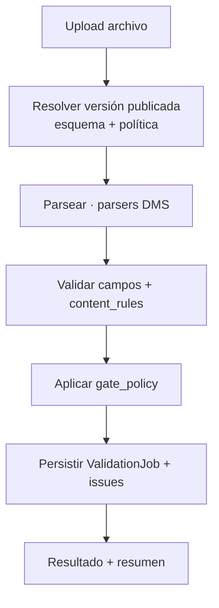
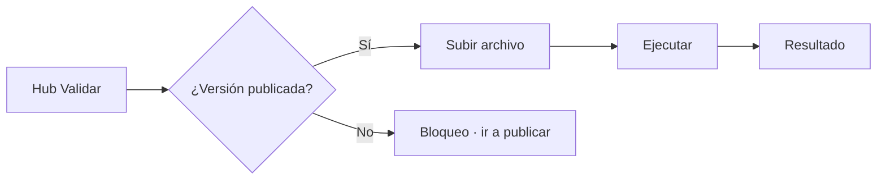

# Validation run — FILE GATE Módulo 3

Proceso y especificación del **Módulo 3** de FILE GATE: ejecutar una validación sobre un archivo real contra el **contrato publicado** y la **política publicada**, produciendo un `ValidationJob` con resultado e incidencias.

> Estado: **implementado** (`apps/file_gate/run/`). Reutiliza `DmsExecutionJob`, parsers y validadores DMS; sin migración nueva.  
> Producto: [`../FILE_GATE.md`](../FILE_GATE.md) § Módulo 3.  
> Rama: `feature/file-gate`.  
> Depende de: [`schema_definition.md`](schema_definition.md) (M1) + [`gate_policy.md`](gate_policy.md) (M2).  
> Informe descargable detallado: [`validation_report.md`](validation_report.md) (Módulo 4 — **implementado**).  
> Historial: [`validation_history.md`](validation_history.md) (Módulo 5 — en diseño).  
> Prototipos: [`../../prototype/file_gate/`](../../prototype/file_gate/).

---

## Propósito

Permitir que un ejecutor (`PA` / `ED` / `GE`) **suba un archivo**, lo valide contra la versión **publicada** del proyecto y obtenga de inmediato:

1. un estado de gate (`passed` / `passed_with_warnings` / `failed` / `partial`);
2. métricas agregadas (leídas, OK, rechazadas, %);
3. un resumen de incidencias;
4. acceso a descargas de evidencia (MVP mínimo aquí; detalle en Módulo 4).

El job **no transforma** ni genera archivo de negocio. Solo lee el archivo de entrada y escribe el resultado del gate.



---

## Alcance

| Incluido | Excluido |
|----------|----------|
| Prerrequisito: versión publicada | Editar esquema o política |
| Upload seguro (browse / drag-drop) | Target / mapping / transform |
| Validación extensión vs contrato | Historial completo filtrable (M5) |
| Ejecución síncrona MVP (request → resultado) | Scheduling / API / webhook (Fase 3) |
| Persistencia de job + métricas + issues | Certificado HTML avanzado (Fase 2) |
| Pantalla de resultado inmediato | Diff de versiones de contrato |
| Bloqueo UX si no hay versión publicada | Pre-check DMS (Módulo 6) |

---

## Relación con otros módulos

| Módulo | Qué aporta a la corrida |
|--------|-------------------------|
| **1 Esquema** | Tipo, encoding, captura, campos, content_rules, contrato de informe |
| **2 Políticas** | `collect_all`, fatal, `max_errors`, umbral de rechazo |
| **3 Run (este)** | Upload + motor + job + resultado inmediato |
| **4 Informe** | Descargas JSON/CSV, detalle ofuscable, certificado |
| **5 Historial** | Listado, filtros, auditoría, TTL |

En MVP el Módulo 3 incluye un **resultado resumido** y enlaces de descarga básicos; el Módulo 4 profundiza evidencia y certificado.

---

## Prerrequisitos de ejecución

| Condición | Si no se cumple |
|-----------|-----------------|
| Proyecto `project_kind = file_gate` | Acceso denegado |
| Existe versión `published` | Bloqueo UX: “Publique el contrato primero” |
| Esquema + política en el snapshot publicado | Error de integridad (no debería ocurrir tras M1/M2) |
| Rol `PA`, `ED` o `GE` | Forbidden |
| Archivo presente y válido (extensión, tamaño, nombre) | Error de validación de upload |



---

## Flujo de usuario

1. Abrir proyecto → **Validar archivo**.
2. Ver contrato/política activos (versión publicada, tipo, umbral).
3. Seleccionar archivo (browse o arrastrar).
4. Confirmar y **Ejecutar validación**.
5. Ver resultado (estado, métricas, top de errores).
6. Descargar informe (JSON/CSV) y/o ir al historial (M5).

---

## Persistencia (propuesta MVP)

Preferencia: **modelo propio liviano** en `apps.file_gate` (sin depender de target/mapping), reutilizando storage y parsers DMS.

| Concepto | Descripción | Reuso |
|----------|-------------|-------|
| `ValidationJob` | Una corrida: archivo, versión publicada, estado, métricas, timestamps | Familiar a `DmsExecutionJob` sin output |
| `ValidationIssue` | Incidencia (línea, campo, código, severidad, mensaje, valor) | JSON embebido o tabla hija |
| Storage | Archivo bajo `MEDIA_ROOT` tenant-safe | Familia `file_intake` / storage DMS |
| Snapshot | Copia de `schema` + `gate_policy` (+ versión) en el job | Reproducibilidad |

### Campos mínimos del job

| Campo | Notas |
|-------|-------|
| `id` | UUID |
| `project` | FK |
| `published_version_number` | Entero de la versión usada |
| `status` | `queued` / `running` / `passed` / `passed_with_warnings` / `failed` / `partial` / `error` |
| `original_filename` | Nombre sanitizado |
| `file_size` / `content_hash` | SHA-256 del contenido |
| `metrics` | JSON: rows_read, rows_valid, rows_rejected, reject_rate_percent, duration_ms, issues_error, issues_warning, issues_info |
| `policy_snapshot` | Copia de `gate_policy` |
| `schema_snapshot` | Resumen o hash del esquema (MVP: version + file_type + fields_count) |
| `created_by` / `started_at` / `finished_at` | Auditoría |
| `error_summary` | Mensaje corto si `status=error` (fallo de infraestructura) |

`status=error` = fallo técnico (storage, timeout, bug), distinto de `failed` (archivo no cumple el contrato).

---

## Motor de validación

### Orden interno

1. Resolver versión publicada (esquema + política).
2. Validar upload (extensión vs `file_type_code`, tamaño, nombre seguro).
3. Abrir / detectar encoding (señales; no mutar archivo).
4. Aplicar captura inicio/fin.
5. Parsear filas/registros con parsers DMS.
6. Validar cada campo (`required`, `content_type`, `pattern`, longitudes, etc.).
7. Aplicar `content_rules`.
8. Clasificar severidad (`fatal` / `error` / `warning` / `info`).
9. Aplicar política (`abort_on_first_fatal`, `max_errors`, umbral).
10. Persistir job + issues (tope según política).
11. Devolver resultado UI.

### Reuso técnico DMS

| Pieza | Uso |
|-------|-----|
| `source_parser_service` | Parseo por tipo |
| Captura / boundaries | Misma semántica que ejecución DMS |
| `ExecutionErrorCode` | Códigos estables y mensajes |
| File intake rules | Extensión, tamaño, path traversal |
| Storage tenant | Rutas aisladas por compañía/proyecto |

### Semántica de decisión

Delegar a [`gate_policy.md`](gate_policy.md) §§ Orden de decisión y umbral:

Prioridad: `failed` (fatal) > `partial` (corte) > `failed` (umbral) > `passed_with_warnings` > `passed`.

---

## Upload — reglas

| ID | Regla |
|----|-------|
| U1 | Solo archivos locales vía browse / drag-drop; el usuario no escribe rutas de servidor. |
| U2 | Extensión debe ser compatible con el `file_type_code` del contrato publicado. |
| U3 | Rechazar nombres inseguros / path traversal. |
| U4 | Límite de tamaño configurable (default alineado a intake DMS; documentar en UI). |
| U5 | Un job = un archivo. No batch en MVP. |
| U6 | El archivo de entrada es de solo lectura para el motor. |

---

## Reglas de negocio (módulo 3)

| ID | Regla |
|----|-------|
| V1 | Solo se valida contra versión **publicada**. |
| V2 | Ejecutar requiere `PA`, `ED` o `GE`. |
| V3 | CO puede ver metadatos de jobs; descarga de detalle de filas: denegar en MVP. |
| V4 | El job no modifica el perfil ni el archivo de entrada. |
| V5 | Toda corrida guarda snapshot de política (+ referencia de esquema/versión). |
| V6 | Códigos de error vía `ExecutionErrorCode` (reuso DMS). |
| V7 | Una fila con varios errores cuenta **una vez** en `rows_rejected`. |
| V8 | Advertencias no cuentan para umbral ni `max_errors`. |
| V9 | `partial` no es éxito; no habilita integraciones que exijan gate verde. |
| V10 | Fallo técnico → `error` (no confundir con `failed`). |
| V11 | Ejecución síncrona en MVP; si supera timeout operativo → `error` con mensaje claro. |
| V12 | Aislamiento por `Company` + membresía; sin lectura cruzada. |

---

## Validaciones UI / servidor

| Momento | Condición | Severidad |
|---------|-----------|-----------|
| Abrir hub | Sin versión publicada | Bloqueo (CTA publicar) |
| Upload | Sin archivo | Error |
| Upload | Extensión incompatible | Error |
| Upload | Tamaño excedido | Error |
| Upload | Nombre inválido | Error |
| Ejecutar | Sin permiso | Forbidden |
| Ejecutar | Versión publicada desapareció | Error (reintentar / republicar) |
| Resultado | Job `partial` | Advertencia visible: archivo incompleto |

---

## Pantallas de prototipo

| Pantalla | Archivo | Propósito |
|----------|---------|-----------|
| Hub Validar | `run_hub.html` | Estado del gate, versión activa, CTA |
| Bloqueo | `run_hub_blocked.html` | Sin versión publicada (FG-V02) |
| Subir y ejecutar | `run_upload.html` | Browse + snapshot contrato/política |
| Resultado fallido | `run_result.html` | Métricas + top errores + descargas |
| Resultado OK | `run_result_passed.html` | `passed` / `passed_with_warnings` |

Recursos: `run_definition.css`, `run-wizard.js`.

URLs futuras propuestas:

```
/app/file-gate/proyectos/<slug>/validar/
/app/file-gate/proyectos/<slug>/validar/ejecutar/
/app/file-gate/proyectos/<slug>/validar/jobs/<job_id>/
```

---

## JSON de referencia — resultado de job

```json
{
  "job_id": "a1b2c3d4-...",
  "status": "failed",
  "published_version": 2,
  "file": {
    "original_filename": "nomina_marzo.txt",
    "size_bytes": 184320,
    "content_hash": "sha256:…"
  },
  "metrics": {
    "rows_read": 1000,
    "rows_valid": 985,
    "rows_rejected": 15,
    "reject_rate_percent": 1.5,
    "duration_ms": 842,
    "issues_error": 18,
    "issues_warning": 2,
    "issues_info": 1
  },
  "policy_snapshot": {
    "on_error": "collect_all",
    "max_errors": 500,
    "reject_threshold": {"mode": "percent", "value": 1.0}
  },
  "decision": {
    "reason": "reject_threshold_exceeded",
    "message": "El porcentaje de rechazo superó el máximo permitido (1%)."
  },
  "issues_preview": [
    {
      "line": 42,
      "field": "salario",
      "severity": "error",
      "code": "CONTENT_TYPE_MISMATCH",
      "message": "El valor no coincide con el tipo numérico esperado."
    }
  ]
}
```

---

## Casos de uso

### FG-V01 — Validar con contrato publicado

| | |
|---|---|
| Actor | GE |
| Flujo | Hub → subir TXT → ejecutar |
| Resultado | Job persistido + pantalla de resultado |

### FG-V02 — Bloqueo sin publicar

| | |
|---|---|
| Flujo | Solo borrador, sin versión publicada |
| Resultado | CTA deshabilitada; mensaje para publicar contrato |

### FG-V03 — Umbral superado

| | |
|---|---|
| Política | 1 % |
| Archivo | 1,5 % rechazos |
| Resultado | `failed` · reason `reject_threshold_exceeded` |

### FG-V04 — Corte por max_errors

| | |
|---|---|
| Política | `max_errors = 500` |
| Archivo | error #500 antes de EOF |
| Resultado | `partial` · aviso de recorrido incompleto |

### FG-V05 — Extensión incorrecta

| | |
|---|---|
| Contrato | `txt_fixed` |
| Archivo | `.xlsx` |
| Resultado | Error de upload; no se crea job de validación |

---

## Checklist antes de desarrollar

- [x] Flujo upload → parse → política → job definido.
- [x] Estados `passed` / `passed_with_warnings` / `failed` / `partial` / `error`.
- [x] Prerrequisito versión publicada.
- [x] Reuso parsers / intake / códigos de error DMS.
- [x] Prototipos hub + upload + resultados.
- [x] Revisión de copy, roles V1–V12 y UX por el usuario.
- [x] Usuario indica: **«Desarrolla el módulo»** → implementado en `apps/file_gate/run/`.

---

## Implementación (estado actual)

| Pieza | Ubicación |
|-------|-----------|
| Orquestación (upload + run + persistencia + descargas) | `apps/file_gate/run/services/validation_run_service.py` |
| Motor (parse → severidad → política → veredicto) | `apps/file_gate/run/services/validation_engine_service.py` |
| Vistas y rutas | `apps/file_gate/run/views.py` · `apps/file_gate/run/urls.py` |
| Plantillas | `templates/file_gate/run/{hub,upload,result,hub_help}.html` |
| Estilos / JS | `static/css/file_gate_run.css` · `static/js/file_gate-run-upload.js` |

Decisiones de implementación:

- **Sin migración nueva.** El job se persiste en `DmsExecutionJob` (reuso). El veredicto del gate (estado real, métricas, snapshot de política/esquema, decisión e incidencias de vista previa) se guarda en `input_suggestions["gate_result"]`.
- Mapeo de estado: `passed`/`passed_with_warnings` → `completed`; `failed` → `failed`; `partial` → `partial`; `error` técnico → `failed` (+ `error_message`).
- Motor reutiliza `source_parser_service` y `source_field_validation_service`; mensajes vía `ExecutionErrorCode` (`execution_error_catalog_service`).
- Descargas MVP: `gate_report.json` + `gate_issues.csv` bajo el storage tenant del job; servidas con verificación de acceso al proyecto.
- Límite de tamaño síncrono: 50 MB (alineado a intake de producción).

---

## Documentos relacionados

| Documento | Relación |
|-----------|----------|
| [`schema_definition.md`](schema_definition.md) | Contrato publicado |
| [`gate_policy.md`](gate_policy.md) | Decisión del gate |
| [`../FILE_GATE.md`](../FILE_GATE.md) | Producto |
| [`../definition_app_DMS/file_intake.md`](../definition_app_DMS/file_intake.md) | Upload |
| [`../definition_app_DMS/transform_execution.md`](../definition_app_DMS/transform_execution.md) | Parseo / informe de referencia |
| [`../definition_app/UI_MESSAGES.md`](../definition_app/UI_MESSAGES.md) §3.9 | Mensajes UI |

---

*Módulo 3 — Validation run. Implementación Django solo tras revisión y OK explícito del usuario.*
