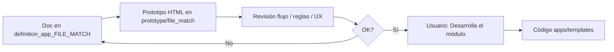

# definition_app_FILE_MATCH — Definición FILE MATCH

Carpeta de documentación de análisis y definición para **FILE MATCH** (Conciliador de archivos), vertical de DynamicWorkspace.

> **Producto:** [`../FILE_MATCH.md`](../FILE_MATCH.md)  
> **Familia §2:** [`../APP_FACTORY_HIGH_REUSE.md`](../APP_FACTORY_HIGH_REUSE.md) §4  
> **Rama Git:** `feature/file-match` (no desplegar a producción hasta merge a `main`)  
> **Chasis:** reutiliza `Company`, `UserProfile`, `Project`, `ProjectMembership`, seguridad y billing.  
> **Reuso técnico DMS:** parsers, SourceProfile (×2), intake, catálogos, `ExecutionErrorCode` — ver [`../definition_app_DMS/`](../definition_app_DMS/).  
> **Comparador:** obra nueva delgada en `apps/file_match/services/` (no duplicar parsers).

---

## Método de trabajo (por módulo)

Igual que FILE GATE / Reverse / DMS: **definir → prototipar → revisar → implementar solo con OK explícito**.



| Paso | Dónde | Quién |
|------|-------|--------|
| 1. Diseño, alcance, reglas, validaciones | `docs/definition_app_FILE_MATCH/<modulo>.md` | Agente + revisión |
| 2. HTML demo | `prototype/file_match/` | Agente |
| 3. Revisión de flujo | Chat / demo en navegador | Usuario |
| 4. Implementación Django | `apps/file_match/`, `templates/file_match/` | **Solo si el usuario dice «Desarrolla el módulo»** |

---

## Documentos (por módulo)

| Archivo | Módulo | Contenido | Estado |
|---------|--------|-----------|--------|
| [`../FILE_MATCH.md`](../FILE_MATCH.md) | Producto | Visión, alcance, módulos 1–8, miembros | **Lineamientos** |
| [`project_lifecycle.md`](project_lifecycle.md) | Transversal | Alta, listado, hub, **miembros/autorizaciones** | **Documentado** |
| [`profile_a.md`](profile_a.md) | **1** | Perfil A (SourceProfile lado A) | **Implementado** |
| [`profile_b.md`](profile_b.md) | **2** | Perfil B (SourceProfile lado B) | **Implementado** |
| [`match_rules.md`](match_rules.md) | **3** | Claves de cruce, campos a comparar, normalización | **Implementado** |
| [`publish.md`](publish.md) | **4** | Publicar definición (borrador → published) | **Implementado** |
| [`match_run.md`](match_run.md) | **5** | Ejecutar conciliación (upload A+B + job) | **Implementado** |
| [`match_report.md`](match_report.md) | **6** | Informe y evidencia de diferencias | **Implementado** |
| [`history.md`](history.md) | **7** | Historial y auditoría de conciliaciones | **Implementado** |
| [`gate_bridge.md`](gate_bridge.md) | **8** | Pre-check FILE GATE (Fase 2) | **Implementado** |
| [`fm_integration.md`](fm_integration.md) | Transversal | Kind, URLs, roles, reuso DMS | **Documentado** |

> Los `.md` de módulo se crean al iniciar cada módulo (no anticipar specs vacías).  
> **Miembros:** documentados en [`project_lifecycle.md`](project_lifecycle.md); UI en `projects/members`; reuso `ProjectMembership` / `project_service`.

---

## Carpetas de trabajo

| Rol | Ruta |
|-----|------|
| Specs por módulo | `docs/definition_app_FILE_MATCH/` |
| Prototipos HTML (antes del definitivo) | `prototype/file_match/` |
| Templates Django (tras «Desarrolla el módulo») | `templates/file_match/<modulo>/` |
| App Django | `apps/file_match/` |
| CSS / JS | `static/css/file_match_*.css`, `static/js/file_match-*.js` |

### Mapa de carpetas (objetivo)

```
docs/
├── FILE_MATCH.md
└── definition_app_FILE_MATCH/
    ├── README.md                 ← este archivo
    ├── project_lifecycle.md
    ├── profile_a.md
    ├── profile_b.md
    ├── match_rules.md
    ├── publish.md
    ├── match_run.md
    ├── match_report.md
    ├── history.md
    ├── gate_bridge.md
    └── fm_integration.md

prototype/file_match/             ← espejo 1:1 de templates (HTML estático)
├── projects/                     ← list, create, hub, members (+ *_help)
├── profile_a/
├── profile_b/
├── rules/
├── publish/
├── run/                          ← hub, upload A+B, result
├── report/
├── history/
└── bridge/                       ← Fase 2

templates/file_match/             ← Django (solo tras OK)
├── guide.html
├── projects/
├── profile_a/
├── profile_b/
├── rules/
├── publish/
├── run/
├── report/
├── history/
└── bridge/

apps/file_match/                  ← app delgada
├── apps.py
├── urls.py                       ← prefijo /app/file-match/
├── guide_views.py
├── projects/                     ← alta, hub, miembros
├── profile_a/
├── profile_b/
├── rules/
├── publish/
├── run/
├── report/
├── history/
└── bridge/
```

### Subcarpetas previstas en templates / prototipos

| Subcarpeta | Módulo / área | Contenido típico |
|------------|---------------|------------------|
| `projects/` | Ciclo proyecto | `list`, `create`, `hub`, `members`, ayudas |
| `profile_a/` | **1** | Hub + pasos wizard Source (lado A) |
| `profile_b/` | **2** | Hub + pasos wizard Source (lado B) |
| `rules/` | **3** | Hub / editor de claves y campos a comparar |
| `publish/` | **4** | Hub publicar + checklist |
| `run/` | **5** | Hub, upload A+B, resultado del job |
| `report/` | **6** | Detalle de informe / evidencia |
| `history/` | **7** | Listado filtrable + detalle |
| `bridge/` | **8** | Settings pre-check FILE GATE (Fase 2) |
| `guide.html` | Ayuda | Guía de producto (raíz `templates/file_match/`) |

---

## Prototipos

Misma estructura de carpetas que `templates/file_match/<modulo>/` (espejo 1:1). Preferir **carpetas por módulo**, no un único árbol plano de archivos.

| Carpeta prototipo | Destino futuro (tras OK) | Estado |
|-------------------|--------------------------|--------|
| `prototype/file_match/projects/` | `templates/file_match/projects/` | **Implementado** (list/create/hub/members) |
| `prototype/file_match/profile_a/` | `templates/file_match/profile_a/` | **Implementado** (hub + pasos 1–6) |
| `prototype/file_match/profile_b/` | `templates/file_match/profile_b/` | **Implementado** (hub + pasos 1–6) |
| `prototype/file_match/rules/` | `templates/file_match/rules/` | **Implementado** |
| `prototype/file_match/publish/` | `templates/file_match/publish/` | **Implementado** |
| `prototype/file_match/run/` | `templates/file_match/run/` | **Implementado** |
| `prototype/file_match/report/` | `templates/file_match/report/` | **Implementado** |
| `prototype/file_match/history/` | `templates/file_match/history/` | **Implementado** (hub / help) |
| `prototype/file_match/bridge/` | `templates/file_match/bridge/` | **Implementado** (hub / help) |

---

## URLs previstas

Prefijo de app: `/app/file-match/`.

| Área | Ruta (ejemplo) |
|------|----------------|
| Listado | `/app/file-match/proyectos/` |
| Alta | `/app/file-match/proyectos/nuevo/` |
| Hub | `/app/file-match/proyectos/<slug>/` |
| Miembros | `/app/file-match/proyectos/<slug>/miembros/` |
| Perfil A | `/app/file-match/proyectos/<slug>/perfil-a/` |
| Perfil B | `/app/file-match/proyectos/<slug>/perfil-b/` |
| Reglas | `/app/file-match/proyectos/<slug>/reglas/` |
| Publicar | `/app/file-match/proyectos/<slug>/publicar/` |
| Ejecutar | `/app/file-match/proyectos/<slug>/ejecutar/` |
| Informe | `/app/file-match/proyectos/<slug>/informe/<job_id>/` |
| Historial | `/app/file-match/proyectos/<slug>/historial/` |
| Bridge | `/app/file-match/proyectos/<slug>/bridge/` |
| Ayuda | `/app/file-match/ayuda/` |

> Rutas exactas: [`fm_integration.md`](fm_integration.md). Ciclo de proyecto: [`project_lifecycle.md`](project_lifecycle.md) (código en `apps/file_match/projects/`).

---

## Convención

- Un documento por módulo (`<tema>.md`).
- Copy de producto: **conciliación / cruce A vs B / informe de diferencias**, no “ETL” ni “emisión de layout”.
- MVP: match **1:1** por clave; dos orígenes; **cero** archivo destino de negocio.
- Miembros: mismo chasis que Worksheets / FilePipe / Reverse (`ProjectMembership`); PA gestiona autorizaciones.
- Implementación: app delgada `apps.file_match` + parsers DMS ×2 + comparador propio (**no** duplicar parsers).
- Mensajes UI: extender [`../definition_app/UI_MESSAGES.md`](../definition_app/UI_MESSAGES.md) cuando se implemente.
- Ritual: no pasar al siguiente módulo sin cerrar el actual (spec + prototipo + implementación acordada).

---

## Orden sugerido de apertura

| Orden | Qué abrir | Nota |
|-------|-----------|------|
| 0 | Este README + producto [`FILE_MATCH.md`](../FILE_MATCH.md) | Hecho / en curso |
| 1 | `project_lifecycle.md` + proyectos (incl. miembros) | **Documentado** (código ya existía) |
| 2 | `profile_a.md` | Módulo 1 |
| 3 | `profile_b.md` | Módulo 2 |
| 4 | `match_rules.md` | Módulo 3 |
| 5 | `publish.md` | Módulo 4 |
| 6 | `match_run.md` + `match_report.md` | Módulos 5–6 (pueden solaparse en UX) |
| 7 | `history.md` | Módulo 7 |
| 8 | `gate_bridge.md` | Fase 2 |

---

## Índice y estado

| Documento | Estado |
|-----------|--------|
| Producto FILE MATCH | [`../FILE_MATCH.md`](../FILE_MATCH.md) — lineamientos |
| Specs por módulo | M1–M8 **implementados**; `fm_integration.md` + `project_lifecycle.md` **documentados** |
| Prototipos | … · `history/` · `bridge/` |
| Templates | **M1–M8 listos** |
| App Django | `apps/file_match/` — **M1–M8 listos** |

---

*Carpeta: `docs/definition_app_FILE_MATCH/` — definición por módulo del Conciliador (FILE MATCH).*
