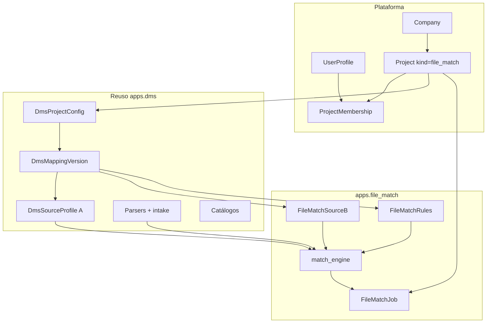

# Integración FILE MATCH ↔ DynamicWorkspace

Alineación del **Conciliador (FILE MATCH)** con la plataforma: compañías, usuarios, seguridad, proyectos, reuso DMS y convenciones Django ya implementadas.

> Estado: **documentado** (refleja implementación M1–M8 en `apps.file_match`).  
> Producto: [`../FILE_MATCH.md`](../FILE_MATCH.md).  
> Rama: `feature/file-match`.  
> Fuente de verdad plataforma: [`../DynamicWorkspace.md`](../DynamicWorkspace.md), [`../definition_app/DynamicWorkspace_Model.md`](../definition_app/DynamicWorkspace_Model.md).  
> Patrón hermano: [`../definition_app_DMS/dms_integration.md`](../definition_app_DMS/dms_integration.md).  
> Specs por módulo: [`README.md`](README.md).

---

## Principio

FILE MATCH **no duplica** tenant, autenticación ni el contenedor de proyecto. Es una app delgada (`apps.file_match`) que:

1. reutiliza `Company`, `UserProfile`, `Project`, `ProjectMembership`, seguridad y billing;
2. reutiliza parsers, intake, catálogos y `DmsMappingVersion` / `DmsSourceProfile` (lado A) de `apps.dms`;
3. aporta **obra propia**: perfil B, reglas de cruce, motor de comparación, jobs e informe.



**Diferenciador vs FilePipe:** dos orígenes (A y B), **cero** destino de negocio. El resultado es informe de diferencias, no un tercer archivo ETL.

---

## Jerarquía tenant

```
Company
 ├── UserProfile (UA | US | UF)
 ├── Subscription
 └── Project (project_kind = file_match)
      ├── DmsProjectConfig (visibilidad, current_version, file_gate_*)
      ├── DmsMappingVersion (borrador / published)
      │    ├── DmsSourceProfile          ← lado A
      │    ├── FileMatchSourceB          ← lado B
      │    └── FileMatchRules            ← claves + compare
      └── FileMatchJob                   ← corridas A+B
```

**Reglas heredadas:**

1. Todo usuario opera dentro de `user.profile.company` (salvo UA soporte).
2. Todo proyecto pertenece a una `Company`.
3. Acceso a `/app/` requiere seguridad completa + suscripción vigente (US/UF).
4. Sin membresía / visibilidad de compañía → sin acceso al proyecto Match.

---

## Tipos de usuario global

| Tipo | Rol en FILE MATCH |
|------|-------------------|
| **UA** | Soporte; no opera el conciliador de negocio en MVP |
| **US** | Gestiona UF; ve proyectos Match de su compañía según membresía/visibilidad |
| **UF** | Crea proyectos Match; define perfiles/reglas; ejecuta según rol de proyecto |

FILE MATCH **no introduce** tipos de usuario nuevos. Permisos granulares = `ProjectMembership.role`.

---

## Discriminador `project_kind`

| Campo | Valor | Descripción |
|-------|-------|-------------|
| `Project.project_kind` | `file_match` | Constante `Project.KIND_FILE_MATCH` |
| Label | FILE MATCH (Conciliador) | Sidebar / listados |

Otros kinds en la misma plataforma: `workspace`, `dms` (FilePipe), `file_gate`, `reverse`. Un usuario puede tener varios kinds en la misma compañía.

Listados y servicios Match **filtran siempre** por `project_kind=file_match` (aislamiento de producto).

---

## Configuración: reuso `DmsProjectConfig`

No hay `FileMatchConfig` separado. Match usa el mismo OneToOne `DmsProjectConfig` que FilePipe / Reverse / GATE:

| Campo | Uso en Match |
|-------|----------------|
| `visibility` | `company` \| `members_only` (alta / listado) |
| `current_version` | Versión **publicada** activa (post M4) |
| `file_gate_enabled` | Bridge M8 master flag |
| `file_gate_project` | FK → proyecto FILE GATE (único) |
| `file_gate_accept` | `passed` / `passed_with_warnings` |
| `file_gate_max_age_days` | Frescura (default 7) |
| `file_gate_require_a` | Exigir pre-check sobre hash A |
| `file_gate_require_b` | Exigir pre-check sobre hash B |
| `file_gate_linked_at` / `_by` | Auditoría del vínculo |

Publicación Match: `publish_match_definition` (motor propio) — **no** `publish_draft_version` de FilePipe.

---

## Modelos propios (`apps.file_match`)

| Modelo | Relación | Rol |
|--------|----------|-----|
| `FileMatchSourceB` | 1:1 `DmsMappingVersion` (`match_source_b`) | Perfil lado B (JSON fields / tipo / capture) |
| `FileMatchRules` | 1:1 `DmsMappingVersion` (`match_rules`) | Clave, compare, normalize, verdict |
| `FileMatchJob` | N:1 `Project` | Corrida A+B + métricas + informe |

### Persistencia por lado

| Lado | Artefacto | Decisión congelada |
|------|-----------|-------------------|
| **A** | `DmsSourceProfile` (OneToOne de la versión) | Reuso DMS / wizard source |
| **B** | `FileMatchSourceB` | Slot B explícito (no segundo OneToOne source) |
| Reglas | `FileMatchRules.rules` (JSON) | No es field mapping DMS |

Al publicar: congela A + B + rules en la versión; clona borrador editable (A + B + rules).

### Job

Campos clave: `file_a_*` / `file_b_*` (nombre, path, size, hash), `published_version`, `verdict`, `metrics` (incluye sello `file_gate_check` si bridge ON), `detail_preview`, `report_path`, `executed_by`.

---

## Reuso técnico DMS (obligatorio)

| Pieza | Dónde | Match |
|-------|-------|-------|
| Parsers | `apps.dms.transform_execution` / source parser | Invocación **×2** (A y B) |
| Intake / storage / hash | `apps.dms.file_intake` | Upload dual; `content_hash` SHA-256 |
| Catálogos de tipo | `apps.dms` catalogs | Whitelist A/B (CSV, Excel, TXT, JSON, XML…) |
| Source wizard A | `source_persistence_service` + patrones GATE/Reverse | Perfil A |
| Bridge pre-check | `dms_bridge_service` | `BRIDGEABLE_KINDS` incluye `file_match`; `precheck_match_sides` |
| Versionado | `DmsMappingVersion` | draft / published |

**Prohibido:** copiar parsers a `apps.file_match`. El comparador vive en `apps/file_match/services/match_engine.py`.

---

## Membresía y matriz de permisos

Reuso total de `ProjectMembership` + `project_service` (mismo patrón Worksheets / FilePipe / Reverse).

| Rol | Código | Uso Match |
|-----|--------|-----------|
| Project Admin | `PA` | Todo: definición, miembros, publicar, ejecutar, bridge |
| Editor | `ED` | Editar A/B/reglas, publicar, ejecutar, configurar bridge |
| Generar / Ejecutar | `GE` | Ver + ejecutar + descargar informe (no editar definición) |
| Consulta | `CO` | Ver proyecto, historial, certificado/metadatos; **sin** detalle de filas ni CSV/JSON |

Al crear proyecto Match, el `owner` recibe membresía **PA**.

### Matriz acción → rol

| Acción | PA | ED | GE | CO |
|--------|----|----|----|-----|
| Ver proyecto / hub / historial | Sí | Sí | Sí | Sí |
| Editar Perfil A / B / Reglas | Sí | Sí | No | No |
| Publicar definición | Sí | Sí | No | No |
| Ejecutar conciliación | Sí | Sí | Sí | No |
| Descargar informe / CSV / JSON | Sí | Sí | Sí | No |
| Ver informe (metadatos) | Sí | Sí | Sí | Sí* |
| Ver detalle filas / ofuscación | Sí | Sí | Sí | No (ofuscado / denegado) |
| Certificado | Sí | Sí | Sí | Sí |
| Configurar bridge FILE GATE | Sí | Sí | No | No (lectura) |
| Gestionar miembros | Sí | No | No | No |
| Archivar proyecto | Sí | No | No | No |

\*CO: listado e informe con datos de negocio restringidos según `match_report_service`.

UI miembros: `/app/file-match/proyectos/<slug>/miembros/` (+ ayuda).

---

## URLs y navegación (congeladas)

Prefijo de app: `/app/file-match/` · `app_name = file_match` · montaje en `dynamicworkspace/urls.py`.

| Área | Ruta | Nombre URL |
|------|------|------------|
| Listado | `/app/file-match/proyectos/` | `project_list` |
| Alta | `…/proyectos/nuevo/` | `project_create` |
| Hub | `…/proyectos/<slug>/` | `project_hub` |
| Miembros | `…/proyectos/<slug>/miembros/` | `project_members` |
| Perfil A | `…/perfil-a/` (+ pasos 1–6) | `profile_a_*` |
| Perfil B | `…/perfil-b/` (+ pasos 1–6) | `profile_b_*` |
| Reglas | `…/reglas/` | `rules_*` |
| Publicar | `…/publicar/` | `publish_*` |
| Ejecutar | `…/ejecutar/` | `run_*` |
| Informe | `…/informe/<job_id>/` | `report_*` |
| Historial | `…/historial/` | `history_*` |
| Bridge | `…/bridge/` | `bridge_*` |
| Guía producto | `/app/file-match/ayuda/` | `file_match_guide` |

Ayudas: sufijo `…/ayuda/` en hubs y pasos clave.

**Sidebar UF:** FILE MATCH → Conciliador + Ayuda (`file_match_guide`).

Templates: `templates/file_match/<modulo>/`. Prototipos: `prototype/file_match/`.

---

## Almacenamiento de archivos

Reuso storage DMS / intake bajo compañía:

```
{MEDIA_ROOT}/…/{company_id}/projects/{project_id}/jobs/{job_id}/
  input/     ← A y B
  reports/   ← JSON + CSV diferencias (MVP)
```

TTL descargas informe: mismo espíritu DMS (`DOWNLOAD_TTL` / 7 días) vía `match_report_service`. Metadatos del job permanecen tras TTL.

---

## Seguridad y convenciones

| Capa | Integración |
|------|-------------|
| Login / 2FA | `apps.security` — sin cambios |
| Decoradores vistas | `security_complete_required` + `user_type_required("UF")` |
| Formularios | HTML plano — **sin** Django Forms |
| Mensajes UI | [`UI_MESSAGES.md`](../definition_app/UI_MESSAGES.md) §3.11 |
| Validación | Servicios → `OperationResult` (`ok` / `error_code` / `user_message` / `errors`) |
| Aislamiento | Querysets por compañía + kind + membresía |

Código (nombres) en inglés; copy UX y docs en español.

---

## Mapa módulos → código

| Módulo | Spec | App / servicio |
|--------|------|----------------|
| Ciclo proyecto | (lifecycle parcial en projects/) | `apps/file_match/projects/` |
| 1 Perfil A | `profile_a.md` | `profile_a/` + DMS source |
| 2 Perfil B | `profile_b.md` | `profile_b/` + `FileMatchSourceB` |
| 3 Reglas | `match_rules.md` | `rules/` + `FileMatchRules` |
| 4 Publicar | `publish.md` | `publish/` + `publish_match_definition` |
| 5 Ejecutar | `match_run.md` | `run/` + `match_engine` + `FileMatchJob` |
| 6 Informe | `match_report.md` | `report/` |
| 7 Historial | `history.md` | `history/` |
| 8 Bridge GATE | `gate_bridge.md` | `bridge/` + `dms_bridge_service` |

---

## Fronteras con otros verticales

| Vertical | Relación |
|----------|----------|
| **FilePipe (DMS)** | Comparte parsers y versionado; Match no genera destino |
| **FILE GATE** | Pre-check opcional (M8) por hash A/B; no valida “dentro” de Match |
| **Reverse Studio** | Hermano emisor; mismo chasis bridge; Match no emite layout |
| **Worksheets** | Mismo `Project` / miembros; kind distinto |

---

## Lo que no aplica a proyectos Match

| Módulo | En `project_kind=file_match` |
|--------|------------------------------|
| `FieldDefinition` / `Record` | No |
| `DmsTargetProfile` / field mapping ETL | No (reglas propias) |
| `DmsExecutionJob` como job de match | No — `FileMatchJob` |
| Transform pipeline FilePipe | No |

---

## Checklist de integración (as-built)

- [x] `Project.KIND_FILE_MATCH` + alta / listado / hub / miembros
- [x] `DmsProjectConfig` (visibilidad + `current_version` + bridge)
- [x] Perfil A (`DmsSourceProfile`) + Perfil B (`FileMatchSourceB`)
- [x] Reglas + publicar + ejecutar + informe + historial
- [x] Bridge FILE GATE (`require_a` / `require_b`)
- [x] URLs bajo `/app/file-match/`
- [x] UI_MESSAGES §3.11
- [ ] Entrada en índice [`DynamicWorkspace_Model.md`](../definition_app/DynamicWorkspace_Model.md) si se mantiene catálogo de modelos
- [x] `project_lifecycle.md` formal (ciclo as-built)

---

## Documentos relacionados

| Documento | Uso |
|-----------|-----|
| [`../FILE_MATCH.md`](../FILE_MATCH.md) | Visión producto |
| [`README.md`](README.md) | Índice definition_app_FILE_MATCH |
| Specs M1–M8 | `profile_*.md`, `match_*.md`, `publish.md`, `history.md`, `gate_bridge.md` |
| [`../definition_app_DMS/dms_integration.md`](../definition_app_DMS/dms_integration.md) | Patrón integración |
| [`../definition_app/UI_MESSAGES.md`](../definition_app/UI_MESSAGES.md) | §3.11 |
| [`../definition_app/projects.md`](../definition_app/projects.md) | Membresías PA/ED/GE/CO |
| [`../APP_FACTORY_HIGH_REUSE.md`](../APP_FACTORY_HIGH_REUSE.md) | Familia §2 / §4 |

---

*Documento: `docs/definition_app_FILE_MATCH/fm_integration.md` — integración transversal FILE MATCH (kind, URLs, roles, reuso DMS).*
