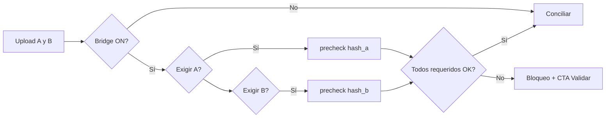
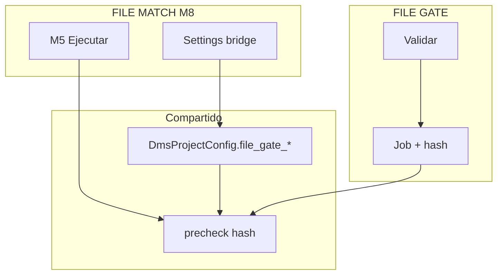
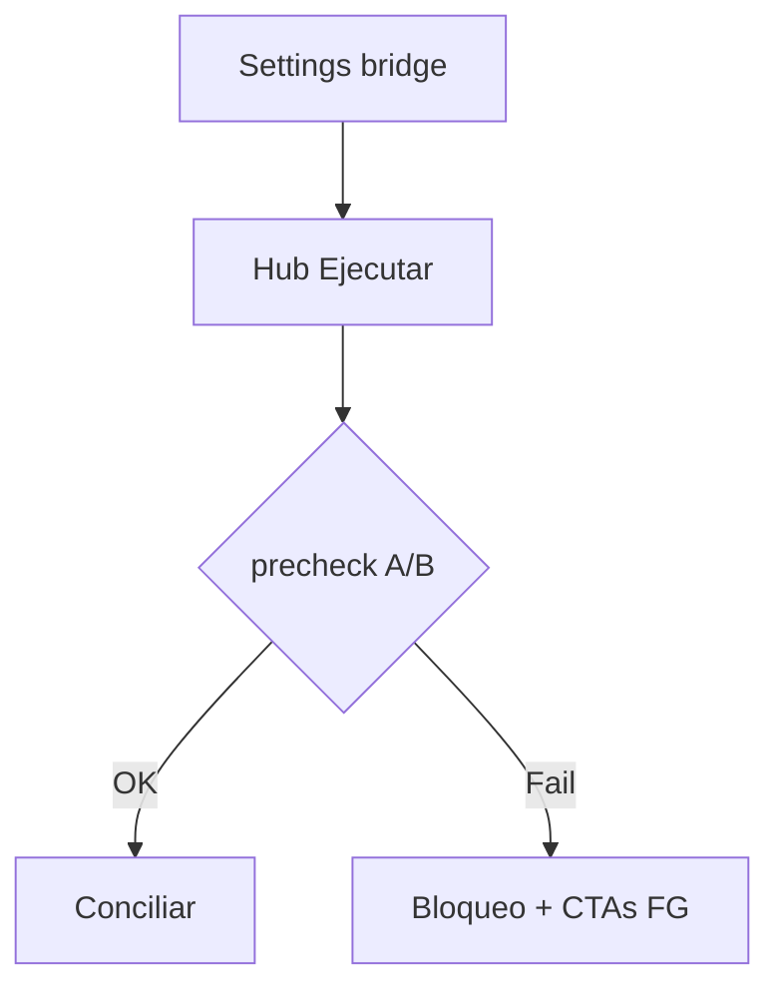

# Gate bridge — FILE MATCH Módulo 8

Proceso y especificación del **Módulo 8** de FILE MATCH: **integración opcional con FILE GATE** para exigir una validación en verde (mismo `content_hash`) sobre el archivo **A** y/o el archivo **B** **antes de conciliar**.

> Estado: **implementado** (Django Módulo 8).  
> Producto: [`../FILE_MATCH.md`](../FILE_MATCH.md) § Módulo 8 · Frontera §4.4 · Fase 2.  
> Rama: `feature/file-match`.  
> Destino: `apps/file_match/bridge/` · `templates/file_match/bridge/` · URLs `/app/file-match/proyectos/<slug>/bridge/...`.  
> Base técnica: [`../definition_app_FILE_GATE/dms_bridge.md`](../definition_app_FILE_GATE/dms_bridge.md) + `apps/file_gate/bridge/services/dms_bridge_service.py` · patrón Reverse [`../definition_app_REVERSE/gate_bridge.md`](../definition_app_REVERSE/gate_bridge.md).  
> **Prerrequisito:** M5 (ejecutar) + M6/M7 (informe / historial). Contrato FG publicado en el proyecto vinculado.  
> **No incluye** fusionar perfiles Match ↔ esquema FG, dos proyectos GATE (uno por lado), override auditado, ni API (Fase 3).  
> Familia §2: [`../APP_FACTORY_HIGH_REUSE.md`](../APP_FACTORY_HIGH_REUSE.md) §4.  
> Prototipos: [`../../prototype/file_match/bridge/`](../../prototype/file_match/bridge/).

---

## Propósito

Permitir que un proyecto **FILE MATCH** (conciliador) exija, antes de **ejecutar la conciliación**:

1. un proyecto **FILE GATE** vinculado (misma compañía);
2. corridas de gate **aceptadas** sobre el hash de **A** y/o de **B** (según flags);
3. UX clara de **bloqueado** vs **listo** por lado, con enlaces a validar / evidencia / certificado en FILE GATE.

FILE GATE **no concilia**. Match **no recalcula** el gate. El bridge es solo **pre-check** (mismo espíritu B2 / B10 del bridge FilePipe / Reverse).



---

## Qué es / qué hace / qué no hace

| Pregunta | Respuesta |
|----------|-----------|
| **¿Qué es?** | Pre-check de calidad de **A y/o B** antes de conciliar |
| **¿Qué hace?** | Reusa `DmsProjectConfig.file_gate_*` + `precheck` (×1 o ×2) sobre `KIND_FILE_MATCH` |
| **¿Qué no hace?** | No valida dentro de Match; no publica FG; no fusiona perfiles A/B con el esquema FG |
| **Copy UX** | “Exigir FILE GATE antes de conciliar” / “lado A/B validado” — **no** “antes de transformar” ni “antes de generar” |

---

## Relación con FilePipe / Reverse bridge y M5

Hoy el bridge FilePipe / Reverse ↔ FILE GATE:

- persiste en `DmsProjectConfig` (`file_gate_enabled`, `file_gate_project`, accept, max_age);
- ejecuta `dms_bridge_service.precheck` / `precheck_job` desde el motor de ejecución;
- UI propia por vertical (`/integracion/file-gate/` o `/bridge/`).

FILE MATCH ya usa `DmsProjectConfig` (visibilidad, `current_version` al publicar). El Módulo 8 **reusa** los campos `file_gate_*` y añade flags de lado.

| Tema | Decisión Match M8 |
|------|-------------------|
| Config | **Reusar** `file_gate_*` en `DmsProjectConfig` del proyecto Match |
| Lados | **Nuevos** `file_gate_require_a` / `file_gate_require_b` (migración al implementar) |
| Cardinalidad GATE | **Un** FILE GATE por proyecto Match (no dos FKs) |
| Pre-check | Ampliar `BRIDGEABLE_KINDS` con `KIND_FILE_MATCH`; llamar `precheck` por cada lado exigido |
| Guardar settings | Envolver `save_settings` con kind Match + validar ≥1 require si enabled |
| UI config | Hub propio Match `/bridge/` |
| UI ejecutar | Banner / sellos por lado A y B en hub Ejecutar (M5) |
| Mensajes | Remap `MSG_MATCH` (“conciliar”, “archivo A/B”) |
| Hub FILE GATE | Listar también `KIND_FILE_MATCH` (copy: “Conciliador / FILE MATCH”) |



---

## Alcance

| Incluido (Fase 2 MVP) | Excluido |
|-----------------------|----------|
| Settings bridge en proyecto Match (PA/ED) | Dos proyectos GATE (uno por lado) |
| Flag «exigir FILE GATE» + checkboxes A / B | Bypass / override (ni PA) |
| Matching por `file_a_hash` / `file_b_hash` | Matching solo por nombre |
| Aceptación `passed` / `passed_with_warnings` | Aceptar `partial` / `failed` |
| Frescura (default 7 días) | Auto-validar al subir A/B |
| Banner bloqueado / listo por lado en Ejecutar | API / webhook |
| Enlaces Validar · Evidencia · Certificado | Historial unificado cross-producto |
| Aviso suave si tipo perfil A/B ≠ tipo esquema FG | Diff / sync de contratos |
| Sello `file_gate_check` (A y/o B) en `FileMatchJob` | Bridge obligatorio para todos los Match |
| Visibilidad del vínculo en hub FILE GATE | Configurar el flag desde FILE GATE |

---

## Responsabilidades

| Sí | No |
|----|-----|
| Vincular Match ↔ FILE GATE misma compañía | Ejecutar el motor de gate |
| Bloquear conciliación si falta job aceptable en un lado exigido | Editar esquema FG o perfiles Match |
| Mostrar estado y CTAs por lado | Conciliar “desde” FILE GATE |
| Remap de mensajes a copy Match | Fusionar whitelists de tipos |

---

## Prerrequisitos

| Condición | Si no se cumple |
|-----------|-----------------|
| Proyecto Match y FILE GATE misma compañía | No se puede vincular |
| Usuario PA/ED en Match para configurar | Forbidden |
| Contrato FILE GATE **publicado** | Bridge configurable; pre-check falla claro |
| Al menos una corrida FG final con el hash del lado exigido | Bloqueo: «Valide primero el archivo A/B en FILE GATE» |
| M5 calcula `file_a_hash` / `file_b_hash` | Matching imposible → bloquear si ese lado está exigido |

---

## Decisiones de diseño (congeladas)

| # | Tema | Decisión |
|---|------|----------|
| MB1 | ¿Dónde vive la config? | En el **proyecto Match** (`DmsProjectConfig`), igual FilePipe / Reverse. |
| MB2 | ¿Un o dos GATE? | **Un** `file_gate_project`. Lados vía `file_gate_require_a` / `file_gate_require_b`. |
| MB3 | ¿Migración? | **Sí** — solo los dos bools de require (defaults `false`). Campos `file_gate_*` base ya existen. |
| MB4 | ¿Matching? | SHA-256: `file_a_hash` / `file_b_hash` vs `DmsExecutionJob.input_content_hash` del GATE. |
| MB5 | ¿Estados OK? | `passed` o `passed`+`passed_with_warnings` (igual D4). Nunca `failed`/`partial`. |
| MB6 | ¿Frescura? | Default **7** días (D5). |
| MB7 | ¿Override? | **No** en MVP (D6). |
| MB8 | ¿Enabled sin lados? | Inválido al guardar: si `file_gate_enabled`, exigir **al menos un** require A o B. |
| MB9 | ¿App delgada? | `apps/file_match/bridge/` envolviendo `dms_bridge_service` (+ remap + dual precheck). |
| MB10 | ¿FG hub? | Extender listado entrante para `KIND_FILE_MATCH` (copy: “Conciliador / FILE MATCH”). |
| MB11 | ¿JSON producto? | El boceto `gate_policy` con dos `project_*_id` se **alinean** a un `file_gate_project_id` + `require_a` / `require_b`. |

---

## Proceso (UX)

### Configurar (PA/ED en Match)

1. Proyecto Match → **Integración FILE GATE** (`/bridge/`).
2. Activar «Exigir validación FILE GATE antes de conciliar».
3. Elegir proyecto FILE GATE de la misma compañía.
4. Marcar **Exigir en A** y/o **Exigir en B** (≥1).
5. Elegir aceptación y frescura.
6. Guardar. Hub FILE GATE muestra el vínculo entrante (producto conciliador).

### Ejecutar con bridge (GE en Match)

1. Subir A y B en **Ejecutar** (hashes calculados).
2. Por cada lado exigido: buscar job FILE GATE aceptable (mismo algoritmo que FilePipe/Reverse).
3. **Listo** (todos los requeridos OK) → sellos + CTA «Conciliar».
4. **Bloqueado** (alguno falla) → mensaje por lado + Validar · Evidencia · Certificado.



---

## Pantallas (prototipo → template)

| Prototipo | Template definitivo |
|-----------|---------------------|
| `bridge/hub.html` | `templates/file_match/bridge/hub.html` (settings) |
| `bridge/hub_help.html` | `…/hub_help.html` |
| `bridge/blocked.html` | demo bloqueo en Ejecutar (por lado) |
| `bridge/ready.html` | demo listo + sellos |
| `bridge/index.html` | Índice |

Abrir: `prototype/file_match/bridge/hub.html`.

### URLs previstas

```
/app/file-match/proyectos/<slug>/bridge/          → bridge_hub (settings)
/app/file-match/proyectos/<slug>/bridge/ayuda/    → bridge_hub_help
# POST guardar en el mismo hub (PRG)

# Pre-check: enganchado en M5 match_and_run → precheck(hash_a) y/o precheck(hash_b)
# Descargas / validar: deep-links a FILE GATE existentes
```

---

## Roles y permisos

| Acción | PA | ED | GE | CO |
|--------|----|----|----|-----|
| Ver settings (estado) | Sí | Sí | Sí (lectura) | Sí (lectura) |
| Configurar bridge | Sí | Sí | No | No |
| Conciliar con bridge ON | Sí* | Sí* | Sí* | No |
| Saltar el check | No | No | No | No |

\* Solo si el pre-check de todos los lados exigidos pasa.

---

## Reglas de negocio

| ID | Regla |
|----|-------|
| MB-R1 | Solo se vinculan proyectos de la **misma compañía**. |
| MB-R2 | El pre-check **no recalcula** el gate; reutiliza jobs FILE GATE persistidos. |
| MB-R3 | Matching obligatorio por **hash** (A y/o B). |
| MB-R4 | Si bridge ON y un lado exigido no tiene job aceptable → **no** arranca la conciliación. |
| MB-R5 | `partial` / `failed` / `error` **nunca** abren el paso. |
| MB-R6 | Sin contrato FG publicado → bloqueo con mensaje claro. |
| MB-R7 | Flag OFF → Ejecutar se comporta como M5 actual (sin gate). |
| MB-R8 | Lado no exigido → no se consulta GATE para ese hash. |
| MB-R9 | Sello `file_gate_check` (estructura con claves `a` / `b` según aplique) es de **auditoría**. |
| MB-R10 | Aviso suave si tipo del perfil A o B publicado ≠ tipo del esquema FG. |
| MB-R11 | FILE GATE no escribe destino; Match no valida “solo gate”. |
| MB-R12 | Copy: conciliar / archivo A / archivo B / informe de diferencias. |
| MB-R13 | Ampliar `dms_bridge_service` a `KIND_FILE_MATCH` (settings + precheck + listado FG). |
| MB-R14 | Guardar con enabled y sin require A ni B → error de validación. |

---

## Validaciones

| Momento | Condición | Severidad |
|---------|-----------|-----------|
| Guardar | Gate inexistente / otra compañía / no `file_gate` | Error inline |
| Guardar | Flag ON sin proyecto | Error inline |
| Guardar | Flag ON sin require A ni B | Error inline |
| Guardar | `max_age_days` &lt; 1 | Error inline |
| Ejecutar | Bridge ON + lado exigido sin hash | Bloqueo |
| Ejecutar | Bridge ON + sin job matching en un lado | Bloqueo + CTA Validar (lado) |
| Ejecutar | Estado no aceptado | Bloqueo + evidencia |
| Ejecutar | Fuera de frescura | Bloqueo + re-validar |
| Abrir settings | Sin acceso al proyecto Match | Forbidden |

Mensajes: [`../definition_app/UI_MESSAGES.md`](../definition_app/UI_MESSAGES.md) §3.11 bloque **Módulo 8**.

### Mensajes previstos (borrador)

| Situación | Tag | Texto |
|-----------|-----|-------|
| Sin permiso configurar | `error` | No tiene permiso para configurar la integración FILE GATE. |
| Enabled sin GATE | inline | Seleccione un proyecto FILE GATE. |
| Enabled sin lados | inline | Marque al menos «Exigir en A» o «Exigir en B». |
| Guardado OK | `success` | Integración FILE GATE guardada. |
| Bloqueo lado A | UX | Valide el archivo A en FILE GATE antes de conciliar. |
| Bloqueo lado B | UX | Valide el archivo B en FILE GATE antes de conciliar. |
| Listo | UX | FILE GATE listo en los lados exigidos. |

---

## Algoritmo del pre-check

Por cada lado exigido (`require_a` → `file_a_hash`, `require_b` → `file_b_hash`):

1. Invocar el mismo algoritmo que [`dms_bridge.md`](../definition_app_FILE_GATE/dms_bridge.md) § algoritmo, con `match_project` y ese `content_hash`.
2. Si algún lado exigido falla → resultado global **no OK** (agregar detalle por lado).
3. Si no hay lados exigidos o bridge OFF → skipped (pasa).

Mensajes de producto: sustituir “transformar / generar” por “conciliar” e indicar el lado (A/B).

---

## Modelo de datos

| Artefacto | Uso |
|-----------|-----|
| `DmsProjectConfig.file_gate_enabled` | Master flag |
| `DmsProjectConfig.file_gate_project` | FK → proyecto FILE GATE (único) |
| `DmsProjectConfig.file_gate_accept` | Política de aceptación |
| `DmsProjectConfig.file_gate_max_age_days` | Frescura |
| `DmsProjectConfig.file_gate_require_a` | **Nuevo** — exigir pre-check sobre A |
| `DmsProjectConfig.file_gate_require_b` | **Nuevo** — exigir pre-check sobre B |
| `FileMatchJob.file_a_hash` / `file_b_hash` | Entrada al matching |
| Sello en job (p. ej. `metrics` o JSON auxiliar) | `file_gate_check: { a?: seal, b?: seal }` |
| Jobs FILE GATE + `gate_result` | Fuente del veredicto |

**Migración al implementar:** solo `file_gate_require_a` / `file_gate_require_b`. Ampliar `BRIDGEABLE_KINDS` en código.

### Alineación JSON producto

Boceto previo en `FILE_MATCH.md`:

```json
"gate_policy": {
  "require_file_gate_a": false,
  "require_file_gate_b": false,
  "file_gate_project_a_id": null,
  "file_gate_project_b_id": null
}
```

Forma congelada M8:

```json
"gate_policy": {
  "enabled": false,
  "file_gate_project_id": null,
  "require_a": false,
  "require_b": false,
  "accept": "passed_with_warnings",
  "max_age_days": 7
}
```

---

## Casos de uso

### FM-BR01 — Activar bridge (solo A)

| | |
|---|---|
| **Actor** | PA Match |
| **Flujo** | Bridge → ON → elegir `gate-extractos` → Exigir A · no B → Guardar |
| **Resultado** | Solo hash A se pre-chequea; FG ve vínculo “FILE MATCH” |

### FM-BR02 — Activar bridge (A y B)

| | |
|---|---|
| **Flujo** | Exigir A y B sobre el mismo GATE |
| **Resultado** | Ambos hashes deben tener job aceptable |

### FM-BR03 — Conciliar bloqueado (B sin validar)

| | |
|---|---|
| **Flujo** | A passed; B sin corrida FG; bridge exige ambos |
| **Resultado** | Bloqueo en B + CTA Validar; no concilia |

### FM-BR04 — Conciliar listo

| | |
|---|---|
| **Flujo** | Hashes A y B con `passed` reciente |
| **Resultado** | Sellos listos; concilia; job guarda sello dual |

### FM-BR05 — Frescura vencida en A

| | |
|---|---|
| **Flujo** | `passed` de A antiguo &gt; max_age; B OK |
| **Resultado** | Bloqueo en A; pedir re-validación |

### FM-BR06 — Flag apagado

| | |
|---|---|
| **Flujo** | Bridge OFF; ejecutar |
| **Resultado** | Igual M5 sin pre-check |

### FM-BR07 — Enabled sin lados

| | |
|---|---|
| **Flujo** | Guardar ON sin marcar A ni B |
| **Resultado** | Error inline MB-R14 |

---

## Criterios de “módulo 8 completo” (definición)

- [x] Propósito y frontera M5 / FG / Reverse claros
- [x] Decisión un GATE + require A/B (MB1–MB11)
- [x] Reglas MB-R1–R14 + validaciones + casos FM-BR01–07
- [x] Mapa prototipo → template + URLs
- [x] Prototipos HTML listos
- [x] Prototipos revisados / OK usuario
- [x] Usuario: «Desarrolla el módulo»

Checklist al implementar:

- [x] `apps/file_match/bridge/` + templates settings/ayuda
- [x] Migración `file_gate_require_a` / `file_gate_require_b`
- [x] Extender `dms_bridge_service` a `KIND_FILE_MATCH` (+ listado FG + dual precheck)
- [x] Remap mensajes “conciliar” / lado A·B
- [x] M5: enganchar pre-check; UI bloqueado/listo por lado
- [x] Hub proyecto: enlace Integración FILE GATE
- [x] UI_MESSAGES §3.11 Módulo 8
- [x] Docs M5/M7: frontera M8 actualizada

---

## Implementación (referencia)

| Pieza | Ubicación |
|-------|-----------|
| App | `apps/file_match/bridge/` |
| Motor | `dms_bridge_service` (+ `match_bridge_service`) |
| Templates | `templates/file_match/bridge/` |
| URLs | `/app/file-match/proyectos/<slug>/bridge/` |
| Enganche | `match_run_service.match_and_run` → `precheck_match_sides` |
| Reuso | `DmsProjectConfig.file_gate_*`, jobs FG |

---

## Próximos pasos

1. Cierre MVP / QA; merge a `main` cuando corresponda.
2. No merge a `main` / Railway hasta MVP revisado.

---

## Referencias

| Documento | Uso |
|-----------|-----|
| [`../FILE_MATCH.md`](../FILE_MATCH.md) | Producto / Módulo 8 |
| [`match_run.md`](match_run.md) | Punto de enganche pre-check |
| [`../definition_app_FILE_GATE/dms_bridge.md`](../definition_app_FILE_GATE/dms_bridge.md) | Algoritmo y decisiones D1–D8 |
| [`../definition_app_REVERSE/gate_bridge.md`](../definition_app_REVERSE/gate_bridge.md) | Patrón hermano Reverse |
| [`../definition_app/UI_MESSAGES.md`](../definition_app/UI_MESSAGES.md) | Mensajes §3.11 |
| [`README.md`](README.md) | Índice |

---

*Documento: `docs/definition_app_FILE_MATCH/gate_bridge.md` — Módulo 8 FILE MATCH (pre-check FILE GATE). Implementado.*
