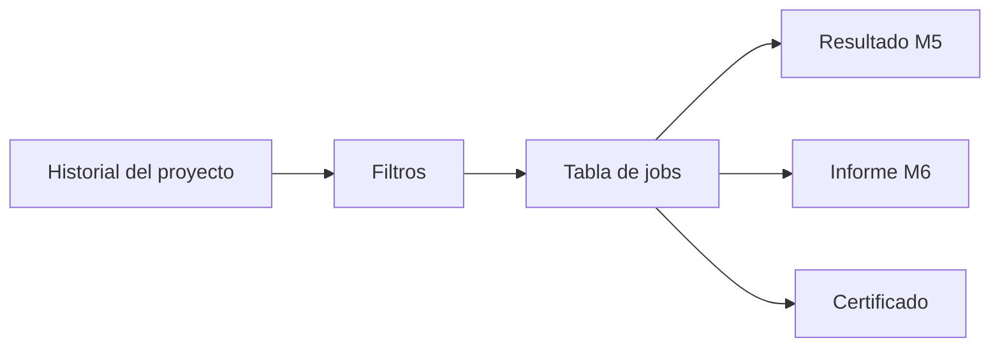
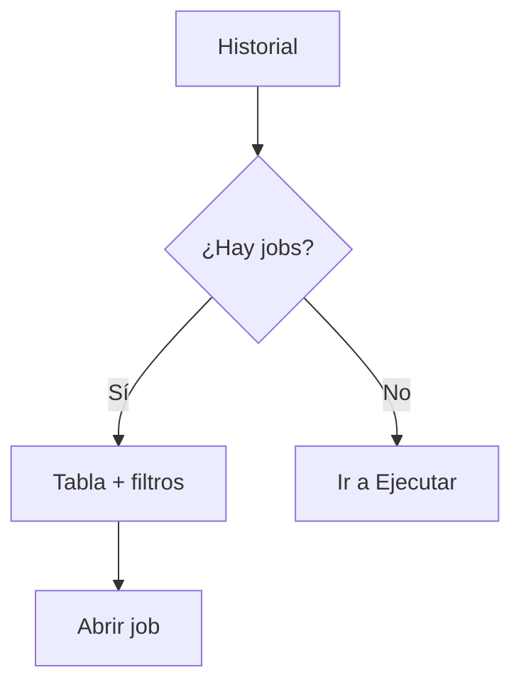

# History — FILE MATCH Módulo 7

Proceso y especificación del **Módulo 7** de FILE MATCH: **listar, filtrar y auditar** las conciliaciones de un proyecto, con acceso a resultado, informe y certificado.

> Estado: **implementado** (Django Módulo 7).  
> Producto: [`../FILE_MATCH.md`](../FILE_MATCH.md).  
> Rama: `feature/file-match`.  
> Destino: `apps/file_match/history/` · `templates/file_match/history/` · URLs `/app/file-match/proyectos/<slug>/historial/...`.  
> Depende de: [`match_run.md`](match_run.md) (M5 — `FileMatchJob`) + [`match_report.md`](match_report.md) (M6 — evidencia / TTL / certificado).  
> Familia §2: [`../APP_FACTORY_HIGH_REUSE.md`](../APP_FACTORY_HIGH_REUSE.md) §4.  
> Prototipos: [`../../prototype/file_match/history/`](../../prototype/file_match/history/).

---

## Propósito

Permitir que un usuario autorizado **consulte el historial de conciliaciones** del proyecto:

1. ver corridas recientes y antiguas (metadatos siempre);
2. **filtrar** por veredicto, fecha, usuario, nombres/hash A o B, versión de definición;
3. abrir **resultado** (M5), **informe** (M6) o **certificado**;
4. reconocer jobs con **descargas expiradas** (TTL) sin perder la auditoría.

El Módulo 5 ya muestra un preview de “corridas recientes” en el hub Ejecutar. El Módulo 7 es el **listado completo y filtrable** + capa de auditoría.

---

## Qué es / qué hace / qué no hace

| Pregunta | Respuesta |
|----------|-----------|
| **¿Qué es?** | El **historial filtrable** de conciliaciones del proyecto |
| **¿Qué hace?** | Lista / filtra jobs; enlaza a resultado, informe y certificado |
| **¿Qué no hace?** | No ejecuta match; no regenera informes; no es el detalle de diferencias (M6) |
| **Copy UX** | “Historial de conciliaciones” / “auditoría” — **no** “historial de validaciones” ni “generaciones” |

---

## Relación con otros módulos

| Módulo | Qué aporta al historial |
|--------|-------------------------|
| **5 Run** | Crea el `FileMatchJob`; preview corto en hub Ejecutar |
| **6 Informe** | Destino “Ver informe”; regla TTL; certificado |
| **7 Historial (este)** | Listado filtrable + auditoría |
| **8 Bridge** | Podrá exigir pre-check GATE (Fase 2) |

---

## Alcance

| Incluido | Excluido |
|----------|----------|
| Listado paginado de jobs del proyecto | Ejecutar / re-subir (M5) |
| Filtros: veredicto, rango fechas, usuario, archivo A/B, hash, versión | Editar definición / publicar |
| Columnas de auditoría (quién, cuándo, hashes, métricas) | Diff entre jobs / versiones |
| Badge TTL vigente / expirado | Borrado físico de jobs (Fase 2) |
| Enlaces a resultado, informe, certificado | Export masivo CSV de historial (Fase 2) |
| Vacío / sin resultados de filtro | Historial cross-proyecto / compañía |
| Aislamiento por proyecto + compañía | API de auditoría (Fase 3) |
| CO ve metadatos; sin detalle de filas | Re-ejecutar sin re-subir (Fase 2) |

---

## Prerrequisitos

| Condición | Si no se cumple |
|-----------|-----------------|
| Proyecto `file_match` visible para el usuario | Acceso denegado |
| Membresía (PA/ED/GE/CO) | Forbidden |
| Jobs existen | Estado vacío con CTA a Ejecutar |

---

## Flujo de usuario

1. Proyecto → **Historial** (hub / CTA desde informe o ejecutar).
2. Ver tabla ordenada por fecha (más reciente primero).
3. Aplicar filtros (veredicto, fechas, usuario, archivo A/B, versión).
4. Abrir Resultado / Informe / Certificado según permiso y TTL.
5. Si TTL vencido → badge «Expirado»; metadatos siguen; descargas M6 bloqueadas.
6. Opcional: **Eliminar** una corrida propia, o **Eliminar mis corridas** (todas las propias del proyecto). Borrado permanente de registro + evidencia; no permite borrar ejecuciones ajenas.

| Pantalla | Contenido |
|----------|-----------|
| `history/hub.html` | Tabla + filtros + vacío |
| `history/hub_empty.html` | Variante sin jobs (prototipo) |
| `history/hub_help.html` | Roles, TTL, columnas |
| `history/index.html` | Índice prototipos |

---

## Datos mostrados por fila (auditoría)

| Campo | Origen |
|-------|--------|
| Job id | UUID (truncado en lista) |
| Archivo A | `file_a_name` |
| Archivo B | `file_b_name` |
| Hash A / B | `file_a_hash` / `file_b_hash` (truncados en lista) |
| Versión definición | `published_version_number` |
| Veredicto | `passed` / `failed` / `partial` |
| Estado técnico | `completed` / `failed` / `partial` |
| Métricas | matched, mismatch, only_*, match_pct |
| Usuario | `executed_by` |
| Creado / fin | `created_at`, `finished_at` |
| TTL | vigente / expirado (regla M6) |

---

## Filtros (MVP)

| Filtro | Control | Notas |
|--------|---------|-------|
| Veredicto | select | passed / failed / partial / todos |
| Desde / Hasta | date | Sobre `finished_at` o `created_at` |
| Usuario | select o texto | Ejecutores del proyecto |
| Archivo A | texto | Contiene en `file_a_name` |
| Archivo B | texto | Contiene en `file_b_name` |
| Hash | texto | Prefijo en hash A o B |
| Versión | número | `published_version_number` |

Paginación: p. ej. 25 por página. Orden default: `-finished_at` / `-created_at`.

Validación filtros: fechas invertidas → error inline (mismo espíritu Reverse/GATE).

---

## Roles y permisos

| Acción | PA | ED | GE | CO |
|--------|----|----|----|-----|
| Ver listado (metadatos) | Sí | Sí | Sí | Sí |
| Abrir resultado M5 | Sí | Sí | Sí | Sí* |
| Abrir informe (detalle filas) | Sí | Sí | Sí | No* |
| Descargar JSON/CSV | Sí | Sí | Sí | No |
| Ver / descargar certificado | Sí | Sí | Sí | Sí |
| Eliminar corrida propia | Sí** | Sí** | Sí** | Sí** |

\*CO: ve metadatos de historial y certificado; no tabla de diferencias ni descargas con celdas (alineado M6).  
\*\*Solo si `executed_by` es el usuario actual; nunca corridas de otros.

---

## Reglas de negocio

| ID | Regla |
|----|-------|
| HIS1 | Solo jobs del mismo proyecto / compañía. |
| HIS2 | Metadatos permanecen tras TTL; descargas siguen regla M6. |
| HIS3 | No se recalcula el match desde el historial. |
| HIS4 | Copy: “historial de conciliaciones”. |
| HIS5 | Completar M7 no implementa bridge GATE (M8). |
| HIS6 | Preview de hub Ejecutar no sustituye este listado. |
| HIS7 | Un usuario solo puede eliminar jobs donde `executed_by` es él; borrado permanente + storage. |

---

## Validaciones / mensajes

| Situación | UX |
|-----------|-----|
| Sin jobs | Vacío + CTA Ejecutar |
| Filtro sin matches | “Sin resultados” + limpiar filtros |
| Fechas invertidas | inline: «Hasta» no puede ser anterior a «Desde» |
| Versión no numérica | inline |
| Sin permiso | Forbidden / redirect |

Mensajes: [`UI_MESSAGES.md`](../definition_app/UI_MESSAGES.md) §3.11 bloque **Módulo 7**.

### Mensajes

| Situación | Tag | Texto |
|-----------|-----|-------|
| Sin permiso | `error` | No tiene permiso para ver el historial de este proyecto. |
| Fechas invertidas | inline | «Hasta» no puede ser anterior a «Desde». |
| Versión inválida | inline | La versión debe ser un número. |
| Vacío | UX | Sin conciliaciones registradas + CTA Ejecutar. |
| Filtro vacío | UX | Sin resultados + limpiar filtros. |

---

## Modelo de datos (reuso)

| Artefacto | Uso |
|-----------|-----|
| `FileMatchJob` | Fuente del listado (sin migración nueva) |
| `match_report_service.is_download_expired` | Badge TTL |
| Enlaces | `run_result`, `report_detail`, `report_certificate` |

---

## Pantallas (prototipo → template)

| Prototipo | Template definitivo |
|-----------|---------------------|
| `history/hub.html` | `templates/file_match/history/hub.html` |
| `history/hub_empty.html` | misma vista vacía |
| `history/hub_help.html` | `…/hub_help.html` |
| `history/index.html` | Índice |

URLs previstas:

| Ruta | Nombre |
|------|--------|
| `/app/file-match/proyectos/<slug>/historial/` | `history_hub` |
| `…/historial/ayuda/` | `history_hub_help` |

Abrir: `prototype/file_match/history/hub.html`.

---

## Casos de uso

### FM-HIS01 — Auditar ciclo diario

| | |
|---|---|
| **Flujo** | Historial → filtrar hoy → abrir informe de un `failed` |
| **Resultado** | Evidencia de mismatches |

### FM-HIS02 — Buscar por archivo

| | |
|---|---|
| **Flujo** | Filtro archivo A = `extracto_` |
| **Resultado** | Jobs que usaron ese extracto |

### FM-HIS03 — TTL expirado

| | |
|---|---|
| **Flujo** | Job antiguo con badge Expirado → abrir informe |
| **Resultado** | Metadatos sí; descargas bloqueadas |

### FM-HIS04 — Rol CO

| | |
|---|---|
| **Flujo** | CO abre historial → intenta informe con filas |
| **Resultado** | Listado OK; detalle filas denegado |

### FM-HIS05 — Vacío

| | |
|---|---|
| **Flujo** | Proyecto nuevo sin jobs |
| **Resultado** | CTA a Ejecutar |

---

## Criterios de “módulo 7 completo” (definición)

- [x] Propósito y frontera M5 / M6 / M8 claros
- [x] Filtros + columnas de auditoría
- [x] Roles CO + TTL
- [x] Casos FM-HIS01–05
- [x] Mapa prototipo → template
- [x] Prototipos HTML listos
- [x] Prototipos revisados / OK usuario
- [x] Usuario: «Desarrolla el módulo»

Checklist al implementar:

- [x] `apps/file_match/history/` + templates
- [x] Filtros + paginación sobre `FileMatchJob`
- [x] Badges TTL + enlaces M5/M6
- [x] CTA hub proyecto / run / report → Historial
- [x] UI_MESSAGES §3.11 Módulo 7

---

## Implementación (referencia)

| Pieza | Ubicación |
|-------|-----------|
| App | `apps/file_match/history/` |
| Servicio | `match_history_service` (query + filtros) |
| Templates | `templates/file_match/history/` |
| URLs | `/app/file-match/proyectos/<slug>/historial/` |
| Reuso | `FileMatchJob`, `match_report_service` TTL |

---

## Próximos pasos

1. Revisar / implementar Módulo 8 [`gate_bridge.md`](gate_bridge.md) (Fase 2) o cierre MVP.
2. No merge a `main` / Railway hasta MVP revisado.

---

## Referencias

| Documento | Uso |
|-----------|-----|
| [`../FILE_MATCH.md`](../FILE_MATCH.md) | Producto / Módulo 7 |
| [`match_run.md`](match_run.md) · [`match_report.md`](match_report.md) | Jobs / evidencia |
| [`../definition_app_FILE_GATE/validation_history.md`](../definition_app_FILE_GATE/validation_history.md) | UX hermano |
| [`../definition_app/UI_MESSAGES.md`](../definition_app/UI_MESSAGES.md) | Mensajes §3.11 |
| [`README.md`](README.md) | Índice |

---

*Documento: `docs/definition_app_FILE_MATCH/history.md` — Módulo 7 FILE MATCH (historial). Implementado.*
