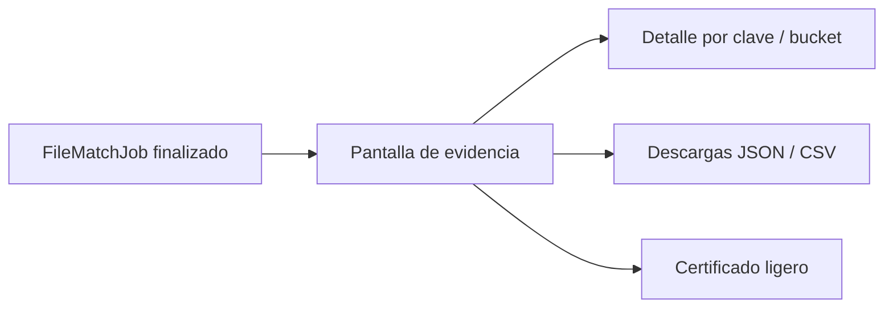
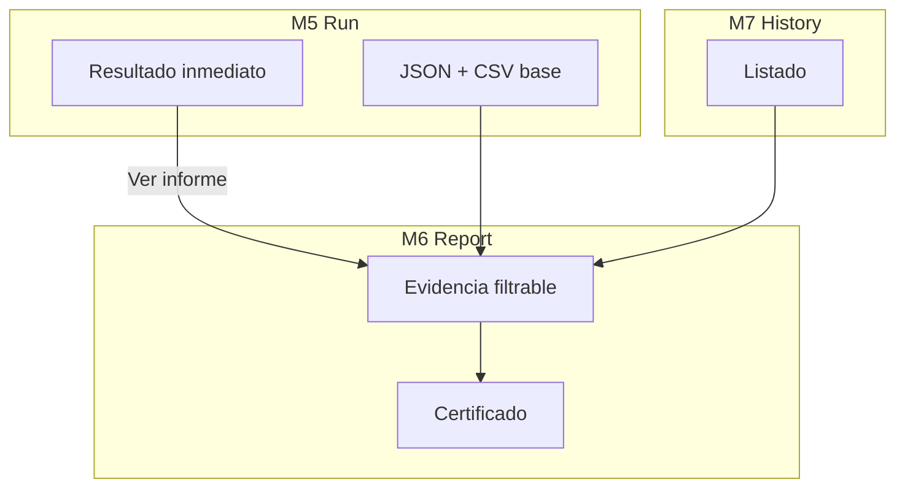
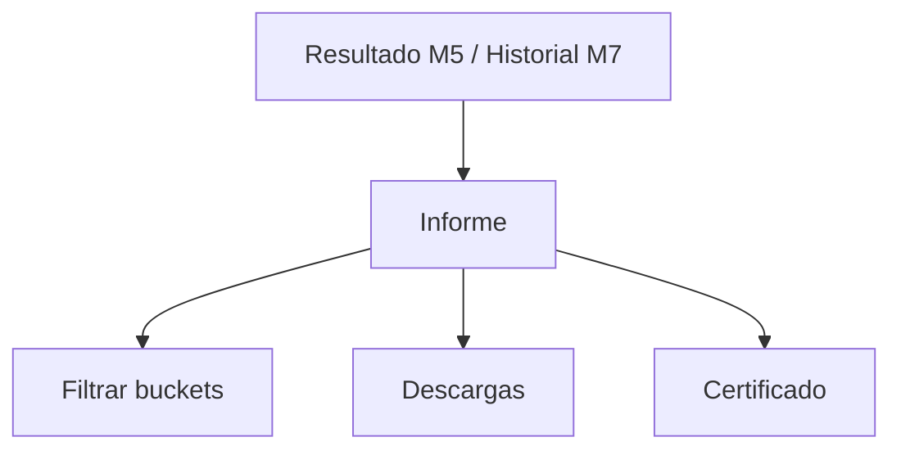

# Match Report — FILE MATCH Módulo 6

Proceso y especificación del **Módulo 6** de FILE MATCH: entregar **evidencia** de una conciliación ya ejecutada (resumen, detalle por bucket/clave, descargas y certificado ligero).

> Estado: **implementado** (Django Módulo 6).  
> Producto: [`../FILE_MATCH.md`](../FILE_MATCH.md).  
> Rama: `feature/file-match`.  
> Destino: `apps/file_match/report/` · `templates/file_match/report/` · URLs `/app/file-match/proyectos/<slug>/informe/<job_id>/...`.  
> Depende de: [`match_run.md`](match_run.md) (M5 — `FileMatchJob` + archivos base en storage).  
> Historial filtrable: [`history.md`](history.md) (M7 — implementado).  
> Familia §2: [`../APP_FACTORY_HIGH_REUSE.md`](../APP_FACTORY_HIGH_REUSE.md) §4.  
> Prototipos: [`../../prototype/file_match/report/`](../../prototype/file_match/report/).

---

## Propósito

Permitir que un usuario autorizado **consulte y descargue la evidencia** de un `FileMatchJob` ya finalizado:

1. **Resumen** (veredicto, métricas, hashes A/B, versión, duración);
2. **Detalle de diferencias** (por clave: bucket, valores compare A/B, mensajes);
3. **Descargas** JSON + CSV (MVP; M5 ya genera archivos base);
4. **Certificado ligero** (hashes + versión + veredicto + usuario + timestamp) para auditoría / handoff.

El Módulo 5 ya muestra un resultado inmediato y escribe `match_report.json` + `match_diff.csv`. El Módulo 6 **profundiza** la UX de evidencia: filtros por bucket, ofuscación, certificado y permisos de descarga.

---

## Qué es / qué hace / qué no hace

| Pregunta | Respuesta |
|----------|-----------|
| **¿Qué es?** | La vista de **informe / evidencia** de una conciliación |
| **¿Qué hace?** | Presenta y descarga la evidencia del job; ofrece certificado ligero |
| **¿Qué no hace?** | No ejecuta ni re-ejecuta el match; no edita definición; no es el historial filtrable (M7) |
| **Copy UX** | “Informe de conciliación” / “evidencia” / “diferencias” / “certificado” — **no** “informe de gate” ni “informe de transformación” |

---

## Relación con M5 / GATE / DMS

| Tema | Decisión FILE MATCH |
|------|---------------------|
| Job | Reusar `FileMatchJob` (sin migración nueva prevista) |
| Archivos base | `match_report.json` + `match_diff.csv` ya escritos en M5 |
| UX | Pantalla dedicada de evidencia (más rica que `run/result`) |
| Certificado | Nuevo artefacto ligero (pantalla + descarga texto/JSON) |
| Ofuscación | Alineada a espíritu FILE GATE; roles Match §12 |
| TTL | Alineado a intake DMS (p. ej. 7 días) |
| Historial | Entrada desde M7; CTA desde resultado M5 |

---

## Alcance

| Incluido | Excluido |
|----------|----------|
| Vista de evidencia por job | Ejecutar / re-ejecutar (M5) |
| Resumen + métricas + snapshots de reglas | Editar perfiles / reglas / publicar |
| Tabla de diferencias filtrable por bucket | Historial filtrable completo (M7) |
| Ofuscación de valores en UI | Certificado HTML avanzado / firma crypto (Fase 2) |
| Descarga JSON + CSV (reuso storage M5) | Regenerar informe tras TTL (solo aviso) |
| Certificado ligero imprimible / descargable | API / webhook de informe (Fase 3) |
| TTL de descarga | Re-subir A/B sin nuevo job |

---

## Responsabilidades

| Sí | No |
|----|-----|
| Mostrar evidencia completa del job | Volver a parsear A/B |
| Filtrar / paginar detalle por bucket | Cambiar veredicto del job |
| Servir descargas y certificado | Gestionar miembros |
| Respetar roles CO / ofuscación | Bridge FILE GATE |

---

## Prerrequisitos

| Condición | Si no se cumple |
|-----------|-----------------|
| Job existe y pertenece al proyecto / compañía | 404 / acceso denegado |
| Job en estado final (`completed` / `failed` / `partial`) | “La conciliación aún no finalizó” |
| Rol con permiso de ver evidencia (ver § Roles) | Forbidden |
| Archivos de informe aún en storage (TTL) | UX “evidencia expirada” (metadatos sí; descargas no) |

---

## Flujo de usuario

1. Desde resultado M5 o historial M7 → **Ver informe / evidencia**.
2. Ver resumen (veredicto, métricas, archivos A/B, versión, ejecutor).
3. Explorar diferencias (filtro por bucket; valores ofuscados por defecto).
4. Descargar JSON y/o CSV.
5. Abrir / imprimir / descargar **certificado ligero**.
6. Si TTL venció → aviso; metadatos del job siguen visibles.

| Pantalla | Contenido |
|----------|-----------|
| `report/detail.html` | Evidencia completa del job |
| `report/certificate.html` | Certificado ligero imprimible |
| `report/detail_help.html` | Ayuda: buckets, ofuscación, TTL |
| `report/index.html` | Índice prototipos |

---

## Entregables del informe

### 1. Resumen

| Campo | Origen |
|-------|--------|
| Veredicto | `job.verdict` (`passed` / `failed` / `partial`) |
| Estado técnico | `job.status` |
| Filas A / B | `metrics.rows_a` / `rows_b` |
| matched / mismatch / only_a / only_b / duplicate_key | `metrics.*` |
| % cuadre | `metrics.match_pct` |
| Duración | `metrics.duration_ms` |
| Archivo A | nombre, tamaño, `file_a_hash` |
| Archivo B | nombre, tamaño, `file_b_hash` |
| Versión publicada | `published_version_number` |
| Reglas snapshot | `rules_snapshot` (clave / compare / normalize / verdict) |
| Ejecutor / timestamps | `executed_by`, `created_at`, `finished_at` |

### 2. Detalle de diferencias

| Campo | Notas |
|-------|-------|
| `bucket` | `matched` / `value_mismatch` / `only_a` / `only_b` / `duplicate_key` |
| `key` | Clave lógica normalizada (label) |
| `diffs[]` | Pares compare: campo A/B + valores (mismatch) |
| `count_a` / `count_b` | Solo en `duplicate_key` |
| mensajes | Opcional (política duplicados, truncado) |

Tope UI: p. ej. 200 filas (mismo espíritu que `detail_preview` M5). CSV/JSON pueden contener el conjunto almacenado del informe.

Filtros MVP: por bucket; búsqueda de texto en clave (opcional).

### 3. Descargas (MVP)

| Artefacto | Contenido |
|-----------|-----------|
| `match_report.json` | Payload completo (resumen + rules_snapshot + detail) |
| `match_diff.csv` | Columnas: bucket, key, field_a, field_b, value_a, value_b, note |

Reusar rutas de storage / download de M5; M6 añade la **pantalla** y el certificado. No duplicar generación salvo regeneración explícita (no MVP).

### 4. Certificado ligero

Documento corto (pantalla + descarga texto/JSON) con:

| Campo | Descripción |
|-------|-------------|
| Producto | FILE MATCH / Conciliador |
| Proyecto | slug + nombre |
| Job id | UUID |
| Archivo A | nombre + tamaño + `content_hash` |
| Archivo B | nombre + tamaño + `content_hash` |
| Versión de definición | número publicado |
| Resultado | veredicto + métricas clave (% / matched / mismatches) |
| Usuario | quien ejecutó |
| Timestamps | inicio / fin (ISO) |
| Compañía | nombre (no datos cruzados) |

**No** es firma criptográfica ni sello notarial. Es evidencia operativa reproducible con hashes A/B + versión + job id.

Fase 2: certificado HTML imprimible con branding / QR opcional.

---

## Ofuscación de valores

| ID | Regla |
|----|-------|
| O1 | Por defecto, la UI muestra valores ofuscados (p. ej. primeros 2 + `***`). |
| O2 | PA / ED pueden revelar valores en pantalla (toggle explícito). |
| O3 | GE ve ofuscado en MVP; revelar = solo PA/ED. |
| O4 | CO no descarga CSV/JSON con valores de fila; solo metadatos + certificado sin celdas. |
| O5 | CSV/JSON descargados por PA/ED/GE: valores **completos** en MVP. |
| O6 | Campos sensibles forzados (Fase 2). |

---

## Roles y permisos (informe)

| Acción | PA | ED | GE | CO |
|--------|----|----|----|-----|
| Ver resumen / certificado (metadatos) | Sí | Sí | Sí | Sí |
| Ver tabla de diferencias (valores ofuscados) | Sí | Sí | Sí | No* |
| Revelar valores en UI | Sí | Sí | No | No |
| Descargar JSON / CSV | Sí | Sí | Sí | No |
| Imprimir / descargar certificado | Sí | Sí | Sí | Sí |

\*CO: en MVP no ve detalle de filas; solo estado, métricas agregadas y certificado sin valores de celda.

---

## Reglas de negocio

| ID | Regla |
|----|-------|
| REP1 | Solo jobs del mismo proyecto / compañía. |
| REP2 | No se recalcula el match al abrir el informe (solo lectura). |
| REP3 | Descargas respetan TTL; metadatos del job permanecen. |
| REP4 | Ofuscación y roles según tabla § Roles. |
| REP5 | Copy: “informe de conciliación / evidencia”, no “gate”. |
| REP6 | Completar M6 no sustituye M7 (historial). |
| REP7 | Certificado incluye **ambos** hashes (A y B). |

---

## Validaciones / mensajes

| Situación | Severidad / UX |
|-----------|----------------|
| Job no encontrado | **Error** / redirect hub |
| Job aún running | Aviso + enlace a resultado M5 |
| Sin permiso descarga | **Forbidden** |
| Evidencia expirada | Aviso; deshabilitar botones descarga |
| Kind incorrecto | **Forbidden** |

Mensajes: ampliar [`UI_MESSAGES.md`](../definition_app/UI_MESSAGES.md) §3.11 bloque **Módulo 6** al implementar.

### Mensajes previstos (borrador)

| Situación | Tag | Texto |
|-----------|-----|-------|
| Evidencia expirada | warning UX | La evidencia de descarga expiró. Los metadatos del job siguen disponibles. |
| Sin permiso detalle | `error` | No tiene permiso para ver el detalle de diferencias. |
| Sin permiso descarga | `error` | No tiene permiso para descargar el informe de este proyecto. |
| Job no finalizado | UX | La conciliación aún no finalizó. |
| Job no encontrado | `error` | No se encontró la conciliación solicitada. |

---

## Modelo de datos (reuso)

| Artefacto | Uso |
|-----------|-----|
| `FileMatchJob` | Fuente de verdad del informe |
| Storage reports | `match_report.json` / `match_diff.csv` |
| Certificado | Generado on-the-fly desde job (no tabla nueva MVP) |

Sin migración nueva prevista.

---

## Pantallas (prototipo → template)

| Prototipo | Template definitivo |
|-----------|---------------------|
| `report/detail.html` | `templates/file_match/report/detail.html` |
| `report/certificate.html` | `…/certificate.html` |
| `report/detail_help.html` | `…/detail_help.html` |
| `report/index.html` | Índice prototipos |

URLs previstas:

| Ruta | Nombre |
|------|--------|
| `/app/file-match/proyectos/<slug>/informe/<job_id>/` | `report_detail` |
| `…/informe/<job_id>/ayuda/` | `report_detail_help` |
| `…/informe/<job_id>/certificado/` | `report_certificate` |
| `…/informe/<job_id>/certificado/descargar/` | `report_certificate_download` |
| Descargas JSON/CSV | Reusar `run_download` o alias bajo informe |

Abrir: `prototype/file_match/report/detail.html`.

---

## Casos de uso

### FM-REP01 — Ver evidencia tras fallar

| | |
|---|---|
| **Flujo** | Resultado M5 `failed` → Ver informe → filtrar `value_mismatch` |
| **Resultado** | Tabla de claves con diffs; descarga CSV |

### FM-REP02 — Certificado para auditoría

| | |
|---|---|
| **Flujo** | Abrir certificado → imprimir / descargar |
| **Resultado** | Hashes A/B + vN + veredicto + usuario + timestamps |

### FM-REP03 — Rol CO

| | |
|---|---|
| **Flujo** | CO abre informe |
| **Resultado** | Resumen + certificado; sin tabla de filas ni CSV/JSON |

### FM-REP04 — Evidencia expirada

| | |
|---|---|
| **Flujo** | Job antiguo fuera de TTL |
| **Resultado** | Metadatos visibles; descargas deshabilitadas + aviso |

### FM-REP05 — Revelar valores (PA)

| | |
|---|---|
| **Flujo** | PA activa “mostrar valores” |
| **Resultado** | Diffs en claro en UI; GE no puede |

---

## Criterios de “módulo 6 completo” (definición)

- [x] Propósito y frontera M5 / M7 claros
- [x] Entregables resumen / detalle / descargas / certificado
- [x] Ofuscación + roles + TTL
- [x] Casos FM-REP01–05
- [x] Mapa prototipo → template
- [x] Prototipos HTML listos
- [x] Prototipos revisados / OK implícito («Desarrolla el módulo»)
- [x] Usuario: «Desarrolla el módulo»

Checklist al implementar:

- [x] `apps/file_match/report/` + templates
- [x] Vista evidencia con filtro bucket + ofuscación
- [x] Certificado ligero + descarga
- [x] CTA desde `run/result` → informe
- [x] UI_MESSAGES §3.11 Módulo 6
- [x] TTL / evidencia expirada

---

## Implementación (referencia)

| Pieza | Ubicación |
|-------|-----------|
| App | `apps/file_match/report/` |
| Servicio | `match_report_service` (contexto + certificado + permisos) |
| Templates | `templates/file_match/report/` |
| URLs | `/app/file-match/proyectos/<slug>/informe/<job_id>/...` |
| Reuso | `match_run_service.resolve_download_path` / `build_job_view` |

---

## Próximos pasos

1. Revisar prototipos `prototype/file_match/report/`.
2. Usuario: «Desarrolla el módulo» → Django M6.
3. Abrir Módulo 7 [`history.md`](history.md).
4. No merge a `main` / Railway hasta MVP revisado.

---

## Referencias

| Documento | Uso |
|-----------|-----|
| [`../FILE_MATCH.md`](../FILE_MATCH.md) | Producto / Módulo 6 |
| [`match_run.md`](match_run.md) | Job + archivos base |
| [`../definition_app_FILE_GATE/validation_report.md`](../definition_app_FILE_GATE/validation_report.md) | UX hermano (evidencia) |
| [`../definition_app/UI_MESSAGES.md`](../definition_app/UI_MESSAGES.md) | Mensajes §3.11 |
| [`README.md`](README.md) | Índice |

---

*Documento: `docs/definition_app_FILE_MATCH/match_report.md` — Módulo 6 FILE MATCH (informe y evidencia). Implementado en `apps/file_match/report/`.*
