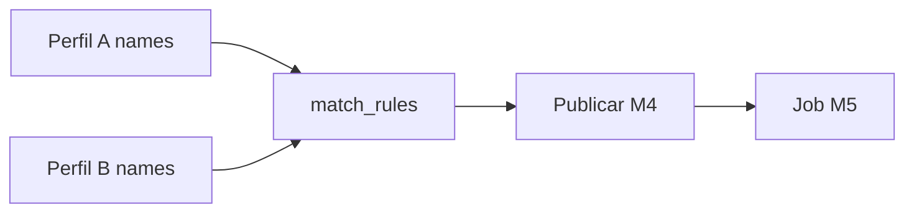
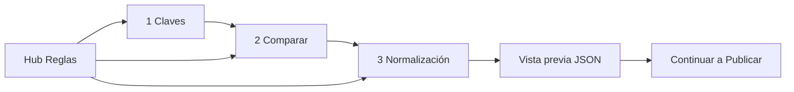

# Match Rules — FILE MATCH Módulo 3

Proceso y especificación del **Módulo 3** de FILE MATCH: declarar **cómo se cruzan** el archivo A y el B (claves, campos a comparar, normalización) y persistirlo como `MatchRules` en la versión del proyecto conciliador.

> Estado: **implementado** (Django Módulo 3).  
> Producto: [`../FILE_MATCH.md`](../FILE_MATCH.md).  
> Rama: `feature/file-match`.  
> Destino: `apps/file_match/rules/` · `templates/file_match/rules/` · URLs `/app/file-match/proyectos/<slug>/reglas/...`.  
> Persistencia: modelo `FileMatchRules` (`related_name=match_rules`).  
> Depende de: [`profile_a.md`](profile_a.md) · [`profile_b.md`](profile_b.md).  
> **No incluye** publicar ni ejecutar (módulos 4–5).  
> Familia §2: [`../APP_FACTORY_HIGH_REUSE.md`](../APP_FACTORY_HIGH_REUSE.md) §4.  
> Prototipos: [`../../prototype/file_match/rules/`](../../prototype/file_match/rules/).

---

## Propósito

Permitir que el diseñador declare, sin programar:

1. **Clave de cruce** — qué campo(s) de A se emparejan con qué campo(s) de B (simple o compuesta).
2. **Campos a comparar** — qué pares A↔B se contrastan cuando la clave coincide.
3. **Normalización** — trim / case-fold aplicados a clave (y opcionalmente a compare) antes del match.

El resultado alimenta el comparador del Módulo 5 (job 1:1) y se congela al **publicar** (Módulo 4).

Sin reglas de cruce (al menos una clave usable), no hay conciliación publicada válida.

---

## Qué es / qué hace / qué no hace

| Pregunta | Respuesta |
|----------|-----------|
| **¿Qué es?** | El editor de **reglas de cruce** (clave + compare + normalize) |
| **¿Qué hace?** | Persiste JSON `match_rules` en la versión `kind=file_match` |
| **¿Qué no hace?** | No redefine perfiles A/B; no sube archivos; no publica; no ejecuta el match |
| **Copy UX** | “Reglas de cruce” / “Clave” / “Campos a comparar” / “Normalización” — **no** “mapeo ETL” ni “field mapping FilePipe” (aunque el patrón UX se parezca) |

---

## Relación con A / B / DMS / Reverse

| Tema | Decisión FILE MATCH (Reglas) |
|------|------------------------------|
| Campos disponibles | Selectores alimentados por `name` del perfil A y del perfil B (borrador) |
| Cardinalidad MVP | Fija **1:1** (M2 producto) |
| Tolerancia numérica | **No** en MVP (Fase 2) |
| Persistencia | JSON `match_rules` en la versión (modelo propio o campo en config Match) |
| Obra nueva | Comparador en `apps/file_match/services/` (M5); este módulo solo **define** reglas |



---

## Alcance de este documento

| Incluido | Excluido |
|----------|----------|
| Clave simple / compuesta (pares A↔B) | Edición de perfiles A/B |
| Campos a comparar (pares A↔B) | Ejecutar match / informe |
| Normalización MVP (trim, case_fold) | Tolerancia numérica / fuzzy |
| Política mínima duplicados / veredicto (borrador UI) | Publicar definición |
| Hub + pantallas de edición | Bridge FILE GATE |

---

## Responsabilidades

| Sí | No |
|----|-----|
| Enlazar `name` de A con `name` de B para clave y compare | Inventar campos que no existen en A/B |
| Guardar borrador de `match_rules` | Publicar solo las reglas |
| Validar completitud mínima al guardar / strict en M4 | Ejecutar conciliación |

---

## Proceso (asistente / hub)

No es el wizard de 6 pasos de SourceProfile. Es un **hub de reglas** con 3 secciones editables (+ vista previa):



| Sección | Título UX | Contenido |
|---------|-----------|-----------|
| Hub | Reglas de cruce | Resumen: # claves, # compare, flags normalize; CTA continuar / publicar |
| 1 | Claves de cruce | Filas `{ a, b }`; orden = composición (concat lógica) |
| 2 | Campos a comparar | Filas `{ a, b }`; 0 permitido (solo presencia) |
| 3 | Normalización | `trim`, `case_fold_keys` (+ opcional `case_fold_compare` Fase 2) |
| Preview | Vista previa | JSON `match_rules` de solo lectura |

### Diferencias vs Field Mapping FilePipe / Reverse

| Tema | Match Rules | Field Mapping DMS/Reverse |
|------|-------------|---------------------------|
| Dirección | A ↔ B (simétrico para cruce) | Origen → destino |
| Objetivo | Emparejar filas + detectar diferencias | Transformar / emitir layout |
| Vacío en compare | Válido (solo presencia) | Suele exigir mapeos |
| Cardinalidad | 1:1 fija MVP | N/A |

---

## Flujo de usuario (módulo 3)

1. Abrir proyecto → **Reglas** (o CTA desde hub Perfil B 6/6).
2. Si A o B no tienen campos: aviso + enlaces a perfiles (no bloqueo duro de navegación; sí al publicar).
3. Definir al menos un par de clave → guardar borrador.
4. (Opcional) Añadir pares a comparar y ajustar normalización.
5. CTA → **Publicar** (Módulo 4) cuando A + B + reglas estén listos.

---

## Reglas de negocio (módulo 3)

| ID | Regla |
|----|-------|
| R1 | Solo `PA` / `ED` editan reglas. |
| R2 | Edición en **borrador** de la versión. |
| R3 | Cada lado de un par (`a` / `b`) debe referir un `name` existente en el perfil correspondiente (al guardar strict / al publicar). |
| R4 | Al menos **un** par de clave usable para publicar (M4). |
| R5 | Cero pares `compare` es válido → solo buckets de presencia (`matched` / `only_a` / `only_b`). |
| R6 | Cardinalidad MVP fija `1:1`; no se ofrece N:M en UI. |
| R7 | `name` duplicado en el mismo lado de la clave compuesta → error. |
| R8 | Completar M3 no basta para conciliar: falta publicar (M4). |
| R9 | Normalización MVP: `trim` y `case_fold_keys` (booleanos). Sin tolerancia numérica. |
| R10 | `on_duplicate_key`: `bucket` (default) o `fail` (job failed) — ver producto M3. |
| R11 | Tenant / membresía igual que perfiles Match. |
| R12 | Persistencia: JSON en la versión (`MatchRules` / campo en config), **no** mezclado dentro de SourceProfile A o B. |

---

## Validaciones

| Regla | Cuándo | Severidad |
|-------|--------|-----------|
| Sin pares `key` | Strict (M4) / opcional soft en hub | **Error** al publicar |
| `a` o `b` vacío en un par | Guardar | **Error** |
| `a`/`b` no está en fields del perfil | Strict (M4); warning en borrador si A/B cambió | **Error** / **Advertencia** |
| Par clave duplicado idéntico | Guardar | **Error** |
| Par compare con el mismo campo usado solo en clave | Permitido | — |
| Tolerancia / fuzzy en payload | Guardar | **Error** (no soportado MVP) |

Canal UI: ampliar [`UI_MESSAGES.md`](../definition_app/UI_MESSAGES.md) §3.11 al implementar.

---

## Modelo de datos

| Concepto | Artefacto | Notas |
|----------|-----------|-------|
| Perfil A | `DmsSourceProfile` | M1 |
| Perfil B | `FileMatchSourceB` | M2 (B12) |
| Reglas | JSON `match_rules` en versión | Este módulo |
| Congelar | Publish M4 | Snapshot A+B+rules |

### Forma JSON (`match_rules`)

```json
{
  "cardinality": "1:1",
  "key": [
    { "a": "documento", "b": "id_cliente" }
  ],
  "compare": [
    { "a": "monto", "b": "importe" },
    { "a": "fecha", "b": "fecha_op" }
  ],
  "normalize": {
    "trim": true,
    "case_fold_keys": true
  },
  "on_duplicate_key": "bucket",
  "verdict": {
    "fail_on_only_a": true,
    "fail_on_only_b": true,
    "fail_on_mismatch": true,
    "fail_on_duplicate_key": false
  }
}
```

> Demo alineado a EJ-01 / perfiles prototipo: A.`documento`↔B.`id_cliente`, A.`monto`↔B.`importe`.

### Semántica de clave compuesta

Varios pares en `key` se combinan en **una** clave lógica (orden de lista = orden de composición). Ejemplo EJ-02: `nit`+`fecha` ↔ `nit`+`fecha`.

### Semántica de compare vacío

Si `compare: []`, dos filas con la misma clave normalizada → `matched` (existencia). No hay `value_mismatch`.

---

## Diseño de pantallas

### Principios UX

| Principio | Aplicación |
|-----------|------------|
| Un trabajo por sección | Claves / Comparar / Normalize separados |
| Campos reales | Selects desde A y B; hint si perfil vacío |
| Preview | JSON o tabla resumen siempre visible en hub |
| No publicar aquí | CTA a Publicar (M4), no botón “Publicar reglas” |
| Copy | “Cruce”, “contraparte”, badges Lado A / Lado B |

### Wire hub

1. Breadcrumb Conciliador / slug / Reglas  
2. Scope + versión borrador  
3. Stats: # claves · # compare · normalize on/off  
4. Aviso si A o B incompletos  
5. Cards de sección + vista previa  
6. CTA → Publicar (si completo) / Continuar edición  

### Wire sección claves

1. Tabla de pares: select campo A · select campo B · eliminar  
2. “+ Añadir componente de clave”  
3. Hint: orden importa en clave compuesta  
4. Guardar borrador  

---

## Pantallas (prototipo → template)

| Prototipo | Template definitivo |
|-----------|---------------------|
| `prototype/file_match/rules/index.html` | — (índice demo) |
| `prototype/file_match/rules/hub.html` | `templates/file_match/rules/hub.html` |
| `prototype/file_match/rules/hub_help.html` | idem |
| `prototype/file_match/rules/keys.html` | `…/keys.html` |
| `prototype/file_match/rules/compare.html` | `…/compare.html` |
| `prototype/file_match/rules/normalize.html` | `…/normalize.html` |
| `proto.css` | Solo demo |

---

## URLs previstas

Prefijo: `/app/file-match/proyectos/<slug>/reglas/`

| Vista | Ruta |
|-------|------|
| Hub | `.../reglas/` |
| Ayuda | `.../reglas/ayuda/` |
| Claves | `.../reglas/claves/` |
| Comparar | `.../reglas/comparar/` |
| Normalización | `.../reglas/normalizacion/` |
| Guardar | `.../reglas/guardar/` (POST JSON) |

---

## Mensajes UI

Catálogo: [`UI_MESSAGES.md`](../definition_app/UI_MESSAGES.md) §3.11 Módulo 3.

---

## Checklist de cierre del módulo

- [x] Doc `match_rules.md` (base)
- [x] Prototipos hub + claves + compare + normalize
- [x] Revisión de usuario
- [x] Usuario: **«Desarrolla el módulo»**
- [x] App `apps/file_match/rules/` + templates
- [x] Persistencia JSON `FileMatchRules` + UI_MESSAGES
- [x] CTA desde Perfil B / hub proyecto → Reglas
- [ ] CTA → Publicar (M4) — placeholder hasta implementar M4

---

## Decisiones abiertas

| # | Tema | Recomendación |
|---|------|---------------|
| 1 | ¿Dónde vive el JSON? | Campo `match_rules` en modelo de versión Match o `FileMatchRules` OneToOne con `DmsMappingVersion` |
| 2 | ¿`case_fold_compare` en MVP? | No; solo keys |
| 3 | ¿Editor de `verdict` en MVP? | Defaults fijos; UI avanzada Fase 2 |
| 4 | ¿Bloquear reglas si A/B incompletos? | Aviso; bloqueo solo en publish strict |

---

*Documento: `docs/definition_app_FILE_MATCH/match_rules.md` — Módulo 3 Reglas de cruce (FILE MATCH).*
