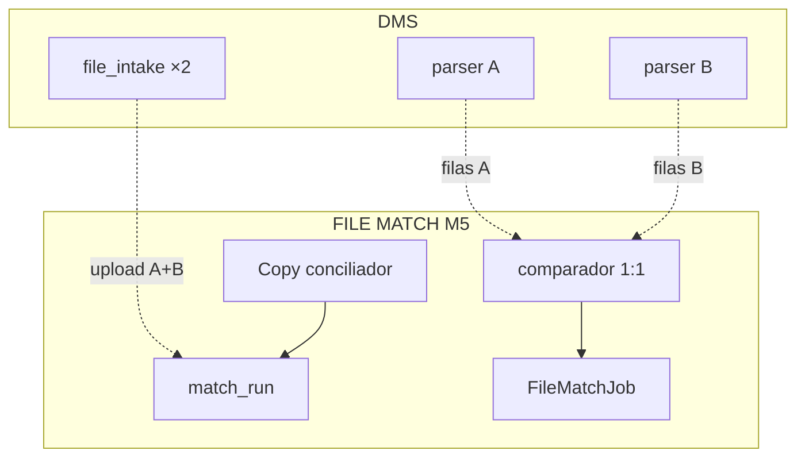
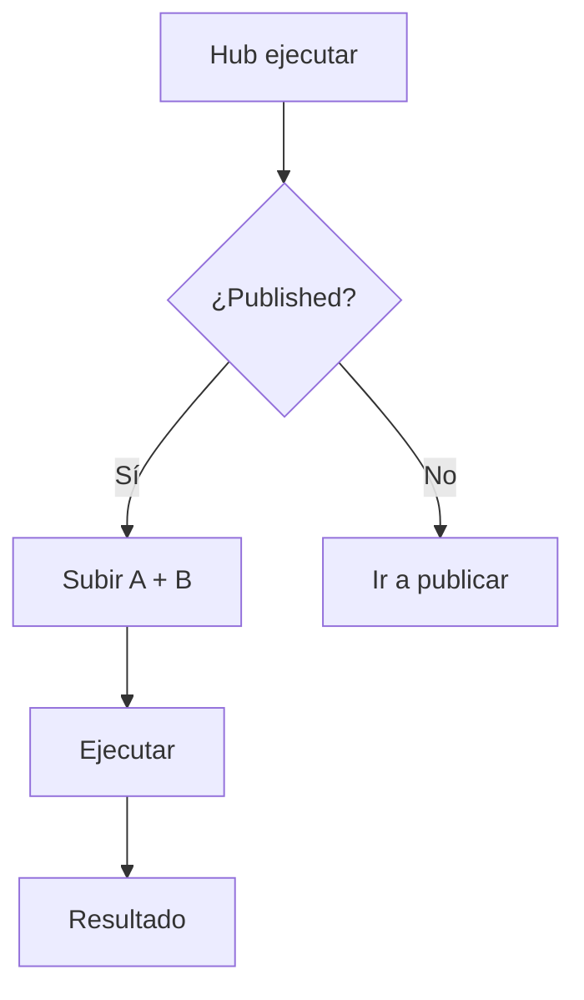

# Match Run — FILE MATCH Módulo 5

Proceso y especificación del **Módulo 5** de FILE MATCH: **subir archivo A + archivo B**, ejecutar la **conciliación 1:1** contra la versión **publicada** (perfiles + reglas) y mostrar el **resultado inmediato** (métricas + buckets + veredicto).

> Estado: **implementado** (Django Módulo 5).  
> Producto: [`../FILE_MATCH.md`](../FILE_MATCH.md).  
> Rama: `feature/file-match`.  
> Destino: `apps/file_match/run/` · `templates/file_match/run/` · URLs `/app/file-match/proyectos/<slug>/ejecutar/...`.  
> Base técnica: parsers DMS ×2 ([`../definition_app_DMS/`](../definition_app_DMS/)) + intake seguro ([`../definition_app_DMS/file_intake.md`](../definition_app_DMS/file_intake.md)) + **comparador propio** Match.  
> **Prerrequisito:** [`publish.md`](publish.md) (versión publicada activa).  
> **No incluye** informe/certificado profundo ([`match_report.md`](match_report.md) M6) ni historial filtrable ([`history.md`](history.md) M7) ni bridge GATE (M8).  
> Familia §2: [`../APP_FACTORY_HIGH_REUSE.md`](../APP_FACTORY_HIGH_REUSE.md) §4.  
> Prototipos: [`../../prototype/file_match/run/`](../../prototype/file_match/run/).

---

## Propósito

Permitir que un ejecutor autorizado suba **dos archivos** (lado A y lado B), los parseé con los perfiles de la versión publicada, cruce por clave según `match_rules` y obtenga de inmediato:

1. un **veredicto** de job (`passed` / `failed` / `partial`);
2. **métricas** (filas A/B, matched, mismatches, only_*, duplicados, % cuadre);
3. un **resumen** de buckets;
4. acceso a descargas básicas (MVP; detalle en M6).

El job es de **solo lectura** sobre A y B: no altera la definición publicada ni “arregla” los archivos.

Sin versión publicada no hay conciliación (PUB3 / M1 producto).

---

## Qué es / qué hace / qué no hace

| Pregunta | Respuesta |
|----------|-----------|
| **¿Qué es?** | El flujo de **ejecución**: upload A+B → job de match → resultado |
| **¿Qué hace?** | Intake ×2 + parse DMS ×2 + comparador Match 1:1 → persiste job + métricas |
| **¿Qué no hace?** | No edita perfiles/reglas; no publica; no es el informe certificado (M6) ni el historial rico (M7) |
| **Copy UX** | “Ejecutar conciliación” / “Conciliar” / “archivo A” / “archivo B” / “informe de diferencias” — **no** “generar layout”, “validar gate” ni “transformar FilePipe” |

---

## Relación con DMS / GATE / Reverse

| Tema | Decisión FILE MATCH |
|------|---------------------|
| Upload | Reusar patrón `file_intake` (límites, MIME, storage tenant-safe) **dos veces** (A y B) |
| Parse | Parsers DMS sobre snapshot A (`DmsSourceProfile`) y B (`FileMatchSourceB`) de la versión **publicada** |
| Motor | **Comparador nuevo** en `apps/file_match/services/` (no `transform_execution`) |
| Versión | Solo `DmsProjectConfig.current_version` con `status=published` |
| Extensiones | Según `file_type_code` publicado de cada lado (whitelist Match) |
| Roles | `PA` / `ED` / `GE` ejecutan y descargan; `CO` no descarga filas de negocio (§12) |
| FILE GATE | Opcional vía M8; este módulo no lo exige |
| Historial | Enlace “ver recientes” / placeholder M7 |
| Persistencia job | Modelo propio `FileMatchJob` (preferido; ver § Modelo) |

### Pipeline de un job

---

## Alcance

| Incluido | Excluido |
|----------|----------|
| Hub ejecutar + ayuda | Editar M1–M4 |
| Upload dual (A y B) en la misma corrida | Un solo archivo / “re-match” sin re-upload (Fase 2) |
| Ejecución síncrona MVP (request → resultado) | Scheduling / API / cola async (Fase 3) |
| Persistencia job + métricas + detalle resumido | Certificado / informe rico (M6) |
| Pantalla de resultado inmediato | Historial filtrable (M7) |
| Bloqueo sin published | Bridge FILE GATE (M8) |
| Dry-run / preview N filas (opcional MVP+) | Generar archivo “conciliado” de negocio |

---

## Responsabilidades

| Sí | No |
|----|-----|
| Validar extensión/tamaño vs perfiles publicados A y B | Cambiar perfiles o reglas |
| Parsear con parsers DMS | Inventar parsers nuevos |
| Emparejar 1:1 y clasificar buckets | Transformar / emitir layout |
| Persistir job + veredicto | Gestionar miembros |
| Entregar resumen + enlaces descarga MVP | Certificado formal (M6) |

---

## Proceso (UX)

1. Usuario abre **Ejecutar / Conciliar** (hub proyecto o CTA post-publicar).
2. Si no hay versión publicada → bloqueo + enlace a M4.
3. Ve resumen de definición activa (vN, tipos A/B, # claves).
4. Sube **archivo A** y **archivo B** (browse / drag-drop).
5. **Ejecutar conciliación** → job → pantalla resultado.
6. Descargar diferencias (CSV/JSON MVP) y/o ir a informe (M6) / historial (M7 placeholder).

| Pantalla | Contenido |
|----------|-----------|
| `run/hub.html` | Estado versión activa; dual upload; CTA ejecutar; jobs recientes (opcional) |
| `run/hub_blocked.html` | Variante sin published (prototipo) |
| `run/hub_help.html` | Qué se ejecuta; roles; buckets |
| `run/result.html` | Veredicto, métricas, top buckets, CTAs descarga / volver |
| Parcial `_project_scope` | Scope Conciliador |

**No** es un wizard de 6 pasos: es hub de decisión + upload + resultado.

---

## Prerrequisitos de ejecución

| Condición | Si no se cumple |
|-----------|-----------------|
| `project_kind = file_match` | Acceso denegado |
| Existe `current_version` publicada | Bloqueo UX + enlace a Publicar |
| Snapshot A + B + rules en esa versión | Error de integridad |
| Rol `PA`, `ED` o `GE` | Forbidden |
| Archivos A y B presentes y válidos | Error de upload |
| Extensión A acorde a perfil A publicado | **Error** |
| Extensión B acorde a perfil B publicado | **Error** |

---

## Reglas de negocio

| ID | Regla |
|----|-------|
| RUN1 | Solo versión **publicada** activa (`current_version`). |
| RUN2 | Permisos: `PA` / `ED` / `GE` ejecutan y descargan informe; `CO` no descarga filas (M6/M7). |
| RUN3 | El job **no** modifica la definición publicada. |
| RUN4 | Cardinalidad MVP fija **1:1** (una fila A ↔ a lo sumo una B por clave). |
| RUN5 | Extensión/MIME de cada archivo debe coincidir con el `file_type` publicado de ese lado. |
| RUN6 | Límites de tamaño / filas según intake + tope Match documentado (evitar OOM). |
| RUN7 | Claves duplicadas en un lado → bucket `duplicate_key` o job `failed` según `on_duplicate_key`. |
| RUN8 | Campos no listados en `compare` no entran en `value_mismatch`. |
| RUN9 | Veredicto agregado respeta `match_rules.verdict` (fail_on_only_*, fail_on_mismatch, …). |
| RUN10 | Tenant: compañía + membresía. |
| RUN11 | Parsers **solo** vía `apps.dms.*` (doble invocación); comparador en `apps/file_match/`. |
| RUN12 | Copy: conciliación / cruce A vs B — no “generar” ni “validar contrato”. |
| RUN13 | Completar M5 no sustituye M6 (informe) ni M7 (historial). |

---

## Buckets y veredicto

### Buckets de detalle (por clave lógica)

| Bucket | Significado |
|--------|-------------|
| `matched` | Misma clave; valores de `compare` iguales (o `compare` vacío) |
| `value_mismatch` | Misma clave; al menos un campo de `compare` difiere |
| `only_a` | Clave solo en A |
| `only_b` | Clave solo en B |
| `duplicate_key` | Clave repetida en A y/o B (integridad) |

### Veredicto del job

| Estado | Criterio MVP |
|--------|----------------|
| `passed` | Sin buckets que disparen fail según `verdict` (típicamente solo `matched`) |
| `failed` | Hay `only_*` / `value_mismatch` / `duplicate_key` según flags, o error fatal de parseo |
| `partial` | Tope de filas / `max_errors` / abort controlado antes de terminar ambos lados |

Normalización de clave (y opcionalmente compare): aplicar `match_rules.normalize` **antes** del empareje (`trim`, `case_fold_keys`).

### Semántica de clave compuesta

Varios pares en `key` → una clave lógica (concat / tupla en orden de lista). Misma semántica que M3.

---

## Validaciones

| Momento | Regla | Severidad |
|---------|-------|-----------|
| Abrir hub | Sin published | Bloqueo UX |
| Upload A | Extensión ≠ tipo A publicado | **Error** |
| Upload B | Extensión ≠ tipo B publicado | **Error** |
| Upload | Tamaño / MIME / nombre | **Error** |
| Ejecutar | Falta A o B | **Error** |
| Ejecutar | Rol sin execute | **Forbidden** |
| Ejecutar | Published desapareció | **Error** |
| Parse | Fatal en un lado | Job `failed` + mensaje |

Mensajes: ampliar [`UI_MESSAGES.md`](../definition_app/UI_MESSAGES.md) §3.11 bloque **Módulo 5** al implementar.

### Mensajes previstos (borrador catálogo)

| Situación | Tag | Texto |
|-----------|-----|-------|
| Job OK | `success` | Conciliación completada: {veredicto}. |
| Sin versión publicada | UX | Publique una definición antes de conciliar. |
| Falta archivo A/B | `error` | Seleccione el archivo A y el archivo B. |
| Extensión inválida | `error` | El archivo A/B no coincide con el tipo publicado (…). |
| Sin permiso | `error` | No tiene permiso para ejecutar conciliaciones en este proyecto. |
| Parse fatal | `error` | No se pudo leer el archivo A/B. Revise el perfil publicado. |
| Rechazos lectura (parcial) | veredicto `partial` | Hubo N rechazo(s) al leer A/B; el cruce usó solo filas válidas. |
| Inesperado | `error` | Ocurrió un error al conciliar. Si persiste, contacte al administrador. |

### Informe de lectura (parse issues)

Tras parsear A y B, los errores del parser DMS (`line`, `field`, `code`, `message`, `value`, `content_type`/`expected`) se normalizan con `side` (A|B) y se persisten:

| Artefacto | Uso |
|-----------|-----|
| `parse_issues.json` / `parse_issues.csv` | Evidencia descargable (PA/ED/GE) |
| `metrics.parse_issues_*` + preview | UI resultado |
| Inclusión en `match_report.json` | Cuando el job llega a conciliar |

- **Fatal** (sin filas válidas / `ParseError`): job `failed`, redirect a resultado con tabla + descarga.
- **Parcial** (hay filas OK + rechazos): el cruce usa solo filas válidas; si el veredicto del motor era `passed`, pasa a `partial` con aviso.

Topes: UI 100 filas; almacenamiento hasta 2000.

---

## Modelo de datos

### Decisión de persistencia (MVP)

| Opción | Notas | Recomendación |
|--------|-------|---------------|
| **A** — `FileMatchJob` (+ detalle JSON o tabla hija) | Dos inputs, sin target; claro en producto | **Preferida** |
| **B** — Especializar `DmsExecutionJob` | Forzar semántica “sin target” + 2 inputs | Evitar si complica |
| **C** — Dos jobs DMS enlazados | Complejidad de orquestación | **No** |

Preferencia alineada a FILE GATE (`ValidationJob` propio) y producto FILE MATCH (`MatchJob` en lineamientos).

### Campos mínimos del job

| Campo | Notas |
|-------|-------|
| `id` | UUID |
| `project` | FK |
| `published_version` / `published_version_number` | Snapshot usado |
| `status` / `verdict` | `passed` / `failed` / `partial` (+ estado técnico running/completed) |
| `file_a_*` / `file_b_*` | nombre, hash, tamaño, storage path |
| `metrics` | JSON: rows_a, rows_b, matched, value_mismatch, only_a, only_b, duplicate_key, duration_ms, match_pct |
| `detail` / issues | JSON o hijo: por clave, bucket, valores compare (MVP: JSON en job o archivo informe) |
| `rules_snapshot` | Copia de `match_rules` usada (reproducibilidad) |
| `created_by`, `created_at`, `finished_at` | Auditoría |
| TTL | Política de retención alineada a intake DMS |

### Reuso storage / parsers

| Artefacto | Uso |
|-----------|-----|
| Storage `MEDIA_ROOT/...` tenant-safe | Archivos A y B + artefacto informe |
| Parsers DMS | Filas tipadas / dicts por lado |
| `ExecutionErrorCode` (si aplica) | Códigos de parse/intake; no inventar |

---

## Algoritmo del comparador (MVP)

1. Resolver `current_version` published → cargar perfil A, B, `match_rules`.
2. Parse A → lista de filas; Parse B → lista de filas.
3. Para cada fila, construir **clave lógica** (pares `key`, con normalize).
4. Indexar B por clave; recorrer A:
   - clave ausente en B → `only_a`
   - clave con >1 fila en A o B → `duplicate_key` (política)
   - clave 1:1 → comparar campos `compare` → `matched` o `value_mismatch`
5. Claves solo en B → `only_b`.
6. Agregar métricas + veredicto según `verdict`.
7. Persistir job + escribir informe mínimo (JSON/CSV diferencias).

> Implementación: preferir sort-merge o dict index; documentar tope de filas antes de OOM.

---

## Pantallas (prototipo → template)

| Prototipo | Template definitivo |
|-----------|---------------------|
| `run/hub.html` | `templates/file_match/run/hub.html` |
| `run/hub_blocked.html` | misma vista con bloqueo |
| `run/hub_help.html` | `…/hub_help.html` |
| `run/result.html` | `…/result.html` |
| `run/index.html` | Índice prototipos |

Assets al implementar: JS upload dual + confirmación ejecutar; CSS `file_match_run.css` si hace falta; reuso estilos intake donde encaje.

Abrir: `prototype/file_match/run/hub.html`.

---

## Casos de uso

### FM-RUN01 — Primera conciliación

| | |
|---|---|
| **Flujo** | Published v1 → subir A+B → ejecutar |
| **Resultado** | Job con métricas; CTA descargar / ver resultado |

### FM-RUN02 — Sin publicar

| | |
|---|---|
| **Flujo** | Abrir Ejecutar sin `current_version` |
| **Resultado** | Bloqueo + enlace a Publicar |

### FM-RUN03 — Extensión incorrecta

| | |
|---|---|
| **Flujo** | Perfil A = CSV; usuario sube `.xlsx` como A |
| **Resultado** | Error upload; no se crea job |

### FM-RUN04 — Mismatches y only_*

| | |
|---|---|
| **Flujo** | Datos con diferencias de monto y claves faltantes |
| **Resultado** | `failed` (si verdict lo exige); buckets visibles |

### FM-RUN05 — Duplicados

| | |
|---|---|
| **Flujo** | Dos filas A con misma clave; `on_duplicate_key=bucket` |
| **Resultado** | `duplicate_key` en detalle; veredicto según flags |

### FM-RUN06 — Rol CO

| | |
|---|---|
| **Flujo** | CO abre ejecutar / intenta descargar |
| **Resultado** | Sin CTA ejecutar o forbidden; sin descarga de filas |

### FM-RUN07 — GE ejecuta

| | |
|---|---|
| **Flujo** | GE con published → upload → run |
| **Resultado** | Job OK; puede descargar informe MVP |

---

## Criterios de “módulo 5 completo” (definición)

- [x] Propósito y frontera M4 / M6 / M7 claros
- [x] Reuso parsers + intake; comparador propio documentado
- [x] Reglas RUN1–RUN13 + buckets + veredicto
- [x] Modelo `FileMatchJob` preferido
- [x] Casos FM-RUN01–07
- [x] Mapa prototipo → template
- [x] Prototipos HTML listos
- [x] Prototipos revisados / OK implícito («Desarrolla el módulo»)
- [x] Usuario: «Desarrolla el módulo»

Checklist al implementar:

- [x] Modelo `FileMatchJob` (+ migración) o decisión final documentada
- [x] `apps/file_match/run/` + `services/` comparador
- [x] Upload dual + parse A/B + match
- [x] Hub + result templates
- [x] Hub proyecto / Publicar: CTA Ejecutar activo
- [x] UI_MESSAGES §3.11 Módulo 5
- [x] Enlaces placeholder a M6/M7

---

## Implementación (referencia)

| Pieza | Ubicación |
|-------|-----------|
| App | `apps/file_match/run/` |
| Comparador | `apps/file_match/services/match_engine.py` (o similar) |
| Persistencia | `FileMatchJob` en `apps/file_match/models.py` |
| Templates | `templates/file_match/run/` |
| URLs | `/app/file-match/proyectos/<slug>/ejecutar/` (+ ayuda, resultado `<job_id>/`) |
| JS | upload dual + run |

---

## Próximos pasos

1. Revisar prototipos `prototype/file_match/run/`.
2. Usuario: «Desarrolla el módulo» → Django M5.
3. Abrir Módulo 6 [`match_report.md`](match_report.md) (puede solaparse en UX de descargas).
4. No merge a `main` / Railway hasta MVP revisado.

---

## Referencias

| Documento | Uso |
|-----------|-----|
| [`../FILE_MATCH.md`](../FILE_MATCH.md) | Producto / buckets / M5 |
| [`publish.md`](publish.md) | Prerrequisito published |
| [`match_rules.md`](match_rules.md) | Clave / compare / normalize / verdict |
| [`../definition_app_DMS/file_intake.md`](../definition_app_DMS/file_intake.md) | Upload seguro |
| [`../definition_app_FILE_GATE/validation_run.md`](../definition_app_FILE_GATE/validation_run.md) | UX hermano (1 archivo) |
| [`../definition_app_REVERSE/generate_run.md`](../definition_app_REVERSE/generate_run.md) | UX hermano (emisión) |
| [`../definition_app/UI_MESSAGES.md`](../definition_app/UI_MESSAGES.md) | Mensajes §3.11 |
| [`README.md`](README.md) | Índice |

---

*Documento: `docs/definition_app_FILE_MATCH/match_run.md` — Módulo 5 FILE MATCH (ejecutar conciliación). Implementado en `apps/file_match/run/`.*
