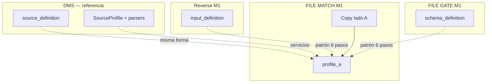
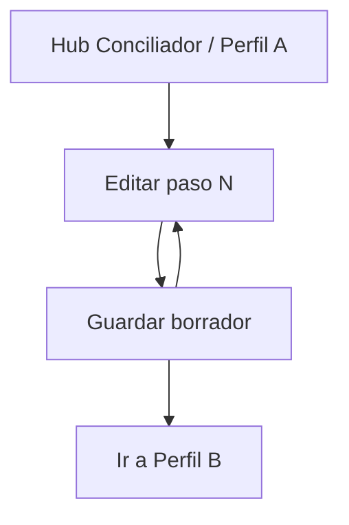

# Profile A — FILE MATCH Módulo 1

Proceso y especificación del **Módulo 1** de FILE MATCH: definir el **perfil del archivo A** (lado A / origen de referencia) y persistirlo como `SourceProfile` reutilizable dentro de la versión del proyecto conciliador.

> Estado: **implementado** (Django Módulo 1).  
> Producto: [`../FILE_MATCH.md`](../FILE_MATCH.md).  
> Rama: `feature/file-match`.  
> Destino: `apps/file_match/profile_a/` · `templates/file_match/profile_a/` · URLs `/app/file-match/proyectos/<slug>/perfil-a/...`.  
> Base técnica: [`../definition_app_DMS/source_definition.md`](../definition_app_DMS/source_definition.md) (`DmsSourceProfile`, catálogos, `save_source`).  
> Referencias de producto: [`../definition_app_REVERSE/input_definition.md`](../definition_app_REVERSE/input_definition.md) · [`../definition_app_FILE_GATE/schema_definition.md`](../definition_app_FILE_GATE/schema_definition.md).  
> **No incluye** perfil B, reglas de cruce, publicar ni ejecutar (módulos 2–5).  
> Familia §2: [`../APP_FACTORY_HIGH_REUSE.md`](../APP_FACTORY_HIGH_REUSE.md) §4.  
> Prototipos: [`../../prototype/file_match/profile_a/`](../../prototype/file_match/profile_a/).

---

## Propósito

Permitir que el diseñador configure **paso a paso** cómo debe **leerse el archivo A** de la conciliación (extracto, origen de referencia, “lado izquierdo”), sin programar.

El resultado es un **perfil A** versionable (forma `SourceProfile`). Más adelante:

- el Módulo 2 define el perfil B (contraparte);
- el Módulo 3 declara claves y campos a comparar usando los `name` de A (y B);
- el Módulo 4 publica A + B + reglas;
- el Módulo 5 parsea el archivo A real con este perfil al ejecutar el match.

Sin un perfil A completo (y una definición publicada que lo incluya), no hay conciliación.

---

## Qué es / qué hace / qué no hace

| Pregunta | Respuesta |
|----------|-----------|
| **¿Qué es?** | El asistente que describe el **archivo A** (tipo, encoding, captura, campos, reglas) |
| **¿Qué hace?** | Persiste un `SourceProfile` (lado A) en la versión `kind=file_match` |
| **¿Qué no hace?** | No define el archivo B; no declara claves de cruce; no sube archivos de producción; no publica solo el lado A |
| **Copy UX** | “Archivo A” / “Lado A” / “Perfil A” / “origen de referencia” — **no** “planilla de emisión” (Reverse) ni “contrato de validación” (FILE GATE) ni “origen para transformar” (FilePipe) |

---

## Relación con DMS / Reverse / FILE GATE

| Tema | Decisión FILE MATCH (Perfil A) |
|------|--------------------------------|
| Pasos del asistente | **Mismos 6 pasos** conceptuales que origen DMS / entrada Reverse / esquema FILE GATE |
| Catálogos | Reusar `SourceFileType`, `CharsetEncoding`, `LineEnding`, `CaptureBoundaryMode`, `FieldContentType` |
| Forma del JSON | Alineada a `source` de `SourceProfile` |
| Whitelist MVP | Tipos de **lectura** habituales en conciliación: `csv`, `xlsx`, `txt_delimited`, `txt_fixed` (+ `json` / `xml` si el catálogo DMS los soporta en el tenant) |
| UX / copy | Hub Conciliador · “Archivo A / Lado A” |
| Persistencia (propuesta) | `Project.KIND_FILE_MATCH` + `DmsSourceProfile` en la versión (slot **side A**) |
| Código a reutilizar | Catálogos, normalización, `save_source`, JS/CSS SourceProfile con skin Match |



### Tipos de archivo permitidos (MVP — Perfil A)

| Código | Nombre | ¿Permitido en Match MVP? | Notas |
|--------|--------|--------------------------|-------|
| `csv` | CSV | **Sí** | Caso frecuente (extractos) |
| `xlsx` | Excel | **Sí** | |
| `txt_delimited` | TXT delimitado | **Sí** | |
| `txt_fixed` | TXT posicional | **Sí** | Libros / legados |
| `json` | JSON | **Sí*** | Si parsers DMS activos |
| `xml` | XML | **Sí*** | Si parsers DMS activos |

\*Si el spike muestra fricción, dejar `json`/`xml` como Fase 2 y ocultarlos en UI (misma regla de whitelist servidor).

**Regla A3 / A-W1:** la UI solo ofrece la whitelist. Payload fuera de lista → rechazo al guardar.

> A diferencia de Reverse (solo tipos “amigables”), Match **sí** admite posicional en el lado A porque la contraparte suele ser rígida.

---

## Alcance de este documento

| Incluido | Excluido (otro módulo / app) |
|----------|------------------------------|
| Tipo, encoding, line ending del archivo A | Perfil B (Módulo 2) |
| Captura inicio / fin | Reglas de cruce / claves (Módulo 3) |
| Campos y validaciones por campo | Publicar definición completa (Módulo 4) |
| Reglas globales de contenido | Upload A+B y job de match (Módulo 5) |
| Informe de lectura al parsear A | Informe de diferencias / historial (M6–M7) |
| Hub / pasos del perfil A | Bridge FILE GATE (Módulo 8) |
| | Structure Scout (siembra futura) |

---

## Responsabilidades

| Sí | No |
|----|-----|
| Asistente 6 pasos del **perfil A** | Definir perfil B |
| Definir columnas/campos con `name` estable para claves | Declarar qué campos se comparan |
| Configurar captura y content_rules | Ejecutar conciliación |
| Persistir borrador del lado A en la versión | Publicar solo el lado A (como GATE schema_publish) |

---

## Proceso (asistente paso a paso)

El usuario recorre **6 pasos** en orden. Cada paso persiste borrador; puede volver atrás.


| Paso | Título UX FILE MATCH | Equivalente DMS | Contenido |
|------|----------------------|-----------------|-----------|
| 1 | Tipo de archivo A | Paso 1 origen | Whitelist + encoding + line ending |
| 2 | Inicio de captura | Paso 2 | `capture_start` |
| 3 | Fin de captura | Paso 3 | `capture_end` |
| 4 | Campos del archivo A | Paso 4 | fields (delimitado / xlsx / fixed / json / xml según tipo) |
| 5 | Reglas de contenido | Paso 5 | `content_rules` |
| 6 | Informe de lectura | Paso 6 | `processing_report` al parsear A en el job de match |

Detalle de modos, parámetros JSON y semántica: **delegar a** [`source_definition.md`](../definition_app_DMS/source_definition.md) §§ Pasos 1–6, salvo las diferencias de este doc.

### Diferencias de producto vs DMS / Reverse / FILE GATE

| Paso | Diferencia FILE MATCH (Perfil A) |
|------|----------------------------------|
| Todos | Eyebrow / títulos: “Archivo A”, “Lado A”, “Conciliador” — no “planilla”, “contrato de validación” ni “origen para transformar” |
| 1 | Whitelist Match (incluye `txt_fixed`; opcional json/xml). Label del lado en hub: “A — origen de referencia” (editable en lifecycle) |
| 4 | Énfasis en `name` **estable** (se usará en claves M3). `required` / `content_type` alimentan rechazo al parsear A en M5. Plantillas por tipo: `step4_fields_delimited`, `_xlsx`, `_fixed`, `_json`, `_xml` |
| 5 | Misma semántica DMS. Default recomendado: `trim_lines: true`, `skip_empty_lines: true` en delimitado/csv/xlsx. En **posicional**: advertir que `trim_lines` puede alterar longitudes (lección FG/Reverse) |
| 6 | Contrato de **informe de lectura del lado A** dentro del job de match (resumen / errores de fila al parsear A). Sin umbral de gate FILE GATE. Sin “Publicar contrato” aquí |
| Post-6 | CTA principal: **Continuar a Perfil B** (Módulo 2). Publicar = Módulo 4 (A + B + reglas) |

### Notas de producto

| Tema | Decisión |
|------|----------|
| `content_type` | Misma guía UX que Reverse/FG para evitar `CONTENT_TYPE_MISMATCH` al parsear en M5 |
| Preview / muestra | **Fuera de M1 obligatorio.** Futuro: Structure Scout o intake sample. Producción A se sube en M5 |
| Publicar solo A | **No.** No hay `schema_publish` aislado del lado A |
| Match usa | Solo versión `published` (M4); el borrador de M1 no habilita M5 |
| Relación con B | Los tipos A y B **pueden diferir**; no se exige el mismo `file_type_code` |

---

## Flujo de usuario (módulo 1)



1. Abrir proyecto Conciliador → sección **Perfil A / Archivo A**.
2. Ver progreso 0–6 y versión (borrador).
3. Entrar a un paso → ajustar → guardar borrador (o Guardar y continuar).
4. Al completar los 6 pasos → CTA hacia **Perfil B** (Módulo 2).
5. La **publicación** de la definición completa ocurre en Módulo 4.

---

## Reglas de negocio (módulo 1)

| ID | Regla |
|----|-------|
| A1 | Solo `PA` / `ED` editan el perfil A. |
| A2 | La edición ocurre en el **borrador** de la versión del proyecto. |
| A3 | `file_type_code` ∈ whitelist Match; UI solo ofrece esos; servidor rechaza fuera de lista (= A-W1). |
| A4 | Cambiar el tipo con campos ya definidos: advertencia fuerte; confirmar o limpiar campos (espíritu DMS / FG S7 / Reverse IN4). |
| A5 | Validación de borrador: mismas reglas base que origen DMS en modo no-strict al guardar paso; **strict** al publicar definición completa (M4). |
| A6 | Tenant: solo miembros del proyecto / visibilidad según lifecycle Match. |
| A7 | Completar Módulo 1 no basta para conciliar: faltan B (M2), reglas (M3) y publicar (M4). |
| A8 | El hub marca pasos `done` / `draft` / `pending`. |
| A9 | No se implementa lógica de match ni upload de producción en este módulo. |
| A10 | Al publicar definición (M4): al menos un campo en A; tipo de archivo A obligatorio. |
| A11 | Los `name` de campo deben ser únicos en A (alimentan claves M3). |
| A12 | Slot de persistencia: perfil A **distinto** del perfil B (dos `DmsSourceProfile` o equivalente en la versión). |

> **A-W1** queda absorbida por **A3**.

---

## Validaciones al guardar / al publicar definición

Reusar la matriz de [`source_definition.md`](../definition_app_DMS/source_definition.md) § Validaciones al guardar, **restringida a tipos whitelist**, más:

| Regla extra Match (Perfil A) | Cuándo | Severidad |
|------------------------------|--------|-----------|
| `file_type_code` ∉ whitelist | Guardar cualquier paso / API | **Error** (A3) |
| Sin tipo de archivo A | Strict (M4) | **Error** |
| Al menos un campo en A | Strict (M4) | **Error** |
| `name` duplicado en fields | Guardar paso 4 / strict | **Error** |
| `report_enabled` recomendado true | Strict (M4) | **Advertencia** si false |
| `delimiter` vacío en csv / txt_delimited | Strict (M4) | **Error** |
| `sheet_name` vacío en xlsx | Guardar paso 4 | **Advertencia** (primera hoja) |
| Campos posicionales sin `start`/`length` válidos | Strict (M4) | **Error** (matriz DMS) |
| `capture_end` vs `capture_start` comparable | Guardar / strict | **Error** (matriz DMS) |

Canal UI: alineado a [`UI_MESSAGES.md`](../definition_app/UI_MESSAGES.md); al implementar, añadir § FILE MATCH (mismo patrón §3.8–3.10).

**Implementación prevista:** reusar `validate_source_dict(..., strict=)` + filtro whitelist previo + guardar en slot A de la versión.

---

## Modelo de datos (reuso)

Preferencia: **reutilizar** dos `DmsSourceProfile` (o snapshots) dentro de la versión del proyecto `kind=file_match` — uno **A**, uno **B**.

| Concepto Match | Artefacto | Notas |
|----------------|-----------|-------|
| Perfil A | `DmsSourceProfile` (JSON `source`) slot A | Forma alineada a DMS |
| Perfil B | Otro `DmsSourceProfile` slot B | Módulo 2 |
| Versión borrador / publicada | `MatchProfileVersion` o `DmsMappingVersion` adaptada | Congela A+B+rules en M4 |
| Config de proyecto | `FileMatchConfig` | Ver `FILE_MATCH.md` §10 |
| Congelar A | Snapshot dentro de publish M4 | **No** publish solo-A |

No crear tablas paralelas de “MatchSourceA” en MVP salvo spike contrario.

### Parámetros `config` por tipo (whitelist)

Delegar detalle a DMS § Parámetros por tipo; resumen:

| Tipo | Claves `config` relevantes |
|------|----------------------------|
| `csv` / `txt_delimited` | `delimiter`, `quote_char`, `escape_char`, `has_header`, `header_row` |
| `xlsx` | `sheet_name`, `has_header`, `header_row` |
| `txt_fixed` | Parámetros de layout posicional DMS |
| `json` / `xml` | Según source_definition |

Campos: `name`, `label`, `content_type`, `required`, `pattern` + localización (`column_index` / `source_column` / `start`+`length` / path).

---

## JSON de ejemplo (perfil A)

```json
{
  "side": "A",
  "label": "Extracto banco",
  "file_type_code": "csv",
  "encoding_code": "utf-8",
  "encoding_custom": null,
  "line_ending_code": "lf",
  "line_ending_custom": null,
  "capture_start": { "mode": "first" },
  "capture_end": { "mode": "eof" },
  "config": {
    "delimiter": ";",
    "has_header": true,
    "header_row": 1,
    "quote_char": "\"",
    "escape_char": "\\"
  },
  "fields": [
    {
      "name": "documento",
      "label": "Documento",
      "column_index": 0,
      "source_column": "documento",
      "content_type": "numeric",
      "required": true
    },
    {
      "name": "monto",
      "label": "Monto",
      "column_index": 1,
      "source_column": "monto",
      "content_type": "decimal",
      "required": true
    },
    {
      "name": "fecha",
      "label": "Fecha",
      "column_index": 2,
      "source_column": "fecha",
      "content_type": "date",
      "required": false
    }
  ],
  "content_rules": {
    "trim_lines": true,
    "skip_empty_lines": true,
    "comment_prefix": "",
    "allowed_chars": "",
    "excluded_chars": [],
    "forbidden_patterns": []
  },
  "processing_report": {
    "report_enabled": true,
    "include_summary": true,
    "include_row_errors": true,
    "reject_alert_threshold": null,
    "report_format": "json"
  }
}
```

> Semántica de captura y content_types: [`source_definition.md`](../definition_app_DMS/source_definition.md). Errores al parsear A en M5 usan catálogo DMS (`CONTENT_TYPE_MISMATCH`, etc.).

---

## Diseño de pantallas

### Principios UX

| Principio | Aplicación |
|-----------|------------|
| Un trabajo por vista | Hub = progreso; cada paso = un formulario |
| Copy de conciliación | “Archivo A”, “Lado A”, badge `PA`/`ED` |
| Continuidad | Stepper 1–6 + Guardar / Guardar y continuar |
| No publicar aquí | Sin botón “Publicar contrato”; CTA a Perfil B |
| Campos para cruce | Hint en paso 4: los `name` se usarán en claves (M3) |
| Tokens | Reusar `source_profile.css` + skin Match (eyebrow Conciliador) |

### Wire de hub (estructura)

1. Breadcrumb: Conciliador / `{slug}` / Perfil A  
2. Alcance de proyecto (compañía + slug)  
3. Header: título “Perfil A (archivo A)” + ayuda + volver hub proyecto + continuar edición  
4. Stats: pasos completos · tipo archivo · # campos  
5. Panel “Siguiente”: CTA Perfil B (si 6/6)  
6. Lista de 6 pasos con estado done/draft/pending  

### Wire de paso (estructura común)

1. Scope + stepper  
2. Header paso N de 6  
3. Formulario del paso (HTML plano; sin Django Forms)  
4. Acciones: Atrás · Guardar borrador · Guardar y continuar  
5. Estado de guardado (`aria-live`)  

---

## Pantallas (prototipo → template)

Espejo 1:1 con `templates/file_match/profile_a/`.

| Prototipo | Template definitivo (tras «Desarrolla el módulo») |
|-----------|-----------------------------------------------------|
| `prototype/file_match/profile_a/hub.html` | `templates/file_match/profile_a/hub.html` |
| `prototype/file_match/profile_a/hub_help.html` | `templates/file_match/profile_a/hub_help.html` |
| `prototype/file_match/profile_a/step1_file_type.html` | `templates/file_match/profile_a/step1_file_type.html` |
| `prototype/file_match/profile_a/step1_help.html` | `templates/file_match/profile_a/step1_help.html` |
| `prototype/file_match/profile_a/step2_capture_start.html` | `templates/file_match/profile_a/step2_capture_start.html` |
| `prototype/file_match/profile_a/step2_help.html` | `templates/file_match/profile_a/step2_help.html` |
| `prototype/file_match/profile_a/step3_capture_end.html` | `templates/file_match/profile_a/step3_capture_end.html` |
| `prototype/file_match/profile_a/step3_help.html` | `templates/file_match/profile_a/step3_help.html` |
| `prototype/file_match/profile_a/step4_fields_delimited.html` | `templates/file_match/profile_a/step4_fields_delimited.html` |
| `prototype/file_match/profile_a/step4_fields_xlsx.html` | `templates/file_match/profile_a/step4_fields_xlsx.html` |
| `prototype/file_match/profile_a/step4_fields_fixed.html` | `templates/file_match/profile_a/step4_fields_fixed.html` |
| `prototype/file_match/profile_a/step4_help.html` | `templates/file_match/profile_a/step4_help.html` |
| `prototype/file_match/profile_a/step5_content_rules.html` | `templates/file_match/profile_a/step5_content_rules.html` |
| `prototype/file_match/profile_a/step5_help.html` | `templates/file_match/profile_a/step5_help.html` |
| `prototype/file_match/profile_a/step6_report.html` | `templates/file_match/profile_a/step6_report.html` |
| `prototype/file_match/profile_a/step6_help.html` | `templates/file_match/profile_a/step6_help.html` |
| Partials: `_wizard_stepper`, `_project_scope` | Igual en templates |

CSS demo: `prototype/file_match/profile_a/proto.css` (tokens alineados a app).  
Al implementar: reusar `static/css/source_profile.css` + JS de persistencia SourceProfile con endpoints Match.

---

## URLs previstas (módulo 1)

Prefijo: `/app/file-match/proyectos/<slug>/perfil-a/`

| Vista | Ruta |
|-------|------|
| Hub | `.../perfil-a/` |
| Ayuda hub | `.../perfil-a/ayuda/` |
| Paso 1–6 | `.../perfil-a/paso/1/` … `paso/6/` |
| Ayuda paso N | `.../perfil-a/paso/N/ayuda/` |
| API guardar borrador | `.../perfil-a/guardar/` (POST JSON; sin Django Forms) |

---

## Mensajes UI

Catálogo formal: [`UI_MESSAGES.md`](../definition_app/UI_MESSAGES.md) §3.11.

| Situación | `user_message` |
|-----------|----------------|
| Guardado OK | Perfil A guardado correctamente. |
| Tipo fuera de whitelist | El tipo de archivo no está permitido en FILE MATCH (perfil A). … |
| Sin permiso | No tiene permiso para editar el contrato de este proyecto. |
| Validación | Revise los datos del perfil A. |

---

## Checklist de cierre del módulo

- [x] Doc `profile_a.md` (base)
- [x] Flujos hub + pasos 1–6 en prototipo
- [x] Revisión de usuario del flujo / reglas / UX
- [x] Usuario: **«Desarrolla el módulo»**
- [x] App `apps/file_match/profile_a/` + templates
- [x] Whitelist + `save_source` slot A (`config.match_side = "A"`)
- [x] UI_MESSAGES §3.11 FILE MATCH M1
- [x] Enlace hub proyecto → Perfil A
- [x] CTA → Perfil B (Módulo 2) — implementado
- [x] Slot A12 con segundo perfil: A = `DmsSourceProfile`; B = `FileMatchSourceB`

---

## Decisiones abiertas (módulo 1)

| # | Tema | Recomendación |
|---|------|---------------|
| 1 | ¿json/xml en MVP? | Incluir si parsers DMS estables; si no, Fase 2 |
| 2 | ¿Label del lado A editable? | Sí en lifecycle / hub proyecto (“Extracto banco”) |
| 3 | ¿Un solo `DmsMappingVersion` con 2 sources? | Preferido; documentar en `fm_integration.md` |
| 4 | Structure Scout “Aplicar a A” / **Profile Seed** import desde GATE | [`PROFILE_SEED.md`](../PROFILE_SEED.md) · Fase 2 |

---

*Documento: `docs/definition_app_FILE_MATCH/profile_a.md` — Módulo 1 Perfil A (FILE MATCH).*
