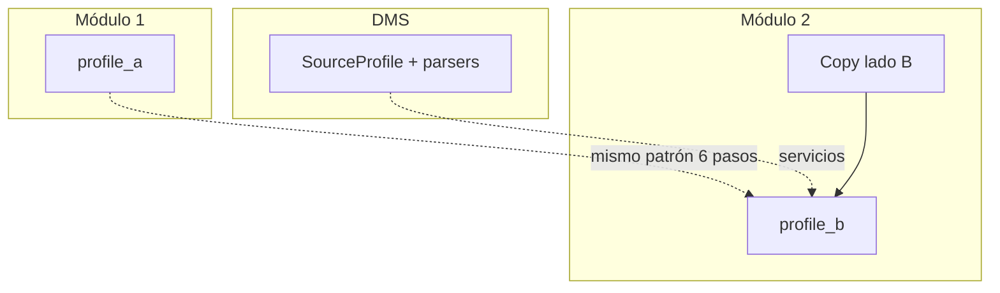
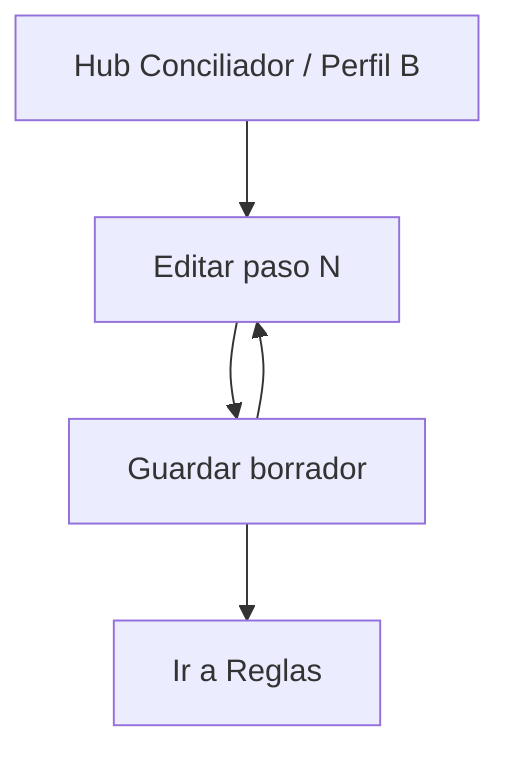

# Profile B — FILE MATCH Módulo 2

Proceso y especificación del **Módulo 2** de FILE MATCH: definir el **perfil del archivo B** (lado B / contraparte) y persistirlo como `SourceProfile` reutilizable dentro de la versión del proyecto conciliador.

> Estado: **implementado** (Django Módulo 2).  
> Producto: [`../FILE_MATCH.md`](../FILE_MATCH.md).  
> Rama: `feature/file-match`.  
> Destino: `apps/file_match/profile_b/` · `templates/file_match/profile_b/` · URLs `/app/file-match/proyectos/<slug>/perfil-b/...`.  
> Persistencia slot B: modelo `FileMatchSourceB` (`related_name=match_source_b`).  
> Base técnica: [`../definition_app_DMS/source_definition.md`](../definition_app_DMS/source_definition.md) + [`profile_a.md`](profile_a.md).  
> **No incluye** reglas de cruce, publicar ni ejecutar (módulos 3–5).  
> Familia §2: [`../APP_FACTORY_HIGH_REUSE.md`](../APP_FACTORY_HIGH_REUSE.md) §4.  
> Prototipos: [`../../prototype/file_match/profile_b/`](../../prototype/file_match/profile_b/).

---

## Propósito

Permitir que el diseñador configure **paso a paso** cómo debe **leerse el archivo B** de la conciliación (contraparte, “lado derecho”), sin programar.

El resultado es un **perfil B** versionable (forma `SourceProfile`). Más adelante:

- el Módulo 3 declara claves y campos a comparar usando los `name` de A **y** B;
- el Módulo 4 publica A + B + reglas;
- el Módulo 5 parsea el archivo B real con este perfil al ejecutar el match.

Sin un perfil B completo (junto con A y reglas, en una definición publicada), no hay conciliación.

---

## Qué es / qué hace / qué no hace

| Pregunta | Respuesta |
|----------|-----------|
| **¿Qué es?** | El asistente que describe el **archivo B** (tipo, encoding, captura, campos, reglas) |
| **¿Qué hace?** | Persiste un `SourceProfile` (lado B) en la versión `kind=file_match` |
| **¿Qué no hace?** | No redefine el archivo A; no declara claves de cruce; no sube archivos de producción; no publica solo el lado B |
| **Copy UX** | “Archivo B” / “Lado B” / “Perfil B” / “contraparte” — **no** “planilla de emisión”, “contrato de validación” ni “origen para transformar” |

---

## Relación con Perfil A / DMS / Reverse / FILE GATE

| Tema | Decisión FILE MATCH (Perfil B) |
|------|--------------------------------|
| Pasos del asistente | **Mismos 6 pasos** que Perfil A / origen DMS / entrada Reverse / esquema FILE GATE |
| Catálogos | Reusar los mismos (`SourceFileType`, encoding, line ending, captura, content types) |
| Forma del JSON | Alineada a `source` de `SourceProfile` (igual que A) |
| Whitelist MVP | **Misma** que Perfil A: `csv`, `xlsx`, `txt_delimited`, `txt_fixed`, `json`, `xml` |
| Tipo vs A | **Puede diferir** de `file_type_code` de A (B8). No se exige simetría |
| UX / copy | Hub Conciliador · “Archivo B / Lado B / contraparte” |
| Persistencia | Slot **side B** distinto del slot A (regla A12 / B12) |
| Código a reutilizar | Catálogos, normalización, patrón `save_source` / wizard A, JS/CSS SourceProfile con skin Match |



### Tipos de archivo permitidos (MVP — Perfil B)

| Código | Nombre | ¿Permitido? | Notas |
|--------|--------|-------------|-------|
| `csv` | CSV | **Sí** | |
| `xlsx` | Excel | **Sí** | Caso frecuente (ERP / libro) |
| `txt_delimited` | TXT delimitado | **Sí** | |
| `txt_fixed` | TXT posicional | **Sí** | Contraparte rígida habitual |
| `json` | JSON | **Sí*** | Si parsers DMS activos |
| `xml` | XML | **Sí*** | Si parsers DMS activos |

\*Misma política que Perfil A: si hay fricción, Fase 2 + ocultar en UI.

**Regla B3:** la UI solo ofrece la whitelist. Payload fuera de lista → rechazo al guardar.

> Ejemplo típico de demo: A = CSV extracto banco · B = Excel (o posicional) del ERP. Los tipos **no** tienen que coincidir.

---

## Alcance de este documento

| Incluido | Excluido (otro módulo / app) |
|----------|------------------------------|
| Tipo, encoding, line ending del archivo B | Perfil A (Módulo 1 — ya definido) |
| Captura inicio / fin | Reglas de cruce / claves (Módulo 3) |
| Campos y validaciones por campo | Publicar definición completa (Módulo 4) |
| Reglas globales de contenido | Upload A+B y job de match (Módulo 5) |
| Informe de lectura al parsear B | Informe de diferencias / historial (M6–M7) |
| Hub / pasos del perfil B | Bridge FILE GATE (Módulo 8) |
| | Structure Scout (siembra futura) |

---

## Responsabilidades

| Sí | No |
|----|-----|
| Asistente 6 pasos del **perfil B** | Redefinir perfil A |
| Definir columnas/campos con `name` estable para claves | Declarar el mapeo A↔B (eso es M3) |
| Configurar captura y content_rules del lado B | Ejecutar conciliación |
| Persistir borrador del lado B en la versión | Publicar solo el lado B |

---

## Proceso (asistente paso a paso)

El usuario recorre **6 pasos** en orden. Cada paso persiste borrador; puede volver atrás.


| Paso | Título UX FILE MATCH | Equivalente DMS | Contenido |
|------|----------------------|-----------------|-----------|
| 1 | Tipo de archivo B | Paso 1 origen | Whitelist + encoding + line ending |
| 2 | Inicio de captura | Paso 2 | `capture_start` |
| 3 | Fin de captura | Paso 3 | `capture_end` |
| 4 | Campos del archivo B | Paso 4 | fields (variante según tipo) |
| 5 | Reglas de contenido | Paso 5 | `content_rules` |
| 6 | Informe de lectura | Paso 6 | `processing_report` al parsear B en el job de match |

Detalle de modos, parámetros JSON y semántica: **delegar a** [`source_definition.md`](../definition_app_DMS/source_definition.md) §§ Pasos 1–6 y a [`profile_a.md`](profile_a.md), salvo las diferencias de este doc.

### Diferencias de producto vs Perfil A / DMS / Reverse / FILE GATE

| Paso | Diferencia FILE MATCH (Perfil B) |
|------|----------------------------------|
| Todos | Eyebrow / títulos: “Archivo B”, “Lado B”, “Contraparte”, “Conciliador” |
| 1 | Misma whitelist que A. Hint UX: “puede diferir del tipo del archivo A” |
| 4 | Énfasis en `name` **estable** (claves M3). Los `name` de B **no** tienen que coincidir con los de A; el enlace A↔B se declara en M3 |
| 5 | Misma semántica DMS / A. En posicional: advertir `trim_lines` vs longitudes |
| 6 | Informe de **lectura del lado B** en el job de match. Sin umbral FILE GATE. Sin “Publicar” aquí |
| Post-6 | CTA principal: **Continuar a Reglas de cruce** (Módulo 3). Publicar = Módulo 4 |
| Prerrequisito | Recomendado: Perfil A completo; **permitido** editar B antes (aviso en hub, no bloqueo duro) |

### Notas de producto

| Tema | Decisión |
|------|----------|
| `content_type` | Misma guía UX que A / Reverse / FG |
| Preview / muestra | Fuera de M2 obligatorio. Producción B se sube en M5 |
| Publicar solo B | **No** |
| Match usa | Solo versión `published` (M4) |
| Relación con A | Tipos pueden diferir; campos independientes; cruce en M3 |
| Copiar desde A | **Implementado** — CTA hub B → confirmación → clone snapshot A→B; opcional proponer reglas 1:1 |

---

## Copiar estructura desde Perfil A

Atajo cuando A y B tienen el **mismo layout**.

| Pieza | Detalle |
|-------|---------|
| CTA | Hub Perfil B · «Copiar desde Perfil A» (PA/ED; A con tipo + campos) |
| Confirmación | `…/perfil-b/copiar-desde-a/` — preview, overwrite si B tiene campos |
| Escritura | 2× `save_source_b` (meta → fields); `config.match_side = "B"` |
| Auditoría | `ProfileSeedEvent` destino `profile_b`, origen `file_match` / `profile_a` |
| Reglas (opcional) | Checkbox en confirmación + CTA en hub Reglas «Proponer pares 1:1» |
| Qué no hace | No publica Match; no vínculo vivo; no reemplaza Seed GATE→A |

Servicio: `apps/file_match/profile_b/services/copy_from_a_service.py`.  
Templates: `copy_from_a.html`, `copy_from_a_help.html`.

---

## Flujo de usuario (módulo 2)



1. Abrir proyecto Conciliador → sección **Perfil B / Archivo B** (o CTA desde hub Perfil A 6/6).
2. Ver progreso 0–6 y versión (borrador).
3. Entrar a un paso → ajustar → guardar borrador (o Guardar y continuar).
4. Al completar los 6 pasos → CTA hacia **Reglas de cruce** (Módulo 3).
5. La **publicación** de la definición completa ocurre en Módulo 4.

---

## Reglas de negocio (módulo 2)

| ID | Regla |
|----|-------|
| B1 | Solo `PA` / `ED` editan el perfil B. |
| B2 | La edición ocurre en el **borrador** de la versión del proyecto. |
| B3 | `file_type_code` ∈ whitelist Match; UI solo ofrece esos; servidor rechaza fuera de lista. |
| B4 | Cambiar el tipo con campos ya definidos: advertencia fuerte; confirmar o limpiar campos. |
| B5 | Validación de borrador: mismas reglas base que origen DMS en modo no-strict; **strict** al publicar (M4). |
| B6 | Tenant: solo miembros del proyecto / visibilidad según lifecycle Match. |
| B7 | Completar Módulo 2 no basta para conciliar: faltan reglas (M3) y publicar (M4); A debe existir al publicar. |
| B8 | El tipo de archivo B **puede diferir** del tipo de A. |
| B9 | El hub marca pasos `done` / `draft` / `pending`. |
| B10 | No se implementa lógica de match ni upload de producción en este módulo. |
| B11 | Al publicar definición (M4): al menos un campo en B; tipo de archivo B obligatorio. |
| B12 | Slot de persistencia: perfil B **distinto** del perfil A (`config.match_side = "B"` u otro `DmsSourceProfile`). |
| B13 | Los `name` de campo deben ser únicos **dentro de B** (alimentan claves M3). |

---

## Validaciones al guardar / al publicar definición

Reusar la matriz de [`source_definition.md`](../definition_app_DMS/source_definition.md) § Validaciones al guardar, **restringida a tipos whitelist**, más:

| Regla extra Match (Perfil B) | Cuándo | Severidad |
|------------------------------|--------|-----------|
| `file_type_code` ∉ whitelist | Guardar cualquier paso / API | **Error** (B3) |
| Sin tipo de archivo B | Strict (M4) | **Error** |
| Al menos un campo en B | Strict (M4) | **Error** |
| `name` duplicado en fields B | Guardar paso 4 / strict | **Error** |
| `report_enabled` recomendado true | Strict (M4) | **Advertencia** si false |
| `delimiter` vacío en csv / txt_delimited | Strict (M4) | **Error** |
| `sheet_name` vacío en xlsx | Guardar paso 4 | **Advertencia** (primera hoja) |
| Campos posicionales sin `start`/`length` válidos | Strict (M4) | **Error** |
| `capture_end` vs `capture_start` comparable | Guardar / strict | **Error** |

Canal UI: [`UI_MESSAGES.md`](../definition_app/UI_MESSAGES.md) §3.11 (ampliar al implementar M2).

**Implementación prevista:** mismo patrón que Perfil A (`validate_source_dict` + whitelist + guardar en **slot B**). Hoy M1 usa el único `DmsSourceProfile` de la versión como A; M2 exige resolver A12/B12 (segundo perfil o modelo equivalente) — ver decisiones abiertas.

---

## Modelo de datos (reuso)

Preferencia: **dos** `DmsSourceProfile` (o snapshots) en la versión `kind=file_match` — slot A y slot B.

| Concepto Match | Artefacto | Notas |
|----------------|-----------|-------|
| Perfil A | `DmsSourceProfile` slot A | Módulo 1; `config.match_side = "A"` |
| Perfil B | `DmsSourceProfile` slot B | Este módulo; `config.match_side = "B"` |
| Versión | `DmsMappingVersion` (o `MatchProfileVersion`) | Congela A+B+rules en M4 |
| Config proyecto | `FileMatchConfig` | Ver `FILE_MATCH.md` §10 |

### Parámetros `config` por tipo

Igual que Perfil A / DMS (delimiter, sheet_name, layout posicional, paths json/xml).

Campos: `name`, `label`, `content_type`, `required`, `pattern` + localización.

---

## JSON de ejemplo (perfil B)

```json
{
  "side": "B",
  "label": "Libro ERP",
  "file_type_code": "xlsx",
  "encoding_code": "utf-8",
  "encoding_custom": null,
  "line_ending_code": "lf",
  "line_ending_custom": null,
  "capture_start": { "mode": "first" },
  "capture_end": { "mode": "eof" },
  "config": {
    "match_side": "B",
    "sheet_name": "Movimientos",
    "has_header": true,
    "header_row": 1
  },
  "fields": [
    {
      "name": "id_cliente",
      "label": "ID cliente",
      "source_column": "ID",
      "content_type": "numeric",
      "required": true
    },
    {
      "name": "importe",
      "label": "Importe",
      "source_column": "Importe",
      "content_type": "decimal",
      "required": true
    },
    {
      "name": "fecha_op",
      "label": "Fecha operación",
      "source_column": "Fecha",
      "content_type": "date",
      "required": false
    }
  ],
  "content_rules": {
    "trim_lines": true,
    "skip_empty_lines": true,
    "comment_prefix": "",
    "allowed_chars": "",
    "excluded_chars": [],
    "forbidden_patterns": []
  },
  "processing_report": {
    "report_enabled": true,
    "include_summary": true,
    "include_row_errors": true,
    "reject_alert_threshold": null,
    "report_format": "json"
  }
}
```

> En M3 se enlazará p. ej. `A.documento` ↔ `B.id_cliente`, `A.monto` ↔ `B.importe`. Los `name` de B no tienen que llamarse igual que en A.

---

## Diseño de pantallas

### Principios UX

| Principio | Aplicación |
|-----------|------------|
| Un trabajo por vista | Hub = progreso; cada paso = un formulario |
| Copy de conciliación | “Archivo B”, “Lado B”, “contraparte” |
| Continuidad | Stepper 1–6 + Guardar / Guardar y continuar |
| No publicar aquí | CTA a Reglas (M3), no “Publicar contrato” |
| Independencia de A | Hint: tipo B puede diferir; nombres de campo propios |
| Tokens | Reusar `proto.css` / `source_profile.css` + badge lado B |

### Wire de hub

1. Breadcrumb: Conciliador / `{slug}` / Perfil B  
2. Alcance (compañía + slug + badge **Lado B**)  
3. Header: “Perfil B (archivo B / contraparte)” + ayuda + volver + continuar  
4. Stats: pasos · tipo archivo B · # campos  
5. Panel aviso si A incompleto (recomendación, no bloqueo)  
6. Panel “Siguiente”: CTA Reglas (si 6/6)  
7. Lista de 6 pasos  

### Wire de paso

Igual que Perfil A (scope + stepper + form + Atrás / Guardar / Continuar).

---

## Pantallas (prototipo → template)

Espejo 1:1 con `templates/file_match/profile_b/`.

| Prototipo | Template definitivo (tras «Desarrolla el módulo») |
|-----------|-----------------------------------------------------|
| `prototype/file_match/profile_b/hub.html` | `templates/file_match/profile_b/hub.html` |
| `prototype/file_match/profile_b/hub_help.html` | `templates/file_match/profile_b/hub_help.html` |
| `prototype/file_match/profile_b/step1_file_type.html` | `templates/file_match/profile_b/step1_file_type.html` |
| `prototype/file_match/profile_b/step1_help.html` | `templates/file_match/profile_b/step1_help.html` |
| `prototype/file_match/profile_b/step2_capture_start.html` | idem |
| `prototype/file_match/profile_b/step3_capture_end.html` | idem |
| `prototype/file_match/profile_b/step4_fields_delimited.html` | idem |
| `prototype/file_match/profile_b/step4_fields_xlsx.html` | idem |
| `prototype/file_match/profile_b/step4_fields_fixed.html` | idem |
| `prototype/file_match/profile_b/step4_help.html` | idem |
| `prototype/file_match/profile_b/step5_content_rules.html` | idem |
| `prototype/file_match/profile_b/step6_report.html` | idem |
| `index.html` + `proto.css` | Solo demo |

CSS demo: `prototype/file_match/profile_b/proto.css` (tokens alineados a Perfil A; badge lado B diferenciado).

---

## URLs previstas (módulo 2)

Prefijo: `/app/file-match/proyectos/<slug>/perfil-b/`

| Vista | Ruta |
|-------|------|
| Hub | `.../perfil-b/` |
| Ayuda hub | `.../perfil-b/ayuda/` |
| Paso 1–6 | `.../perfil-b/paso/1/` … `paso/6/` |
| Ayuda paso N | `.../perfil-b/paso/N/ayuda/` |
| API guardar borrador | `.../perfil-b/guardar/` (POST JSON; sin Django Forms) |

---

## Mensajes UI

Catálogo formal: [`UI_MESSAGES.md`](../definition_app/UI_MESSAGES.md) §3.11 (Módulo 2).

| Situación | `user_message` |
|-----------|----------------|
| Guardado OK | Perfil B guardado correctamente. |
| Tipo fuera de whitelist | El tipo de archivo no está permitido en FILE MATCH (perfil B). … |
| Sin permiso | No tiene permiso para editar el contrato de este proyecto. |
| Validación | Revise los datos del perfil B. |

---

## Checklist de cierre del módulo

- [x] Doc `profile_b.md` (base)
- [x] Flujos hub + pasos 1–6 en prototipo
- [x] Revisión de usuario del flujo / reglas / UX
- [x] Usuario: **«Desarrolla el módulo»**
- [x] App `apps/file_match/profile_b/` + templates
- [x] Whitelist + persistencia slot B (`FileMatchSourceB`, `match_side = "B"`)
- [x] UI_MESSAGES § FILE MATCH M2
- [x] Enlace hub proyecto + CTA desde Perfil A → Perfil B
- [x] CTA → Reglas (Módulo 3) — implementado
- [x] Resolver segundo SourceProfile (B12) vía `FileMatchSourceB`
- [x] Copiar desde A (CTA + confirmación + opcional reglas 1:1)

---

## Decisiones abiertas (módulo 2)

| # | Tema | Recomendación |
|---|------|---------------|
| 1 | ¿Cómo persistir slot B si `DmsSourceProfile` es OneToOne con la versión? | Opción A: segundo modelo `DmsSourceProfileB` / `MatchSideProfile`. Opción B: JSON en `config` + tabla auxiliar. Preferir **segundo perfil explícito** documentado en `fm_integration.md` |
| 2 | ¿Bloquear B si A incompleto? | **No** bloquear; aviso recomendatorio (B7) |
| 3 | ¿“Copiar campos desde A”? | **Hecho** — `copy_from_a_service` + CTA hub B |
| 4 | ¿json/xml en MVP B? | Misma decisión que A |

---

*Documento: `docs/definition_app_FILE_MATCH/profile_b.md` — Módulo 2 Perfil B (FILE MATCH).*
