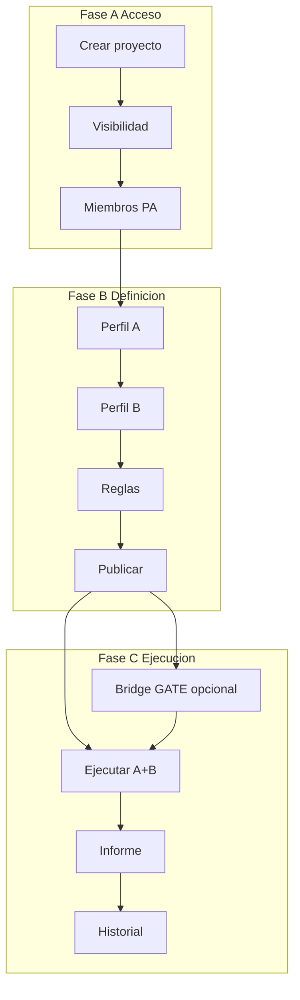

# Project lifecycle — FILE MATCH

Ciclo de vida del **proyecto Conciliador**: alta, visibilidad, miembros, hub y orden del flujo de definición / ejecución / auditoría.

> Estado: **documentado** (refleja implementación en `apps/file_match/projects/`).  
> Producto: [`../FILE_MATCH.md`](../FILE_MATCH.md).  
> Integración: [`fm_integration.md`](fm_integration.md) (kind, URLs, roles, reuso DMS).  
> Contenedor de: Perfil A, Perfil B, reglas de cruce, versiones publicadas, jobs e informes.  
> **Plataforma:** reutiliza [`Project` y `ProjectMembership`](../definition_app/DynamicWorkspace_Model.md#project).  
> App: `apps/file_match/projects/` · templates `templates/file_match/projects/`.

---

## Propósito

Un **proyecto FILE MATCH** es la unidad de trabajo que agrupa:

1. **Perfil A** (origen de referencia) y **Perfil B** (contraparte);
2. **Reglas de cruce** (clave 1:1, campos a comparar, normalización);
3. **Versiones** publicadas de esa definición;
4. **Conciliaciones** (jobs A+B), informes y historial;
5. **Quién** puede ver, editar, ejecutar o consultar.

No es un proyecto FilePipe (no hay destino ETL) ni FILE GATE (no es solo validación de un archivo).

| Fase | Qué cubre | Specs |
|------|-----------|-------|
| **A — Acceso** | Crear, listar, visibilidad, miembros, hub | Este documento |
| **B — Definición** | A → B → reglas → publicar | `profile_a.md`, `profile_b.md`, `match_rules.md`, `publish.md` |
| **C — Ejecución** | Conciliar, informe, historial, bridge | `match_run.md`, `match_report.md`, `history.md`, `gate_bridge.md` |

---

## Integración con DynamicWorkspace

| Concepto | Implementación |
|----------|----------------|
| Contenedor | `Project` con `project_kind = file_match` |
| Código | `Project.slug` (único por compañía) |
| Nombre / descripción | `Project.name`, `Project.description` |
| Creador | `Project.owner` + membresía **PA** |
| Tenant | `Project.company` |
| Archivado | `Project.is_archived` |
| Visibilidad | `DmsProjectConfig.visibility` (`company` \| `members_only`) |
| Versión activa | `DmsProjectConfig.current_version` |
| Miembros | `ProjectMembership` — misma compañía |
| Servicio | `match_project_service` + `project_service` (miembros) |

Detalle: [`fm_integration.md`](fm_integration.md).

---

## Fase A — Acceso

### A1 — Crear proyecto

| Campo | Obligatorio | Notas |
|-------|-------------|-------|
| `name` | Sí | Nombre visible |
| `slug` | Sí | Código único por compañía |
| `description` | No | Default UX: «Proyecto FILE MATCH: conciliación archivo A vs archivo B.» |
| `visibility` | Sí | Default `members_only` (Privado) |

- Solo usuarios **UF** con seguridad completa.
- Al crear: `Project(kind=file_match)` + `DmsProjectConfig` + membership **PA** del creador.
- Mensaje: *«Proyecto FILE MATCH creado correctamente.»* → redirect al hub.
- PRG + validación manual (sin Django Forms).

Rutas:

| Acción | URL | Nombre |
|--------|-----|--------|
| Formulario | `/app/file-match/proyectos/nuevo/` | `project_create` |
| Ayuda | `…/nuevo/ayuda/` | `project_create_help` |

### A2 — Visibilidad

| Valor UI | Código | Comportamiento |
|----------|--------|----------------|
| **Privado** | `members_only` | Solo membresía activa |
| **Público** | `company` | UF de la misma compañía pueden **ver** el proyecto sin ser miembros (rol virtual de consulta) |

El creador siempre es PA, independientemente de la visibilidad. Editar / ejecutar / publicar siguen exigiendo rol adecuado (matriz en `fm_integration.md`).

### A3 — Miembros y autorizaciones

- Solo el **PA** gestiona miembros (`user_can_manage_members`).
- Acciones: invitar, revocar, reactivar, cambiar rol.
- Roles: **PA** / **ED** / **GE** / **CO** (`role_choices_for_ui`).
- El **owner** no se revoca ni cambia de rol.
- Reuso: `project_service.invite_member`, `set_member_active`, `update_member_role`, etc.

| Acción | URL | Nombre |
|--------|-----|--------|
| Miembros | `/app/file-match/proyectos/<slug>/miembros/` | `project_members` |
| Ayuda | `…/miembros/ayuda/` | `project_members_help` |

Si un no-PA abre miembros → redirect al hub con mensaje de denegación.

### A4 — Listado

| Acción | URL | Nombre |
|--------|-----|--------|
| Listado | `/app/file-match/proyectos/` | `project_list` |
| Ayuda | `…/proyectos/ayuda/` | `project_list_help` |

- QS: proyectos `file_match` de la compañía donde el usuario es miembro **o** el proyecto es público compañía.
- Stats: total, activos, como PA, públicos compañía.
- Columnas típicas: código, nombre, visibilidad, mi permiso, versión, Abrir.

---

## Hub del proyecto

| Acción | URL | Nombre |
|--------|-----|--------|
| Hub | `/app/file-match/proyectos/<slug>/` | `project_hub` |
| Ayuda | `…/<slug>/ayuda/` | `project_hub_help` |

El hub es el **tablero del ciclo**: stepper + paneles por módulo + CTAs.

### Stepper (UI)

| # | Etiqueta | Destino | Activación (clases) |
|---|----------|---------|---------------------|
| 1 | Perfil A | `profile_a_hub` | `is-active` hasta completo → `is-done` |
| 2 | Perfil B | `profile_b_hub` | Activo tras A completo |
| 3 | Reglas | `rules_hub` | Activo tras B completo |
| 4 | Publicar | `publish_hub` | Activo tras reglas; `is-done` si hay versión publicada |
| 5 | Conciliar | `run_hub` | Activo si hay publicada |
| 6 | Historial | `history_hub` | Activo si hay publicada |

Fases visuales: **Módulos 1–4** (definición) · **Módulos 5–6** (ejecución / auditoría).  
Bridge FILE GATE (M8) se enlaza desde paneles de auditoría / ejecutar, no como paso numerado del stepper MVP.

### Paneles del hub

| Panel | Contenido |
|-------|-----------|
| Perfil A | Progreso wizard; CTA continuar / abrir |
| Perfil B | Idem lado B |
| Reglas | Conteos clave / compare; CTA |
| Publicar | Estado versión activa; CTA |
| Ejecutar | CTA a Conciliar (requiere publicada) |
| Auditoría e integración | Historial + Integración FILE GATE |

Strip: versión borrador / activa / conteo miembros. Botón **Miembros** solo si `can_manage_members`.

Contexto: `match_project_service.get_hub_context`.

---

## Matriz de permisos (ciclo)

| Acción ciclo | PA | ED | GE | CO |
|--------------|----|----|----|-----|
| Ver listado / hub (si acceso) | Sí | Sí | Sí | Sí* |
| Crear proyecto | Sí (UF) | Sí (UF) | Sí (UF) | Sí (UF) |
| Gestionar miembros | Sí | No | No | No |
| Editar A/B/reglas / publicar | Sí | Sí | No | No |
| Ejecutar / descargar informe | Sí | Sí | Sí | No |
| Ver historial / certificado | Sí | Sí | Sí | Sí |
| Configurar bridge | Sí | Sí | No | Lectura |

\*CO o visitante de proyecto público compañía: ver según `user_can_view`; sin editar ni ejecutar.

Matriz completa: [`fm_integration.md`](fm_integration.md) § Membresía.

---

## Orden de trabajo recomendado

1. Crear proyecto (Privado por defecto) → asignar miembros si hace falta.
2. Completar **Perfil A** (6 pasos) → **Perfil B** → **Reglas**.
3. **Publicar** definición.
4. (Opcional) Configurar **bridge FILE GATE** (Exigir A y/o B).
5. **Ejecutar** conciliación A+B → **Informe** / **Historial**.

Regla de producto: no se concilia sin versión publicada (M5).

---

## Validaciones / mensajes (ciclo)

| Situación | Canal | Texto / comportamiento |
|-----------|-------|------------------------|
| Proyecto creado | `success` | Proyecto FILE MATCH creado correctamente. |
| Sin acceso | `error` | No tiene acceso a este proyecto FILE MATCH. |
| Solo PA miembros | `error` | Solo el administrador del proyecto (PA) puede gestionar miembros. |
| Slug duplicado / inválido | inline | Validación en `validate_create_data` |
| Kind incorrecto | filtrado | Solo `file_match` en servicios Match |

Catálogo: [`UI_MESSAGES.md`](../definition_app/UI_MESSAGES.md) §3.11 (bloque proyectos / acceso).

---

## Pantallas (templates)

| Template | Uso |
|----------|-----|
| `projects/list.html` | Listado + stats |
| `projects/list_help.html` | Ayuda listado |
| `projects/create.html` | Alta |
| `projects/create_help.html` | Ayuda alta |
| `projects/hub.html` | Hub + stepper + paneles |
| `projects/hub_help.html` | Ayuda hub |
| `projects/members.html` | Miembros |
| `projects/members_help.html` | Ayuda miembros |

> Nota: ayudas del ciclo (`*_help.html`) usan copy Match (conciliar / A vs B / roles GE=Ejecutar).

No hay prototipo obligatorio `prototype/file_match/projects/` (el ciclo se implementó directamente en Django).

---

## Implementación (referencia)

| Pieza | Ubicación |
|-------|-----------|
| Vistas / URLs | `apps/file_match/projects/` |
| Servicio ciclo | `match_project_service` |
| Miembros | `apps.projects.services.project_service` |
| Templates | `templates/file_match/projects/` |
| Prefijo | `/app/file-match/proyectos/` |

---

## Criterios de “lifecycle documentado”

- [x] Propósito y fases A/B/C
- [x] Crear / visibilidad / miembros / listado / hub
- [x] Stepper y paneles alineados al código
- [x] URLs y nombres Django
- [x] Matriz y enlace a `fm_integration.md`
- [x] Estado **documentado** en README

---

## Próximos pasos (opcionales)

1. Entrada en índice de modelos de plataforma si se mantiene catálogo formal.

---

## Referencias

| Documento | Uso |
|-----------|-----|
| [`fm_integration.md`](fm_integration.md) | Kind, URLs, roles, modelos |
| [`../FILE_MATCH.md`](../FILE_MATCH.md) | Producto / miembros |
| [`profile_a.md`](profile_a.md) … [`gate_bridge.md`](gate_bridge.md) | Módulos 1–8 |
| [`../definition_app_DMS/project_lifecycle.md`](../definition_app_DMS/project_lifecycle.md) | Patrón hermano FilePipe |
| [`../definition_app/projects.md`](../definition_app/projects.md) | Chasis membresías |
| [`README.md`](README.md) | Índice |

---

*Documento: `docs/definition_app_FILE_MATCH/project_lifecycle.md` — ciclo de proyecto FILE MATCH (as-built).*
