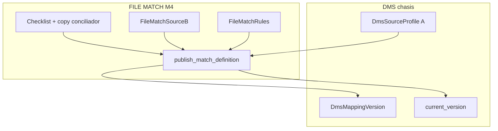
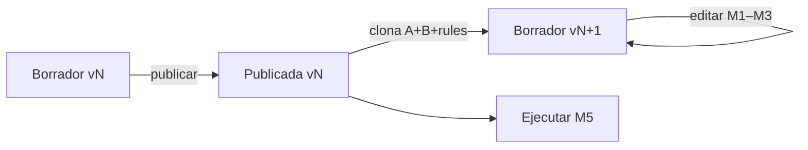
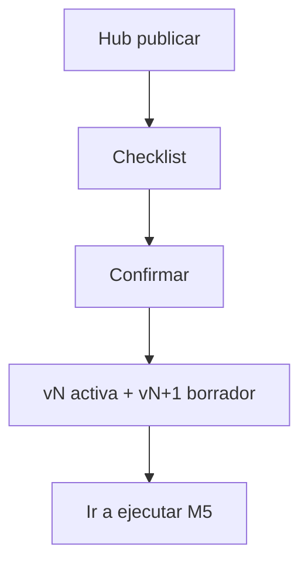

# Publish — FILE MATCH Módulo 4

Proceso y especificación del **Módulo 4** de FILE MATCH: **publicar** la definición completa (perfil A + perfil B + reglas de cruce) como versión inmutable contra la que se ejecutarán las conciliaciones.

> Estado: **implementado** (Django Módulo 4).  
> Producto: [`../FILE_MATCH.md`](../FILE_MATCH.md).  
> Rama: `feature/file-match`.  
> Destino: `apps/file_match/publish/` · `templates/file_match/publish/` · URLs `/app/file-match/proyectos/<slug>/publicar/...`.  
> Ciclo de versiones: [`../definition_app_DMS/project_lifecycle.md`](../definition_app_DMS/project_lifecycle.md) (`DmsMappingVersion` draft → published + `DmsProjectConfig.current_version`).  
> Depende de: [`profile_a.md`](profile_a.md) · [`profile_b.md`](profile_b.md) · [`match_rules.md`](match_rules.md).  
> **No incluye** subir archivos ni ejecutar el match (Módulo 5).  
> Familia §2: [`../APP_FACTORY_HIGH_REUSE.md`](../APP_FACTORY_HIGH_REUSE.md) §4.  
> Prototipos: [`../../prototype/file_match/publish/`](../../prototype/file_match/publish/).

---

## Propósito

Congelar el **borrador** actual (A + B + `match_rules`) en una versión `published` y abrir un **nuevo borrador** editable. Los jobs de conciliación (M5) usan **solo** la versión publicada activa (`DmsProjectConfig.current_version`).

Sin publicar, no hay conciliación ejecutable (aunque A/B/reglas estén completos en borrador).

---

## Qué es / qué hace / qué no hace

| Pregunta | Respuesta |
|----------|-----------|
| **¿Qué es?** | El acto de publicar la definición completa del conciliador |
| **¿Qué hace?** | Valida strict A + B + reglas → marca versión `published` → clona A/B/rules a nuevo draft → apunta `current_version` |
| **¿Qué no hace?** | No sube archivos A/B; no ejecuta el match; no edita perfiles ni reglas (eso es M1–M3 en borrador) |
| **Copy UX** | “Publicar definición” / “versión activa” / “definición de conciliación” — **no** “publicar origen”, “publicar contrato” ni “publicar emisor” |

---

## Relación con DMS / GATE / Reverse publish

| Tema | Decisión FILE MATCH |
|------|---------------------|
| Motor | **Servicio propio** `publish_match_definition` (mismo *espíritu* que GATE `publish_draft_schema`) |
| **No** reusar | `version_publish_service.publish_draft_version` (exige target + field mapping FilePipe) |
| Snapshot | `DmsSourceProfile` (A) + `FileMatchSourceB` (B) + `FileMatchRules` |
| Activa | `DmsProjectConfig.current_version` |
| Post-publish | Nuevo borrador `version_number+1` con **copia** de A, B y rules |
| UI | Hub dedicado Conciliador (checklist M1–M3 + CTA); no hub FilePipe |
| Validación | Strict perfil A/B (whitelist Match) + reglas (`validate_rules_dict(..., strict=True)`) |
| Copy | A / B / cruce / conciliación |

### Ciclo de versiones

---

## Alcance

| Incluido | Excluido |
|----------|----------|
| Hub publicar + ayuda | Editar A / B / reglas (M1–M3) |
| Pre-check / checklist de completitud | Ejecutar match / informe (M5–M6) |
| Acción publicar (POST) + mensajes | Historial de jobs (M7) |
| Mostrar versión activa y borrador | Archivar versiones (backlog DMS) |
| Confirmación antes del POST | Publish parcial (solo A, solo B o solo reglas) |
| Clonado de A + B + rules al nuevo draft | Bridge FILE GATE (M8) |

---

## Responsabilidades

| Sí | No |
|----|-----|
| Validar strict y congelar definición completa | Parsear archivos de producción |
| Apuntar `current_version` | Serializar informe de diferencias |
| Crear nuevo borrador con copia A/B/rules | Gestionar miembros |
| Checklist UX + bloqueo de CTA | Ejecutar job |

---

## Proceso (UX)

1. Usuario completa M1–M3 en borrador.
2. Abre **Publicar** desde hub del proyecto o CTA de Reglas.
3. Ve checklist (Perfil A / Perfil B / Reglas de cruce).
4. Si todo OK → confirma → publica → mensaje con vN publicada y vN+1 borrador.
5. CTA hacia **Ejecutar** (M5, placeholder hasta implementar).

| Pantalla | Contenido |
|----------|-----------|
| `publish/hub.html` | Estado borrador vs activa; checklist; CTA publicar |
| `publish/hub_help.html` | Qué congela; quién puede; relación con M5 |
| `publish/hub_blocked.html` (prototipo) | Variante checklist incompleto (CTA off) |
| Parcial `_project_scope` | Scope Conciliador (A/B badges) |

**No** es un wizard de 6 pasos: es una pantalla de decisión + confirmación.

---

## Checklist previo (UI + servidor)

| Ítem | Criterio “listo” | Bloquea publicar |
|------|------------------|------------------|
| Perfil A | 6/6 pasos + ≥1 campo; `file_type` ∈ whitelist Match; `validate_source_dict` strict | **Sí** |
| Perfil B | 6/6 + ≥1 campo; whitelist; strict sobre `FileMatchSourceB` | **Sí** |
| Reglas | ≥1 par `key` usable; `a`/`b` existen en campos A/B; `validate_rules_dict(..., strict=True)` | **Sí** |
| Compare | 0 pares OK (solo presencia) | No bloquea |
| Roles | Actor `PA` o `ED` | **Sí** |
| Kind | `project_kind = file_match` | **Sí** |

Aviso suave en hub si M1–M3 incompletos; botón publicar deshabilitado hasta checklist verde (o servidor rechaza).

---

## Reglas de negocio

| ID | Regla |
|----|-------|
| PUB1 | Solo `PA` / `ED` publican. |
| PUB2 | Publicar congela **perfil A + perfil B + reglas** juntos — no hay publish parcial. |
| PUB3 | Conciliación (M5) usa solo `status=published` activa (`current_version`). |
| PUB4 | Tras publicar se crea borrador `version_number+1` con copia editable de A, B y `match_rules`. |
| PUB5 | Validación **strict** al publicar (A, B y rules). |
| PUB6 | Tenant / membresía FILE MATCH. |
| PUB7 | Confirmar con diálogo (`dwConfirmWarning` o equivalente) antes del POST. |
| PUB8 | Republicar: el nuevo published sustituye `current_version`; el anterior queda `published` histórico. |
| PUB9 | Completar M4 no ejecuta match; habilita M5. |
| PUB10 | Copy: “definición de conciliación” / “versión activa”, no “origen FilePipe” ni “contrato GATE”. |
| PUB11 | Motor **propio** Match (no `publish_draft_version`); reutilizar chasis `DmsMappingVersion` + `DmsProjectConfig`. |
| PUB12 | Al clonar el borrador: `config.match_side` A/B se preserva; JSON `rules` se copia íntegro. |

---

## Validaciones al publicar

| Regla | Severidad |
|-------|-----------|
| Kind ≠ `file_match` | **Error** forbidden |
| Sin borrador | **Error** |
| Sin permiso PA/ED | **Error** forbidden |
| Perfil A incompleto / strict fail / fuera whitelist | **Error** |
| Perfil B ausente o incompleto / strict fail / fuera whitelist | **Error** |
| Reglas sin clave usable / refs inválidas | **Error** |
| Error inesperado al clonar / persistir | **Error** unexpected |

Mensajes: ampliar [`UI_MESSAGES.md`](../definition_app/UI_MESSAGES.md) §3.11 bloque **Módulo 4** al implementar.

### Mensajes previstos (borrador catálogo)

| Situación | Tag | Texto |
|-----------|-----|-------|
| Publicada OK | `success` | Definición v{n} publicada correctamente. Nuevo borrador v{m} listo para edición. |
| Checklist incompleto | UX / CTA off | Complete Perfil A, Perfil B y Reglas antes de publicar. |
| Validación servidor | `error` | Complete y corrija la definición antes de publicar. |
| Sin permiso | `error` | No tiene permiso para publicar la definición de este proyecto. |
| Sin borrador | `error` | No hay borrador disponible para publicar. |
| Kind incorrecto | `error` | Este proyecto no es de tipo FILE MATCH. |
| Inesperado | `error` | Ocurrió un error al publicar. Si persiste, contacte al administrador. |

---

## Modelo de datos (reuso + obra Match)

| Artefacto | Uso |
|-----------|-----|
| `DmsMappingVersion` | `draft` → `published`; `published_at` / `published_by` |
| `DmsSourceProfile` | Snapshot lado A (clon al nuevo draft) |
| `FileMatchSourceB` | Snapshot lado B (clon al nuevo draft) |
| `FileMatchRules` | Snapshot `rules` JSON (clon al nuevo draft) |
| `DmsProjectConfig.current_version` | Versión activa para M5 |

### Algoritmo de publish (implementación)

1. Lock borrador `status=draft` del proyecto.
2. Cargar A (`source_profile`), B (`match_source_b`), rules (`match_rules`).
3. Validar strict A (whitelist Match) + B + rules.
4. Marcar draft `published` + `published_at` / `published_by`.
5. `config.current_version = draft`.
6. Crear `new_draft` vN+1.
7. Clonar A → `DmsSourceProfile(version=new_draft, …)`.
8. Clonar B → `FileMatchSourceB(version=new_draft, …)`.
9. Clonar rules → `FileMatchRules(version=new_draft, rules=copia)`.
10. Return success con números de versión.

> Referencia de patrón: `apps/file_gate/schema/services/schema_publish_service.py` (publish sin target/mapeo) + clonación extra Match.

---

## Pantallas (prototipo → template)

| Prototipo | Template definitivo |
|-----------|---------------------|
| `publish/hub.html` | `templates/file_match/publish/hub.html` |
| `publish/hub_help.html` | `…/hub_help.html` |
| `publish/hub_blocked.html` | (variante demo; misma vista con checklist rojo) |
| `publish/index.html` | Índice de prototipos |

Assets al implementar: JS confirmación (reuso patrón Reverse/`source_profile-publish.js` o wrapper Match) + CSS `file_match_publish.css` si hace falta.

Abrir: `prototype/file_match/publish/hub.html`.

---

## Casos de uso

### FM-PUB01 — Primera publicación

| | |
|---|---|
| **Flujo** | M1–M3 OK → publicar v1 |
| **Resultado** | Activa v1; borrador v2 con copia A/B/rules; CTA ejecutar |

### FM-PUB02 — Publicar incompleto

| | |
|---|---|
| **Flujo** | Falta clave en reglas o perfil B incompleto |
| **Resultado** | CTA off / error servidor; enlaces a M2/M3 |

### FM-PUB03 — Ajuste y republicar

| | |
|---|---|
| **Flujo** | Editar reglas en v2 borrador → publicar v2 |
| **Resultado** | Activa v2; conciliaciones nuevas usan v2 |

### FM-PUB04 — Intentar ejecutar sin publicar

| | |
|---|---|
| **Flujo** | Ir a M5 sin published |
| **Resultado** | Bloqueo (especificado en M5; aquí CTA deshabilitado / aviso) |

### FM-PUB05 — Rol GE / CO intenta publicar

| | |
|---|---|
| **Flujo** | Usuario sin PA/ED abre publicar |
| **Resultado** | Sin CTA / forbidden |

### FM-PUB06 — Clonado íntegro

| | |
|---|---|
| **Flujo** | Tras publicar, abrir Perfil B / Reglas en borrador vN+1 |
| **Resultado** | Mismos campos y `match_rules` que la publicada (editables) |

---

## Criterios de “módulo 4 completo” (definición)

- [x] Propósito y frontera M1–M3 / M5 claros
- [x] Motor propio documentado (no `publish_draft_version`)
- [x] Reglas PUB1–PUB12 + checklist + validaciones
- [x] Casos FM-PUB01–06
- [x] Mapa prototipo → template
- [x] Prototipos HTML listos
- [x] Prototipos revisados / OK implícito («Desarrolla el módulo»)
- [x] Usuario: «Desarrolla el módulo»

Checklist al implementar:

- [x] `apps/file_match/publish/` + templates
- [x] `publish_service.publish_match_definition` + checklist hub
- [x] Clonado A + `FileMatchSourceB` + `FileMatchRules`
- [x] Hub proyecto: paso Publicar activo + CTA desde reglas
- [x] Confirmación + JS publish
- [x] UI_MESSAGES §3.11 Módulo 4
- [x] CTA a ejecutar (placeholder M5)

---

## Implementación (referencia)

| Pieza | Ubicación |
|-------|-----------|
| App | `apps/file_match/publish/` |
| Servicio | `publish_service.publish_match_definition` + `get_hub_context` |
| Templates | `templates/file_match/publish/` |
| URLs | `/app/file-match/proyectos/<slug>/publicar/` (+ `ayuda/`, `ejecutar/` POST) |
| JS | Wrapper confirmación Match o reuso patrón Reverse |

---

## Próximos pasos

1. Revisar prototipos `prototype/file_match/publish/`.
2. Usuario: «Desarrolla el módulo» → Django M4.
3. Abrir Módulo 5 [`match_run.md`](match_run.md).
4. No merge a `main` / Railway hasta MVP revisado.

---

## Referencias

| Documento | Uso |
|-----------|-----|
| [`../FILE_MATCH.md`](../FILE_MATCH.md) | Producto / Módulo 4 |
| [`profile_a.md`](profile_a.md) · [`profile_b.md`](profile_b.md) · [`match_rules.md`](match_rules.md) | Qué se congela |
| [`../definition_app_DMS/project_lifecycle.md`](../definition_app_DMS/project_lifecycle.md) | Ciclo versiones |
| [`../definition_app_REVERSE/publish.md`](../definition_app_REVERSE/publish.md) | UX hermano (otro motor) |
| `apps/file_gate/schema/services/schema_publish_service.py` | Patrón publish sin target/mapeo |
| [`../definition_app/UI_MESSAGES.md`](../definition_app/UI_MESSAGES.md) | Mensajes §3.11 |
| [`README.md`](README.md) | Índice |

---

*Documento: `docs/definition_app_FILE_MATCH/publish.md` — Módulo 4 FILE MATCH (publicar definición). Implementado en `apps/file_match/publish/`.*
