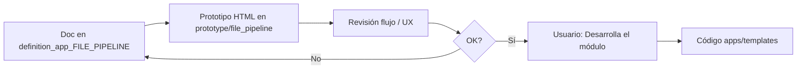

# definition_app_FILE_PIPELINE — Definición FILE PIPELINE

Carpeta de documentación de análisis y definición para **FILE PIPELINE** (orquestador de flujos multi-app).

> **Producto:** [`../FILE_PIPELINE.md`](../FILE_PIPELINE.md)  
> **Familia:** [`../APP_FACTORY.md`](../APP_FACTORY.md) · [`../APP_FACTORY_FILE_OPS.md`](../APP_FACTORY_FILE_OPS.md) §15  
> **Rama Git:** `main` (MVP mergeado; origen `Mejoras_FILE_PIPELINE_v2`)  
> **Estado:** **Implementado M1–M5 + tablero** (`apps.file_pipeline`)  
> **Chasis:** `Company`, `UserProfile`, membresía PA/ED/GE/CO, visibilidad, billing  
> **No es un Project.kind de archivo:** es un **contenedor de orquestación** que **invoca** runners de apps ya publicadas  
> **API:** diseño **API-ready** (`kind=file_pipeline` / `mode=pipeline`) — [`../PLATFORM_API.md`](../PLATFORM_API.md)

---

## Método de trabajo (por módulo)

Igual que Clean / Split-Merge / Gate: **definir → prototipar → revisar → implementar solo con OK explícito**.



| Paso | Dónde | Quién |
|------|-------|--------|
| 1. Diseño, alcance, reglas, validaciones | `docs/definition_app_FILE_PIPELINE/<modulo>.md` | Agente + revisión |
| 2. HTML demo | `prototype/file_pipeline/` (visor `#rutas` o `/prototype/file_pipeline/`) | Agente |
| 3. Revisión de flujo | Chat / Simple Browser | Usuario |
| 4. Implementación Django | `apps/file_pipeline/`, `templates/file_pipeline/` | **Solo si el usuario dice «Desarrolla el módulo»** |

---

## Documentos (por módulo)

| Archivo | Módulo | Contenido | Estado |
|---------|--------|-----------|--------|
| [`../FILE_PIPELINE.md`](../FILE_PIPELINE.md) | Producto | Visión, catálogo de pasos, handoff, disparadores | **Hecho** (M1–M5 + tablero) |
| [`project_lifecycle.md`](project_lifecycle.md) | **1** | Listado, alta, hub, miembros, `status` | **Implementado** |
| [`pipeline_designer.md`](pipeline_designer.md) | **2** | Rail de pasos, picker kind/proyecto | **Implementado** |
| [`pipeline_catalog.md`](pipeline_catalog.md) | **2b** | Pipeline Step Catalog (opt-in) | **Implementado** |
| [`pipeline_publish.md`](pipeline_publish.md) | **3** | Publicar versión; bloqueo si Diseñar incompleto | **Implementado** |
| [`pipeline_run.md`](pipeline_run.md) | **4** | Ejecutar, rail OK/ERROR, artifacts | **Implementado** |
| [`pipeline_history.md`](pipeline_history.md) | **5** | Historial y auditoría de disparo | **Implementado** |
| [`pipeline_dashboard.md`](pipeline_dashboard.md) | **D** | Tablero de corridas (alcance autorizado) | **Implementado** |
| [`fp_integration.md`](fp_integration.md) | Transversal | Kind, URLs, roles, runners, PLATFORM_API | **As-built** |

---

## Prototipos

| Carpeta | Contenido |
|---------|-----------|
| [`../../prototype/file_pipeline/`](../../prototype/file_pipeline/) | HTML por pantalla; visor `index.html` (hash) |

Abrir: `http://127.0.0.1:8000/prototype/file_pipeline/` (DEBUG + runserver) o Preview de `index.html`.

| Prototipo | Módulo | Destino futuro |
|-----------|--------|----------------|
| `pipelines_list.html` · `pipeline_create.html` · `pipeline_hub.html` · `pipeline_members.html` | 1 | `templates/file_pipeline/projects/…` |
| `pipeline_designer.html` | 2 | `templates/file_pipeline/designer/…` |
| `pipeline_catalog*.html` | 2b | `templates/file_pipeline/catalog/…` |
| `pipeline_publish.html` | 3 | `templates/file_pipeline/publish/…` |
| `pipeline_run.html` · `pipeline_result.html` | 4 | `templates/file_pipeline/run/…` |
| `pipeline_history.html` · `pipeline_run_detail.html` | 5 | `templates/file_pipeline/history/…` |
| `pipeline_dashboard.html` | D | `templates/file_pipeline/dashboard/…` |

---

## Carpetas de trabajo (objetivo)

| Rol | Ruta |
|-----|------|
| Specs | `docs/definition_app_FILE_PIPELINE/` |
| Prototipos | `prototype/file_pipeline/` |
| Templates Django | `templates/file_pipeline/<modulo>/` |
| App Django | `apps/file_pipeline/` |
| CSS / JS | `static/css/file_pipeline_*.css`, `static/js/file_pipeline-*.js` |

```
docs/
├── FILE_PIPELINE.md
└── definition_app_FILE_PIPELINE/
    ├── README.md
    ├── project_lifecycle.md
    ├── pipeline_designer.md
    ├── pipeline_catalog.md
    ├── pipeline_publish.md
    ├── pipeline_run.md
    ├── pipeline_history.md
    ├── pipeline_dashboard.md
    └── fp_integration.md
```

---

## Prioridad de implementación

| Orden | Módulo | Nota |
|-------|--------|------|
| 1 | M1 Ciclo de pipeline | Listado + `status` + hub |
| 2 | M2 Diseñador | Catálogo opt-in; rail guardado |
| 2b | M2b Step Catalog | Puede ir en paralelo (plataforma) |
| 3 | M3 Publicar | Bloqueo si Diseñar incompleto |
| 4 | M4 Run | Artifact refs; informe por paso |
| 5 | M5 Historial | `trigger_source` + auditoría |
| D | Dashboard | Tras M4–M5 |

---

## Convención

- Copy: **orquestación / flujo / pasos**, no “nuevo ETL” ni “workflow genérico”.  
- Formularios HTML plano; servicios `ok` / `error_code` / `user_message` ([`UI_MESSAGES.md`](../definition_app/UI_MESSAGES.md)).  
- Run productivo = **versión publicada** del pipeline **y** de cada proyecto de paso.  
- El orquestador no reimplementa motores: llama `run_*_job` de cada app.  
- `PipelineDefinition.status`: `active` · `in_progress` · `inactive` (filtro del listado; la versión no es filtro).

---

## Documentos relacionados

| Documento | Relación |
|-----------|----------|
| [`../FILE_PIPELINE.md`](../FILE_PIPELINE.md) | Producto paraguas |
| [`../PLATFORM_API.md`](../PLATFORM_API.md) | Disparo HTTP de pipeline |
| [`../FILE_WATCH.md`](../FILE_WATCH.md) · [`../FILE_SCHEDULER.md`](../FILE_SCHEDULER.md) | Disparadores |
| [`../FILE_CLEAN.md`](../FILE_CLEAN.md) · [`../FILE_SPLIT_MERGE.md`](../FILE_SPLIT_MERGE.md) · [`../FILE_GATE.md`](../FILE_GATE.md) | Pasos MVP |
| [`../definition_app_FILE_SPLIT_MERGE/`](../definition_app_FILE_SPLIT_MERGE/) | Patrón de carpeta / ritual |
