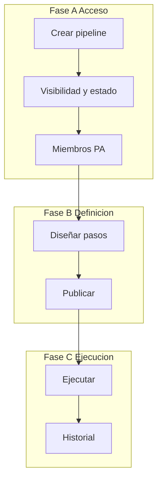

# Módulo 1 — Ciclo de vida del pipeline (FILE PIPELINE)

Alta, listado, visibilidad, miembros, **estado operativo** y hub del pipeline.

> **Estado:** M1 implementado (listado, alta, hub, miembros)  
> **Producto:** [`../FILE_PIPELINE.md`](../FILE_PIPELINE.md) §4, §6, §10  
> **Integración:** [`fp_integration.md`](fp_integration.md)  
> **Prototipo:** `prototype/file_pipeline/pipelines_list.html`, `pipeline_create.html`, `pipeline_hub.html`, `pipeline_members.html`  
> **Rama:** `Mejoras_FILE_PIPELINE_v2`

---

## Propósito

Un **pipeline** es la unidad de orquestación que agrupa:

1. Identidad (slug, nombre, visibilidad, miembros);
2. **Estado** `active` | `in_progress` | `inactive`;
3. Borrador de pasos (M2) y versiones publicadas (M3);
4. Runs e historial (M4–M5);
5. Quién puede ver, editar, publicar o ejecutar.

No es un proyecto Clean/Gate: **no** parsea archivos por sí mismo; apunta a proyectos publicados de otras apps.

| Fase | Qué cubre | Specs |
|------|-----------|-------|
| **A — Acceso** | Crear, listar, estado, visibilidad, miembros, hub | **Este documento** |
| **B — Definición** | Diseñar → publicar | `pipeline_designer.md`, `pipeline_publish.md` |
| **C — Ejecución** | Run + historial | `pipeline_run.md`, `pipeline_history.md` |

---

## Integración con DynamicWorkspace

| Concepto | Implementación (objetivo) |
|----------|---------------------------|
| Contenedor | `PipelineDefinition` (no reusar `Project.project_kind` de archivo) |
| Código | `slug` único por compañía |
| Tenant | `company` |
| Visibilidad | `members_only` \| `company` |
| Estado | `status`: `active` · `in_progress` · `inactive` |
| Versión activa | `current_version` (publicada) + borrador |
| Miembros | Membresía tipo PA/ED/GE/CO (paridad verticales de archivo) |
| Servicio | `pipeline_project_service` (nombre tentativo) |

Detalle: [`fp_integration.md`](fp_integration.md).

---

## Estado de la definición

Campo obligatorio. Independiente del último run y del filtro de listado.

| Valor | UI | Significado |
|-------|-----|-------------|
| `active` | Activo | En operación. Disparos solo con versión publicada. |
| `in_progress` | En proceso | Diseño / no puesto en marcha. Alta nace aquí. |
| `inactive` | Inactivo | Pausado; no se dispara. Historial se conserva. |

Transiciones: [`../FILE_PIPELINE.md`](../FILE_PIPELINE.md) §4. Solo **PA** (confirmar ED).

**Listado:** filtros **búsqueda** + **estado**. La versión publicada es **columna**, no combo.

---

## Fase A — Acceso

### A1 — Crear

| Campo | Obligatorio | Notas |
|-------|-------------|-------|
| `slug` | Sí | Único por compañía; minúsculas / guiones |
| `name` | Sí | Nombre visible |
| `description` | No | |
| `visibility` | Sí | Default `members_only` |
| `status` | Sí | Default `in_progress` (no se elige el rail aquí) |

- Creador queda **PA**.
- Sin pasos; sin versión publicada.
- PRG + HTML plano (sin Django Forms).
- Mensaje objetivo: *Pipeline creado correctamente.* → hub.

### A2 — Listado

- Solo pipelines autorizados (compañía o membresía).
- Columnas: código, nombre, estado, **pasos** (si hay más de 2: primeros dos + `...` verde; cadena completa en `title`), versión, acceso, último run.
- Resumen: visibles / activos / en proceso / inactivos (sobre el conjunto filtrado).

### A3 — Hub

Módulos (rail):

1. **Diseñar pasos** — pendiente hasta rail guardado con ≥1 paso válido.  
2. **Publicar** — bloqueado si (1) incompleto; alerta *No puede publicar. Pasos no completados: Diseñar pasos.*  
3. **Ejecutar** — solo versión publicada y `status=active`.  
4. **Historial**.

### A4 — Miembros (CRUD)

Paridad Clean/SM: **solo PA** invita, cambia rol y revoca. Misma compañía. Owner (creador) no se revoca ni cambia de rol.

| Acción | Quién | Notas |
|--------|-------|--------|
| Invitar | PA | **Buscar** UF (mín. 2 caracteres) en la compañía, aún no miembros; tope ~20 resultados. No un `<select>` con todo el padrón. Luego elige rol PA/ED/GE/CO |
| Cambiar rol | PA | En la fila; no aplica al owner |
| Revocar | PA | Confirmación; si el pipeline es privado, deja de verlo |
| Consultar listado | PA/ED/GE/CO | CO: ve miembros si tiene acceso al hub |

Ejecutar un run **también** exige permiso en cada proyecto de paso. El rol del pipeline no sustituye eso.

**Prototipo:** `prototype/file_pipeline/pipeline_members.html` · ayuda `pipeline_members_help.html`.

---

## URLs (objetivo)

Prefijo `/app/file-pipeline/` · namespace `file_pipeline:`.

| Acción | Ruta tentativa | Nombre |
|--------|----------------|--------|
| Listado | `pipelines/` | `pipeline_list` |
| Nuevo | `pipelines/nuevo/` | `pipeline_create` |
| Hub | `pipelines/<slug>/` | `pipeline_hub` |
| Miembros | `pipelines/<slug>/miembros/` | `pipeline_members` |
| Ayuda miembros | `pipelines/<slug>/miembros/ayuda/` | `pipeline_members_help` |
| Ayuda alta | `pipelines/nuevo/ayuda/` | `pipeline_create_help` |

---

## Criterio de aceptación M1

1. CRUD de definición + listado filtrado por estado.  
2. Hub con rail de módulos y gate de publicar.  
3. Visibilidad y PA al crear.  
4. Copy: orquestación, no ETL.

---

## Relacionados

| Doc | Uso |
|-----|-----|
| [`pipeline_designer.md`](pipeline_designer.md) | Completar paso 1 del hub |
| [`pipeline_publish.md`](pipeline_publish.md) | Paso 2 |
| [`../FILE_PIPELINE.md`](../FILE_PIPELINE.md) | Matriz PA/ED/GE/CO |
