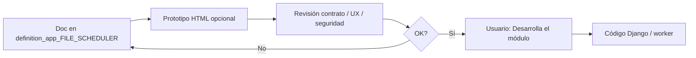

# definition_app_FILE_SCHEDULER — Definición FILE SCHEDULER

Carpeta de documentación de análisis y definición para **FILE SCHEDULER** (ejecución programada y dependencias).

> **Producto:** [`../FILE_SCHEDULER.md`](../FILE_SCHEDULER.md)  
> **Familia:** [`../APP_FACTORY.md`](../APP_FACTORY.md) · [`../APP_FACTORY_FILE_OPS.md`](../APP_FACTORY_FILE_OPS.md) §2  
> **Rama Git:** `diseno_desarrollo_FILE_SCHEDULER` (despliegue Railway solo desde `main`)  
> **Estado:** **M1–M10 implementados** (`apps.file_scheduler`; mapa de integración + filtro de tablero Pipeline)  
> **No es un vertical de menú UF:** no hay `project_kind` por formato. Orquesta runners existentes y puede disparar [`../FILE_PIPELINE.md`](../FILE_PIPELINE.md) (`pipeline_id`)  
> **Chasis:** `Company`, tipos UA/US/UF, membresía PA/ED/GE/CO, billing/feature flags — **crear plan = US PA/ED** de la compañía; identidad de tick = sistema ([`../security/SEGURIDAD_Y_ACCESOS.md`](../security/SEGURIDAD_Y_ACCESOS.md))  
> **Auditoría / errores:** [`../FILE_SCHEDULER.md`](../FILE_SCHEDULER.md) §7–§8; hereda Pipeline §6 · §7 · §7.1 y PLATFORM API §9 · §10.2 · §11 (no duplicar pasos ni filas de app)

---

## Método de trabajo (por módulo)

**Definir → (opcional) prototipo HTML de UI de schedules → revisar → implementar solo con OK explícito.**

Hay dos entregables: **contrato del plan + worker/tick** (cron, cola, auditoría) y **UI de CRUD** de schedules (listado / alta / pausar). No generar la app Django hasta que el usuario diga «Desarrolla el módulo».



| Paso | Dónde | Quién |
|------|-------|--------|
| 1. Diseño, alcance, reglas, validaciones | `docs/definition_app_FILE_SCHEDULER/<modulo>.md` | Agente + revisión |
| 2. Prototipo (si el módulo es UI) | `prototype/file_scheduler/` | Agente |
| 3. Revisión | Chat | Usuario |
| 4. Implementación | `apps.file_scheduler` (o capa de plataforma) + worker Railway | **Solo con OK explícito** |

Los módulos **especializan** un corte de [`../FILE_SCHEDULER.md`](../FILE_SCHEDULER.md). No copian el paraguas ni el §7.1 del Pipeline.

---

## Documentos (por módulo)

| Archivo | Módulo | Contenido | Estado | Ancla producto |
|---------|--------|-----------|--------|----------------|
| [`../FILE_SCHEDULER.md`](../FILE_SCHEDULER.md) | Producto | Visión, fronteras, auditoría, errores, operación | **Lineamientos** | — |
| [`sch_lifecycle.md`](sch_lifecycle.md) | **1** | Listado, alta, edición, pausar/reanudar, archivar | **Implementado (M1)** | §2 · §7-A · §9 |
| [`sch_cron.md`](sch_cron.md) | **2** | Expresión cron / calendario / ventanas / días hábiles | **Implementado (M2)** | §3 · §5 |
| [`sch_target.md`](sch_target.md) | **3** | Destino: `kind`+proyecto o `pipeline_id`; versión publicada; entrada de archivo | **Implementado (M3)** | §1 · §10 entrada |
| [`sch_tick.md`](sch_tick.md) | **4** | Worker, encolar Job/run, misfire, `scheduled_for` | **Implementado (M4)** | §3 worker · §8 infra |
| [`sch_overlap.md`](sch_overlap.md) | **5** | Solape, idempotencia de ventana, skip/queue | **Implementado (M5)** | §10 |
| [`sch_dependency.md`](sch_dependency.md) | **6** | “Tras Job A / pipeline run” (`trigger_source=dependency`) | **Implementado (M6)** | §2 · Pipeline §7.1-B |
| [`sch_audit.md`](sch_audit.md) | **7** | CRUD append-only + tick; `schedule_id`; enlace `job_id` / `pipeline_run_id` | **Implementado (M7)** | §7 |
| [`sch_errors.md`](sch_errors.md) | **8** | Capas de error y códigos `schedule_*` | **Implementado (M8)** | §8 · UI_MESSAGES |
| [`sch_notify.md`](sch_notify.md) | **9** | Correo/webhook al fallar tick o run | **Implementado (M9)** | §10 notificaciones |
| [`sch_integration.md`](sch_integration.md) | **10** | Watch, Pipeline, PLATFORM API, tablero, Railway | **Implementado (M10)** | §4 · §9 · §10 tablero |

Los `.md` de módulo se crean **al abrir cada módulo**, no todos a la vez.

---

## Qué no va en esta carpeta

| Queda fuera | Dónde vive |
|-------------|------------|
| Diseñador de pasos / handoff de pipeline | [`../definition_app_FILE_PIPELINE/`](../definition_app_FILE_PIPELINE/) |
| Auditoría E2E de pipeline (definición + paso) | [`../FILE_PIPELINE.md`](../FILE_PIPELINE.md) §7.1 — aquí solo CRUD del schedule y el tick |
| Auditoría HTTP de máquina | [`../definition_app_PLATFORM_API/pa_audit.md`](../definition_app_PLATFORM_API/pa_audit.md) |
| Ingestión por llegada de archivo | [`../FILE_WATCH.md`](../FILE_WATCH.md) |
| Tablero de corridas | [`../definition_app_FILE_PIPELINE/pipeline_dashboard.md`](../definition_app_FILE_PIPELINE/pipeline_dashboard.md) — el Scheduler **alimenta** `trigger_source=scheduler` |
| Parsers / reglas de cada app | Specs de Gate, Pipe, Clean, etc. |

---

## Prototipos

| Carpeta | Contenido |
|---------|-----------|
| [`../../prototype/file_scheduler/`](../../prototype/file_scheduler/) | M1–M9 + mapa de integración |

Abrir en **Simple Browser de Cursor** (DEBUG + `runserver`):

`http://127.0.0.1:8000/prototype/file_scheduler/schedule_cron.html`

También: `http://127.0.0.1:8000/prototype/file_scheduler/`

| Prototipo | Módulo | Destino futuro |
|-----------|--------|----------------|
| `schedules_list.html` | 1 | `templates/file_scheduler/projects/list.html` |
| `schedule_create.html` | 1 | `…/create.html` |
| `schedule_hub.html` · `_active` · `_paused` | 1 | `…/hub.html` |
| `schedule_edit.html` | 1 | `…/edit.html` |
| `schedule_members.html` | 1 | `…/members.html` |
| `schedule_cron.html` | **2** | `templates/file_scheduler/cron.html` |
| `schedule_cron_help.html` | **2** | `…/cron_help.html` |
| `schedule_target.html` | **3** | `templates/file_scheduler/target/target.html` |
| `schedule_target_help.html` | **3** | `…/target/target_help.html` |
| `schedule_activity.html` · `_empty` | **4** | `templates/file_scheduler/activity/activity.html` |
| `schedule_activity_help.html` | **4** | `…/activity/activity_help.html` |
| `schedule_overlap.html` | **5** | `templates/file_scheduler/overlap/overlap.html` |
| `schedule_overlap_help.html` | **5** | `…/overlap/overlap_help.html` |
| `schedule_dependency.html` | **6** | `templates/file_scheduler/dependency/dependency.html` |
| `schedule_dependency_help.html` | **6** | `…/dependency/dependency_help.html` |
| `schedule_audit.html` · `_empty` | **7** | `templates/file_scheduler/audit/audit.html` |
| `schedule_audit_help.html` | **7** | `…/audit/audit_help.html` |
| `schedule_errors.html` | **8** | `templates/file_scheduler/errors/errors.html` |
| `schedule_errors_help.html` | **8** | `…/errors/errors_help.html` |
| `schedule_notify.html` | **9** | `templates/file_scheduler/notify/notify.html` |
| `schedule_notify_help.html` | **9** | `…/notify/notify_help.html` |
| `schedule_integration.html` | **10** | `templates/file_scheduler/integration/integration.html` |
| `*_help.html` (resto) | 1 | `…/*_help.html` |

---

## Carpetas de trabajo (objetivo)

```
docs/
├── FILE_SCHEDULER.md
└── definition_app_FILE_SCHEDULER/
    └── README.md
    └── sch_*.md          ← al abrir cada módulo

prototype/file_scheduler/   ← al abrir UI M1
apps/file_scheduler/        ← solo con «Desarrolla el módulo»
```

---

## Prioridad de diseño

Alineado a [`../FILE_SCHEDULER.md`](../FILE_SCHEDULER.md) §6. Forma de trabajo del MVP **cerrada** (UI + worker cron); ver producto §3.

| Orden | Módulo | Nota |
|-------|--------|------|
| 1 | M1 Ciclo de vida | CRUD del schedule; crear = US PA/ED |
| 2 | M2 Cron | Calendario mínimo (diario / expresión) |
| 3 | M3 Destino | Job suelto o `pipeline_id`; entrada |
| 4 | M4 Tick | Worker / cola; misfire |
| 5 | M5 Solape | Default MVP: skip |
| 6 | M6 Dependencia | Tras M4 si se prioriza “tras Job A” |
| 7 | M7 Auditoría | En paralelo a M1 y M4 |
| 8 | M8 Errores | Códigos `schedule_*` + UI_MESSAGES |
| 9 | M9 Notify | Tras M4 |
| — | Transversal `sch_integration.md` | Watch / Pipeline / API / tablero · **M10** |

---

## Convención

- Copy: **programación / plan / tick**, no “nuevo ETL” ni “otro Watch”.  
- Formularios HTML plano; servicios `ok` / `error_code` / `user_message` ([`../definition_app/UI_MESSAGES.md`](../definition_app/UI_MESSAGES.md)).  
- Productivo = destino con **versión publicada** (proyecto o pipeline).  
- Un solo runner: UI, API, Watch y Scheduler no bifurcan semántica.  
- Pipeline: **delegar** `pipeline_id`; no reimplementar la cadena.  
- El tick **no** bypasea tenancy ni permisos de los proyectos destino.  
- Nombres de código (cuando existan): inglés; docs: español.

---

## Documentos relacionados

| Documento | Relación |
|-----------|----------|
| [`../FILE_SCHEDULER.md`](../FILE_SCHEDULER.md) | Producto paraguas |
| [`../FILE_PIPELINE.md`](../FILE_PIPELINE.md) | Destino `pipeline_id`; §6 · §7.1 (`trigger_source=scheduler`) |
| [`../definition_app_FILE_PIPELINE/`](../definition_app_FILE_PIPELINE/) | Specs del orquestador |
| [`../PLATFORM_API.md`](../PLATFORM_API.md) | Disparador hermano; §9 · §10.2 · §11 |
| [`../definition_app_PLATFORM_API/`](../definition_app_PLATFORM_API/) | Patrón de carpeta (API) |
| [`../FILE_WATCH.md`](../FILE_WATCH.md) | Disparo por llegada |
| [`../APP_FACTORY_FILE_OPS.md`](../APP_FACTORY_FILE_OPS.md) | Índice ops §2 |
| [`../security/SEGURIDAD_Y_ACCESOS.md`](../security/SEGURIDAD_Y_ACCESOS.md) | Auth humana; tick como sistema |
| [`../definition_app/UI_MESSAGES.md`](../definition_app/UI_MESSAGES.md) | Códigos y mensajes |
