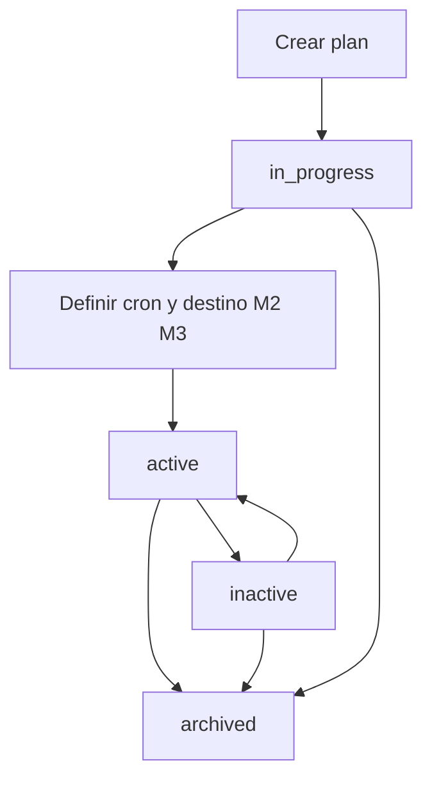

# Módulo 1 — Ciclo de vida del schedule (FILE SCHEDULER)

Alta, listado, edición, **pausar / reanudar**, archivar y hub del plan. Sin worker, sin cron detallado, sin disparo.

> **Estado:** **M1 implementado** (ciclo de vida Django); M2–M9 siguen en diseño  
> **Producto:** [`../FILE_SCHEDULER.md`](../FILE_SCHEDULER.md) §2 · §7-A · §9  
> **Índice:** [`README.md`](README.md)  
> **Rama:** `diseno_desarrollo_FILE_SCHEDULER`  
> **Siguientes módulos:** cron (`sch_cron.md`) · destino (`sch_target.md`) · tick (`sch_tick.md`) · auditoría detallada (`sch_audit.md`)

---

## Propósito

Un **schedule** (plan) es la unidad de plataforma que el usuario **crea y mantiene** para que, más adelante, un tick dispare un Job o un pipeline.

Este módulo cubre solo el **ciclo de vida de la definición**:

1. Identidad (código, nombre, visibilidad).
2. **Estado operativo** (en proceso / activo / **inactivo** / archivado) — paridad de etiquetas con File Pipeline.
3. Quién puede listar, crear, editar, pausar o archivar.
4. Auditoría **CRUD** (plano A del producto; no el tick).

**No cubre:** expresión cron (M2), destino `kind`/`pipeline_id` (M3), worker (M4), solape (M5), dependencia (M6), códigos `schedule_*` de ejecución (M8), notificaciones (M9).

El tick (M4) **solo** considera planes `active` con cron y destino válidos (otros módulos). Un plan `inactive` o `archived` no se dispara (`schedule_paused` / no activo en M8).

---

## Integración con DynamicWorkspace

| Concepto | Implementación (objetivo) |
|----------|---------------------------|
| Contenedor | Entidad de plataforma `Schedule` (no `Project.project_kind` de archivo) |
| Código | `slug` único por compañía |
| Tenant | `company` — sin lectura cruzada |
| Visibilidad | `members_only` \| `company` (paridad Pipeline / verticales) |
| Estado | `status`: ver tabla abajo |
| Miembros | Reutilizar PA/ED/GE/CO; **no** inventar roles |
| Servicio | `schedule_lifecycle_service` (nombre tentativo) |

No hay `project_kind` de Scheduler. El plan **apunta** a un proyecto publicado o a un `pipeline_id` (M3).

---

## Estado de la definición

Independiente del último tick y del resultado del Job/pipeline.

| Valor | UI | Significado | ¿El worker puede disparar? |
|-------|-----|-------------|----------------------------|
| `in_progress` | En proceso | Alta / aún sin cron+destino listos para producción | No |
| `active` | Activo | Plan en operación (destino M3 y disparador: cron M2 **o** dependencia M6) | Sí, si M3 + (M2 o M6) válidos |
| `inactive` | **Inactivo** | Pausado a propósito (paridad File Pipeline). Definición e historial se conservan | No |
| `archived` | Archivado | Baja lógica; no aparece en listado operativo | No |

No hay un estado aparte `paused`: la **acción** es Pausar / Reanudar; el **valor** persistido y la columna Estado es `inactive` / Inactivo.

**Alta:** nace en `in_progress`.  
**Activar** (`in_progress` → `active`): bloqueado si destino (M3) incompleto, o si el disparador es horario sin cron (M2), o dependencia sin padre (M6).  
**Pausar:** solo desde `active` → `inactive`.  
**Reanudar / marcar activo:** `inactive` → `active` (mismas comprobaciones que activar).  
**Archivar:** desde `in_progress`, `active` o `inactive`; no se borra el historial de ticks (M7).  
**No** hay hard-delete en MVP.

Transiciones de estado (pausar / reanudar / archivar) solo **PA o ED del plan** (producto §9). GE/CO: lectura.

---

## Autorización (este módulo)

Hereda [`../FILE_SCHEDULER.md`](../FILE_SCHEDULER.md) §9 y Pipeline §6. Tick = sistema (fuera de M1).

**Crear plan** exige **tipo de usuario `US`** de la misma compañía **y** rol **PA** o **ED**. Un **UF** no da de alta planes (aunque sea PA/ED de un proyecto vertical). Un **US** con rol GE o CO tampoco.

La matriz siguiente aplica **sobre el plan** (miembros). La fila Crear además filtra por `user_type=US`.

| Acción | PA | ED | GE | CO |
|--------|----|----|----|-----|
| Listar / ver metadatos | ✓ | ✓ | ✓ | ✓ |
| Crear plan (`US` + este rol) | ✓ | ✓ | — | — |
| Editar nombre, descripción, visibilidad | ✓ | ✓ | — | — |
| Pausar / reanudar | ✓ | ✓ | — | — |
| Archivar | ✓ | — | — | — |
| Gestionar miembros (si el plan tiene membresía propia) | ✓ | — | — | — |
| Ver auditoría CRUD | ✓ | ✓ | ✓* | ✓* |

\*CO/GE: metadatos de eventos; sin datos de archivo (no hay archivo en M1).

Compañía inactiva o plan de otra company → no listar (404 opaco al acceso directo).

---

## Crear

| Campo | Obligatorio | Notas |
|-------|-------------|-------|
| `slug` | Sí | Único por compañía; minúsculas / guiones |
| `name` | Sí | Nombre visible |
| `description` | No | |
| `visibility` | Sí | Default `members_only` |
| `status` | Sí | Default `in_progress` (no se elige cron ni destino aquí) |

- Creador: **US** PA o ED de la compañía; queda **PA** del plan.
- Sin cron, sin destino, sin ticks.
- PRG + HTML plano (sin Django Forms).
- Servicio: `ok` / `error_code` / `user_message`.
- Mensaje éxito (catálogo al implementar): *Plan creado correctamente.* → hub.

Errores de negocio típicos (M1, no `schedule_paused` de tick):

| `error_code` (tentativo) | Cuándo |
|--------------------------|--------|
| `schedule_slug_taken` | Slug duplicado en la compañía |
| `schedule_forbidden` | No es US PA/ED de la compañía (crear) o no es PA/ED del plan (resto) |
| `validation_required` | Nombre o slug vacío |

---

## Listado

- Solo planes de la **misma compañía** visibles por membresía o `visibility=company`.
- Excluir `archived` del listado operativo (filtro “Archivados” opcional).
- Columnas: código, nombre, estado, visibilidad, **próximo tick** (vacío hasta M2/M4), último tick (vacío hasta M4), acceso.
- Resumen: visibles / activos / en proceso / **inactivos** (sobre el conjunto filtrado).
- Filtros: búsqueda + estado (Activo, En proceso, Inactivo; Archivados aparte).

---

## Hub

Rail de módulos (estado de cada uno: pendiente / listo según specs posteriores):

1. **Programación (cron)** — M2 ([`sch_cron.md`](sch_cron.md)): presets + cron + zona; no dispara.  
2. **Destino** — M3 ([`sch_target.md`](sch_target.md)): qué app o `pipeline_id` se ejecuta. No es una ruta IFS; el archivo llega por Watch o `artifact_ref` (mejora futura de runners — [`../APP_FACTORY_FILE_OPS.md`](../APP_FACTORY_FILE_OPS.md)).  
3. **Solape** — M5 ([`sch_overlap.md`](sch_overlap.md)): skip / queue / cancel-previous; default Omitir. No bloquea Activar.  
4. **Dependencia** — M6 ([`sch_dependency.md`](sch_dependency.md)): reloj **o** “tras Job/pipeline A”.  
5. **Avisos** — M9 ([`sch_notify.md`](sch_notify.md)): correo/webhook; default off; no bloquea Activar.  
6. **Actividad / ticks** — M4 ([`sch_tick.md`](sch_tick.md)): historial de disparos del plan; no el historial de Gate/Pipe.  
7. **Auditoría** — M7 ([`sch_audit.md`](sch_audit.md)): timeline append-only (CRUD + ticks).  
8. **Miembros** — si aplica.

Acciones en hub: **Pausar** / **Reanudar** / **Archivar** según estado y rol.

No hay “Ejecutar ahora” en M1 (eso es disparo; M4 o acción futura explícita).

---

## Editar

PA/ED pueden cambiar `name`, `description`, `visibility`.  
`slug` **inmutable** tras el alta (paridad pipelines / proyectos).

Editar **no** cambia `status`. Pausar/reanudar/archivar son acciones distintas.

Si el plan está `active`, editar metadatos **no** cancela un run en curso (producto §10: cancelar es del job delegado).

---

## Pausar / reanudar

| Acción | De | A | Efecto |
|--------|----|---|--------|
| Pausar | `active` | `inactive` | El worker no encola nuevos ticks. Runs ya encolados no se abortan desde M1. Columna Estado = **Inactivo**. |
| Reanudar | `inactive` | `active` | Exige destino (M3) y disparador (cron M2 o dependencia M6). Si incompleto → error de negocio, no reanudar. |

Pausar un plan `in_progress` no aplica (aún no dispara). Archivar cubre “sacar de circulación” el borrador.

---

## Archivar

Baja lógica. El plan deja el listado operativo.  
No se reutiliza el `slug` en MVP (evitar colisión de auditoría).  
Evento `schedule.archived`. Restaurar = fuera de MVP (o acción PA explícita futura).

---

## Auditoría CRUD (plano A)

Obligatorio. Append-only. Sin PII de celdas. Detalle de campos de tick: M7 / producto §7-B.

| Evento | Qué registrar |
|--------|----------------|
| `schedule.created` | `created_by`, `created_at`, `company_id`, slug, name, visibility, status inicial |
| `schedule.updated` | `updated_by`, `updated_at`, campos cambiados (nombre, descripción, visibilidad) |
| `schedule.paused` | actor, timestamp, `active` → `inactive` |
| `schedule.resumed` | actor, timestamp, `inactive` → `active` |
| `schedule.archived` | actor, timestamp |

No hay ejecución anónima. PLATFORM API **no** audita este CRUD en su MVP (producto §7-A).

---

## Miembros

Si el schedule tiene membresía propia: paridad Pipeline/Clean — **solo PA** invita, cambia rol y revoca; misma compañía; el creador (owner) no se revoca ni pierde PA.

Si se decide **heredar** permisos de un proyecto/pipeline contenedor: documentarlo en `sch_integration.md`. M1 asume membresía propia del plan; **el alta** no se hereda de un vertical: solo **US** PA/ED de la compañía.

---

## API-ready

CRUD de schedules **fuera** del MVP de PLATFORM API. Este módulo no define `POST /schedules`. El diseño no impide una admin API posterior.

---

## Fuera de alcance (este archivo)

- Modelos Django, migraciones, worker Railway.  
- Expresión cron, destino, solape, `error_code` de tick (`schedule_misfire`, etc.).

**Prototipos M1:** [`../../prototype/file_scheduler/`](../../prototype/file_scheduler/) (`index.html`).

---

## Criterio de aceptación del módulo (diseño)

- [x] Alta con slug único por compañía y status `in_progress`.  
- [x] Listado filtrable (Activo / En proceso / **Inactivo** / Archivados).  
- [x] Hub con pausar / reanudar / archivar y rail a M2–M3.  
- [x] Matriz PA/ED/GE/CO de este documento; crear = US + PA/ED.  
- [x] Eventos CRUD §7-A (created / updated / paused / resumed / archived) con `inactive` en persistencia.  
- [x] Mensajes alineables a [`../definition_app/UI_MESSAGES.md`](../definition_app/UI_MESSAGES.md).  
- [x] Prototipos HTML M1 (sin código Django) — revisión UX pendiente de OK.

---

## Documentos relacionados

| Documento | Relación |
|-----------|----------|
| [`../FILE_SCHEDULER.md`](../FILE_SCHEDULER.md) | Producto §2 · §7-A · §9 |
| [`README.md`](README.md) | Índice de módulos |
| [`../FILE_PIPELINE.md`](../FILE_PIPELINE.md) | §6 permisos; no duplicar ciclo de pipeline |
| [`../definition_app/UI_MESSAGES.md`](../definition_app/UI_MESSAGES.md) | Textos al implementar |
| [`../security/SEGURIDAD_Y_ACCESOS.md`](../security/SEGURIDAD_Y_ACCESOS.md) | Tenant, tipos UA/US/UF |
