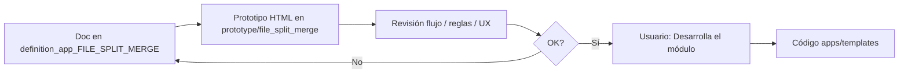

# definition_app_FILE_SPLIT_MERGE — Definición FILE SPLIT / MERGE

Carpeta de documentación de análisis y definición para **FILE SPLIT / MERGE** (partición y consolidación de archivos), vertical de la oleada FILE_OPS.

> **Producto:** [`../FILE_SPLIT_MERGE.md`](../FILE_SPLIT_MERGE.md)  
> **Familia:** [`../APP_FACTORY_FILE_OPS.md`](../APP_FACTORY_FILE_OPS.md) §5–§6  
> **Estado:** **hecho** — M1–M6 en `main` / Railway (PR #13; rama `feature/file-split-merge` fusionada)  
> **Chasis:** `Company`, `UserProfile`, `Project`, `ProjectMembership`, seguridad y billing  
> **Reuso técnico DMS:** parsers, serializers, intake — [`../definition_app_DMS/`](../definition_app_DMS/)  
> **API:** runner API-ready; capa HTTP en [`../PLATFORM_API.md`](../PLATFORM_API.md) **después** de cerrar apps FILE_OPS — ampliar [`sm_integration.md`](sm_integration.md) en esa fase

---

## Método de trabajo (por módulo)

Igual que FILE CLEAN / GATE / Match: **definir → prototipar → revisar → implementar solo con OK explícito**.



| Paso | Dónde | Quién |
|------|-------|--------|
| 1. Diseño, alcance, reglas, validaciones | `docs/definition_app_FILE_SPLIT_MERGE/<modulo>.md` | Agente + revisión |
| 2. HTML demo | `prototype/file_split_merge/` | Agente |
| 3. Revisión de flujo | Chat / demo | Usuario |
| 4. Implementación Django | `apps/file_split_merge/`, `templates/file_split_merge/` | **Solo si el usuario dice «Desarrolla el módulo»** |

---

## Documentos (por módulo)

| Archivo | Módulo | Contenido | Estado |
|---------|--------|-----------|--------|
| [`../FILE_SPLIT_MERGE.md`](../FILE_SPLIT_MERGE.md) | Producto | Visión, alcance, reglas SM*, API-ready | **Hecho** (producto + app) |
| [`project_lifecycle.md`](project_lifecycle.md) | **1** | Alta, listado, hub, miembros | **Implementado** |
| [`sm_profile.md`](sm_profile.md) | **2** | Perfil de lectura (source-like) | **Implementado** |
| [`sm_rules.md`](sm_rules.md) | **3** | Reglas Split y Merge | **Implementado** |
| [`sm_publish.md`](sm_publish.md) | **4** | Publicar versión | **Implementado** |
| [`sm_run.md`](sm_run.md) | **5** | Upload, preview, job, artifacts | **Implementado** |
| [`sm_history.md`](sm_history.md) | **6** | Historial de jobs | **Implementado** |
| [`sm_integration.md`](sm_integration.md) | Transversal | Kind, URLs, roles, reuso DMS · **PLATFORM_API** | **Parcial** — chasis vivo; contrato HTTP **diferido** a PLATFORM_API |

---

## Prototipos

| Carpeta | Contenido |
|---------|-----------|
| [`../../prototype/file_split_merge/`](../../prototype/file_split_merge/) | HTML estáticos por pantalla (cuando se abran) |

| Prototipo (objetivo) | Módulo | Destino futuro |
|----------------------|--------|----------------|
| `projects_*.html` | 1 | `templates/file_split_merge/projects/…` |
| `profile_*.html` | 2 | `templates/file_split_merge/profile/…` |
| `rules_*.html` | 3 | `templates/file_split_merge/rules/…` |
| `publish_*.html` | 4 | `templates/file_split_merge/publish/…` |
| `run_*.html` | 5 | `templates/file_split_merge/run/…` |
| `history_*.html` | 6 | `templates/file_split_merge/history/…` |

---

## Carpetas de trabajo

| Rol | Ruta |
|-----|------|
| Specs | `docs/definition_app_FILE_SPLIT_MERGE/` |
| Prototipos | `prototype/file_split_merge/` |
| Templates Django | `templates/file_split_merge/<modulo>/` |
| App Django | `apps/file_split_merge/` |
| CSS / JS | `static/css/file_split_merge_*.css`, `static/js/file_split_merge-*.js` |

```
docs/
├── FILE_SPLIT_MERGE.md
└── definition_app_FILE_SPLIT_MERGE/
    ├── README.md
    ├── project_lifecycle.md
    ├── sm_profile.md
    ├── sm_rules.md
    ├── sm_publish.md
    ├── sm_run.md
    ├── sm_history.md
    └── sm_integration.md
```

---

## Orden de módulos

| # | Módulo | Notas |
|---|--------|-------|
| 1 | M1 Proyecto | Kind, listado, hub, miembros |
| 2 | M2 Perfil | Reuso máximo source DMS (como Clean) |
| 3 | M3 Reglas | Split vs Merge; UI clara de operación |
| 4 | M4 Publicar | Congelar perfil + operation + rules |
| 5 | M5 Run | Job 1→N / N→1 + artifacts (API-ready) |
| 6 | M6 Historial | Paridad Clean/Gate |
| — | Integración / PLATFORM_API | Ampliar `sm_integration.md` al desarrollar la API |

---

## Convención

- Copy: **partición / consolidación**, no “transformación ETL” ni “conciliación”.  
- Formularios HTML plano; servicios con `ok` / `error_code` / `user_message` ([`UI_MESSAGES.md`](../definition_app/UI_MESSAGES.md)).  
- Toda ejecución productiva = versión publicada.  
- El runner de job no debe acoplarse solo a vistas HTML (futuro PLATFORM_API).

---

## Documentos relacionados

| Documento | Relación |
|-----------|----------|
| [`../FILE_SPLIT_MERGE.md`](../FILE_SPLIT_MERGE.md) | Producto |
| [`../APP_FACTORY_FILE_OPS.md`](../APP_FACTORY_FILE_OPS.md) | Paraguas ops |
| [`../FILE_CLEAN.md`](../FILE_CLEAN.md) | Patrón hermano |
| [`../PLATFORM_API.md`](../PLATFORM_API.md) | API post-FILE_OPS |
| [`../definition_app_DMS/`](../definition_app_DMS/) | Parsers / serializers |
