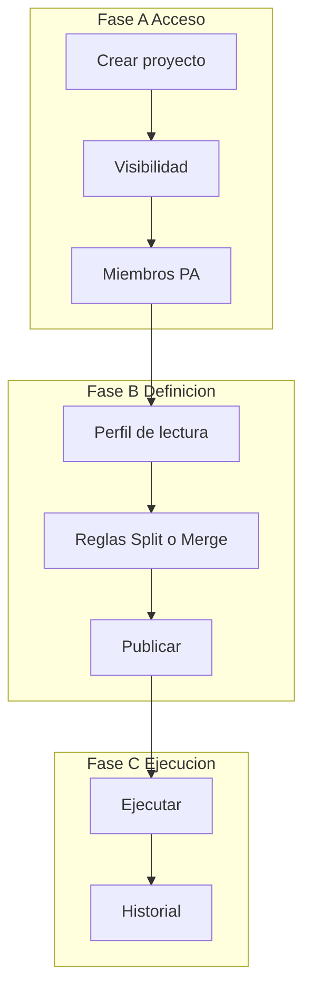

# Módulo 1 — Ciclo de vida del proyecto (FILE SPLIT / MERGE)

Ciclo de vida del **proyecto File Split/Merge**: alta, visibilidad, miembros, hub y orden del flujo definición / ejecución / historial.

> **Estado:** implementado (M1)  
> **Producto:** [`../FILE_SPLIT_MERGE.md`](../FILE_SPLIT_MERGE.md)  
> **Integración:** [`sm_integration.md`](sm_integration.md)  
> **Plataforma:** reutiliza [`Project` y `ProjectMembership`](../definition_app/DynamicWorkspace_Model.md#project)  
> **Patrón:** hermano de File Clean M1 / File Match M1  
> **Rama:** fusionada a `main` (PR #13)

---

## Propósito

Un **proyecto FILE SPLIT / MERGE** es la unidad de trabajo que agrupa:

1. **Perfil de lectura** (cómo se parsea el archivo);
2. **Operación** Split (1→N) o Merge (N→1) + **reglas**;
3. **Versiones** publicadas de esa definición;
4. **Jobs** de partición o consolidación, artifacts e historial;
5. **Quién** puede ver, editar, ejecutar o consultar.

No es FilePipe (no mapea a destino de negocio), ni File Match (no concilia), ni File Clean (no normaliza celdas).

| Fase | Qué cubre | Specs |
|------|-----------|-------|
| **A — Acceso** | Crear, listar, visibilidad, miembros, hub | **Este documento** |
| **B — Definición** | Perfil → reglas → publicar | `sm_profile.md`, `sm_rules.md`, `sm_publish.md` |
| **C — Ejecución** | Run + historial | `sm_run.md`, `sm_history.md` |

---

## Integración con DynamicWorkspace

| Concepto | Implementación |
|----------|----------------|
| Contenedor | `Project` con `project_kind = file_split_merge` |
| Código | `Project.slug` (único por compañía) |
| Nombre / descripción | `Project.name`, `Project.description` |
| Creador | `Project.owner` + membresía **PA** |
| Tenant | `Project.company` |
| Archivado | `Project.is_archived` (soft, alineado a otros kinds) |
| Visibilidad | `DmsProjectConfig.visibility` (`company` \| `members_only`) |
| Versión activa | `DmsProjectConfig.current_version` (cuando exista versión SM) |
| Miembros | `ProjectMembership` — misma compañía |
| Servicio (objetivo) | `split_merge_project_service` + `project_service` (miembros) |

Detalle: [`sm_integration.md`](sm_integration.md).

---

## Fase A — Acceso

### A1 — Crear proyecto

| Campo | Obligatorio | Notas |
|-------|-------------|-------|
| `name` | Sí | Nombre visible |
| `slug` | Sí | Código único por compañía; minúsculas, guiones |
| `description` | No | Default UX: «Proyecto File Split/Merge: partición o consolidación de archivos.» |
| `visibility` | Sí | Default `members_only` (**Privado**) |

- Solo usuarios **UF** con seguridad completa.
- Al crear: `Project(kind=file_split_merge)` + `DmsProjectConfig` + membership **PA** del creador.
- Sin versión publicada; sin reglas; perfil vacío.
- Mensaje: *«Proyecto File Split/Merge creado correctamente.»* → redirect al hub.
- PRG + validación manual (sin Django Forms).

| Acción | URL | Nombre |
|--------|-----|--------|
| Formulario | `/app/file-split-merge/proyectos/nuevo/` | `project_create` |
| Ayuda | `…/nuevo/ayuda/` | `project_create_help` |

### A2 — Visibilidad

| Valor UI | Código | Comportamiento |
|----------|--------|----------------|
| **Privado** | `members_only` | Solo membresía activa |
| **Público** | `company` | UF de la misma compañía pueden **ver** el proyecto sin ser miembros (consulta virtual) |

Editar / publicar / ejecutar siguen exigiendo rol adecuado (matriz §Roles).

### A3 — Miembros y autorizaciones

- Solo el **PA** gestiona miembros.
- Acciones: invitar, revocar, reactivar, cambiar rol.
- Roles: **PA** / **ED** / **GE** / **CO**.
- El **owner** no se revoca ni cambia de rol.
- Reuso: `project_service.invite_member`, `set_member_active`, `update_member_role`, etc.

| Acción | URL | Nombre |
|--------|-----|--------|
| Miembros | `/app/file-split-merge/proyectos/<slug>/miembros/` | `project_members` |
| Ayuda | `…/miembros/ayuda/` | `project_members_help` |

Si un no-PA abre miembros → redirect al hub con mensaje de denegación.

### A4 — Listado

| Acción | URL | Nombre |
|--------|-----|--------|
| Listado | `/app/file-split-merge/proyectos/` | `project_list` |
| Ayuda | `…/proyectos/ayuda/` | `project_list_help` |

- QS: proyectos `file_split_merge` de la compañía donde el usuario es miembro **o** el proyecto es público compañía.
- Stats: total, activos, como PA, públicos compañía.
- Columnas: código, nombre, visibilidad, mi permiso, resumen definición (borrador / publicada / operación), Abrir.
- Empty state: CTA «Nuevo proyecto» + enlace a guía breve.

---

## Hub del proyecto

| Acción | URL | Nombre |
|--------|-----|--------|
| Hub | `/app/file-split-merge/proyectos/<slug>/` | `project_hub` |
| Ayuda | `…/<slug>/ayuda/` | `project_hub_help` |

El hub es el **tablero del ciclo**: stepper + paneles por módulo + CTAs.

### Stepper (UI)

| # | Etiqueta | Destino (cuando exista) | Activación |
|---|----------|-------------------------|------------|
| 1 | Perfil | M2 perfil hub | `is-done` si perfil completo; si no `is-active` o pendiente |
| 2 | Reglas | M3 reglas | `is-done` si hay reglas válidas + operación; bloqueado si no hay perfil |
| 3 | Publicar | M4 publish | `is-done` si hay versión publicada; activo si perfil+reglas OK |
| 4 | Ejecutar | M5 run | Activo solo con publicada; primary tras primera necesidad |
| 5 | Historial | M6 history | `is-active` tras jobs; no marcar “hecho” solo por existir jobs (como Clean) |

Clases de botón (paridad Clean):

| Estado | Clase |
|--------|--------|
| Pendiente / CTA principal | `btn-primary` |
| Completado / ver | `btn-info` |
| Bloqueado | `btn-secondary` disabled o sin enlace |

### Paneles del hub

| Panel | Contenido |
|-------|-----------|
| Resumen | Nombre, slug, visibilidad, rol del usuario, # miembros |
| Definición | Operación (Split / Merge / —), versión borrador vs publicada, # campos, # reglas |
| Accesos rápidos | Enlaces a M2–M6 con estado |
| Último job | Si existe: fecha, operación, estado, enlace a detalle |

### Copy del hub

- Título: **File Split/Merge** · nombre del proyecto.  
- Eyebrow: `File Split/Merge · Hub`.  
- No usar “transformar”, “conciliar” ni “limpiar” en esta pantalla.

---

## Roles (matriz M1)

| Acción | PA | ED | CO | GE |
|--------|----|----|----|-----|
| Crear proyecto | ✓ (UF) | — | — | — |
| Ver listado / hub (miembro o público) | ✓ | ✓ | ✓ | ✓ |
| Gestionar miembros | ✓ | — | — | — |
| Editar perfil/reglas (borrador) | ✓ | ✓ | — | — |
| Publicar | ✓ | ✓* | — | — |
| Ejecutar / descargar | ✓ | ✓ | — | ✓ |
| Ver historial metadatos | ✓ | ✓ | ✓ | ✓ |

\*Confirmar en `sm_integration` (alineado Clean/Gate).

---

## Mensajes UI (M1) — borrador

Añadir a [`../definition_app/UI_MESSAGES.md`](../definition_app/UI_MESSAGES.md) §3.15 al implementar.

| Situación | Tag | Texto |
|-----------|-----|--------|
| Sin acceso | `error` | No tiene acceso a este proyecto File Split/Merge. |
| Solo UF crea | `error` | Solo usuarios UF pueden crear proyectos File Split/Merge. |
| Proyecto creado | `success` | Proyecto File Split/Merge creado correctamente. |
| Solo PA miembros | `error` | Solo el administrador del proyecto (PA) puede gestionar miembros. |
| Kind incorrecto | `error` | Este proyecto no es de tipo File Split/Merge. |
| Validación formulario | `error` + inline | Revise los datos marcados; no se pudo guardar. |
| Slug duplicado | inline | Ya existe un proyecto con este slug en su compañía. (o mensaje de `project_service`) |
| Inesperado | `error` | Ocurrió un error al guardar. Si persiste, contacte al administrador. |

Servicios: `ok` / `error_code` / `user_message` / `errors`.

---

## Ayudas (contenido mínimo)

| Pantalla | Qué explicar |
|----------|----------------|
| Listado | Qué es Split vs Merge; Privado vs Público; Abrir hub |
| Crear | Nombre, slug, visibilidad; no se elige aún Split/Merge (eso es reglas) |
| Hub | Orden Perfil → Reglas → Publicar → Ejecutar → Historial |
| Miembros | Roles PA/ED/CO/GE y qué puede cada uno en esta app |

---

## Reglas de negocio (M1)

| ID | Regla |
|----|--------|
| SM-PL1 | Solo proyectos `file_split_merge` en estas URLs. |
| SM-PL2 | Solo UF crea; creador = PA + owner. |
| SM-PL3 | Sin membresía activa y proyecto privado → no aparece en listado personal. |
| SM-PL4 | Soft archive alineado a otros kinds (no borrar físico en MVP). |
| SM-PL5 | El hub no ejecuta jobs; solo navega a módulos. |
| SM-PL6 | API-ready: no hay endpoint “crear proyecto” en MVP API; el kind debe existir para jobs futuros. |

---

## Fuera de alcance de M1

- Wizard de perfil, reglas, publicar, run, historial (M2–M6).  
- Modelo `SplitMergeJob` / motor 1→N / N→1.  
- Sidebar (se cablea en integración, no bloquea esta spec).  
- PLATFORM_API.

---

## Prototipos (siguiente paso tras OK)

| Archivo | Destino futuro |
|---------|----------------|
| `prototype/file_split_merge/projects_list.html` | `templates/file_split_merge/projects/list.html` |
| `prototype/file_split_merge/projects_create.html` | `…/create.html` |
| `prototype/file_split_merge/projects_hub.html` | `…/hub.html` |
| `prototype/file_split_merge/projects_members.html` | `…/members.html` |
| `*_help.html` | Ayudas por pantalla |

Abrir índice: `prototype/file_split_merge/index.html` (crear con el prototipo).

---

## Criterio de aceptación del módulo

- [x] Spec completa (este doc) revisada por producto  
- [x] Prototipos `projects_*.html` + ayudas (`prototype/file_split_merge/`)  
- [x] Revisión UX OK  
- [x] «Desarrolla el módulo» → código `apps/file_split_merge/projects/` + templates + kind en `Project`  
- [x] Mensajes en UI_MESSAGES §3.15  
- [x] Listado/alta/hub/miembros coherentes con sidebar Title Case **File Split/Merge**  
- [x] Roles PA en alta; miembros solo PA  

---

## Implementación (M1)

| Pieza | Ruta |
|-------|------|
| App | `apps/file_split_merge/` |
| Servicio | `projects/services/split_merge_project_service.py` |
| Templates | `templates/file_split_merge/projects/` |
| Kind | `Project.KIND_FILE_SPLIT_MERGE` · migración `0008_add_file_split_merge_kind` |
| URLs | `/app/file-split-merge/proyectos/…` |

---

*Siguiente: M2 perfil (`sm_profile.md`) → prototipo → «Desarrolla el módulo».*
