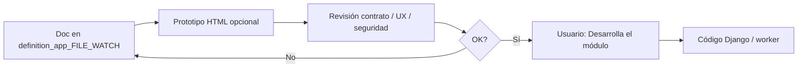

# definition_app_FILE_WATCH — Definición FILE WATCH

Carpeta de documentación de análisis y definición para **FILE WATCH** (recepción automática / bandeja vigilada).

> **Producto:** [`../FILE_WATCH.md`](../FILE_WATCH.md)  
> **Familia:** [`../APP_FACTORY.md`](../APP_FACTORY.md) · [`../APP_FACTORY_FILE_OPS.md`](../APP_FACTORY_FILE_OPS.md) §10  
> **Rama Git:** `diseno_desarrollo_FILE_WATCH` (despliegue Railway solo desde `main`)  
> **Estado:** **Implementado M1–M10** (app Django `apps.file_watch` MVP)  
> **No es un vertical de menú UF:** no hay `project_kind` por formato. Ingiere archivos y alimenta runners existentes o deja lote para [`../FILE_SCHEDULER.md`](../FILE_SCHEDULER.md)  
> **Chasis:** `Company`, tipos UA/US/UF, membresía PA/ED/GE/CO, billing/feature flags — alta de bandeja = **US PA/ED** de la compañía ([`wach_lifecycle.md`](wach_lifecycle.md)); identidad de monitor/fire = sistema ([`../security/SEGURIDAD_Y_ACCESOS.md`](../security/SEGURIDAD_Y_ACCESOS.md))  
> **Auditoría / errores:** hereda contrato de [`../FILE_PIPELINE.md`](../FILE_PIPELINE.md) §6 · §7 · §7.1 y [`../PLATFORM_API.md`](../PLATFORM_API.md) §9 · §10.2 · §11 — este producto añade lo **propio de la llegada** (bandeja + lote); no duplica pasos ni filas de app  
> **Contexto:** File Scheduler admite `input_origin=watch` + `watch_id`; bridge = `watch_claim.claim_pending_batch` + `schedule_tick`

---

## Método de trabajo (por módulo)

**Definir → (opcional) prototipo HTML de UI de bandejas → revisar → implementar solo con OK explícito.**

Hay dos entregables: **contrato de bandeja + intake/lote** (origen, storage, idempotencia) y **UI de CRUD** de watches (listado / alta / pausar). No generar la app Django hasta que el usuario diga «Desarrolla el módulo».



| Paso | Dónde | Quién |
|------|-------|--------|
| 1. Diseño, alcance, reglas, validaciones | `docs/definition_app_FILE_WATCH/<modulo>.md` | Agente + revisión |
| 2. Prototipo (si el módulo es UI) | `prototype/file_watch/` | Agente |
| 3. Revisión | Chat | Usuario |
| 4. Implementación | `apps.file_watch` (o capa de plataforma) + worker Railway | **Solo con OK explícito** |

Los módulos **especializan** un corte de [`../FILE_WATCH.md`](../FILE_WATCH.md). No copian el paraguas ni el §7.1 del Pipeline ni el CRUD del Scheduler.

---

## Documentos (por módulo)

| Archivo | Módulo | Contenido | Estado | Ancla producto |
|---------|--------|-----------|--------|----------------|
| [`../FILE_WATCH.md`](../FILE_WATCH.md) | Producto | Visión, fronteras Artifact vs Watch, coste, criterios | **Lineamientos** | — |
| [`wach_lifecycle.md`](wach_lifecycle.md) | **1** | Listado, alta, edición, pausar/reanudar, archivar bandeja | **Implementado** | §1 · §2 |
| [`wach_source.md`](wach_source.md) | **2** | Origen / adaptador (SFTP, carpeta, cloud…) — cierra forma de trabajo | **Implementado** | §3 |
| [`wach_intake.md`](wach_intake.md) | **3** | Llegada → storage / lote / hash | **Implementado** | §1 · §5 Artifact vs Watch |
| [`wach_route.md`](wach_route.md) | **4** | Enrutado a proyecto/versión o `pipeline_id` | **Implementado** | §1 · Pipeline |
| [`wach_fire.md`](wach_fire.md) | **5** | Disparo al llegar vs lote pendiente para Scheduler | **Implementado** | §4 |
| [`wach_idempotency.md`](wach_idempotency.md) | **6** | Duplicados, reintentos, cuotas | **Implementado** | §7 |
| [`wach_audit.md`](wach_audit.md) | **7** | CRUD append-only + llegada; enlace a Job/run | **Implementado** | (Pipeline/API) |
| [`wach_errors.md`](wach_errors.md) | **8** | Capas de error y códigos `watch_*` | **Implementado** | UI_MESSAGES |
| [`wach_notify.md`](wach_notify.md) | **9** | Correo/webhook al fallar ingestión o llegada | **Implementado** | §2 |
| [`wach_integration.md`](wach_integration.md) | **10** | Scheduler (`watch_id`), Pipeline, PLATFORM API, Railway | **Implementado** | §4 · Scheduler M3/M4 |

Los `.md` de módulo se crean **al abrir cada módulo**, no todos a la vez.

---

## Qué no va en esta carpeta

| Queda fuera | Dónde vive |
|-------------|------------|
| CRUD del plan / cron / tick | [`../definition_app_FILE_SCHEDULER/`](../definition_app_FILE_SCHEDULER/) |
| Destino Artifact (hash fijo) en el plan | [`../definition_app_FILE_SCHEDULER/sch_target.md`](../definition_app_FILE_SCHEDULER/sch_target.md) |
| Diseñador de pasos / handoff de pipeline | [`../definition_app_FILE_PIPELINE/`](../definition_app_FILE_PIPELINE/) |
| Auditoría HTTP de máquina | [`../definition_app_PLATFORM_API/pa_audit.md`](../definition_app_PLATFORM_API/pa_audit.md) |
| Rutas IFS dentro de File Gate / Pipe | **Prohibido** — viven aquí (Watch), no en cada app |
| Parsers / reglas de cada app | Specs de Gate, Pipe, Clean, etc. |

---

## Prototipos

| Carpeta | Contenido |
|---------|-----------|
| [`../../prototype/file_watch/`](../../prototype/file_watch/) | **M1**–**M10** (diseño completo; OK implementación pendiente) |

Abrir en **Simple Browser de Cursor** (DEBUG + `runserver`):

`http://127.0.0.1:8000/prototype/file_watch/`

También: `watch_notify.html` · `watch_integration.html`

| Prototipo | Módulo | Destino futuro |
|-----------|--------|----------------|
| `watches_list.html` | 1 | `templates/file_watch/…/list.html` |
| `watch_create.html` | 1 | `…/create.html` |
| `watch_hub.html` · `_active` · `_paused` | 1 | `…/hub.html` |
| `watch_edit.html` | 1 | `…/edit.html` |
| `watch_members.html` | 1 | `…/members.html` |
| `watches_list_help.html` · `watch_*_help.html` | 1 | `…/*_help.html` |
| `watch_source.html` · `watch_source_help.html` | **2** | `…/source.html` |
| `watch_intake.html` · `watch_intake_help.html` | **3** | `…/intake.html` |
| `watch_route.html` · `watch_route_help.html` | **4** | `…/route.html` |
| `watch_fire.html` · `watch_fire_help.html` | **5** | `…/fire.html` |
| `watch_idempotency.html` · `watch_idempotency_help.html` | **6** | `…/idempotency.html` |
| `watch_audit.html` · `_empty` · `_help` | **7** | `…/audit.html` |
| `watch_errors.html` · `watch_errors_help.html` | **8** | `…/errors.html` |
| `watch_notify.html` · `watch_notify_help.html` | **9** | `…/notify.html` |
| `watch_integration.html` · `watch_integration_help.html` | **10** | `…/integration.html` |

---

## Carpetas de trabajo (objetivo)

```
docs/
├── FILE_WATCH.md
└── definition_app_FILE_WATCH/
    └── README.md
    └── wach_*.md          ← al abrir cada módulo

prototype/file_watch/      ← M1–M10 (revisión UX / OK implementación)
apps/file_watch/           ← solo con «Desarrolla el módulo»
```

---

## Prioridad de diseño

Alineado a [`../FILE_WATCH.md`](../FILE_WATCH.md) §8. Forma de trabajo (§3) **cerrada en diseño** en M2.

| Orden | Módulo | Nota |
|-------|--------|------|
| 1 | M2 Origen (`wach_source`) | **Diseño hecho** — monitor + api_push; pipeline = destino |
| 2 | M1 Ciclo de vida | CRUD de la bandeja; crear = US PA/ED |
| 3 | M3 Intake | **Diseño hecho** — lote + hash; claim Scheduler |
| 4 | M5 Fire | **Diseño hecho** — on_arrival / pending_only |
| 5 | M4 Enrutado | **Diseño hecho** — job / pipeline / defer |
| 6 | M10 Integración | **Diseño hecho** — bridge `watch_id` → tick |
| 7 | M6 Idempotencia | **Diseño hecho** — dup / retry / cuota |
| 8 | M7 Auditoría | **Diseño hecho** — plano A/B + enlace Job |
| 9 | M8 Errores | **Diseño hecho** — capas + catálogo `watch_*` |
| 10 | M9 Notify | **Diseño hecho** — default off; intake/fire/run |

---

## Convención

- Copy: **bandeja / llegada / lote**, no “otro Scheduler” ni “otro ETL”.  
- **Artifact** (hash fijo en el plan) ≠ **Watch** (bandeja; cada llegada puede ser otro hash).  
- Formularios HTML plano; servicios `ok` / `error_code` / `user_message` ([`../definition_app/UI_MESSAGES.md`](../definition_app/UI_MESSAGES.md)).  
- Productivo = destino con **versión publicada** (proyecto o pipeline) cuando Watch dispare Job.  
- Un solo runner: UI, API, Watch y Scheduler no bifurcan semántica.  
- Pipeline: **delegar** `pipeline_id`; no reimplementar la cadena.  
- El monitor/fire **no** bypasea tenancy ni permisos de los proyectos destino.  
- Nombres de código (cuando existan): inglés; docs: español.

---

## Documentos relacionados

| Documento | Relación |
|-----------|----------|
| [`../FILE_WATCH.md`](../FILE_WATCH.md) | Producto paraguas |
| [`../FILE_SCHEDULER.md`](../FILE_SCHEDULER.md) | Disparo por tiempo; §4 frontera Watch; §10 entrada |
| [`../definition_app_FILE_SCHEDULER/`](../definition_app_FILE_SCHEDULER/) | Specs del plan; `sch_target` / `sch_tick` |
| [`../FILE_PIPELINE.md`](../FILE_PIPELINE.md) | Destino `pipeline_id`; §6 · §7.1 |
| [`../definition_app_FILE_PIPELINE/`](../definition_app_FILE_PIPELINE/) | Specs del orquestador |
| [`../PLATFORM_API.md`](../PLATFORM_API.md) | Disparador hermano; §9 · §10.2 · §11 |
| [`../definition_app_PLATFORM_API/`](../definition_app_PLATFORM_API/) | Patrón de carpeta (API) |
| [`../APP_FACTORY_FILE_OPS.md`](../APP_FACTORY_FILE_OPS.md) | §10 |
| [`../security/SEGURIDAD_Y_ACCESOS.md`](../security/SEGURIDAD_Y_ACCESOS.md) | Auth humana; monitor como sistema |
| [`../definition_app/UI_MESSAGES.md`](../definition_app/UI_MESSAGES.md) | Códigos y mensajes |
