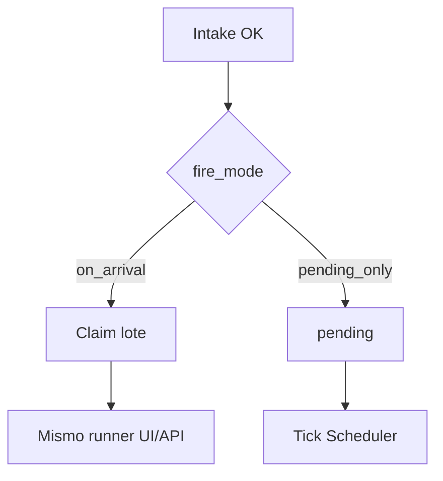

# Módulo 5 — Disparo (fire)

Decide **si** File Watch encola un Job/pipeline **en el momento de la llegada**, o **solo** deja el lote `pending` para que File Scheduler (u otro consumidor) lo tome después. No configura origen, intake ni el destino concreto (M2–M4).

> **Estado:** **Diseño M5** (spec + prototipos HTML); implementación Django / worker pendiente de OK  
> **Producto:** [`../FILE_WATCH.md`](../FILE_WATCH.md) §4  
> **Índice:** [`README.md`](README.md)  
> **Previo:** enrutado [`wach_route.md`](wach_route.md) · intake [`wach_intake.md`](wach_intake.md)  
> **Siguiente:** idempotencia [`wach_idempotency.md`](wach_idempotency.md) · integración [`wach_integration.md`](wach_integration.md)  
> **Prototipos:** [`../../prototype/file_watch/watch_fire.html`](../../prototype/file_watch/watch_fire.html) · [`watch_fire_help.html`](../../prototype/file_watch/watch_fire_help.html)  
> **Rama:** `diseno_desarrollo_FILE_WATCH`

---

## Propósito

Cierra los dos modos de producto §4:

1. **Watch dispara al llegar** — drop a las 14:37 → Job encolado de inmediato (usa enrutado M4).  
2. **Watch solo ingesta** — lote `pending`; el plan con `input_origin=watch` + código de bandeja dispara a las 02:00 (destino del **plan**).

```text
Lote M3 OK
  → Fire (este módulo)
       ├─ on_arrival  → claim + runner M4 (job/pipeline)
       └─ pending_only → queda pending (Scheduler / API claim)
```



**No cubre:** expresión cron, SFTP, hash Artifact, solape del plan, reintentos finos (M6).

---

## Acción en el hub

Enlace **Disparo** del rail → pantalla de este módulo (PA/ED). GE/CO: solo lectura.

Guardar **no** cambia `status`. Valida coherencia con M4 (`route_mode`).

Editar en bandeja `active`: aplica a **llegadas nuevas**; no re-dispara lotes ya `consumed`. Auditoría: `watch.fire_updated`.

No hay botón «Procesar ahora» en MVP de este módulo (ops futura / M10).

---

## Modelo (`fire_mode`)

| Campo | Obligatorio | Valores | Notas |
|-------|-------------|---------|--------|
| `fire_mode` | Sí | `on_arrival` · `pending_only` | Un solo modo por bandeja en MVP |
| `fire_complete` | Derivado | | Coherente con M4 |

### `on_arrival`

Tras intake OK:

1. Claim atómico del lote (`pending` → `claimed`).  
2. Resolver destino M4 (`job` o `pipeline` con publicada vigente).  
3. Encolar el **mismo** runner que UI / PLATFORM_API / Scheduler.  
4. Lote → `consumed` con `consumed_by=fire:{job_or_run_id}`.  
5. Evento `watch.fired`.

Si falla el encolado → lote según política M6/M8 (MVP tentativo: vuelve a `pending` o `intake_failed` de fire; documentar en M8: `watch_fire_failed`).

Exige `route_mode` ∈ {`job`, `pipeline`} y destino válido. **Prohibido** con `route_mode=defer`.

### `pending_only`

Tras intake OK:

1. Lote permanece `pending`.  
2. No se llama al runner desde Watch.  
3. Evento `watch.batch_ready` (o reutilizar `watch.batch_ingested` + modo).  

El Scheduler hace claim ([`wach_intake.md`](wach_intake.md) · [`sch_tick.md`](../definition_app_FILE_SCHEDULER/sch_tick.md)). Sin pending → `schedule_missing_input`.

Exige `route_mode=defer` **o** permite `job`/`pipeline` guardados pero **ignorados** hasta cambiar a `on_arrival`. **MVP estricto:** `pending_only` ⇒ recomendar/forzar `defer` al guardar (error `watch_fire_route_conflict` si `on_arrival` incompatibles).

**Decisión MVP:**  
- Guardar `on_arrival` con `defer` → error.  
- Guardar `pending_only` con `job`/`pipeline` → **permitido** (destino listo si más tarde cambian a `on_arrival`); el fire no los usa.

---

## Completitud para Activar / Reanudar

| `fire_mode` | Requisitos además de M2 |
|-------------|-------------------------|
| `on_arrival` | M4 `job` o `pipeline` completo (publicada) |
| `pending_only` | M4 puede ser `defer` (recomendado) o destino opcional |

Bandeja `inactive` / `archived`: el monitor no ingiere ni dispara (M1).

---

## Coherencia M4 ↔ M5

| fire_mode \ route_mode | `job` / `pipeline` | `defer` |
|------------------------|--------------------|---------|
| `on_arrival` | OK | **Error** `watch_fire_route_conflict` |
| `pending_only` | OK (destino en espera) | OK (típico Scheduler) |

UI: al elegir `on_arrival`, si hay `defer`, avisar y bloquear guardar hasta corregir Enrutado.

---

## Actor y tenancy

Fire = `system:file_watch`. No bypasea company ni permisos de ejecución del proyecto/pipeline (misma regla que Scheduler).

---

## Validación

| `error_code` (tentativo) | Cuándo |
|--------------------------|--------|
| `validation_required` | Falta `fire_mode` |
| `watch_fire_route_conflict` | `on_arrival` + `defer`, o destino incompleto al activar |
| `watch_no_published_target` | Fire intenta encolar sin publicada |
| `watch_forbidden` | GE/CO guarda |
| `watch_fire_failed` | Fallo al encolar (runtime; M8) |

Éxito UI: *Disparo guardado correctamente.*

---

## Autorización

PA/ED: editar. GE/CO: ver. Matriz M1.

---

## Relación con Scheduler

| Watch M5 | Scheduler |
|----------|-----------|
| `pending_only` | Plan `input_origin=watch` + código de bandeja; Destino del plan |
| `on_arrival` | El plan **puede** existir igual (reintentos / segundo Job); no es obligatorio |
| No guarda hash en el plan | Hash vive en el lote |

---

## Auditoría

| Evento | Cuándo |
|--------|--------|
| `watch.fire_updated` | Cambio de `fire_mode` |
| `watch.fired` | Encolado al llegar (job/run id, batch id, hash metadatos) |
| `watch.fire_skipped` | p. ej. bandeja inactive en carrera (raro) |

---

## Fuera de alcance

- Implementar claim en `schedule_runner` (M10).  
- «Ejecutar ahora» manual.  
- Disparar **y** dejar pending el mismo lote (doble consumo) — fuera de MVP.

---

## Criterio de aceptación del módulo (diseño)

- [x] Dos modos producto §4 modelados (`on_arrival` / `pending_only`).  
- [x] Reglas vs M4 `defer` / job / pipeline.  
- [x] Mismo runner; lote claim/consumed.  
- [x] Prototipos + ayuda + hub.

---

## Documentos relacionados

| Documento | Relación |
|-----------|----------|
| [`../FILE_WATCH.md`](../FILE_WATCH.md) | §4 modos |
| [`wach_route.md`](wach_route.md) | Destino si `on_arrival` |
| [`wach_intake.md`](wach_intake.md) | Lote pending / claim |
| [`../definition_app_FILE_SCHEDULER/sch_target.md`](../definition_app_FILE_SCHEDULER/sch_target.md) | Destino del plan |
| [`../definition_app_FILE_SCHEDULER/sch_tick.md`](../definition_app_FILE_SCHEDULER/sch_tick.md) | Claim / missing input |
| [`../definition_app/UI_MESSAGES.md`](../definition_app/UI_MESSAGES.md) | Textos al implementar |
