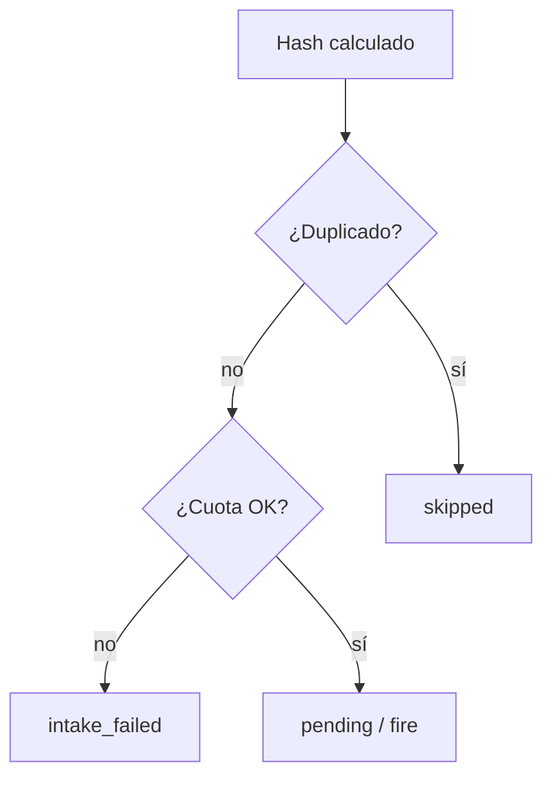

# Módulo 6 — Idempotencia (duplicados, reintentos, cuotas)

Políticas que evitan procesar dos veces el mismo contenido, acotan reintentos de intake/fire y limitan volumen por bandeja. No configura origen, destino ni modo de disparo (M2–M5).

> **Estado:** **Diseño M6** (spec + prototipos HTML); implementación Django / worker pendiente de OK  
> **Producto:** [`../FILE_WATCH.md`](../FILE_WATCH.md) §2 · §7  
> **Índice:** [`README.md`](README.md)  
> **Previo:** intake [`wach_intake.md`](wach_intake.md) · fire [`wach_fire.md`](wach_fire.md)  
> **Siguiente:** auditoría [`wach_audit.md`](wach_audit.md) · errores [`wach_errors.md`](wach_errors.md)  
> **Prototipos:** [`../../prototype/file_watch/watch_idempotency.html`](../../prototype/file_watch/watch_idempotency.html) · [`watch_idempotency_help.html`](../../prototype/file_watch/watch_idempotency_help.html)  
> **Rama:** `diseno_desarrollo_FILE_WATCH`

---

## Propósito

Tras calcular el hash en M3 (o al fallar un paso), este módulo responde:

1. **¿Ya vimos este contenido?** → omitir, aceptar o sustituir.  
2. **¿Cuántas veces reintentar** un intake/fire fallido?  
3. **¿Cuánto volumen** puede acumular la bandeja (pending, llegadas/día, bytes)?

```text
Candidato M2 → bytes → hash (M3)
  → Idempotencia (este módulo): duplicado? cuota?
  → Lote pending / skipped / intake_failed
  → Fire M5 o claim Scheduler
```



**No cubre:** solape de ticks del Scheduler (M5 Scheduler), parsers de app, notificaciones (M9).

---

## Acción en el hub

Enlace **Idempotencia** del rail → pantalla de políticas (PA/ED). GE/CO: solo lectura.

Guardar **no** cambia `status` ni reescribe lotes existentes. Auditoría: `watch.idempotency_updated`.

Completitud: **opcional para Activar** (defaults seguros). Sin guardar, aplican defaults de la tabla abajo.

---

## Duplicados

Clave primaria de duplicado en MVP: **`content_hash`** (SHA-256) dentro de la misma bandeja (`watch_id` + company).

| Campo | Default | Valores | Efecto |
|-------|---------|---------|--------|
| `dup_policy` | `skip` | `skip` · `allow` · `replace_pending` | Ver abajo |
| `dup_scope` | `watch` | `watch` | Solo esta bandeja (MVP). `company` = fuera de MVP |
| `dup_window_days` | `365` | 1–3650 | Mirar lotes con `ingested_at` en la ventana (también `consumed` / `skipped`) |

### Políticas

| `dup_policy` | Comportamiento |
|--------------|----------------|
| `skip` | Si existe lote previo con el mismo hash en la ventana → nuevo registro `skipped` + `error_code=watch_duplicate_content` (o solo evento, sin segundo storage — MVP: no re-copiar bytes). |
| `allow` | Siempre crea lote nuevo (mismo hash permitido). Útil si el consumidor debe ver cada llegada de nombre distinto. |
| `replace_pending` | Si hay `pending` con el mismo hash → lo marca `skipped` (reemplazado) y crea el nuevo `pending`. No toca `consumed`. |

**Nombre de archivo:** no es clave de idempotencia en MVP (dos días distintos → nombres distintos → hashes distintos). Opcional futuro: `dup_also_filename` (fuera de MVP).

Mismo contenido dos veces el mismo día → `skip` evita doble Job / doble pending.

---

## Reintentos

Aplica a fallos **antes** de `consumed` (intake inestable, store, fire enqueue).

| Campo | Default | Notas |
|-------|---------|-------|
| `retry_max` | `3` | Intentos totales de intake o de fire enqueue |
| `retry_backoff_sec` | `60` | Espera base; worker puede usar backoff lineal/exponencial simple |
| `retry_on` | `intake_failed` · `watch_fire_failed` | Códigos reintentables (lista fija MVP) |

Tras agotar reintentos → lote `intake_failed` (o estado fire fallido) + evento; M9 puede avisar.

**Job ya `consumed` que falla en Gate/Pipe:** no lo “revive” Watch. Reproceso = Artifact en Scheduler o re-upload. Opción PA «Reabrir como pending» = fuera de MVP (ops).

Claim atómico (M3) ya evita doble consumo concurrente; este módulo no redefine claim.

---

## Cuotas

| Campo | Default | Efecto al superar |
|-------|---------|-------------------|
| `quota_max_pending` | `50` | Nueva llegada → `skipped` / `watch_quota_pending` (no crea pending extra) |
| `quota_max_arrivals_per_day` | `200` | `watch_quota_daily` |
| `quota_max_bytes_per_day` | `0` = ilimitado (sujeto a `max_bytes` por archivo en M3) | `watch_quota_bytes` |

Cuotas son por **bandeja**. Soft vs hard: MVP = **hard** (bloquea intake de nuevos pending). Contadores en timezone de la compañía.

`max_bytes` por archivo sigue en política de intake (M3); aquí es volumen agregado.

---

## Modelo de config (tentativo)

Persistido en la bandeja (JSON o columnas). Defaults al crear la bandeja (M1).

| Campo | Tipo |
|-------|------|
| `dup_policy` | enum |
| `dup_window_days` | int |
| `retry_max` | int |
| `retry_backoff_sec` | int |
| `quota_max_pending` | int |
| `quota_max_arrivals_per_day` | int |
| `quota_max_bytes_per_day` | int (0 = off) |

---

## Validación

| `error_code` (tentativo) | Cuándo |
|--------------------------|--------|
| `validation_required` | Campos vacíos / fuera de rango |
| `watch_forbidden` | GE/CO guarda |
| `watch_duplicate_content` | Runtime: omitido por hash (capa lote / M8) |
| `watch_quota_pending` · `watch_quota_daily` · `watch_quota_bytes` | Runtime cuota |

Éxito UI: *Política de idempotencia guardada correctamente.*

---

## Autorización

PA/ED: editar. GE/CO: ver. Matriz M1.

---

## Relación con otros módulos

| Este módulo | Otro |
|-------------|------|
| Decide skip tras hash | M3 crea `skipped` o no materializa de más |
| Reintento intake/fire | M3 / M5 / M8 |
| Cuota pending | Scheduler ve menos lotes → más `schedule_missing_input` si ops se pasa |
| No es Artifact | Artifact = reproceso consciente del **mismo** hash en el plan |

---

## Auditoría

| Evento | Payload |
|--------|---------|
| `watch.idempotency_updated` | actor + snapshot de políticas |
| `watch.batch_skipped` | batch/hash, razón (`duplicate` / `quota_*`) |
| `watch.retry_scheduled` | intento n, backoff |

---

## Fuera de alcance

- Deduplicar entre bandejas distintas.  
- Reabrir Job fallido de app.  
- Cuotas de billing de plataforma (otro doc).

---

## Criterio de aceptación del módulo (diseño)

- [x] `dup_policy` skip / allow / replace_pending por hash.  
- [x] Reintentos acotados intake/fire.  
- [x] Cuotas pending / día / bytes.  
- [x] Prototipos + ayuda + hub.

---

## Documentos relacionados

| Documento | Relación |
|-----------|----------|
| [`../FILE_WATCH.md`](../FILE_WATCH.md) | §7 riesgos |
| [`wach_intake.md`](wach_intake.md) | Hash, estados skipped |
| [`wach_fire.md`](wach_fire.md) | Reintento enqueue |
| [`wach_errors.md`](wach_errors.md) | Códigos runtime |
| [`../definition_app/UI_MESSAGES.md`](../definition_app/UI_MESSAGES.md) | Textos al implementar |
